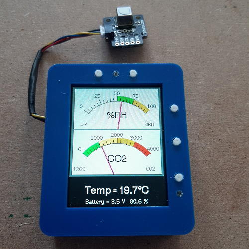
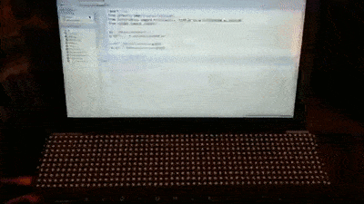
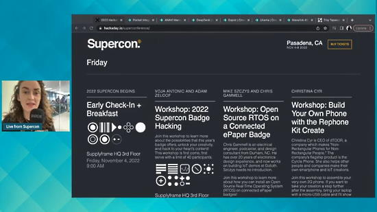
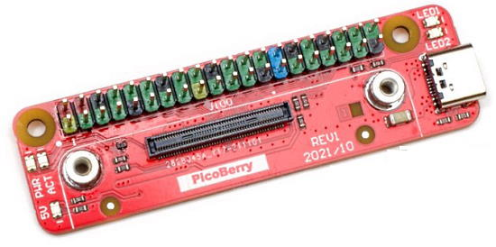
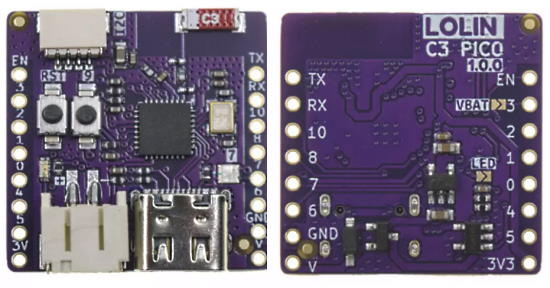
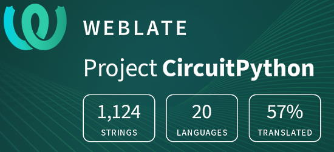

- [X] Kattni updates
- [ ] change date
- [ ] update title
- [ ] Feature story
- [ ] Update  for images
- [ ] Update ICYDNCI
- [ ] All images 550w max only
- [ ] Link "View this email in your browser."

News Sources

- [python.org](https://www.python.org/)
- [Python Insider - dev team blog](https://pythoninsider.blogspot.com/)
- [MicroPython Meetup Blog](https://melbournemicropythonmeetup.github.io/)
- [hackaday.io newest projects MicroPython](https://hackaday.io/projects?tag=micropython&sort=date) and [CircuitPython](https://hackaday.io/projects?tag=circuitpython&sort=date)
- [hackaday CircuitPython](https://hackaday.com/blog/?s=circuitpython) and [MicroPython](https://hackaday.com/blog/?s=micropython)
- [hackster.io CircuitPython](https://www.hackster.io/search?q=circuitpython&i=projects&sort_by=most_recent) and [MicroPython](https://www.hackster.io/search?q=micropython&i=projects&sort_by=most_recent)
- [https://opensource.com/tags/python](https://opensource.com/tags/python)

View this email in your browser. **Warning: Flashing Imagery**

Welcome to the latest Python on Microcontrollers newsletter!  - *Ed.*

We're on [Discord](https://discord.gg/HYqvREz), [Twitter](https://twitter.com/search?q=circuitpython&src=typed_query&f=live), and for past newsletters - [view them all here](https://www.adafruitdaily.com/category/circuitpython/). If you're reading this on the web, [subscribe here](https://www.adafruitdaily.com/). Here's the news this week:

## Headline

text - [site](url).

## The CircuitPython Online IDE now supports the CircuitPython 8 Status Bar

The CircuitPython Online IDE now supports Status Bar introduced in CircuitPython 8.0.0 - [CircuitPython Online IDE](https://urfdvw.github.io/CircuitPython-online-IDE/) via [Twitter](https://twitter.com/River___Wang/status/1587626530917728256).

## EuroPython 2022 Videos Now Available

EuroPython 2022 was held online and in Dublin, Ireland from 11 - 17 July 2022.  The organizers are now releasing videos in batches, one day per week. Brought to you by the EuroPython 2022 Team and the EuroPython Society - [YouTube Playlist](https://www.youtube.com/playlist?list=PL8uoeex94UhE2pLJUo9ouV0h5yRtt3CAG).

And here is Andy Piper's introductory MicroPython talk - [YouTube](https://youtu.be/sXiKAP7eqSY).

## Pimoroni Galactic Unicorn Released

Galactic Unicorn is a massive sparkly 53 x 11 (583) RGB LED matrix with amplifier & speaker, powered by a Raspberry Pi Pico W running Pimoroni's fork of MicroPython. The LEDs can be strobed at 300 fps at 14-bit precision - [Pimoroni](https://shop.pimoroni.com/products/galactic-unicorn?variant=40057440960595).

Les takes the Galactic Unicorn for a spin with animated text - [Twitter](https://twitter.com/biglesp/status/1588477003677978624).

3D printed case - [GitHub](https://github.com/ucl-casa-ce/Galactic-Unicorn-MQTT-Scroller/tree/main/3DPrintedCase).

## This Week's Python Streams

Python on Hardware is all about building a cooperative ecosphere which allows contributions to be valued and to grow knowledge. Below are the streams within the last week focusing on the community.

### CircuitPython Deep Dive Stream

[This week](https://youtu.be/lokPcnKKgHY), Tim streamed work on Hidden Functionality for Core Module Vectorio.

You can see the latest video and past videos on the Adafruit YouTube channel under the Deep Dive playlist - [YouTube](https://www.youtube.com/playlist?list=PLjF7R1fz_OOXBHlu9msoXq2jQN4JpCk8A).

### CircuitPython Parsec

John Park’s CircuitPython Parsec was not broadcast this week. Catch all the episodes in the [YouTube playlist](https://www.youtube.com/playlist?list=PLjF7R1fz_OOWFqZfqW9jlvQSIUmwn9lWr).

### The CircuitPython Show

The CircuitPython Show is an independent podcast hosted by Paul Cutler, focusing on the people doing awesome things with CircuitPython. Each episode features Paul in conversation with a guest for a short interview – [CircuitPythonShow](https://circuitpythonshow.com/) and [Twitter](https://twitter.com/circuitpyshow).

The CircuitPython Show is off this week.  Last week featured Jason Pecor discussing the River Prairie Trolls. Next Monday, Joey Castillo of Oddly Specific Objects joins the show – [Show List](https://circuitpythonshow.com/episodes/all).

## Project of the Week

Brian Welsby used a Pimoroni Tufty with a SCD41 sensor breakout and MicroPython to make this carbon dioxide and humidity monitor with analog meter aesthetics. He converted some C code to MicroPytho for the build - [Twitter Thread](https://twitter.com/TheFlyingKipper/status/1588521851260907520).

## News from around the web!

A Mastodon "Cyberdeck" using a Raspberry Pi 3, a black and white TV and a thermal printer. All implemented using Python. The lastest toot from the timeline is on the screen and the notifications are printed - [Twitter](https://twitter.com/dec_hl/status/1588832860446019584).

Les' disco MicroPython test code that he uses for all LED matrices on a Pimoroni Galactic Unicorn - [Twitter](https://twitter.com/biglesp/status/1588984177667739648).

AI robots: they can tell jokes and the weather. Python for the AI, speech synthesis and voice recognition. The flashy eyes and eye movements are done using MicroPython on the Plasma 2040 and Servo 2040 by Pimoroni - [Twitter](https://twitter.com/kevsmac/status/1589576705655832576) and [Tutorial](http://www.kevsrobots.com/robots/pythonai/).

Teardown Session 33 from this past weekend's Hackaday Supercon with any makers - [YouTube](https://www.youtube.com/watch?v=FzihKE37w-M).

text - [site](url).

MQTT Scroller for the Pimoroni Galactic Unicon with Pi Pico W - [GitHub](https://github.com/ucl-casa-ce/Galactic-Unicorn-MQTT-Scroller).

Using the ADC Pi with the Raspberry Pi Pico and MicroPython - [AB Electronics UK](https://www.abelectronics.co.uk/kb/article/1102/adc-pi-with-raspberry-pi-pico).

text - [site](url).

text - [site](url).

text - [site](url).

text - [site](url).

text - [site](url).

text - [site](url).

text - [site](url).

text - [site](url).

text - [site](url).

text - [site](url).

Python 3.11 in 100 Seconds - [Adafruit Blog](https://blog.adafruit.com/2022/11/04/python-3-11-in-100-seconds-python-mkennedy/) and [YouTube](https://youtu.be/8NQGZA1wWiQ).

PyDev of the Week: NAME on [Mouse vs Python]()

CircuitPython Weekly Meeting for DATE ([notes]()) [on YouTube]()

#ICYDNCI What was the most popular, most clicked link, in [last week's newsletter](https://www.adafruitdaily.com/2022/11/01/python-on-microcontrollers-newsletter-halloween-wraps-circuitpython-beta-4-macos-ventura-issue-more-circuitpython-micropython-thepsf-raspberry_pi/)? [CircuitPython eyeball motion tracking](https://twitter.com/todbot/status/1584662808691896320).**

## New Hardware

EsPiFF - contains an ESP32 plus a RP2040 in a Raspberry Pi form factor and uses existing Pi HATS and enclosures - [hackster.io](https://www.hackster.io/espiff/espiff-an-esp32-rp2040-in-the-raspi-form-factor-b9cce5).

PicoBerry is a tiny Raspberry Pi CM4 carrier board, with full 40-pin GPIO header, USB-C connector for power supply, 2 user and system CM4 LEDs! Open Sourcce Hardware certified - [GitHub](https://github.com/mfolejewski/PicoBerry) and [OSHWA](https://certification.oshwa.org/pl000010.html) via [Twitter](https://twitter.com/oshwassociation/status/1588325402543390720).

LOLIN C3 Pico is a tiny (25.4×25.4mm) ESP32-C3 RISC-V board with 2.4 GHz WiFi and Bluetooth Low Energy connectivity, a few I/Os, and LiPo battery support including charging circuitry - [CNX Software](https://www.cnx-software.com/2022/10/28/lolin-c3-pico-esp32-c3-board-battery-charging-support/).

## New Boards Supported by CircuitPython

The number of supported microcontrollers and Single Board Computers (SBC) grows every week. This section outlines which boards have been included in CircuitPython or added to [CircuitPython.org](https://circuitpython.org/).

This week, there were (#/no) new boards added!

- [Board name](url)
- [Board name](url)
- [Board name](url)

*Note: For non-Adafruit boards, please use the support forums of the board manufacturer for assistance, as Adafruit does not have the hardware to assist in troubleshooting.*

Looking to add a new board to CircuitPython? It's highly encouraged! Adafruit has four guides to help you do so:

- [How to Add a New Board to CircuitPython](https://learn.adafruit.com/how-to-add-a-new-board-to-circuitpython/overview)
- [How to add a New Board to the circuitpython.org website](https://learn.adafruit.com/how-to-add-a-new-board-to-the-circuitpython-org-website)
- [Adding a Single Board Computer to PlatformDetect for Blinka](https://learn.adafruit.com/adding-a-single-board-computer-to-platformdetect-for-blinka)
- [Adding a Single Board Computer to Blinka](https://learn.adafruit.com/adding-a-single-board-computer-to-blinka)

## New Learn Guides!

[Magic Band Reader](https://learn.adafruit.com/magic-band-reader) from [Noe and Pedro](https://learn.adafruit.com/u/pixil3d)

[IBM PC Keyboard to USB HID with CircuitPython](https://learn.adafruit.com/ibm-pc-keyboard-to-usb-hid-with-circuitpython) from [Jeff Epler](https://learn.adafruit.com/u/jepler)

[Bluetooth CLUE Robot Car using CircuitPython](https://learn.adafruit.com/bluetooth-clue-robot-car-using-circuitpython) from [Melissa LeBlanc-Williams](https://learn.adafruit.com/u/MakerMelissa)

[Adafruit PCF8575 I2C 16 GPIO Expander Breakout](https://learn.adafruit.com/adafruit-pcf8575) from [Kattni](https://learn.adafruit.com/u/kattni)

## Updated Learn Guides

[How to Add a New Board to CircuitPython](https://learn.adafruit.com/how-to-add-a-new-board-to-circuitpython/overview) from [Kattni](https://learn.adafruit.com/u/kattni)

## CircuitPython Libraries!

CircuitPython support for hardware continues to grow. We are adding support for new sensors and breakouts all the time, as well as improving on the drivers we already have. As we add more libraries and update current ones, you can keep up with all the changes right here!

For the latest libraries, download the [Adafruit CircuitPython Library Bundle](https://circuitpython.org/libraries). For the latest community contributed libraries, download the [CircuitPython Community Bundle](https://github.com/adafruit/CircuitPython_Community_Bundle/releases).

If you'd like to contribute, CircuitPython libraries are a great place to start. Have an idea for a new driver? File an issue on [CircuitPython](https://github.com/adafruit/circuitpython/issues)! Have you written a library you'd like to make available? Submit it to the [CircuitPython Community Bundle](https://github.com/adafruit/CircuitPython_Community_Bundle). Interested in helping with current libraries? Check out the [CircuitPython.org Contributing page](https://circuitpython.org/contributing). We've included open pull requests and issues from the libraries, and details about repo-level issues that need to be addressed. We have a guide on [contributing to CircuitPython with Git and GitHub](https://learn.adafruit.com/contribute-to-circuitpython-with-git-and-github) if you need help getting started. You can also find us in the #circuitpython channels on the [Adafruit Discord](https://adafru.it/discord).

You can check out this [list of all the Adafruit CircuitPython libraries and drivers available](https://github.com/adafruit/Adafruit_CircuitPython_Bundle/blob/master/circuitpython_library_list.md). 

The current number of CircuitPython libraries is **389**!

**New Libraries!**

Here's this week's new CircuitPython libraries:

  * [Adafruit_CircuitPython_Pastebin](https://github.com/adafruit/Adafruit_CircuitPython_Pastebin)

**Updated Libraries!**

Here's this week's updated CircuitPython libraries:
  * [Adafruit_CircuitPython_ESP_ATcontrol](https://github.com/adafruit/Adafruit_CircuitPython_ESP_ATcontrol)
  * [Adafruit_CircuitPython_HT16K33](https://github.com/adafruit/Adafruit_CircuitPython_HT16K33)
  * [Adafruit_CircuitPython_MLX90395](https://github.com/adafruit/Adafruit_CircuitPython_MLX90395)
  * [Adafruit_CircuitPython_MLX90614](https://github.com/adafruit/Adafruit_CircuitPython_MLX90614)
  * [Adafruit_CircuitPython_Wiznet5k](https://github.com/adafruit/Adafruit_CircuitPython_Wiznet5k)
  * [CircuitPython_Community_Bundle](https://github.com/adafruit/CircuitPython_Community_Bundle)

**CircuitPython Library PyPI Weekly Download Stats!**

* **Total Library Stats**
  * 239626 PyPI downloads over 324 libraries
* **Top 10 Libraries by PyPI Downloads**
  * adafruit-circuitpython-busdevice: 26676
  * adafruit-circuitpython-requests: 25631
  * adafruit-circuitpython-typing: 25083
  * adafruit-circuitpython-register: 1696
  * adafruit-circuitpython-bitbangio: 1268
  * adafruit-circuitpython-motor: 1176
  * adafruit-circuitpython-ble: 1113
  * adafruit-circuitpython-gps: 1055
  * adafruit-circuitpython-esp32spi: 1041
  * adafruit-circuitpython-wiznet5k: 1033

## What’s the team up to this week?

What is the team up to this week? Let’s check in!

**Kattni**

This week I mostly worked on the PiCowbell Proto guide. This guide will include four different ways to assemble the PiCowbell with a Pico, including images of the entire process to ensure you have success when assembling yours. There will also be a pinouts page, and examples of detecting a STEMMA QT sensor plugged into the PiCowbell using CircuitPython and Arduino. If you picked up one of these handy boards, keep an eye out for this guide for details!

I also worked with Alec on prototyping a setup to obtain the CircuitPython Library PyPI download stats. A few years ago, PyPI stopped providing that data directly, as the number of packages had reached a point that providing that data was untenable for them. We considered trying to do it ourselves at that point, but nothing came of it. Last week, I brought it up to Alec, who jumped on it, and had an initial setup going the following day. So! The plan is to include the entire list of libraries in a new auto-generated file in the Adafruit CircuitPython Bundle, and the top ten PyPI downloaded libraries in both the CircuitPython Weekly Meetings and this newsletter. We're working on getting it implemented now and it might be included as soon as this newsletter! If not, keep an eye out for it soon.

**Melissa**

This past week, I finished up writing the [Bluetooth CLUE Robot Car using CircuitPython](https://learn.adafruit.com/bluetooth-clue-robot-car-using-circuitpython) guide from my CircuitPython Day Livestream. This uses a CLUE board and a Ring:Bit Car Kit for a great introduction to robotics using CircuitPython.

I also update the [Using Google Assistant on the BrainCraft HAT or Voice Bonnet](https://learn.adafruit.com/using-google-assistant-on-the-braincraft-hat) guide. Google had deprecated authenticating production projects, so making it test project fixed that issue. The software packages had also been updated and a key package had breaking changes and was no longer being maintained. I was able to fork the repo and fix the issues.

**Tim**

In the past week I made a pass through all eligible hacktoberfest PRs to label and review them. I made UI enhancements to the Pico W Trivia game and began modeled a 3D printable case for it. The first real print will be a test plate to ensure all mounting features are located properly.

**Jeff**

Another month, another keyboard! This week I published a guide on the Adafruit Learning System showing how to hook up a vintage IBM PC keyboard to a modern PC using CircuitPython. You can [check the guide out now](https://learn.adafruit.com/ibm-pc-keyboard-to-usb-hid-with-circuitpython).

**Liz**

This past week I worked on a [CircuitPython HTTP server with the Pico W](https://learn.adafruit.com/pico-w-http-server-with-circuitpython). It was a lot of fun to work on and a great learning experience. It shows folks how to pass the HTML code with CSS styling as an f string so that variables from code.py can be included, such as sensor data. There are also buttons on the HTML site that can turn the onboard LED on and off and turn on the party parrot animation on the OLED screen (my favorite displayio trick/test). These buttons work by sending HTTP POST requests. I hope this will be a good example for folks that want to try out setting up an HTTP server.

## Upcoming events!

The next MicroPython Meetup in Melbourne will be on October 28th – [Meetup](https://www.meetup.com/MicroPython-Meetup/). See the [slides](https://www.youtube.com/watch?v=xIVE4KeflFY) of the September 28th meeting.

RISC-V Global Summit, December 12-15, 2022 San Jose, California US - [Linux Foundation](https://events.linuxfoundation.org/riscv-summit/), [YouTube](https://youtu.be/VecaMNCuuF0) via [Twitter](https://twitter.com/risc_v/status/1564719040588926979).

PyCon US 2023 will be April 19-17, 2023, again in Salt Lake City, Utah US - [PyCon US 2023](https://pycon.blogspot.com/2020/12/announcing-pycon-us-20222023.html).

**Send Your Events In**

As for other events, with the COVID pandemic, most in-person events are postponed or held online. If you know of virtual events or upcoming events, please let us know on Twitter with hashtag #CircuitPython or email to cpnews(at)adafruit(dot)com.

## Latest releases

CircuitPython's stable release is [#.#.#](https://github.com/adafruit/circuitpython/releases/latest) and its unstable release is [#.#.#-##.#](https://github.com/adafruit/circuitpython/releases). New to CircuitPython? Start with our [Welcome to CircuitPython Guide](https://learn.adafruit.com/welcome-to-circuitpython).

[2022####](https://github.com/adafruit/Adafruit_CircuitPython_Bundle/releases/latest) is the latest CircuitPython library bundle.

[v#.#.#](https://micropython.org/download) is the latest MicroPython release. Documentation for it is [here](http://docs.micropython.org/en/latest/pyboard/).

[#.#.#](https://www.python.org/downloads/) is the latest Python release. The latest pre-release version is [#.#.#](https://www.python.org/download/pre-releases/).

[#,### Stars](https://github.com/adafruit/circuitpython/stargazers) Like CircuitPython? [Star it on GitHub!](https://github.com/adafruit/circuitpython)

## Call for help -- Translating CircuitPython is now easier than ever!

One important feature of CircuitPython is translated control and error messages. With the help of fellow open source project [Weblate](https://weblate.org/), we're making it even easier to add or improve translations. 

Sign in with an existing account such as GitHub, Google or Facebook and start contributing through a simple web interface. No forks or pull requests needed! As always, if you run into trouble join us on [Discord](https://adafru.it/discord), we're here to help.

## jobs.adafruit.com - Find a dream job, find great candidates!

[jobs.adafruit.com](https://jobs.adafruit.com/) has returned and folks are posting their skills (including CircuitPython) and companies are looking for talented makers to join their companies - from Digi-Key, to Hackaday, Micro Center, Raspberry Pi and more.

**Job of the Week**

Vertical Farm Maker - Area 2 Farms - [Adafruit Jobs Board](https://jobs.adafruit.com/job/vertical-farm-maker/).

## 35,819 thanks!

The Adafruit Discord community, where we do all our CircuitPython development in the open, reached over 35,819 humans - thank you!  Adafruit believes Discord offers a unique way for Python on hardware folks to connect. Join today at [https://adafru.it/discord](https://adafru.it/discord).

## ICYMI - In case you missed it

Python on hardware is the Adafruit Python video-newsletter-podcast! The news comes from the Python community, Discord, Adafruit communities and more and is broadcast on ASK an ENGINEER Wednesdays. The complete Python on Hardware weekly videocast [playlist is here](https://www.youtube.com/playlist?list=PLjF7R1fz_OOXRMjM7Sm0J2Xt6H81TdDev). The video podcast is on [iTunes](https://itunes.apple.com/us/podcast/python-on-hardware/id1451685192?mt=2), [YouTube](http://adafru.it/pohepisodes), [IGTV (Instagram TV](https://www.instagram.com/adafruit/channel/)), and [XML](https://itunes.apple.com/us/podcast/python-on-hardware/id1451685192?mt=2).

[The weekly community chat on Adafruit Discord server CircuitPython channel - Audio / Podcast edition](https://itunes.apple.com/us/podcast/circuitpython-weekly-meeting/id1451685016) - Audio from the Discord chat space for CircuitPython, meetings are usually Mondays at 2pm ET, this is the audio version on [iTunes](https://itunes.apple.com/us/podcast/circuitpython-weekly-meeting/id1451685016), Pocket Casts, [Spotify](https://adafru.it/spotify), and [XML feed](https://adafruit-podcasts.s3.amazonaws.com/circuitpython_weekly_meeting/audio-podcast.xml).

## Codecademy "Learn Hardware Programming with CircuitPython"

Codecademy, an online interactive learning platform used by more than 45 million people, has teamed up with Adafruit to create a coding course, “Learn Hardware Programming with CircuitPython”. The course is now available in the [Codecademy catalog](https://www.codecademy.com/learn/learn-circuitpython?utm_source=adafruit&utm_medium=partners&utm_campaign=circuitplayground&utm_content=pythononhardwarenewsletter).

## Contribute!

The CircuitPython Weekly Newsletter is a CircuitPython community-run newsletter emailed every Tuesday. The complete [archives are here](https://www.adafruitdaily.com/category/circuitpython/). It highlights the latest CircuitPython related news from around the web including Python and MicroPython developments. To contribute, edit next week's draft [on GitHub](https://github.com/adafruit/circuitpython-weekly-newsletter/tree/gh-pages/_drafts) and [submit a pull request](https://help.github.com/articles/editing-files-in-your-repository/) with the changes. You may also tag your information on Twitter with #CircuitPython. 

Join the Adafruit [Discord](https://adafru.it/discord) or [post to the forum](https://forums.adafruit.com/viewforum.php?f=60) if you have questions.
