- [X] Kattni updates
- [ ] change date
- [ ] update title
- [ ] Feature story
- [ ] Update  for images
- [ ] Update ICYDNCI
- [ ] All images 550w max only
- [ ] Link "View this email in your browser."

News Sources

- [python.org](https://www.python.org/)
- [Python Insider - dev team blog](https://pythoninsider.blogspot.com/)
- [MicroPython Meetup Blog](https://melbournemicropythonmeetup.github.io/)
- [hackaday.io newest projects MicroPython](https://hackaday.io/projects?tag=micropython&sort=date) and [CircuitPython](https://hackaday.io/projects?tag=circuitpython&sort=date)
- [hackaday CircuitPython](https://hackaday.com/blog/?s=circuitpython) and [MicroPython](https://hackaday.com/blog/?s=micropython)
- [hackster.io CircuitPython](https://www.hackster.io/search?q=circuitpython&i=projects&sort_by=most_recent) and [MicroPython](https://www.hackster.io/search?q=micropython&i=projects&sort_by=most_recent)
- [https://opensource.com/tags/python](https://opensource.com/tags/python)

View this email in your browser. **Warning: Flashing Imagery**

Welcome to the latest Python on Microcontrollers newsletter! Change is in the air. Ardiono embracing MicroPython in a bigger way kicks off this week's news. We also feature our first In the News from Mastodon as users migrate from Twitter. Some of Adafruit's  - *Ed.*

We're on [Discord](https://discord.gg/HYqvREz), [Twitter](https://twitter.com/search?q=circuitpython&src=typed_query&f=live), and for past newsletters - [view them all here](https://www.adafruitdaily.com/category/circuitpython/). If you're reading this on the web, [subscribe here](https://www.adafruitdaily.com/). Here's the news this week:

## Arduino to support use of MicroPython in Arduino Lab for MicroPython

Arduino has partnered with Damien George to use MicroPython on a number of Arduino products. The new alpha ARduino Lab for MicroPython is a rebranded fork of work done by Murilo Polese on an IDE which has a similar look to the current Arduini IDE - [Arduino Blog](https://blog.arduino.cc/2022/11/10/micropython-officially-becomes-part-of-the-arduino-ecosystem/) and [Arduino Labs](https://labs.arduino.cc/en).

## PyScript Updates: Bytecode Alliance, Pyodide, and MicroPython

Earlier this year, [Anaconda unveiled PyScript](https://www.adafruitdaily.com/2022/05/03/python-on-microcontrollers-newsletter-micropython-turns-9-pyconus-2022-and-more-python-circuitpython-micropython-thepsf/) to enable users to create Python applications in the browser. In order for PyScript to succeed, Anaconda must make strategic investments in both the project itself and its core technology dependencies, such as WebAssembly (Wasm) and the fantastic Pyodide open-source project (PyScript’s primary runtime). To that end, PyScript has been improving its technical foundations over the past few months - [anaconda.com](https://www.anaconda.com/blog/pyscript-updates-bytecode-alliance-pyodide-and-micropython).

> We are showcasing a technical preview of a new runtime for PyScript based on MicroPython. MicroPython is excellent at running in constrained environments without an operating system and with limited resources. When you apply MicroPython to Wasm in its default configuration, something new and exciting emerges: With a total size of 303KB, this new runtime loads instantly and starts executing MicroPython logic in less than 100ms. &nbsp; While very early in the development process, this runtime will be excellent for creative, educational, and visualization use cases. The MicroPython runtime enables PyScript in many development scenarios where the current runtime loading performance is problematic. Since PyScript supports multiple runtimes via configuration, developers can choose the runtime that best fits the particular problem.

## Python Cheat Sheets Compendium

[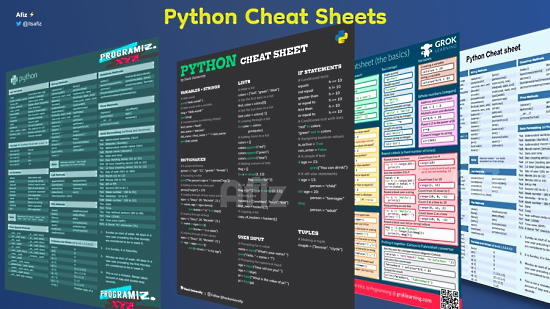](https://twitter.com/itsafiz/status/1591788434355802115)

Cheat sheets / reference pages come in handy when you are coding, irrespective of whether you are a junior developer or a senior developer. Afiz has compiled a list of Python cheat sheets - [GitHub](https://twitter.com/itsafiz/status/1591788434355802115) via [Twitter](https://twitter.com/itsafiz/status/1591788434355802115).

## Python Asyncio: The Complete Guide

SuperFastPython offers a free comprehensive guide on Python Asyncio, the syandard multiprocessing API (also used in CircuitPython). The guide provides a detailed and comprehensive review of asyncio in Python, including how to define, create and run coroutines, what is asynchronous programming, what is non-blocking-io, concurrency primitives used with coroutines, common questions, and best practices - [SuperFastPython](https://superfastpython.com/python-asyncio/) and [Cheetsheat](https://marvelous-writer-6152.ck.page/d29b7d8dfb).

## Raspberry Pi Beret

[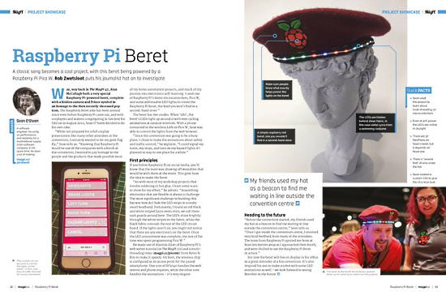](https://github.com/seanosteen/RaspberryPiBeret)

An Internet of Things, mobile phone-controlled Safety Beret, using a Raspberry Pi Pico W, some NeoPixel LEDs, and MicroPython - [GitHub](https://github.com/seanosteen/RaspberryPiBeret) and [The MagPi](https://magpi.raspberrypi.com/issues/123), via [Twitter](https://twitter.com/TinkeringRocks/status/1591275871989825537).

## This Week's Python Streams

Python on Hardware is all about building a cooperative ecosphere which allows contributions to be valued and to grow knowledge. Below are the streams within the last week focusing on the community.

### CircuitPython Deep Dive Stream

[This week](https://youtu.be/R5WHF0BuovE), Tim streamed work on hidden functionality for Core Module Vectorio.

You can see the latest video and past videos on the Adafruit YouTube channel under the Deep Dive playlist - [YouTube](https://www.youtube.com/playlist?list=PLjF7R1fz_OOXBHlu9msoXq2jQN4JpCk8A).

### CircuitPython Parsec

John Park’s CircuitPython Parsec is off this week. Catch all the episodes in the [YouTube playlist](https://www.youtube.com/playlist?list=PLjF7R1fz_OOWFqZfqW9jlvQSIUmwn9lWr).

### The CircuitPython Show

The CircuitPython Show is an independent podcast hosted by Paul Cutler, focusing on the people doing awesome things with CircuitPython. Each episode features Paul in conversation with a guest for a short interview – [CircuitPythonShow](https://circuitpythonshow.com/) and [Twitter](https://twitter.com/circuitpyshow).

The latest episode was released November 14th with Joey Castillo.  Joey discusses the LCD Featherwing, the Open Book and its user interface, and power management – [Show List](https://circuitpythonshow.com/episodes/all).

## Projects of the Week

*I couldn't choose from these two Pico W projects so I include them both - Ed.*

### Displaying Mastadon Media

Raspberry Pi Zero W running Python to display mastodon media on eInk display programmed in MicroPython - [Mastodon](https://fosstodon.org/@axwax/109320658186288444).

###  TV Control with a Web Serving Pico

Guy Dupont tweets "Today in "stupid solutions to stupid problems" - the iOS app to control our TV doesn't work so I deployed a web app running on a Raspberry Pi Pico W that we can all use. Took 20 mins, ~100 lines of CircuitPython code" - [Twitter](https://twitter.com/gvy_dvpont/status/1591123304106323969?s=20&t=srIiv-4ZllW85bktV3DEew).

## News from around the web!

[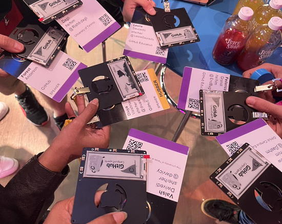](https://twitter.com/dwvicy/status/1590783714287841280)

A session hacking Pimoroni badges with MicroPython - [Twitter](https://twitter.com/dwvicy/status/1590783714287841280).

> "Guy Fawkes pumpkin is gone, so I repurposed the Adafruit N00ds. Why limit yourself to steampunk when you can do cyber ski punk! 😋 CircuitPython. Not much snow in FL though lol. Workshop goggles?" - [Twitter](https://twitter.com/TreasureDev/status/1591693038165835776).

[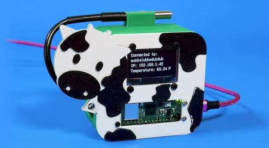](https://www.hackster.io/news/liz-clark-kattni-rembor-celebrate-the-raspberry-pi-pico-s-circuitpython-port-with-a-cow-web-server-8975a5bbd542)

Liz Clark, Kattni Rembor Celebrate the Raspberry Pi Pico's CircuitPython Port with a Cow Web Server - [hackster.io](https://www.hackster.io/news/liz-clark-kattni-rembor-celebrate-the-raspberry-pi-pico-s-circuitpython-port-with-a-cow-web-server-8975a5bbd542) and [YouTube](https://youtu.be/KLYujaG7E94).

Meet the worlds most advanced, WiFi-enabled and globally connected Christmas tree bauble with cheerlights using MicroPython - [Twitter](https://twitter.com/kevsmac/status/1591764656904970241) and [YouTube](https://youtu.be/Nv7j7r0Skbw).

[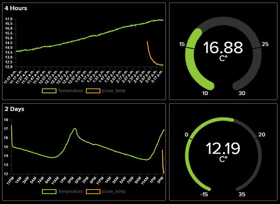](https://hostux.social/@NOeVoting/109332461440548425)

> " I have two MCP9808 sensor measuring in and out temperature. One is connected to an Adafruit PyPortal, the other is connected to a Raspberry Pico W. Both are running CircuitPython and this time I followed [Liz' learn guide](https://learn.adafruit.com/pico-w-wifi-with-circuitpython/pico-w-with-adafruit-io). Now I need to wait to have more data points..." - [hostux.social](https://hostux.social/@NOeVoting/109332461440548425).

Pimoroni Galactic Unicorn display and a VL53L5CX distance sensor and MicroPython - [Twitter](https://twitter.com/yezzer/status/1590981866710241281).

[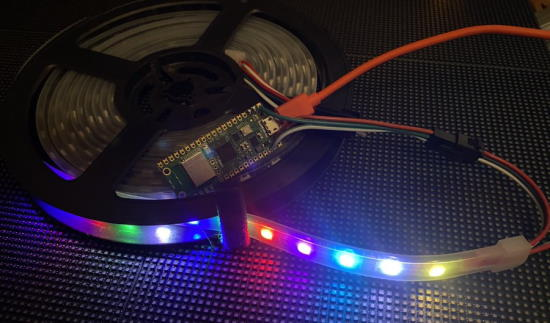](https://twitter.com/drfootleg/status/1589695965782761472)

Recording cheerlight data using a Raspberry Pi Pico W, MicroPython and MQTT - [Twitter](https://twitter.com/drfootleg/status/1589695965782761472) and [GitHub](https://github.com/Footleg/rpi-pico/tree/main/micropython/cheerlights_mqtt).

[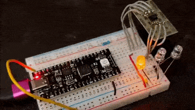](https://twitter.com/todbot/status/1591207627274747904)

> "Who needs fancy (out-of-stock) LED drivers when you got bare WS2811 chips? Take that NeoPixel, your RGB is now orange-orange-orange! (Running on one of those cool black 16MB Raspberry Pi Pico clones) - [Twitter](https://twitter.com/todbot/status/1591207627274747904).

[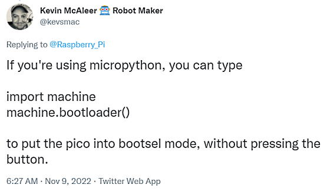](https://twitter.com/kevsmac/status/1590304953389953027?t=uyHQGcCW0O-KlqvJm2_Csg&s=03)

Put the Raspberry Pi Pico into bootsel mode without pressing the button - [Twitter](https://twitter.com/kevsmac/status/1590304953389953027?t=uyHQGcCW0O-KlqvJm2_Csg&s=03).

[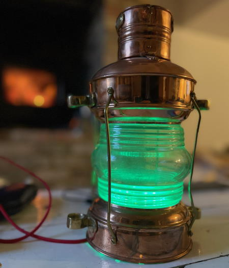](https://twitter.com/digitalurban/status/1591869310590685184)

Using a Ships Lamp to visualise wind speed from a live feed provided from a Davis Vantage Pro 2 weather station out of the Connected Environments Lab at University College London. The colour of the ships lamp changes, every 3 seconds, from Green to Red over a spread of 0 to 40mph. Uses a Pimoroni Plasma Stick 2040 W and MicroPython with MQTT - [Twitter](https://twitter.com/digitalurban/status/1591869310590685184) and [GitHub](https://github.com/digitalurban/MQTT-Plasma-Stick-2040W).

[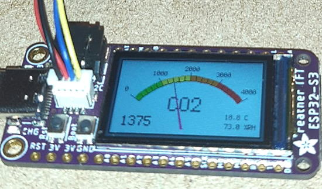](https://twitter.com/TheFlyingKipper/status/1590293439496998913?t=QVL3BU132ZlO11Rt2vzJqQ&s=03)

> "Converting C code to CircuitPython lead me down a rabbit hole with how the display functions are handled. Had to consult the source code and some great Adafruit learning guides / examples... A most enjoyable adventure" - [Twitter](https://twitter.com/TheFlyingKipper/status/1590293439496998913?t=QVL3BU132ZlO11Rt2vzJqQ&s=03).

text - [site](url).

text - [site](url).

text - [site](url).

text - [site](url).

How to Create Interactive Excel Dashboards with Python - [mirioh](https://morioh.com/p/2cb116e98f42?f=5e44c59998b8037d03aa8178).

How to remove backgrounds from images with Python - [Tom's Hardware](https://www.tomshardware.com/how-to/python-remove-image-backgrounds).

How to Track Location using IP Address with Python - [morioh](https://morioh.com/p/7890474d46e4?f=5c21fb01c16e2556b555ab32) and [YouTube](https://www.youtube.com/watch?v=7vdse9l1_sA).

PyDev of the Week: NAME on [Mouse vs Python]()

CircuitPython Weekly Meeting for DATE ([notes]()) [on YouTube]()

#ICYDNCI What was the most popular, most clicked link, in [last week's newsletter](https://www.adafruitdaily.com/2022/11/08/python-on-microcontrollers-newsletter-new-hardware-python-3-12-alpha-and-much-more-circuitpython-micropython-thepsf-raspberry_pi/)? [New Book: MicroPython for the Raspberry Pi Pico W: A gentle introduction to programming digital circuits with Python](https://www.amazon.com/gp/product/B0BKYM71MN/).

## Coming Soon and New

The Orange Pi 5 uses a Rockchip RK3588S 8-core 64-bit processor, quad core A76+ (quad A55), imbedded graphics, 4 to 32GB RAM. Orange Pi OS, Android 12 and Debian 11 - [Twitter](https://twitter.com/orangepixunlong/status/1590312962539286528).

[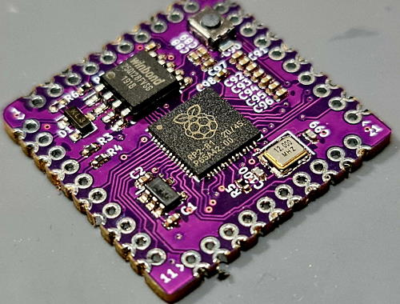](https://twitter.com/sulfuroid/status/1591876812937773058)

The keyboard manager stamp - [Twitter](https://twitter.com/sulfuroid/status/1591876812937773058).

text - [site](url).

## New Boards Supported by CircuitPython

The number of supported microcontrollers and Single Board Computers (SBC) grows every week. This section outlines which boards have been included in CircuitPython or added to [CircuitPython.org](https://circuitpython.org/).

This week, there were (#/no) new boards added!

- [Board name](url)
- [Board name](url)
- [Board name](url)

*Note: For non-Adafruit boards, please use the support forums of the board manufacturer for assistance, as Adafruit does not have the hardware to assist in troubleshooting.*

Looking to add a new board to CircuitPython? It's highly encouraged! Adafruit has four guides to help you do so:

- [How to Add a New Board to CircuitPython](https://learn.adafruit.com/how-to-add-a-new-board-to-circuitpython/overview)
- [How to add a New Board to the circuitpython.org website](https://learn.adafruit.com/how-to-add-a-new-board-to-the-circuitpython-org-website)
- [Adding a Single Board Computer to PlatformDetect for Blinka](https://learn.adafruit.com/adding-a-single-board-computer-to-platformdetect-for-blinka)
- [Adding a Single Board Computer to Blinka](https://learn.adafruit.com/adding-a-single-board-computer-to-blinka)

## New Learn Guides!

[Pico W HTTP Server with CircuitPython](https://learn.adafruit.com/pico-w-http-server-with-circuitpython) from [Liz Clark](https://learn.adafruit.com/u/BlitzCityDIY)

[MagTag Literary Quote Clock](https://learn.adafruit.com/magtag-literary-quote-clock) from [Eva Herrada](https://learn.adafruit.com/u/eherrada)

[Bluefruit Ouija Board](https://learn.adafruit.com/bluefruit-ouija-board) from [John Park](https://learn.adafruit.com/u/johnpark)

## CircuitPython Libraries!

CircuitPython support for hardware continues to grow. We are adding support for new sensors and breakouts all the time, as well as improving on the drivers we already have. As we add more libraries and update current ones, you can keep up with all the changes right here!

For the latest libraries, download the [Adafruit CircuitPython Library Bundle](https://circuitpython.org/libraries). For the latest community contributed libraries, download the [CircuitPython Community Bundle](https://github.com/adafruit/CircuitPython_Community_Bundle/releases).

If you'd like to contribute, CircuitPython libraries are a great place to start. Have an idea for a new driver? File an issue on [CircuitPython](https://github.com/adafruit/circuitpython/issues)! Have you written a library you'd like to make available? Submit it to the [CircuitPython Community Bundle](https://github.com/adafruit/CircuitPython_Community_Bundle). Interested in helping with current libraries? Check out the [CircuitPython.org Contributing page](https://circuitpython.org/contributing). We've included open pull requests and issues from the libraries, and details about repo-level issues that need to be addressed. We have a guide on [contributing to CircuitPython with Git and GitHub](https://learn.adafruit.com/contribute-to-circuitpython-with-git-and-github) if you need help getting started. You can also find us in the #circuitpython channels on the [Adafruit Discord](https://adafru.it/discord).

You can check out this [list of all the Adafruit CircuitPython libraries and drivers available](https://github.com/adafruit/Adafruit_CircuitPython_Bundle/blob/master/circuitpython_library_list.md). 

The current number of CircuitPython libraries is **391**!

**Updated Libraries!**

Here's this week's updated CircuitPython libraries:
  * [Adafruit_CircuitPython_MPU6050](https://github.com/adafruit/Adafruit_CircuitPython_MPU6050)
  * [Adafruit_CircuitPython_BLE_Magic_Light](https://github.com/adafruit/Adafruit_CircuitPython_BLE_Magic_Light)
  * [Adafruit_CircuitPython_MiniMQTT](https://github.com/adafruit/Adafruit_CircuitPython_MiniMQTT)
  * [Adafruit_CircuitPython_SharpMemoryDisplay](https://github.com/adafruit/Adafruit_CircuitPython_SharpMemoryDisplay)
  * [Adafruit_CircuitPython_CharLCD](https://github.com/adafruit/Adafruit_CircuitPython_CharLCD)
  * [Adafruit_CircuitPython_LIS3DH](https://github.com/adafruit/Adafruit_CircuitPython_LIS3DH)
  * [Adafruit_Blinka](https://github.com/adafruit/Adafruit_Blinka)
  * [Adafruit_Python_PlatformDetect](https://github.com/adafruit/Adafruit_Python_PlatformDetect)
  * [CircuitPython_Community_Bundle](https://github.com/adafruit/CircuitPython_Community_Bundle)

**CircuitPython Library PyPI Weekly Download Stats**

* **Total Library Stats**
  * 222659 PyPI downloads over 323 libraries

* **Top 10 Libraries by PyPI Downloads**
  * adafruit-circuitpython-busdevice: 27931
  * adafruit-circuitpython-requests: 26701
  * adafruit-circuitpython-typing: 26534
  * adafruit-circuitpython-register: 2998
  * adafruit-circuitpython-bitbangio: 1140
  * adafruit-circuitpython-display-text: 1115
  * adafruit-circuitpython-neopixel: 1107
  * adafruit-circuitpython-motor: 1069
  * adafruit-circuitpython-ble: 1051
  * adafruit-circuitpython-pixelbuf: 1049

## What’s the team up to this week?

What is the team up to this week? Let’s check in!

**Dan**

I was out for about a week, so my report here is brief.

The LC709203F battery gauge we use on many Feather Espressif boards does not work well on the ESP32-S3. I am attempting some workarounds in the battery gauge library, and having users test the changes.

I am also working on pin sleep issues on the RP2040. If the pin changes state prematurely, before the sleep actually happens, it can prevent wakeup during sleep.

**Kattni**

This past week I worked on the Adafruit PiCowbell Proto guide. This nifty little Raspberry Pi Pico add-on board adds a STEMMA QT connector, a reset button, and protospace to your Pico. There are four ways to assemble it, each detailed in the guide. There are also code examples of how to check to see if your I2C breakout is attached properly through the STEMMA QT connector. Finally, there are pinouts details and downloads resources. It has everything you need to get started with your PiCowbell Proto! If you picked up one of these excellent boards, keep an eye out for this new guide!

**Melissa**

This past week I've been working on catching up on GitHub issues. One of the larger projects that I had put on hold was converting the Raspberry Pi Installer scripts to python. Part of the reason for putting that on hold was because there were some intermittently odd bugs in the Adafruit_Python_Shell library that I wanted to avoid putting into play.

After spending a bit of time really diving in, I was able to make some tests that consistently reproduced the issues and I was able to figure out the fixes to resolve the issue.

**Tim**

This week I got a new desktop computer and it took some time to get everything set up for development, I've got everything needed for core builds, docs builds, library PRs, and pre-commit working in the new environment. I tested a PR for some social media API requests, and added svg icon types to the tool that generates screenshots of projects and libraries.

**Jeff**

I wrote a new library called NeoPxl8 and added it to the bundle. This library supports 8 simultaneous NeoPixel strands on 8 adjacent GPIO pins on the RP2040 microcontroller. This is inspired by some of the ideas of the Adafruit's NeoPxl8 library for Arduino, but is an independent implementation that only works on RP2040.

It's high performance because it not only writes the data to all 8 strands at the same time, it does it in the background so your CircuitPython code can start calculating the next frame of its animation right away. And yes, it works with the LED Animation Library, so that all your previous knowledge about creating great light shows transfers directly to NeoPxl8.

This library works with any board that has an RP2040 and 8 sequentially adjacent GPxx pins, so you can use it with a Raspberry Pi Pico, Pico W, or Adafruit Feather RP2040, Adafruit KB2040, and others. But the library will really hit its stride with the forthcoming "Scorpio" board designed just for controlling lots of NeoPixels.

**Liz**

This week I worked on updating the [Si5351 clock generator guide](https://learn.adafruit.com/adafruit-si5351-clock-generator-breakout) to include the new STEMMA QT version of the board. I also worked on a guide for the new IR LED Emitter board. Both guides have pages for pinouts, CircuitPython, Arduino and resource files. The [Pico W HTTP Server with CircuitPython guide](https://learn.adafruit.com/pico-w-http-server-with-circuitpython) that I mentioned last week also went live.

I was really excited and humbled that on [11/9's Show and Tell](https://youtu.be/WOQj1rdlOus) two guests came by with versions of projects that I've written guides on. I am continually thankful for the opportunity to do this work full-time and that was definitely a highlight to see folks learning and having fun with the guides I've written.

## Upcoming events!

The next MicroPython Meetup in Melbourne will be on November 23rd – [Meetup](https://www.meetup.com/MicroPython-Meetup/). Slides from the last meeting are [here](https://docs.google.com/presentation/d/e/2PACX-1vQnJM1r7vFuRMq9bzHWXKyjvnmQsDRB30OMVE5Ujcgv75_NGg3prgQ_QzAtVyJoQEdM-x5HvgSrFXS9/pub?slide=id.p).

RISC-V Global Summit, December 12-15, 2022 San Jose, California US - [Linux Foundation](https://events.linuxfoundation.org/riscv-summit/), [YouTube](https://youtu.be/VecaMNCuuF0) via [Twitter](https://twitter.com/risc_v/status/1564719040588926979).

PyCon US 2023 will be April 19-17, 2023, again in Salt Lake City, Utah US - [PyCon US 2023](https://pycon.blogspot.com/2020/12/announcing-pycon-us-20222023.html).

**Send Your Events In**

As for other events, with the COVID pandemic, most in-person events are postponed or held online. If you know of virtual events or upcoming events, please let us know on Twitter with hashtag #CircuitPython or email to cpnews(at)adafruit(dot)com.

## Latest releases

CircuitPython's stable release is [#.#.#](https://github.com/adafruit/circuitpython/releases/latest) and its unstable release is [#.#.#-##.#](https://github.com/adafruit/circuitpython/releases). New to CircuitPython? Start with our [Welcome to CircuitPython Guide](https://learn.adafruit.com/welcome-to-circuitpython).

[2022####](https://github.com/adafruit/Adafruit_CircuitPython_Bundle/releases/latest) is the latest CircuitPython library bundle.

[v#.#.#](https://micropython.org/download) is the latest MicroPython release. Documentation for it is [here](http://docs.micropython.org/en/latest/pyboard/).

[#.#.#](https://www.python.org/downloads/) is the latest Python release. The latest pre-release version is [#.#.#](https://www.python.org/download/pre-releases/).

[#,### Stars](https://github.com/adafruit/circuitpython/stargazers) Like CircuitPython? [Star it on GitHub!](https://github.com/adafruit/circuitpython)

## Call for help -- Translating CircuitPython is now easier than ever!

One important feature of CircuitPython is translated control and error messages. With the help of fellow open source project [Weblate](https://weblate.org/), we're making it even easier to add or improve translations. 

Sign in with an existing account such as GitHub, Google or Facebook and start contributing through a simple web interface. No forks or pull requests needed! As always, if you run into trouble join us on [Discord](https://adafru.it/discord), we're here to help.

## jobs.adafruit.com - Find a dream job, find great candidates!

[jobs.adafruit.com](https://jobs.adafruit.com/) has returned and folks are posting their skills (including CircuitPython) and companies are looking for talented makers to join their companies - from Digi-Key, to Hackaday, Micro Center, Raspberry Pi and more.

**Job of the Week**

text - [Adafruit Jobs Board](https://jobs.adafruit.com/).

## NUMBER thanks!

The Adafruit Discord community, where we do all our CircuitPython development in the open, reached over NUMBER humans - thank you!  Adafruit believes Discord offers a unique way for Python on hardware folks to connect. Join today at [https://adafru.it/discord](https://adafru.it/discord).

## ICYMI - In case you missed it

Python on hardware is the Adafruit Python video-newsletter-podcast! The news comes from the Python community, Discord, Adafruit communities and more and is broadcast on ASK an ENGINEER Wednesdays. The complete Python on Hardware weekly videocast [playlist is here](https://www.youtube.com/playlist?list=PLjF7R1fz_OOXRMjM7Sm0J2Xt6H81TdDev). The video podcast is on [iTunes](https://itunes.apple.com/us/podcast/python-on-hardware/id1451685192?mt=2), [YouTube](http://adafru.it/pohepisodes), [IGTV (Instagram TV](https://www.instagram.com/adafruit/channel/)), and [XML](https://itunes.apple.com/us/podcast/python-on-hardware/id1451685192?mt=2).

[The weekly community chat on Adafruit Discord server CircuitPython channel - Audio / Podcast edition](https://itunes.apple.com/us/podcast/circuitpython-weekly-meeting/id1451685016) - Audio from the Discord chat space for CircuitPython, meetings are usually Mondays at 2pm ET, this is the audio version on [iTunes](https://itunes.apple.com/us/podcast/circuitpython-weekly-meeting/id1451685016), Pocket Casts, [Spotify](https://adafru.it/spotify), and [XML feed](https://adafruit-podcasts.s3.amazonaws.com/circuitpython_weekly_meeting/audio-podcast.xml).

## Codecademy "Learn Hardware Programming with CircuitPython"

Codecademy, an online interactive learning platform used by more than 45 million people, has teamed up with Adafruit to create a coding course, “Learn Hardware Programming with CircuitPython”. The course is now available in the [Codecademy catalog](https://www.codecademy.com/learn/learn-circuitpython?utm_source=adafruit&utm_medium=partners&utm_campaign=circuitplayground&utm_content=pythononhardwarenewsletter).

## Contribute!

The CircuitPython Weekly Newsletter is a CircuitPython community-run newsletter emailed every Tuesday. The complete [archives are here](https://www.adafruitdaily.com/category/circuitpython/). It highlights the latest CircuitPython related news from around the web including Python and MicroPython developments. To contribute, edit next week's draft [on GitHub](https://github.com/adafruit/circuitpython-weekly-newsletter/tree/gh-pages/_drafts) and [submit a pull request](https://help.github.com/articles/editing-files-in-your-repository/) with the changes. You may also tag your information on Twitter with #CircuitPython. 

Join the Adafruit [Discord](https://adafru.it/discord) or [post to the forum](https://forums.adafruit.com/viewforum.php?f=60) if you have questions.
