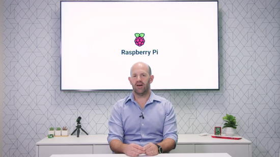
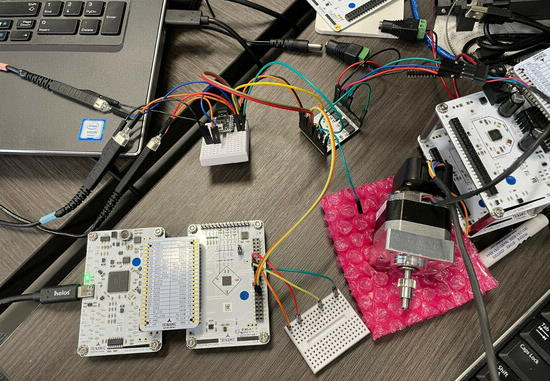
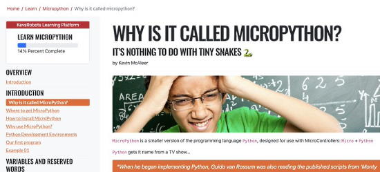
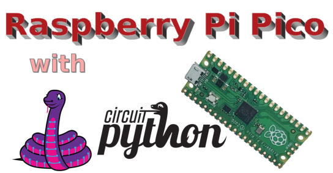
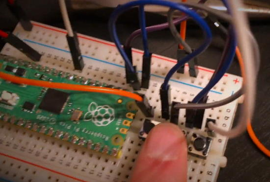
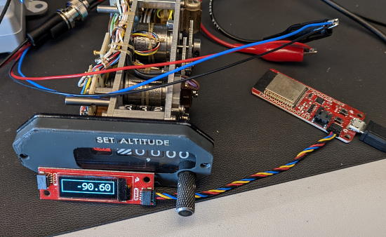

- [X] Kattni updates
- [ ] change date
- [ ] update title
- [ ] Feature story
- [ ] Update  for images
- [ ] Update ICYDNCI
- [ ] All images 550w max only
- [ ] Link "View this email in your browser."

News Sources

- [python.org](https://www.python.org/)
- [Python Insider - dev team blog](https://pythoninsider.blogspot.com/)
- [MicroPython Meetup Blog](https://melbournemicropythonmeetup.github.io/)
- [hackaday.io newest projects MicroPython](https://hackaday.io/projects?tag=micropython&sort=date) and [CircuitPython](https://hackaday.io/projects?tag=circuitpython&sort=date)
- [hackaday CircuitPython](https://hackaday.com/blog/?s=circuitpython) and [MicroPython](https://hackaday.com/blog/?s=micropython)
- [hackster.io CircuitPython](https://www.hackster.io/search?q=circuitpython&i=projects&sort_by=most_recent) and [MicroPython](https://www.hackster.io/search?q=micropython&i=projects&sort_by=most_recent)
- [https://opensource.com/tags/python](https://opensource.com/tags/python)
- [Mastodon CircuitPython](https://octodon.social/tags/CircuitPython)

View this email in your browser. **Warning: Flashing Imagery**

Welcome to the latest Python on Microcontrollers newsletter! We've reported that Microsoft has a renewed interest in Python and has even hired Guido van Rosum, the language's creator. Two steps this week to strengthen Microsoft's commitment in supporting Python with their .NET framework and the ability to programk in Linux on Wiondows. - *Ed.*

We're on [Discord](https://discord.gg/HYqvREz), [Twitter](https://twitter.com/search?q=circuitpython&src=typed_query&f=live), and for past newsletters - [view them all here](https://www.adafruitdaily.com/category/circuitpython/). If you're reading this on the web, [subscribe here](https://www.adafruitdaily.com/). Here's the news this week:

## Mu Editor Version 1.2.0 Released

The Mu team has released a new version of the Mu Python Editor. This release introduces Snek mode, fixes some minor bugs, addresses some usability gremlins and adjusts some capabilities to make things tidier. Much of this work was done over the summer at the code-sprints at EuroPython 2022 in Dublin. It also includes the fix allowing for the CircuitPython 8 status line - [GitHub](https://github.com/mu-editor/mu/releases/tag/v1.2.0) and [Adafruit Blog](https://blog.adafruit.com/2022/11/15/mu-python-editor-version-1-2-0-released-today-mu-python/).

## Python and .NET - An Ongoing Saga

Microsoft's .NET Framework arrived with two languages, C# and Visual Basic. Then came the Iron Languages, .NET compatible implementations of Ruby and Python which Microsoft "let go of" in 2010. Nowadays Microsoft is again embracing Python - [I Programmer](https://i-programmer.info/programming/python/15874-python-and-net-an-ongoing-saga.html).

## Windows Subsystem for Linux Has Reached v1.0 Stable Release

Windows Subsystem for Linux (WSL) is a tool that lets you run a GNU/Linux environment inside a Windows system without needing a virtual machine or dual-boot. It was released by Microsoft Store as a preview. Now, the preview label has been removed, signifying that it is stable enough for a 1.0 release - [It's FOSS News](https://news.itsfoss.com/wsl-stable-available/) and [GitHub](https://github.com/microsoft/WSL/releases/tag/1.0.0).

## Raspberry Pi's Eben Upton Recognized

Eben Upton, founder of Raspberry Pi, which is manufactured in Sony UKTEC, won the Wales STEM Awards Outstanding Contribution to STEM award for his efforts in inspiring the next generation of computer programmers, scientists & engineers worldwide - [Twitter](https://twitter.com/WalesStem/status/1592877337246400512).

## Discount Shopping

Traditionally, "Black Friday", the Friday after US Thanksgiving, started the holiday shopping season and brought discounts from sellers. In recent times, retailers have introduced sales prior to Black Friday. But it is still expected that there will be some of the best prices on items this week into the US weekend and into "Cyber Monday". This will include electronics companies selling microcontrollers and single board computers (if available). Check with your favorite retailers to see what they're planning.

## Please Send in Your Projects and Python News

Through the new year, folks will likely have some free time and it's a busy season for making projects. With the turmoil on social media, neat postings might be missed. Please send your links to internet posts to cpnews@adafruit.com for consideration of this newsletter. Thanks and we look forward to seeing all the submissions - *Ed.*

## This Week's Python Streams

Python on Hardware is all about building a cooperative ecosphere which allows contributions to be valued and to grow knowledge. Below are the streams within the last week focusing on the community.

### CircuitPython Deep Dive Stream

[This week](https://youtu.be/vK14q_7o4aY), Tim streamed work on displayio API Change + PixelMap.

You can see the latest video and past videos on the Adafruit YouTube channel under the Deep Dive playlist - [YouTube](https://www.youtube.com/playlist?list=PLjF7R1fz_OOXBHlu9msoXq2jQN4JpCk8A).

### CircuitPython Parsec

John Park’s CircuitPython Parsec is back this week and features File Glider - [Adafruit Blog](https://blog.adafruit.com/2022/11/18/john-parks-circuitpython-parsec-glider-adafruit-johnedgarpark-adafruit-circuitpython/) and [YouTube](https://youtu.be/dfqMef2vA7k).

Catch all the episodes in the [YouTube playlist](https://www.youtube.com/playlist?list=PLjF7R1fz_OOWFqZfqW9jlvQSIUmwn9lWr).

### The CircuitPython Show

The CircuitPython Show is an independent podcast hosted by Paul Cutler, focusing on the people doing awesome things with CircuitPython. Each episode features Paul in conversation with a guest for a short interview – [CircuitPythonShow](https://circuitpythonshow.com/) and [Twitter](https://twitter.com/circuitpyshow).

The show is off this week. Last week featured Joey Castillo and next week Mark Komus joins the show – [Show List](https://circuitpythonshow.com/episodes/all).

## Project of the Week: A General-Purpose Chip Debug Interface

Josh posts about wanting to debug some low-level SPI communication issues in a prototype/eval setup - [Mastodon](https://fosstodon.org/@joshburnett/109359592017429713).

> "Somewhat of an odd day as a mechanical engineer when you're breaking out the oscilloscope to debug an inter-chip issue! Thank goodness I can at least control it all in Python. Using a Qt Py RP2040 from #Adafruit as my general-purpose chip debug interface. Lets me do SPI & GPIO, all in CircuitPython (on the QtPy) & Python (on the host PC)".

## News from around the web!

Kevin writes "Whoop, my new MicroPython course is almost ready to launch. I'd like some beta testers to help me find issues, and typos, and to check it flows right for beginners etc. [Let me know if you're interested](https://twitter.com/kevsmac/status/1593764494865465344), and I'll send you a secret link to the beta site" - [Twitter](https://twitter.com/kevsmac/status/1593764494865465344).

A video on the macOS Ventura Drag and Drop Bug which affects Raspberry Pi Pico, CircuitPython and micro:bit users - [YouTube](https://www.youtube.com/watch?v=EHj3UIZt47Q).

Interpreting Data through Music. "Honestly, it pretty much built itself thanks to the great sample code from ladyada at Adafruit.com. Her examples were used to glue together a proximity and light sensor with a temperature, pressure, and humidity sensor. I wrote some code to send these values (some of them adjusted to be within valid values) as MIDI messages to my synthesizer." - [YouTube](https://www.youtube.com/watch?v=fR1cABqO-cU) and [cerkit](https://cerkit.com/2022/11/12/interpreting-data-through-music/).

Introduction to CircuitPython on Raspberry Pi Pico with NeoPixels - [YouTube](https://www.youtube.com/watch?v=zUgYYUnEfGI) via [Twitter](https://twitter.com/stewartwatkiss/status/1594663355733925888).

Kids Hack Their Brother's Computer Using A Raspberry Pi Pico and CircuitPython - [YouTube](https://www.youtube.com/watch?v=kkxXQGj2VRw) and [Web](https://gurgleapps.com/learn/hacking/hack-brothers-computer-using-raspberry-pi-pico-rubber-ducky).

Getting started with CircuitPython on Fedora - [nullr0ute](https://nullr0ute.com/2022/11/getting-started-with-circuitpython-on-fedora/).

A cheerlights CheerClock is almost complete. It’s based on Pimoroni‘s Galactic Unicorn LED board and a Raspberry Pi Pico W microcontroller. A write up, case SVG and MicroPython source code will be available soon - [Twitter](https://twitter.com/TinkeringRocks/status/1594091094765342720).

Characterizing an aircraft altimeter using Python and displaying output on a SparkFun board - [Twitter](https://twitter.com/bikerglen/status/1594386268024078336).

Another Pinoroni Galactic Unicorn Cheerlights project - [Twitter](https://twitter.com/drfootleg/status/1594629574276554752).

text - [site](url).

text - [site](url).

text - [site](url).

text - [site](url).

Exception Handling in Python - [Vocal Media](https://vocal.media/01/exception-handling-in-python).

A JPG file dissection - [Twitter](https://twitter.com/angealbertini/status/1594021185125199878) and [GitHub](https://github.com/corkami/pics).

The difference between "is" and "==" in Python explained - [YouTube](https://www.youtube.com/watch?v=SDiQZv-K_xc).

What Can I Do With Python? - [Real Python](https://realpython.com/what-can-i-do-with-python/).

Functions, 'args' and 'kwargs' in Python - [Vocal Media Education](https://vocal.media/education/functions-args-and-kwargs-in-python).

Run Python Code From Excel with VBA - [YouTube](https://www.youtube.com/watch?v=pGifqVvF9qs).

PyDev of the Week: NAME on [Mouse vs Python]()

CircuitPython Weekly Meeting for DATE ([notes]()) [on YouTube]()

#ICYDNCI What was the most popular, most clicked link, in [last week's newsletter](https://www.adafruitdaily.com/2022/11/15/python-on-microcontrollers-newsletter-arduino-finally-adopts-micropython-pico-w-projects-and-much-more-circuitpython-micropython-thepsf-raspberry_pi/)? [Python Cheat Sheets](https://twitter.com/itsafiz/status/1591788434355802115).

## Coming Soon

Pete Lomas writes on Twitter: "Fell across this interesting idea from our friends @EdacEurope whilst 'doing the tour' at Electronica. Allows you to plug/unplug boards like Raspberry Pi Pico without soldering. Cannot show you the PCB underneath - apparently super secret sauce from [CodeBug](https://www.codebug.org.uk/)" - [Twitter](https://twitter.com/PeteLomasPi/status/1593185618628317186).

text - [site](url).

## New Boards Supported by CircuitPython

The number of supported microcontrollers and Single Board Computers (SBC) grows every week. This section outlines which boards have been included in CircuitPython or added to [CircuitPython.org](https://circuitpython.org/).

This week, there were (#/no) new boards added!

- [Board name](url)
- [Board name](url)
- [Board name](url)

*Note: For non-Adafruit boards, please use the support forums of the board manufacturer for assistance, as Adafruit does not have the hardware to assist in troubleshooting.*

Looking to add a new board to CircuitPython? It's highly encouraged! Adafruit has four guides to help you do so:

- [How to Add a New Board to CircuitPython](https://learn.adafruit.com/how-to-add-a-new-board-to-circuitpython/overview)
- [How to add a New Board to the circuitpython.org website](https://learn.adafruit.com/how-to-add-a-new-board-to-the-circuitpython-org-website)
- [Adding a Single Board Computer to PlatformDetect for Blinka](https://learn.adafruit.com/adding-a-single-board-computer-to-platformdetect-for-blinka)
- [Adding a Single Board Computer to Blinka](https://learn.adafruit.com/adding-a-single-board-computer-to-blinka)

## New Learn Guides!

[Adafruit PiCowbell Proto for Pico](https://learn.adafruit.com/picowbell-proto) from [Kattni](https://learn.adafruit.com/u/kattni)

[Adafruit High Power Infrared LED Emitter](https://learn.adafruit.com/adafruit-high-power-infrared-led-emitter) from [Liz Clark](https://learn.adafruit.com/u/BlitzCityDIY)

## CircuitPython Libraries!

CircuitPython support for hardware continues to grow. We are adding support for new sensors and breakouts all the time, as well as improving on the drivers we already have. As we add more libraries and update current ones, you can keep up with all the changes right here!

For the latest libraries, download the [Adafruit CircuitPython Library Bundle](https://circuitpython.org/libraries). For the latest community contributed libraries, download the [CircuitPython Community Bundle](https://github.com/adafruit/CircuitPython_Community_Bundle/releases).

If you'd like to contribute, CircuitPython libraries are a great place to start. Have an idea for a new driver? File an issue on [CircuitPython](https://github.com/adafruit/circuitpython/issues)! Have you written a library you'd like to make available? Submit it to the [CircuitPython Community Bundle](https://github.com/adafruit/CircuitPython_Community_Bundle). Interested in helping with current libraries? Check out the [CircuitPython.org Contributing page](https://circuitpython.org/contributing). We've included open pull requests and issues from the libraries, and details about repo-level issues that need to be addressed. We have a guide on [contributing to CircuitPython with Git and GitHub](https://learn.adafruit.com/contribute-to-circuitpython-with-git-and-github) if you need help getting started. You can also find us in the #circuitpython channels on the [Adafruit Discord](https://adafru.it/discord).

You can check out this [list of all the Adafruit CircuitPython libraries and drivers available](https://github.com/adafruit/Adafruit_CircuitPython_Bundle/blob/master/circuitpython_library_list.md). 

The current number of CircuitPython libraries is **393**!

**Updated Libraries!**

Here's this week's updated CircuitPython libraries:

* There are too many updated libraries to list this week! To view the list, check out the [Library Report](https://adafruit-circuit-python.s3.amazonaws.com/adabot/bin/reports/circuitpython_library_report_20221122.txt).

## What’s the team up to this week?

What is the team up to this week? Let’s check in!

**Dan**

Welcome back Scott! This week Scott, Jeff, and I met to triage the remaining 8.0.0 issues. I fixed several rather specific bugs: SAMD21 event channels were not being freed properly, STM PWMOut sometimes had incorrect clock speeds due to an off-by-one-bug, and RP2040 PinAlarms that triggered before a deep sleep could prevent wakeup. Right now I'm working on an Espressif SPI problem, and found and fixed a minor RP2040 SPI problem in the process.

**Kattni**

This week I published two guides: the PiCowbell Proto guide and a shorty guide for the Qwiik / STEMMA QT 5 port hub. 

The [PiCowbell guide](https://learn.adafruit.com/picowbell-proto) has detailed examples of the four ways to assemble it with a Pico, Pinouts details, as well as CircuitPython and Arduino I2C scan examples to ensure your STEMMA QT sensor or breakout is being recognised. It also has downloads resources if you'd like more information. If you picked up one of these handy little boards, check out this guide! 

The [STEMMA QT Hub guide](https://learn.adafruit.com/qwiik-stemma-qt-5-port-hub) has an overview, pinouts details, and a downloads resources page. It does not require code! If you're interested in the details of your new hub, check out this guide!

**Melissa**

This past week I focused on updating more of our Shell scripts over to Python. One of the reasons I had put this on hold was due to an elusive bug in the Adafruit_Python_Shell library's `run_command` function, which appeared to occasionally stop working. After diving in a bit deeper, I figured out a few situations where it wasn't working properly. After a few modifications, I finally had it working consistently and smoothly, so I resumed working on scripts.

**Tim**

This week I tested out some improvements to internal utilities in the led_animation library as well as a PR in the core to offload some of the heaviest work that occurs in those helpers to a core module in order to speed it up. I also started working on a change to the displayio API in the core that was proposed during the weekly meeting. 

**Jeff**

I have several prototype Adafruit PCBs and made pull requests to add them to CircuitPython: A new MatrixPortal with the ESP32-S2 microcontroller; and a pair of "reverse mount" TFT feathers in ESP32-S2 and ESP32-S3 variants. These Pull Requests will remain in draft form until the hardware is finalized, but from my testing things are in pretty good shape!

**Scott**

I'm back from twelve weeks of paternity/bonding leave. It was wonderful to bond with my kiddo and weird to be back working during the day. It's been awesome to see everything that has happened with CircuitPython while I'm out. I've gotten caught up on Discord, forums and e-mail. After chatting with Jeff and Dan, we've decided I'll start with Pico W web workflow. It is one of the major TODO items for 8.0.0. I'll also be testing code.circuitpython.org with that.

**Liz**

[High Power Infrared LED Emitter guide](https://learn.adafruit.com/adafruit-high-power-infrared-led-emitter) is a fun board that lets you use a STEMMA JST-PH cable to quickly wire up an IR LED for things like TV-b-gones and remote controls.

The MicroLipo v2 was added to the [original MicroLipo and battery chargers guide](https://learn.adafruit.com/adafruit-microlipo-and-minilipo-battery-chargers/overview). I added a pinouts page for the new MicroLipo v2 and updated the Charge Rate page since the MicroLipo v2 has a switch in place of a jumper to go between 100mA and 500mA charging rates.

The [QSPI breakout board guide](https://learn.adafruit.com/adafruit-qspi-dip-breakout-boards) and [SPI flash guide](https://learn.adafruit.com/adafruit-spi-flash-breakouts) do not have CircuitPython pages, since they're meant for Arduino use. However, the flash chips on the boards do have TOML definition files for CircuitPython, so they can be used in a board definition which some folks may find to be helpful.

## Upcoming events!

The next MicroPython Meetup in Melbourne will be on November 23rd – [Meetup](https://www.meetup.com/MicroPython-Meetup/). Slides from the last meeting are [here](https://docs.google.com/presentation/d/e/2PACX-1vQnJM1r7vFuRMq9bzHWXKyjvnmQsDRB30OMVE5Ujcgv75_NGg3prgQ_QzAtVyJoQEdM-x5HvgSrFXS9/pub?slide=id.p).

RISC-V Global Summit, December 12-15, 2022 San Jose, California US - [Linux Foundation](https://events.linuxfoundation.org/riscv-summit/), [YouTube](https://youtu.be/VecaMNCuuF0) via [Twitter](https://twitter.com/risc_v/status/1564719040588926979).

FOSDEM is a free event for software developers to meet, share ideas and collaborate. Every year, thousands of developers of free and open source software from all over the world gather at the event in Brussels. February 4-5, 2023 in Brussels, Belgium - [Fosdem](https://fosdem.org/2023/).

PyCon US 2023 will be April 19-17, 2023, again in Salt Lake City, Utah USA - [PyCon US 2023](https://us.pycon.org/2023/).

**Send Your Events In**

As for other events, with the COVID pandemic, most in-person events are postponed or held online. If you know of virtual events or upcoming events, please let us know on Twitter with hashtag #CircuitPython or email to cpnews(at)adafruit(dot)com.

## Latest releases

CircuitPython's stable release is [#.#.#](https://github.com/adafruit/circuitpython/releases/latest) and its unstable release is [#.#.#-##.#](https://github.com/adafruit/circuitpython/releases). New to CircuitPython? Start with our [Welcome to CircuitPython Guide](https://learn.adafruit.com/welcome-to-circuitpython).

[2022####](https://github.com/adafruit/Adafruit_CircuitPython_Bundle/releases/latest) is the latest CircuitPython library bundle.

[v#.#.#](https://micropython.org/download) is the latest MicroPython release. Documentation for it is [here](http://docs.micropython.org/en/latest/pyboard/).

[#.#.#](https://www.python.org/downloads/) is the latest Python release. The latest pre-release version is [#.#.#](https://www.python.org/download/pre-releases/).

[#,### Stars](https://github.com/adafruit/circuitpython/stargazers) Like CircuitPython? [Star it on GitHub!](https://github.com/adafruit/circuitpython)

## Call for help -- Translating CircuitPython is now easier than ever!

One important feature of CircuitPython is translated control and error messages. With the help of fellow open source project [Weblate](https://weblate.org/), we're making it even easier to add or improve translations. 

Sign in with an existing account such as GitHub, Google or Facebook and start contributing through a simple web interface. No forks or pull requests needed! As always, if you run into trouble join us on [Discord](https://adafru.it/discord), we're here to help.

## jobs.adafruit.com - Find a dream job, find great candidates!

[jobs.adafruit.com](https://jobs.adafruit.com/) has returned and folks are posting their skills (including CircuitPython) and companies are looking for talented makers to join their companies - from Digi-Key, to Hackaday, Micro Center, Raspberry Pi and more.

**Job of the Week**

Electrical Technician - CAD Industries LLC - [Adafruit Jobs Board](https://jobs.adafruit.com/job/electrical-technician/).

## 35,943 thanks!

The Adafruit Discord community, where we do all our CircuitPython development in the open, reached over 35,943 humans - thank you!  Adafruit believes Discord offers a unique way for Python on hardware folks to connect. Join today at [https://adafru.it/discord](https://adafru.it/discord).

## ICYMI - In case you missed it

Python on hardware is the Adafruit Python video-newsletter-podcast! The news comes from the Python community, Discord, Adafruit communities and more and is broadcast on ASK an ENGINEER Wednesdays. The complete Python on Hardware weekly videocast [playlist is here](https://www.youtube.com/playlist?list=PLjF7R1fz_OOXRMjM7Sm0J2Xt6H81TdDev). The video podcast is on [iTunes](https://itunes.apple.com/us/podcast/python-on-hardware/id1451685192?mt=2), [YouTube](http://adafru.it/pohepisodes), [IGTV (Instagram TV](https://www.instagram.com/adafruit/channel/)), and [XML](https://itunes.apple.com/us/podcast/python-on-hardware/id1451685192?mt=2).

[The weekly community chat on Adafruit Discord server CircuitPython channel - Audio / Podcast edition](https://itunes.apple.com/us/podcast/circuitpython-weekly-meeting/id1451685016) - Audio from the Discord chat space for CircuitPython, meetings are usually Mondays at 2pm ET, this is the audio version on [iTunes](https://itunes.apple.com/us/podcast/circuitpython-weekly-meeting/id1451685016), Pocket Casts, [Spotify](https://adafru.it/spotify), and [XML feed](https://adafruit-podcasts.s3.amazonaws.com/circuitpython_weekly_meeting/audio-podcast.xml).

## Codecademy "Learn Hardware Programming with CircuitPython"

Codecademy, an online interactive learning platform used by more than 45 million people, has teamed up with Adafruit to create a coding course, “Learn Hardware Programming with CircuitPython”. The course is now available in the [Codecademy catalog](https://www.codecademy.com/learn/learn-circuitpython?utm_source=adafruit&utm_medium=partners&utm_campaign=circuitplayground&utm_content=pythononhardwarenewsletter).

## Contribute!

The CircuitPython Weekly Newsletter is a CircuitPython community-run newsletter emailed every Tuesday. The complete [archives are here](https://www.adafruitdaily.com/category/circuitpython/). It highlights the latest CircuitPython related news from around the web including Python and MicroPython developments. To contribute, edit next week's draft [on GitHub](https://github.com/adafruit/circuitpython-weekly-newsletter/tree/gh-pages/_drafts) and [submit a pull request](https://help.github.com/articles/editing-files-in-your-repository/) with the changes. You may also tag your information on Twitter with #CircuitPython. 

Join the Adafruit [Discord](https://adafru.it/discord) or [post to the forum](https://forums.adafruit.com/viewforum.php?f=60) if you have questions.
