- [X] Kattni updates
- [ ] change date
- [ ] update title
- [ ] Feature story
- [ ] Update  for images
- [ ] Update ICYDNCI
- [ ] All images 550w max only
- [ ] Link "View this email in your browser."

Data Sources:

- [python.org](https://www.python.org/)
- [Python Insider - dev team blog](https://pythoninsider.blogspot.com/)
- [MicroPython Meetup Blog](https://melbournemicropythonmeetup.github.io/)
- [hackaday.io newest projects MicroPython](https://hackaday.io/projects?tag=micropython&sort=date) and [CircuitPython](https://hackaday.io/projects?tag=circuitpython&sort=date)
- [hackaday CircuitPython](https://hackaday.com/blog/?s=circuitpython) and [MicroPython](https://hackaday.com/blog/?s=micropython)
- [hackster.io CircuitPython](https://www.hackster.io/search?q=circuitpython&i=projects&sort_by=most_recent) and [MicroPython](https://www.hackster.io/search?q=micropython&i=projects&sort_by=most_recent)
- [https://opensource.com/tags/python](https://opensource.com/tags/python)
- [Mastodon CircuitPython](https://octodon.social/tags/CircuitPython)

View this email in your browser. **Warning: Flashing Imagery**

Welcome to the latest Python on Microcontrollers newsletter! Another busy week leading up to the holidays. Apple has finally performed some bug fixes for loading UF2 files onto microcontrollers but work remains with hex files. The Adafruit PyLeap application now makes it easier to load code onto wireless microcontroller. Grab a free PDF copy of the Raspberry Pi Handbook 2023 to check out the latest on their boards. And check out all the projects this week, including some very imaginative ones - *Ed.*

We're on [Discord](https://discord.gg/HYqvREz), [Twitter](https://twitter.com/search?q=circuitpython&src=typed_query&f=live), and for past newsletters - [view them all here](https://www.adafruitdaily.com/category/circuitpython/). If you're reading this on the web, [subscribe here](https://www.adafruitdaily.com/). Here's the news this week:

## Issue Uploading UF2 files with macOS 13.0 Ventura Fixed in Version 13.1

[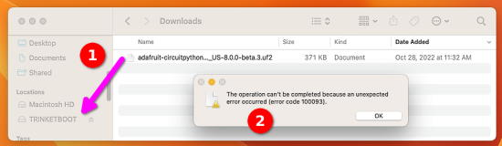](https://blog.adafruit.com/2022/10/31/uploading-uf2-files-with-macos-13-0-ventura-apple-microbit_edu-raspberry_pi-circuitpython/)

Uploading UF2 file issues with macOS 13.0 Ventura have been fixed in Version 13.1. Not all is perfect, though. It is still the case that UF2 uploading does not work on nRF52840 boards that use an older UF2 bootloader (versions 0.6.2 and newer work). On those boards, the bootloader appears to fail quickly. Copying a UF2 file does not work, which is indicated by the UF2 filename appearing in the BOOT drive. The bootloader can be updated by following the directions [here](https://github.com/adafruit/Adafruit_nRF52_Bootloader/blob/master/README.md#flash). Otherwise, on these nRF52840 boards, including the Adafruit Circuit Playground Bluefruit, the Feather nRF52840, and the ItsyBitsy nRF52840, the only way to load a UF2 file is to use a non-Ventura computer.

It is also still true that copying .hex files larger than 1MB does not work (e.g., on the micro:bit). See https://github.com/ARMmbed/DAPLink/issues/982 for workarounds and further investigation - [Adafruit Blog](https://blog.adafruit.com/2022/10/31/uploading-uf2-files-with-macos-13-0-ventura-apple-microbit_edu-raspberry_pi-circuitpython/) and [Raspberry Pi](https://www.raspberrypi.com/news/the-ventura-problem/).

## PyLeap Gets a Major Update – Now With WiFi Transfer and More!

A major update for PyLeap, the free Adafruit iOS app that simplifies downloading code files and assets and transferring them to Adafruit devices using BLE.

With this update, Adafruite added the ability for users to transfer files using WiFi in addition to BLE. This means that you can now transfer your code and assets to your Adafruit devices even faster without having to rely on a physical connection (like USB).

But that’s not all – they’ve also made several other improvements and enhancements to PyLeap to make it even more user-friendly and efficient. Some of the other highlights of this update include:

* Enhanced transfer speeds: the transfer process has been optimized to make it even faster, so you can get your code and assets onto your Adafruit devices very quickly.
* More devices supported: added support for some new Adafruit devices, so you can use PyLeap with even more hardware.

Overall, this update to PyLeap makes it even more convenient and efficient for developers and makers to transfer code and assets to their Adafruit devices.

Download PyLeap today! [PyLeap App](https://apps.apple.com/us/app/pyleap/id1582204203) and see the [Adafruit Blog](https://blog.adafruit.com/2022/12/19/pyleap-gets-a-major-update-now-with-wi-fi-transfer-and-more/).

## Raspberry Pi is Supporting KiCad Open Source Design Automation Software

[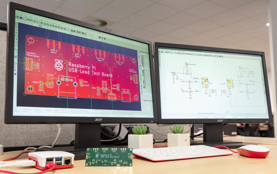](https://www.raspberrypi.com/news/supporting-kicad-open-source-design-automation-software/)

Raspberry Pi Ltd is helping KiCad with their end-of-year funding drive by matching donations made on [KiCad’s website](http://www.kicad.org/) up to $5000 - [Raspberry Pi](https://www.raspberrypi.com/news/supporting-kicad-open-source-design-automation-software/).

>... We use it for some of our product designs. Dominic developed the [Compute Module 4 IO board](https://www.raspberrypi.com/products/compute-module-4-io-board/) using KiCad, and the design database is free for anyone to download and use as a starting point for their own CM4 projects: you can download a zip file of the database [here](https://datasheets.raspberrypi.com/cm4io/CM4IO-KiCAD.zip).

## The Official Raspberry Pi Handbook 2023 is Available

Discover the true potential of Raspberry Pi with the new, official Handbook for 2023. With over 200 pages of amazing projects, fun tutorials, practical guides, and clear reviews, it has everything you need to master Raspberry Pi - [Raspberry Pi](https://magpi.raspberrypi.com/books/handbook-2023).

**Inside The Official Raspberry Pi Handbook 2023**

* QuickStart guide to setting up your Raspberry Pi computer
* Make stuff with Raspberry Pi Pico W
* Incredible projects built by the global Raspberry Pi community
* Find the right kit and products for your dream builds
* Get creating with our comprehensive tutorials and guides
* Over 200 pages of essential advice!

Available as a book to purchase or as a free PDF download.

## New 3D Printing Model Website: Printables

[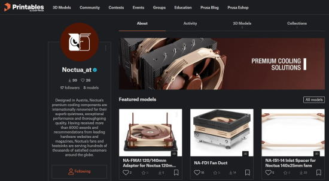](https://blog.prusa3d.com/starting-a-3d-printing-revolution-introducing-official-brand-profiles-on-printables-com_73408/)

For better or worse, many of the 3D printable cases, parts and more have been placed on [Thingiverse](https://www.thingiverse.com/), controlled by MakerBot. A new model aggregator has emerged with the backing from prominent content creators including Adafruit: Printables by Prusa  - [Prusa](https://blog.prusa3d.com/starting-a-3d-printing-revolution-introducing-official-brand-profiles-on-printables-com_73408/).

> Wouldn’t it be great, if you could download official 3D printable files with replacement parts and accessories for your home appliances? Or an official fan model from your favorite game? Today, with our partners from various industries, we’re turning this into reality and starting a revolution in how big brands approach 3D printing!  All 3D models shared on [Printables.com](https://www.printables.com/) are available for free, allowing anyone to easily download and print them at home. This opens up a world of possibilities for businesses and consumers alike. Some replacement parts can be printed locally and on-demand, eliminating the need for inventory and shipping. This also makes it easier for brands to support the right-to-repair initiative. In addition to replacement parts, businesses can also create accessories and mods for their products. This allows consumers to personalize and improve their products, making them even more valuable and unique. And for fans of popular games and movies, brands can create official fan models, such as figures, costumes, and props.

## RISC-V: The background, the benefits, and the future

US developers conceived the revolutionary instruction set architecture (ISA) known as RISC-V in 2010. Grounded in reduced instruction set computer (RISC) principles, it’s a common, open-source, and completely free ISA that can be used to develop software and hardware. These attributes are just part of what makes the architecture unique and attractive to developers and manufacturers.

While it’s far from new, momentum around RISC-V is continuing to accelerate, with various services, technologies, and products that leverage this architecture emerging in the past year alone. According to Deloitte, use of RISC-V’s open-chip processors was expected to double this year and is set to double again in 2023 - [EEWorld](https://www.eeworldonline.com/risc-v-background-benefits-and-future-faq/).

## What We Can Learn From Vintage Computing

Thanks to open source, no technology ever has to become obsolete, so long as a community remains to support it. You can sync Newtons and Palm Pilots with modern desktops, download web browsers for long-discontinued operating systems, [replace a 6502 with a Teensy](https://blog.adafruit.com/2022/12/14/a-teensy-4-1-powered-drop-in-upgrade-for-commodore-64-vintagecomputing/), or connect vintage computers like the Apple IIe to the modern internet via WiFi. Every year, new cartridges are released for old-school video game consoles like the Nintendo Entertainment System and Game Boy - [The ReadME Project](https://github.com/readme/featured/vintage-computing).

## This Week's Python Streams

Python on Hardware is all about building a cooperative ecosphere which allows contributions to be valued and to grow knowledge. Below are the streams within the last week focusing on the community.

### CircuitPython Deep Dive Stream

[This week](https://youtu.be/rRmupESgY60), Tim streamed work on Ethernet Testing and Gradients.

You can see the latest video and past videos on the Adafruit YouTube channel under the Deep Dive playlist - [YouTube](https://www.youtube.com/playlist?list=PLjF7R1fz_OOXBHlu9msoXq2jQN4JpCk8A).

### CircuitPython Parsec

John Park’s CircuitPython Parsec is off this week. Catch all the episodes in the [YouTube playlist](https://www.youtube.com/playlist?list=PLjF7R1fz_OOWFqZfqW9jlvQSIUmwn9lWr).

## Project of the Week: A Runner's Headlight

The Metanerd Headlight Mk. 2

> The Mk. 1 was a success in the sense that it was made entirely from leftover parts from unrelated earlier projects, but I wasn't really satisfied with the design.
Particularly the area around the two close range LEDs bothered me and I also felt like it could be a little more compact. &nbsp;  Enter Mk. 2. Not only is it physically smaller and uses less power, it also looks much more professionally designed. It has the same control and the same mix of close and long range lights. Close range: 2 x 1W with 90 deg lens and angled down 15 degrees to illuminate the ground immediately in front of and around me. Long range: 1 x 3W with 5 degree lens for a focused cone of light so I can see far ahead.

Controlled by an Adafruit Trinket M0 running CircuitPython - [Instagram](https://www.instagram.com/p/CmKbKJCKh0v/?igshid=MDJmNzVkMjY%3D).

## News from around the web!

[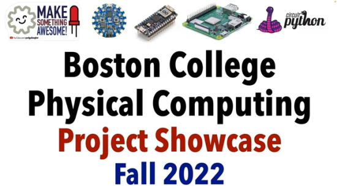](url)

Boston College Physical Computing: Art, Robotics & Tech for Good is a first course in electronics programming. Here is a look at the final Student Project Showcase. All in 
CircuitPython using a selection of Adafruit, Arduino, & Raspberry Pi boards - [YouTube](https://www.youtube.com/watch?v=hvqn81rlOUk) via [Twitter](https://twitter.com/gallaugher/status/1603491215500009480).

A Raspberry Pi Pico powered cubesat running MicroPython - [Twitter](https://twitter.com/JohnChinner/status/1604863924654018565).

[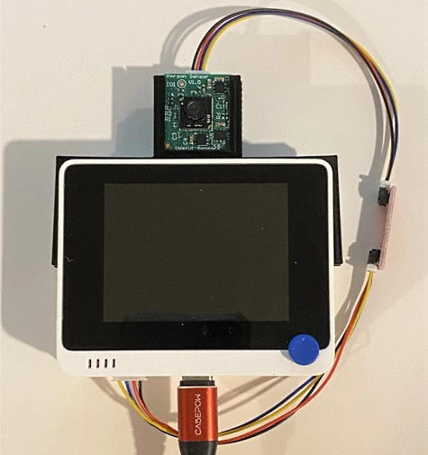](https://community.element14.com/technologies/ai-machine-learning/b/blog/posts/person-sensor-first-test?CMP=SOM-TWITTER-PRG-BLOG-RALPHJY-PERSONSENSORTEST-COMM)

Person-Sensor with a Wio Terminal using CircuitPython performing face detection - [Element14 Community](https://community.element14.com/technologies/ai-machine-learning/b/blog/posts/person-sensor-first-test?CMP=SOM-TWITTER-PRG-BLOG-RALPHJY-PERSONSENSORTEST-COMM) and [YouTube](https://youtu.be/6dQlLOzi774).

> Flashy new Christmas decor: Mario star was programmed with CircuitPython, palm tree from Alpenglow, wreath from [boardaments](https://www.etsy.com/shop/Boardaments) - [Mastodon](https://c.im/@ProfFerrous/109521177331097243).

A MicroPython controlled educational boardgame running on a Pimoroni Pico Lipo with a Raspberry Pi chip on board - [Twitter](https://twitter.com/LewisWorkshop/status/1602406133678936064).

[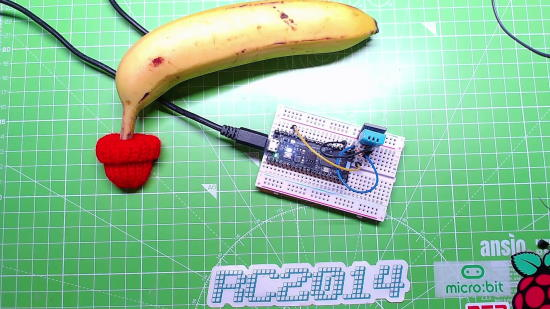](https://twitter.com/biglesp/status/1602386582564110355)

Maker Advent 2022 Day 10: Banana Pi Pico W IoT Christmas Lights with CircuitPython and a HTTP server - [YouTube](https://www.youtube.com/watch?v=6A6zzZY03OI) and [GitHub](https://github.com/lesp/MakerAdvent2022).

Maker Advent 2022 Day 12: Banana Pi Pico W DHT11 Temperature Sensor with CircuitPython - [Twitter](https://twitter.com/biglesp/status/1602386582564110355) and [YouTube](https://www.youtube.com/watch?v=0jmq6VWI0Ms).

How to design and make a robot - [YouTube](https://www.youtube.com/watch?v=lKxJUViQsW8).

Getting the GitHub commit graph working on the Pimoroni Galactic Unicorn - [Twitter](https://twitter.com/sandyjmacdonald/status/1602408276850839563).

[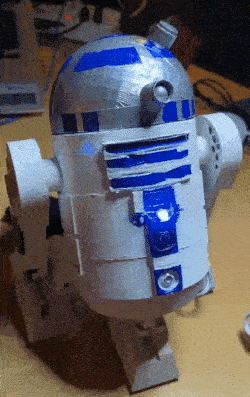](https://twitter.com/STSKANTA/status/1602738484615471106)

R2D2 Robot works with Raspberry Pi Pico and a Servo, programmed in MicroPython - [Twitter](https://twitter.com/STSKANTA/status/1602738484615471106).

[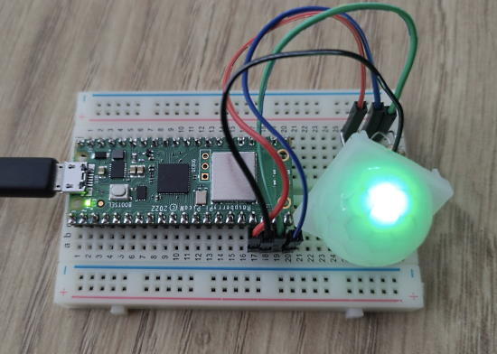](https://www.raspberrypi.com/news/pico-w-iot-with-anvil-mood-lamp-hackspace-62/)

Making a mood lamp using a Pico W IoT with Anvil and MicroPython - [Raspberry Pi](https://www.raspberrypi.com/news/pico-w-iot-with-anvil-mood-lamp-hackspace-62/).

[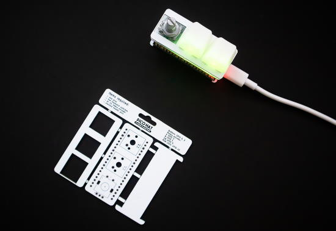](https://github.com/nataliethenerd/picohatpad)

Pico Hat Pad: A Raspberry Pi Pico hat with two mechanical switches and a rotary encoder. Powered by KMK using CircuitPython - [GitHub](https://github.com/nataliethenerd/picohatpad) via [Twitter](https://twitter.com/natalie_thenerd/status/1604763624803041280).

The RP2040 Stamp Handheld Console is a Flux (preview) product. The system supports Arduino, CircuitPython, and (experimentally) Arduboy games - [lectronz](https://lectronz.com/products/rp2040-stamp-handheld-console-flux-project) via [Twitter](https://twitter.com/solderparty/status/1604249761044992000) and [GitHub](https://github.com/solderparty/rp2040_stamp_console_hw).

A Seeed Xiao nRF52840 inside a Compact Flash card with CircuitPython - [Twitter](https://twitter.com/bill88t/status/1604271860006490116).

A LEGO Raspberry Pi Pico-powered MIDI keyboard using parts from a broken toy piano, programmmed in CircuitPython with the Adafruit MIDI Library - [Twitter](https://twitter.com/clem_corbin/status/1602740847136546816).

Turn The Radio Volume Down For Adverts and DJs talking for a Sonos speaker using the Soco-cli Python library when Tunein is being used - [Matthew Felgate](https://matthewfelgate.wordpress.com/2022/12/14/turn-the-radio-volume-down-for-adverts-and-djs-talking/).

How to Set Up a Virtual Environment in Python – and why it's useful - [freeCodeCamp](https://www.freecodecamp.org/news/how-to-setup-virtual-environments-in-python/).

Parallelization in Python: The Easy Way - [Towards Data Science](https://towardsdatascience.com/parallelization-in-python-the-easy-way-aa03ed04c209).

PyDev of the Week: Robert Smallshire on [Mouse vs Python](https://www.blog.pythonlibrary.org/2022/12/19/pydev-of-the-week-robert-smallshire/)

CircuitPython Weekly Meeting for December 19, 2022 ([notes](https://github.com/adafruit/adafruit-circuitpython-weekly-meeting/blob/main/2022/2022-12-19.md)) [on YouTube](https://youtu.be/O23ZXCMZlk8)

#ICYDNCI What was the most popular, most clicked link, in [last week's newsletter](https://www.adafruitdaily.com/2022/12/13/python-on-microcontrollers-newsletter-circuitpython-8-beta-5-released-more-raspberry-pis-are-coming-more-circuitpython-micropython-thepsf-raspberry_pi/)? [20 Best Raspberry Pi Alternatives | Best Single-Board Computer To Try](https://www.ubuntupit.com/best-raspberry-pi-alternatives/).

## Coming Soon

[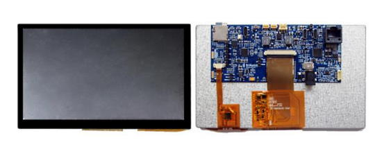](https://www.digikey.com/en/product-highlight/b/bridgetek/idm2040-7a-idm)

Bridgetek's IDM2040-7A intelligent display module features a 7” 800x480 capacitive touch panel. The module carries the latest generation EVE4 controller BT817 supported by a low-cost high-performance RP2040 microcontroller. The onboard RS485 transceiver allows communication with long-distance sensor bus (LDSBus) devices or DMX512 devices through Cat 5/Cat 6 cables over an RJ45 connector. The input power supply can be either a Type-C PD charger or a PSU via the DC jack. The Type-C PD port is controlled by FTDI’s FT232HP PD controller with a PD sink profile programmable through the FTDI utility FT_PROG. With the use of a Raspberry Pi RP2040 MCU, the IDM2040-7A module allows easy programming with various CircuitPython or MicroPython libraries - [DigiKey](https://www.digikey.com/en/product-highlight/b/bridgetek/idm2040-7a-idm).

## New Boards Supported by CircuitPython

The number of supported microcontrollers and Single Board Computers (SBC) grows every week. This section outlines which boards have been included in CircuitPython or added to [CircuitPython.org](https://circuitpython.org/).

This week, there were no new boards added, but several are being added soon.

*Note: For non-Adafruit boards, please use the support forums of the board manufacturer for assistance, as Adafruit does not have the hardware to assist in troubleshooting.*

Looking to add a new board to CircuitPython? It's highly encouraged! Adafruit has four guides to help you do so:

- [How to Add a New Board to CircuitPython](https://learn.adafruit.com/how-to-add-a-new-board-to-circuitpython/overview)
- [How to add a New Board to the circuitpython.org website](https://learn.adafruit.com/how-to-add-a-new-board-to-the-circuitpython-org-website)
- [Adding a Single Board Computer to PlatformDetect for Blinka](https://learn.adafruit.com/adding-a-single-board-computer-to-platformdetect-for-blinka)
- [Adding a Single Board Computer to Blinka](https://learn.adafruit.com/adding-a-single-board-computer-to-blinka)

## New Learn Guides!

[Adafruit MOSFET Driver](https://learn.adafruit.com/adafruit-mosfet-driver) from [Liz Clark](https://learn.adafruit.com/u/BlitzCityDIY)

[Adafruit EYESPI Breakout Board](https://learn.adafruit.com/adafruit-eyespi-breakout-board) from [Liz Clark](https://learn.adafruit.com/u/BlitzCityDIY) and [Kattni](https://learn.adafruit.com/u/kattni)

## CircuitPython Libraries!

CircuitPython support for hardware continues to grow. We are adding support for new sensors and breakouts all the time, as well as improving on the drivers we already have. As we add more libraries and update current ones, you can keep up with all the changes right here!

For the latest libraries, download the [Adafruit CircuitPython Library Bundle](https://circuitpython.org/libraries). For the latest community contributed libraries, download the [CircuitPython Community Bundle](https://github.com/adafruit/CircuitPython_Community_Bundle/releases).

If you'd like to contribute, CircuitPython libraries are a great place to start. Have an idea for a new driver? File an issue on [CircuitPython](https://github.com/adafruit/circuitpython/issues)! Have you written a library you'd like to make available? Submit it to the [CircuitPython Community Bundle](https://github.com/adafruit/CircuitPython_Community_Bundle). Interested in helping with current libraries? Check out the [CircuitPython.org Contributing page](https://circuitpython.org/contributing). We've included open pull requests and issues from the libraries, and details about repo-level issues that need to be addressed. We have a guide on [contributing to CircuitPython with Git and GitHub](https://learn.adafruit.com/contribute-to-circuitpython-with-git-and-github) if you need help getting started. You can also find us in the #circuitpython channels on the [Adafruit Discord](https://adafru.it/discord).

You can check out this [list of all the Adafruit CircuitPython libraries and drivers available](https://github.com/adafruit/Adafruit_CircuitPython_Bundle/blob/master/circuitpython_library_list.md). 

The current number of CircuitPython libraries is **395**!

**Updated Libraries!**

Here's this week's updated CircuitPython libraries:

  * [Adafruit_CircuitPython_Nunchuk](https://github.com/adafruit/Adafruit_CircuitPython_Nunchuk)
  * [Adafruit_CircuitPython_Typing](https://github.com/adafruit/Adafruit_CircuitPython_Typing)
  * [Adafruit_CircuitPython_PixelMap](https://github.com/adafruit/Adafruit_CircuitPython_PixelMap)
  * [Adafruit_CircuitPython_MiniMQTT](https://github.com/adafruit/Adafruit_CircuitPython_MiniMQTT)
  * [Adafruit_CircuitPython_Register](https://github.com/adafruit/Adafruit_CircuitPython_Register)
  * [Adafruit_CircuitPython_TestRepo](https://github.com/adafruit/Adafruit_CircuitPython_TestRepo)
  * [Adafruit_CircuitPython_MCP2515](https://github.com/adafruit/Adafruit_CircuitPython_MCP2515)
  * [Adafruit_CircuitPython_DisplayIO_Layout](https://github.com/adafruit/Adafruit_CircuitPython_DisplayIO_Layout)
  * [CircuitPython_Community_Bundle](https://github.com/adafruit/CircuitPython_Community_Bundle)

**Library PyPI Weekly Download Stats**
* **Total Library Stats**
  * 121295 PyPI downloads over 306 libraries
* **Top 10 Libraries by PyPI Downloads**
  * Adafruit CircuitPython BusDevice (adafruit-circuitpython-busdevice): 17800
  * Adafruit CircuitPython Requests (adafruit-circuitpython-requests): 17305
  * Adafruit CircuitPython Register (adafruit-circuitpython-register): 1630
  * Adafruit CircuitPython MiniMQTT (adafruit-circuitpython-minimqtt): 1136
  * Adafruit CircuitPython DHT (adafruit-circuitpython-dht): 1095
  * Adafruit CircuitPython NeoPixel (adafruit-circuitpython-neopixel): 861
  * Adafruit CircuitPython ESP32SPI (adafruit-circuitpython-esp32spi): 836
  * Adafruit CircuitPython Display Text (adafruit-circuitpython-display-text): 775
  * Adafruit CircuitPython Motor (adafruit-circuitpython-motor): 717
  * Adafruit CircuitPython SSD1306 (adafruit-circuitpython-ssd1306): 687

## What’s the team up to this week?

What is the team up to this week? Let’s check in!

**Dan**

I've been researching and fixing a variety of issues for the CircuitPython 8.0.0 release. Some issues were fixed easily, some were not reproducible, and some I moved forward, past 8.0.0. We have about a dozen issues open: the number goes up and down, but the trend is down!

**Kattni**

This week I collaborated with Liz to publish the [EYESPI Breakout Board](https://learn.adafruit.com/adafruit-eyespi-breakout-board) guide. It has everything you need to get started with your EYESPI breakout. If you picked one of these up and need more info or a little help getting started, check out this guide!

The next guide is a scrolling countdown timer using three quad alphanumeric STEMMA QT display backpacks, and a QT Py ESP32-S2. You can customise it for any event you would like to count down to, and it scrolls the time left until that event, as well as displaying any message you choose when the event starts. 

**Melissa**

I've been out most of the past week due to the death of a close friend. Prior to that I was working on updating code.circuitpython.org and rewriting the USB workflow to make use of the File System Access api. The initial pull request was merged in and I have been working on polishing the changes up to make the USB workflow even more usable.

**Tim**

I have been working on helper functions that generate lists of colors representing a gradient between two or more given input colors. I've implemented 3 different types of increasing complexity: linear, polylinear, and bezier gradients. I have experimented with visualizing with displayio and vectorio. I'm hoping to use the gradients with neopixels and led_animation ultimately as well.

**Jeff**

The `settings.toml` change I mentioned in the last newsletter has finally been merged, and will be in *beta.6* and newer! Aside from that, I worked on some hidden problems with building CircuitPython that was a pre-existing problem that was exposed when a new version of isort was released.

Here's a quick tutorial on `settings.toml`:
 * Just like the removed `.env` support, these values are used e.g., to set up the web workflow, or can be retrieved with a call to `os.getenv()`
 * CircuitPython supports a subset of the full toml syntax.
 * It supports simple string and integer values
 * It supports comments which start with "#"
 * Each line should be of the form "NAME=value".
 * String values have to be enclosed in double quotes (`NAME="string value"`). You can directly use non-ASCII characters like œ or 🎉 as long as you save in UTF-8 format. Or, you can use non-ascii characters with a `\uxxxx` 4-digit code.
 * Integers must *not* be quoted. They may be in decimal or hexadecimal format only. (`NAME=42`)
 * A non-supported value type *that is written on a single line* will not cause a compatibility problem. However, trying to retrieve the value will generally result in an exception
 * A non-supported value *that is written on multiple lines* (like triple quoted strings) can cause a problem if one of the contained lines looks like a supported `NAME=value` line.
 * Parsing ends at a line that starts with `[`.

We'll be updating our guides and sample code that referred to `.env` to reflect the new `settings.toml` way of doing things shortly after the release of beta.6.

**Scott**

This week I've continued working on the coprocessor/ULP support for the ESP32-S2 and S3. I've been testing a ULP program that reads a pin input and then wakes up the main core when the pin goes low. It now works during pretend deep sleep but not full deep sleep. Once I get that working, I hope to send out the pull request.

**Liz**

I worked on the [EYESPI breakout board guide](https://learn.adafruit.com/adafruit-eyespi-breakout-board) with Kattni. It gives a basic overview on how to use the EYESPI breakout and EYESPI connector port on the newer SPI displays in the shop. I'd always avoided SPI displays in the past because of the wiring but this breakout with the FPC cable makes everything a lot simpler. I think folks will especially find this standard to be especially useful for cyberdecks.

I also worked on the [MOSFET Driver Learn Guide](https://learn.adafruit.com/adafruit-mosfet-driver). This breakout has the MOSFET diode circuit that is needed for driving things like high power LED's, motors and solenoids. The terminal block onboard is very fancy and provides a sturdy connection. 

## Upcoming events!

The next MicroPython Meetup in Melbourne will be on January 25th – [Meetup](https://www.meetup.com/MicroPython-Meetup/). Slides from the October meeting are [here](https://docs.google.com/presentation/d/e/2PACX-1vQnJM1r7vFuRMq9bzHWXKyjvnmQsDRB30OMVE5Ujcgv75_NGg3prgQ_QzAtVyJoQEdM-x5HvgSrFXS9/pub?slide=id.p).

FOSDEM is a free event for software developers to meet, share ideas and collaborate. Every year, thousands of developers of free and open source software from all over the world gather at the event in Brussels. February 4-5, 2023 in Brussels, Belgium - [Fosdem](https://fosdem.org/2023/).

PyCon US 2023 will be April 19-17, 2023, again in Salt Lake City, Utah USA - [PyCon US 2023](https://us.pycon.org/2023/).

**Send Your Events In**

As for other events, with the COVID pandemic, most in-person events are postponed or held online. If you know of virtual events or upcoming events, please let us know on Twitter with hashtag #CircuitPython or email to cpnews(at)adafruit(dot)com.

## Latest releases

CircuitPython's stable release is [7.3.3](https://github.com/adafruit/circuitpython/releases/latest) and its unstable release is [8.0.0-beta.5](https://github.com/adafruit/circuitpython/releases). New to CircuitPython? Start with our [Welcome to CircuitPython Guide](https://learn.adafruit.com/welcome-to-circuitpython).

[20221219](https://github.com/adafruit/Adafruit_CircuitPython_Bundle/releases/latest) is the latest CircuitPython library bundle.

[v1.19.1](https://micropython.org/download) is the latest MicroPython release. Documentation for it is [here](http://docs.micropython.org/en/latest/pyboard/).

[3.11.1](https://www.python.org/downloads/) is the latest Python release. The latest pre-release version is [3.12.0a3](https://www.python.org/download/pre-releases/).

[3,322 Stars](https://github.com/adafruit/circuitpython/stargazers) Like CircuitPython? [Star it on GitHub!](https://github.com/adafruit/circuitpython)

## Call for help -- Translating CircuitPython is now easier than ever!

[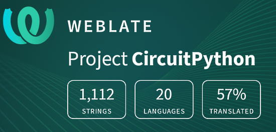](https://hosted.weblate.org/engage/circuitpython/)

One important feature of CircuitPython is translated control and error messages. With the help of fellow open source project [Weblate](https://weblate.org/), we're making it even easier to add or improve translations. 

Sign in with an existing account such as GitHub, Google or Facebook and start contributing through a simple web interface. No forks or pull requests needed! As always, if you run into trouble join us on [Discord](https://adafru.it/discord), we're here to help.

## jobs.adafruit.com - Find a dream job, find great candidates!

[jobs.adafruit.com](https://jobs.adafruit.com/) has returned and folks are posting their skills (including CircuitPython) and companies are looking for talented makers to join their companies - from Digi-Key, to Hackaday, Micro Center, Raspberry Pi and more.

## 36,188 thanks!

The Adafruit Discord community, where we do all our CircuitPython development in the open, reached over 36,188 humans - thank you!  Adafruit believes Discord offers a unique way for Python on hardware folks to connect. Join today at [https://adafru.it/discord](https://adafru.it/discord).

## ICYMI - In case you missed it

Python on hardware is the Adafruit Python video-newsletter-podcast! The news comes from the Python community, Discord, Adafruit communities and more and is broadcast on ASK an ENGINEER Wednesdays. The complete Python on Hardware weekly videocast [playlist is here](https://www.youtube.com/playlist?list=PLjF7R1fz_OOXRMjM7Sm0J2Xt6H81TdDev). The video podcast is on [iTunes](https://itunes.apple.com/us/podcast/python-on-hardware/id1451685192?mt=2), [YouTube](http://adafru.it/pohepisodes), [IGTV (Instagram TV](https://www.instagram.com/adafruit/channel/)), and [XML](https://itunes.apple.com/us/podcast/python-on-hardware/id1451685192?mt=2).

[The weekly community chat on Adafruit Discord server CircuitPython channel - Audio / Podcast edition](https://itunes.apple.com/us/podcast/circuitpython-weekly-meeting/id1451685016) - Audio from the Discord chat space for CircuitPython, meetings are usually Mondays at 2pm ET, this is the audio version on [iTunes](https://itunes.apple.com/us/podcast/circuitpython-weekly-meeting/id1451685016), Pocket Casts, [Spotify](https://adafru.it/spotify), and [XML feed](https://adafruit-podcasts.s3.amazonaws.com/circuitpython_weekly_meeting/audio-podcast.xml).

## Codecademy "Learn Hardware Programming with CircuitPython"

Codecademy, an online interactive learning platform used by more than 45 million people, has teamed up with Adafruit to create a coding course, “Learn Hardware Programming with CircuitPython”. The course is now available in the [Codecademy catalog](https://www.codecademy.com/learn/learn-circuitpython?utm_source=adafruit&utm_medium=partners&utm_campaign=circuitplayground&utm_content=pythononhardwarenewsletter).

## Contribute!

The CircuitPython Weekly Newsletter is a CircuitPython community-run newsletter emailed every Tuesday. The complete [archives are here](https://www.adafruitdaily.com/category/circuitpython/). It highlights the latest CircuitPython related news from around the web including Python and MicroPython developments. To contribute, edit next week's draft [on GitHub](https://github.com/adafruit/circuitpython-weekly-newsletter/tree/gh-pages/_drafts) and [submit a pull request](https://help.github.com/articles/editing-files-in-your-repository/) with the changes. You may also tag your information on Twitter with #CircuitPython. 

Join the Adafruit [Discord](https://adafru.it/discord) or [post to the forum](https://forums.adafruit.com/viewforum.php?f=60) if you have questions.
