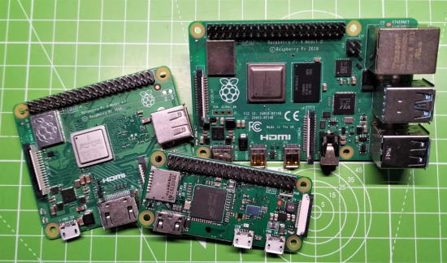
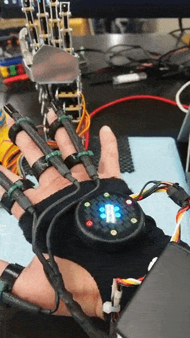
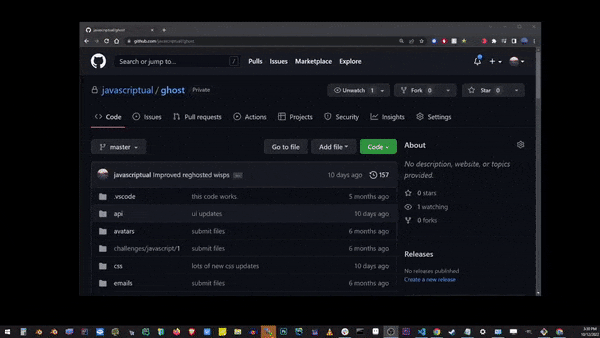
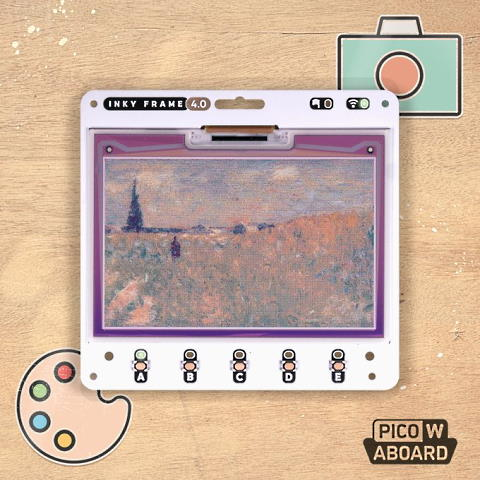

View this email in your browser. **Warning: Flashing Imagery**

Welcome to the latest Python on Microcontrollers newsletter! We're almost to a new year! Lots of content this week. Plus see my editorial note below. Thank you for your subscription! - *Ed.*

We're on [Discord](https://discord.gg/HYqvREz), [Twitter](https://twitter.com/search?q=circuitpython&src=typed_query&f=live), and for past newsletters - [view them all here](https://www.adafruitdaily.com/category/circuitpython/). If you're reading this on the web, [subscribe here](https://www.adafruitdaily.com/). Here's the news this week:

## CircuitPython 8.0.0 Beta 6 Released

CircuitPython 8.0.0-beta.6 has been released. It is relatively stable, but there will be further additions, fixes, and changes before final release.

NOTE: The file for specifying startup values for WiFi, etc. is now called settings.toml instead of .env, and uses slightly different syntax. Use double quotes instead of single quotes. Further documentation is here - [Adafruit Blog](https://blog.adafruit.com/2022/12/21/circuitpython-8-0-0-beta-6-released/) and [GitHub](https://github.com/adafruit/circuitpython/releases/tag/8.0.0-beta.6).

## TinyUSB Adds BitBang USB Host Support for Raspberry Pi RP2040

Many microcontrollers have USB device support but few have USB host support. This week, Adafruit and TinyUSB announced that USB host support has been added to the Raspberry Pi RP2040 microcontroller. Host support uses the RP2040 PIO (programmable input/output) peripheral to implement a host USB peripheral on a set of GPIO pins. The regular USB peripheral connection still works as before. Currently host CDC (serial) and MSC (mass storage) are supported. RP2040 USB host support is limited to Arduino at the moment but hopefully Python support will be forthcoming - [Adafruit Blog](https://blog.adafruit.com/2022/12/22/rp2040-programming-an-rp2040-flash-inception/), [YouTube](https://youtu.be/sjl7aVK2Q2U) and [GitHub](https://github.com/adafruit/Adafruit_TinyUSB_Arduino/tree/master/examples/DualRole).

## Coming Up: CircuitPython 2023

The annual wrap-up and wish list for CircuitPython is coming soon. Follow the [Adafruit Blog](https://blog.adafruit.com/) for a post from CircuitPython lead developer Scott Shawcroft.

## Raspberry Pi 5 Not Launching Until After 2023

Raspberry Pi CEO Eben Upton has stated the supply chain shortage has impacted the normal cadence of Raspberry Pi releases, and according to Upton in an interview with Christopher Barnatt from Explaining Computers, it means we sadly won't be seeing a Raspberry Pi 5 in 2023 - [Tom's Hardware](https://www.tomshardware.com/news/raspberry-pi-5-after-2023).

## Eben Upton interview: Raspberry Pi availability and more

Eben Upton was interviewed by Chris Barnatt this week. Rge Raspberry Pi CEO discussed Raspberry Pi availability and more - [Adafruit Blog](https://blog.adafruit.com/2022/12/22/eben-upton-interview-raspberry-pi-availability-and-more-raspberrypi-chrisbarnatt-raspberry_pi/) and [YouTube](https://youtu.be/P9vna9jao9I).

## ESP32 GitHub Updates Over the Air with MicroPython and uGit

ugit allows one to keep your remote ESP32 devices in sync with a GitHub repository. Clone an entire MicroPython repository to an internet enabled MicroPython microcontroller. You can use it to periodically update the entire ESP32 MicroPython file structure to match an open GitHub repository - [Adafruit Blog](https://blog.adafruit.com/2022/12/23/get-esp32-github-updates-over-the-air-with-micropython-python-esp32-micropython-hackaday-turfptax/), [GitHub](https://github.com/turfptax/ugit), [YouTube](https://youtu.be/UX87SrdqIoc) and [Hackaday](https://hackaday.com/2022/12/23/github-esp32-ota-updates-now-in-micropython-flavor/).

### MPBridge

Another file sync program for MicroPython is MPBridge, a command line tool for Windows, macOS, Linux and FreeBSD - [GitHub](https://github.com/AmirHmZz/mpbridge).

## Thank You, Readers

Thank you to all our readers for a wonderful year! I set the goal of over 10,000 subscribers a week, a number we surpassed a few weeks ago. I look to find some of the best information on using Python on microcontrollers and single board computers (SBC) each week. The industry is thriving, so filling a weekly newsletter is easier than ever. 2023 looks especially bright with advances in RISC-V, the chip shortages easing and the proliferation of open source software. I look forward to seeing what's next - *Anne Barela, Editor*

## This Week's Python Streams

Python on Hardware is all about building a cooperative ecosphere which allows contributions to be valued and to grow knowledge. Below are the streams within the last week focusing on the community.

### CircuitPython Deep Dive Stream

[This week](https://www.youtube.com/playlist?list=PLjF7R1fz_OOXBHlu9msoXq2jQN4JpCk8A), Tim is off for the holidays.

You can see past videos on the Adafruit YouTube channel under the Deep Dive playlist - [YouTube](https://www.youtube.com/playlist?list=PLjF7R1fz_OOXBHlu9msoXq2jQN4JpCk8A).

### CircuitPython Parsec

John Park’s CircuitPython Parsec this week is off so John and Lars can enjoy the holidays.

Catch all the episodes in the [YouTube playlist](https://www.youtube.com/playlist?list=PLjF7R1fz_OOWFqZfqW9jlvQSIUmwn9lWr).

## Project of the Week: Remote Articulated Hand

Using a sensing glove to control a robotic hand over Bluetooth. Uses [Adafruit flexible sensors](https://www.adafruit.com/product/1070) to detect the finger movement. Programmed in MicroPython - [Twitter](https://twitter.com/enapapa/status/1605049721181339648).

> Hand robot ESP32 to BLE Central and Dataglove ESP32 to BLE Peripheral. It connects with Bluetooth and sends finger data from the data glove to move the robot's servo. Once you understand it, you can communicate with BLE more easily than WiFi.

## News from around the web!

Top ten RISC-V articles in 2022 - [eeNews](https://www.eenewseurope.com/en/top-ten-risc-v-articles-in-2022/).

Having a Happy Hannukah with a CircuitPython Menorah - [Adafruit Blog](https://blog.adafruit.com/2022/12/22/have-a-happy-hannukah-with-a-circuitpython-menorah/) and [YouTube](https://youtu.be/Dmfjwy6kytE).

> Another 100 or so NeoPixels around my window and tiny tree. All running CircuitPython on RP2040 controllers - [Twitter](https://twitter.com/MarkKomus/status/1606303139463712769).

Pioneers in Open Source: Kevin Gates, creator of Arduboy - [Adafruit Blog](https://blog.adafruit.com/2022/12/20/pioneers-in-open-source-kevin-gates-creator-of-arduboy-opensource-moduscreate/) and [YouTube](https://youtu.be/o68L8ROMj7g).

A 3D printed balloon with wireless lighting. The animations are written in CircuitPython running on a Xiao ESP32-C3. Using the Adafruit web-workflow IDE to program it remotely to play with different patterns and effects without reconnecting it - [Mastodon](https://mastodon.social/@geekmomprojects/109565632104596796).

A review of CircuitPython on the Xiao ESP32-C3 board and how to setup CircuitPython step by step - [YouTube](https://www.youtube.com/watch?v=QNqqX5uCjgE) (Spanish) via [Twitter](https://twitter.com/cursoderobotica/status/1604945203600969728).

Learn how to connect and read a button to control an LED on a Raspberry Pi using various programming languages and libraries - [Woolsey Workshop](https://www.woolseyworkshop.com/2022/12/22/how-to-use-buttons-with-your-raspberry-pi/).

A Raspberry Pi Pico pinout function - [Twitter](https://twitter.com/martinohanlon/status/1605204374455816192).

> First blinks with CircuitPython, thanks to @todbot and @Anneb for inspiration! This is super great for teaching! - [Mastodon](https://mastodon.social/@rrmutt/109560901125036223).

)

Building the Ultimate Robot against rebellious cats, with Raspberry Pi Zero W and Python - [YouTube](https://www.youtube.com/watch?v=oKNgoTDMkWo).

Low-cost smart gas metering with firmware in MicroPython - [Twitter](https://twitter.com/beyond_sol/status/1605633911727325184).

> I've been sick (not Covid) but now my partner has Covid for the 1st time ever! We are isolating in separate rooms. To connect us, I made wireless messaging mood lamps with NeoPixels, a Raspberry Pi Pico W, and MicroPython. We can subtly say hi to one another using WiFi and MQTT - [Twitter](https://twitter.com/stephaniecodes/status/1606027308321501184).

Merlot, an open-source hardware tri-color wireless E-paper display programmable with Arduino, MicroPython, or the ESP-IDF framework - [CNX Software](https://www.cnx-software.com/2022/12/23/merlot-is-an-open-source-hardware-tri-color-wireless-e-paper-display/).

Github has web-based VSCode built-in. Just change the URL from http://github.com to http://github.dev (or http://github1.com) and the repo you're in opens right up in the VS Code editor in your browser - [GitHub](https://www.linkedin.com/posts/eric-vyacheslav-156273169_github-has-a-built-in-vscode-just-change-activity-7010559501544140800-2WIA/) via [Twitter](https://twitter.com/chr1sa/status/1605227335829008385).

Teletext Recovery with Python - [Andrew Nile](https://www.andrewnile.co.uk/blog/adventures-in-teletext-recovery/).

Upgrading the Chumby 8 Linux kernel - [Adafruit Blog](https://blog.adafruit.com/2022/12/22/upgrading-the-chumby-8-linux-kernel-chumby-linux/), [Hackaday](https://hackaday.com/2022/12/21/chumby-gets-new-kernel-soon/), and [Doug Brown](https://www.downtowndougbrown.com/2022/12/upgrading-my-old-chumby-8-linux-kernel-part-1-u-boot/).

Programming as play - [Austin Henley](https://austinhenley.com/blog/programmingasplay.html).

How to Automatically Send Whatsapp Messages using Python - [morioh.com](https://morioh.com/p/560711b49e4a?f=5c21fb01c16e2556b555ab32).

Converting Video To Audio Without Internet Using Python - [morioh.com](https://morioh.com/p/b930cef51308?f=5c21fb01c16e2556b555ab32).

Boring Python: code quality - [James Bennett](https://www.b-list.org/weblog/2022/dec/19/boring-python-code-quality/).

PyDev of the Week: Robert Smallshire on [Mouse vs Python](https://www.blog.pythonlibrary.org/2022/12/19/pydev-of-the-week-robert-smallshire/)

CircuitPython Weekly Meeting for DATE ([notes]()) [on YouTube]()

#ICYDNCI What was the most popular, most clicked link, in [last week's newsletter](https://www.adafruitdaily.com/2022/12/20/python-on-microcontrollers-newsletter-macos-update-helps-uf2-uploads-a-major-pyleap-update-and-much-more-circuitpython-micropython-thepsf-raspberry_pi/)? [Raspberry Pi Handbook 2023](https://magpi.raspberrypi.com/books/handbook-2023).

## New

Pimoroni Inky Frame 4.0" - a neat, petite Raspberry Pi Pico W-powered E-Ink display with WiFi - [Pimoroni](https://shop.pimoroni.com/products/inky-frame-4?variant=40443825094739).

Banana BPI-Bit-S2 BBC Micro:bit compatible board supports WiFi. T the BPI-Bit-S2 board supports Webduino (Blocky) to develop programs in a web browser using a visual editor, as well as MicroPython, CircuitPython, and the Arduino IDE - [CNX Software](https://www.cnx-software.com/2022/12/22/banana-bpi-bit-s2-bbc-microbitboard-wifi/).

MinCab v3 has been released. It is billed as the smallest carrier board for Raspberry Pi with Serial and SD-card ports on board. Access and configure a Raspberry Pi CM4 even from your phone, even if the board has no WiFi. It's Open-Source and on [GitHub](https://github.com/merocle/mincab) - [Twitter](https://twitter.com/Merocle/status/1607357027805700097).

## New Boards Supported by CircuitPython

The number of supported microcontrollers and Single Board Computers (SBC) grows every week. This section outlines which boards have been included in CircuitPython or added to [CircuitPython.org](https://circuitpython.org/).

This week, there were thirteen new boards added!

- [ESP32-S3 Box Lite](https://circuitpython.org/board/espressif_esp32s3_box_lite/)
- [ESP32-S2-DevKitC-1-N8R2](https://circuitpython.org/board/espressif_esp32s2_devkitc_1_n8r2/)
- [The Frood](https://circuitpython.org/board/42keebs_frood/)
- [M5Stack Basic Core IoT](https://circuitpython.org/board/m5stack_core_basic/)
- [M5Stack Stamp C3](https://circuitpython.org/board/m5stack_stamp_c3/)
- [M5Stack ATOM Lite ESP32 IoT](https://circuitpython.org/board/m5stack_atom_lite/)
- [M5Stack Core Fire](https://circuitpython.org/board/m5stack_core_fire/)
- [PillBug](https://circuitpython.org/board/pillbug/)
- [Maker badge](https://circuitpython.org/board/maker_badge/)
- [CRCibernetica IdeaBoard](https://circuitpython.org/board/crcibernetica_ideaboard/)
- [Luatos Core ESP32C3](https://circuitpython.org/board/luatos_core_esp32c3/)
- [Odroid M1](https://circuitpython.org/blinka/odroid_m1/)
- [ODYSSEY - X86J4105](https://circuitpython.org/blinka/odyssey_x86j4105/)

*Note: For non-Adafruit boards, please use the support forums of the board manufacturer for assistance, as Adafruit does not have the hardware to assist in troubleshooting.*

Looking to add a new board to CircuitPython? It's highly encouraged! Adafruit has four guides to help you do so:

- [How to Add a New Board to CircuitPython](https://learn.adafruit.com/how-to-add-a-new-board-to-circuitpython/overview)
- [How to add a New Board to the circuitpython.org website](https://learn.adafruit.com/how-to-add-a-new-board-to-the-circuitpython-org-website)
- [Adding a Single Board Computer to PlatformDetect for Blinka](https://learn.adafruit.com/adding-a-single-board-computer-to-platformdetect-for-blinka)
- [Adding a Single Board Computer to Blinka](https://learn.adafruit.com/adding-a-single-board-computer-to-blinka)

## New Learn Guides!

[Scrolling Countdown Timer](https://learn.adafruit.com/scrolling-countdown-timer) from [Kattni Rembor](https://learn.adafruit.com/u/kattni)

[NeoPixel Sprite Weather Display](https://learn.adafruit.com/neopixel-sprite-weather-display) from [Liz Clark](https://learn.adafruit.com/u/BlitzCityDIY)

## Updated Learn Guides!

[Pico W HTTP Server with CircuitPython](https://learn.adafruit.com/pico-w-http-server-with-circuitpython) from [Liz Clark](https://learn.adafruit.com/u/BlitzCityDIY)

[NeXT Computer Keyboard to USB HID with CircuitPython](https://learn.adafruit.com/next-computer-keyboard-to-usb-hid-with-circuitpython) from [Jeff Epler](https://learn.adafruit.com/u/jepler)

## CircuitPython Libraries!

CircuitPython support for hardware continues to grow. We are adding support for new sensors and breakouts all the time, as well as improving on the drivers we already have. As we add more libraries and update current ones, you can keep up with all the changes right here!

For the latest libraries, download the [Adafruit CircuitPython Library Bundle](https://circuitpython.org/libraries). For the latest community contributed libraries, download the [CircuitPython Community Bundle](https://github.com/adafruit/CircuitPython_Community_Bundle/releases).

If you'd like to contribute, CircuitPython libraries are a great place to start. Have an idea for a new driver? File an issue on [CircuitPython](https://github.com/adafruit/circuitpython/issues)! Have you written a library you'd like to make available? Submit it to the [CircuitPython Community Bundle](https://github.com/adafruit/CircuitPython_Community_Bundle). Interested in helping with current libraries? Check out the [CircuitPython.org Contributing page](https://circuitpython.org/contributing). We've included open pull requests and issues from the libraries, and details about repo-level issues that need to be addressed. We have a guide on [contributing to CircuitPython with Git and GitHub](https://learn.adafruit.com/contribute-to-circuitpython-with-git-and-github) if you need help getting started. You can also find us in the #circuitpython channels on the [Adafruit Discord](https://adafru.it/discord).

You can check out this [list of all the Adafruit CircuitPython libraries and drivers available](https://github.com/adafruit/Adafruit_CircuitPython_Bundle/blob/master/circuitpython_library_list.md). 

The current number of CircuitPython libraries is **357**!

**Updated Libraries!**

Here's this week's updated CircuitPython libraries:

* [Adafruit_CircuitPython_Logging](https://github.com/adafruit/Adafruit_CircuitPython_Logging)
* [CircuitPython_Community_Bundle](https://github.com/adafruit/CircuitPython_Community_Bundle)

**Updated Community Libraries**

* [CedarGroveStudios/CircuitPython_PaletteFader](https://github.com/CedarGroveStudios/CircuitPython_PaletteFader)

### Library PyPI Weekly Download Stats

**Total Library Stats**

* 93431 PyPI downloads over 306 libraries

**Top 10 Libraries by PyPI Downloads**

* Adafruit CircuitPython BusDevice (adafruit-circuitpython-busdevice): 16668
* Adafruit CircuitPython Requests (adafruit-circuitpython-requests): 14852
* Adafruit CircuitPython DHT (adafruit-circuitpython-dht): 1260
* Adafruit CircuitPython Register (adafruit-circuitpython-register): 1193
* Adafruit CircuitPython MCP230xx (adafruit-circuitpython-mcp230xx): 931
* Adafruit CircuitPython BMP280 (adafruit-circuitpython-bmp280): 835
* Adafruit CircuitPython Display Text (adafruit-circuitpython-display-text): 657
* Adafruit CircuitPython PCA9685 (adafruit-circuitpython-pca9685): 654
* Adafruit CircuitPython ESP32SPI (adafruit-circuitpython-esp32spi): 605
* Adafruit CircuitPython framebuf (adafruit-circuitpython-framebuf): 558

## What’s the team up to this week?

What is the team up to this week? Let’s check in!

**Dan**

I released CircuitPython 8.0.0-beta.6 on Wednesday 12/21. This release includes the change from .env to settings.toml, and a rework of the coprocessor API, more specialized for the Espressif ULP (ultra low power) RISC-V coprocessor.

I fixed several miscellaneous problems for this release, including a crash only when running debug builds on Cortex-M4. That turned out to be an obscure compiler-related issue: tracking it down involved looking at the generated assembly code. I discovered I had fixed more or less the same problem five years ago (!), but it reappeared.

We now have only five or six remaining issues to resolve for CircuitPython 8.0.0 final. I'm looking forward to seeing 8.0.0 in general release.

**Kattni**

This week I published the [Scrolling Countdown Timer](https://learn.adafruit.com/scrolling-countdown-timer) guide. This was a collaboration with [Liz](https://learn.adafruit.com/u/BlitzCityDIY) and [Noe](https://learn.adafruit.com/u/pixil3d). It walks you through building a scrolling event countdown timer using three quad alphanumeric backpacks with displays, a QT Py ESP32-S2, and a 3D printed stand. The guide focusses on the countdown to Christmas, but you can easily edit the code to countdown to anything! Check it out!

As 2022 comes to an end, I want to say thank you to everyone in our community, to the folks who read my guides, and to all who contribute to the CircuitPython project in all ways, big and small. Code + Community = CircuitPython. Without our community, CircuitPython wouldn't be close to what it is. I greatly appreciate all of you. Have a wonderful holiday or time off, and a wonderful start to 2023!

**Melissa**

This past week I worked on adding some finishing touches to [code.circuitpython.org](https://code.circuitpython.org/). Due to the holidays, the changes likely won't be merged in until the beginning of next year because the person I would like to take a look is taking time off. In the mean time, I plan to turn my focus to the main [circuitpython.org](https://circuitpython.org/) website.

**Tim**

This week I tested and reviewed various library PRs. Including some to add multi-handler functionality to Logger objects and a new example for outputting logs to Adafruit.io via MQTT connection. This can provide some helpful troubleshooting output for IoT devices that are inconvenient to plug in for serial debugging. 

**Jeff**

I've been on a lighter schedule for the holidays, but I did update the NeXT keyboard guide to add support for the NeXT mouse, which can be daisy chained through the keyboard. Check out the updated guide.

**Liz**

This week I worked on the [NeoPixel Sprite Weather Display project](https://learn.adafruit.com/neopixel-sprite-weather-display). It uses a QT Py ESP32-S2 with a 5x5 NeoPixel Grid BFF to display weather sprites and scroll text to display the current temperature. It uses the [Open-Meteo API](https://open-meteo.com/en) to grab weather data. I wanted to do a project with this API since it is open-source and doesn't require an API key.

I will be out for the next two weeks to recharge for the new year. I'm looking forward to working on and sharing more awesome projects in 2023!
Answer for Wednesday, December 21, 2022

## Upcoming events!

The next MicroPython Meetup in Melbourne will be on January 25th – [Meetup](https://www.meetup.com/MicroPython-Meetup/). Slides from the October meeting are [here](https://docs.google.com/presentation/d/e/2PACX-1vQnJM1r7vFuRMq9bzHWXKyjvnmQsDRB30OMVE5Ujcgv75_NGg3prgQ_QzAtVyJoQEdM-x5HvgSrFXS9/pub?slide=id.p).

FOSDEM is a free event for software developers to meet, share ideas and collaborate. Every year, thousands of developers of free and open source software from all over the world gather at the event in Brussels. February 4-5, 2023 in Brussels, Belgium - [Fosdem](https://fosdem.org/2023/).

PyCon US 2023 will be April 19-17, 2023, again in Salt Lake City, Utah USA - [PyCon US 2023](https://us.pycon.org/2023/).

**Send Your Events In**

As for other events, with the COVID pandemic, most in-person events are postponed or held online. If you know of virtual events or upcoming events, please let us know on Twitter with hashtag #CircuitPython or email to cpnews(at)adafruit(dot)com.

## Latest releases

CircuitPython's stable release is [7.3.3](https://github.com/adafruit/circuitpython/releases/latest) and its unstable release is [8.0.0 Beta 6](https://github.com/adafruit/circuitpython/releases). New to CircuitPython? Start with our [Welcome to CircuitPython Guide](https://learn.adafruit.com/welcome-to-circuitpython).

[20221227](https://github.com/adafruit/Adafruit_CircuitPython_Bundle/releases/latest) is the latest CircuitPython library bundle.

[v1.19.1](https://micropython.org/download) is the latest MicroPython release. Documentation for it is [here](http://docs.micropython.org/en/latest/pyboard/).

[3.11.1](https://www.python.org/downloads/) is the latest Python release. The latest pre-release version is [3.12.0a3](https://www.python.org/download/pre-releases/).

[3,342 Stars](https://github.com/adafruit/circuitpython/stargazers) Like CircuitPython? [Star it on GitHub!](https://github.com/adafruit/circuitpython)

## Call for help -- Translating CircuitPython is now easier than ever!

One important feature of CircuitPython is translated control and error messages. With the help of fellow open source project [Weblate](https://weblate.org/), we're making it even easier to add or improve translations. 

Sign in with an existing account such as GitHub, Google or Facebook and start contributing through a simple web interface. No forks or pull requests needed! As always, if you run into trouble join us on [Discord](https://adafru.it/discord), we're here to help.

## jobs.adafruit.com - Find a dream job, find great candidates!

[jobs.adafruit.com](https://jobs.adafruit.com/) has returned and folks are posting their skills (including CircuitPython) and companies are looking for talented makers to join their companies - from Digi-Key, to Hackaday, Micro Center, Raspberry Pi and more.

## 36,224 thanks!

The Adafruit Discord community, where we do all our CircuitPython development in the open, reached over 36,224 humans - thank you!  Adafruit believes Discord offers a unique way for Python on hardware folks to connect. Join today at [https://adafru.it/discord](https://adafru.it/discord).

## ICYMI - In case you missed it

Python on hardware is the Adafruit Python video-newsletter-podcast! The news comes from the Python community, Discord, Adafruit communities and more and is broadcast on ASK an ENGINEER Wednesdays. The complete Python on Hardware weekly videocast [playlist is here](https://www.youtube.com/playlist?list=PLjF7R1fz_OOXRMjM7Sm0J2Xt6H81TdDev). The video podcast is on [iTunes](https://itunes.apple.com/us/podcast/python-on-hardware/id1451685192?mt=2), [YouTube](http://adafru.it/pohepisodes), [IGTV (Instagram TV](https://www.instagram.com/adafruit/channel/)), and [XML](https://itunes.apple.com/us/podcast/python-on-hardware/id1451685192?mt=2).

[The weekly community chat on Adafruit Discord server CircuitPython channel - Audio / Podcast edition](https://itunes.apple.com/us/podcast/circuitpython-weekly-meeting/id1451685016) - Audio from the Discord chat space for CircuitPython, meetings are usually Mondays at 2pm ET, this is the audio version on [iTunes](https://itunes.apple.com/us/podcast/circuitpython-weekly-meeting/id1451685016), Pocket Casts, [Spotify](https://adafru.it/spotify), and [XML feed](https://adafruit-podcasts.s3.amazonaws.com/circuitpython_weekly_meeting/audio-podcast.xml).

## Codecademy "Learn Hardware Programming with CircuitPython"

Codecademy, an online interactive learning platform used by more than 45 million people, has teamed up with Adafruit to create a coding course, “Learn Hardware Programming with CircuitPython”. The course is now available in the [Codecademy catalog](https://www.codecademy.com/learn/learn-circuitpython?utm_source=adafruit&utm_medium=partners&utm_campaign=circuitplayground&utm_content=pythononhardwarenewsletter).

## Contribute!

The CircuitPython Weekly Newsletter is a CircuitPython community-run newsletter emailed every Tuesday. The complete [archives are here](https://www.adafruitdaily.com/category/circuitpython/). It highlights the latest CircuitPython related news from around the web including Python and MicroPython developments. To contribute, edit next week's draft [on GitHub](https://github.com/adafruit/circuitpython-weekly-newsletter/tree/gh-pages/_drafts) and [submit a pull request](https://help.github.com/articles/editing-files-in-your-repository/) with the changes. You may also tag your information on Twitter with #CircuitPython. 

Join the Adafruit [Discord](https://adafru.it/discord) or [post to the forum](https://forums.adafruit.com/viewforum.php?f=60) if you have questions.
