- [X] Kattni updates
- [ ] change date
- [ ] update title
- [ ] Feature story
- [ ] Update  for images
- [ ] Update ICYDNCI
- [ ] All images 550w max only
- [ ] Link "View this email in your browser."

News Sources

- [python.org](https://www.python.org/)
- [Python Insider - dev team blog](https://pythoninsider.blogspot.com/)
- [MicroPython Meetup Blog](https://melbournemicropythonmeetup.github.io/)
- [hackaday.io newest projects MicroPython](https://hackaday.io/projects?tag=micropython&sort=date) and [CircuitPython](https://hackaday.io/projects?tag=circuitpython&sort=date)
- [hackaday CircuitPython](https://hackaday.com/blog/?s=circuitpython) and [MicroPython](https://hackaday.com/blog/?s=micropython)
- [hackster.io CircuitPython](https://www.hackster.io/search?q=circuitpython&i=projects&sort_by=most_recent) and [MicroPython](https://www.hackster.io/search?q=micropython&i=projects&sort_by=most_recent)
- [https://opensource.com/tags/python](https://opensource.com/tags/python)
- [Mastodon CircuitPython](https://octodon.social/tags/CircuitPython)

View this email in your browser. **Warning: Flashing Imagery**

Welcome to the latest Python on Microcontrollers newsletter! This week we highlight some trends - now and into 2023. The market for chips will likely get better, but how long a wait? Python is more in demand than ever - using it for embedded programming makes perfect sense. - *Ed.*

We're on [Discord](https://discord.gg/HYqvREz), [Twitter](https://twitter.com/search?q=circuitpython&src=typed_query&f=live), and for past newsletters - [view them all here](https://www.adafruitdaily.com/category/circuitpython/). If you're reading this on the web, [subscribe here](https://www.adafruitdaily.com/). Here's the news this week:

## JavaScript, Java, and Python skills top demand

JavaScript, Java, and Python skills are in top demand. And demand for TypeScript, Swift, Scala, Kotlin, and Go skills all exceed supply, according to CodinGame-CoderPad tech hiring report. - [InfoWorld](https://www.infoworld.com/article/3685672/javascript-java-and-python-skills-top-demand.html).

> The State of Tech Hiring in 2023, a CodinGame-CoderPad report published January 10, draws on a survey of 14,000 professionals and offers insights into what 2023 may hold for tech industry recruiters and job seekers. Most teams are now hybrid between remote and on-site work. Only 15% work onsite 100% of the time.
Freelance developer work is becoming increasingly popular.

## Why The Chips Are Down: Navigating the Global Chip Shortages and Beyond

The supply chain bottlenecks experienced across the globe start with component shortages and by far the most severe has been for certain semiconductors, or chips - [Jabil](https://www.jabil.com/blog/global-chip-shortages.html).

> Impacts from this sustained demand are primarily being felt at wafer foundries. Wafer starts are the main constraint within the chip supply chain. Even the world's largest chip maker, [TSMC](https://www.theverge.com/2021/7/15/22578361/tsmc-revenue-surge-chip-shortage-continues) — which controls 28% of global semiconductor manufacturing capacity — is experiencing ongoing shortages. To ramp up chip production, manufacturers including Texas Instruments, Intel and TSMC are investing billions of dollars into the construction of new fabs. However, this is not a complete fix in itself; these new facilities have [started coming online, and openings will ramp in 2023 and beyond](https://electronics360.globalspec.com/article/18471/across-5-years-these-are-the-fabs-set-to-debut). 

## CircuitPython in 2023: Let the Devs Know Your Feelings - Last Week to do so!

As the year starts, the CircuitPython development team would like to take some time to share their goals for CircuitPython in 2023 and beyond. Just like past years (full summary [2019](https://blog.adafruit.com/2019/01/28/circuitpython-in-2019/), [2020](https://blog.adafruit.com/2020/02/03/circuitpython2020-recap/), [2021](https://blog.adafruit.com/2021/02/16/circuitpython2021-round-up/), and [2022](https://blog.adafruit.com/2022/02/01/thank-you-for-circuitpython2022/)), they’d like everyone in the Python on hardware community to contribute by posting their thoughts to a public place on the internet by Wednesday January 18th, 2023.

Here are a few ways to post:

* a video on YouTube
* a post on the CircuitPython forum
* a blog post on your site
* a post on Mastodon with tags #CircuitPython and #CircuitPython2023
* a Gist on GitHub

They want to hear from you. When you post, please add #CircuitPython2023 and email circuitpython2023@adafruit.com to let them know about your post so they can post it on the Adafruit Blog.

The post can cover any topic related to CircuitPython. See a suggested list and more in the post on the [Adafruit Blog](https://blog.adafruit.com/2023/01/01/circuitpython-in-2023-circuitpython2023-circuitpython/). This includes any suggestions or comments related to this newsletter.

Posts so far:

* [First #CircuitPython2023 Posts](https://blog.adafruit.com/2023/01/04/first-circuitpython2023-posts/)
* [A few more #CircuitPython2023](https://blog.adafruit.com/2023/01/12/a-few-more-circuitpython2023/)

## What to expect from the Raspberry Pi Foundation in 2023

The Raspberry Pi Foundation has written an article on what to expect from them in 2023 - [Raspberry Pi](https://www.raspberrypi.org/blog/raspberry-pi-foundation-plans-2023/).

## The 4 Best Raspberry Pi Alternatives

[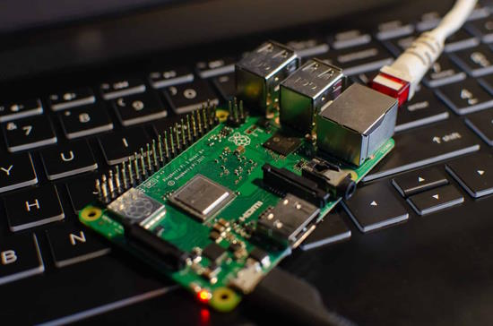](https://history-computer.com/best-raspberry-pi-alternatives/)

History-Computer evaluates the four Best Raspberry Pi alternatives - [History-Computer](https://history-computer.com/best-raspberry-pi-alternatives/).

## This Week's Python Streams

Python on Hardware is all about building a cooperative ecosphere which allows contributions to be valued and to grow knowledge. Below are the streams within the last week focusing on the community.

### CircuitPython Deep Dive Stream

[This week](https://youtu.be/ipIN_g8mRXc), Tim streamed work on Ethernet testing.

You can see the latest video and past videos on the Adafruit YouTube channel under the Deep Dive playlist - [YouTube](https://www.youtube.com/playlist?list=PLjF7R1fz_OOXBHlu9msoXq2jQN4JpCk8A).

### CircuitPython Parsec

John Park’s CircuitPython Parsec this week is on Multi Clicks - [Adafruit Blog](https://blog.adafruit.com/2023/01/13/john-parks-circuitpython-parsec-multi-clicks-adafruit-johnedgarpark-adafruit-circuitpython/) and [YouTube](https://youtu.be/N6mYiMU47ig).

Catch all the episodes in the [YouTube playlist](https://www.youtube.com/playlist?list=PLjF7R1fz_OOWFqZfqW9jlvQSIUmwn9lWr).

### The CircuitPython Show

The CircuitPython Show is an independent podcast hosted by Paul Cutler, focusing on the people doing awesome things with CircuitPython. Each episode features Paul in conversation with a guest for a short interview – [CircuitPythonShow](https://circuitpythonshow.com/) and [Twitter](https://twitter.com/circuitpyshow).

## Project of the Week: Castle in the Sky Laputa Stone

[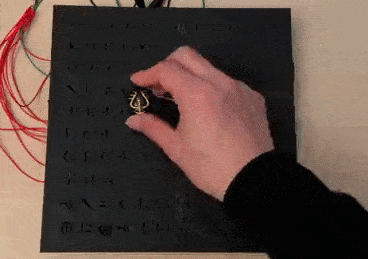](https://twitter.com/SteveKasuya2/status/1612743831333785604)

Castle in the Sky is an iconic animated film by director Hayao Miyazaki. Set in a fictional late 19th century, it follows the adventures of a boy and girl who are trying to keep a powerful crystal from the army, a group of secret agents, and a family of pirates, while searching for a legendary floating castle, Laputa.

Steve Kasuya has recreated part of the movie in the form of a mysterious black stone with engraved glyphs. When a crystal is passed over it, it lights up strings of glyphs. It uses a Raspberry Pi Pico programmed in MicroPython - [Twitter Thread](https://twitter.com/SteveKasuya2/status/1612743831333785604).

## News from around the web!

[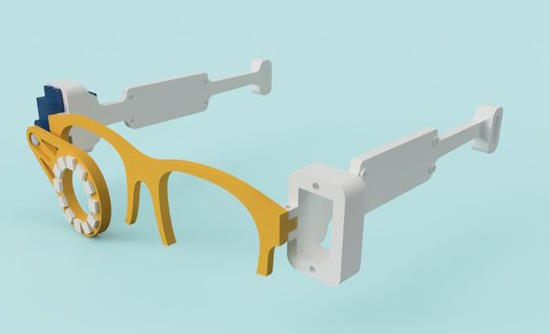](https://twitter.com/kevsmac/status/1615021015389831169)

Cyberglasses: inspired by Odd Jayy, use a Raspberry Pi Pico and MicroPython - [Kev's Robots](), [YouTube](https://youtu.be/jcGF-C6t1LI), [GitHub](https://github.com/kevinmcaleer/cyber_glasses) and [Twitter](https://twitter.com/kevsmac/status/1615021015389831169).

nanoGPT is the simplest, fastest repository for training/finetuning medium-sized GPTs. It is a rewrite of minGPT that prioritizes teeth over education. Still under active development. Written in Python - [GitHub](https://github.com/karpathy/nanoGPT).

[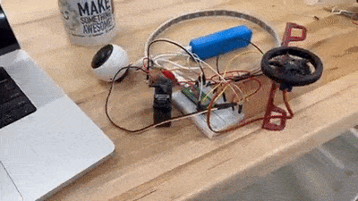](https://twitter.com/gallaugher/status/1613688571772166146)

Boston College thanks CircuitPython developers Dan & Jeff for fixing an issue with MQTT an the Raspberry Pi Pico W - [Twitter](https://twitter.com/gallaugher/status/1613688571772166146).

[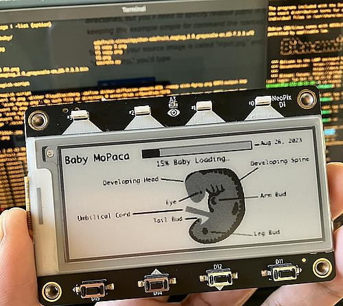](https://petridishtalk.com/2023/01/02/e-ink-dev-board-to-track-fetal-development/)

E-ink Dev board to track Fetal Development. Uses an Adafruit MagTag and CircuitPython - [Petri Dish Talk](https://petridishtalk.com/2023/01/02/e-ink-dev-board-to-track-fetal-development/) via [Hackaday](https://hackaday.com/2023/01/13/an-e-ink-progress-bar-for-your-unborn-child/).

[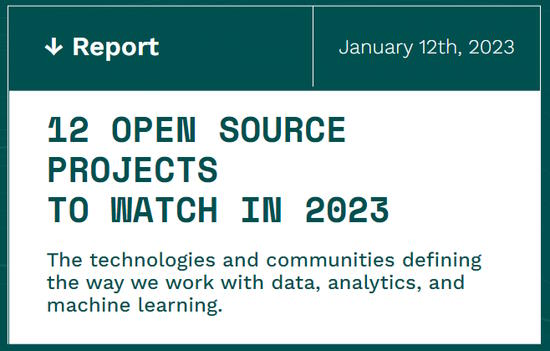](https://voltrondata.com/resources/12-open-source-projects-to-watch-2023)

12 open source projects to watch in 2023 - [Voltron Data](https://voltrondata.com/resources/12-open-source-projects-to-watch-2023).

[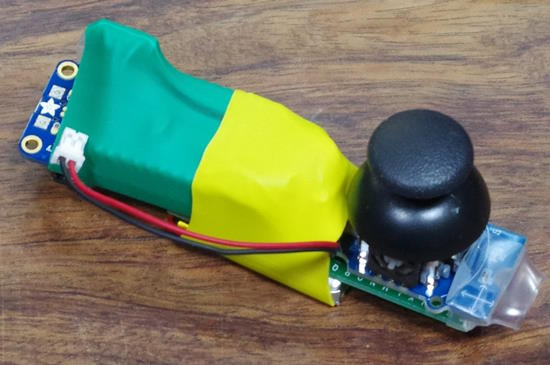](https://twitter.com/DenshiClub/status/1614240642624020480)

A stand-alone implementation of a BLE peripheral that sends angle and vector values with a joystick. Feather nRF52840 Express + CircuitPython 8.0.0-beta.6 - [Twitter](https://twitter.com/DenshiClub/status/1614240642624020480) and [Qiita](https://qiita.com/jamjam/items/a754757693878cf92b71) (Japanese).

A CO2 sensor and air quality display with the MagTag and Adafruit SCD-41 CO2 sensor plus 3D printed case - [Adafruit Blog](https://blog.adafruit.com/2023/01/13/an-epaper-co2-display-3dprinting-magtag-circuitpython/) and [Printables](https://www.printables.com/model/121265-salud-co2-monitor).

[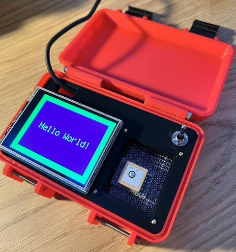](https://twitter.com/mark_mcgookin/status/1612911611143921670)

An interesting box (3D printed) with a Raspberry Pi Pico, color display, GPS, click wheel and switch running CircuitPython - [Twitter Thread](https://twitter.com/mark_mcgookin/status/1612911611143921670) and [Blog](https://markmcgookin.com/2023/01/11/using-the-waveshare-pico-restouch-lcd-2-8-screen-with-circuitpython/).

Get started with Pico:ed. this video tutorial Places the first test code on a Pico:ed using CircuitPython with the Thonny (IDE) program - [YouTube](https://youtu.be/nUfb2SP9KXY) (Spanish with English Subtitles) and [Twitter](https://twitter.com/elecfreaks/status/1613108140098355200).

MicroPython: ESP32 MQTT Publish Multiple Sensor Readings to Node-Red - [Microdigisoft](https://microdigisoft.com/micropython-esp32-mqtt-publish-multiple-sensor-readings-to-node-red/).

Send SMS with Raspberry Pi Pico W, MicroPython and Twilio - [Microcontrollerslab](https://microcontrollerslab.com/send-sms-raspberry-pi-pico-w-twilio/).

[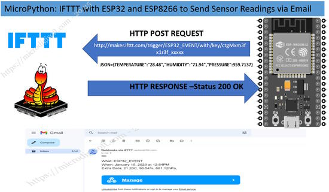](https://microdigisoft.com/micropython-ifttt-with-esp32-and-esp8266-to-send-sensor-readings-via-email/)

MicroPython: IFTTT with ESP32 and ESP8266 to Send Sensor Readings via Email - [Microdigisoft](https://microdigisoft.com/micropython-ifttt-with-esp32-and-esp8266-to-send-sensor-readings-via-email/).

[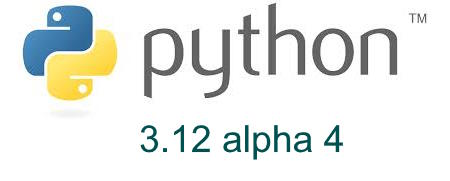](https://pythoninsider.blogspot.com/2023/01/python-3120-alpha-4-released.html)

Python 3.12.0 alpha 4 released with even better error messages and removal of deprecated functions - [Python Insider Blog](https://pythoninsider.blogspot.com/2023/01/python-3120-alpha-4-released.html).

text - [site](url).

text - [site](url).

text - [site](url).

text - [site](url).

Porth: a Concatenative Programming Language for Computers - [GitLab](https://gitlab.com/tsoding/porth).

text - [site](url).

PyDev of the Week: Tim Schilling on [Mouse vs Python](https://www.blog.pythonlibrary.org/2023/01/16/pydev-of-the-week-tim-schilling/)

CircuitPython Weekly Meeting for January 16th delated to January 17th.

#ICYDNCI What was the most popular, most clicked link, in [last week's newsletter](https://www.adafruitdaily.com/2023/01/10/python-on-microcontrollers-newsletter-micropython-on-lego-controllers-circuitpython-in-2023-survey-and-much-more-circuitpython-python-thepsf-micropython-raspberry_pi/)? [New Raspberry Pi autofocus camera modules](https://www.raspberrypi.com/news/new-autofocus-camera-modules/).

## New

[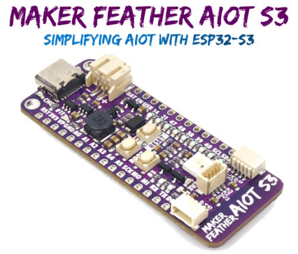](https://www.cytron.io/p-v-maker-feather-aiot-s3-simplifying-aiot-with-esp32)

Maker Feather AIoT S3, a board that powered by the ESP32-S3 WROOM 1 N8R8 module with Adafruit Feather form factor- [Cytron](https://www.cytron.io/p-v-maker-feather-aiot-s3-simplifying-aiot-with-esp32) and [Adafruit Blog](https://blog.adafruit.com/2023/01/10/maker-feather-aiot-s3-an-esp32-s3-board-programmable-with-circuitpython-or-arduino-feather-cnxsoft/).

[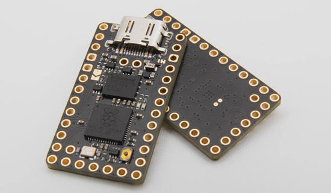](https://keeb.supply/products/0xcb-helios)

The 0xCB Helios is an Elite-C compatible Microcontroller that is based on the RP2040. It’s a drop-in replacement for legacy ProMicro boards and has CircuitPython support - [keeb.supply](https://keeb.supply/products/0xcb-helios).

## New Boards Supported by CircuitPython

The number of supported microcontrollers and Single Board Computers (SBC) grows every week. This section outlines which boards have been included in CircuitPython or added to [CircuitPython.org](https://circuitpython.org/).

This week, there was one new board added:

- [Helios](https://circuitpython.org/board/0xcb_helios/)

*Note: For non-Adafruit boards, please use the support forums of the board manufacturer for assistance, as Adafruit does not have the hardware to assist in troubleshooting.*

Looking to add a new board to CircuitPython? It's highly encouraged! Adafruit has four guides to help you do so:

- [How to Add a New Board to CircuitPython](https://learn.adafruit.com/how-to-add-a-new-board-to-circuitpython/overview)
- [How to add a New Board to the circuitpython.org website](https://learn.adafruit.com/how-to-add-a-new-board-to-the-circuitpython-org-website)
- [Adding a Single Board Computer to PlatformDetect for Blinka](https://learn.adafruit.com/adding-a-single-board-computer-to-platformdetect-for-blinka)
- [Adding a Single Board Computer to Blinka](https://learn.adafruit.com/adding-a-single-board-computer-to-blinka)

## New Learn Guides

[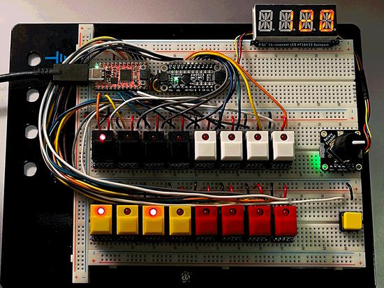](https://learn.adafruit.com/guides/latest)

[16-Step Drum Sequencer](https://learn.adafruit.com/16-step-drum-sequencer) from [John Park](https://learn.adafruit.com/u/johnpark)

[Adafruit PCA9546 4-Channel I2C Multiplexer](https://learn.adafruit.com/adafruit-pca9546-4-channel-i2c-multiplexer) from [Liz Clark](https://learn.adafruit.com/u/BlitzCityDIY)

## Updated Guides

[EZ Make Oven](https://learn.adafruit.com/ez-make-oven), PR by Dan Allen

## CircuitPython Libraries!

CircuitPython support for hardware continues to grow. We are adding support for new sensors and breakouts all the time, as well as improving on the drivers we already have. As we add more libraries and update current ones, you can keep up with all the changes right here!

For the latest libraries, download the [Adafruit CircuitPython Library Bundle](https://circuitpython.org/libraries). For the latest community contributed libraries, download the [CircuitPython Community Bundle](https://github.com/adafruit/CircuitPython_Community_Bundle/releases).

If you'd like to contribute, CircuitPython libraries are a great place to start. Have an idea for a new driver? File an issue on [CircuitPython](https://github.com/adafruit/circuitpython/issues)! Have you written a library you'd like to make available? Submit it to the [CircuitPython Community Bundle](https://github.com/adafruit/CircuitPython_Community_Bundle). Interested in helping with current libraries? Check out the [CircuitPython.org Contributing page](https://circuitpython.org/contributing). We've included open pull requests and issues from the libraries, and details about repo-level issues that need to be addressed. We have a guide on [contributing to CircuitPython with Git and GitHub](https://learn.adafruit.com/contribute-to-circuitpython-with-git-and-github) if you need help getting started. You can also find us in the #circuitpython channels on the [Adafruit Discord](https://adafru.it/discord).

You can check out this [list of all the Adafruit CircuitPython libraries and drivers available](https://github.com/adafruit/Adafruit_CircuitPython_Bundle/blob/master/circuitpython_library_list.md). 

The current number of CircuitPython libraries is **399**!

**New Libraries!**

Here's this week's new CircuitPython libraries:

  * [CedarGroveStudios/CircuitPython_PaletteSlice](https://github.com/CedarGroveStudios/CircuitPython_PaletteSlice)
  * [jandelgado/jled-circuitpy](https://github.com/jandelgado/jled-circuitpy)

**Updated Libraries!**

Here's this week's updated CircuitPython libraries:

  * [Adafruit_CircuitPython_Ticks](https://github.com/adafruit/Adafruit_CircuitPython_Ticks)
  * [Adafruit_CircuitPython_MAX1704x](https://github.com/adafruit/Adafruit_CircuitPython_MAX1704x)
  * [Adafruit_CircuitPython_LED_Animation](https://github.com/adafruit/Adafruit_CircuitPython_LED_Animation)
  * [Adafruit_CircuitPython_AW9523](https://github.com/adafruit/Adafruit_CircuitPython_AW9523)
  * [Adafruit_CircuitPython_Display_Shapes](https://github.com/adafruit/Adafruit_CircuitPython_Display_Shapes)
  * [Adafruit_CircuitPython_ImageLoad](https://github.com/adafruit/Adafruit_CircuitPython_ImageLoad)
  * [Adafruit_CircuitPython_Requests](https://github.com/adafruit/Adafruit_CircuitPython_Requests)
  * [Adafruit_CircuitPython_Wiznet5k](https://github.com/adafruit/Adafruit_CircuitPython_Wiznet5k)
  * [Adafruit_CircuitPython_Display_Text](https://github.com/adafruit/Adafruit_CircuitPython_Display_Text)
  * [Adafruit_CircuitPython_DisplayIO_SH1106](https://github.com/adafruit/Adafruit_CircuitPython_DisplayIO_SH1106)
  * [Adafruit_CircuitPython_OneWire](https://github.com/adafruit/Adafruit_CircuitPython_OneWire)
  * [Adafruit_CircuitPython_IRRemote](https://github.com/adafruit/Adafruit_CircuitPython_IRRemote)
  * [Adafruit_CircuitPython_HTTPServer](https://github.com/adafruit/Adafruit_CircuitPython_HTTPServer)
  * [Adafruit_CircuitPython_MiniMQTT](https://github.com/adafruit/Adafruit_CircuitPython_MiniMQTT)
  * [Adafruit_CircuitPython_NeoTrellis](https://github.com/adafruit/Adafruit_CircuitPython_NeoTrellis)
  * [Adafruit_CircuitPython_Motor](https://github.com/adafruit/Adafruit_CircuitPython_Motor)
  * [Adafruit_Python_PlatformDetect](https://github.com/adafruit/Adafruit_Python_PlatformDetect)
  * [CircuitPython_Community_Bundle](https://github.com/adafruit/CircuitPython_Community_Bundle)

**Library PyPI Statistics**

**Total Library Stats**

* 104634 PyPI downloads over 306 libraries

**Top 10 Libraries by PyPI Downloads**

* Adafruit CircuitPython BusDevice (adafruit-circuitpython-busdevice): 16646
* Adafruit CircuitPython Requests (adafruit-circuitpython-requests): 16195
* Adafruit CircuitPython NeoPixel (adafruit-circuitpython-neopixel): 1508
* Adafruit CircuitPython Register (adafruit-circuitpython-register): 1421
* Adafruit CircuitPython MCP230xx (adafruit-circuitpython-mcp230xx): 1201
* Adafruit CircuitPython DHT (adafruit-circuitpython-dht): 1117
* Adafruit CircuitPython Motor (adafruit-circuitpython-motor): 1054
* Adafruit CircuitPython Wiznet5k (adafruit-circuitpython-wiznet5k): 997
* Adafruit CircuitPython IRRemote (adafruit-circuitpython-irremote): 983
* Adafruit CircuitPython MiniMQTT (adafruit-circuitpython-minimqtt): 905

## What’s the team up to this week?

What is the team up to this week? Let’s check in!

**Dan**

I've continued to work on bug fixes leading up to the CircuitPython 8.0.0 release. We have several bugs related to unreliable wifi, including things that supposedly worked better in 7.3.3. I've reproduced one that is related to socket timeouts and am now debugging it.

The special CYW43 "pass-through" pins on the Pico W have limited functionality and can be confusing to use. Based on a suggestion from Jeff,  I improved many of the type-checking error messages for arguments to native functions and methods.

**Kattni**

I'm back after a few weeks off for the holidays, and I'm getting back into the swing of things. This week was a lot of catch up and sorting out a priority for what to work on. I began working on a few product guides, some of which involve updating existing guides to include the new or updated product. If you've picked up any of our new products in the last couple of weeks, keep an eye out for the guides, coming out soon!

**Melissa**

[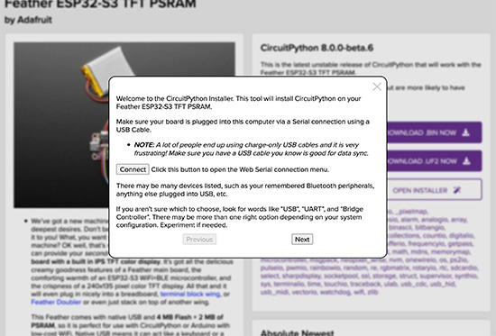](https://code.circuitpython.org/)

This past week I've been working on the CircuitPython Installer. I ended up redesigning it from the ground up for the most part in order to have more of a wizard style UI. It's taking a bit longer than anticipated, but it's shaping up really nicely and connecting successfully to the board.

**Tim**

I've been working on the midi sequencer capabilities a little bit more, and starting to ramp back up on PR reviews after holiday break.

**Jeff**

[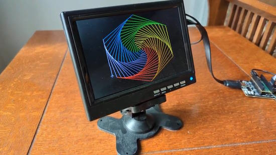](https://circuitpython.org)

Aside from working on some bugs in CircuitPython, I also picked up a C library called PicoDVI and created a firmware based on it that emulates a SPI TFT display. With this firmware loaded on a PicoDV board, you can use any CircuitPython board with displayio to control a DVI/HDMI display with a virtual full color 400x240 framebuffer.

Right now this just exists as code in my github fork of the PicoDVI project, but working with Phil B. we hope to have this "emulator" released as an example within an Arduino library with .UF2 artifacts for easy installation.

**Scott**

Last week I got caught up after holiday time off. This week my partner is sick so I've got limited time to work while the baby naps. When I am at my desk, I'm keeping caught up so I can pick up bigger tasks once my partner feels better.

After keeping caught up, I'm fixing small bugs in our 8.0.0 milestone. I fixed a bug on ESP where light sleeping after waking up from a deep sleep was broken. I've got changes out for 1) fixing start and end kwargs for I2C, SPI and PIO when used with an array of multi-byte values and 2) sharing the MDNS web workflow object with the user so the user can do MDNS as well.

Lastly, we've got just under a week before the [#CircuitPython2023](https://blog.adafruit.com/2023/01/01/circuitpython-in-2023-circuitpython2023-circuitpython/) deadline. I've got a draft started that I need to grab screenshots for and finish writing.

**Liz**

I returned from vacation this week and wrote up some new product guides. The first was for the [3V to 5V booster board](https://learn.adafruit.com/adafruit-qt-3v-to-5v-level-booster-breakout). The second was for the [PCA9546 4-Channel I2C Multiplexer](https://learn.adafruit.com/adafruit-pca9546-4-channel-i2c-multiplexer), which allows you to use up to four I2C devices on the same address simultaneously. I added a new class to the [Adafruit_CircuitPython_TCA9548A](https://github.com/adafruit/Adafruit_CircuitPython_TCA9548A) library for the PCA9546. The existing class for the xCA9548 chips did work with the PCA9546, but allowed for 8 devices. I thought this would be confusing for folks so the new class only allows for 4 devices.

## Upcoming events!

The next MicroPython Meetup in Melbourne will be on January 25th – [Meetup](https://www.meetup.com/MicroPython-Meetup/). Slides from the October meeting are [here](https://docs.google.com/presentation/d/e/2PACX-1vQnJM1r7vFuRMq9bzHWXKyjvnmQsDRB30OMVE5Ujcgv75_NGg3prgQ_QzAtVyJoQEdM-x5HvgSrFXS9/pub?slide=id.p).

FOSDEM is a free event for software developers to meet, share ideas and collaborate. Every year, thousands of developers of free and open source software from all over the world gather at the event in Brussels. February 4-5, 2023 in Brussels, Belgium - [Fosdem](https://fosdem.org/2023/).

PyCon US 2023 will be April 19-17, 2023, again in Salt Lake City, Utah USA - [PyCon US 2023](https://us.pycon.org/2023/).

**Send Your Events In**

If you know of virtual events or upcoming events, please let us know via email to cpnews(at)adafruit(dot)com.

## Latest releases

CircuitPython's stable release is [7.3.3](https://github.com/adafruit/circuitpython/releases/latest) and its unstable release is [8.0.0-beta.6](https://github.com/adafruit/circuitpython/releases). New to CircuitPython? Start with our [Welcome to CircuitPython Guide](https://learn.adafruit.com/welcome-to-circuitpython).

[20230116](https://github.com/adafruit/Adafruit_CircuitPython_Bundle/releases/latest) is the latest CircuitPython library bundle.

[v1.19.1](https://micropython.org/download) is the latest MicroPython release. Documentation for it is [here](http://docs.micropython.org/en/latest/pyboard/).

[3.11.1](https://www.python.org/downloads/) is the latest Python release. The latest pre-release version is [3.12.0a4](https://www.python.org/download/pre-releases/).

[3,369 Stars](https://github.com/adafruit/circuitpython/stargazers) Like CircuitPython? [Star it on GitHub!](https://github.com/adafruit/circuitpython)

## Call for help -- Translating CircuitPython is now easier than ever!

[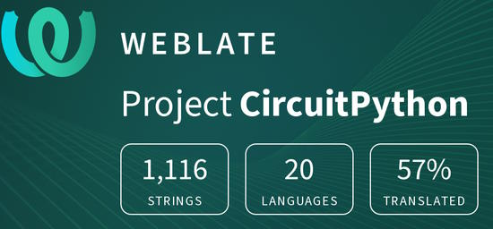](https://hosted.weblate.org/engage/circuitpython/)

One important feature of CircuitPython is translated control and error messages. With the help of fellow open source project [Weblate](https://weblate.org/), we're making it even easier to add or improve translations. 

Sign in with an existing account such as GitHub, Google or Facebook and start contributing through a simple web interface. No forks or pull requests needed! As always, if you run into trouble join us on [Discord](https://adafru.it/discord), we're here to help.

## jobs.adafruit.com - Find a dream job, find great candidates!

[jobs.adafruit.com](https://jobs.adafruit.com/) has returned and folks are posting their skills (including CircuitPython) and companies are looking for talented makers to join their companies - from Digi-Key, to Hackaday, Micro Center, Raspberry Pi and more.

**Job of the Week**

STEAM Educator - Part Time - Scratch Coding and TinkerCAD 3D Printing - [Adafruit Jobs Board](https://jobs.adafruit.com/job/steam-educator-part-time-scratch-coding-and-tinkercad-3d-printing/).

## 36,424 thanks!

The Adafruit Discord community, where we do all our CircuitPython development in the open, reached over 36,424 humans - thank you!  Adafruit believes Discord offers a unique way for Python on hardware folks to connect. Join today at [https://adafru.it/discord](https://adafru.it/discord).

## ICYMI - In case you missed it

Python on hardware is the Adafruit Python video-newsletter-podcast! The news comes from the Python community, Discord, Adafruit communities and more and is broadcast on ASK an ENGINEER Wednesdays. The complete Python on Hardware weekly videocast [playlist is here](https://www.youtube.com/playlist?list=PLjF7R1fz_OOXRMjM7Sm0J2Xt6H81TdDev). The video podcast is on [iTunes](https://itunes.apple.com/us/podcast/python-on-hardware/id1451685192?mt=2), [YouTube](http://adafru.it/pohepisodes), [IGTV (Instagram TV](https://www.instagram.com/adafruit/channel/)), and [XML](https://itunes.apple.com/us/podcast/python-on-hardware/id1451685192?mt=2).

[The weekly community chat on Adafruit Discord server CircuitPython channel - Audio / Podcast edition](https://itunes.apple.com/us/podcast/circuitpython-weekly-meeting/id1451685016) - Audio from the Discord chat space for CircuitPython, meetings are usually Mondays at 2pm ET, this is the audio version on [iTunes](https://itunes.apple.com/us/podcast/circuitpython-weekly-meeting/id1451685016), Pocket Casts, [Spotify](https://adafru.it/spotify), and [XML feed](https://adafruit-podcasts.s3.amazonaws.com/circuitpython_weekly_meeting/audio-podcast.xml).

## Codecademy "Learn Hardware Programming with CircuitPython"

Codecademy, an online interactive learning platform used by more than 45 million people, has teamed up with Adafruit to create a coding course, “Learn Hardware Programming with CircuitPython”. The course is now available in the [Codecademy catalog](https://www.codecademy.com/learn/learn-circuitpython?utm_source=adafruit&utm_medium=partners&utm_campaign=circuitplayground&utm_content=pythononhardwarenewsletter).

## Contribute!

The CircuitPython Weekly Newsletter is a CircuitPython community-run newsletter emailed every Tuesday. The complete [archives are here](https://www.adafruitdaily.com/category/circuitpython/). It highlights the latest CircuitPython related news from around the web including Python and MicroPython developments. To contribute, edit next week's draft [on GitHub](https://github.com/adafruit/circuitpython-weekly-newsletter/tree/gh-pages/_drafts) and [submit a pull request](https://help.github.com/articles/editing-files-in-your-repository/) with the changes. You may also tag your information on Twitter with #CircuitPython. 

Join the Adafruit [Discord](https://adafru.it/discord) or [post to the forum](https://forums.adafruit.com/viewforum.php?f=60) if you have questions.
