- [X] Kattni updates
- [ ] change date
- [ ] update title
- [ ] Feature story
- [ ] Update  for images
- [ ] Update ICYDNCI
- [ ] All images 550w max only
- [ ] Link "View this email in your browser."

News Sources

- [python.org](https://www.python.org/)
- [Python Insider - dev team blog](https://pythoninsider.blogspot.com/)
- [MicroPython Meetup Blog](https://melbournemicropythonmeetup.github.io/)
- [hackaday.io newest projects MicroPython](https://hackaday.io/projects?tag=micropython&sort=date) and [CircuitPython](https://hackaday.io/projects?tag=circuitpython&sort=date)
- [hackaday CircuitPython](https://hackaday.com/blog/?s=circuitpython) and [MicroPython](https://hackaday.com/blog/?s=micropython)
- [hackster.io CircuitPython](https://www.hackster.io/search?q=circuitpython&i=projects&sort_by=most_recent) and [MicroPython](https://www.hackster.io/search?q=micropython&i=projects&sort_by=most_recent)
- [https://opensource.com/tags/python](https://opensource.com/tags/python)
- [Mastodon CircuitPython](https://octodon.social/tags/CircuitPython)

View this email in your browser. **Warning: Flashing Imagery**

Welcome to the latest Python on Microcontrollers newsletter!  - *Ed.*

We're on [Discord](https://discord.gg/HYqvREz), [Twitter](https://twitter.com/search?q=circuitpython&src=typed_query&f=live), and for past newsletters - [view them all here](https://www.adafruitdaily.com/category/circuitpython/). If you're reading this on the web, [subscribe here](https://www.adafruitdaily.com/). Here's the news this week:

## 400 CircuitPython Libraries!

This week, CircuitPython hit a huge milestone: There are now 400 libraries available for CircuitPython. This includes Adafruit written libraries and community contributed libraries. Number 400 is [DerBroader71/circuitpython_uuid4](https://github.com/DerBroader71/circuitpython_uuid4) by Tudor (DerBroader71 on GitHub), thank you Tudor for your first CircuitPython pull request and contribution! And thanks to all who contribute to CircuitPython - [Adafruit Blog](url).

## 3,000,000 THANKS! Celebrating 3 Million Orders at Adafruit – Thank You!

On January 18, 2023 11:20am ET the 3,000,0000 order was placed at Adafruit for a Raspberry Pi 4 Model B – 4 GB RAM by Michael from Austin, TX! (We asked to make sure it was OK to post this) Michael, a real human, was able to get a Raspberry Pi which is extra special since we’ve worked really hard together to make sure makers, real humans, have been able to get units! - [Adafruit Blog](https://adafruit.com/3millionorders).

## Feature

text - [site](url).

## New Video: Troubleshooting CircuitPython

Troubleshooting CircuitPython installation, board, and Mu issues: A Guide for New Students. Here are some of what Professor Gallaugher has seen as common issues that his students have encountered, plus solutions - [YouTube](https://www.youtube.com/watch?v=d3hnFM2UHa4).

## Raspberry Pi Pico vs. ESP32-S2 Speed Comparison Benchmark Using CircuitPython

[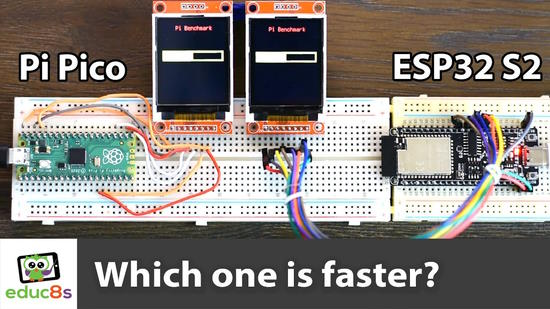](https://interte.com/2023/01/17/raspberry-pi-pico-vs-esp32-s2-speed-comparison-benchmark-using-circuitpython/)

Raspberry Pi Pico is compared to the ESP32-S2 in a speed comparison benchmark using CircuitPython - [interte](https://interte.com/2023/01/17/raspberry-pi-pico-vs-esp32-s2-speed-comparison-benchmark-using-circuitpython/) and [YouTube](https://youtu.be/bTYQ_Jrpz6Y).

> So the ESP32 S2 needs 128% more current to run the script, but for 50% less time. In total, the Raspberry Pi Pico needed 10% less power to perform this task, which is not significant in my opinion. In short, the ESP32-S2 outperforms the Raspberry Pi Pico for single-core processing workloads. It costs more or less the same, it's $1 more expensive, it has more RAM, Flash memory, and of course WiFi, which the Raspberry Pi Pico lacks. The Raspberry Pi Pico, on the other hand, has two processing cores, but I believe that in more than 90% of our projects, the use of a second core is unnecessary.

## This Week's Python Streams

Python on Hardware is all about building a cooperative ecosphere which allows contributions to be valued and to grow knowledge. Below are the streams within the last week focusing on the community.

### CircuitPython Deep Dive Stream

[This week](https://youtu.be/i8yT3916WJ8), Tim streamed work on some Blinka_DisplayIO work then EYESPI TFT displays.

You can see the latest video and past videos on the Adafruit YouTube channel under the Deep Dive playlist - [YouTube](https://www.youtube.com/playlist?list=PLjF7R1fz_OOXBHlu9msoXq2jQN4JpCk8A).

### CircuitPython Parsec

John Park’s CircuitPython Parsec this week is on I2S Audio Pins - [Adafruit Blog](https://blog.adafruit.com/2023/01/20/john-parks-circuitpython-parsec-i2s-audio-pins-adafruit-johnedgarpark-adafruit-circuitpython/) and [YouTube](https://youtu.be/3ZrxoZe9sFM).

Catch all the episodes in the [YouTube playlist](https://www.youtube.com/playlist?list=PLjF7R1fz_OOWFqZfqW9jlvQSIUmwn9lWr).

### The CircuitPython Show

The CircuitPython Show is an independent podcast hosted by Paul Cutler, focusing on the people doing awesome things with CircuitPython. Each episode features Paul in conversation with a guest for a short interview – [CircuitPythonShow](https://circuitpythonshow.com/) and [Twitter](https://twitter.com/circuitpyshow).

## Projects of the Week - Raspberry Pi Pico Power Consumption

Two articles this week on power used by the Raspberry Pi Pico:

[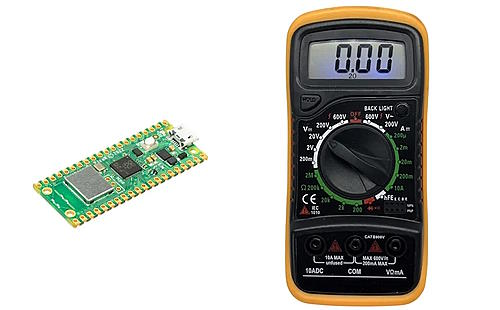](https://peppe8o.com/raspberry-pi-pico-w-power-consumption/)

Raspberry Pi Pico W power consumption (mA) and how to reduce it - [peppe80](https://peppe8o.com/raspberry-pi-pico-w-power-consumption/).

[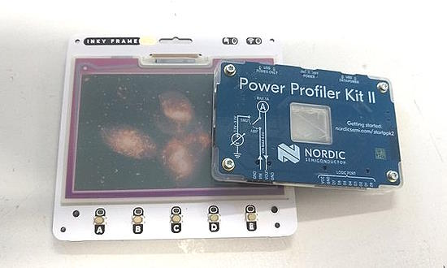](https://twitter.com/HackSpaceMag/status/1615651538772398083)

The Pimoroni crew claim that their Pico W-powered color eInk screens can idle at "about 20uA". Are they telling the truth? Just how many electrons does it take to update the display? - [HackSpace Magazine on Twitter](https://twitter.com/HackSpaceMag/status/1615651538772398083).

## News from around the web!

[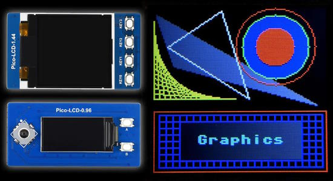](https://thepihut.com/blogs/raspberry-pi-tutorials/coding-graphics-with-micropython-on-raspberry-pi-pico-displays)

Coding Graphics with MicroPython on Raspberry Pi Pico Displays - [The Pi Hut](https://thepihut.com/blogs/raspberry-pi-tutorials/coding-graphics-with-micropython-on-raspberry-pi-pico-displays).

[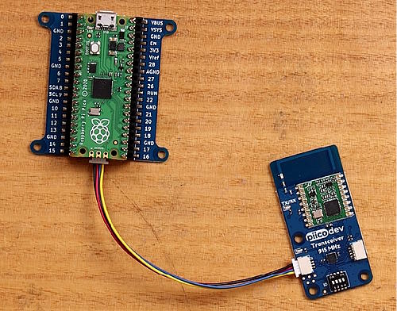](https://core-electronics.com.au/guides/piicodev/piicodev-transceiver-getting-started-guide/)

The PiicoDev Transceiver™ is a 915MHz radio that can send short messages up to 100m using MicroPython - [Core Electronics](https://core-electronics.com.au/guides/piicodev/piicodev-transceiver-getting-started-guide/) and [YouTube](https://youtu.be/QnCRYAdtqnc).

[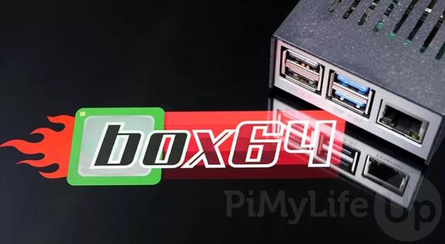](https://pimylifeup.com/raspberry-pi-x64/)

Run x64 Software on a Raspberry Pi using Box64 - [PiMyLife Up](https://pimylifeup.com/raspberry-pi-x64/).

[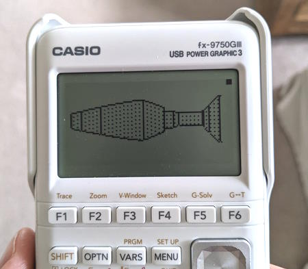](https://twitter.com/lefticus/status/1615766075261726720)

Writing a simple ray casting engine in Python and porting it to a Casio calculator running MicroPython- [Twitter](https://twitter.com/lefticus/status/1615766075261726720).

[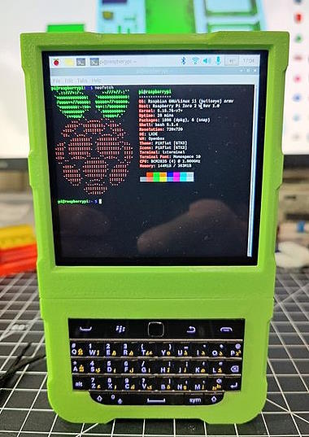](https://www.tomshardware.com/news/lean-green-raspberry-pi-handheld-machine)

Blackberry Pi is a handheld from pdrift is an exceptional piece of work that blends electronics and 3D printing into one mean, green machine! Using a Raspberry Pi Zero W with a Blackberry keyboard and display - [Tom's Hardware](https://www.tomshardware.com/news/lean-green-raspberry-pi-handheld-machine).

[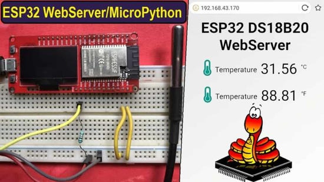](https://how2electronics.com/esp32-micropython-web-server/)

ESP32 MicroPython Web Server – Sensor Data on Webpage - [HowToElectronics](https://how2electronics.com/esp32-micropython-web-server/).

text - [site](url).

text - [site](url).

text - [site](url).

text - [site](url).

text - [site](url).

text - [site](url).

text - [site](url).

[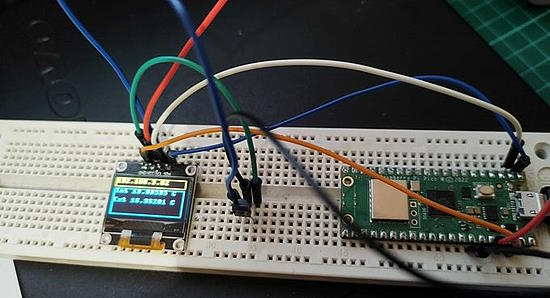](https://blog.0x32.co.uk/posts/pico3/)

Raspberry Pi Pico W temperature meaurement and display - [0x32.co.uk](https://blog.0x32.co.uk/posts/pico3/) via [Twitter](https://twitter.com/alastair_hm/status/1615330242201063432).

[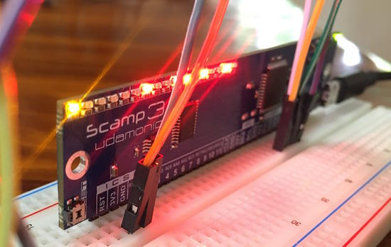](https://udamonic.com/what-is-a-scamp.html)

Scamp is a self-contained Forth computer that you can use as the computing engine for your projects - [Udamonic](https://udamonic.com/what-is-a-scamp.html) and [Adafruit Blog](https://blog.adafruit.com/2023/01/19/scamp-a-self-contained-forth-computer/).

text - [site](url).

text - [site](url).

text - [site](url).

PyDev of the Week: NAME on [Mouse vs Python]()

CircuitPython Weekly Meeting for DATE ([notes]()) [on YouTube]()

**#ICYDNCI What was the most popular, most clicked link, in [last week's newsletter](https://link)? [title](url).**

## Coming Soon

text - [site](url).

text - [site](url).

## New Boards Supported by CircuitPython

The number of supported microcontrollers and Single Board Computers (SBC) grows every week. This section outlines which boards have been included in CircuitPython or added to [CircuitPython.org](https://circuitpython.org/).

This week, there were (#/no) new boards added!

- [Board name](url)
- [Board name](url)
- [Board name](url)

*Note: For non-Adafruit boards, please use the support forums of the board manufacturer for assistance, as Adafruit does not have the hardware to assist in troubleshooting.*

Looking to add a new board to CircuitPython? It's highly encouraged! Adafruit has four guides to help you do so:

- [How to Add a New Board to CircuitPython](https://learn.adafruit.com/how-to-add-a-new-board-to-circuitpython/overview)
- [How to add a New Board to the circuitpython.org website](https://learn.adafruit.com/how-to-add-a-new-board-to-the-circuitpython-org-website)
- [Adding a Single Board Computer to PlatformDetect for Blinka](https://learn.adafruit.com/adding-a-single-board-computer-to-platformdetect-for-blinka)
- [Adding a Single Board Computer to Blinka](https://learn.adafruit.com/adding-a-single-board-computer-to-blinka)

## New Learn Guides!

[Adafruit IoT Button with NeoPixel BFF](https://learn.adafruit.com/adafruit-iot-button-with-neopixel-bff) from [Liz Clark](https://learn.adafruit.com/u/BlitzCityDIY)

[Adafruit PCA9546 4-Channel STEMMA QT Multiplexer](https://learn.adafruit.com/adafruit-pca9546-4-channel-stemma-qt-multiplexer) from [Liz Clark](https://learn.adafruit.com/u/BlitzCityDIY)

## CircuitPython Libraries!

CircuitPython support for hardware continues to grow. We are adding support for new sensors and breakouts all the time, as well as improving on the drivers we already have. As we add more libraries and update current ones, you can keep up with all the changes right here!

For the latest libraries, download the [Adafruit CircuitPython Library Bundle](https://circuitpython.org/libraries). For the latest community contributed libraries, download the [CircuitPython Community Bundle](https://github.com/adafruit/CircuitPython_Community_Bundle/releases).

If you'd like to contribute, CircuitPython libraries are a great place to start. Have an idea for a new driver? File an issue on [CircuitPython](https://github.com/adafruit/circuitpython/issues)! Have you written a library you'd like to make available? Submit it to the [CircuitPython Community Bundle](https://github.com/adafruit/CircuitPython_Community_Bundle). Interested in helping with current libraries? Check out the [CircuitPython.org Contributing page](https://circuitpython.org/contributing). We've included open pull requests and issues from the libraries, and details about repo-level issues that need to be addressed. We have a guide on [contributing to CircuitPython with Git and GitHub](https://learn.adafruit.com/contribute-to-circuitpython-with-git-and-github) if you need help getting started. You can also find us in the #circuitpython channels on the [Adafruit Discord](https://adafru.it/discord).

You can check out this [list of all the Adafruit CircuitPython libraries and drivers available](https://github.com/adafruit/Adafruit_CircuitPython_Bundle/blob/master/circuitpython_library_list.md). 

The current number of CircuitPython libraries is **400**!

**New Libraries!**

Here's this week's new CircuitPython libraries:

  * [DerBroader71/circuitpython_uuid4](https://github.com/DerBroader71/circuitpython_uuid4)

**Updated Libraries!**

Here's this week's updated CircuitPython libraries:

  * [adafruit/Adafruit_CircuitPython_Wiznet5k](https://github.com/adafruit/Adafruit_CircuitPython_Wiznet5k)
  * [adafruit/Adafruit_CircuitPython_LIDARLite](https://github.com/adafruit/Adafruit_CircuitPython_LIDARLite)
  * [adafruit/Adafruit_CircuitPython_PortalBase](https://github.com/adafruit/Adafruit_CircuitPython_PortalBase)
  * [adafruit/Adafruit_CircuitPython_Thermal_Printer](https://github.com/adafruit/Adafruit_CircuitPython_Thermal_Printer)
  * [adafruit/Adafruit_CircuitPython_MiniMQTT](https://github.com/adafruit/Adafruit_CircuitPython_MiniMQTT)
  * [jandelgado/jled-circuitpy](https://github.com/jandelgado/jled-circuitpy)
  * [CedarGroveStudios/CircuitPython_NAU7802](https://github.com/CedarGroveStudios/CircuitPython_NAU7802)

**Library PyPI Weekly Download Stats**
* **Total Library Stats**
  * 102223 PyPI downloads over 306 libraries
* **Top 10 Libraries by PyPI Downloads**
  * Adafruit CircuitPython BusDevice (adafruit-circuitpython-busdevice): 18438
  * Adafruit CircuitPython Requests (adafruit-circuitpython-requests): 17245
  * Adafruit CircuitPython Register (adafruit-circuitpython-register): 1689
  * Adafruit CircuitPython NeoPixel (adafruit-circuitpython-neopixel): 1640
  * Adafruit CircuitPython MiniMQTT (adafruit-circuitpython-minimqtt): 1158
  * Adafruit CircuitPython PCA9685 (adafruit-circuitpython-pca9685): 985
  * Adafruit CircuitPython MCP230xx (adafruit-circuitpython-mcp230xx): 977
  * Adafruit CircuitPython DHT (adafruit-circuitpython-dht): 886
  * Adafruit CircuitPython Wiznet5k (adafruit-circuitpython-wiznet5k): 874
  * Adafruit CircuitPython Pixelbuf (adafruit-circuitpython-pixelbuf): 774

## What’s the team up to this week?

What is the team up to this week? Let’s check in!

**Dan**

I'm continuing on several of the last few 8.0.0 bugs we have left to fix before a release candidate. I fixed a bug that showed up when making an HTTP server on Espressif chips: we were not making a socket non-blocking internally when we expected it to be non-blocking. I researched another apparent bug that turned out to be Windows C3 and PowerShell not setting DTR ready when opening a serial connection. So it wasn't actually a CircuitPython bug. And right now I'm trying to track down some mysterious wifi problems with very intermittent crashes.

**Kattni**

I updated the SHT40 guide, which is now the [SHT40 and SHT45 guide](https://learn.adafruit.com/adafruit-sht40-temperature-humidity-sensor/), to include, surprise, the SHT45! The only difference between the two breakouts is that the SHT45 chip has a higher accuracy rating. There is no difference in wiring, code, or interaction. The only way to tell which chip you have is to read the text on your breakout board! If you've picked up either of these chips, check out the guide!

We have been releasing new revisions of our TFT and OLED displays with a ribbon cable connector dubbed the EYESPI connector. To that end, I'm writing up a new template covering the connector, its pinout, and how it works, that will be included in each of the guide updates. There will also be updates throughout the rest of the guide to reference it. Once I've updated one guide to what we want it to be, Liz and I will be splitting up updating the rest of the necessary guides, and new updates moving forward. If you have one of these new EYESPI displays, keep an eye on the original display guide for these updates.

**Tim**

This week I've been continuing testing of changes in the Wiznet ethernet library. There are still a few more but we're approaching "light at the end of the tunnel" for the PRs that were built up. I also received and soldered up an Eye SPI breakout + a few displays to start trying them out with displayio.

**Scott**

This week I've been debugging the (hopefully) last few bugs before 8.0.0. The most recent was an issue with the Pico W where the web workflow wouldn't start the first time after dragging the UF2 onto the device. This is was due to us misdetecting the reset reason as the watchdog (which occurs during an error.) Now it is detected as a software reset and web workflow will start up.

I've also been working on CircuitPython2023. [My post is on the Adafruit blog.](https://blog.adafruit.com/2023/01/05/scotts-circuitpython2023-tannewt/) And I've been making [summary posts with links to others' posts](https://blog.adafruit.com/tag/circuitpython2023/).

**Liz**

This week I published two more new product guides: [the STEMMA QT version of the PCA9546 I2C multiplexer](https://learn.adafruit.com/adafruit-pca9546-4-channel-stemma-qt-multiplexer) and [the IoT Button with NeoPixel BFF](https://learn.adafruit.com/adafruit-iot-button-with-neopixel-bff). The IoT Button BFF is another QT Py add-on board that has a chonky button designed with simple IoT projects in mind. I wrote up quick Adafruit IO examples for both CircuitPython and Arduino for the guide demoing how you could send data to IO and use the NeoPixel as a connection status indicator.

## Upcoming events!

The next MicroPython Meetup in Melbourne will be on January 25th – [Meetup](https://www.meetup.com/MicroPython-Meetup/). Slides from the October meeting are [here](https://docs.google.com/presentation/d/e/2PACX-1vQnJM1r7vFuRMq9bzHWXKyjvnmQsDRB30OMVE5Ujcgv75_NGg3prgQ_QzAtVyJoQEdM-x5HvgSrFXS9/pub?slide=id.p).

FOSDEM is a free event for software developers to meet, share ideas and collaborate. Every year, thousands of developers of free and open source software from all over the world gather at the event in Brussels. February 4-5, 2023 in Brussels, Belgium - [Fosdem](https://fosdem.org/2023/).

PyCon US 2023 will be April 19-17, 2023, again in Salt Lake City, Utah USA - [PyCon US 2023](https://us.pycon.org/2023/).

**Send Your Events In**

If you know of virtual events or upcoming events, please let us know via email to cpnews(at)adafruit(dot)com.

## Latest releases

CircuitPython's stable release is [#.#.#](https://github.com/adafruit/circuitpython/releases/latest) and its unstable release is [#.#.#-##.#](https://github.com/adafruit/circuitpython/releases). New to CircuitPython? Start with our [Welcome to CircuitPython Guide](https://learn.adafruit.com/welcome-to-circuitpython).

[2023####](https://github.com/adafruit/Adafruit_CircuitPython_Bundle/releases/latest) is the latest CircuitPython library bundle.

[v#.#.#](https://micropython.org/download) is the latest MicroPython release. Documentation for it is [here](http://docs.micropython.org/en/latest/pyboard/).

[#.#.#](https://www.python.org/downloads/) is the latest Python release. The latest pre-release version is [#.#.#](https://www.python.org/download/pre-releases/).

[#,### Stars](https://github.com/adafruit/circuitpython/stargazers) Like CircuitPython? [Star it on GitHub!](https://github.com/adafruit/circuitpython)

## Call for help -- Translating CircuitPython is now easier than ever!

[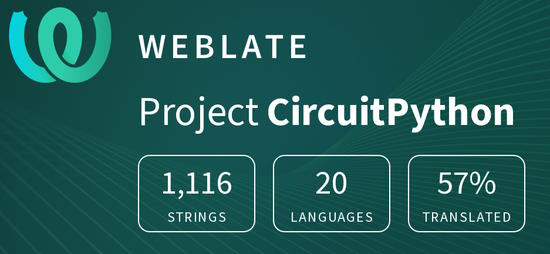](https://hosted.weblate.org/engage/circuitpython/)

One important feature of CircuitPython is translated control and error messages. With the help of fellow open source project [Weblate](https://weblate.org/), we're making it even easier to add or improve translations. 

Sign in with an existing account such as GitHub, Google or Facebook and start contributing through a simple web interface. No forks or pull requests needed! As always, if you run into trouble join us on [Discord](https://adafru.it/discord), we're here to help.

## jobs.adafruit.com - Find a dream job, find great candidates!

[jobs.adafruit.com](https://jobs.adafruit.com/) has returned and folks are posting their skills (including CircuitPython) and companies are looking for talented makers to join their companies - from Digi-Key, to Hackaday, Micro Center, Raspberry Pi and more.

**Job of the Week**---
layout: post
title: "Featured story title here!"
date: 2023-01-17 07:00:00 -0800
categories: weekly
---

- [ ] Kattni updates
- [ ] change date
- [ ] update title
- [ ] Feature story
- [ ] Update  for images
- [ ] Update ICYDNCI
- [ ] All images 550w max only
- [ ] Link "View this email in your browser."

Updated 2023-01-09 - general cleanup

News Sources

- [python.org](https://www.python.org/)
- [Python Insider - dev team blog](https://pythoninsider.blogspot.com/)
- [MicroPython Meetup Blog](https://melbournemicropythonmeetup.github.io/)
- [hackaday.io newest projects MicroPython](https://hackaday.io/projects?tag=micropython&sort=date) and [CircuitPython](https://hackaday.io/projects?tag=circuitpython&sort=date)
- [hackaday CircuitPython](https://hackaday.com/blog/?s=circuitpython) and [MicroPython](https://hackaday.com/blog/?s=micropython)
- [hackster.io CircuitPython](https://www.hackster.io/search?q=circuitpython&i=projects&sort_by=most_recent) and [MicroPython](https://www.hackster.io/search?q=micropython&i=projects&sort_by=most_recent)
- [https://opensource.com/tags/python](https://opensource.com/tags/python)
- [Mastodon CircuitPython](https://octodon.social/tags/CircuitPython)

View this email in your browser. **Warning: Flashing Imagery**

Welcome to the latest Python on Microcontrollers newsletter!  - *Ed.*

We're on [Discord](https://discord.gg/HYqvREz), [Twitter](https://twitter.com/search?q=circuitpython&src=typed_query&f=live), and for past newsletters - [view them all here](https://www.adafruitdaily.com/category/circuitpython/). If you're reading this on the web, [subscribe here](https://www.adafruitdaily.com/). Here's the news this week:

## Headline

text - [site](url).

## Feature

text - [site](url).

## Feature

text - [site](url).

## Feature

text - [site](url).

## This Week's Python Streams

Python on Hardware is all about building a cooperative ecosphere which allows contributions to be valued and to grow knowledge. Below are the streams within the last week focusing on the community.

### CircuitPython Deep Dive Stream

[This week](link), Tim streamed work on {subject}.

You can see the latest video and past videos on the Adafruit YouTube channel under the Deep Dive playlist - [YouTube](https://www.youtube.com/playlist?list=PLjF7R1fz_OOXBHlu9msoXq2jQN4JpCk8A).

### CircuitPython Parsec

John Park’s CircuitPython Parsec this week is on {subject} - [Adafruit Blog](link) and [YouTube](link).

Catch all the episodes in the [YouTube playlist](https://www.youtube.com/playlist?list=PLjF7R1fz_OOWFqZfqW9jlvQSIUmwn9lWr).

### The CircuitPython Show

The CircuitPython Show is an independent podcast hosted by Paul Cutler, focusing on the people doing awesome things with CircuitPython. Each episode features Paul in conversation with a guest for a short interview – [CircuitPythonShow](https://circuitpythonshow.com/) and [Twitter](https://twitter.com/circuitpyshow).

The latest episode was released (date) and features (guest).  They and Paul talk {subject} – [Show List](https://circuitpythonshow.com/episodes/all).

## Project of the Week

text - [site](url).

## News from around the web!

text - [site](url).

text - [site](url).

text - [site](url).

text - [site](url).

text - [site](url).

text - [site](url).

text - [site](url).

text - [site](url).

text - [site](url).

text - [site](url).

text - [site](url).

text - [site](url).

text - [site](url).

text - [site](url).

text - [site](url).

text - [site](url).

text - [site](url).

text - [site](url).

PyDev of the Week: NAME on [Mouse vs Python]()

CircuitPython Weekly Meeting for DATE ([notes]()) [on YouTube]()

**#ICYDNCI What was the most popular, most clicked link, in [last week's newsletter](https://link)? [title](url).**

## Coming Soon

text - [site](url).

text - [site](url).

## New Boards Supported by CircuitPython

The number of supported microcontrollers and Single Board Computers (SBC) grows every week. This section outlines which boards have been included in CircuitPython or added to [CircuitPython.org](https://circuitpython.org/).

This week, there were (#/no) new boards added!

- [Board name](url)
- [Board name](url)
- [Board name](url)

*Note: For non-Adafruit boards, please use the support forums of the board manufacturer for assistance, as Adafruit does not have the hardware to assist in troubleshooting.*

Looking to add a new board to CircuitPython? It's highly encouraged! Adafruit has four guides to help you do so:

- [How to Add a New Board to CircuitPython](https://learn.adafruit.com/how-to-add-a-new-board-to-circuitpython/overview)
- [How to add a New Board to the circuitpython.org website](https://learn.adafruit.com/how-to-add-a-new-board-to-the-circuitpython-org-website)
- [Adding a Single Board Computer to PlatformDetect for Blinka](https://learn.adafruit.com/adding-a-single-board-computer-to-platformdetect-for-blinka)
- [Adding a Single Board Computer to Blinka](https://learn.adafruit.com/adding-a-single-board-computer-to-blinka)

## New Learn Guides!

[title](url) from [name](url)

[title](url) from [name](url)

[title](url) from [name](url)

## Updated Learn Guides!

[title](url) from [name](url)

## CircuitPython Libraries!

CircuitPython support for hardware continues to grow. We are adding support for new sensors and breakouts all the time, as well as improving on the drivers we already have. As we add more libraries and update current ones, you can keep up with all the changes right here!

For the latest libraries, download the [Adafruit CircuitPython Library Bundle](https://circuitpython.org/libraries). For the latest community contributed libraries, download the [CircuitPython Community Bundle](https://github.com/adafruit/CircuitPython_Community_Bundle/releases).

If you'd like to contribute, CircuitPython libraries are a great place to start. Have an idea for a new driver? File an issue on [CircuitPython](https://github.com/adafruit/circuitpython/issues)! Have you written a library you'd like to make available? Submit it to the [CircuitPython Community Bundle](https://github.com/adafruit/CircuitPython_Community_Bundle). Interested in helping with current libraries? Check out the [CircuitPython.org Contributing page](https://circuitpython.org/contributing). We've included open pull requests and issues from the libraries, and details about repo-level issues that need to be addressed. We have a guide on [contributing to CircuitPython with Git and GitHub](https://learn.adafruit.com/contribute-to-circuitpython-with-git-and-github) if you need help getting started. You can also find us in the #circuitpython channels on the [Adafruit Discord](https://adafru.it/discord).

You can check out this [list of all the Adafruit CircuitPython libraries and drivers available](https://github.com/adafruit/Adafruit_CircuitPython_Bundle/blob/master/circuitpython_library_list.md). 

The current number of CircuitPython libraries is **###**!

**New Libraries!**

Here's this week's new CircuitPython libraries:

* [library](url)

**Updated Libraries!**

Here's this week's updated CircuitPython libraries:

* [library](url)

**Library Statistics**

## What’s the team up to this week?

What is the team up to this week? Let’s check in!

**Dan**

text - [site](url).

**Kattni**

text - [site](url).

**Melissa**

text - [site](url).

**Tim**

text - [site](url).

**Jeff**

text - [site](url).

**Scott**

text - [site](url).

**Liz**

text - [site](url).

## Upcoming events!

The next MicroPython Meetup in Melbourne will be on January 25th – [Meetup](https://www.meetup.com/MicroPython-Meetup/). Slides from the October meeting are [here](https://docs.google.com/presentation/d/e/2PACX-1vQnJM1r7vFuRMq9bzHWXKyjvnmQsDRB30OMVE5Ujcgv75_NGg3prgQ_QzAtVyJoQEdM-x5HvgSrFXS9/pub?slide=id.p).

FOSDEM is a free event for software developers to meet, share ideas and collaborate. Every year, thousands of developers of free and open source software from all over the world gather at the event in Brussels. February 4-5, 2023 in Brussels, Belgium - [Fosdem](https://fosdem.org/2023/).

PyCon US 2023 will be April 19-17, 2023, again in Salt Lake City, Utah USA - [PyCon US 2023](https://us.pycon.org/2023/).

**Send Your Events In**

If you know of virtual events or upcoming events, please let us know via email to cpnews(at)adafruit(dot)com.

## Latest releases

CircuitPython's stable release is [#.#.#](https://github.com/adafruit/circuitpython/releases/latest) and its unstable release is [#.#.#-##.#](https://github.com/adafruit/circuitpython/releases). New to CircuitPython? Start with our [Welcome to CircuitPython Guide](https://learn.adafruit.com/welcome-to-circuitpython).

[2023####](https://github.com/adafruit/Adafruit_CircuitPython_Bundle/releases/latest) is the latest CircuitPython library bundle.

[v#.#.#](https://micropython.org/download) is the latest MicroPython release. Documentation for it is [here](http://docs.micropython.org/en/latest/pyboard/).

[#.#.#](https://www.python.org/downloads/) is the latest Python release. The latest pre-release version is [#.#.#](https://www.python.org/download/pre-releases/).

[#,### Stars](https://github.com/adafruit/circuitpython/stargazers) Like CircuitPython? [Star it on GitHub!](https://github.com/adafruit/circuitpython)

## Call for help -- Translating CircuitPython is now easier than ever!

One important feature of CircuitPython is translated control and error messages. With the help of fellow open source project [Weblate](https://weblate.org/), we're making it even easier to add or improve translations. 

Sign in with an existing account such as GitHub, Google or Facebook and start contributing through a simple web interface. No forks or pull requests needed! As always, if you run into trouble join us on [Discord](https://adafru.it/discord), we're here to help.

## jobs.adafruit.com - Find a dream job, find great candidates!

[jobs.adafruit.com](https://jobs.adafruit.com/) has returned and folks are posting their skills (including CircuitPython) and companies are looking for talented makers to join their companies - from Digi-Key, to Hackaday, Micro Center, Raspberry Pi and more.

**Job of the Week**

text - [Adafruit Jobs Board](https://jobs.adafruit.com/).

## NUMBER thanks!

The Adafruit Discord community, where we do all our CircuitPython development in the open, reached over NUMBER humans - thank you!  Adafruit believes Discord offers a unique way for Python on hardware folks to connect. Join today at [https://adafru.it/discord](https://adafru.it/discord).

## ICYMI - In case you missed it

Python on hardware is the Adafruit Python video-newsletter-podcast! The news comes from the Python community, Discord, Adafruit communities and more and is broadcast on ASK an ENGINEER Wednesdays. The complete Python on Hardware weekly videocast [playlist is here](https://www.youtube.com/playlist?list=PLjF7R1fz_OOXRMjM7Sm0J2Xt6H81TdDev). The video podcast is on [iTunes](https://itunes.apple.com/us/podcast/python-on-hardware/id1451685192?mt=2), [YouTube](http://adafru.it/pohepisodes), [IGTV (Instagram TV](https://www.instagram.com/adafruit/channel/)), and [XML](https://itunes.apple.com/us/podcast/python-on-hardware/id1451685192?mt=2).

[The weekly community chat on Adafruit Discord server CircuitPython channel - Audio / Podcast edition](https://itunes.apple.com/us/podcast/circuitpython-weekly-meeting/id1451685016) - Audio from the Discord chat space for CircuitPython, meetings are usually Mondays at 2pm ET, this is the audio version on [iTunes](https://itunes.apple.com/us/podcast/circuitpython-weekly-meeting/id1451685016), Pocket Casts, [Spotify](https://adafru.it/spotify), and [XML feed](https://adafruit-podcasts.s3.amazonaws.com/circuitpython_weekly_meeting/audio-podcast.xml).

## Codecademy "Learn Hardware Programming with CircuitPython"

Codecademy, an online interactive learning platform used by more than 45 million people, has teamed up with Adafruit to create a coding course, “Learn Hardware Programming with CircuitPython”. The course is now available in the [Codecademy catalog](https://www.codecademy.com/learn/learn-circuitpython?utm_source=adafruit&utm_medium=partners&utm_campaign=circuitplayground&utm_content=pythononhardwarenewsletter).

## Contribute!

The CircuitPython Weekly Newsletter is a CircuitPython community-run newsletter emailed every Tuesday. The complete [archives are here](https://www.adafruitdaily.com/category/circuitpython/). It highlights the latest CircuitPython related news from around the web including Python and MicroPython developments. To contribute, edit next week's draft [on GitHub](https://github.com/adafruit/circuitpython-weekly-newsletter/tree/gh-pages/_drafts) and [submit a pull request](https://help.github.com/articles/editing-files-in-your-repository/) with the changes. You may also tag your information on Twitter with #CircuitPython. 

Join the Adafruit [Discord](https://adafru.it/discord) or [post to the forum](https://forums.adafruit.com/viewforum.php?f=60) if you have questions.

text - [Adafruit Jobs Board](https://jobs.adafruit.com/).

## NUMBER thanks!

The Adafruit Discord community, where we do all our CircuitPython development in the open, reached over NUMBER humans - thank you!  Adafruit believes Discord offers a unique way for Python on hardware folks to connect. Join today at [https://adafru.it/discord](https://adafru.it/discord).

## ICYMI - In case you missed it

Python on hardware is the Adafruit Python video-newsletter-podcast! The news comes from the Python community, Discord, Adafruit communities and more and is broadcast on ASK an ENGINEER Wednesdays. The complete Python on Hardware weekly videocast [playlist is here](https://www.youtube.com/playlist?list=PLjF7R1fz_OOXRMjM7Sm0J2Xt6H81TdDev). The video podcast is on [iTunes](https://itunes.apple.com/us/podcast/python-on-hardware/id1451685192?mt=2), [YouTube](http://adafru.it/pohepisodes), [IGTV (Instagram TV](https://www.instagram.com/adafruit/channel/)), and [XML](https://itunes.apple.com/us/podcast/python-on-hardware/id1451685192?mt=2).

[The weekly community chat on Adafruit Discord server CircuitPython channel - Audio / Podcast edition](https://itunes.apple.com/us/podcast/circuitpython-weekly-meeting/id1451685016) - Audio from the Discord chat space for CircuitPython, meetings are usually Mondays at 2pm ET, this is the audio version on [iTunes](https://itunes.apple.com/us/podcast/circuitpython-weekly-meeting/id1451685016), Pocket Casts, [Spotify](https://adafru.it/spotify), and [XML feed](https://adafruit-podcasts.s3.amazonaws.com/circuitpython_weekly_meeting/audio-podcast.xml).

## Codecademy "Learn Hardware Programming with CircuitPython"

Codecademy, an online interactive learning platform used by more than 45 million people, has teamed up with Adafruit to create a coding course, “Learn Hardware Programming with CircuitPython”. The course is now available in the [Codecademy catalog](https://www.codecademy.com/learn/learn-circuitpython?utm_source=adafruit&utm_medium=partners&utm_campaign=circuitplayground&utm_content=pythononhardwarenewsletter).

## Contribute!

The CircuitPython Weekly Newsletter is a CircuitPython community-run newsletter emailed every Tuesday. The complete [archives are here](https://www.adafruitdaily.com/category/circuitpython/). It highlights the latest CircuitPython related news from around the web including Python and MicroPython developments. To contribute, edit next week's draft [on GitHub](https://github.com/adafruit/circuitpython-weekly-newsletter/tree/gh-pages/_drafts) and [submit a pull request](https://help.github.com/articles/editing-files-in-your-repository/) with the changes. You may also tag your information on Twitter with #CircuitPython. 

Join the Adafruit [Discord](https://adafru.it/discord) or [post to the forum](https://forums.adafruit.com/viewforum.php?f=60) if you have questions.
