- [X] Kattni updates
- [ ] change date
- [ ] update title
- [ ] Feature story
- [ ] Update  for images
- [ ] Update ICYDNCI
- [ ] All images 550w max only
- [ ] Link "View this email in your browser."

News Sources

- [python.org](https://www.python.org/)
- [Python Insider - dev team blog](https://pythoninsider.blogspot.com/)
- [MicroPython Meetup Blog](https://melbournemicropythonmeetup.github.io/)
- [hackaday.io newest projects MicroPython](https://hackaday.io/projects?tag=micropython&sort=date) and [CircuitPython](https://hackaday.io/projects?tag=circuitpython&sort=date)
- [hackaday CircuitPython](https://hackaday.com/blog/?s=circuitpython) and [MicroPython](https://hackaday.com/blog/?s=micropython)
- [hackster.io CircuitPython](https://www.hackster.io/search?q=circuitpython&i=projects&sort_by=most_recent) and [MicroPython](https://www.hackster.io/search?q=micropython&i=projects&sort_by=most_recent)
- [https://opensource.com/tags/python](https://opensource.com/tags/python)
- [Mastodon CircuitPython](https://octodon.social/tags/CircuitPython)

View this email in your browser. **Warning: Flashing Imagery**

Welcome to the latest Python on Microcontrollers newsletter!  - *Ed.*

We're on [Discord](https://discord.gg/HYqvREz), [Twitter](https://twitter.com/search?q=circuitpython&src=typed_query&f=live), and for past newsletters - [view them all here](https://www.adafruitdaily.com/category/circuitpython/). If you're reading this on the web, [subscribe here](https://www.adafruitdaily.com/). Here's the news this week:

## CircuitPython 8.0.0 Release Candidate 1 Released!

CircuitPython 8.0.0-rc.1, a release candidate for 8.0.0, has been released. It is stable, and developers are making a release candidate for further testing before final release - [Adafruit Blog](https://blog.adafruit.com/2023/01/29/circuitpython-8-0-0-release-candidate-1-released/).

NOTE: Since 8.0.0-beta.6, the file for specifying startup values for WiFi, etc., is now called `settings.toml` instead of `.env`, and uses slightly different syntax. Use double quotes instead of single quotes. Further documentation is [here](https://docs.circuitpython.org/en/latest/docs/environment.html).

**Notable changes to 8.0.0 since 7.3.0**

* Add WiFi workflow with browser-based device discovery, filesystem browsing, upload, download, file editing, serial/REPL connection (available on Espressif and Pi Pico W).
* Add a one-line status bar, which displays connection status, last exception, and version on a terminal window title or on the top line of an attached display. Mu 1.2.0 and Thonny 4.0.x and later are able to suppress status bar information in the REPL output.
* A `settings.toml` file in CIRCUITPY provides environment variable values. Some value names are read by CircuitPython to specify WiFi connection parameters, BLE name, and other startup values. But you can also use `settings.toml` to specify your own parameters for your programs. Values from `settings.toml` can be retrieved using `os.getenv()`.
* WiFi functionality implemented on the Raspberry Pi Pico W.
* Revised Espressif camera support, now available on ESP32, ESP32-S2, and ESP32-S3.
* Bulk analog input: `analogbufio` (available only on RP2040 for now).
* Pin state can be preserved during deep sleep (available only on Espressif for now).
* Allow setting USB VID, PID, manufacturer, and product ids at runtime.
* Enable `collections.deque` on most builds.
* `AnalogIn` values are full range from 0 to 65535, instead of having zeros on low-order bits.
* In-place firmware update (`dualbank`) capability may be disabled at runtime in favor of a larger CIRCUITPY drive. This is the default.
* Add `TileGrid.contains()`.
* Add `os.utime()`.
* Add `espulp` module, for running programs on the ULP co-processor in Espressif chips.
* Add `memorymap` module for general though limited access to various memory regions.
* A serial “break” on the USB or UART REPL serial connection will cause a `KeyboardInterrupt`, like ctrl-C. The advantage over ctrl-C is that the break interrupts even if the input buffer is full.
* Add `hidden` property to `vectorio` shapes.
* Add native `_pixelmap.PixelMap` support, for speed.
* Chained exceptions are now implemented.
* Add `VfsFat.readonly` property.
* Add `memorymap` to allow access to raw memory locations (currently only on Espressif).

## Digi-Key and Make: Announce New Boards Guide and Companion Augmented Reality App

Digi-Key Electronics and Make: have released an updated Boards Guide and companion Digi-Key AR augmented reality app available in both the Apple App Store for iOS devices and the Google Play store for Android™-based mobile devices. Divided into sections for microcontroller (MCU), single-board controller (SBC) and field programmable gate array (FPGA)-based boards, the guide helps students, makers and professional engineers identify the latest technology available to help bring innovation to life - [Digi-Key](http://www.digikey.com/boardsguide) and [Adafruit Blog](https://blog.adafruit.com/2023/01/26/digi-key-and-make-announce-new-boards-guide-and-companion-augmented-reality-app-make-digikey/).

## GitHub: 100 Million Developers and Counting

GitHub posts that there are now officially more than 100 million developers using GitHub to build, maintain, and contribute to software projects. They look a bit at what that means going forward - [GitHub](https://github.blog/2023-01-25-100-million-developers-and-counting/) and [Adafruit Blog](https://blog.adafruit.com/2023/01/27/100-million-developers-are-using-github-development-programming-github/).

## The State of the Single Board Computer Interface Ecosystem, is it Time to Design a Standard

[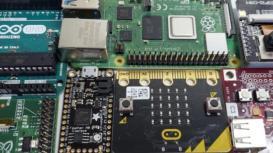](https://hackaday.com/2022/10/05/the-state-of-the-sbc-interface-ecosystem-is-it-time-to-design-a-standard/)

Choice when it comes to single board computers - They can be had from well-established brands such as Arduino, Adafruit, or Raspberry Pi, or from a Wild West of cheaper Far Eastern modules. There’s an aspect to these boards which has evolved; certain among them have become de facto interface connector standards for hardware peripherals. Do these standards make any sense? The reason it hasn’t happened yet is probably that there’s been no immediate sales incentive for them to do so - [Hackaday](https://hackaday.com/2022/10/05/the-state-of-the-sbc-interface-ecosystem-is-it-time-to-design-a-standard/).

## Awesome Feather Update

[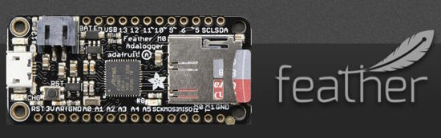](https://github.com/adafruit/awesome-feather)

A huge update to the Awesome Feather list with new microcontroller boards and FeatherWings. Feel free tp post pull requests or issues if things need updating - [GitHub](https://github.com/adafruit/awesome-feather).

## ESP32 MPY-Jama, a New MicroPython Developmentool for ESP Microcontrollers

[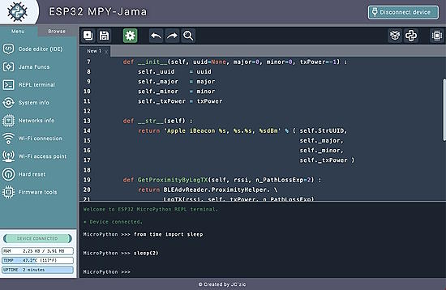](https://github.com/jczic/ESP32-MPY-Jama)

ESP32 MPY-Jama is a powerful tool which easily connects to Espressif ESP32 microcontrollers with MicroPython, providing an IDE, file manager, REPL, real-time dashboards and advanced features for efficient development on MacOS & Windows - [GitHub](https://github.com/jczic/ESP32-MPY-Jama) and [Adafruit Blog](https://blog.adafruit.com/2023/01/27/esp32-mpy-jama-a-new-esp32-development-tool-esp32-micropython-python-jc_zic/).

## #CircuitPython2023 Wrap Up

Thanks to the community for all the #CircuitPython2023 input! It’s wonderful to see all of the different things that have people’s interest. CircuitPython lead developer Scott Shawcroft shows all the responses posted throughout the internet - [Adafruit Blog](https://blog.adafruit.com/2023/01/23/circuitpython2023-wrap-up/).

## This Week's Python Streams

Python on Hardware is all about building a cooperative ecosphere which allows contributions to be valued and to grow knowledge. Below are the streams within the last week focusing on the community.

### CircuitPython Deep Dive Stream

[This week](https://youtu.be/i8yT3916WJ8), Tim streamed work on Blinka_DisplayIO tests then starting implemention of Bitmaptools.

You can see the latest video and past videos on the Adafruit YouTube channel under the Deep Dive playlist - [YouTube](https://www.youtube.com/playlist?list=PLjF7R1fz_OOXBHlu9msoXq2jQN4JpCk8A).

### CircuitPython Parsec

John Park’s CircuitPython Parsec this week is on List Filtering - [Adafruit Blog](https://blog.adafruit.com/2023/01/27/john-parks-circuitpython-parsec-list-filtering-adafruit-johnedgarpark-adafruit-circuitpython/) and [YouTube](https://youtu.be/7EqQPLnQjd8).

Catch all the episodes in the [YouTube playlist](https://www.youtube.com/playlist?list=PLjF7R1fz_OOWFqZfqW9jlvQSIUmwn9lWr).

## Project of the Week: A CubeSat using CircuitPython and MicroPython

[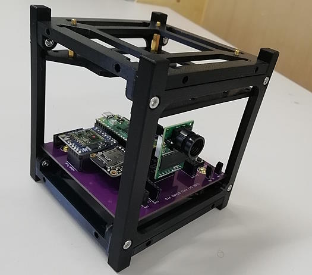](https://blog.adafruit.com/2023/01/25/harlow-college-builds-cubesats-with-students-using-the-raspberry-pi-pico-space-raspberrypi-micropython-circuitpython-ataylorfpga-raspberry_pi-pimoroni/)

First and second year engineering students at Harlow College (Harlow, Essex, UK) have been busy designing and building a new CubeSat platform, with the ultimate aim of getting their boards and designs in space, taking photos of the Earth and beaming them back to the classroom.

The CubeSat platform is based around the Raspberry Pi Pico, consisting of three parts to the design: an acquisition board loaded with a camera and various sensors and storage; a master controller board with a radio link; and a ground station containing a radio link and decoder software. All three boards use the Raspberry Pi Pico, and the software is written with a mix of MicroPython and CircuitPython across the three boards - [Adafruit Blog](https://blog.adafruit.com/2023/01/25/harlow-college-builds-cubesats-with-students-using-the-raspberry-pi-pico-space-raspberrypi-micropython-circuitpython-ataylorfpga-raspberry_pi-pimoroni/).

## News from around the web!

How to Run ChatGPT on Raspberry Pi or PC with Python - [Tom's Hardware](https://www.tomshardware.com/how-to/run-chatgpt-on-raspberry-pi).

An animated Pacman with Pimoroni Galactic Unicorn and MicroPython - [Pimoroni Forums](https://forums.pimoroni.com/t/galactic-unicorn-animated-pacman/20809/2) and [YouTube](https://www.youtube.com/watch?v=73aL2VAV6KI).

Raspberry Pi Pico powered prop Is an homage to the movie Die Hard. Essentially the prop is an RFID card reader, an RFID-RC522, connected to the Raspberry Pi Pico's SPI and I2C GPIO interfaces. Scanning an RFID card triggers the MicroPython code to control a strip of NeoPixels that illuminate an "open" sign - [Tom's Hardware](https://www.tomshardware.com/news/raspberry-pi-pico-powered-prop-is-a-homage-to-die-hard) and [YouTube](https://youtu.be/AoAn8HBpcf0).

[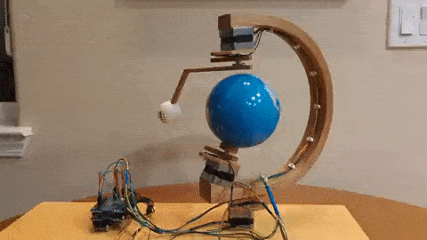](https://github.com/ebarlas/earth-moon-model)

Earth Moon Model (EMM) is a tabletop digital art project that combines a Raspberry Pi computer with sensors and actuators to create a realistic model of the Earth and the Moon in their orbits, programmed in Python - [GitHub](https://github.com/ebarlas/earth-moon-model) via [Twitter](https://twitter.com/ElliotBarlas/status/1618618954192400384).

[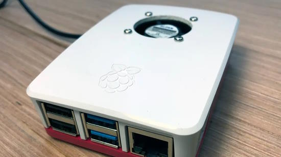](https://howchoo.com/g/ote2mjkzzta/control-raspberry-pi-fan-temperature-python)

Automatically control a Raspberry Pi fan (and temperature) with Python - [howchoo](https://howchoo.com/g/ote2mjkzzta/control-raspberry-pi-fan-temperature-python).

[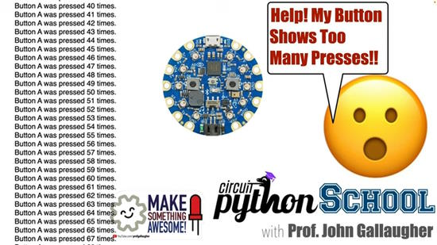](https://www.youtube.com/watch?v=RJamQZMya0g)

Better Buttons with Debouncing, fixing buttons that report multiple presses - [YouTube](https://www.youtube.com/watch?v=RJamQZMya0g).

[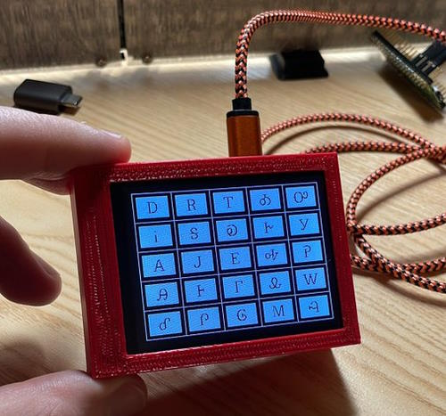](https://twitter.com/demc_nyc/status/1618501291566858240)

Making a lesson for students on Cherokee syllabary with CircuitPython and RP2040 - [Twitter](https://twitter.com/demc_nyc/status/1618501291566858240).

VisionFive 2 RISC-V SBC - A Raspberry Pi Killer? - [YouTube](https://www.youtube.com/watch?v=ZSRvTZyS0KI).

Keyboard Builders' Digest, Issue 112 - [Keyboard Builders' Digest](https://kbd.news/issue/112/).

circuitpython-upload ia a simple uploader script for the CircuitPython web workflow. Basically, call it with a hostname and password and it'll compare the local directory with the remote and upload newer files.- [GitHub](https://github.com/PheebeUK/circuitpython-upload) via [Mastodon](https://tech.lgbt/@Pheebe/109428330191115316).

[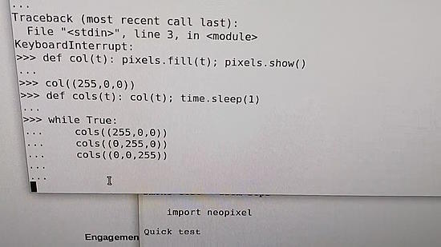](https://twitter.com/njcw/status/1615490835151216640)

Retrofitting an old infinity mirror with programmable LED lights driven by RP2040 and MicroPython - [Twitter](https://twitter.com/njcw/status/1615490835151216640).

[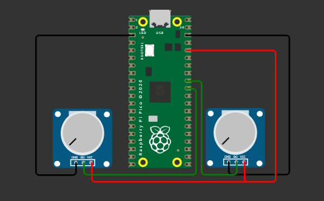](https://kyuchumimo.itch.io/serial-a-sketch)

Making controls for an electronic Etch-a-Sketch with a Raspberry Pi PIco and CircuitPython - [kyuchumimo.itch.io](https://kyuchumimo.itch.io/serial-a-sketch).

text - [site](url).

Intel kills PathFinder IDE for RISC-V processors - [CNX Software](https://www.cnx-software.com/2023/01/27/intel-kills-pathfinder-ide-for-risc-v-processors/).

text - [site](url).

text - [site](url).

text - [site](url).

text - [site](url).

Comparing tag trends with our Most Loved programming languages - [Stack Overflow](https://stackoverflow.blog/2023/01/26/comparing-tag-trends-with-our-most-loved-programming-languages/).

PyDev of the Week: NAME on [Mouse vs Python]()

CircuitPython Weekly Meeting for DATE ([notes]()) [on YouTube]()

#ICYDNCI What was the most popular, most clicked link, in [last week's newsletter](https://www.adafruitdaily.com/2023/01/24/python-on-microcontrollers-newsletter-400-circuitpython-libraries-3m-thanks-and-much-more-circuitpython-python-thepsf-micropython-raspberry_pi/)? [SMARS Mini Robot](https://www.kevsrobots.com/blog/smars-mini.html).

## Coming Soon

text - [site](url).

text - [site](url).

## New Boards Supported by CircuitPython

The number of supported microcontrollers and Single Board Computers (SBC) grows every week. This section outlines which boards have been included in CircuitPython or added to [CircuitPython.org](https://circuitpython.org/).

This week, there were no new boards, but a big batch is about to drop next week!

*Note: For non-Adafruit boards, please use the support forums of the board manufacturer for assistance, as Adafruit does not have the hardware to assist in troubleshooting.*

Looking to add a new board to CircuitPython? It's highly encouraged! Adafruit has four guides to help you do so:

- [How to Add a New Board to CircuitPython](https://learn.adafruit.com/how-to-add-a-new-board-to-circuitpython/overview)
- [How to add a New Board to the circuitpython.org website](https://learn.adafruit.com/how-to-add-a-new-board-to-the-circuitpython-org-website)
- [Adding a Single Board Computer to PlatformDetect for Blinka](https://learn.adafruit.com/adding-a-single-board-computer-to-platformdetect-for-blinka)
- [Adding a Single Board Computer to Blinka](https://learn.adafruit.com/adding-a-single-board-computer-to-blinka)

## New Learn Guides!

[NeXT Bus Mouse to USB HID with CircuitPython](https://learn.adafruit.com/next-bus-mouse-to-usb-hid-with-circuitpython) from [Jeff Epler](https://learn.adafruit.com/u/jepler)

## Updated Learn Guides!

All of the guides for the displays that have been revised to include an EYESPI connector have been updated with details about EYESPI! Check out [the updated guides on the Adafruit Learn System](https://learn.adafruit.com/search?q=eyespi%2520connector) if you're interested!

## CircuitPython Libraries!

CircuitPython support for hardware continues to grow. We are adding support for new sensors and breakouts all the time, as well as improving on the drivers we already have. As we add more libraries and update current ones, you can keep up with all the changes right here!

For the latest libraries, download the [Adafruit CircuitPython Library Bundle](https://circuitpython.org/libraries). For the latest community contributed libraries, download the [CircuitPython Community Bundle](https://github.com/adafruit/CircuitPython_Community_Bundle/releases).

If you'd like to contribute, CircuitPython libraries are a great place to start. Have an idea for a new driver? File an issue on [CircuitPython](https://github.com/adafruit/circuitpython/issues)! Have you written a library you'd like to make available? Submit it to the [CircuitPython Community Bundle](https://github.com/adafruit/CircuitPython_Community_Bundle). Interested in helping with current libraries? Check out the [CircuitPython.org Contributing page](https://circuitpython.org/contributing). We've included open pull requests and issues from the libraries, and details about repo-level issues that need to be addressed. We have a guide on [contributing to CircuitPython with Git and GitHub](https://learn.adafruit.com/contribute-to-circuitpython-with-git-and-github) if you need help getting started. You can also find us in the #circuitpython channels on the [Adafruit Discord](https://adafru.it/discord).

You can check out this [list of all the Adafruit CircuitPython libraries and drivers available](https://github.com/adafruit/Adafruit_CircuitPython_Bundle/blob/master/circuitpython_library_list.md). 

The current number of CircuitPython libraries is **402**!

**The New and Updated Libraries sections now include the community-contributed libraries!**

**New Libraries!**

Here's this week's new CircuitPython libraries:

  * [jposada202020/CircuitPython_equalizer](https://github.com/jposada202020/CircuitPython_equalizer)

**Updated Libraries!**

Here's this week's updated CircuitPython libraries:

  * [adafruit/Adafruit_CircuitPython_Wiznet5k](https://github.com/adafruit/Adafruit_CircuitPython_Wiznet5k)
  * [adafruit/Adafruit_CircuitPython_PCF8574](https://github.com/adafruit/Adafruit_CircuitPython_PCF8574)
  * [adafruit/Adafruit_CircuitPython_LSM303DLH_Mag](https://github.com/adafruit/Adafruit_CircuitPython_LSM303DLH_Mag)
  * [adafruit/Adafruit_CircuitPython_ST7789](https://github.com/adafruit/Adafruit_CircuitPython_ST7789)
  * [adafruit/Adafruit_CircuitPython_SHT31D](https://github.com/adafruit/Adafruit_CircuitPython_SHT31D)
  * [adafruit/Adafruit_CircuitPython_MagTag](https://github.com/adafruit/Adafruit_CircuitPython_MagTag)
  * [jposada202020/CircuitPython_ArrowLine](https://github.com/jposada202020/CircuitPython_ArrowLine)
  * [jposada202020/CircuitPython_st](https://github.com/jposada202020/CircuitPython_st)

**Library PYPI Weekly Download Statistics**
* **Total Library Stats**
  * 90827 PyPI downloads over 306 libraries
* **Top 10 Libraries by PyPI Downloads**
  * Adafruit CircuitPython BusDevice (adafruit-circuitpython-busdevice): 14679
  * Adafruit CircuitPython Requests (adafruit-circuitpython-requests): 13788
  * Adafruit CircuitPython NeoPixel (adafruit-circuitpython-neopixel): 1772
  * Adafruit CircuitPython Register (adafruit-circuitpython-register): 1715
  * Adafruit CircuitPython Wiznet5k (adafruit-circuitpython-wiznet5k): 1080
  * Adafruit CircuitPython MCP230xx (adafruit-circuitpython-mcp230xx): 932
  * Adafruit CircuitPython LED Animation (adafruit-circuitpython-led-animation): 863
  * Adafruit CircuitPython Motor (adafruit-circuitpython-motor): 748
  * Adafruit CircuitPython Pixelbuf (adafruit-circuitpython-pixelbuf): 738
  * Adafruit CircuitPython PCA9685 (adafruit-circuitpython-pca9685): 721

## What’s the team up to this week?

What is the team up to this week? Let’s check in!

**Dan**

I updated CIrcuitPython Espressif builds to use the latest v4.4 updates from Espressif for the ESP-IDF SDK. Unfortunately they do not fix our existing I2C or wifi problems, but it's good to keep up with the fixes that are available.

Scott, Jeff and I triaged the remaining open issues for 8.0.0 and pushed them to a later 8.x.x release. We have been working on a number of them, and have had difficulty reproducing some. They are not showstoppers. I will make an 8.0.0-rc.0 Release Candidate release, which should be available by the time you read this.

**Kattni**

This week was all about EYESPI updates. We've revised a number of our displays to have a flex cable connector called an EYESPI connector, that allows you to hook up these displays to your microcontroller without soldering them or using a breadboard. All of the revisions at this time have had their guides updated to explain the connector, show how to plug it in, and indicate what pins are used by that particular display. If you picked up an EYESPI display and want more details, check out the guide for your display!

**Melissa**

I worked on catching up with messages and wrapping up some of the code I had been working on previously.  This includes fixing some bugs for the CircuitPython Code Editor. I have mostly been focusing on fixing bugs and refactoring some of the code that I intent to reuse in the new CircuitPython Installer that I was working on a couple of weeks ago.

**Tim**

This week I tested out the remaining Ethernet library PRs with improved example, and socket class more closely aligned with CPython. I also started implementing the bitmaptools module for Blinka_Displayio. It will allow code that uses it to be more portable. Intrigued by a question from discord over the past weekend, I learned how to use the MagTag library in conjunction with the deep sleep / pin alarm wake up functionality and submitted a new example that illustrates it.

**Jeff**

I published a guide about converting the NeXT Computers mouse to USB HID with CircuitPython. Check it out on [the Adafuit Learning System](https://learn.adafruit.com/next-bus-mouse-to-usb-hid-with-circuitpython).

**Scott**

[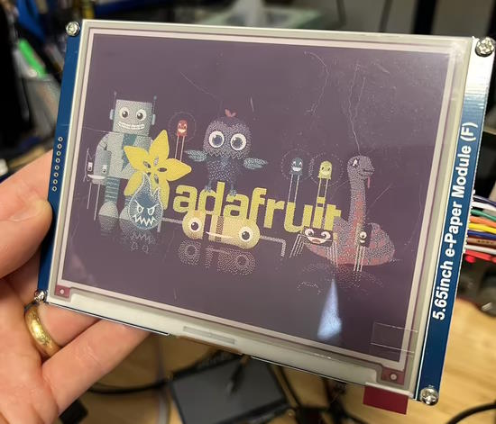](https://www.circuitpython.org/)

This week I've been working on adding 7-color (black, white, red, orange, yellow, green and blue) e-paper display support to CircuitPython. Along the way I've also added dither support to the Palette pixel shader for times when the colors aren't exactly the colors supported by the e-paper display. I'm receiving the 4" and 7" 7-color e-paper displays today and will add support for them as well.

**Liz**

I worked with Kattni to add a page to the (display guides that now have EYESPI connectors)[https://learn.adafruit.com/search?q=eyespi]. She wrote a great template page that explains the connector and shows what pins are broken out to EYESPI for each display.

I currently have a few projects in the works, some collaborations and one solo, that will be published in the coming weeks; all of which are using CircuitPython.

## Upcoming events!

The next MicroPython Meetup in Melbourne will be on January 25th – [Meetup](https://www.meetup.com/MicroPython-Meetup/). Slides from the October meeting are [here](https://docs.google.com/presentation/d/e/2PACX-1vQnJM1r7vFuRMq9bzHWXKyjvnmQsDRB30OMVE5Ujcgv75_NGg3prgQ_QzAtVyJoQEdM-x5HvgSrFXS9/pub?slide=id.p).

FOSDEM is a free event for software developers to meet, share ideas and collaborate. Every year, thousands of developers of free and open source software from all over the world gather at the event in Brussels. February 4-5, 2023 in Brussels, Belgium - [Fosdem](https://fosdem.org/2023/).

PyCon US 2023 will be April 19-17, 2023, again in Salt Lake City, Utah USA - [PyCon US 2023](https://us.pycon.org/2023/).

**Send Your Events In**

If you know of virtual events or upcoming events, please let us know via email to cpnews(at)adafruit(dot)com.

## Latest releases

CircuitPython's stable release is [#.#.#](https://github.com/adafruit/circuitpython/releases/latest) and its unstable release is [#.#.#-##.#](https://github.com/adafruit/circuitpython/releases). New to CircuitPython? Start with our [Welcome to CircuitPython Guide](https://learn.adafruit.com/welcome-to-circuitpython).

[2023####](https://github.com/adafruit/Adafruit_CircuitPython_Bundle/releases/latest) is the latest CircuitPython library bundle.

[v#.#.#](https://micropython.org/download) is the latest MicroPython release. Documentation for it is [here](http://docs.micropython.org/en/latest/pyboard/).

[#.#.#](https://www.python.org/downloads/) is the latest Python release. The latest pre-release version is [#.#.#](https://www.python.org/download/pre-releases/).

[#,### Stars](https://github.com/adafruit/circuitpython/stargazers) Like CircuitPython? [Star it on GitHub!](https://github.com/adafruit/circuitpython)

## Call for help -- Translating CircuitPython is now easier than ever!

[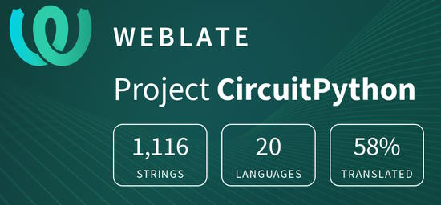](https://hosted.weblate.org/engage/circuitpython/)

One important feature of CircuitPython is translated control and error messages. With the help of fellow open source project [Weblate](https://weblate.org/), we're making it even easier to add or improve translations. 

Sign in with an existing account such as GitHub, Google or Facebook and start contributing through a simple web interface. No forks or pull requests needed! As always, if you run into trouble join us on [Discord](https://adafru.it/discord), we're here to help.

## jobs.adafruit.com - Find a dream job, find great candidates!

[jobs.adafruit.com](https://jobs.adafruit.com/) has returned and folks are posting their skills (including CircuitPython) and companies are looking for talented makers to join their companies - from Digi-Key, to Hackaday, Micro Center, Raspberry Pi and more.

## NUMBER thanks!

The Adafruit Discord community, where we do all our CircuitPython development in the open, reached over NUMBER humans - thank you!  Adafruit believes Discord offers a unique way for Python on hardware folks to connect. Join today at [https://adafru.it/discord](https://adafru.it/discord).

## ICYMI - In case you missed it

Python on hardware is the Adafruit Python video-newsletter-podcast! The news comes from the Python community, Discord, Adafruit communities and more and is broadcast on ASK an ENGINEER Wednesdays. The complete Python on Hardware weekly videocast [playlist is here](https://www.youtube.com/playlist?list=PLjF7R1fz_OOXRMjM7Sm0J2Xt6H81TdDev). The video podcast is on [iTunes](https://itunes.apple.com/us/podcast/python-on-hardware/id1451685192?mt=2), [YouTube](http://adafru.it/pohepisodes), [IGTV (Instagram TV](https://www.instagram.com/adafruit/channel/)), and [XML](https://itunes.apple.com/us/podcast/python-on-hardware/id1451685192?mt=2).

[The weekly community chat on Adafruit Discord server CircuitPython channel - Audio / Podcast edition](https://itunes.apple.com/us/podcast/circuitpython-weekly-meeting/id1451685016) - Audio from the Discord chat space for CircuitPython, meetings are usually Mondays at 2pm ET, this is the audio version on [iTunes](https://itunes.apple.com/us/podcast/circuitpython-weekly-meeting/id1451685016), Pocket Casts, [Spotify](https://adafru.it/spotify), and [XML feed](https://adafruit-podcasts.s3.amazonaws.com/circuitpython_weekly_meeting/audio-podcast.xml).

## Codecademy "Learn Hardware Programming with CircuitPython"

Codecademy, an online interactive learning platform used by more than 45 million people, has teamed up with Adafruit to create a coding course, “Learn Hardware Programming with CircuitPython”. The course is now available in the [Codecademy catalog](https://www.codecademy.com/learn/learn-circuitpython?utm_source=adafruit&utm_medium=partners&utm_campaign=circuitplayground&utm_content=pythononhardwarenewsletter).

## Contribute!

The CircuitPython Weekly Newsletter is a CircuitPython community-run newsletter emailed every Tuesday. The complete [archives are here](https://www.adafruitdaily.com/category/circuitpython/). It highlights the latest CircuitPython related news from around the web including Python and MicroPython developments. To contribute, edit next week's draft [on GitHub](https://github.com/adafruit/circuitpython-weekly-newsletter/tree/gh-pages/_drafts) and [submit a pull request](https://help.github.com/articles/editing-files-in-your-repository/) with the changes. You may also tag your information on Twitter with #CircuitPython. 

Join the Adafruit [Discord](https://adafru.it/discord) or [post to the forum](https://forums.adafruit.com/viewforum.php?f=60) if you have questions.
