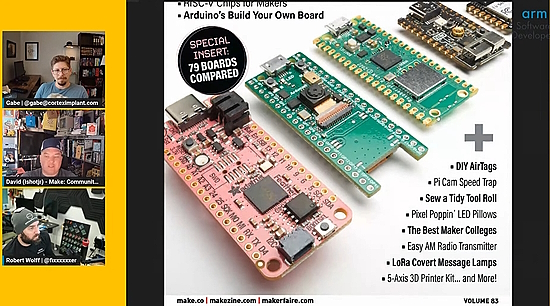
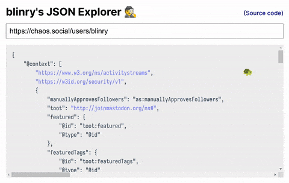
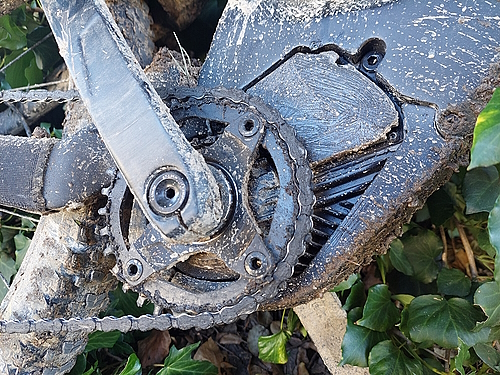
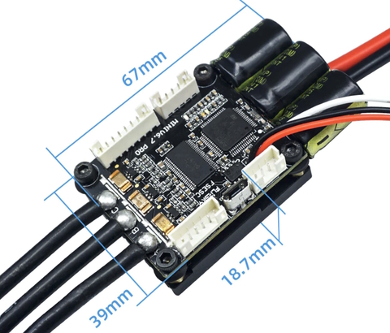
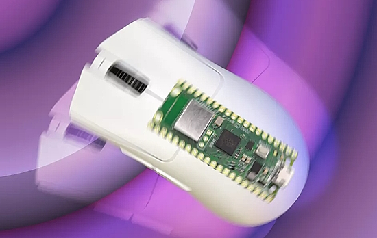
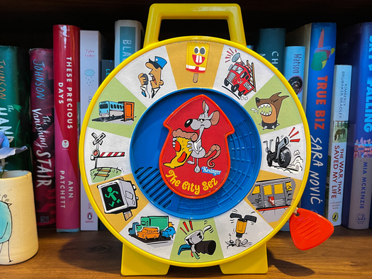
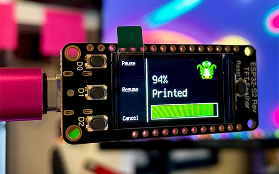
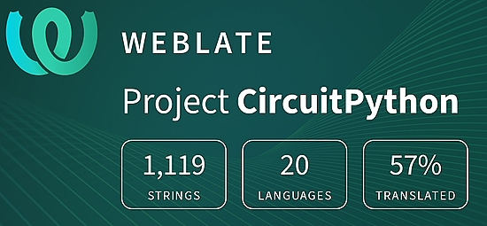

- [ ] Kattni updates
- [ ] change date
- [ ] update title
- [ ] Feature story
- [ ] Update  for images
- [ ] Update ICYDNCI
- [ ] All images 550w max only
- [ ] Link "View this email in your browser."

News Sources

- [python.org](https://www.python.org/)
- [Python Insider - dev team blog](https://pythoninsider.blogspot.com/)
- [MicroPython Meetup Blog](https://melbournemicropythonmeetup.github.io/)
- [hackaday.io newest projects MicroPython](https://hackaday.io/projects?tag=micropython&sort=date) and [CircuitPython](https://hackaday.io/projects?tag=circuitpython&sort=date)
- [hackaday CircuitPython](https://hackaday.com/blog/?s=circuitpython) and [MicroPython](https://hackaday.com/blog/?s=micropython)
- [hackster.io CircuitPython](https://www.hackster.io/search?q=circuitpython&i=projects&sort_by=most_recent) and [MicroPython](https://www.hackster.io/search?q=micropython&i=projects&sort_by=most_recent)
- [https://opensource.com/tags/python](https://opensource.com/tags/python)
- [Mastodon CircuitPython](https://octodon.social/tags/CircuitPython)

View this email in your browser. **Warning: Flashing Imagery**

Welcome to the latest Python on Microcontrollers newsletter!  - *Ed.*

We're on [Discord](https://discord.gg/HYqvREz), [Twitter](https://twitter.com/search?q=circuitpython&src=typed_query&f=live), and for past newsletters - [view them all here](https://www.adafruitdaily.com/category/circuitpython/). If you're reading this on the web, [subscribe here](https://www.adafruitdaily.com/). Here's the news this week:

## CircuitPython 8.0 is Released!

text - [site](url).

## Video: Innovation Coffee - David Groom presents Make:'s Annual Guide to Boards

On this weeks' episode of the Innovation Coffee videocast, David Groom from Make: presents discusses the recently released Annual Guide to Boards (the hottest topic in last weeks' newsletter) - [YouTube](https://www.youtube.com/watch?v=r6DKQ1rqaso).

## Exploring JSON Files interactively

A tool for exploring JSON APIs interactively. It's also good for pasting in a Mastodon profile link and see the data that is generated - [Mastodon](https://chaos.social/@blinry/109789928987786290), tool on the web: [json.blinry.org](https://json.blinry.org/) and [source code](https://github.com/blinry/json-explorer).

## Feature

text - [site](url).

## This Week's Python Streams

Python on Hardware is all about building a cooperative ecosphere which allows contributions to be valued and to grow knowledge. Below are the streams within the last week focusing on the community.

### CircuitPython Deep Dive Stream

[This week](link), Tim streamed work on {subject}.

You can see the latest video and past videos on the Adafruit YouTube channel under the Deep Dive playlist - [YouTube](https://www.youtube.com/playlist?list=PLjF7R1fz_OOXBHlu9msoXq2jQN4JpCk8A).

### CircuitPython Parsec

John Park’s CircuitPython Parsec this week is on {subject} - [Adafruit Blog](link) and [YouTube](link).

Catch all the episodes in the [YouTube playlist](https://www.youtube.com/playlist?list=PLjF7R1fz_OOWFqZfqW9jlvQSIUmwn9lWr).

## Project of the Week: EBike/EScooter modular DIY electronics using VESC and CircuitPython

Over the years, Jorge Pinto owned a few different EBikes / EScooters from different brands, and found limitations with all of them, mainly on the software. Knowing that in general, all EBikes and EScooters are equal, Jorge decided to replace the original motor controller electronics and display, from different EBikes/EScooter vendors, with a modular DIY version and running custom software.

The resulting module uses the popular VESC for the motor controller and an ESP32 board running CircuitPython. It is programmed wirelessly with a phone or a PC (just editing Python text files) - [OpenSourceEBike.github.io](https://opensourceebike.github.io/), [YouTube](https://www.youtube.com/watch?v=EL9Jek3_hDg), [GitHub](https://github.com/OpenSourceEBike/EBike_EScooter_modular_DIY/tree/main).

## News from around the web!

Making a DIY Mouse Jiggler with Raspberry Pi Pico and CircuitPython - [Tom's Hardware](https://www.tomshardware.com/how-to/diy-mouse-jiggler-raspberry-pi-pico) and [Adafruit Blog](https://blog.adafruit.com/2023/02/01/making-a-diy-mouse-jiggler-with-raspberry-pi-pico-raspberrypi-tomshardware-raspberry_pi/).

Find My Cat, the GPS Tracker for Pets. Uses a Raspberry Pi and MicroPython - [Instructables](https://www.instructables.com/Find-My-Cat-the-GPS-Tracker-for-Pets/) and .

text - [site](url).

text - [site](url).

text - [site](url).

text - [site](url).

text - [site](url).

text - [site](url).

text - [site](url).

text - [site](url).

text - [site](url).

text - [site](url).

text - [site](url).

text - [site](url).

text - [site](url).

text - [site](url).

text - [site](url).

text - [site](url).

PyDev of the Week: NAME on [Mouse vs Python]()

CircuitPython Weekly Meeting for DATE ([notes]()) [on YouTube]()

#ICYDNCI What was the most popular, most clicked link, in [last week's newsletter](https://www.adafruitdaily.com/2023/01/31/python-on-microcontrollers-newsletter-circuitpython-8-0-rc-1-out-board-guides-and-much-more-circuitpython-python-thepsf-micropython-raspberry_pi/)? [Digi-Key and Make: Announce New Boards Guide and Companion Augmented Reality App](https://blog.adafruit.com/2023/01/26/digi-key-and-make-announce-new-boards-guide-and-companion-augmented-reality-app-make-digikey/).

## New

The ESP32-C6 is here! We already knew about the RISCV and the WiFi6 parts, but we were pleasantly surprised to see Zigbee and Thread, along with Matter support! - [ElectroMaker](https://www.electromaker.io/blog/article/single-core-risc-v-esp32-c6-brings-wifi-6-and-matter-to-the-party) via [Twitter](https://twitter.com/ElectromakerIO/status/1620466996746878976).

Adafruit is carrying C6 development modules (for advanced use) - [Adafruit](https://www.adafruit.com/?q=esp32+c6&sort=BestMatch).

text - [site](url).

## New Boards Supported by CircuitPython

The number of supported microcontrollers and Single Board Computers (SBC) grows every week. This section outlines which boards have been included in CircuitPython or added to [CircuitPython.org](https://circuitpython.org/).

This week, there were (#/no) new boards added!

- [Board name](url)
- [Board name](url)
- [Board name](url)

*Note: For non-Adafruit boards, please use the support forums of the board manufacturer for assistance, as Adafruit does not have the hardware to assist in troubleshooting.*

Looking to add a new board to CircuitPython? It's highly encouraged! Adafruit has four guides to help you do so:

- [How to Add a New Board to CircuitPython](https://learn.adafruit.com/how-to-add-a-new-board-to-circuitpython/overview)
- [How to add a New Board to the circuitpython.org website](https://learn.adafruit.com/how-to-add-a-new-board-to-the-circuitpython-org-website)
- [Adding a Single Board Computer to PlatformDetect for Blinka](https://learn.adafruit.com/adding-a-single-board-computer-to-platformdetect-for-blinka)
- [Adding a Single Board Computer to Blinka](https://learn.adafruit.com/adding-a-single-board-computer-to-blinka)

## New Learn Guides!

[title](url) from [name](url)

[title](url) from [name](url)

[title](url) from [name](url)

## Updated Learn Guides!

[title](url) from [name](url)

## CircuitPython Libraries!

CircuitPython support for hardware continues to grow. We are adding support for new sensors and breakouts all the time, as well as improving on the drivers we already have. As we add more libraries and update current ones, you can keep up with all the changes right here!

For the latest libraries, download the [Adafruit CircuitPython Library Bundle](https://circuitpython.org/libraries). For the latest community contributed libraries, download the [CircuitPython Community Bundle](https://github.com/adafruit/CircuitPython_Community_Bundle/releases).

If you'd like to contribute, CircuitPython libraries are a great place to start. Have an idea for a new driver? File an issue on [CircuitPython](https://github.com/adafruit/circuitpython/issues)! Have you written a library you'd like to make available? Submit it to the [CircuitPython Community Bundle](https://github.com/adafruit/CircuitPython_Community_Bundle). Interested in helping with current libraries? Check out the [CircuitPython.org Contributing page](https://circuitpython.org/contributing). We've included open pull requests and issues from the libraries, and details about repo-level issues that need to be addressed. We have a guide on [contributing to CircuitPython with Git and GitHub](https://learn.adafruit.com/contribute-to-circuitpython-with-git-and-github) if you need help getting started. You can also find us in the #circuitpython channels on the [Adafruit Discord](https://adafru.it/discord).

You can check out this [list of all the Adafruit CircuitPython libraries and drivers available](https://github.com/adafruit/Adafruit_CircuitPython_Bundle/blob/master/circuitpython_library_list.md). 

The current number of CircuitPython libraries is **###**!

**New Libraries!**

Here's this week's new CircuitPython libraries:

* [library](url)

**Updated Libraries!**

Here's this week's updated CircuitPython libraries:

* [library](url)

**Library Statistics**

## What’s the team up to this week?

What is the team up to this week? Let’s check in!

**Dan**

I released CircuitPython 8.0.0-rc.1 on January 29 and rc.2 on February 1. There will probably be an rc.3, with very minor changes, and then if that shows no showstopper issues, we should be able to release CircuitPython 8.0.0 final very soon!

I have also been working on non-CircuitPython issues. I diagnosed a rare power-down sequencing issue on a few boards. I am also looking at SAMD21 UF2 bootloader problems: the BOOTPROT (bootloader protection) fuses are not being set on some boards, and the bootloader should really be doing brownout protection.

**Kattni**

Wrapped up the EYESPI guide updates with Liz. Now we're onto the guide for the [Adafruit Reverse TFT Feather ESP32-S2](https://www.adafruit.com/product/5345). This will be a big one, though it is very similar to the Adafruit ESP32-S2 TFT Feather guide. There are two basic differences: the battery monitor is a different chip, and (obviously) the display is on the bottom. If you picked up one of these microcontrollers, keep an eye out for this guide!

**Melissa**

This past week was pretty productive. I was able to finish working all of the bugs out of a Pull Request for the [CircuitPython Code Editor](https://code.circuitpython.org/) which improves the USB workflow. I also pulled the code that allows JavaScript to interface with the CircuitPython REPL and place it in [its own GitHub repository](https://github.com/adafruit/circuitpython-repl-js).

After that, I finished up a Pull Request to add some initial code for the CircuitPython Installer in order to test CORS issues that I've been experiencing. Working with another team member, we were able to fix the CORS issues in a central place for the CircuitPython firmware and I'm just about finished fixing it with the bootloaders as well.

I also added a number of new boards to [circuitpython.org](https://circuitpython.org/downloads) that were added as part of the new CircuitPython Release Candidates.

**Tim**

I've been working on the IS31FL3741 driver this week. I submitted a PR for the library to allow it to work with the LED_Animation library for the RGB Matrix device. I'm also digging in to an issue in the core module driver implementation that caused it to have issues on builds newer than 7.3.3. I'm bisecting thru the commits between the known good and bad versions to find the relevant change then I'll try to submit a fix for it.

**Jeff**

I had a couple of small PRs to circuitpython this week. First, I added the missing D0/D1/D2 buttons to the Feather ESP32-S2 Reverse TFT. Second, I pulled in an update of ulab to fix several crashing bugs.

Most of my time over the last week was spent in the Arduino environment, working on adding a VT100-style terminal to Pico-DVI. This isn't released, as it needs some polish. (OK, a lot of polish). One interesting possibility would be to load one RP2040 with the terminal sketch and connect to it with a second board using busio.UART to create a text terminal on a nice 800x480 display.

**Scott**

Last week I submitted [a PR for Bangle.js 2 support and 7-color e-paper support](https://github.com/adafruit/circuitpython/pull/7497). Its been a fight to get the CI happy though because it adds secure DFU support for the Bangle.js 2.

In the meantime, I've been scratching an itch to create a low-cost logic analyzer. In fact, [the Scorpio](https://www.adafruit.com/product/5650) can be configured for *input*. I've gotten it working with the [sigrok-pico project](https://github.com/pico-coder/sigrok-pico). So, its been a matter of connecting the hardware and software pieces. Follow along with the [pysigrok](https://github.com/pysigrok/) project.

**Liz**

I'm in the middle of a few projects right now. My main focus has been on an OctoPrint status viewer. Recently my partner setup OctoPrint for our printer and my first thought was could we do a CircuitPython project with it? Using Adafruit IO as an MQTT broker with the MQTT plugin, I was able to get a TFT Feather ESP32-S2 showing the current status of the printer (operational, connecting, offline, etc) and if a print was running, I displayed the progress for the print using the progress bar library. 

It was suggested that I try to send MQTT messages to OctoPrint from the Feather too, which I was able to do through Adafruit IO and the OctoPrint MQTT Subscribe plugin. I've also switched to the new reverse mount TFT Feather ESP32-S2, which has three input buttons. Now if the printer is idle, I can send cooldown, heat up and reboot messages and if a print is active, I can send pause, resume or cancel messages. This will be fully documented in a Learn Guide soon.

## Upcoming events!

The next MicroPython Meetup in Melbourne will be on February 22nd – [Meetup](https://www.meetup.com/MicroPython-Meetup/). Slides from the October meeting are [here](https://docs.google.com/presentation/d/e/2PACX-1vQnJM1r7vFuRMq9bzHWXKyjvnmQsDRB30OMVE5Ujcgv75_NGg3prgQ_QzAtVyJoQEdM-x5HvgSrFXS9/pub?slide=id.p).

Unlock the Power of MicroPython on an Arduino: Join a Live Webinar March 9, 2023 - [Elector](https://elektor.clickmeeting.com/arduino-micropython-webinar-with-sebastian-romero/register).

PyCon US 2023 will be April 19-17, 2023, again in Salt Lake City, Utah USA - [PyCon US 2023](https://us.pycon.org/2023/).

**Send Your Events In**

If you know of virtual events or upcoming events, please let us know via email to cpnews(at)adafruit(dot)com.

## Latest releases

CircuitPython's stable release is [#.#.#](https://github.com/adafruit/circuitpython/releases/latest) and its unstable release is [#.#.#-##.#](https://github.com/adafruit/circuitpython/releases). New to CircuitPython? Start with our [Welcome to CircuitPython Guide](https://learn.adafruit.com/welcome-to-circuitpython).

[2023####](https://github.com/adafruit/Adafruit_CircuitPython_Bundle/releases/latest) is the latest CircuitPython library bundle.

[v#.#.#](https://micropython.org/download) is the latest MicroPython release. Documentation for it is [here](http://docs.micropython.org/en/latest/pyboard/).

[#.#.#](https://www.python.org/downloads/) is the latest Python release. The latest pre-release version is [#.#.#](https://www.python.org/download/pre-releases/).

[#,### Stars](https://github.com/adafruit/circuitpython/stargazers) Like CircuitPython? [Star it on GitHub!](https://github.com/adafruit/circuitpython)

## Call for help -- Translating CircuitPython is now easier than ever!

One important feature of CircuitPython is translated control and error messages. With the help of fellow open source project [Weblate](https://weblate.org/), we're making it even easier to add or improve translations. 

Sign in with an existing account such as GitHub, Google or Facebook and start contributing through a simple web interface. No forks or pull requests needed! As always, if you run into trouble join us on [Discord](https://adafru.it/discord), we're here to help.

## jobs.adafruit.com - Find a dream job, find great candidates!

[jobs.adafruit.com](https://jobs.adafruit.com/) has returned and folks are posting their skills (including CircuitPython) and companies are looking for talented makers to join their companies - from Digi-Key, to Hackaday, Micro Center, Raspberry Pi and more.

**Job of the Week**

Junior Bookkeeper - Adafruit Industries LLC - [Adafruit Jobs Board](https://jobs.adafruit.com/job/junior-bookkeeper/).

## NUMBER thanks!

The Adafruit Discord community, where we do all our CircuitPython development in the open, reached over NUMBER humans - thank you!  Adafruit believes Discord offers a unique way for Python on hardware folks to connect. Join today at [https://adafru.it/discord](https://adafru.it/discord).

## ICYMI - In case you missed it

Python on hardware is the Adafruit Python video-newsletter-podcast! The news comes from the Python community, Discord, Adafruit communities and more and is broadcast on ASK an ENGINEER Wednesdays. The complete Python on Hardware weekly videocast [playlist is here](https://www.youtube.com/playlist?list=PLjF7R1fz_OOXRMjM7Sm0J2Xt6H81TdDev). The video podcast is on [iTunes](https://itunes.apple.com/us/podcast/python-on-hardware/id1451685192?mt=2), [YouTube](http://adafru.it/pohepisodes), [IGTV (Instagram TV](https://www.instagram.com/adafruit/channel/)), and [XML](https://itunes.apple.com/us/podcast/python-on-hardware/id1451685192?mt=2).

[The weekly community chat on Adafruit Discord server CircuitPython channel - Audio / Podcast edition](https://itunes.apple.com/us/podcast/circuitpython-weekly-meeting/id1451685016) - Audio from the Discord chat space for CircuitPython, meetings are usually Mondays at 2pm ET, this is the audio version on [iTunes](https://itunes.apple.com/us/podcast/circuitpython-weekly-meeting/id1451685016), Pocket Casts, [Spotify](https://adafru.it/spotify), and [XML feed](https://adafruit-podcasts.s3.amazonaws.com/circuitpython_weekly_meeting/audio-podcast.xml).

## Codecademy "Learn Hardware Programming with CircuitPython"

Codecademy, an online interactive learning platform used by more than 45 million people, has teamed up with Adafruit to create a coding course, “Learn Hardware Programming with CircuitPython”. The course is now available in the [Codecademy catalog](https://www.codecademy.com/learn/learn-circuitpython?utm_source=adafruit&utm_medium=partners&utm_campaign=circuitplayground&utm_content=pythononhardwarenewsletter).

## Contribute!

The CircuitPython Weekly Newsletter is a CircuitPython community-run newsletter emailed every Tuesday. The complete [archives are here](https://www.adafruitdaily.com/category/circuitpython/). It highlights the latest CircuitPython related news from around the web including Python and MicroPython developments. To contribute, edit next week's draft [on GitHub](https://github.com/adafruit/circuitpython-weekly-newsletter/tree/gh-pages/_drafts) and [submit a pull request](https://help.github.com/articles/editing-files-in-your-repository/) with the changes. You may also tag your information on Twitter with #CircuitPython. 

Join the Adafruit [Discord](https://adafru.it/discord) or [post to the forum](https://forums.adafruit.com/viewforum.php?f=60) if you have questions.
