- [ ] Kattni updates
- [ ] change date
- [ ] update title
- [ ] Feature story
- [ ] Update  for images
- [ ] Update ICYDNCI
- [ ] All images 550w max only
- [ ] Link "View this email in your browser."

News Sources

- [python.org](https://www.python.org/)
- [Python Insider - dev team blog](https://pythoninsider.blogspot.com/)
- [MicroPython Meetup Blog](https://melbournemicropythonmeetup.github.io/)
- [hackaday.io newest projects MicroPython](https://hackaday.io/projects?tag=micropython&sort=date) and [CircuitPython](https://hackaday.io/projects?tag=circuitpython&sort=date)
- [hackaday CircuitPython](https://hackaday.com/blog/?s=circuitpython) and [MicroPython](https://hackaday.com/blog/?s=micropython)
- [hackster.io CircuitPython](https://www.hackster.io/search?q=circuitpython&i=projects&sort_by=most_recent) and [MicroPython](https://www.hackster.io/search?q=micropython&i=projects&sort_by=most_recent)
- [https://opensource.com/tags/python](https://opensource.com/tags/python)
- [Mastodon CircuitPython](https://octodon.social/tags/CircuitPython)

View this email in your browser. **Warning: Flashing Imagery**

Welcome to the latest Python on Microcontrollers newsletter! This week is focused more on software. A new bugfix for CircuitPython is available. And some neat tools and projects have been realized using Python also. We've entered another heavy period for events, check out the latest list in this issue. And as alweays, some fabulous projects by people worldwide - *Ed.*

We're on [Discord](https://discord.gg/HYqvREz), [Twitter](https://twitter.com/search?q=circuitpython&src=typed_query&f=live), and for past newsletters - [view them all here](https://www.adafruitdaily.com/category/circuitpython/). If you're reading this on the web, [subscribe here](https://www.adafruitdaily.com/). Here's the news this week:

## CircuitPython 8.0.3 Released

CircuitPython 8.0.3, the latest bugfix revision of CircuitPython, and is a new stable release, has been released. - [Adafruit Blog](https://blog.adafruit.com/2023/02/23/circuitpython-8-0-3-released/) and [Release Notes](https://github.com/adafruit/circuitpython/releases/tag/8.0.3).

Changes since 8.0.2

**Fixes and Enhancements**

Fix missing internal initialization of display.ColorConverter objects.

**Port and Board-Specific Changes**

RP2040

* Correct error reporting in SSLSocket.
* Increase number of lwip timers for mDNS.

SAMx

* Fix pad assignments for busio.UART and improve pin validation.

## OpenSPICE - A Portable Python Circuit Simulator

Roman Parise and Georgios Is. Detorakis have created OpenSPICE, a fork of the PySpice project, adding a new simulation engine written entirely in Python. This enables the same PySpice simulations to be executed on any platform that runs Python while leveraging the full power of the Python infrastructure - [Hackaday](https://hackaday.com/2023/02/14/openspice-a-portable-python-circuit-simulator/) and [GitHub Source](https://github.com/thejackal360/OpenSPICE/tree/master/PySpice/Spice/OpenSPICE).

## smolBASIC: A micro:bit BASIC written in MicroPython

[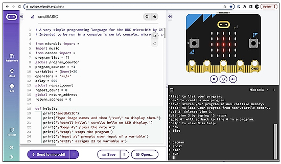](https://mastodon.social/@blogmywiki/109930302287902652)

smolBASIC is an experimental simple first text-based language for physical computing, written in MicroPython to run on the BBC micro:bit - [Handbook (PDF)](https://github.com/blogmywiki/smolBASIC/blob/main/smolBASIC%20handbook%201-3.pdf) via [Mastodon](https://mastodon.social/@blogmywiki/109930302287902652).

## Play Infinite Versions of AI-Generated Pong on the Go

[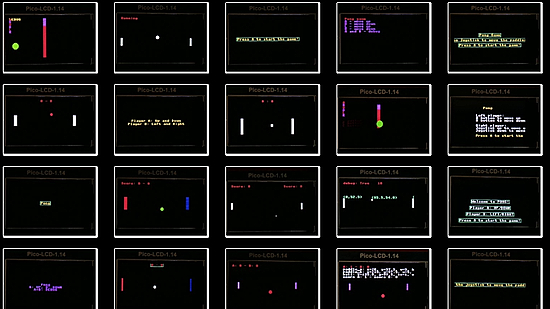](https://hackaday.com/2023/02/21/let-machine-learning-code-an-infinite-variety-of-pong-games/)

Play Infinite Versions of AI-Generated Pong on the Go - a Raspberry Pi Pico W handheld writes its own games in MicroPython - [IEEE Spectrum](https://spectrum.ieee.org/infinite-pong-with-ai), via [Hackaday](https://hackaday.com/2023/02/21/let-machine-learning-code-an-infinite-variety-of-pong-games/).

## A Clock That Changes Time When You Look At It

[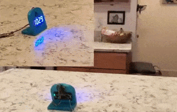](https://twitter.com/gvy_dvpont/status/1627877417044918272)

Guy Dupont posts on Twitter - [Twitter Thread](https://twitter.com/gvy_dvpont/status/1627877417044918272).

>  "I made a clock that always* shows the wrong time when it detects someone looking at it. \*It's right twice a day  
Using an Adafruit QT-Py ESP32-S2 (running CircuitPython) and 7-segment LED backpack. Using the Person Sensor for face detection. No soldering!

## Playing GIFs in CircuitPython

Mark Komus has been developing GIF image playback on CircuitPython displays, coming to CircuitPython 8.1.0 beta. Best on lower resolution displays and faster microcontrollers due to the high data transfer requirements - [Adafruit Blog](https://blog.adafruit.com/2023/02/22/animated-gif-support-is-now-merged-into-the-latest-nightly-build-of-circuitpython/).

And Michael Lacock has developed SPI Display GIG Maker, a very simple GIF generator used to generate GIFs that can run in gifio on CircuitPython (currently 8.1.0 Beta) - [GitHub](https://github.com/MichaelLacock/Gif_Maker/tree/main/Gif_Maker).

## This Week's Python Streams

Python on Hardware is all about building a cooperative ecosphere which allows contributions to be valued and to grow knowledge. Below are the streams within the last week focusing on the community.

### CircuitPython Deep Dive Stream

[This week](https://www.youtube.com/watch?v=fMhHIMAYjDw), Tim streamed work on Trying Raspberry Pi Sudo-less NeoPixels and LED Animation.

You can see the latest video and past videos on the Adafruit YouTube channel under the Deep Dive playlist - [YouTube](https://www.youtube.com/playlist?list=PLjF7R1fz_OOXBHlu9msoXq2jQN4JpCk8A).

### CircuitPython Parsec

John Park’s CircuitPython Parsec this week is on Unpacking Tuples - [Adafruit Blog](https://blog.adafruit.com/2023/02/24/john-parks-circuitpython-parsec-unpacking-tuples-adafruit-circuitpython/) and [YouTube](https://youtu.be/KXaCdETbGA4).

Catch all the episodes in the [YouTube playlist](https://www.youtube.com/playlist?list=PLjF7R1fz_OOWFqZfqW9jlvQSIUmwn9lWr).

## Project of the Week: A Valentine's Card with a Surprise

A special Valentine's card made with an Adafruit Trinket M0 + NeoPixels, lasercut on a Glowforge laser cutter with a 3D printed case. It’s also rechargeable - [Twitter Thread](https://twitter.com/chardane/status/1627750727451017217).

> We’ve been enjoying the pink plum blossom trees around our neighborhood and I wanted to capture the blooms in this card. The real blooms only last for a couple weeks, but this card can bloom forever.

## News from around the web!

[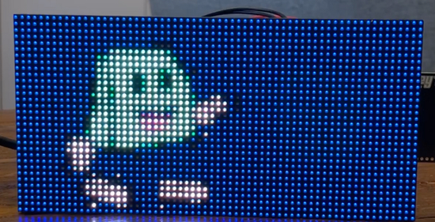](https://gnuf.dev/pixel-y-panel-project-spritesheets-for-animation/)

A Pixel-y Panel Project: Using CircuitPython Spritesheets for Animation - [Gnuf on Code](https://gnuf.dev/pixel-y-panel-project-spritesheets-for-animation/).

Create a robot that can tweet and post to Instagram using Python - [YouTube](https://www.youtube.com/watch?v=OJAPQOc1RV0) via [Twitter](https://twitter.com/kevsmac/status/1630131257798475777).

[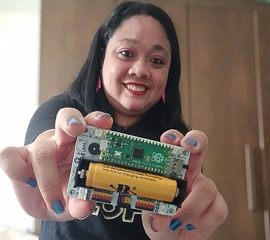](https://twitter.com/elecfreaks/status/1630153210370625537)

Showing the Wukong2040 breakout board for Raspberry Pi Pico and CircuitPython compatible - [Twitter](https://twitter.com/elecfreaks/status/1630153210370625537) and [ELECFREAKS](https://shop.elecfreaks.com/products/elecfreaks-wukong2040-expansion-board-adapter-for-raspberry-pi-pico?_pos=3&_psq=wukong&_ss=e&_v=1.0).

[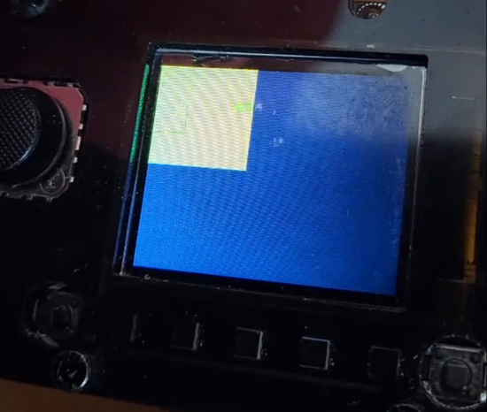](url)

An AMG8833 thermal camera (8x8 pixels) on an Adafruit PyGamer, using CircuitPython with the amg88xx library - [Twitter](https://twitter.com/Kongduino/status/1628312332517662721?t=GE1FsvsUUtZJ_ZuBsK3Ghg&s=03).
 
 > I display 8x8 squares for each pixel. The code is very simple, thanks to the library and CircuitPython displayio TileGrid. I'm using a 100-colour palette, from blue to red.

[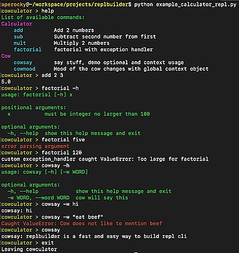](https://github.com/Aperocky/replbuilder)

ReplBuilder: quickly build a REPL command line interface prompt in Python - [GitHub](https://github.com/Aperocky/replbuilder).

[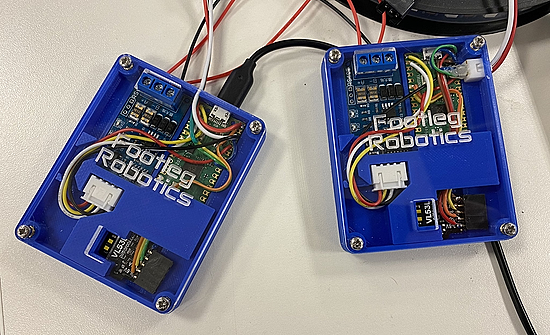](https://twitter.com/anne_engineer/status/1628213358355677186?t=67YBoF7FLrGXs950D7nxOA&s=03)

> Dual player LED Flinger hardware complete! Code is coming together too. I think I’ve got the communication timings pretty good now. We have plans to make this an installation in Cambridgeshire Makespace. It uses CircuitPython 8.0 at both ends - [Twitter Thread](https://twitter.com/anne_engineer/status/1628213358355677186?t=67YBoF7FLrGXs950D7nxOA&s=03).

[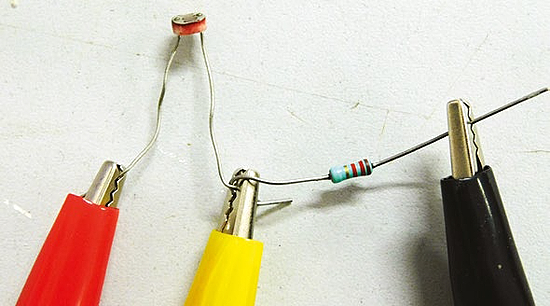](https://blog.adafruit.com/2023/02/21/fast-analogue-input-with-raspberry-pi-pico-hackspace-magazine-issue-64-raspberrypipico-pico-circuitpython-hackspacemag/)

Fast analogue input with Raspberry Pi Pico and CircuitPython – HackSpace Magazine Issue 64 - [Adafruit Bog](https://blog.adafruit.com/2023/02/21/fast-analogue-input-with-raspberry-pi-pico-hackspace-magazine-issue-64-raspberrypipico-pico-circuitpython-hackspacemag/).

Pico:ed by Elecfreaks is a micro:bit-like board with a large LED matrix display and runs CiricuitPython - [Twitter Thread](https://twitter.com/Kongduino/status/1629386438264635394).

Programming a Badger 2040W E-Ink display menu system in MicroPython - [Blog](http://www.penguintutor.com/programming/eink-menu) and [YouTube](https://www.youtube.com/watch?v=JDs0Ta2tDrs).

[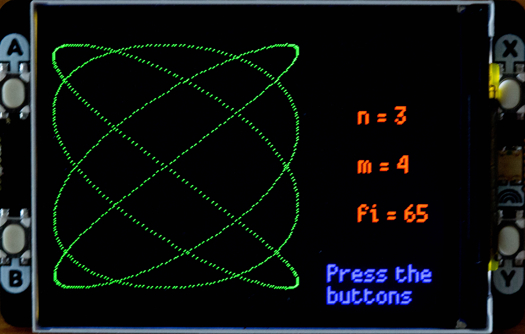](https://www.instructables.com/Lissajous-Curve/)

Lissajous Curves with MicroPython on 320x240 pixel display with Pi Pico - [Instructables](https://www.instructables.com/Lissajous-Curve/) and [YouTube](https://www.youtube.com/watch?v=6cVF5D7NoTo).

[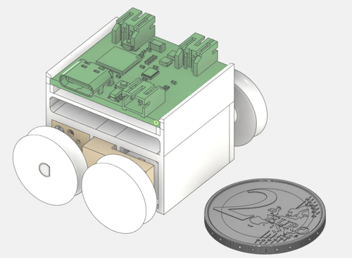](https://blog.adafruit.com/2023/02/23/the-making-of-a-pretty-small-robot-robotics-micropython-esp32/)

The making of a Pretty Small Robot with ESP32 and MicroPython - [Adafruit Blog](https://blog.adafruit.com/2023/02/23/the-making-of-a-pretty-small-robot-robotics-micropython-esp32/), [Post](https://www.wattnotions.com/pretty-small-robot/) and [GitHub](https://github.com/wattnotions/PrettySmallRobot).

Issue 114 of Keyboard Builders' Digest is out, a wrap-up of cool DIY keyboard projects. Lots of open-source split, ortho and other boards - [KBD](https://twitter.com/KbdNews/status/1629120512885391362).

Traffic Light Controller with Raspberry Pi Pico & MicroPython - [How to Electronics](https://how2electronics.com/traffic-light-controller-with-raspberry-pi-pico-micropython/).

All about USB-C: Replying Low-level Power Delivery - [Hackaday](https://hackaday.com/2023/02/22/all-about-usb-c-replying-low-level-pd/).

Weather Machine: an all-new universal API adapter for the world’s best weather forecasts, available for everyone - [Hello Weather](https://helloweather.com/blog/introducing-weather-machine).

text - [site](url).

[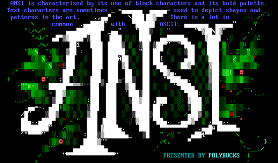](http://polyducks.co.uk/what-is-textmode/)

What is Textmode Art? - [Polyducks](http://polyducks.co.uk/what-is-textmode/).

PyDev of the Week: Roni Kobrosly on [Mouse vs Python](https://www.blog.pythonlibrary.org/2023/02/27/pydev-of-the-week-roni-kobrosly/)

CircuitPython Weekly Meeting for February 21, 2023 ([notes](https://github.com/adafruit/adafruit-circuitpython-weekly-meeting/blob/main/2023/2023-02-21.md)) [on YouTube](https://youtu.be/qUmMJYkIrJk)
CircuitPython Weekly Meeting for Feburary 27, 2023 ([notes]()) [on YouTube]()

**#ICYDNCI What was the most popular, most clicked link, in [last week's newsletter](https://link)? [title](url).**

## New

[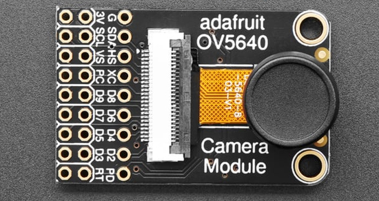](https://blog.adafruit.com/2023/02/22/new-guide-adafruit-ov5640-camera-breakout/)

Adafruit OV5640 Camera Breakout. This Adafruit OV5640 Camera Breakout with 120 Degree Lens has a nice quality OV5640 camera with a 5 Megapixel sensor element, 120-degree wide angle lens - [Adafruit Blog](https://blog.adafruit.com/2023/02/22/new-guide-adafruit-ov5640-camera-breakout/).

[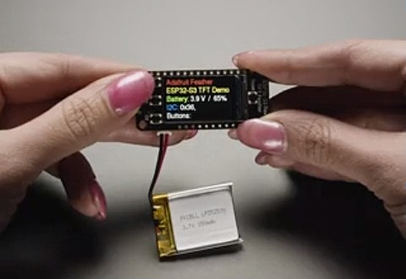](https://www.adafruit.com/product/5691)

Adafruit ESP32-S3 Reverse TFT Feather - similar to the new ESP32-S2 reverse TFT but featuring the ESP32-S3 - [Adafruit](https://www.adafruit.com/product/5691).

## New Boards Supported by CircuitPython

The number of supported microcontrollers and Single Board Computers (SBC) grows every week. This section outlines which boards have been included in CircuitPython or added to [CircuitPython.org](https://circuitpython.org/).

This week, there was one new board added:

- [BrainBoardz Neuron](https://circuitpython.org/board/brainboardz_neuron/)

*Note: For non-Adafruit boards, please use the support forums of the board manufacturer for assistance, as Adafruit does not have the hardware to assist in troubleshooting.*

Looking to add a new board to CircuitPython? It's highly encouraged! Adafruit has four guides to help you do so:

- [How to Add a New Board to CircuitPython](https://learn.adafruit.com/how-to-add-a-new-board-to-circuitpython/overview)
- [How to add a New Board to the circuitpython.org website](https://learn.adafruit.com/how-to-add-a-new-board-to-the-circuitpython-org-website)
- [Adding a Single Board Computer to PlatformDetect for Blinka](https://learn.adafruit.com/adding-a-single-board-computer-to-platformdetect-for-blinka)
- [Adding a Single Board Computer to Blinka](https://learn.adafruit.com/adding-a-single-board-computer-to-blinka)

## New Learn Guides!

[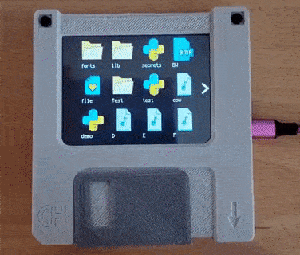](https://learn.adafruit.com/guides/latest)

[A Floppy Thumb Drive with a Color File Icon Display](https://learn.adafruit.com/a-floppy-thumb-drive-with-a-color-file-icon-displayhttps://learn.adafruit.com/a-floppy-thumb-drive-with-a-color-file-icon-display) from [Anne Barela](https://learn.adafruit.com/u/AnneBarela)

## CircuitPython Libraries!

CircuitPython support for hardware continues to grow. We are adding support for new sensors and breakouts all the time, as well as improving on the drivers we already have. As we add more libraries and update current ones, you can keep up with all the changes right here!

For the latest libraries, download the [Adafruit CircuitPython Library Bundle](https://circuitpython.org/libraries). For the latest community contributed libraries, download the [CircuitPython Community Bundle](https://github.com/adafruit/CircuitPython_Community_Bundle/releases).

If you'd like to contribute, CircuitPython libraries are a great place to start. Have an idea for a new driver? File an issue on [CircuitPython](https://github.com/adafruit/circuitpython/issues)! Have you written a library you'd like to make available? Submit it to the [CircuitPython Community Bundle](https://github.com/adafruit/CircuitPython_Community_Bundle). Interested in helping with current libraries? Check out the [CircuitPython.org Contributing page](https://circuitpython.org/contributing). We've included open pull requests and issues from the libraries, and details about repo-level issues that need to be addressed. We have a guide on [contributing to CircuitPython with Git and GitHub](https://learn.adafruit.com/contribute-to-circuitpython-with-git-and-github) if you need help getting started. You can also find us in the #circuitpython channels on the [Adafruit Discord](https://adafru.it/discord).

You can check out this [list of all the Adafruit CircuitPython libraries and drivers available](https://github.com/adafruit/Adafruit_CircuitPython_Bundle/blob/master/circuitpython_library_list.md). 

The current number of CircuitPython libraries is **###**!

**New Libraries!**

Here's this week's new CircuitPython libraries:

* [library](url)

**Updated Libraries!**

Here's this week's updated CircuitPython libraries:

* [library](url)

**Library Statistics**

## What’s the team up to this week?

What is the team up to this week? Let’s check in!

**Dan**

I released CircuitPython 8.0.3 on Thursday, February 23. This fixes some problems that have been present for a long time in the 8.0.0-beta line, and a few new fixes. We encountered some more things to fix and there will be an 8.0.4 before long.

8.1.0 is getting closer, but we needed to get some space back on smaller builds before merging everything in.

I am writing a Learn Guide about safe mode, including how the new safemode.py feature works.

**Melissa**

This past week I finished up making a Pull Request for the CircuitPython installer, which is currently in the process of being merged. I worked mostly on stability and user interface improvements. Once it is live, it will likely have some bugs that were caught yet, but it should improve over time.

**Tim**

This week I tested some more PRs for the MiniMQTT library and the Wiznet ethernet library. Over in the core I tested the new support for animated GIFs and finished up handling some feedback for the displayio module argument validation that I started prior. I've also been experimenting to learn how the ColorConverter class works together with Bitmap and how they differ in functionality compared to Palette. Once I've got my head wrapped around it I'd like to add to the displayio learn guide a section that explains what it can do and how to use it.

**Jeff**

The guide I was wrapping up last week has now been published, showing how to use the OV5640 camera breakout with CircuitPython.

Besides that I also helped mop up a bug that affected non-blocking SSL connections on the Raspberry Pi Pico W, including mqtt. Big thanks to community member Dave Putz who wrote an initial version of the fix, and to everyone who helped with info about the issue.

**Scott**

This week I've wrapped up PWMOut fixes on the iMX RT and continued working on the Bangle.js 2 PR. Since it was opened, the amount of free space in the main branch has gone down. This meant that the new changes no longer fit. So, I'm implementing a suggestion of Jeff's to free up some more space. (Thanks Jeff!)

I've also been reading up SWO and TRACE from the iMX RT as a way to analyze the effectiveness of our cache and memory layout. I'll be adding a performance testing page to my upcoming CP implementer's guide.

**Liz**

This week I worked on some new product documentation. The 2.13" eInk display breakout now has an EYESPI connector, so I [added a page to the guide detailing how to use it](https://learn.adafruit.com/adafruit-2-13-eink-display-breakouts-and-featherwings/eyespi). This is the first eInk display in the shop with the new EYESPI connector. I also updated the [LCD Backpack guide](https://learn.adafruit.com/i2c-spi-lcd-backpack) for the new STEMMA version. 

## Upcoming events!

Unlock the Power of MicroPython on an Arduino: Join a Live Webinar March 9, 2023 - [Elector](https://elektor.clickmeeting.com/arduino-micropython-webinar-with-sebastian-romero/register).

A Munich RISC-V Meetup, one day after the doors of Embedded World close. RISC-V enthusiasts will get together in Munich, Bavaria - [RISCV.org](https://riscv.org/event/munich-risc-v-meetup/).

The next MicroPython Meetup in Melbourne will be on March 22nd – [Meetup](https://www.meetup.com/MicroPython-Meetup/). 

Hackaday Berlin 2023 has been scheduled for Saturday, March 25 - [Adafruit Blog](https://blog.adafruit.com/2023/02/08/hackaday-berlin-2023/) and [announcement](https://hackaday.com/2023/02/07/come-join-us-for-hackaday-berlin/).

PyCon US 2023 will be April 19-17, 2023, again in Salt Lake City, Utah USA - [PyCon US 2023](https://us.pycon.org/2023/).

**Send Your Events In**

If you know of virtual events or upcoming events, please let us know via email to cpnews(at)adafruit(dot)com.

## Latest releases

CircuitPython's stable release is [8.0.3](https://github.com/adafruit/circuitpython/releases/latest) and its unstable release is [8.1.0beta0](https://github.com/adafruit/circuitpython/releases). New to CircuitPython? Start with our [Welcome to CircuitPython Guide](https://learn.adafruit.com/welcome-to-circuitpython).

[20230227](https://github.com/adafruit/Adafruit_CircuitPython_Bundle/releases/latest) is the latest CircuitPython library bundle.

[v1.9.1](https://micropython.org/download) is the latest MicroPython release. Documentation for it is [here](http://docs.micropython.org/en/latest/pyboard/).

[3.11.2](https://www.python.org/downloads/) is the latest Python release. The latest pre-release version is [3.12.0a5](https://www.python.org/download/pre-releases/).

[3,415 Stars](https://github.com/adafruit/circuitpython/stargazers) Like CircuitPython? [Star it on GitHub!](https://github.com/adafruit/circuitpython)

## Call for help -- Translating CircuitPython is now easier than ever!

[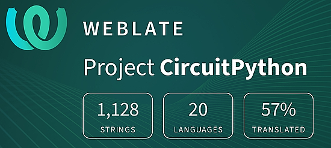](https://hosted.weblate.org/engage/circuitpython/)

One important feature of CircuitPython is translated control and error messages. With the help of fellow open source project [Weblate](https://weblate.org/), we're making it even easier to add or improve translations. 

Sign in with an existing account such as GitHub, Google or Facebook and start contributing through a simple web interface. No forks or pull requests needed! As always, if you run into trouble join us on [Discord](https://adafru.it/discord), we're here to help.

## jobs.adafruit.com - Find a dream job, find great candidates!

[jobs.adafruit.com](https://jobs.adafruit.com/) has returned and folks are posting their skills (including CircuitPython) and companies are looking for talented makers to join their companies - from Digi-Key, to Hackaday, Micro Center, Raspberry Pi and more.

## 36,830 thanks!

The Adafruit Discord community, where we do all our CircuitPython development in the open, reached over 36,830 humans - thank you!  Adafruit believes Discord offers a unique way for Python on hardware folks to connect. Join today at [https://adafru.it/discord](https://adafru.it/discord).

## ICYMI - In case you missed it

Python on hardware is the Adafruit Python video-newsletter-podcast! The news comes from the Python community, Discord, Adafruit communities and more and is broadcast on ASK an ENGINEER Wednesdays. The complete Python on Hardware weekly videocast [playlist is here](https://www.youtube.com/playlist?list=PLjF7R1fz_OOXRMjM7Sm0J2Xt6H81TdDev). The video podcast is on [iTunes](https://itunes.apple.com/us/podcast/python-on-hardware/id1451685192?mt=2), [YouTube](http://adafru.it/pohepisodes), [IGTV (Instagram TV](https://www.instagram.com/adafruit/channel/)), and [XML](https://itunes.apple.com/us/podcast/python-on-hardware/id1451685192?mt=2).

[The weekly community chat on Adafruit Discord server CircuitPython channel - Audio / Podcast edition](https://itunes.apple.com/us/podcast/circuitpython-weekly-meeting/id1451685016) - Audio from the Discord chat space for CircuitPython, meetings are usually Mondays at 2pm ET, this is the audio version on [iTunes](https://itunes.apple.com/us/podcast/circuitpython-weekly-meeting/id1451685016), Pocket Casts, [Spotify](https://adafru.it/spotify), and [XML feed](https://adafruit-podcasts.s3.amazonaws.com/circuitpython_weekly_meeting/audio-podcast.xml).

## Codecademy "Learn Hardware Programming with CircuitPython"

Codecademy, an online interactive learning platform used by more than 45 million people, has teamed up with Adafruit to create a coding course, “Learn Hardware Programming with CircuitPython”. The course is now available in the [Codecademy catalog](https://www.codecademy.com/learn/learn-circuitpython?utm_source=adafruit&utm_medium=partners&utm_campaign=circuitplayground&utm_content=pythononhardwarenewsletter).

## Contribute!

The CircuitPython Weekly Newsletter is a CircuitPython community-run newsletter emailed every Tuesday. The complete [archives are here](https://www.adafruitdaily.com/category/circuitpython/). It highlights the latest CircuitPython related news from around the web including Python and MicroPython developments. To contribute, edit next week's draft [on GitHub](https://github.com/adafruit/circuitpython-weekly-newsletter/tree/gh-pages/_drafts) and [submit a pull request](https://help.github.com/articles/editing-files-in-your-repository/) with the changes. You may also tag your information on Twitter with #CircuitPython. 

Join the Adafruit [Discord](https://adafru.it/discord) or [post to the forum](https://forums.adafruit.com/viewforum.php?f=60) if you have questions.
