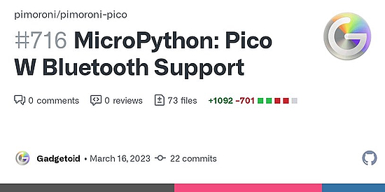
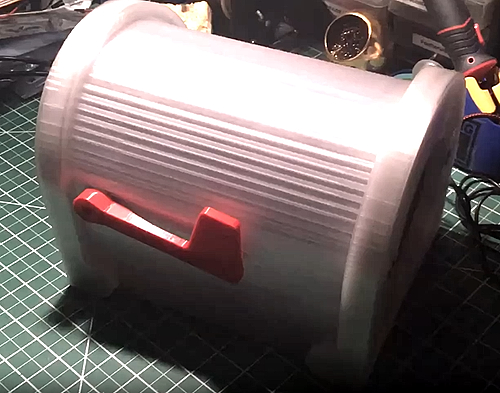
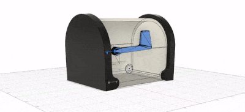
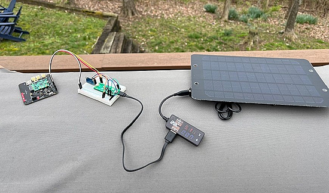
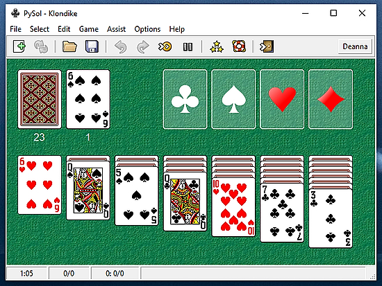
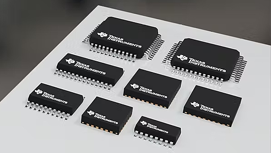
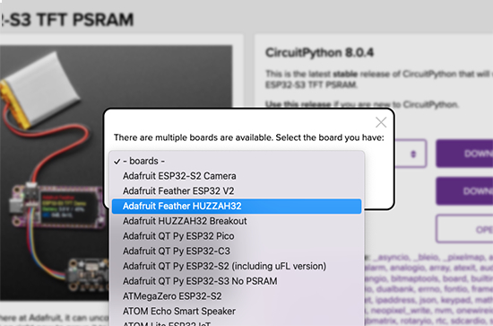
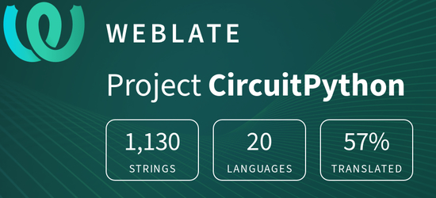

- [ ] Kattni updates
- [ ] change date
- [ ] update title
- [ ] Feature story
- [ ] Update  for images
- [ ] Update ICYDNCI
- [ ] All images 550w max only
- [ ] Link "View this email in your browser."

News Sources

- [python.org](https://www.python.org/)
- [Python Insider - dev team blog](https://pythoninsider.blogspot.com/)
- [MicroPython Meetup Blog](https://melbournemicropythonmeetup.github.io/)
- [hackaday.io newest projects MicroPython](https://hackaday.io/projects?tag=micropython&sort=date) and [CircuitPython](https://hackaday.io/projects?tag=circuitpython&sort=date)
- [hackaday CircuitPython](https://hackaday.com/blog/?s=circuitpython) and [MicroPython](https://hackaday.com/blog/?s=micropython)
- [hackster.io CircuitPython](https://www.hackster.io/search?q=circuitpython&i=projects&sort_by=most_recent) and [MicroPython](https://www.hackster.io/search?q=micropython&i=projects&sort_by=most_recent)
- [https://opensource.com/tags/python](https://opensource.com/tags/python)
- [Mastodon CircuitPython](https://octodon.social/tags/CircuitPython)

View this email in your browser. **Warning: Flashing Imagery**

Welcome to the latest Python on Microcontrollers newsletter!  - *Ed.*

We're on [Discord](https://discord.gg/HYqvREz), [Twitter](https://twitter.com/search?q=circuitpython&src=typed_query&f=live), and for past newsletters - [view them all here](https://www.adafruitdaily.com/category/circuitpython/). If you're reading this on the web, [subscribe here](https://www.adafruitdaily.com/). Here's the news this week:

## MicroPython Support for the Raspberry Pi Pico W Has Started

Phil Howard at Pimoroni is working to complete a GitHub Pull Request for Raspberry Pi Pico W Bluetooth support to MicroPython. It's labeled as experimental at the moment. 

Phil notes 'Bluetooth works, you’ll want Adafruit’s “Bluefruit Connect” and the MicroPython “ble_simple_peripheral.py” and “ble_advertising.py” from [here](https://github.com/micropython/micropython/tree/master/examples/bluetooth)' if you experimentally want to kick the tires - [Twitter](https://twitter.com/Gadgetoid/status/1636442647144349697?t=NaTi1xaK-je6BgIqtejP6g&s=03) and [GitHub](https://github.com/pimoroni/pimoroni-pico/pull/716).

## CircuitPython 8.0.4 Released

CircuitPython 8.0.4 is the latest bugfix revision of CircuitPython and is a new stable release. - [Adafruit Blog](https://blog.adafruit.com/2023/03/14/circuitpython-8-0-4-released/) and [GitHub Release Notes](https://github.com/adafruit/circuitpython/releases/tag/8.0.4).

**Changes since 8.0.3**

FIXES AND ENHANCEMENTS

* Fix printing of “soft reboot” message

PORT AND BOARD-SPECIFIC CHANGES

*Espressif*

* Prevent recursive calls during websocket background processing
* Set socket to non-blocking more carefully

*Known issues*

* ESP32-S3 has significant issues with I2C devices that sleep or use clock stretching. Retry operations on these devices as necessary, or use ESP32-S2 boards.
* Espressif boards have ESP-IDF storage leaks and occasionally crash after extended WiFi use.
* See https://github.com/adafruit/circuitpython/issues for other issues, including issues still to be addressed for:
**8.1.0
**8.x.x
**long term

## Python-based compiler achieves orders-of-magnitude speedups

A Python-based compiler achieves orders-of-magnitude speedups. Codon compiles Python code to run more efficiently and effectively while allowing for customization and adaptation to various domains. Codon is currently publicly available on [GitHub](https://github.com/exaloop/codon) - [MIT News](https://news.mit.edu/2023/codon-python-based-compiler-achieve-orders-magnitude-speedups-0314).

## Feature

text - [site](url).

## Feature

text - [site](url).

## CircuitPythonista Charlyn Gonda Interviewed on Embedded.fm

Embedded..fm spoke with CircuitPythonista Charlyn Gonda about making things glow, dealing with imposter syndrome, and using origami. Charlyn’s website is [charlyn.codes](https://charlyn.codes/), the projects talked about are documented there. You can find her on Instagram ([@chardane](https://www.instagram.com/chardane/)) and [Mastodon](https://leds.social/@charlyn). [Adafruit](https://www.adafruit.com/) came up a lot in this episode - [embedded.fm](https://embedded.fm/episodes/445).

## This Week's Python Streams

Python on Hardware is all about building a cooperative ecosphere which allows contributions to be valued and to grow knowledge. Below are the streams within the last week focusing on the community.

### CircuitPython Deep Dive Stream

[This week](link), Tim streamed work on {subject}.

You can see the latest video and past videos on the Adafruit YouTube channel under the Deep Dive playlist - [YouTube](https://www.youtube.com/playlist?list=PLjF7R1fz_OOXBHlu9msoXq2jQN4JpCk8A).

### CircuitPython Parsec

John Park’s CircuitPython Parsec this week is on {subject} - [Adafruit Blog](link) and [YouTube](link).

Catch all the episodes in the [YouTube playlist](https://www.youtube.com/playlist?list=PLjF7R1fz_OOWFqZfqW9jlvQSIUmwn9lWr).

## Project of the Week: The LoRa Mail Boombox

The LoRa Mail Boombox is a snailmail box notifier using two Adafruit LoRa transceivers, a distance sensor, sound, lights, and a servo - [GitHub](https://github.com/DJDevon3/My_Circuit_Python_Projects/tree/main/Multi-Board%20Projects/LORA%20Mail%20Boombox).

## News from around the web!

> I had way too much fun making today's MVP Buzz reminder. It's brought to you on Adafruit PyPortal Titano using CircuitPython written in VS Code. You've got less than 144 hours (or 6 days!!!) to enter your contributions! Be kind to yourself (and your CPM) & enter them now - [Twitter](https://twitter.com/betsyweber/status/1635806774224666625).

text - [site](url).

text - [site](url).

text - [site](url).

Using a Blues Wireless cellular card and note carrier to send accelerometer data from a Raspberry Pi Pico programmed in MicroPython powered by a 5V/6W solar panel - [Twitter](https://twitter.com/paltman/status/1635689517133836294?t=eArkIv-3C5hUKXmfJ7YINg&s=03).

Command Line Interface Guidelines: an open-source guide to help you write better command-line programs, taking traditional principles and updating them for the modern day - [clig.dev](https://clig.dev/).

PySol Fan Club Edition - a Python Solitaire Game Collection of 1,200 programs - [Sourceforge](https://pysolfc.sourceforge.io/) via [Twitter](https://twitter.com/GeekOnTheLoose/status/1636344121966174210).

text - [site](url).

text - [site](url).

text - [site](url).

text - [site](url).

text - [site](url).

text - [site](url).

text - [site](url).

text - [site](url).

text - [site](url).

text - [site](url).

text - [site](url).

PyDev of the Week: NAME on [Mouse vs Python]()

CircuitPython Weekly Meeting for DATE ([notes]()) [on YouTube]()

#ICYDNCI What was the most popular, most clicked link, in [last week's newsletter](https://www.adafruitdaily.com/2023/03/14/python-on-microcontrollers-newsletter-pi-day-github-2fa-and-much-more-circuitpython-python-micropython-thepsf-raspberry_pi/)? [Gaming Console on a Stick to Feature Dual Raspberry Pi Chips](https://www.tomshardware.com/news/pimoroni-stick-pi-gaming-console).

## Coming Soon

There will be a sneak peek at the Kitronik's new coded gamer, the ZIP96 for Raspeberry Pi Pico only at Bett UK '23 from 29-31 March at the London ExCel Centre, stand NQ39 - [Twitter](https://twitter.com/Kitronik/status/1636303961115222017?t=-TxZTQOhbfLfumGXuOcqgw&s=03).

Texas Instruments releasing an Arm Cortex-M0+ for just $0.39, with its MSPM0L and MSPM0G. TI is hoping its latest Arm Cortex-M0+ microcontrollers will find broad use - [hackster.io](https://www.hackster.io/news/texas-instruments-puts-an-arm-cortex-m0-in-your-project-for-just-0-39-with-its-mspm0l-and-mspm0g-50b4bd23d5e5).

## New Boards Supported by CircuitPython

The number of supported microcontrollers and Single Board Computers (SBC) grows every week. This section outlines which boards have been included in CircuitPython or added to [CircuitPython.org](https://circuitpython.org/).

This week, there were (#/no) new boards added!

- [Board name](url)
- [Board name](url)
- [Board name](url)

*Note: For non-Adafruit boards, please use the support forums of the board manufacturer for assistance, as Adafruit does not have the hardware to assist in troubleshooting.*

Looking to add a new board to CircuitPython? It's highly encouraged! Adafruit has four guides to help you do so:

- [How to Add a New Board to CircuitPython](https://learn.adafruit.com/how-to-add-a-new-board-to-circuitpython/overview)
- [How to add a New Board to the circuitpython.org website](https://learn.adafruit.com/how-to-add-a-new-board-to-the-circuitpython-org-website)
- [Adding a Single Board Computer to PlatformDetect for Blinka](https://learn.adafruit.com/adding-a-single-board-computer-to-platformdetect-for-blinka)
- [Adding a Single Board Computer to Blinka](https://learn.adafruit.com/adding-a-single-board-computer-to-blinka)

## New Learn Guides!

[Star Fragment IoT Lamp](https://learn.adafruit.com/star-fragment-iot-lamp) from [Noe Ruiz](https://learn.adafruit.com/u/pixil3d)

[Mini Weather Station ESP32-S2 TFT](https://learn.adafruit.com/mini-weather-station-esp32-s2-tft) from [Trevor Beaton](https://learn.adafruit.com/u/Seekwill)

## CircuitPython Libraries!

CircuitPython support for hardware continues to grow. We are adding support for new sensors and breakouts all the time, as well as improving on the drivers we already have. As we add more libraries and update current ones, you can keep up with all the changes right here!

For the latest libraries, download the [Adafruit CircuitPython Library Bundle](https://circuitpython.org/libraries). For the latest community contributed libraries, download the [CircuitPython Community Bundle](https://github.com/adafruit/CircuitPython_Community_Bundle/releases).

If you'd like to contribute, CircuitPython libraries are a great place to start. Have an idea for a new driver? File an issue on [CircuitPython](https://github.com/adafruit/circuitpython/issues)! Have you written a library you'd like to make available? Submit it to the [CircuitPython Community Bundle](https://github.com/adafruit/CircuitPython_Community_Bundle). Interested in helping with current libraries? Check out the [CircuitPython.org Contributing page](https://circuitpython.org/contributing). We've included open pull requests and issues from the libraries, and details about repo-level issues that need to be addressed. We have a guide on [contributing to CircuitPython with Git and GitHub](https://learn.adafruit.com/contribute-to-circuitpython-with-git-and-github) if you need help getting started. You can also find us in the #circuitpython channels on the [Adafruit Discord](https://adafru.it/discord).

You can check out this [list of all the Adafruit CircuitPython libraries and drivers available](https://github.com/adafruit/Adafruit_CircuitPython_Bundle/blob/master/circuitpython_library_list.md). 

The current number of CircuitPython libraries is **413**!

**New Libraries!**

Here's this week's new CircuitPython libraries:

  * [adafruit/Adafruit_CircuitPython_GFX](https://github.com/adafruit/Adafruit_CircuitPython_GFX)
  * [furbrain/CircuitPython_distox](https://github.com/furbrain/CircuitPython_distox)
  * [jposada202020/CircuitPython_gauge](https://github.com/jposada202020/CircuitPython_gauge)
  * [bablokb/circuitpython-pcf85063a](https://github.com/bablokb/circuitpython-pcf85063a)

**Updated Libraries!**

Here's this week's updated CircuitPython libraries:

  * [adafruit/Adafruit_CircuitPython_Display_Text](https://github.com/adafruit/Adafruit_CircuitPython_Display_Text)
  * [adafruit/Adafruit_CircuitPython_PN532](https://github.com/adafruit/Adafruit_CircuitPython_PN532)
  * [adafruit/Adafruit_CircuitPython_TM](https://github.com/adafruit/Adafruit_CircuitPython_TM)
  * [jposada202020/CircuitPython_uplot](https://github.com/jposada202020/CircuitPython_uplot)

**Library PyPI Weekly Download Statistics**
* **Total Library Stats**
  * 132657 PyPI downloads over 309 libraries
* **Top 10 Libraries by PyPI Downloads**
  * Adafruit CircuitPython BusDevice (adafruit-circuitpython-busdevice): 10065
  * Adafruit CircuitPython Requests (adafruit-circuitpython-requests): 9461
  * Adafruit CircuitPython Register (adafruit-circuitpython-register): 1952
  * Adafruit CircuitPython Display Text (adafruit-circuitpython-display-text): 1850
  * Adafruit CircuitPython NeoPixel (adafruit-circuitpython-neopixel): 1815
  * Adafruit CircuitPython MiniMQTT (adafruit-circuitpython-minimqtt): 1245
  * Adafruit CircuitPython Motor (adafruit-circuitpython-motor): 1219
  * Adafruit CircuitPython BLE (adafruit-circuitpython-ble): 1030
  * Adafruit CircuitPython ADS1x15 (adafruit-circuitpython-ads1x15): 1026
  * Adafruit CircuitPython DHT (adafruit-circuitpython-dht): 1005

## What’s the team up to this week?

What is the team up to this week? Let’s check in!

**Dan**

text - [site](url).

**Kattni**

text - [site](url).

**Melissa**

text - [site](url).

**Tim**

text - [site](url).

**Jeff**

text - [site](url).

**Scott**

text - [site](url).

**Liz**

text - [site](url).

## Upcoming events!

The next MicroPython Meetup in Melbourne will be on March 22nd – [Meetup](https://www.meetup.com/MicroPython-Meetup/). 

Hackaday Berlin 2023 is scheduled for Saturday, March 25 - [Adafruit Blog](https://blog.adafruit.com/2023/02/08/hackaday-berlin-2023/) and [announcement](https://hackaday.com/2023/02/07/come-join-us-for-hackaday-berlin/).

PyCon US 2023 will be April 19-17, 2023, again in Salt Lake City, Utah USA - [PyCon US 2023](https://us.pycon.org/2023/).

EuroPython 2023 will be July 17-23, 2023, in Prague, Czech Republic and Remote - [EuroPython 2023](https://ep2023.europython.eu/).

**Send Your Events In**

If you know of virtual events or upcoming events, please let us know via email to cpnews(at)adafruit(dot)com.

## Latest releases

CircuitPython's stable release is [#.#.#](https://github.com/adafruit/circuitpython/releases/latest) and its unstable release is [#.#.#-##.#](https://github.com/adafruit/circuitpython/releases). New to CircuitPython? Start with our [Welcome to CircuitPython Guide](https://learn.adafruit.com/welcome-to-circuitpython).

[2023####](https://github.com/adafruit/Adafruit_CircuitPython_Bundle/releases/latest) is the latest CircuitPython library bundle.

[v#.#.#](https://micropython.org/download) is the latest MicroPython release. Documentation for it is [here](http://docs.micropython.org/en/latest/pyboard/).

[#.#.#](https://www.python.org/downloads/) is the latest Python release. The latest pre-release version is [#.#.#](https://www.python.org/download/pre-releases/).

[#,### Stars](https://github.com/adafruit/circuitpython/stargazers) Like CircuitPython? [Star it on GitHub!](https://github.com/adafruit/circuitpython)

## Call for help -- Translating CircuitPython is now easier than ever!

One important feature of CircuitPython is translated control and error messages. With the help of fellow open source project [Weblate](https://weblate.org/), we're making it even easier to add or improve translations. 

Sign in with an existing account such as GitHub, Google or Facebook and start contributing through a simple web interface. No forks or pull requests needed! As always, if you run into trouble join us on [Discord](https://adafru.it/discord), we're here to help.

## NUMBER thanks!

The Adafruit Discord community, where we do all our CircuitPython development in the open, reached over NUMBER humans - thank you!  Adafruit believes Discord offers a unique way for Python on hardware folks to connect. Join today at [https://adafru.it/discord](https://adafru.it/discord).

## ICYMI - In case you missed it

Python on hardware is the Adafruit Python video-newsletter-podcast! The news comes from the Python community, Discord, Adafruit communities and more and is broadcast on ASK an ENGINEER Wednesdays. The complete Python on Hardware weekly videocast [playlist is here](https://www.youtube.com/playlist?list=PLjF7R1fz_OOXRMjM7Sm0J2Xt6H81TdDev). The video podcast is on [iTunes](https://itunes.apple.com/us/podcast/python-on-hardware/id1451685192?mt=2), [YouTube](http://adafru.it/pohepisodes), [IGTV (Instagram TV](https://www.instagram.com/adafruit/channel/)), and [XML](https://itunes.apple.com/us/podcast/python-on-hardware/id1451685192?mt=2).

[The weekly community chat on Adafruit Discord server CircuitPython channel - Audio / Podcast edition](https://itunes.apple.com/us/podcast/circuitpython-weekly-meeting/id1451685016) - Audio from the Discord chat space for CircuitPython, meetings are usually Mondays at 2pm ET, this is the audio version on [iTunes](https://itunes.apple.com/us/podcast/circuitpython-weekly-meeting/id1451685016), Pocket Casts, [Spotify](https://adafru.it/spotify), and [XML feed](https://adafruit-podcasts.s3.amazonaws.com/circuitpython_weekly_meeting/audio-podcast.xml).

## Codecademy "Learn Hardware Programming with CircuitPython"

Codecademy, an online interactive learning platform used by more than 45 million people, has teamed up with Adafruit to create a coding course, “Learn Hardware Programming with CircuitPython”. The course is now available in the [Codecademy catalog](https://www.codecademy.com/learn/learn-circuitpython?utm_source=adafruit&utm_medium=partners&utm_campaign=circuitplayground&utm_content=pythononhardwarenewsletter).

## Contribute!

The CircuitPython Weekly Newsletter is a CircuitPython community-run newsletter emailed every Tuesday. The complete [archives are here](https://www.adafruitdaily.com/category/circuitpython/). It highlights the latest CircuitPython related news from around the web including Python and MicroPython developments. To contribute, edit next week's draft [on GitHub](https://github.com/adafruit/circuitpython-weekly-newsletter/tree/gh-pages/_drafts) and [submit a pull request](https://help.github.com/articles/editing-files-in-your-repository/) with the changes. You may also tag your information on Twitter with #CircuitPython. 

Join the Adafruit [Discord](https://adafru.it/discord) or [post to the forum](https://forums.adafruit.com/viewforum.php?f=60) if you have questions.
