View this email in your browser. **Warning: Flashing Imagery**

Welcome to the latest Python on Microcontrollers newsletter! More exciting news this week! Damien George discusses MicroPython R1.20 and more via video. CircuitPython releases versions 8.0.5 and 8.1.0-beta.1 with animated GIF support and much more. PyBricks, MicroPython on Lego, is rising in popularity. Interesting times modding kids toys to actually function. And a plethora of creative projects coming from makers worldwide. I hope you enjoy the issue and if you haven't subscribed yet, please do so to show your support - *Ed.*

We're on [Discord](https://discord.gg/HYqvREz), [Twitter](https://twitter.com/search?q=circuitpython&src=typed_query&f=live), and for past newsletters - [view them all here](https://www.adafruitdaily.com/category/circuitpython/). If you're reading this on the web, [subscribe here](https://www.adafruitdaily.com/). Here's the news this week:

## Two New Versions of CircuitPython Released

There were two releases of CircuitPython at the end of last week: one to the stable version (8.0.5) and one to the latest beta version (8.1.0-beta.1):

The stable version of the 8.0 branch was updated to fix known bugs - [8.0.5](https://blog.adafruit.com/2023/03/30/circuitpython-8-0-5-released/) and [release notes](https://github.com/adafruit/circuitpython/releases/tag/8.0.5).

The latest beta version fixes bugs for the proposed version 8.1.0 and adds some nice new capabilities - [8.1.0-beta.1](https://blog.adafruit.com/2023/03/30/circuitpython-8-1-0-beta-1-released/) and [release notes](https://github.com/adafruit/circuitpython/releases/tag/8.1.0-beta.1).

**Notable changes to 8.1.0 since 8.0.0**
* Add animated GIF support: `gifio.OnDiskGif`.
* Add `safemode.py`, for programmatic handling of safe mode.
* Add 7-color e-ink display support.
* Allow setting pystack size in `settings.toml`.
* Add dither support to `Palette`.
* Support `array.extend(iterable)`.
* Add `bitmaptools.drawpolygon()`.
* Add ESP-NOW support on Espressif.

## Sneak Peek on MicroPython R1.20

[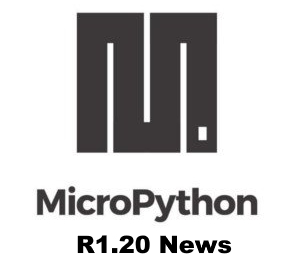](https://www.youtube.com/watch?v=fH33D6ER7ls)

Damien George, creator of MicroPython, gives an update on the pre-release of MicroPython version R1.20 and a demonstration of Bluetooth Low Energy (BLE) on the Raspberry Pi Pico W with MicroPython in this video from the March MicroPython monthly meeting in Melbourne, Australia - [YouTube](https://www.youtube.com/watch?v=fH33D6ER7ls).

## PyBricks: MicroPython on LEGO Controllers Gaining Is Popularity

More projects are appearing using [PyBricks](https://code.pybricks.com/), a version of MicroPython which runs on Lego Mindstorm Hubs.

[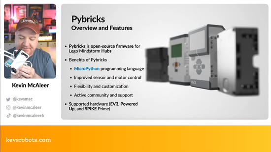](https://www.youtube.com/watch?v=YVVaeoEigOY)

Kevin McAleer presents Exploring Pybricks: LEGO Mindstorms Evolved - [YouTube](https://www.youtube.com/watch?v=YVVaeoEigOY).

[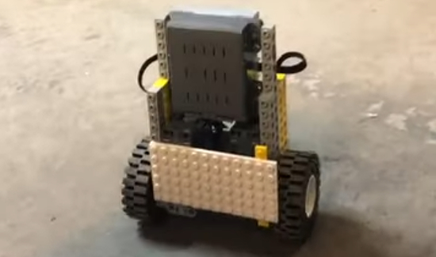](https://www.youtube.com/shorts/nrrJdpS897U)

A simple two-wheeled, self-balancing robot controller with a Wii Nunchuk...all running MicroPython! "Hacked together - very quickly! - during the evening of the March Melbourne MicroPython Meetup" - [YouTube](https://www.youtube.com/shorts/nrrJdpS897U) via [Twitter](https://twitter.com/matt_trentini/status/1642512118892331008?t=L14GMR8LGiMFYawYJSnsiw&s=03).

[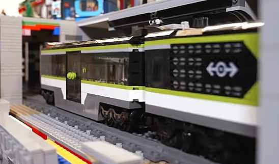](https://www.youtube.com/watch?v=Jmh4NLxJ_8c)

Using PyBricks to automate a LEGO train to automatically stop at stations via a color sensor - [YouTube](https://www.youtube.com/watch?v=Jmh4NLxJ_8c).

[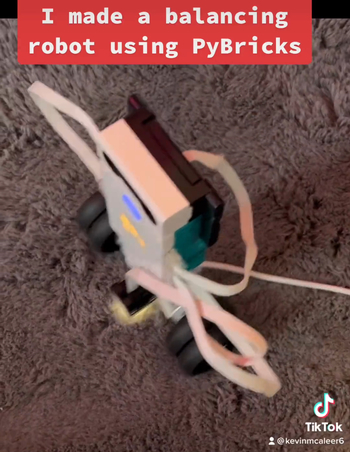](https://twitter.com/kevsmac/status/1641826150971240449)

Another self balancing wheel robot using LEGO and Pybricks - [Twitter](https://twitter.com/kevsmac/status/1641826150971240449).

[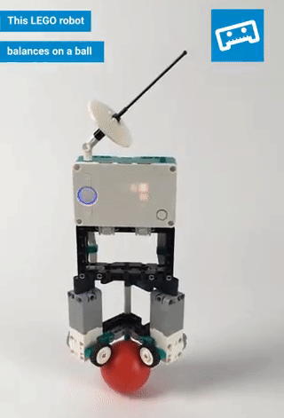](https://twitter.com/laurensvalk/status/1571921631257448448)

A self-balancing robot using a ball and PyBricks - [Twitter](https://twitter.com/laurensvalk/status/1571921631257448448).

## New ARM Assembly Book

[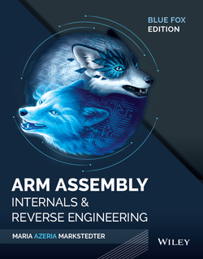](https://arm-assembly.com/)

Releasing May 9th worldwide, the ARM Assembly Book is written by renound ARM assembly prohrammer/hacker Maria "Azeria" Marksteder who has written and spoken extensively on both coding and reverse engineering ARM code - [Website](https://arm-assembly.com/).

## Modding a Fisher-Price Toy Into a Functional Game Controller

[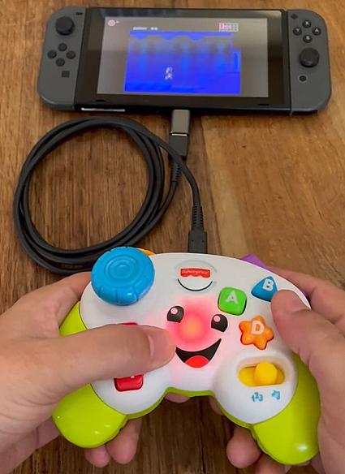](https://twitter.com/RobertDaleSmith/status/1640501061226987520)

The Fisher-Price Game & Learn is a sensory toy in the shape of a game controller. Like many folks (including [those inside Adafruit](https://blog.adafruit.com/2023/01/28/we-take-apart-the-baby-einstein-take-along-tunes-musical-toy-babyeinstein-takeapart-adafruit/)), Robert Dale Smith has opened the toy to insert an [Adafruit KB2040 controller](https://www.adafruit.com/product/5302) and [firmware](https://twitter.com/RobertDaleSmith/status/1640514016635150337) to make it into a functional USB controller for PC and Consoles - [Twitter Demo](https://twitter.com/RobertDaleSmith/status/1640501061226987520).

## Using the Upcoming Adafruit Feather RP2040 with DVI to Visualize MIDI Music

[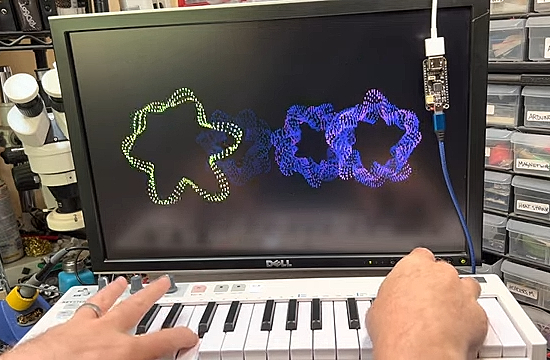](https://www.youtube.com/watch?v=yEY8iRZ_L4E)

Tod Kurt had been testing the upcoming [Adafruit Feather RP2040 with DVI board](https://www.adafruit.com/product/5710). This project provides visualization of MIDI notes. The ability to output video using a microcontroller provides new opportunities.. At present it is in Arduino, use with CircuitPython is being planned  - [YouTube](https://www.youtube.com/watch?v=yEY8iRZ_L4E).

## This Week's Python Streams

Python on Hardware is all about building a cooperative ecosphere which allows contributions to be valued and to grow knowledge. Below are the streams within the last week focusing on the community.

### CircuitPython Deep Dive Stream

[This week](https://www.youtube.com/watch?v=kvs4ODHyD9s), Tim streamed work on PR Reviews and Testing.

You can see the latest video and past videos on the Adafruit YouTube channel under the Deep Dive playlist - [YouTube](https://www.youtube.com/playlist?list=PLjF7R1fz_OOXBHlu9msoXq2jQN4JpCk8A).

### CircuitPython Parsec

John Park is off but you can catch all the episodes in the [YouTube playlist](https://www.youtube.com/playlist?list=PLjF7R1fz_OOWFqZfqW9jlvQSIUmwn9lWr).

### The CircuitPython Show

The CircuitPython Show podcast hosted by Paul Cutler will be returning on Monday April 10th. He'll be talking to authors, board designers, developers, and more over the course of season three – [CircuitPythonShow](https://circuitpythonshow.com/) and [Twitter](https://twitter.com/circuitpyshow).

The next episode features Danny Staple, author of the new book [Robotics at Home with Raspberry Pi Pico](https://www.amazon.com/Robotics-Home-Raspberry-Pico-Autonomous/dp/1803246073/) – [Show List](https://circuitpythonshow.com/episodes/all).

## Project of the Week: EuroPi Modules

[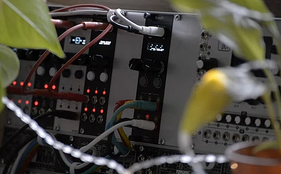](https://github.com/Allen-Synthesis/EuroPi)

Version 0.8.1 of the EuroPi Eurorack sound module has been released with 24 community based scripts available. EuroPi is flexible in what its controls may do, programmable in MicroPython - [GitHub Project](https://github.com/Allen-Synthesis/EuroPi), [YouTube](https://www.youtube.com/watch?v=3j1jOV8COIo), and [Website](https://www.allensynthesis.co.uk/modules/europi.html).

## News from around the web!

Umbrella bling with a Raspberry Pi Pico and Adafruit CircuitPython - [Twitter](https://twitter.com/DoomHammerNG/status/1641108295787184128).

[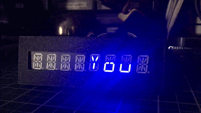](https://hackaday.social/@TreasureDev/110102693691865564)

A 14-Segment 8 character display project hooked into a Steam wishlist API. It uses an Adafruit Feather ESP32-S2 coded in CircuitPython - [Mastodon](https://hackaday.social/@TreasureDev/110102693691865564).

An Atari game written in MicroPython on a Pimoroni Tufty2040 badge - [Twitter](https://twitter.com/Aurunemaru/status/1640892323058819073).

[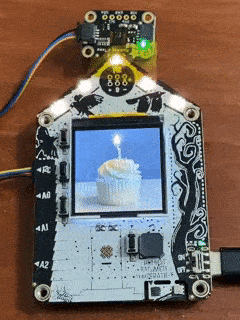](https://twitter.com/MarkKomus/status/1641449203166777345)

A virtual candle that plays happy birthday and detects when you blow it out using an Adafruit Funhouse and CircuitPython - [Twitter](https://twitter.com/MarkKomus/status/1641449203166777345) and [GitHub](https://github.com/gamblor21/FunCandle).

[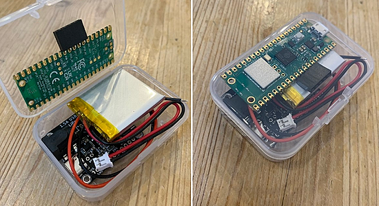](https://twitter.com/PaterPracticus/status/1640641813005344770)

A Watering monitor with Raspberry Pi Pico W, LiPo battery charging and MicroPython - [Twitter](https://twitter.com/PaterPracticus/status/1640641813005344770).

[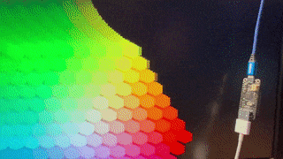](https://mastodon.social/@todbot/110108347067558154)

Testing the Adafruit Feather DVI/HDMI and it’s very cool! An RP2040 with an Arduino library by PaintYourDragon - [Mastodon](https://mastodon.social/@todbot/110108347067558154).

[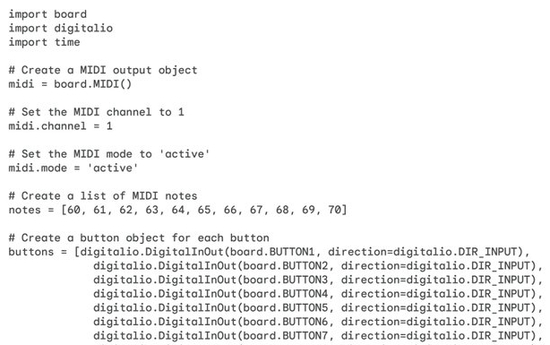](https://twitter.com/ben_everard/status/1640647232193019906?t=e6coBqUnuRNPlEd14o25-A&s=03)

Ben Everard looks to have the Google Bard AI write CircuitPython MIDI code with very mixed results - [Twitter](https://twitter.com/ben_everard/status/1640647232193019906?t=e6coBqUnuRNPlEd14o25-A&s=03).

How to Build a Cheap Vibration Generator for Physics Experiments using a Raspberry Pi Pico W - [YouTube](https://www.youtube.com/watch?v=vqJnNsngvJQ), [GitHub](https://github.com/gurgleapps/pico-wave-vibration-generator) and [Project](https://gurgleapps.com/learn/projects/how-to-build-a-cheap-vibration-generator-for-physics-experiments).

[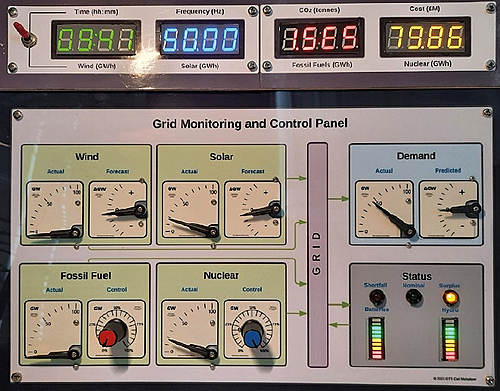](https://blog.adafruit.com/2023/03/31/project-greening-the-spark-hackspace-magazine-issue-65-raspberrypi-piday-hackspacemag-raspberry_pi/)

Greening the Spark is a model of a system for electricity generation, distribution, storage, and consumption using Raspberry Pi 4 and Python - [HackSpace Magazine via the Adafruit Blog](https://blog.adafruit.com/2023/03/31/project-greening-the-spark-hackspace-magazine-issue-65-raspberrypi-piday-hackspacemag-raspberry_pi/).

[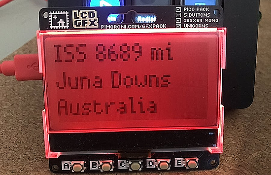](https://twitter.com/simon_prickett/status/1641492162494836737)

A multi function display that has a clock, ISS tracker and game with the Pimoroni LCD GFX for Raspberry Pi Pico W. The backlight changes color the closer the ISS is. Programmed in MicroPython - [Twitter](https://twitter.com/simon_prickett/status/1641492162494836737) and [GitHub](https://github.com/simonprickett/pico-gfx-portal).

[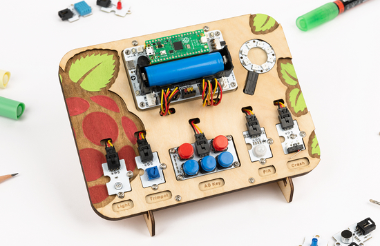](https://www.elecfreaks.com/blog/post/create-one-api-with-circuitpython-and-wukong-2040-breakout-board.html)

Create one API with CircuitPython, Raspberry Pi Pico and a Wukong 2040 Breakout Board  - [Elecfreaks](https://www.elecfreaks.com/blog/post/create-one-api-with-circuitpython-and-wukong-2040-breakout-board.html).

[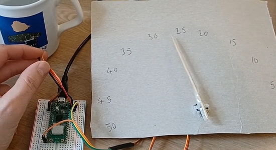](https://twitter.com/JohnChinner/status/1641825688087920641)

An analogue temperature gauge using digital hardware. It uses a BME280 sensor, a Raspberry Pi Pico W, a couple lines of MicroPython and a servo - [Twitter](https://twitter.com/JohnChinner/status/1641825688087920641).

[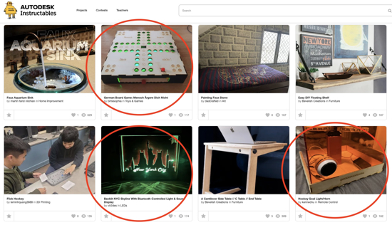](https://twitter.com/gallaugher/status/1641879436399362048)

Student CircuitPython projects from the Boston College Physical Computing course "Make Art" challenge getting featured by Instructables - [Twitter](https://twitter.com/gallaugher/status/1641879436399362048).

Pico Web Server: Control Your Raspberry Pi Pico Projects from Any Device coded in MicroPython - [YouTube](https://www.youtube.com/watch?v=Kz3PUONGTkU) and [Article](https://gurgleapps.com/learn/projects/micropython-web-server-control-raspberry-pi-pico-projects).

OpenRAM is an open-source Python framework to create the layout, netlists, timing and power models, placement and routing models, and other views necessary to use SRAMs in ASIC design - [GitHub](https://github.com/VLSIDA/OpenRAM).

A list of AI tools for data scientists - [Twitter](https://twitter.com/mdancho84/status/1641434492207263744).

PyDev of the Week: Eduardo Blancas on [Mouse vs Python](https://www.blog.pythonlibrary.org/2023/04/03/pydev-of-the-week-eduardo-blancas/)

CircuitPython Weekly Meeting for DATE ([notes](https://github.com/adafruit/adafruit-circuitpython-weekly-meeting/blob/main/2023/2023-04-03.md)) [on YouTube](https://youtu.be/MTlDazUr8rQ)

#ICYDNCI What was the most popular, most clicked link, in [last week's newsletter](https://www.adafruitdaily.com/2023/03/28/python-on-microcontrollers-newsletter-micropython-pico-w-bluetooth-circuitpython-8-0-4-and-much-more-circuitpython-python-micropython-thepsf-raspberry_pi-2/)? [Comparing hobby PCB vendors](https://lcamtuf.substack.com/p/comparing-hobby-pcb-vendors).

## Coming Soon

[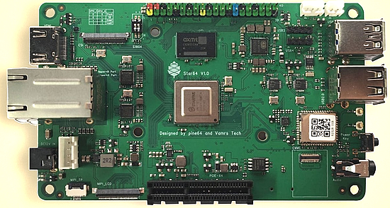](https://www.omglinux.com/star64-is-a-risc-v-single-board-pc/)

$70 RISC-V Computer from Pine64 Goes on Sale April 4 - [OMG! Linux](https://www.omglinux.com/star64-is-a-risc-v-single-board-pc/).

[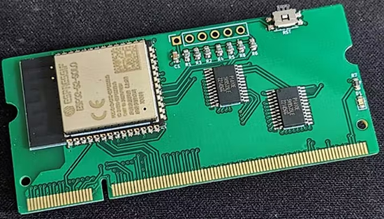](https://www.hackster.io/news/open-things-wants-to-replace-your-raspberry-pi-compute-module-3-with-an-openthing-1-esp-cm3-9395f09fe184)

Open Things Wants to Replace Your Raspberry Pi Compute Module 3 with an Openthing 1 ESP-CM3. Designed to drop in to existing Raspberry Pi CM3 carrier board designs, this ESP32-S3-powered module is a low-cost alternative which can run MicroPython - [hackster.io](https://www.hackster.io/news/open-things-wants-to-replace-your-raspberry-pi-compute-module-3-with-an-openthing-1-esp-cm3-9395f09fe184).

[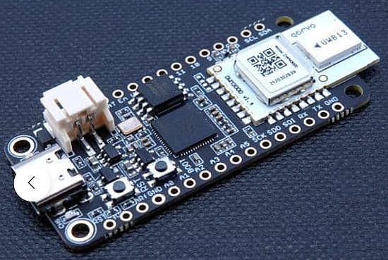](https://ilabs.se/product/challenger-rp2040-uwb/)

The Challenger RP2040 UWB is an Arduino/Circuitpython compatible Adafruit Feather format microcontroller board based on the Raspberry Pico (RP2040) chip equipped with a DWM3000 module - [Invector Labs](https://ilabs.se/product/challenger-rp2040-uwb/) via [Twitter](https://twitter.com/Invector_Labs/status/1642872273597087745).

## New Boards Supported by CircuitPython

The number of supported microcontrollers and Single Board Computers (SBC) grows every week. This section outlines which boards have been included in CircuitPython or added to [CircuitPython.org](https://circuitpython.org/).

This week, there were seven new boards added!

- [Deneyap Mini v2](https://circuitpython.org/board/deneyap_mini_v2/)
- [Deneyap Mini](https://circuitpython.org/board/deneyap_mini/)
- [Deneyap Kart G](https://circuitpython.org/board/deneyap_kart_g/)
- [Deneyap Kart 1A v2](https://circuitpython.org/board/deneyap_kart_1a_v2/)
- [Deneyap Kart 1A](https://circuitpython.org/board/deneyap_kart_1a/)
- [Deneyap Kart](https://circuitpython.org/board/deneyap_kart/)
- [Feather RP2040 with DVI Output Port](https://circuitpython.org/board/adafruit_feather_rp2040_dvi/)

*Note: For non-Adafruit boards, please use the support forums of the board manufacturer for assistance, as Adafruit does not have the hardware to assist in troubleshooting.*

Looking to add a new board to CircuitPython? It's highly encouraged! Adafruit has four guides to help you do so:

- [How to Add a New Board to CircuitPython](https://learn.adafruit.com/how-to-add-a-new-board-to-circuitpython/overview)
- [How to add a New Board to the circuitpython.org website](https://learn.adafruit.com/how-to-add-a-new-board-to-the-circuitpython-org-website)
- [Adding a Single Board Computer to PlatformDetect for Blinka](https://learn.adafruit.com/adding-a-single-board-computer-to-platformdetect-for-blinka)
- [Adding a Single Board Computer to Blinka](https://learn.adafruit.com/adding-a-single-board-computer-to-blinka)

## New Learn Guides!

[Hexpad](https://learn.adafruit.com/hexpad) from [John Park](https://learn.adafruit.com/u/johnpark)

[Generating Text with ChatGPT, Pico W & CircuitPython](https://learn.adafruit.com/generating-text-with-chatgpt-pico-w-circuitpython) from [Jeff Epler](https://learn.adafruit.com/u/jepler)

[Adafruit CAN Pal](https://learn.adafruit.com/adafruit-can-pal) from [Liz Clark](https://learn.adafruit.com/u/BlitzCityDIY)

[Adafruit CAN Bus FeatherWing](https://learn.adafruit.com/adafruit-can-bus-featherwing) from [Liz Clark](https://learn.adafruit.com/u/BlitzCityDIY)

## CircuitPython Libraries!

CircuitPython support for hardware continues to grow. We are adding support for new sensors and breakouts all the time, as well as improving on the drivers we already have. As we add more libraries and update current ones, you can keep up with all the changes right here!

For the latest libraries, download the [Adafruit CircuitPython Library Bundle](https://circuitpython.org/libraries). For the latest community contributed libraries, download the [CircuitPython Community Bundle](https://github.com/adafruit/CircuitPython_Community_Bundle/releases).

If you'd like to contribute, CircuitPython libraries are a great place to start. Have an idea for a new driver? File an issue on [CircuitPython](https://github.com/adafruit/circuitpython/issues)! Have you written a library you'd like to make available? Submit it to the [CircuitPython Community Bundle](https://github.com/adafruit/CircuitPython_Community_Bundle). Interested in helping with current libraries? Check out the [CircuitPython.org Contributing page](https://circuitpython.org/contributing). We've included open pull requests and issues from the libraries, and details about repo-level issues that need to be addressed. We have a guide on [contributing to CircuitPython with Git and GitHub](https://learn.adafruit.com/contribute-to-circuitpython-with-git-and-github) if you need help getting started. You can also find us in the #circuitpython channels on the [Adafruit Discord](https://adafru.it/discord).

You can check out this [list of all the Adafruit CircuitPython libraries and drivers available](https://github.com/adafruit/Adafruit_CircuitPython_Bundle/blob/master/circuitpython_library_list.md). 

The current number of CircuitPython libraries is **414**!

**Updated Libraries!**

Here's this week's updated CircuitPython libraries:
  * [adafruit/Adafruit_CircuitPython_Display_Text](https://github.com/adafruit/Adafruit_CircuitPython_Display_Text)
  * [adafruit/Adafruit_CircuitPython_BusDevice](https://github.com/adafruit/Adafruit_CircuitPython_BusDevice)
  * [adafruit/Adafruit_CircuitPython_SD](https://github.com/adafruit/Adafruit_CircuitPython_SD)
  * [adafruit/Adafruit_CircuitPython_Pastebin](https://github.com/adafruit/Adafruit_CircuitPython_Pastebin)
  * [CedarGroveStudios/CircuitPython_AD9833](https://github.com/CedarGroveStudios/CircuitPython_AD9833)

**Library Weekly PyPI Download Statistics**
* **Total Library Stats**
  * 49757 PyPI downloads over 309 libraries
* **Top 10 Libraries by PyPI Downloads**
  * Adafruit CircuitPython BusDevice (adafruit-circuitpython-busdevice): 6743
  * Adafruit CircuitPython Requests (adafruit-circuitpython-requests): 5614
  * Adafruit CircuitPython Register (adafruit-circuitpython-register): 1925
  * Adafruit CircuitPython NeoPixel (adafruit-circuitpython-neopixel): 1326
  * Adafruit CircuitPython Motor (adafruit-circuitpython-motor): 799
  * Adafruit CircuitPython ServoKit (adafruit-circuitpython-servokit): 698
  * Adafruit CircuitPython PCA9685 (adafruit-circuitpython-pca9685): 694
  * Adafruit CircuitPython ADS1x15 (adafruit-circuitpython-ads1x15): 655
  * Adafruit CircuitPython framebuf (adafruit-circuitpython-framebuf): 512
  * Adafruit CircuitPython Pixelbuf (adafruit-circuitpython-pixelbuf): 493

## What’s the CircuitPython team up to this week?

What is the team up to this week? Let’s check in!

**Dan**

I made releases of both CircuitPython 8.0.5 and 8.1.0-beta.1 on March 30. 8.0.5 contains one bug fix, courtesy of Jeff: editing settings.toml could have caused a restart loop. 8.1.0-beta.1 contains many enhancements and fixes. There are only 11 issues left for 8.1.0.

This week I added a fix, included in beta.1, that handles "raw HID" reports from the host properly. Raw HID is sometimes used for simple custom data transfer between a host and a USB device.

**Kattni**

This week I finished up the Adafruit Feather RP2040 DVI guide, as well as the Adafruit Feather RP2040 RFM69 and RFM95 guides. All of these, if they are not already out, will definitely be out soon. Keep an eye out if you're interested! 

I added the Adafruit Feather RP2040 RFM board definition to CircuitPython which is necessary to use any microcontroller board with CircuitPython. It was nice to step into the core again, if only for a bit.

I will soon be documenting a few projects I've been working on including a grow light using Adafruit DotStars, and a time lapse photography project using the Raspberry Pi HQ Camera. There will be guides for both. I'll keep everyone posted here on the progress.

**Melissa**

This past week, I have been working on writing a guide for the ChatGPT Robotic Bear that I mentioned last week. It should be published soon, so look for it under [New Guides on the Adafruit Learn System](https://learn.adafruit.com/guides/latest). This guide required a lot of photos because the modification steps were a bit more intricate than previous guides I have worked on.

**Tim**

This week I've been working on testing and capturing network traffic logs related to some proposed changes in the ethernet library. I also looked into an issue with the docs pages that were resulting in some of the interactive capabilities not working properly when viewed on docs.circuitpython.org and submitted a fix that restored the functionality.

It was an eventful week!

I published a new guide, "Generating Text with ChatGPT, Pico W & CircuitPython", that shows how to generate text using OpenAI's API and stream the results to an OLED display, all using the Raspberry Pi Pico W.

I fixed some bugs in CircuitPython, including a vexing one that could leave your board in a hard-to-rescue state if you created a large settings.toml file.

And last but not least, I implemented PWMAudioOut for the Metro M7 (and presumably other mimxrt10xx based boards), and fixed a bug affecting both I2SOut and PWMAudioOut on the Metro M7 that caused the audio sample rate to not be honored in all cases, causing audio to be played out of tune and too fast.

**Liz**

This week I worked on two product guides for CAN Bus: the [CAN Bus FeatherWing](https://learn.adafruit.com/adafruit-can-bus-featherwing) and the [CAN Pal](https://learn.adafruit.com/adafruit-can-pal). The FeatherWing has an MCP2515 so you can use it with a Feather dev board that does not have a native CAN peripheral. The CAN Pal works with boards that have a native CAN peripheral. I had never worked with CAN Bus before, so it was fun to learn something new with both of these guides.

## Upcoming events!

PyCon US 2023 will be April 19-27, 2023, again in Salt Lake City, Utah USA - [PyCon US 2023](https://us.pycon.org/2023/).

*note: previous newsletters had incorrectly listes "19-17 April" - we regret the error.*

The next MicroPython Meetup in Melbourne will be on April 26th – [Meetup](https://www.meetup.com/MicroPython-Meetup/). From the March meeting: [News video](https://www.youtube.com/watch?v=DyRCR5ALp38) and [slides](https://docs.google.com/presentation/d/e/2PACX-1vRS0SJE0zdLK0jolkyyO2bYPGd5x9dxop8SWe6vMNsNLfb9qxEVeSrYcBYpI_gmf6sxnWkdEtNR-IQ_/pub?slide=id.p).

EuroPython 2023 will be July 17-23, 2023, in Prague, Czech Republic and Remote - [EuroPython 2023](https://ep2023.europython.eu/).

**Send Your Events In**

If you know of virtual events or upcoming events, please let us know via email to cpnews(at)adafruit(dot)com.

## Latest releases

CircuitPython's stable release is [8.0.5](https://github.com/adafruit/circuitpython/releases/latest) and its unstable release is [8.1.0-beta.1](https://github.com/adafruit/circuitpython/releases). New to CircuitPython? Start with our [Welcome to CircuitPython Guide](https://learn.adafruit.com/welcome-to-circuitpython).

[20230403](https://github.com/adafruit/Adafruit_CircuitPython_Bundle/releases/latest) is the latest CircuitPython library bundle.

[v1.19.1](https://micropython.org/download) is the latest MicroPython release. Documentation for it is [here](http://docs.micropython.org/en/latest/pyboard/).

[3.11.2](https://www.python.org/downloads/) is the latest Python release. The latest pre-release version is [3.12.0a6](https://www.python.org/download/pre-releases/).

[3,472 Stars](https://github.com/adafruit/circuitpython/stargazers) Like CircuitPython? [Star it on GitHub!](https://github.com/adafruit/circuitpython)

## Call for help -- Translating CircuitPython is now easier than ever!

[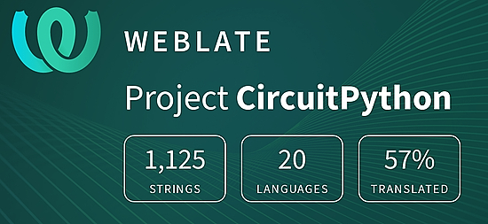](https://hosted.weblate.org/engage/circuitpython/)

One important feature of CircuitPython is translated control and error messages. With the help of fellow open source project [Weblate](https://weblate.org/), we're making it even easier to add or improve translations. 

Sign in with an existing account such as GitHub, Google or Facebook and start contributing through a simple web interface. No forks or pull requests needed! As always, if you run into trouble join us on [Discord](https://adafru.it/discord), we're here to help.

## jobs.adafruit.com - Find a dream job, find great candidates!

[jobs.adafruit.com](https://jobs.adafruit.com/) has returned and folks are posting their skills (including CircuitPython) and companies are looking for talented makers to join their companies - from Digi-Key, to Hackaday, Micro Center, Raspberry Pi and more.

**Job of the Week**

text - [Adafruit Jobs Board](https://jobs.adafruit.com/).

## NUMBER thanks!

The Adafruit Discord community, where we do all our CircuitPython development in the open, reached over NUMBER humans - thank you!  Adafruit believes Discord offers a unique way for Python on hardware folks to connect. Join today at [https://adafru.it/discord](https://adafru.it/discord).

## ICYMI - In case you missed it

Python on hardware is the Adafruit Python video-newsletter-podcast! The news comes from the Python community, Discord, Adafruit communities and more and is broadcast on ASK an ENGINEER Wednesdays. The complete Python on Hardware weekly videocast [playlist is here](https://www.youtube.com/playlist?list=PLjF7R1fz_OOXRMjM7Sm0J2Xt6H81TdDev). The video podcast is on [iTunes](https://itunes.apple.com/us/podcast/python-on-hardware/id1451685192?mt=2), [YouTube](http://adafru.it/pohepisodes), [IGTV (Instagram TV](https://www.instagram.com/adafruit/channel/)), and [XML](https://itunes.apple.com/us/podcast/python-on-hardware/id1451685192?mt=2).

[The weekly community chat on Adafruit Discord server CircuitPython channel - Audio / Podcast edition](https://itunes.apple.com/us/podcast/circuitpython-weekly-meeting/id1451685016) - Audio from the Discord chat space for CircuitPython, meetings are usually Mondays at 2pm ET, this is the audio version on [iTunes](https://itunes.apple.com/us/podcast/circuitpython-weekly-meeting/id1451685016), Pocket Casts, [Spotify](https://adafru.it/spotify), and [XML feed](https://adafruit-podcasts.s3.amazonaws.com/circuitpython_weekly_meeting/audio-podcast.xml).

## Codecademy "Learn Hardware Programming with CircuitPython"

Codecademy, an online interactive learning platform used by more than 45 million people, has teamed up with Adafruit to create a coding course, “Learn Hardware Programming with CircuitPython”. The course is now available in the [Codecademy catalog](https://www.codecademy.com/learn/learn-circuitpython?utm_source=adafruit&utm_medium=partners&utm_campaign=circuitplayground&utm_content=pythononhardwarenewsletter).

## Contribute!

The CircuitPython Weekly Newsletter is a CircuitPython community-run newsletter emailed every Tuesday. The complete [archives are here](https://www.adafruitdaily.com/category/circuitpython/). It highlights the latest CircuitPython related news from around the web including Python and MicroPython developments. To contribute, edit next week's draft [on GitHub](https://github.com/adafruit/circuitpython-weekly-newsletter/tree/gh-pages/_drafts) and [submit a pull request](https://help.github.com/articles/editing-files-in-your-repository/) with the changes. You may also tag your information on Twitter with #CircuitPython. 

Join the Adafruit [Discord](https://adafru.it/discord) or [post to the forum](https://forums.adafruit.com/viewforum.php?f=60) if you have questions.
