- [X] Kattni updates
- [ ] change date
- [ ] update title
- [ ] Feature story
- [ ] Update  for images
- [ ] Update ICYDNCI
- [ ] All images 550w max only
- [ ] Link "View this email in your browser."

News Sources

- [python.org](https://www.python.org/)
- [Python Insider - dev team blog](https://pythoninsider.blogspot.com/)
- [MicroPython Meetup Blog](https://melbournemicropythonmeetup.github.io/)
- [hackaday.io newest projects MicroPython](https://hackaday.io/projects?tag=micropython&sort=date) and [CircuitPython](https://hackaday.io/projects?tag=circuitpython&sort=date)
- [hackaday CircuitPython](https://hackaday.com/blog/?s=circuitpython) and [MicroPython](https://hackaday.com/blog/?s=micropython)
- [hackster.io CircuitPython](https://www.hackster.io/search?q=circuitpython&i=projects&sort_by=most_recent) and [MicroPython](https://www.hackster.io/search?q=micropython&i=projects&sort_by=most_recent)
- [https://opensource.com/tags/python](https://opensource.com/tags/python)
- [Mastodon CircuitPython](https://octodon.social/tags/CircuitPython)

View this email in your browser. **Warning: Flashing Imagery**

Welcome to the latest Python on Microcontrollers newsletter!  - *Ed.*

We're on [Discord](https://discord.gg/HYqvREz), [Twitter](https://twitter.com/search?q=circuitpython&src=typed_query&f=live), and for past newsletters - [view them all here](https://www.adafruitdaily.com/category/circuitpython/). If you're reading this on the web, [subscribe here](https://www.adafruitdaily.com/). Here's the news this week:

## The New Raspberry Pi Python Code Editor for Young People

[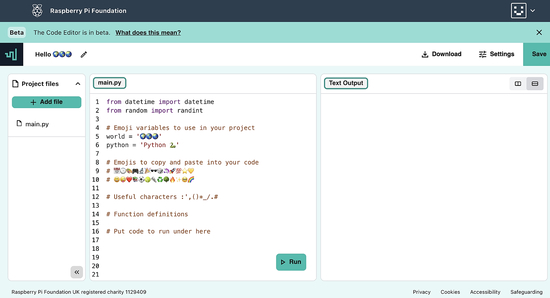]([url](https://www.raspberrypi.org/blog/code-editor-beta-testing/))

Raspberry Pi are building a new online text-based Code Editor to help young people aged 7 and older learn to write code. It’s free and designed for students who attend Code Clubs and CoderDojos, students in schools, and learners at home. The beta oftware allows one to **write and run Python code right in their browser, with no setup required**. The interface is simple and intuitive, which makes getting started with text-based coding easier. They can also save their code using their Raspberry Pi Foundation account. Raspberry Pi wants learners to easily build on projects they start in the classroom at home, or bring a project they’ve started at home to their coding club.

The editor is not limited to students - it can be used by anyone. While it is not VSCode, the all-browser implementation is very helpful. The effort to build language-specific editors is tremendous and Raspberry Pi should be given kudos for their progress - [Raspberry Pi]([url](https://www.raspberrypi.org/blog/code-editor-beta-testing/)).

## PyCon US Happening in April: CircuitPython-Related Activities

[PyCon US 2023](https://us.pycon.org/2023/) is coming up in Salt Lake City, Utah USA April 21 - 23 with Development Sprints April 24 - 27. Adafruit CircuitPython team members be there hosting events! Kattni Rembor and Jeff Epler will be present, along with a few well-known community members. 

Kattni and Jeff will be managing Open Spaces during the conference. The location and time is yet to be determined, but will be known when the conference begins. These Open Spaces will give folks an introduction to CircuitPython via the Circuit Playground Express. There will be a Quickstart worksheet available to get started easily, and Kattni & Jeff will there to help. Kattni will be bringing some fun extras as well. Everyone is welcome to attend!

Kattni will be hosting three days of Development Sprints from 8am-5pm on Monday April 24 through Wednesday April 26. Jeff will be joining on Monday. The location will be determined during the conference. The Sprints are an opportunity to contribute to the CircuitPython project, on the Python side of things, through code and documentation on CircuitPython Libraries. Everyone is welcome; there will still be all of the introduction to CircuitPython hardware, so there will be opportunities for folks at any level to participate.

Kattni states: "If you're attending, please let me know ahead of time in the `#circuitpython-dev` channel on the [Adafruit Discord](https://adafru.it/discord), or come find us around the conference. We'd love to meet up! We're looking forward to PyCon 2023, and we hope you are too! See you there!" - [PyCon US 2023](https://us.pycon.org/2023/).

## A Playable (and Edible) Dungeons and Dragons Cake

A ‘playable’ cake that uses the dice rolling mechanics of D&D to win an encounter. The game consists of two figures, each with 5 hearts. When the button is pressed rainbow lights swirl under each character, symbolizing a dice roll. This project was written in CircuitPython for an Adafruit Circuit Playground Express - [hackster.io](https://www.hackster.io/aaej/playable-dungeons-and-dragons-cake-8f8787).

## Python 3.11.3, Python 3.10.11 and 3.12.0 alpha 7 are Available

Python 3.11.3, Python 3.10.11 and 3.12.0 alpha 7 are now available. Alpha 7 is the last alpha verson of Python 3.12 before feature freeze. The other two are bug fixes for existing versions - [Python Insider Blog](https://pythoninsider.blogspot.com/2023/04/its-time-for-another-set-of-python.html).

## PSF and Anaconda: PyScript.com Generally Available

Anaconda announced that [PyScript.com](https://pyscript.com/) is now generally available as a free and flexible coding platform for Python development in the browser!

Key features include:
* Publish & share an unlimited number of applications
* Build & execute in the browser
* Live preview to immediately see code changes
* Robust styling & interactivity
* Easy-to-use tools & learning resources
* Vibrant community of makers

Try PyScript for free at [pyscript.com](https://pyscript.com/) - [LinkedIn](https://www.linkedin.com/posts/jezdez_anaconda-is-proud-to-announce-that-pyscriptcom-ugcPost-7046524894871740416-aDVn/).

## Programming Language Popularity by GitHub Pull Requests

GitHub is probably the most popular software repository in the world. One important feature on GitHub is the ‘pull request’: we often contribute to a piece of software by proposing changes to a piece of code. The number of pull requests is not, per se, an objective measure of how much one contributes to a piece of software. Nevertheless, in the auithor's view, the number of pull requests is an important indicator of how much people are willing and capable of contributing to your software in the open source domain - [Daniel Lemire's Blog](https://lemire.me/blog/2023/04/07/programming-language-popularity-by-github-pull-requests/).

The gist of the story goes as follow:

- The most popular languages are JavaScript/TypeScript and Python with roughly 20% of all pull requests each. In effect, if you put JavaScript/TypeScript and Python together, you get about 40% of all pull requests.
- Then you get the second tier languages: Java and Scala, C/C++, and Go. They all are in the 10% to 15% range.
- Finally, you have PHP, Ruby and C# that all manage to get about 5% of all pull requests.
- Other languages are typically far below 5%.

## Advocating Use of Python and Rust Together

Rust and Python have complementary strengths and weaknesses. opensource.com writes advocating prototyping in Python and then move performance bottlenecks to Rust - [Opensource.com](https://opensource.com/article/23/3/python-loves-rust).

## The Slint 1.0 GUI Toolkit Ported To Microcontrollers

[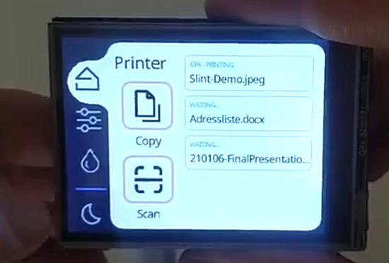](https://blog.adafruit.com/2023/04/07/the-slint-1-0-gui-toolkit-ported-to-microcontrollers-opensource-piday-raspberry_pi-slint_ui/)

Slint is a cross-platform native UI toolkit to provide user interfaces for any device. Initially focused on running on desktop-class machines and embedded devices that support OpenGL ES, a few months ago they started porting Slint to microcontrollers (MCUs). It's currently running well on Raspberry Pi Pico  - [Adafruit Blog](https://blog.adafruit.com/2023/04/07/the-slint-1-0-gui-toolkit-ported-to-microcontrollers-opensource-piday-raspberry_pi-slint_ui/),  [Announcement](https://slint-ui.com/blog/porting-slint-to-microcontrollers.html) and [GitHub](https://github.com/slint-ui/slint).

## Free Python Book Gets an Update

[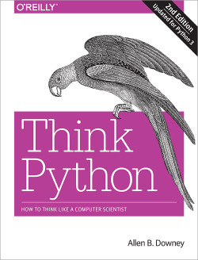](https://greenteapress.com/wp/think-python-2e/l)

Think Python 2nd Edition by Allen B. Downey has been updated and released. While it's on Amazon for purchase, there are free [PDF](http://greenteapress.com/thinkpython2/thinkpython2.pdf) and [HTML](https://greenteapress.com/wp/think-python-2e/) downloads by the author. There are also four language translations - [Green Tree Press](https://greenteapress.com/wp/think-python-2e/).

> Think Python is an introduction to Python programming for beginners. It starts with basic concepts of programming; it is carefully designed to define all terms when they are first used and to develop each new concept in a logical progression. Larger pieces, like recursion and object-oriented programming, are divided into a sequence of smaller steps and introduced over the course of several chapters.

## This Week's Python Streams

Python on Hardware is all about building a cooperative ecosphere which allows contributions to be valued and to grow knowledge. Below are the streams within the last week focusing on the community.

### CircuitPython Deep Dive Stream

[This week](https://www.youtube.com/watch?v=TPXBw9MGBbs), Tim streamed work on Multi-display Troubleshooting.

You can see the latest video and past videos on the Adafruit YouTube channel under the Deep Dive playlist - [YouTube](https://www.youtube.com/playlist?list=PLjF7R1fz_OOXBHlu9msoXq2jQN4JpCk8A).

### CircuitPython Parsec

John Park’s CircuitPython Parsec this week is on Integer Divide - [Adafruit Blog](https://blog.adafruit.com/2023/04/07/john-parks-circuitpython-parsec-integer-divide-adafruit-circuitpython/) and [YouTube](https://youtu.be/S-GEIM7TlE0).

Catch all the episodes in the [YouTube playlist](https://www.youtube.com/playlist?list=PLjF7R1fz_OOWFqZfqW9jlvQSIUmwn9lWr).

### The CircuitPython Show

The CircuitPython Show is returning on Monday, April 10th. Host Paul Cutler writes:

> I’ve missed you all and I’m excited to bring you a new season of the show. I’ll be talking to authors, board designers, developers, and more over the course of season three. Make sure you’re subscribed in your favorite podcast app and the first episode is coming to your earbuds on Monday, April 10th. I’ll be chatting with Danny Staple, author of the new book *Robotics at Home with Raspberry Pi Pico*.

More at [CircuitPythonShow](https://circuitpythonshow.com/).

## Project of the Week: A Fridge Flight Tracker

[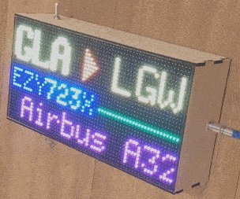](https://blog.colinwaddell.com/flight-tracker/)

[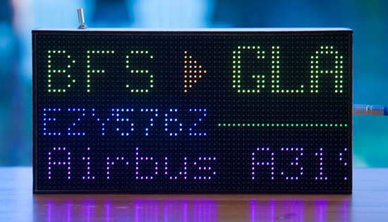](https://blog.colinwaddell.com/flight-tracker/)

Fridge Flight Tracker is a wooden box with a dot matrix screen which uses a Raspberry Pi Zero W, 32x64 LED RGB panel, Python and FlightRadar24 to know what aircraft are over ones house. It has magnets on the back to mount it to a refridgerator. When there’s nothing overhead, it shows the date, time and the temperature outside - [Post](https://blog.colinwaddell.com/flight-tracker/) and [GitHub](https://github.com/ColinWaddell/its-a-plane-python).

*Ed.: This project is from awhile back, but it was stuck in the editor's email inbox until liberated this week.*

## News from around the web!

[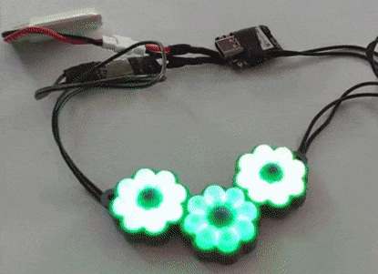](https://octodon.social/@geekmomprojects@mastodon.social/110154614520299157)

Tiny LED rings turned into a flower pendant via CircuitPython on a Xiao nRF52840 - [Mastodon](https://octodon.social/@geekmomprojects@mastodon.social/110154614520299157).

[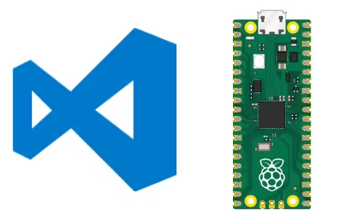](https://www.hackster.io/shilleh/how-to-use-vscode-with-raspberry-pi-pico-w-and-micropython-de88d6)

How to Use VSCode with Raspberry Pi Pico W and MicroPython - [hackster.io](https://www.hackster.io/shilleh/how-to-use-vscode-with-raspberry-pi-pico-w-and-micropython-de88d6).

> I built my own smart home system from scratch - both the hardware and software. I used a Raspberry Pi model 3 B+ and an ESP32 for sensor fusion and actuator control. The communication is via MQTT. The M.I.S.C.H.I.E.F voice assistant was coded entirely in Python - [Twitter](https://twitter.com/TichanaK/status/1643846893716291584).

[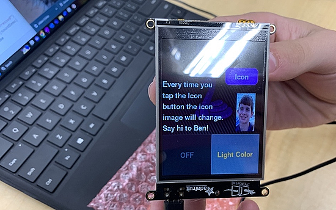](https://twitter.com/adafruit/status/1643969840644866048)

> Ms. Back's CS2 class explores Adafruit's [PyPortal IoT touchscreen display](https://www.adafruit.com/product/4116) by diving into Python code, figuring out how it works, and altering it to create their own interactive display. "Students were SO excited to learn & share with each other" - [Twitter](https://twitter.com/adafruit/status/1643969840644866048).

[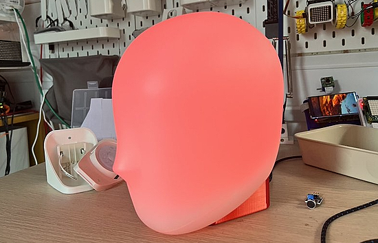](https://www.kevsrobots.com/blog/ikea-lamp-hack.html)

Hacking the Ikea Iskarna Head lamp to make it programmable with MicroPython using the Pimoroni Plasma 2040 W, a sound sensor, an Adafruit NeoPixel ring and some 3d printed parts - [Kev's Robots](https://www.kevsrobots.com/blog/ikea-lamp-hack.html) and [GitHub](https://www.github.com/kevinmcaleer/chatrgb).

A mix of Anne Barela's floppy with display by A.P. Delchi reads the files that are on the SD card and displays them on a scrolling text display - [Twitter](https://twitter.com/A_P_Delchi/status/1644952431359582208?t=uf0Lzp8Diio4PVz3UMVmEw&s=03).

aluball is a white LED lamp made with aluminium PCBs and MicroPython - [GitHub](https://github.com/brainsmoke/aluball) via [Mastodon](https://mastodon.social/@brainsmoke/110141936967133579).

[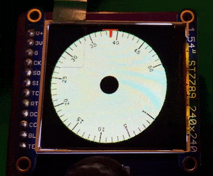](https://octodon.social/@cedargrove@mastodon.cloud/110154729979378627)

Frequency dial animation test for the Precision VCO module using CircuitPython and a 1.54-inch 240x240 TFT display - [Mastodon](https://octodon.social/@cedargrove@mastodon.cloud/110154729979378627).

[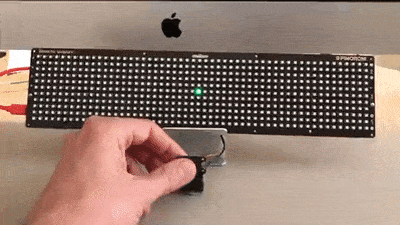](https://twitter.com/simon_prickett/status/1645482541682499587)

Connecting a trackball to a Pimoroni Galactic Unicorn and making a basic multi colour etch a sketch type game with MicroPython - [Twitter](https://twitter.com/simon_prickett/status/1645482541682499587).

[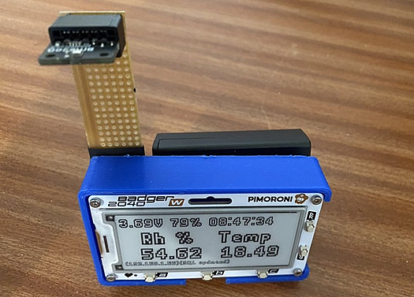](https://twitter.com/sfblackwell/status/1643166093614129152)

A 3d printer filament humidity sensor using a Pimoroni Badger W with Raspberry Pi Pico W onboard and a BME280 sensor using MicroPython. As well as enviro readings every 30mins, it can monitor battery levels and email for anything out of bounds. It also logs to MariaDB for ApexCharts - [Twitter](https://twitter.com/sfblackwell/status/1643166093614129152) and [GitHub](https://github.com/sfblackwell/3d-printer-filament-sensor).

A 4x10 touch grid controller using a Raspberry Pi Pico with CircuitPython - [Mastodon](https://octodon.social/@todbot@mastodon.social/109899950824587260).

Make a Pico W Change NeoPixel Colors, Play Sounds, and Move a Servo from a Web Page in CircuitPython - [YouTube](https://www.youtube.com/watch?v=UZNWGxk0nfI) via [Mastodon](https://mastodon.social/@gallaugher@mastodon.world/110047876036848346).

[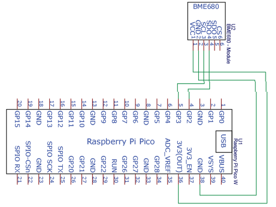](https://circuitcellar.com/research-design-hub/projects/environmental-monitoring-with-a-raspberry-pi-pico-w/)

Environmental Monitoring with a Raspberry Pi Pico W and MicroPython - [Circuit Cellar](https://circuitcellar.com/research-design-hub/projects/environmental-monitoring-with-a-raspberry-pi-pico-w/).

> I added a speaker to nag me when the Pokemon Goplus becomes unbound. If no buzzes happen in 30 seconds, it presses the button. If the press doesn’t trigger a buzz, the board beeps the speaker. MicroPython and NPN transistor to detect the buzz, PNP (transistor) to press the button via Raspberry Pi Pico - [Twitter](https://twitter.com/nerdymark/status/1644172074506924033).

[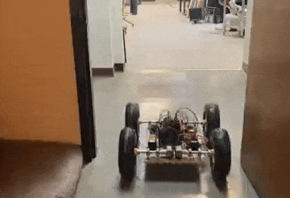](https://twitter.com/scottmonaghan/status/1644478903518388224)

A robot controlled by Raspberry Pi Pico W, using CircuitPython HTTPServer that responds to API requests - [Twitter](https://twitter.com/scottmonaghan/status/1644478903518388224).

Wireless Servo Control: Using Bluepad32 to Connect a Gamepad to Arduino with CircuitPython - [Level Up Coding](https://levelup.gitconnected.com/wireless-servo-control-using-bluepad32-to-connect-a-gamepad-to-arduino-ba66e614ec34).

[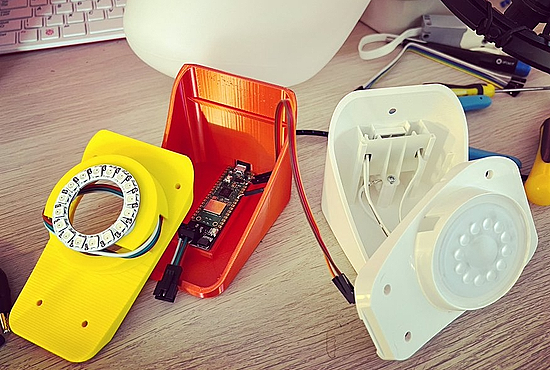](https://twitter.com/kevsmac/status/1643891686659981314)

> I swapped out the IKEA lamp electronics with a Pimoroni Plasma Stick, (a Raspberry Pi Pico) W, and it can now do cheerlights, respond to voice and is part of my home automation system, and runs Raspberry Pi flavoured MicroPython" - [Twitter](https://twitter.com/kevsmac/status/1643891686659981314) and [Instagram](https://www.instagram.com/p/CqsA6xyNkDT/).

[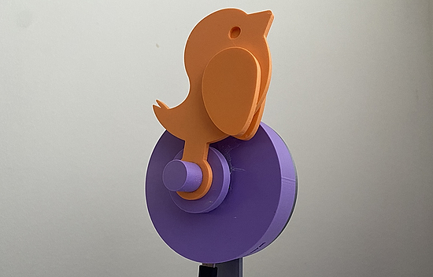](https://octodon.social/@andy_warb@mastodon.social/110158218735570060)

Andy Warburton's 3D printed take on the Canairi air quality sensor features an SGP40 gas sensor and an AHT20 temperature and humidity sensor. Powered by CircuitPython, it reacts to the air by “dying” when air quality gets low but also logs it’s readings to Home Assistant over MQTT (and the whole thing runs off an Unexpected Maker ESP32-S2). It can be wall-mounted or placed on its stand - [Mastodon](https://octodon.social/@andy_warb@mastodon.social/110158218735570060).

Raspberry Pi Pico Web Server Control - [GitHub](https://github.com/gurgleapps/pico-web-server-control), [Hackaday](https://hackaday.com/2023/04/07/pi-microcontroller-still-runs-a-webserver/) and [YouTube](https://youtu.be/Kz3PUONGTkU).

[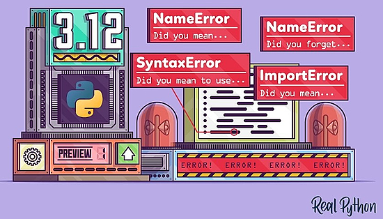](https://realpython.com/python312-error-messages/)

Python 3.12 Preview: Ever Better Error Messages - [Real Python](https://realpython.com/python312-error-messages/).

Nuitka, a Python compiler written in Python. You feed it your Python app, it does a lot of clever things, and spits out an executable or extension module - [GitHub](https://github.com/Nuitka/Nuitka).

PyDev of the Week: NAME on [Mouse vs Python]()

CircuitPython Weekly Meeting for DATE ([notes]()) [on YouTube]()

**#ICYDNCI What was the most popular, most clicked link, in [last week's newsletter](https://link)? [title](url).**

## New and Coming Soon

[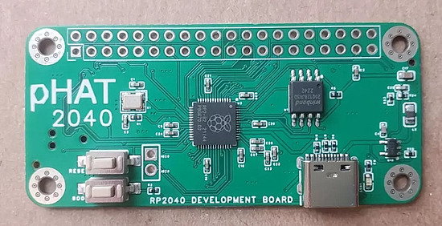](https://www.cnx-software.com/2023/04/04/raspberry-pi-rp2040-phat-board-40-pin-gpio-header/)

0xC0FFEE’s RP2040 PHAT is both a Raspberry Pi RP2040 development board and a pHAT for Raspberry Pi and Pi Zero Linux SBCs that exposes the I/Os through the 40-pin GPIO header traditionally found in Raspberry Pi single board computers - [CNX Software](https://www.cnx-software.com/2023/04/04/raspberry-pi-rp2040-phat-board-40-pin-gpio-header/) and [Tindie](https://www.tindie.com/products/0xc0ffee/rp2040-phat/).

text - [site](url).

## New Boards Supported by CircuitPython

The number of supported microcontrollers and Single Board Computers (SBC) grows every week. This section outlines which boards have been included in CircuitPython or added to [CircuitPython.org](https://circuitpython.org/).

This week, there were (#/no) new boards added!

- [Board name](url)
- [Board name](url)
- [Board name](url)

*Note: For non-Adafruit boards, please use the support forums of the board manufacturer for assistance, as Adafruit does not have the hardware to assist in troubleshooting.*

Looking to add a new board to CircuitPython? It's highly encouraged! Adafruit has four guides to help you do so:

- [How to Add a New Board to CircuitPython](https://learn.adafruit.com/how-to-add-a-new-board-to-circuitpython/overview)
- [How to add a New Board to the circuitpython.org website](https://learn.adafruit.com/how-to-add-a-new-board-to-the-circuitpython-org-website)
- [Adding a Single Board Computer to PlatformDetect for Blinka](https://learn.adafruit.com/adding-a-single-board-computer-to-platformdetect-for-blinka)
- [Adding a Single Board Computer to Blinka](https://learn.adafruit.com/adding-a-single-board-computer-to-blinka)

## New Learn Guides!

[Robotic AI Bear using ChatGPT](https://learn.adafruit.com/robotic-ai-bear-using-chatgpt) from [Melissa LeBlanc-Williams](https://learn.adafruit.com/u/MakerMelissa)

[Generating Text with ChatGPT, Pico W & CircuitPython](https://learn.adafruit.com/generating-text-with-chatgpt-pico-w-circuitpython) from [Jeff Epler](https://learn.adafruit.com/u/jepler)

## CircuitPython Libraries!

CircuitPython support for hardware continues to grow. We are adding support for new sensors and breakouts all the time, as well as improving on the drivers we already have. As we add more libraries and update current ones, you can keep up with all the changes right here!

For the latest libraries, download the [Adafruit CircuitPython Library Bundle](https://circuitpython.org/libraries). For the latest community contributed libraries, download the [CircuitPython Community Bundle](https://github.com/adafruit/CircuitPython_Community_Bundle/releases).

If you'd like to contribute, CircuitPython libraries are a great place to start. Have an idea for a new driver? File an issue on [CircuitPython](https://github.com/adafruit/circuitpython/issues)! Have you written a library you'd like to make available? Submit it to the [CircuitPython Community Bundle](https://github.com/adafruit/CircuitPython_Community_Bundle). Interested in helping with current libraries? Check out the [CircuitPython.org Contributing page](https://circuitpython.org/contributing). We've included open pull requests and issues from the libraries, and details about repo-level issues that need to be addressed. We have a guide on [contributing to CircuitPython with Git and GitHub](https://learn.adafruit.com/contribute-to-circuitpython-with-git-and-github) if you need help getting started. You can also find us in the #circuitpython channels on the [Adafruit Discord](https://adafru.it/discord).

You can check out this [list of all the Adafruit CircuitPython libraries and drivers available](https://github.com/adafruit/Adafruit_CircuitPython_Bundle/blob/master/circuitpython_library_list.md). 

The current number of CircuitPython libraries is **416**!

**New Libraries!**

Here's this week's new CircuitPython libraries:

  * [adafruit/Adafruit_CircuitPython_Wii_Classic](https://github.com/adafruit/Adafruit_CircuitPython_Wii_Classic)
  * [jposada202020/CircuitPython_BMI160](https://github.com/jposada202020/CircuitPython_BMI160)

**Updated Libraries!**

Here's this week's updated CircuitPython libraries:

  * [adafruit/Adafruit_CircuitPython_BLE](https://github.com/adafruit/Adafruit_CircuitPython_BLE)
  * [adafruit/Adafruit_CircuitPython_HTTPServer](https://github.com/adafruit/Adafruit_CircuitPython_HTTPServer)
  * [adafruit/Adafruit_CircuitPython_Requests](https://github.com/adafruit/Adafruit_CircuitPython_Requests)
  * [bablokb/circuitpython-pcf85063a](https://github.com/bablokb/circuitpython-pcf85063a)

**Library PyPI Weekly Download Statistics**

* **Total Library Stats**

  * 88874 PyPI downloads over 310 libraries

**Top 10 Libraries by PyPI Downloads**
  * Adafruit CircuitPython BusDevice (adafruit-circuitpython-busdevice): 7369
  * Adafruit CircuitPython Requests (adafruit-circuitpython-requests): 6770
  * Adafruit CircuitPython Register (adafruit-circuitpython-register): 1813
  * Adafruit CircuitPython NeoPixel (adafruit-circuitpython-neopixel): 1770
  * Adafruit CircuitPython Motor (adafruit-circuitpython-motor): 1039
  * Adafruit CircuitPython BLE (adafruit-circuitpython-ble): 975
  * Adafruit CircuitPython Wiznet5k (adafruit-circuitpython-wiznet5k): 909
  * Adafruit CircuitPython Pixelbuf (adafruit-circuitpython-pixelbuf): 882
  * Adafruit CircuitPython Display Text (adafruit-circuitpython-display-text): 840
  * Adafruit CircuitPython MiniMQTT (adafruit-circuitpython-minimqtt): 771

## What’s the CircuitPython team up to this week?

What is the team up to this week? Let’s check in!

**Dan**

This week, I added board definitions for some upcoming Feather RP2040 boards to CircuitPython. I also added informational read-only properties to the WiFi API so you can tell if the board is connected or if it is running as an access point. Finally, I brought the Blinka  `_bleio` library up to date with latest version of the underlying library we use, bleak. Blinka `_bleio` allows you to use CircuitPython BLE code on a host computer. We had pinned versions in late 2020; there have been many improvements and fixes since then. Blinka `_bleio` now can run on Python 3.9 through 3.11.

**Kattni**

The [Adafruit Feather RP2040 RFM69 guide](https://learn.adafruit.com/feather-rp2040-rfm69) is live! This guide has everything you need to get started with your new board. It includes technical details, pinouts, demos for both CircuitPython and Arduino, downloads resources, and more. If you picked one of these up, check out this guide!

The Feather RP2040 RFM9x guide will follow shortly!

**Melissa**

text - [site](url).

**Tim**

I've been working on troubleshooting some issues with 2 screen devices like the Monster M4sk, or others with 2 displays attached externally. Some of the recent changes to the displayio API needed some additional checks to ensure the terminal output group was not already being used before attempting to show it on displays as they are initialized and reset. There is also something going on resulting in hard crashes for some 2 display configurations during code  file saves or reboots with ctrl-C, I'm digging further into that to try to understand the root cause.

**Jeff**

I enhanced the abilities of the lesser known `synthio` module, which was contributed by community member @tyomitch back in 2021. Now, it can mix up to 12 notes (on rp2040 and mimxrt10xx ports) and general waveforms are supported, rather than only square waves. This work will be in the next 8.1.0 beta release.

For the next few weeks, I'll be traveling, spending some time in Utah's national parks, ending up at PyCon US 2023 from Friday through Tuesday. I'd love to meet anybody from the Adafruit and Python on Hardware community who is also attending *(Ed: see the article on PyCon US earlier in the newsletter)*.

**Scott**

I haven't done a ton this week because I've been out sick. When I've had time, I've continued working on CIrcuitPython on the iMX RT. I got the 117x series kind of working so I moved back to the 10xx. Specifically I got the 1042 working and am now working on the 1015. After I get these new chips supported, I'll be focusing on optimizing flash settings. In the worst case, code to execute and data is loaded from flash. So, the faster that happens, the faster CircuitPython runs.

**Liz**

This week I added pages for PWM audio and I2S audio in the [Metro M7 1011 guide](https://learn.adafruit.com/adafruit-metro-m7-with-airlift). I also updated the [2.7" eInk guide](https://learn.adafruit.com/adafruit-2-7-eink-display-breakouts-and-shields) with a page for EYESPI for the updated version of the display.

## Upcoming events!

The next MicroPython Meetup in Melbourne will be on April 26th – [Meetup](https://www.meetup.com/MicroPython-Meetup/). 

EuroPython 2023 will be July 17-23, 2023, in Prague, Czech Republic and Remote - [EuroPython 2023](https://ep2023.europython.eu/).

PyCon UK will be returning to Cardiff City Hall from Friday 22nd September to Monday 25th September 2023 - [PyCon UK](https://2023.pyconuk.org/).

**Send Your Events In**

If you know of virtual events or upcoming events, please let us know via email to cpnews(at)adafruit(dot)com.

## Latest releases

CircuitPython's stable release is [#.#.#](https://github.com/adafruit/circuitpython/releases/latest) and its unstable release is [#.#.#-##.#](https://github.com/adafruit/circuitpython/releases). New to CircuitPython? Start with our [Welcome to CircuitPython Guide](https://learn.adafruit.com/welcome-to-circuitpython).

[2023####](https://github.com/adafruit/Adafruit_CircuitPython_Bundle/releases/latest) is the latest CircuitPython library bundle.

[v#.#.#](https://micropython.org/download) is the latest MicroPython release. Documentation for it is [here](http://docs.micropython.org/en/latest/pyboard/).

[#.#.#](https://www.python.org/downloads/) is the latest Python release. The latest pre-release version is [#.#.#](https://www.python.org/download/pre-releases/).

[#,### Stars](https://github.com/adafruit/circuitpython/stargazers) Like CircuitPython? [Star it on GitHub!](https://github.com/adafruit/circuitpython)

## Call for help -- Translating CircuitPython is now easier than ever!

[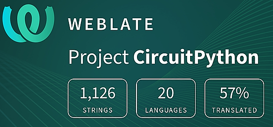](https://hosted.weblate.org/engage/circuitpython/)

One important feature of CircuitPython is translated control and error messages. With the help of fellow open source project [Weblate](https://weblate.org/), we're making it even easier to add or improve translations. 

Sign in with an existing account such as GitHub, Google or Facebook and start contributing through a simple web interface. No forks or pull requests needed! As always, if you run into trouble join us on [Discord](https://adafru.it/discord), we're here to help.

## NUMBER thanks!

The Adafruit Discord community, where we do all our CircuitPython development in the open, reached over NUMBER humans - thank you!  Adafruit believes Discord offers a unique way for Python on hardware folks to connect. Join today at [https://adafru.it/discord](https://adafru.it/discord).

## ICYMI - In case you missed it

Python on hardware is the Adafruit Python video-newsletter-podcast! The news comes from the Python community, Discord, Adafruit communities and more and is broadcast on ASK an ENGINEER Wednesdays. The complete Python on Hardware weekly videocast [playlist is here](https://www.youtube.com/playlist?list=PLjF7R1fz_OOXRMjM7Sm0J2Xt6H81TdDev). The video podcast is on [iTunes](https://itunes.apple.com/us/podcast/python-on-hardware/id1451685192?mt=2), [YouTube](http://adafru.it/pohepisodes), [IGTV (Instagram TV](https://www.instagram.com/adafruit/channel/)), and [XML](https://itunes.apple.com/us/podcast/python-on-hardware/id1451685192?mt=2).

[The weekly community chat on Adafruit Discord server CircuitPython channel - Audio / Podcast edition](https://itunes.apple.com/us/podcast/circuitpython-weekly-meeting/id1451685016) - Audio from the Discord chat space for CircuitPython, meetings are usually Mondays at 2pm ET, this is the audio version on [iTunes](https://itunes.apple.com/us/podcast/circuitpython-weekly-meeting/id1451685016), Pocket Casts, [Spotify](https://adafru.it/spotify), and [XML feed](https://adafruit-podcasts.s3.amazonaws.com/circuitpython_weekly_meeting/audio-podcast.xml).

## Codecademy "Learn Hardware Programming with CircuitPython"

Codecademy, an online interactive learning platform used by more than 45 million people, has teamed up with Adafruit to create a coding course, “Learn Hardware Programming with CircuitPython”. The course is now available in the [Codecademy catalog](https://www.codecademy.com/learn/learn-circuitpython?utm_source=adafruit&utm_medium=partners&utm_campaign=circuitplayground&utm_content=pythononhardwarenewsletter).

## Contribute!

The CircuitPython Weekly Newsletter is a CircuitPython community-run newsletter emailed every Tuesday. The complete [archives are here](https://www.adafruitdaily.com/category/circuitpython/). It highlights the latest CircuitPython related news from around the web including Python and MicroPython developments. To contribute, edit next week's draft [on GitHub](https://github.com/adafruit/circuitpython-weekly-newsletter/tree/gh-pages/_drafts) and [submit a pull request](https://help.github.com/articles/editing-files-in-your-repository/) with the changes. You may also tag your information on Twitter with #CircuitPython. 

Join the Adafruit [Discord](https://adafru.it/discord) or [post to the forum](https://forums.adafruit.com/viewforum.php?f=60) if you have questions.
