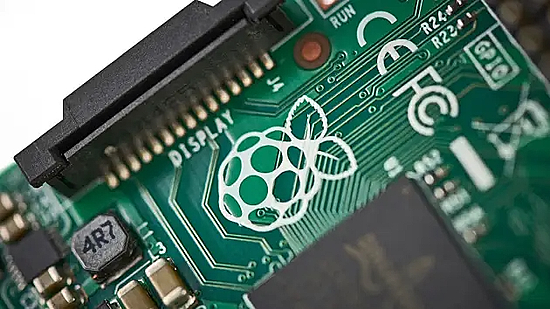
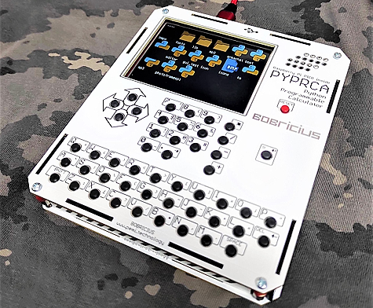
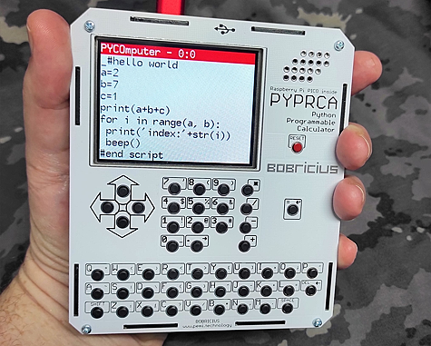
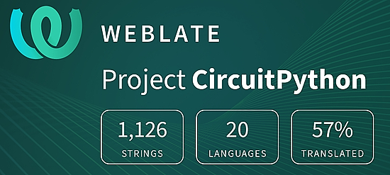

- [X] Kattni updates
- [ ] change date
- [ ] update title
- [ ] Feature story
- [ ] Update  for images
- [ ] Update ICYDNCI
- [ ] All images 550w max only
- [ ] Link "View this email in your browser."

News Sources

- [python.org](https://www.python.org/)
- [Python Insider - dev team blog](https://pythoninsider.blogspot.com/)
- [MicroPython Meetup Blog](https://melbournemicropythonmeetup.github.io/)
- [hackaday.io newest projects MicroPython](https://hackaday.io/projects?tag=micropython&sort=date) and [CircuitPython](https://hackaday.io/projects?tag=circuitpython&sort=date)
- [hackaday CircuitPython](https://hackaday.com/blog/?s=circuitpython) and [MicroPython](https://hackaday.com/blog/?s=micropython)
- [hackster.io CircuitPython](https://www.hackster.io/search?q=circuitpython&i=projects&sort_by=most_recent) and [MicroPython](https://www.hackster.io/search?q=micropython&i=projects&sort_by=most_recent)
- [https://opensource.com/tags/python](https://opensource.com/tags/python)
- [Mastodon CircuitPython](https://octodon.social/tags/CircuitPython)

View this email in your browser. **Warning: Flashing Imagery**

Welcome to the latest Python on Microcontrollers newsletter!  - *Ed.*

We're on [Discord](https://discord.gg/HYqvREz), [Twitter](https://twitter.com/search?q=circuitpython&src=typed_query&f=live), and for past newsletters - [view them all here](https://www.adafruitdaily.com/category/circuitpython/). If you're reading this on the web, [subscribe here](https://www.adafruitdaily.com/). Here's the news this week:

## Headline

text - [site](url).

## Sony Backs Maker of Raspberry Pi Computers With Funding and Access to AI Chips

Sony Semiconductor Solutions has announced an investment in Raspberry Pi Ltd, the for-profit arm of the Raspberry Pi empire, telegraphing hopes that it will be able to make its AITRIOS edge artificial intelligence (edge AI) platform the go-to way to boost the single-board computers' capabilities for low-power on-device machine learning. The firm raised the cash at the same $500 million valuation it was worth in a 2021 funding round. The company has become a more active player in the enterprise — in a typical year, roughly 70% of its sales now come from commercial customers embedding its products into factories or consumer devices - [CNBC](https://www.cnbc.com/2023/04/12/sony-backs-raspberry-pi-with-fresh-funding-access-to-ai-chips.html) and [Hackster.io](https://www.hackster.io/news/sony-invests-in-raspberry-pi-aims-to-add-its-aitrios-edge-ai-platform-to-the-ecosystem-2da89121be26).

## PyCon US Coming Next Week: CircuitPython-Related Activities

[PyCon US 2023](https://us.pycon.org/2023/) is coming up in Salt Lake City, Utah USA April 21 - 23 with Development Sprints April 24 - 27. Adafruit CircuitPython team members be there hosting events! Kattni Rembor and Jeff Epler will be present, along with a few well-known community members. 

Kattni and Jeff will be managing Open Spaces during the conference. The location and time is yet to be determined, but will be known when the conference begins. These Open Spaces will give folks an introduction to CircuitPython via the Circuit Playground Express. There will be a Quickstart worksheet available to get started easily, and Kattni & Jeff will there to help. Kattni will be bringing some fun extras as well. Everyone is welcome to attend!

Kattni will be hosting three days of Development Sprints from 8am-5pm on Monday April 24 through Wednesday April 26. Jeff will be joining on Monday. The location will be determined during the conference. The Sprints are an opportunity to contribute to the CircuitPython project, on the Python side of things, through code and documentation on CircuitPython Libraries. Everyone is welcome; there will still be all of the introduction to CircuitPython hardware, so there will be opportunities for folks at any level to participate.

Kattni states: "If you're attending, please let me know ahead of time in the `#circuitpython-dev` channel on the [Adafruit Discord](https://adafru.it/discord), or come find us around the conference. We'd love to meet up! We're looking forward to PyCon 2023, and we hope you are too! See you there!" - [PyCon US 2023](https://us.pycon.org/2023/).

## Feature

text - [site](url).

## This Week's Python Streams

Python on Hardware is all about building a cooperative ecosphere which allows contributions to be valued and to grow knowledge. Below are the streams within the last week focusing on the community.

### CircuitPython Deep Dive Stream

[This week](link), Tim streamed work on {subject}.

You can see the latest video and past videos on the Adafruit YouTube channel under the Deep Dive playlist - [YouTube](https://www.youtube.com/playlist?list=PLjF7R1fz_OOXBHlu9msoXq2jQN4JpCk8A).

### CircuitPython Parsec

John Park’s CircuitPython Parsec this week is on {subject} - [Adafruit Blog](link) and [YouTube](link).

Catch all the episodes in the [YouTube playlist](https://www.youtube.com/playlist?list=PLjF7R1fz_OOWFqZfqW9jlvQSIUmwn9lWr).

### The CircuitPython Show

The CircuitPython Show is an independent podcast hosted by Paul Cutler, focusing on the people doing awesome things with CircuitPython. Each episode features Paul in conversation with a guest for a short interview – [CircuitPythonShow](https://circuitpythonshow.com/) and [Twitter](https://twitter.com/circuitpyshow).

The latest episode was released (date) and features (guest).  They and Paul talk {subject} – [Show List](https://circuitpythonshow.com/episodes/all).

## Project of the Week: The PYPRCA CircuitPython Calculator/Computer

PYPRCA is a Python programable calculator and CircuitPython computer. It has a dedicated numerical key block for better native input of numbers. It also has a
QWERTY key set for writing programs. Functions like SIN and COS are typed out rather than using shift buttons. 

Features:
- 2.8" color TFT IPS Display
- keyboard (7x7)
- Raspberry PICO or W
- SD card
- GROVE GPIO
- Speaker 
- A simple quadratic equation solver
 
It is based on a Raspberry Pi Pico. It's a bit shorter and wider than a Numworks calculator - [Twitter Thread](https://twitter.com/bobricius/status/1646646062449344512) and [Hackaday.io](https://hackaday.io/project/190308-pyprca-python-programmable-calculator-computer).

## News from around the web!

text - [site](url).

text - [site](url).

text - [site](url).

text - [site](url).

text - [site](url).

text - [site](url).

text - [site](url).

text - [site](url).

text - [site](url).

text - [site](url).

text - [site](url).

text - [site](url).

text - [site](url).

text - [site](url).

text - [site](url).

text - [site](url).

text - [site](url).

text - [site](url).

PyDev of the Week: NAME on [Mouse vs Python]()

CircuitPython Weekly Meeting for DATE ([notes]()) [on YouTube]()

**#ICYDNCI What was the most popular, most clicked link, in [last week's newsletter](https://link)? [title](url).**

## Coming Soon

text - [site](url).

text - [site](url).

## New Boards Supported by CircuitPython

The number of supported microcontrollers and Single Board Computers (SBC) grows every week. This section outlines which boards have been included in CircuitPython or added to [CircuitPython.org](https://circuitpython.org/).

This week, there were (#/no) new boards added!

- [Board name](url)
- [Board name](url)
- [Board name](url)

*Note: For non-Adafruit boards, please use the support forums of the board manufacturer for assistance, as Adafruit does not have the hardware to assist in troubleshooting.*

Looking to add a new board to CircuitPython? It's highly encouraged! Adafruit has four guides to help you do so:

- [How to Add a New Board to CircuitPython](https://learn.adafruit.com/how-to-add-a-new-board-to-circuitpython/overview)
- [How to add a New Board to the circuitpython.org website](https://learn.adafruit.com/how-to-add-a-new-board-to-the-circuitpython-org-website)
- [Adding a Single Board Computer to PlatformDetect for Blinka](https://learn.adafruit.com/adding-a-single-board-computer-to-platformdetect-for-blinka)
- [Adding a Single Board Computer to Blinka](https://learn.adafruit.com/adding-a-single-board-computer-to-blinka)

## New Learn Guides!

[Playing Animated GIF Files in CircuitPython](https://learn.adafruit.com/using-animated-gif-files-in-circuitpython) from [Anne Barela](https://learn.adafruit.com/u/AnneBarela)

[Adafruit CircuitPython Wii Classic Controller Library](https://learn.adafruit.com/adafruit-circuitpython-wii-classic-controller-library) from [Liz Clark](https://learn.adafruit.com/u/BlitzCityDIY)

[Adafruit Feather RP2040 RFM69](https://learn.adafruit.com/feather-rp2040-rfm69) from [Kattni](https://learn.adafruit.com/u/kattni)

## CircuitPython Libraries!

CircuitPython support for hardware continues to grow. We are adding support for new sensors and breakouts all the time, as well as improving on the drivers we already have. As we add more libraries and update current ones, you can keep up with all the changes right here!

For the latest libraries, download the [Adafruit CircuitPython Library Bundle](https://circuitpython.org/libraries). For the latest community contributed libraries, download the [CircuitPython Community Bundle](https://github.com/adafruit/CircuitPython_Community_Bundle/releases).

If you'd like to contribute, CircuitPython libraries are a great place to start. Have an idea for a new driver? File an issue on [CircuitPython](https://github.com/adafruit/circuitpython/issues)! Have you written a library you'd like to make available? Submit it to the [CircuitPython Community Bundle](https://github.com/adafruit/CircuitPython_Community_Bundle). Interested in helping with current libraries? Check out the [CircuitPython.org Contributing page](https://circuitpython.org/contributing). We've included open pull requests and issues from the libraries, and details about repo-level issues that need to be addressed. We have a guide on [contributing to CircuitPython with Git and GitHub](https://learn.adafruit.com/contribute-to-circuitpython-with-git-and-github) if you need help getting started. You can also find us in the #circuitpython channels on the [Adafruit Discord](https://adafru.it/discord).

You can check out this [list of all the Adafruit CircuitPython libraries and drivers available](https://github.com/adafruit/Adafruit_CircuitPython_Bundle/blob/master/circuitpython_library_list.md). 

The current number of CircuitPython libraries is **422**!

**New Libraries!**

Here's this week's new CircuitPython libraries:

  * [furbrain/CircuitPython_async_buzzer](https://github.com/furbrain/CircuitPython_async_buzzer)
  * [jposada202020/CircuitPython_simple_dial](https://github.com/jposada202020/CircuitPython_simple_dial)

**Updated Libraries!**

Here's this week's updated CircuitPython libraries:

  * [adafruit/Adafruit_CircuitPython_MAX1704x](https://github.com/adafruit/Adafruit_CircuitPython_MAX1704x)
  * [adafruit/Adafruit_CircuitPython_PN532](https://github.com/adafruit/Adafruit_CircuitPython_PN532)
  * [adafruit/Adafruit_CircuitPython_Wii_Classic](https://github.com/adafruit/Adafruit_CircuitPython_Wii_Classic)
  * [tekktrik/CircuitPython_CSV](https://github.com/tekktrik/CircuitPython_CSV)
  * [CedarGroveStudios/CircuitPython_AD9833](https://github.com/CedarGroveStudios/CircuitPython_AD9833)
  * [s-light/CircuitPython_ansi_escape_code](https://github.com/s-light/CircuitPython_ansi_escape_code)

**Library PyPI Weekly Download Statistics**
* **Total Library Stats**
  * 87596 PyPI downloads over 310 libraries
* **Top 10 Libraries by PyPI Downloads**
  * Adafruit CircuitPython BusDevice (adafruit-circuitpython-busdevice): 6199
  * Adafruit CircuitPython Requests (adafruit-circuitpython-requests): 5331
  * Adafruit CircuitPython NeoPixel (adafruit-circuitpython-neopixel): 1638
  * Adafruit CircuitPython Register (adafruit-circuitpython-register): 1545
  * Adafruit CircuitPython Motor (adafruit-circuitpython-motor): 917
  * Adafruit CircuitPython Display Text (adafruit-circuitpython-display-text): 884
  * Adafruit CircuitPython Wiznet5k (adafruit-circuitpython-wiznet5k): 817
  * Adafruit CircuitPython Pixelbuf (adafruit-circuitpython-pixelbuf): 801
  * Adafruit CircuitPython PCA9685 (adafruit-circuitpython-pca9685): 730
  * Adafruit CircuitPython MiniMQTT (adafruit-circuitpython-minimqtt): 722

## What’s the CircuitPython team up to this week?

What is the team up to this week? Let’s check in!

**Dan**

text - [site](url).

**Kattni**

text - [site](url).

**Melissa**

text - [site](url).

**Tim**

text - [site](url).

**Jeff**

text - [site](url).

**Scott**

text - [site](url).

**Liz**

text - [site](url).

## Upcoming events!

The next MicroPython Meetup in Melbourne will be on April 26th – [Meetup](https://www.meetup.com/MicroPython-Meetup/). 

EuroPython 2023 will be July 17-23, 2023, in Prague, Czech Republic and Remote - [EuroPython 2023](https://ep2023.europython.eu/).

PyCon UK will be returning to Cardiff City Hall from Friday 22nd September to Monday 25th September 2023 - [PyCon UK](https://2023.pyconuk.org/).

**Send Your Events In**

If you know of virtual events or upcoming events, please let us know via email to cpnews(at)adafruit(dot)com.

## Latest releases

CircuitPython's stable release is [#.#.#](https://github.com/adafruit/circuitpython/releases/latest) and its unstable release is [#.#.#-##.#](https://github.com/adafruit/circuitpython/releases). New to CircuitPython? Start with our [Welcome to CircuitPython Guide](https://learn.adafruit.com/welcome-to-circuitpython).

[2023####](https://github.com/adafruit/Adafruit_CircuitPython_Bundle/releases/latest) is the latest CircuitPython library bundle.

[v#.#.#](https://micropython.org/download) is the latest MicroPython release. Documentation for it is [here](http://docs.micropython.org/en/latest/pyboard/).

[#.#.#](https://www.python.org/downloads/) is the latest Python release. The latest pre-release version is [#.#.#](https://www.python.org/download/pre-releases/).

[#,### Stars](https://github.com/adafruit/circuitpython/stargazers) Like CircuitPython? [Star it on GitHub!](https://github.com/adafruit/circuitpython)

## Call for help -- Translating CircuitPython is now easier than ever!

One important feature of CircuitPython is translated control and error messages. With the help of fellow open source project [Weblate](https://weblate.org/), we're making it even easier to add or improve translations. 

Sign in with an existing account such as GitHub, Google or Facebook and start contributing through a simple web interface. No forks or pull requests needed! As always, if you run into trouble join us on [Discord](https://adafru.it/discord), we're here to help.

## NUMBER thanks!

The Adafruit Discord community, where we do all our CircuitPython development in the open, reached over NUMBER humans - thank you!  Adafruit believes Discord offers a unique way for Python on hardware folks to connect. Join today at [https://adafru.it/discord](https://adafru.it/discord).

## ICYMI - In case you missed it

Python on hardware is the Adafruit Python video-newsletter-podcast! The news comes from the Python community, Discord, Adafruit communities and more and is broadcast on ASK an ENGINEER Wednesdays. The complete Python on Hardware weekly videocast [playlist is here](https://www.youtube.com/playlist?list=PLjF7R1fz_OOXRMjM7Sm0J2Xt6H81TdDev). The video podcast is on [iTunes](https://itunes.apple.com/us/podcast/python-on-hardware/id1451685192?mt=2), [YouTube](http://adafru.it/pohepisodes), [IGTV (Instagram TV](https://www.instagram.com/adafruit/channel/)), and [XML](https://itunes.apple.com/us/podcast/python-on-hardware/id1451685192?mt=2).

[The weekly community chat on Adafruit Discord server CircuitPython channel - Audio / Podcast edition](https://itunes.apple.com/us/podcast/circuitpython-weekly-meeting/id1451685016) - Audio from the Discord chat space for CircuitPython, meetings are usually Mondays at 2pm ET, this is the audio version on [iTunes](https://itunes.apple.com/us/podcast/circuitpython-weekly-meeting/id1451685016), Pocket Casts, [Spotify](https://adafru.it/spotify), and [XML feed](https://adafruit-podcasts.s3.amazonaws.com/circuitpython_weekly_meeting/audio-podcast.xml).

## Contribute!

The CircuitPython Weekly Newsletter is a CircuitPython community-run newsletter emailed every Tuesday. The complete [archives are here](https://www.adafruitdaily.com/category/circuitpython/). It highlights the latest CircuitPython related news from around the web including Python and MicroPython developments. To contribute, edit next week's draft [on GitHub](https://github.com/adafruit/circuitpython-weekly-newsletter/tree/gh-pages/_drafts) and [submit a pull request](https://help.github.com/articles/editing-files-in-your-repository/) with the changes. You may also tag your information on Twitter with #CircuitPython. 

Join the Adafruit [Discord](https://adafru.it/discord) or [post to the forum](https://forums.adafruit.com/viewforum.php?f=60) if you have questions.
