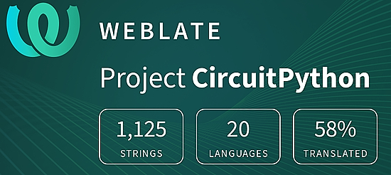

- [X] Kattni updates
- [ ] change date
- [ ] update title
- [ ] Feature story
- [ ] Update  for images
- [ ] Update ICYDNCI
- [ ] All images 550w max only
- [ ] Link "View this email in your browser."

News Sources

- [python.org](https://www.python.org/)
- [Python Insider - dev team blog](https://pythoninsider.blogspot.com/)
- [MicroPython Meetup Blog](https://melbournemicropythonmeetup.github.io/)
- [hackaday.io newest projects MicroPython](https://hackaday.io/projects?tag=micropython&sort=date) and [CircuitPython](https://hackaday.io/projects?tag=circuitpython&sort=date)
- [hackaday CircuitPython](https://hackaday.com/blog/?s=circuitpython) and [MicroPython](https://hackaday.com/blog/?s=micropython)
- [hackster.io CircuitPython](https://www.hackster.io/search?q=circuitpython&i=projects&sort_by=most_recent) and [MicroPython](https://www.hackster.io/search?q=micropython&i=projects&sort_by=most_recent)
- [https://opensource.com/tags/python](https://opensource.com/tags/python)
- [Mastodon CircuitPython](https://octodon.social/tags/CircuitPython)

View this email in your browser. **Warning: Flashing Imagery**

Welcome to the latest Python on Microcontrollers newsletter!  - *Ed.*

We're on [Discord](https://discord.gg/HYqvREz), [Twitter](https://twitter.com/search?q=circuitpython&src=typed_query&f=live), and for past newsletters - [view them all here](https://www.adafruitdaily.com/category/circuitpython/). If you're reading this on the web, [subscribe here](https://www.adafruitdaily.com/). Here's the news this week:

## Headline

text - [site](url).

## Feature

text - [site](url).

## Feature

text - [site](url).

## Feature

text - [site](url).

## This Week's Python Streams

Python on Hardware is all about building a cooperative ecosphere which allows contributions to be valued and to grow knowledge. Below are the streams within the last week focusing on the community.

### CircuitPython Deep Dive Stream

[This week](link), Tim streamed work on {subject}.

You can see the latest video and past videos on the Adafruit YouTube channel under the Deep Dive playlist - [YouTube](https://www.youtube.com/playlist?list=PLjF7R1fz_OOXBHlu9msoXq2jQN4JpCk8A).

### CircuitPython Parsec

John Park’s CircuitPython Parsec this week is on {subject} - [Adafruit Blog](link) and [YouTube](link).

Catch all the episodes in the [YouTube playlist](https://www.youtube.com/playlist?list=PLjF7R1fz_OOWFqZfqW9jlvQSIUmwn9lWr).

### The CircuitPython Show

The CircuitPython Show is an independent podcast hosted by Paul Cutler, focusing on the people doing awesome things with CircuitPython. Each episode features Paul in conversation with a guest for a short interview – [CircuitPythonShow](https://circuitpythonshow.com/) and [Twitter](https://twitter.com/circuitpyshow).

The latest episode was released (date) and features (guest).  They and Paul talk {subject} – [Show List](https://circuitpythonshow.com/episodes/all).

## Project of the Week

text - [site](url).

## News from around the web!

text - [site](url).

text - [site](url).

text - [site](url).

text - [site](url).

text - [site](url).

text - [site](url).

text - [site](url).

text - [site](url).

text - [site](url).

text - [site](url).

text - [site](url).

text - [site](url).

text - [site](url).

text - [site](url).

text - [site](url).

text - [site](url).

text - [site](url).

text - [site](url).

PyDev of the Week: NAME on [Mouse vs Python]()

CircuitPython Weekly Meeting for DATE ([notes]()) [on YouTube]()

**#ICYDNCI What was the most popular, most clicked link, in [last week's newsletter](https://link)? [title](url).**

## Coming Soon

text - [site](url).

text - [site](url).

## New Boards Supported by CircuitPython

The number of supported microcontrollers and Single Board Computers (SBC) grows every week. This section outlines which boards have been included in CircuitPython or added to [CircuitPython.org](https://circuitpython.org/).

This week, there were (#/no) new boards added!

- [Board name](url)
- [Board name](url)
- [Board name](url)

*Note: For non-Adafruit boards, please use the support forums of the board manufacturer for assistance, as Adafruit does not have the hardware to assist in troubleshooting.*

Looking to add a new board to CircuitPython? It's highly encouraged! Adafruit has four guides to help you do so:

- [How to Add a New Board to CircuitPython](https://learn.adafruit.com/how-to-add-a-new-board-to-circuitpython/overview)
- [How to add a New Board to the circuitpython.org website](https://learn.adafruit.com/how-to-add-a-new-board-to-the-circuitpython-org-website)
- [Adding a Single Board Computer to PlatformDetect for Blinka](https://learn.adafruit.com/adding-a-single-board-computer-to-platformdetect-for-blinka)
- [Adding a Single Board Computer to Blinka](https://learn.adafruit.com/adding-a-single-board-computer-to-blinka)

## New Learn Guides!

[Star Trek LCARS Display](https://learn.adafruit.com/star-trek-lcars-display) from [John Park](https://learn.adafruit.com/u/johnpark)

## CircuitPython Libraries!

CircuitPython support for hardware continues to grow. We are adding support for new sensors and breakouts all the time, as well as improving on the drivers we already have. As we add more libraries and update current ones, you can keep up with all the changes right here!

For the latest libraries, download the [Adafruit CircuitPython Library Bundle](https://circuitpython.org/libraries). For the latest community contributed libraries, download the [CircuitPython Community Bundle](https://github.com/adafruit/CircuitPython_Community_Bundle/releases).

If you'd like to contribute, CircuitPython libraries are a great place to start. Have an idea for a new driver? File an issue on [CircuitPython](https://github.com/adafruit/circuitpython/issues)! Have you written a library you'd like to make available? Submit it to the [CircuitPython Community Bundle](https://github.com/adafruit/CircuitPython_Community_Bundle). Interested in helping with current libraries? Check out the [CircuitPython.org Contributing page](https://circuitpython.org/contributing). We've included open pull requests and issues from the libraries, and details about repo-level issues that need to be addressed. We have a guide on [contributing to CircuitPython with Git and GitHub](https://learn.adafruit.com/contribute-to-circuitpython-with-git-and-github) if you need help getting started. You can also find us in the #circuitpython channels on the [Adafruit Discord](https://adafru.it/discord).

You can check out this [list of all the Adafruit CircuitPython libraries and drivers available](https://github.com/adafruit/Adafruit_CircuitPython_Bundle/blob/master/circuitpython_library_list.md). 

The current number of CircuitPython libraries is **432**!

**New Libraries!**

Here's this week's new CircuitPython libraries:

  * [jposada202020/CircuitPython_LPS28](https://github.com/jposada202020/CircuitPython_LPS28)

**Updated Libraries!**

Here's this week's updated CircuitPython libraries:
  * [adafruit/Adafruit_CircuitPython_SSD1680](https://github.com/adafruit/Adafruit_CircuitPython_SSD1680)
  * [adafruit/Adafruit_CircuitPython_hashlib](https://github.com/adafruit/Adafruit_CircuitPython_hashlib)
  * [adafruit/Adafruit_CircuitPython_FancyLED](https://github.com/adafruit/Adafruit_CircuitPython_FancyLED)
  * [adafruit/Adafruit_CircuitPython_SimpleIO](https://github.com/adafruit/Adafruit_CircuitPython_SimpleIO)
  * [adafruit/Adafruit_CircuitPython_Wiznet5k](https://github.com/adafruit/Adafruit_CircuitPython_Wiznet5k)
  * [jposada202020/CircuitPython_simple_dial](https://github.com/jposada202020/CircuitPython_simple_dial)
  * [ricardoquesada/bluepad32-circuitpython](https://github.com/ricardoquesada/bluepad32-circuitpython)
  * [furbrain/CircuitPython_async_button](https://github.com/furbrain/CircuitPython_async_button)
  * [furbrain/CircuitPython_mag_cal](https://github.com/furbrain/CircuitPython_mag_cal)

**Library PyPI Weekly Download Statistics**
* **Total Library Stats**
  * 100188 PyPI downloads over 310 libraries
* **Top 10 Libraries by PyPI Downloads**
  * Adafruit CircuitPython BusDevice (adafruit-circuitpython-busdevice): 6758
  * Adafruit CircuitPython Requests (adafruit-circuitpython-requests): 6188
  * Adafruit CircuitPython Register (adafruit-circuitpython-register): 1969
  * Adafruit CircuitPython NeoPixel (adafruit-circuitpython-neopixel): 1455
  * Adafruit CircuitPython Motor (adafruit-circuitpython-motor): 1134
  * Adafruit CircuitPython RGB Display (adafruit-circuitpython-rgb-display): 1097
  * Adafruit CircuitPython Wiznet5k (adafruit-circuitpython-wiznet5k): 1065
  * Adafruit CircuitPython Display Text (adafruit-circuitpython-display-text): 1052
  * Adafruit CircuitPython ServoKit (adafruit-circuitpython-servokit): 895
  * Adafruit CircuitPython MiniMQTT (adafruit-circuitpython-minimqtt): 828

## What’s the CircuitPython team up to this week?

What is the team up to this week? Let’s check in!

**Kattni**

I returned this week from 10 days at PyCon and a weekend to recover. PyCon was amazing; it was so wonderful to reconnect with friends, and to make new friends. We hosted three sets of events: a workshop, Open Spaces and Sprints. The workshop was held during the Education Summit before the conference. Open Spaces happen during the three-day conference. Sprints are held in the days following the conference; there are four days total, however, we hosted for three days only. The workshop was an excellent Welcome to CircuitPython! event - a bunch of folks chose to join in, and definitely enjoyed themselves. Open Spaces are self-guided meetups around a topic of the hosts choice, and in our case, it was an introduction to CircuitPython using the Circuit Playground Express. 

All three days were well attended, though Friday and Sunday outdid Saturday by quite a bit. We had new folks every day, but engaged the same folks all three days in many cases as well. Everyone enjoyed it, and 65+ attendees left with a CPX to take home. The Sprints are designed around providing a space for folks to contribute to your open source project. We had many attendees, all three days, who were excited to contribute code and documentation to the CircuitPython project. Based on PR numbers alone, it was the most successful sprint we've ever hosted. The best part to me, though, is that folks are still engaging after the conference and Sprints have ended. This is great to see!

This week, I published the Adafruit Feather RP2040 RFM95 guide. It has everything you need to get started with your new RP2040 LoRa Feather. From Pinouts, to tips and tricks, to CircuitPython and Arduino demos, this guide is the place to go after getting your new Feather. Check it out!

Next up is a 3D printed canary nightlight collaboration with Noe, as well as catching up on a list of guide updates and miscellaneous whatnot that need to be taken care of.

**Melissa**

Over the past couple of weeks, I have mostly been out because I was busy moving. Now that I am settling in, I was able to merge a major update to the [CircuitPython Code Editor](https://code.circuitpython.org/) that uses Vite instead of the obsolete Snowpack and I fixed a JavaScript file that only runs on devices to parse the updated links properly.

**Tim**

This week I've been reviewing the influx of PRs from the PyCon sprinters. Many type annotations and other improvements have been submitted, it's been great to see. The other thing I've been working on this week making a non-blocking text marquee for the 14x4 segment displays so you can scroll messages while doing other things.

**Jeff**

text - [site](url).

**Scott**

This week I wrapped up the DVI API changes and my i.MX RT work. I should be working on a porting guide for the CircuitPython APIs but Ladyada distracted me with implementing [the Bus Pirate command line interface](http://dangerousprototypes.com/docs/Bus_Pirate_menu_options_guide) on top of CircuitPython.

**Liz**

I published two new guides. The first is a [video synth using the Feather RP2040 DVI](https://learn.adafruit.com/feather-rp2040-dvi-video-synth). It was written with the PicoDVI Fork for Arduino. It was the most project code I've ever written with Arduino and it was really fun.

The next guide is the [product guide for the Feather RP2040 USB Host](https://learn.adafruit.com/adafruit-feather-rp2040-with-usb-type-a-host). This board has USB Host functionality in Arduino and I'm looking forward to possibly doing a project with it.

## Upcoming events!

The next MicroPython Meetup in Melbourne will be on May 24th – [Meetup](https://www.meetup.com/MicroPython-Meetup/). From the  April 26th meeting - [Notes](https://docs.google.com/presentation/d/e/2PACX-1vS7oU-US5MN1bXTbPG4ZNFtVJuOYQx5GOdIOURQVP7ESSm08sz7M9q_vFXxCaihmjng2Sl2KwbtcGbQ/pub?slide=id.p) and [Video](https://www.youtube.com/watch?v=gKpc900G1DE).

EuroPython 2023 will be July 17-23, 2023, in Prague, Czech Republic and Remote - [EuroPython 2023](https://ep2023.europython.eu/).

PyCon UK will be returning to Cardiff City Hall from Friday 22nd September to Monday 25th September 2023 - [PyCon UK](https://2023.pyconuk.org/).

**Send Your Events In**

If you know of virtual events or upcoming events, please let us know via email to cpnews(at)adafruit(dot)com.

## Latest releases

CircuitPython's stable release is [#.#.#](https://github.com/adafruit/circuitpython/releases/latest) and its unstable release is [#.#.#-##.#](https://github.com/adafruit/circuitpython/releases). New to CircuitPython? Start with our [Welcome to CircuitPython Guide](https://learn.adafruit.com/welcome-to-circuitpython).

[2023####](https://github.com/adafruit/Adafruit_CircuitPython_Bundle/releases/latest) is the latest CircuitPython library bundle.

[v#.#.#](https://micropython.org/download) is the latest MicroPython release. Documentation for it is [here](http://docs.micropython.org/en/latest/pyboard/).

[#.#.#](https://www.python.org/downloads/) is the latest Python release. The latest pre-release version is [#.#.#](https://www.python.org/download/pre-releases/).

[#,### Stars](https://github.com/adafruit/circuitpython/stargazers) Like CircuitPython? [Star it on GitHub!](https://github.com/adafruit/circuitpython)

## Call for help -- Translating CircuitPython is now easier than ever!

One important feature of CircuitPython is translated control and error messages. With the help of fellow open source project [Weblate](https://weblate.org/), we're making it even easier to add or improve translations. 

Sign in with an existing account such as GitHub, Google or Facebook and start contributing through a simple web interface. No forks or pull requests needed! As always, if you run into trouble join us on [Discord](https://adafru.it/discord), we're here to help.

## NUMBER thanks!

The Adafruit Discord community, where we do all our CircuitPython development in the open, reached over NUMBER humans - thank you!  Adafruit believes Discord offers a unique way for Python on hardware folks to connect. Join today at [https://adafru.it/discord](https://adafru.it/discord).

## ICYMI - In case you missed it

Python on hardware is the Adafruit Python video-newsletter-podcast! The news comes from the Python community, Discord, Adafruit communities and more and is broadcast on ASK an ENGINEER Wednesdays. The complete Python on Hardware weekly videocast [playlist is here](https://www.youtube.com/playlist?list=PLjF7R1fz_OOXRMjM7Sm0J2Xt6H81TdDev). The video podcast is on [iTunes](https://itunes.apple.com/us/podcast/python-on-hardware/id1451685192?mt=2), [YouTube](http://adafru.it/pohepisodes), [IGTV (Instagram TV](https://www.instagram.com/adafruit/channel/)), and [XML](https://itunes.apple.com/us/podcast/python-on-hardware/id1451685192?mt=2).

[The weekly community chat on Adafruit Discord server CircuitPython channel - Audio / Podcast edition](https://itunes.apple.com/us/podcast/circuitpython-weekly-meeting/id1451685016) - Audio from the Discord chat space for CircuitPython, meetings are usually Mondays at 2pm ET, this is the audio version on [iTunes](https://itunes.apple.com/us/podcast/circuitpython-weekly-meeting/id1451685016), Pocket Casts, [Spotify](https://adafru.it/spotify), and [XML feed](https://adafruit-podcasts.s3.amazonaws.com/circuitpython_weekly_meeting/audio-podcast.xml).

## Contribute!

The CircuitPython Weekly Newsletter is a CircuitPython community-run newsletter emailed every Tuesday. The complete [archives are here](https://www.adafruitdaily.com/category/circuitpython/). It highlights the latest CircuitPython related news from around the web including Python and MicroPython developments. To contribute, edit next week's draft [on GitHub](https://github.com/adafruit/circuitpython-weekly-newsletter/tree/gh-pages/_drafts) and [submit a pull request](https://help.github.com/articles/editing-files-in-your-repository/) with the changes. You may also tag your information on Twitter with #CircuitPython. 

Join the Adafruit [Discord](https://adafru.it/discord) or [post to the forum](https://forums.adafruit.com/viewforum.php?f=60) if you have questions.
