- [X] Kattni updates
- [ ] change date
- [ ] update title
- [ ] Feature story
- [ ] Update  for images
- [ ] Update ICYDNCI
- [ ] All images 550w max only
- [ ] Link "View this email in your browser."

News Sources

- [python.org](https://www.python.org/)
- [Python Insider - dev team blog](https://pythoninsider.blogspot.com/)
- [MicroPython Meetup Blog](https://melbournemicropythonmeetup.github.io/)
- [hackaday.io newest projects MicroPython](https://hackaday.io/projects?tag=micropython&sort=date) and [CircuitPython](https://hackaday.io/projects?tag=circuitpython&sort=date)
- [hackaday CircuitPython](https://hackaday.com/blog/?s=circuitpython) and [MicroPython](https://hackaday.com/blog/?s=micropython)
- [hackster.io CircuitPython](https://www.hackster.io/search?q=circuitpython&i=projects&sort_by=most_recent) and [MicroPython](https://www.hackster.io/search?q=micropython&i=projects&sort_by=most_recent)
- [https://opensource.com/tags/python](https://opensource.com/tags/python)
- [Mastodon CircuitPython](https://octodon.social/tags/CircuitPython)

View this email in your browser. **Warning: Flashing Imagery**

Welcome to the latest Python on Microcontrollers newsletter!  - *Ed.*

We're on [Discord](https://discord.gg/HYqvREz), [Twitter](https://twitter.com/search?q=circuitpython&src=typed_query&f=live), and for past newsletters - [view them all here](https://www.adafruitdaily.com/category/circuitpython/). If you're reading this on the web, [subscribe here](https://www.adafruitdaily.com/). Here's the news this week:

## There are now over 400 CircuitPython compatible microcontroller boards

[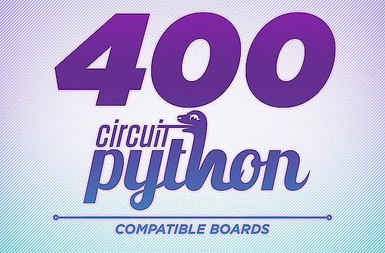](https://blog.adafruit.com/2023/05/12/there-are-now-over-400-circuitpython-compatible-microcontroller-boards-circuitpython-python-adafruit/)

There are now over 400 CircuitPython compatible microcontroller boards with a large addition this past week. They include boards from many manufacturers - these are boards from the community, companies that are not Adafruit, and entire new businesses / makers using and shipping boards with CircuitPython. Supported chips include: Espressif, Microchip SAMD, Nordic, NXP, RP2040, ST, iMX RT and more! - [Adafruit Blog](https://blog.adafruit.com/2023/05/12/there-are-now-over-400-circuitpython-compatible-microcontroller-boards-circuitpython-python-adafruit/) and [CircuitPython.org](https://circuitpython.org/).

[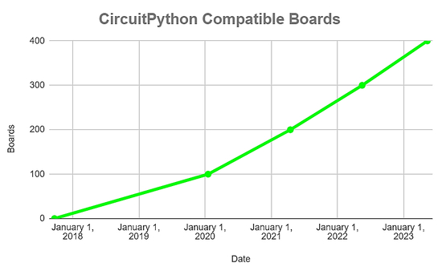](https://blog.adafruit.com/2023/05/12/there-are-now-over-400-circuitpython-compatible-microcontroller-boards-circuitpython-python-adafruit/)

The growth of CircuitPython compatible boards since 2017. It's interesting that it's been less than a year since 300 which is about two boards per week which is fabulous growth.

## Hackaday Supercon 2023 is on!

Hackaday has announced that the Hackaday Supercon is on for 2023, and will be taking place November 3 – 5 in Pasadena, California, USA.They’d like to hear your proposals for talks and workshops! The [Call for Speakers](https://docs.google.com/forms/d/e/1FAIpQLSfYDwIzWTHZ0_7d8GUznm3Z9w3y8aDcV1MVGSUyY1nTcdJ9Jw/viewform?usp=sf_link) and [Call for Workshops](https://docs.google.com/forms/d/e/1FAIpQLSeJIm0fWcrJIN8ge1K6Mvt2tfoFYOqre3isod5vKRGr-iyvJg/viewform?usp=sf_link) forms are online now, and you have until July 18th to sign up - [Adafruit Blog](https://blog.adafruit.com/2023/05/10/hackaday-supercon-2023-is-on-supercon-hackaday/) and [Hackaday](https://hackaday.com/2023/05/10/supercon-2023-is-on-we-want-you/).

## FreakWAN: a LoRa-based open WAN network

FreakWAN is an effort to create a LoRa-based open WAN network, completely independent from Internet and the cellular phones networks. It is coded in MicroPython with a SX1276 LoRa chip driver. It is possible to send encrypted messages that will reach only other users with a matching symmetric key. FreakWAN also implements its own very small, losslessy compressed 1 bit images, as a proof of concept that can send small media types over LoRa - [GitHub](https://github.com/antirez/freakwan) via [Twitter](https://twitter.com/wvdsteen/status/1656288304885530625) and [Y Combinator](https://news.ycombinator.com/item?id=35882967).

## Using MicroPython to get started with AWS IoT Core

You can use MicroPython to get started with AWS IoT Core with a recent guide by Amazon. Prototype your project to quickly test a full IoT solution. MicroPython makes it easy to connect a device to AWS IoT Core and route messages to other AWS services - [Amazon](https://aws.amazon.com/blogs/iot/using-micropython-to-get-started-with-aws-iot-core/).

## Using an RP2040 to Open a Tesla Car Charging Port

[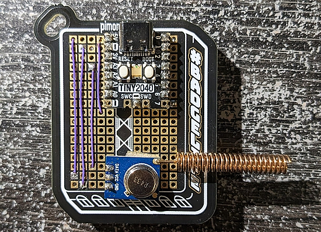](https://github.com/Algafix/pico-tesla-charging-port-opener)

Tesla's charging port signal has been known for years. "There are several projects about how to retransmit it, how to sample it for HackRF or other SDR's and how to retransmit it." This implementation uses a Tiny2040 and MicroPython - [GitHub](https://github.com/Algafix/pico-tesla-charging-port-opener).

## BIPES - An Educational Block Framework for Python on Microcontrollers

BIPES is a Block based Integrated Platform for Embedded Systems allowing text and block based programming for several types of embedded systems and Internet of Things modules using MicroPython, CircuitPython, Python or Snek. You can connect, program, debug and monitor several types of boards using network, USB or Bluetooth. Compatible boards include STM32, ESP32, ESP8266, Raspberry Pi Pico and even Arduino. BIPES is fully open source and based on HTML and JavaScript - [Web Framework](https://bipes.net.br/pico/ui/) and [Book](https://bipes.net.br/wp/book-livro/), via [Bipes4RP2040](https://jetannenbaum.github.io/Bipes4RP2040/bipes/).

## This Week's Python Streams

Python on Hardware is all about building a cooperative ecosphere which allows contributions to be valued and to grow knowledge. Below are the streams within the last week focusing on the community.

### CircuitPython Deep Dive Stream

[This week](link), Tim streamed work on {subject}.

You can see the latest video and past videos on the Adafruit YouTube channel under the Deep Dive playlist - [YouTube](https://www.youtube.com/playlist?list=PLjF7R1fz_OOXBHlu9msoXq2jQN4JpCk8A).

### CircuitPython Parsec

John Park’s CircuitPython Parsec this week is on LCD Character Displays - [Adafruit Blog](https://blog.adafruit.com/2023/05/12/john-parks-circuitpython-parsec-lcd-character-displays-adafruit-circuitpython/) and [YouTube](https://youtu.be/we9eE8_H6UU).

Catch all the episodes in the [YouTube playlist](https://www.youtube.com/playlist?list=PLjF7R1fz_OOWFqZfqW9jlvQSIUmwn9lWr).

### The CircuitPython Show

The CircuitPython Show is an independent podcast hosted by Paul Cutler, focusing on the people doing awesome things with CircuitPython. Each episode features Paul in conversation with a guest for a short interview – [CircuitPythonShow](https://circuitpythonshow.com/).

The show is off this week. The latest episode was released May 8th and features Ben Shockley. Next week, CircuitPython core developer Dan Halbert joins the show – [Show List](https://www.circuitpythonshow.com/@circuitpythonshow/episodes).

## Project of the Week: Feather RP2040 DVI & OBS Weather Station Overlay

[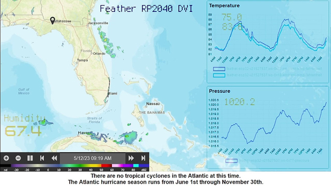](https://github.com/DJDevon3/My_Circuit_Python_Projects/tree/main/Boards/raspberrypi/Adafruit%20Feather%20RP2040%20DVI/DVI%20%26%20OBS%20Weather%20Station)

An Adafruit Feather RP2040 DVI to OBS Overlay example. Weather radar background with added data sources is pulled from local I2C temperature/humidity/pressure sensors and WipperSnapper from Adafruit IO. As seen on [Adafruit Show & Tell 5/11/2023](https://www.youtube.com/live/JajQ_SbpUxc?feature=share&t=1870) - [GitHub](https://github.com/DJDevon3/My_Circuit_Python_Projects/tree/main/Boards/raspberrypi/Adafruit%20Feather%20RP2040%20DVI/DVI%20%26%20OBS%20Weather%20Station) and [YouTube](https://www.youtube.com/watch?v=05BcstyL144) via [Mastodon](https://octodon.social/@TreasureDev@hackaday.social/110356081215193067).

## News from around the web!

[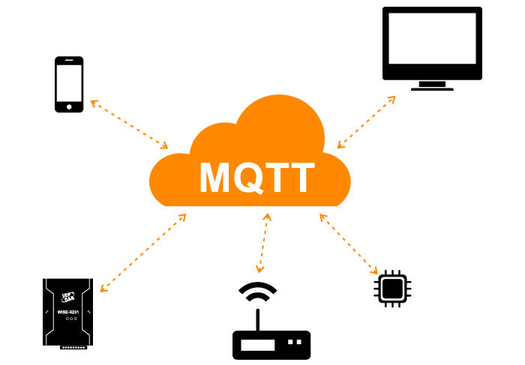](https://twitter.com/scottmonaghan/status/1656283151470063618)

> Robot makers: Do NOT sleep on MQTT. Like Franks’s Red Hot, “I put that #%$&@ in everything”. I’ve found it especially useful as a lightweight publish/subscribe model when ROS is too much overhead. I’ve even got it streaming real-time video & audio on RoBud - [Twitter](https://twitter.com/scottmonaghan/status/1656283151470063618), [GitHub (video)](https://github.com/ScottMonaghan/robud-pi/blob/main/sensors/camera.py), [GitHub (audio)](https://github.com/ScottMonaghan/robud-pi/blob/main/robud_audio/robud_audio.py).

Room status distribution system using MQTT, CO2 sensor, and a temperature/humidity/barometric pressure sensor (Japanese) - [Elchika](https://elchika.com/article/a6d2856f-95c5-4313-9c30-f029b8aca101/).

[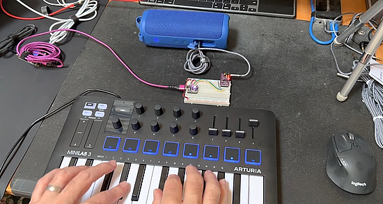](https://mastodon.social/@todbot/110357522755929547)

A new CircuitPython MIDI synth using the upcoming `synthio` library. With the Note API, one can now stack multiple detuned oscillators per note, to make really fat sounds. The entire program running on the Adafruit QT Py RP2040 is less than 100 lines long - [Mastodon](https://mastodon.social/@todbot/110357522755929547), [YouTube](https://www.youtube.com/watch?v=N-PbbWWDE6k) and [GitHub](https://gist.github.com/todbot/96a654c5fa27625147d65c45c8bfd47b).

[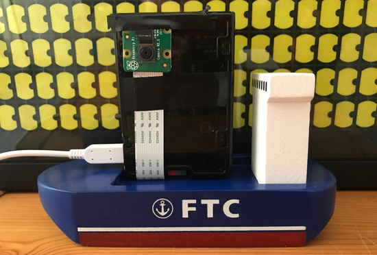](https://simonprickett.dev/taking-pictures-with-raspberry-pi-and-redis/)

Taking Pictures with Raspberry Pi and Redis - [Simon Prockett](https://simonprickett.dev/taking-pictures-with-raspberry-pi-and-redis/), [GitHub](https://github.com/simonprickett/redis-pi-camera) and [YouTube](https://www.youtube.com/watch?v=OTDZIK55DX0).

[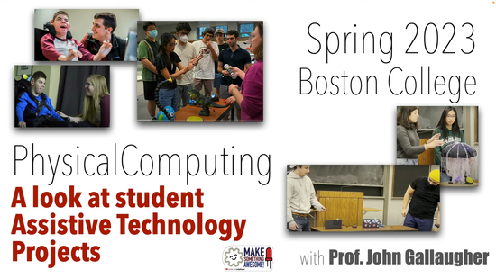](url)

Assistive Technology Projects from Boston College Physical Computing summarized in an < 3 min video. CircuitPython, Adafruit Circuit Playground Bluefruit, and Raspberry Pi Pico W boards were used throughout - [YouTube](https://www.youtube.com/watch?v=IreQ9K5bmlY) via [Twitter](https://twitter.com/gallaugher/status/1656385752480071680).

[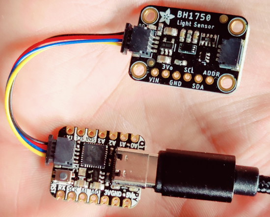](https://www.go-euc.com/measuring-latency-with-adafruit-qt-py-a-circuitpython-approach/)

Measuring Latency with Adafruit QT Py: A CircuitPython Approach - [Go-EUC](https://www.go-euc.com/measuring-latency-with-adafruit-qt-py-a-circuitpython-approach/).

The unofficial Raspberry Pi Pico Discord server has almost 1,500 members - [Discord](https://discord.com/invite/wdMxPmYn) via [Twitter](https://twitter.com/Gadgetoid/status/1655630784709943305).

[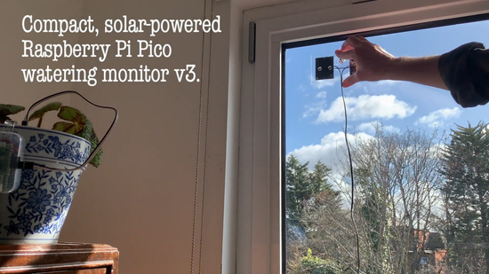](https://www.youtube.com/watch?v=-UjNNdQtsy4)

DIY solar-powered plant watering monitor using Raspberry Pi Pico and MicroPython - [YouTube](https://www.youtube.com/watch?v=-UjNNdQtsy4) via [Twitter](https://twitter.com/PaterPracticus/status/1656276443662254080).

[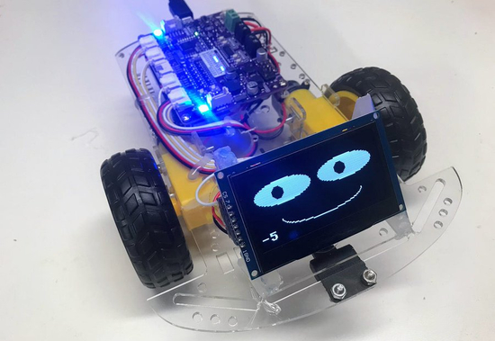](https://betterprogramming.pub/our-2023-stem-robot-update-7bcf8a2fad2e)

A build update on a STEM Robot using MicroPython - [betterprogramming.pub](https://betterprogramming.pub/our-2023-stem-robot-update-7bcf8a2fad2e).

[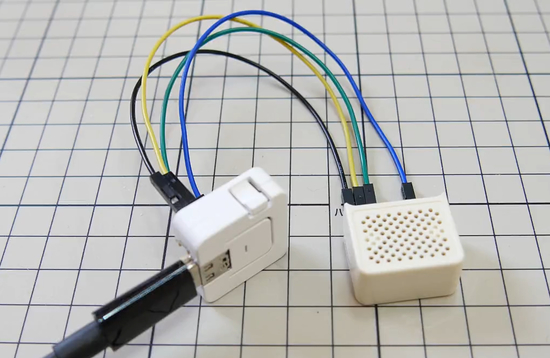](https://twitter.com/ushineko3n/status/1656103048924790785)

PDM audio playback on an ESP32-S3 with MicroPython - [Twitter](https://twitter.com/ushineko3n/status/1656103048924790785).

[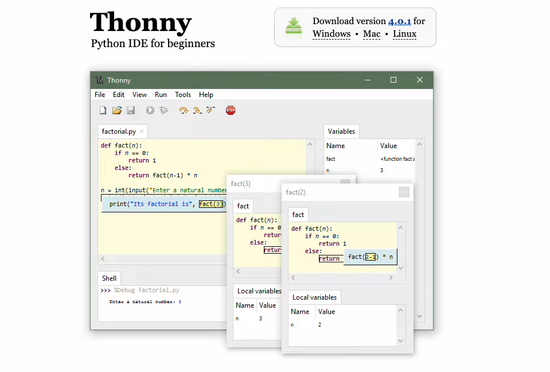](https://www.youtube.com/watch?v=BRMFH0LI30A)

How to Install CircuitPython on Raspberry Pi Pico with Thonny - [YouTube](https://www.youtube.com/watch?v=BRMFH0LI30A).

[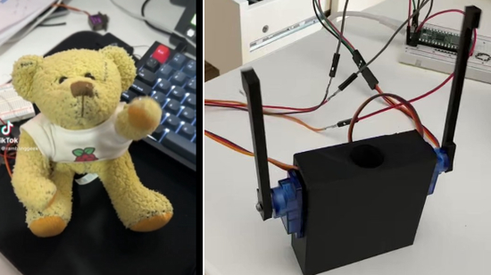](https://twitter.com/rgeekuk/status/1657844722797297667?t=xaZH1723ly7osC1gZ7T4jA&s=03)

With MicroPython, a bit of 3D printing, and a couple micro servos, Raspberry Babbage is moving - [Twitter](https://twitter.com/rgeekuk/status/1657844722797297667?t=xaZH1723ly7osC1gZ7T4jA&s=03).

text - [site](url).

text - [site](url).

text - [site](url).

text - [site](url).

[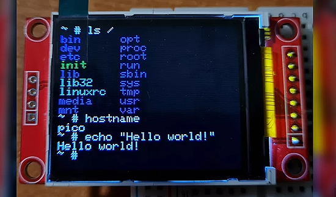](https://www.tomshardware.com/news/raspberry-pi-pico-risc-v-emulator)

A Raspberry Pi Pico RISC-V emulator runs Linux - [Tom's Hardware](https://www.tomshardware.com/news/raspberry-pi-pico-risc-v-emulator), [YouTube](https://youtu.be/txgoWddk_2I) and [GitHub](https://github.com/tvlad1234/pico-rv32ima).

PyDev of the Week: NAME on [Mouse vs Python]()

CircuitPython Weekly Meeting for DATE ([notes]()) [on YouTube]()

**#ICYDNCI What was the most popular, most clicked link, in [last week's newsletter](https://link)? [title](url).**

## Coming Soon

[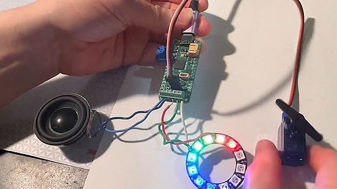](https://twitter.com/adafruit/status/1657408523649662977)

The Adafruit Prop-Maker Feather is going to be great for making props and toys that have audio, motion and LEDs. They have a quick [demo](https://github.com/adafruit/Adafruit_CircuitPython_LED_Animation) that shows off LED animations on NeoPixels, motion sensing with the [LIS3DH](https://adafruit.com/product/2809), servo output control to a micro servo, and audio playback via a 3W [I2S amplifier](https://adafruit.com/product/3006) - [Twitter](https://twitter.com/adafruit/status/1657408523649662977).

text - [site](url).

## New Boards Supported by CircuitPython

The number of supported microcontrollers and Single Board Computers (SBC) grows every week. This section outlines which boards have been included in CircuitPython or added to [CircuitPython.org](https://circuitpython.org/).

This week, there were (#/no) new boards added!

- [Board name](url)
- [Board name](url)
- [Board name](url)

*Note: For non-Adafruit boards, please use the support forums of the board manufacturer for assistance, as Adafruit does not have the hardware to assist in troubleshooting.*

Looking to add a new board to CircuitPython? It's highly encouraged! Adafruit has four guides to help you do so:

- [How to Add a New Board to CircuitPython](https://learn.adafruit.com/how-to-add-a-new-board-to-circuitpython/overview)
- [How to add a New Board to the circuitpython.org website](https://learn.adafruit.com/how-to-add-a-new-board-to-the-circuitpython-org-website)
- [Adding a Single Board Computer to PlatformDetect for Blinka](https://learn.adafruit.com/adding-a-single-board-computer-to-platformdetect-for-blinka)
- [Adding a Single Board Computer to Blinka](https://learn.adafruit.com/adding-a-single-board-computer-to-blinka)

## New Learn Guides!

[Adafruit Feather RP2040 ThinkInk](https://learn.adafruit.com/adafruit-rp2040-feather-thinkink) from [Liz Clark](https://learn.adafruit.com/u/BlitzCityDIY)

[Adafruit PiCowbell CAN Bus for Pico](https://learn.adafruit.com/adafruit-picowbell-can-bus-for-pico) from [Liz Clark](https://learn.adafruit.com/u/BlitzCityDIY)

[Adafruit CAN Bus FeatherWing](https://learn.adafruit.com/adafruit-can-bus-featherwing) from [Liz Clark](https://learn.adafruit.com/u/BlitzCityDIY)

## CircuitPython Libraries!

CircuitPython support for hardware continues to grow. We are adding support for new sensors and breakouts all the time, as well as improving on the drivers we already have. As we add more libraries and update current ones, you can keep up with all the changes right here!

For the latest libraries, download the [Adafruit CircuitPython Library Bundle](https://circuitpython.org/libraries). For the latest community contributed libraries, download the [CircuitPython Community Bundle](https://github.com/adafruit/CircuitPython_Community_Bundle/releases).

If you'd like to contribute, CircuitPython libraries are a great place to start. Have an idea for a new driver? File an issue on [CircuitPython](https://github.com/adafruit/circuitpython/issues)! Have you written a library you'd like to make available? Submit it to the [CircuitPython Community Bundle](https://github.com/adafruit/CircuitPython_Community_Bundle). Interested in helping with current libraries? Check out the [CircuitPython.org Contributing page](https://circuitpython.org/contributing). We've included open pull requests and issues from the libraries, and details about repo-level issues that need to be addressed. We have a guide on [contributing to CircuitPython with Git and GitHub](https://learn.adafruit.com/contribute-to-circuitpython-with-git-and-github) if you need help getting started. You can also find us in the #circuitpython channels on the [Adafruit Discord](https://adafru.it/discord).

You can check out this [list of all the Adafruit CircuitPython libraries and drivers available](https://github.com/adafruit/Adafruit_CircuitPython_Bundle/blob/master/circuitpython_library_list.md). 

The current number of CircuitPython libraries is **438**!

**New Libraries!**

Here's this week's new CircuitPython libraries:

  * [adafruit/Adafruit_CircuitPython_wave](https://github.com/adafruit/Adafruit_CircuitPython_wave)
  * [Uberi/biplane](https://github.com/Uberi/biplane)
  * [jposada202020/CircuitPython_STTS22H](https://github.com/jposada202020/CircuitPython_STTS22H)
  * [jposada202020/CircuitPython_BMP581](https://github.com/jposada202020/CircuitPython_BMP581)

**Updated Libraries!**

Here's this week's updated CircuitPython libraries:

  * [adafruit/Adafruit_CircuitPython_SSD1681](https://github.com/adafruit/Adafruit_CircuitPython_SSD1681)
  * [adafruit/Adafruit_CircuitPython_DisplayIO_Layout](https://github.com/adafruit/Adafruit_CircuitPython_DisplayIO_Layout)
  * [adafruit/Adafruit_CircuitPython_BluefruitConnect](https://github.com/adafruit/Adafruit_CircuitPython_BluefruitConnect)
  * [jposada202020/CircuitPython_st](https://github.com/jposada202020/CircuitPython_st)
  * [Neradoc/CircuitPython_tm1637_dis](https://github.com/Neradoc/CircuitPython_tm1637_dis)
  * [jposada202020/CircuitPython_ArrowLine](https://github.com/jposada202020/CircuitPython_ArrowLine)

**Library PyPI Weekly Download Statistics**
* **Total Library Stats**
  * 85953 PyPI downloads over 311 libraries
* **Top 10 Libraries by PyPI Downloads**
  * Adafruit CircuitPython BusDevice (adafruit-circuitpython-busdevice): 7020
  * Adafruit CircuitPython Requests (adafruit-circuitpython-requests): 6133
  * Adafruit CircuitPython Register (adafruit-circuitpython-register): 1983
  * Adafruit CircuitPython NeoPixel (adafruit-circuitpython-neopixel): 1801
  * Adafruit CircuitPython Motor (adafruit-circuitpython-motor): 1122
  * Adafruit CircuitPython PCA9685 (adafruit-circuitpython-pca9685): 1003
  * Adafruit CircuitPython MiniMQTT (adafruit-circuitpython-minimqtt): 794
  * Adafruit CircuitPython ServoKit (adafruit-circuitpython-servokit): 792
  * Adafruit CircuitPython DHT (adafruit-circuitpython-dht): 758
  * Adafruit CircuitPython Pixelbuf (adafruit-circuitpython-pixelbuf): 744

## What’s the CircuitPython team up to this week?

What is the team up to this week? Let’s check in!

**Dan**

I was away from work for a week, and am now back, fixing more things in preparation for the CircuitPython 8.1.0 release.

**Kattni**

This week, I finished up the code for the Canary Nightlight project. The main functionality is that it will either shine blue or red, depending on the time range that you configure. Most folks should be doing red at night and blue in the morning, but if you do shift work and/or need to wake up at vastly different times, you can configure it so it works for you as well. It also includes a feature to notify you when your internet is down by blinking red. As you might not want this happening in certain situations, you can easily disable this feature at the beginning of the code. This is intended for a collab guide with Noe. Noe designed an amazing 3D printed canary especially for this project! Guide is coming soon.

Other than that, I'm up to a miscellaneous list of guide updates. Making sure the misc is getting done too!

**Melissa**

This past week I added a bunch of boards to [circuitpython.org](https://circuitpython.org/). There were about 12 new CircuitPython boards added putting us at over 400 and about 19 new Blinka boards putting us at 120 boards.

**Tim**

I've been working on reviewing PRs submitted by PyCon sprinters. Going back through ones that people have followed up on after initial round of feedback. I also submitted two small fixes in the core: one an argument validation bug that could cause a hard fault if wrong types were passed to `vectorio` `Polygon`, and one to add some additional Python built-in methods to the `displayio.Group` stubs so that mypy and other code analysis tools will know its capabilities.

**Jeff**

My work was on `synthio` again this week. In the next pull request, I generalized Note 'vibrato' so the same code could do triple duty as a pitch bend or frequency sweep as well, enabled stereo output, with the Note `panning` property controlling whether it appears on the left channel, right channel, or both, and implemented 'ring modulation' which is useful for creating richer, more dynamic sounds.

**Scott**

This week I've continued working on CircuitPyrate, a CircuitPython version of Bus Pirate. (We'll likely rename it before releasing the code because CircuitPyrate and CircuitPython are *very* similar.) I've also created a CircuitPython version of the [`prompt_toolkit`](https://github.com/adafruit/Adafruit_CircuitPython_Prompt_Toolkit) library for managing the command history.

I've also been working on an e-paper weather display using the Pirate Weather API. Pirate Weather implements the Dark Sky API and the JSON responses are ~30k or so. I couldn't parse it all into memory on the Pico W so I created a [CircuitPython version of the `json_stream` library](https://github.com/adafruit/Adafruit_CircuitPython_JSON_Stream/). This allows you to work with the returned object just like the `json` module with the huge exception that you must access data in file order. The library gets the data from the stream as you ask for it and can't go backwards. This makes it use less total memory but restricts how you get the data.

**Liz**

I published two new product guides this week. The first was for the [Feather RP2040 ThinkInk](https://learn.adafruit.com/adafruit-rp2040-feather-thinkink). This Feather lets you plug in an eInk display directly to a connector on the back of the board. I also included a page on using it with the u2if firmware that lets you use desktop Python libraries with RP2040-based boards.

The second guide was for the [PiCowbell CAN Bus](https://learn.adafruit.com/adafruit-picowbell-can-bus-for-pico). It lets you use a Raspberry Pi Pico or Pico W to connect to CAN bus networks for automotive or robotics projects. 

## Upcoming events!

The next MicroPython Meetup in Melbourne will be on May 24th – [Meetup](https://www.meetup.com/MicroPython-Meetup/). From the  April 26th meeting - [Notes](https://docs.google.com/presentation/d/e/2PACX-1vS7oU-US5MN1bXTbPG4ZNFtVJuOYQx5GOdIOURQVP7ESSm08sz7M9q_vFXxCaihmjng2Sl2KwbtcGbQ/pub?slide=id.p) and [Video](https://www.youtube.com/watch?v=gKpc900G1DE).

EuroPython 2023 will be July 17-23, 2023, in Prague, Czech Republic and Remote - [EuroPython 2023](https://ep2023.europython.eu/).

The KiCad Conference (KiCon) is the largest gathering of hardware users and developers using [KiCad](https://www.kicad.org/). Following the success of the first KiCon in 2019 in Chicago, this is the second annual KiCon, and the first one in Europe. If you are interested in KiCad, as a user, developer, or contributor, this is the place to be. It will be held at the Palexco Conference Center, in A Coruña, Spain, from Sept 9th through the 10th, 2023 - [KiCon 2023](https://kicon.kicad.org/).

PyCon UK will be returning to Cardiff City Hall from Friday 22nd September to Monday 25th September 2023 - [PyCon UK](https://2023.pyconuk.org/).

**Send Your Events In**

If you know of virtual events or upcoming events, please let us know via email to cpnews(at)adafruit(dot)com.

## Latest releases

CircuitPython's stable release is [#.#.#](https://github.com/adafruit/circuitpython/releases/latest) and its unstable release is [#.#.#-##.#](https://github.com/adafruit/circuitpython/releases). New to CircuitPython? Start with our [Welcome to CircuitPython Guide](https://learn.adafruit.com/welcome-to-circuitpython).

[2023####](https://github.com/adafruit/Adafruit_CircuitPython_Bundle/releases/latest) is the latest CircuitPython library bundle.

[v#.#.#](https://micropython.org/download) is the latest MicroPython release. Documentation for it is [here](http://docs.micropython.org/en/latest/pyboard/).

[#.#.#](https://www.python.org/downloads/) is the latest Python release. The latest pre-release version is [#.#.#](https://www.python.org/download/pre-releases/).

[#,### Stars](https://github.com/adafruit/circuitpython/stargazers) Like CircuitPython? [Star it on GitHub!](https://github.com/adafruit/circuitpython)

## Call for help -- Translating CircuitPython is now easier than ever!

[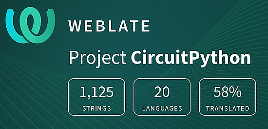](https://hosted.weblate.org/engage/circuitpython/)

One important feature of CircuitPython is translated control and error messages. With the help of fellow open source project [Weblate](https://weblate.org/), we're making it even easier to add or improve translations. 

Sign in with an existing account such as GitHub, Google or Facebook and start contributing through a simple web interface. No forks or pull requests needed! As always, if you run into trouble join us on [Discord](https://adafru.it/discord), we're here to help.

## NUMBER thanks!

The Adafruit Discord community, where we do all our CircuitPython development in the open, reached over NUMBER humans - thank you!  Adafruit believes Discord offers a unique way for Python on hardware folks to connect. Join today at [https://adafru.it/discord](https://adafru.it/discord).

## ICYMI - In case you missed it

Python on hardware is the Adafruit Python video-newsletter-podcast! The news comes from the Python community, Discord, Adafruit communities and more and is broadcast on ASK an ENGINEER Wednesdays. The complete Python on Hardware weekly videocast [playlist is here](https://www.youtube.com/playlist?list=PLjF7R1fz_OOXRMjM7Sm0J2Xt6H81TdDev). The video podcast is on [iTunes](https://itunes.apple.com/us/podcast/python-on-hardware/id1451685192?mt=2), [YouTube](http://adafru.it/pohepisodes), [IGTV (Instagram TV](https://www.instagram.com/adafruit/channel/)), and [XML](https://itunes.apple.com/us/podcast/python-on-hardware/id1451685192?mt=2).

[The weekly community chat on Adafruit Discord server CircuitPython channel - Audio / Podcast edition](https://itunes.apple.com/us/podcast/circuitpython-weekly-meeting/id1451685016) - Audio from the Discord chat space for CircuitPython, meetings are usually Mondays at 2pm ET, this is the audio version on [iTunes](https://itunes.apple.com/us/podcast/circuitpython-weekly-meeting/id1451685016), Pocket Casts, [Spotify](https://adafru.it/spotify), and [XML feed](https://adafruit-podcasts.s3.amazonaws.com/circuitpython_weekly_meeting/audio-podcast.xml).

## Contribute!

The CircuitPython Weekly Newsletter is a CircuitPython community-run newsletter emailed every Tuesday. The complete [archives are here](https://www.adafruitdaily.com/category/circuitpython/). It highlights the latest CircuitPython related news from around the web including Python and MicroPython developments. To contribute, edit next week's draft [on GitHub](https://github.com/adafruit/circuitpython-weekly-newsletter/tree/gh-pages/_drafts) and [submit a pull request](https://help.github.com/articles/editing-files-in-your-repository/) with the changes. You may also tag your information on Twitter with #CircuitPython. 

Join the Adafruit [Discord](https://adafru.it/discord) or [post to the forum](https://forums.adafruit.com/viewforum.php?f=60) if you have questions.
