- [ ] Kattni updates
- [ ] change date
- [ ] update title
- [ ] Feature story
- [ ] Update  for images
- [ ] Update ICYDNCI
- [ ] All images 550w max only
- [ ] Link "View this email in your browser."

News Sources

- [python.org](https://www.python.org/)
- [Python Insider - dev team blog](https://pythoninsider.blogspot.com/)
- [MicroPython Meetup Blog](https://melbournemicropythonmeetup.github.io/)
- [hackaday.io newest projects MicroPython](https://hackaday.io/projects?tag=micropython&sort=date) and [CircuitPython](https://hackaday.io/projects?tag=circuitpython&sort=date)
- [hackaday CircuitPython](https://hackaday.com/blog/?s=circuitpython) and [MicroPython](https://hackaday.com/blog/?s=micropython)
- [hackster.io CircuitPython](https://www.hackster.io/search?q=circuitpython&i=projects&sort_by=most_recent) and [MicroPython](https://www.hackster.io/search?q=micropython&i=projects&sort_by=most_recent)
- [https://opensource.com/tags/python](https://opensource.com/tags/python)
- [Mastodon CircuitPython](https://octodon.social/tags/CircuitPython)

View this email in your browser. **Warning: Flashing Imagery**

Welcome to the latest Python on Microcontrollers newsletter!  - *Ed.*

We're on [Discord](https://discord.gg/HYqvREz), [Twitter](https://twitter.com/search?q=circuitpython&src=typed_query&f=live), and for past newsletters - [view them all here](https://www.adafruitdaily.com/category/circuitpython/). If you're reading this on the web, [subscribe here](https://www.adafruitdaily.com/). Here's the news this week:

## Two New CircuitPython Versions Released

The CircuitPython team simultaneously released CircuitPython 8.1.0 and a new beta 8.2.0-beta.0. 8.1.0 remains unchanged from the 8.1.0 release candidate reported last week. 8.2.0-beta.0 incorporates some interesting new features:

* Continued enhancement of `synthio`.
* RP2040 `alarm.sleep_memory`.

CircuitPython 8.1.0 - [Adafruit Blog](https://blog.adafruit.com/2023/05/22/circuitpython-8-1-0-released/).

CircuitPython 8.2.0-beta.0 - [Adafruit Blog](https://blog.adafruit.com/2023/05/24/circuitpython-8-2-0-beta-0-released/) and [Release Page](https://github.com/adafruit/circuitpython/releases/tag/8.2.0-beta.0).

## zigpy-zboss library makes Nordic Semi nRF52840 Zigbee dongles compatible with Home Assistant

[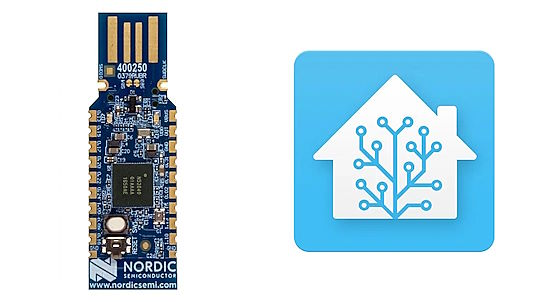](https://www.cnx-software.com/2023/05/29/zigpy-zboss-nordic-semi-nrf52840-zigbee-dongles-home-assistant/)

zigpy-zboss is a Python library that adds support for Nordic Semiconductor nRF52840 modules to zigpy open-source Python Zigbee stack project, as well as other Network Co-Processor radios that run firmware based on ZBOSS Open Initiative (ZOI). This enables integration with compatible Zigbee gateway implementations such as Home Assistant’s ZHA integration component and allows users to directly control Zigbee devices from a wide range of manufacturers such as IKEA, Philips Hue, SmartSung SmartThings, ITEAD SONOFF, Xiaomi Aqara, and others - [CNX Software](https://www.cnx-software.com/2023/05/29/zigpy-zboss-nordic-semi-nrf52840-zigbee-dongles-home-assistant/) and [GitHub](https://github.com/kardia-as/zigpy-zboss).

## Microsoft DeviceScript for Programming Microcontrollers

[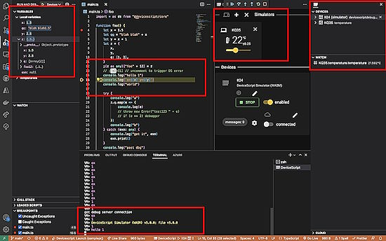](https://microsoft.github.io/devicescript/)

Microsoft has quietly released a Technical Preview of DeviceScript. It brings a professional TypeScript developer experience to low-resource microcontroller-based devices. DeviceScript is compiled to a custom VM bytecode, which can run in very constrained environments. It uses a Visual Studio Code Extension to make an Integrated Development Environment with full debugging - [GitHub](https://microsoft.github.io/devicescript/).

## Free Certification Courses in Data Science with Python from IBM

Cognative Class is offering three IBM courses in Data Science using Python - [Twitter](https://twitter.com/python_spaces/status/1662093965582282757).

* [Python for Data Science](https://cognitiveclass.ai/courses/python-for-data-science)
* [Data Analysis with Python](https://cognitiveclass.ai/courses/data-analysis-python)
* [Data Visualization with Python](https://cognitiveclass.ai/courses/data-visualization-python)

## Sending Data Between Multiple Raspberry Pi Pico W's

[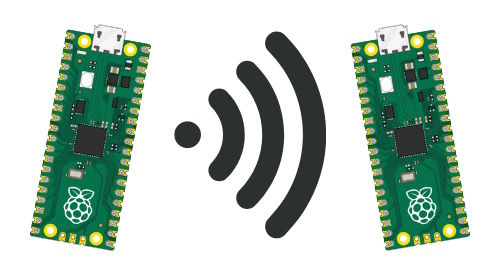](https://www.shillehtek.com/blog/sending-data-between-multiple-raspberry-pi-pico-ws-in-thonny)

Connecting multiple Raspberry Pico W’s can be essential in projects involving distributed systems. In a tutorial, ShillehTek demonstrates how to send messages between two Raspberry Pi Pico W devices using the Thonny IDE in MicroPython  - [ShillehTek](https://www.shillehtek.com/blog/sending-data-between-multiple-raspberry-pi-pico-ws-in-thonny), [GitHub](https://github.com/shillehbean/youtube-channel/blob/main/client_server_pico_w.py) and [YouTube](https://youtu.be/rJ2A3E6z4wQ).

## The Python Language Summit 2023: What is the Standard Library for?

What is the Python Standard Library for? The [Python Language Summit](the Python Language Summit) looks to answer this question - [Python Blog](https://pyfound.blogspot.com/2023/05/the-python-language-summit-2023-what-is.html).

>  "Overall, there was agreement that the original motivations for a large, 'batteries-included' standard library no longer held up to scrutiny. 'In the good old days,' Ned Deily reminisced, 'We said ‘batteries-included’ because we didn’t have a good story for third-party installation.' But in 2023, installing third-party packages from PyPI is much easier."

## This Week's Python Streams

Python on Hardware is all about building a cooperative ecosphere which allows contributions to be valued and to grow knowledge. Below are the streams within the last week focusing on the community.

### CircuitPython Deep Dive Stream

[This week](https://www.youtube.com/watch?v=pA7ZkDdmOpk), Tim is on the hunt for a Displayio bug.

You can see the latest video and past videos on the Adafruit YouTube channel under the Deep Dive playlist - [YouTube](https://www.youtube.com/playlist?list=PLjF7R1fz_OOXBHlu9msoXq2jQN4JpCk8A).

### CircuitPython Parsec

John Park’s CircuitPython Parsec this week is on S3 ("nightly") builds of CircuitPython - [Adafruit Blog](https://blog.adafruit.com/2023/05/29/john-parks-circuitpython-parsec-s3-builds-of-circuitpython-adafruit-circuitpython/) and [YouTube](https://youtu.be/wvYByaBsRU8).

Catch all the episodes in the [YouTube playlist](https://www.youtube.com/playlist?list=PLjF7R1fz_OOWFqZfqW9jlvQSIUmwn9lWr).

### The CircuitPython Show

The CircuitPython Show is an independent podcast hosted by Paul Cutler, focusing on the people doing awesome things with CircuitPython. Each episode features Paul in conversation with a guest for a short interview – [CircuitPythonShow](https://circuitpythonshow.com/) and [Twitter](https://twitter.com/circuitpyshow).

The show is off this week.  Last week featured CircuitPython core developer Dan Halbert and next week Martin Tan, author of micro:bit Projects with Python and Single Board Computers: Building STEAM Projects with Code Club and Kids' Maker Groups, joins the show.

## Project of the Week: A Handheld LoRa Messenger Using Wio Terminal

This handy LoRa messanger is built using a WIO Terminal with a QWERTY keyboard. The keyboard matrix is scanned by GPIO, with the software in CircuitPython - [Twitter](https://twitter.com/bobricius/status/1661852426452848645), [Instagram](https://www.instagram.com/p/CswkRQQI9iw/?igshid=MTc4MmM1YmI2Ng%3D%3D), [Tindie](https://www.tindie.com/products/bobricius/qwerty-keyboard-for-wio-terminal-easy-armachat/) and [YouTube](https://www.youtube.com/watch?v=d6-yy8eUZdE).

## News from around the web!

[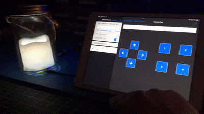](https://twitter.com/TreasureDev/status/1662720814725169153)

A rechargeable BLE Candle project. It uses an Adafruit ItsyBitsy NRG52840 RGB BLE, an electric candle, and Cedar Grove adapter. It has flicker, pulse, rainbow, code with pure PWM from scratch, no animation library is used. Controllable via a Bluetooth phone or tablet - [Twitter](https://twitter.com/TreasureDev/status/1662720814725169153) and [Mastodon](https://octodon.social/@TreasureDev@hackaday.social/110444202706988066).

An all-terrain LEGO robot climbs obstacles like no other! Built with LEGO SPIKE and coded with Pybricks MicroPython - [Twitter](https://twitter.com/laurensvalk/status/1661308541452386304).

[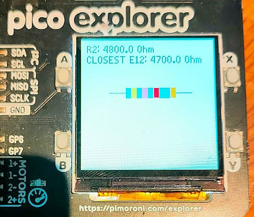](https://twitter.com/rareblog/status/1662128850413793282)

Measuring a resistor using a voltage divider to find the nearest E12 value and draw a picture of the resistor. Written in MicroPython on a Pimoroni
 Pico Explorer Base with a Raspberry Pi Pico - [Twitter](https://twitter.com/rareblog/status/1662128850413793282).

[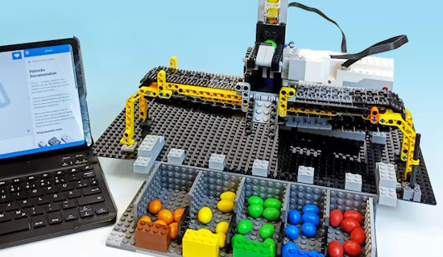](https://www.heise.de/ratgeber/Pybricks-Lego-Roboter-mit-Python-steuern-9050077.html)

Pybricks: Control a LEGO robot with Python to sort colored candies - [Heise Online](https://www.heise.de/ratgeber/Pybricks-Lego-Roboter-mit-Python-steuern-9050077.html) via [Twitter](https://twitter.com/heiseonline/status/1658471382416789507).

An MQTT communications protocol primer - [Kev's Robots](https://www.kevsrobots.com/resources/how_it_works/mqtt.html).

[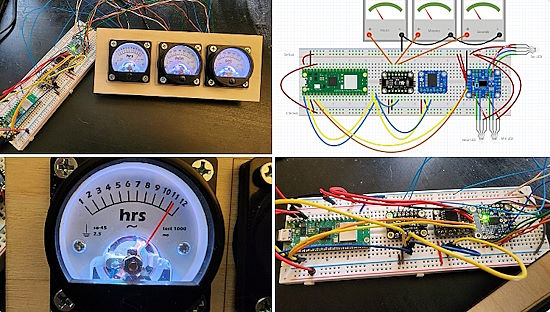](https://twitter.com/NetEng_Ian/status/1661131594797809665)

Remaking an analog meter clock with Raspberry Pi Pico and CircuitPython - [Twitter Thread](https://twitter.com/NetEng_Ian/status/1661131594797809665).

[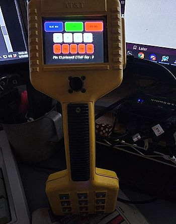](https://twitter.com/A_P_Delchi/status/1661177056531546112)

An old telephony linesman set is upgraded with an Adafruit PyPortal and CircuitPython - [Twitter Thread](https://twitter.com/A_P_Delchi/status/1661177056531546112).

[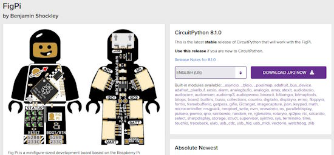](https://octodon.social/@ben_shockley@mastodon.social/110424176121503858)

CircuiPython 8.1.0 fully supports the Fig Pi boards (RP2040 microcontroller boards shaped like LEGO Minifigs) as well as Mini SAM M4. Upgrading the firmware is as easy as booting into BOOT mode, and dragging the new firmware from https://circuitpython.org/board/bwshockley_figpi/ onto the drive that shows up - [Mastodon](https://octodon.social/@ben_shockley@mastodon.social/110424176121503858).

[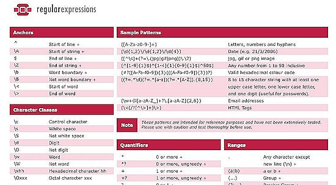](https://twitter.com/c4ml_/status/1660533561081081859/photo/1)

A Python Regular Expressions Cheatsheet - [Twitter](https://twitter.com/c4ml_/status/1660533561081081859/photo/1).

[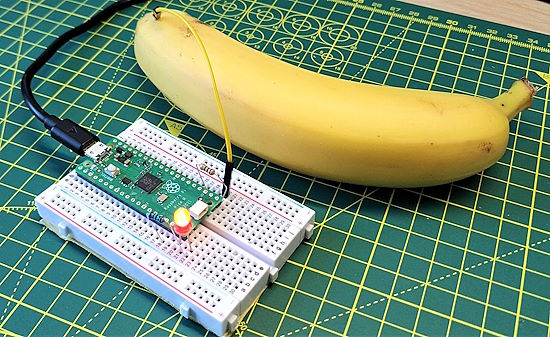](https://twitter.com/biglesp/status/1662464746149363713)

With a handful of really cheap electronics, a Raspberry Pi Pico and CircuitPython, oh and a banana, you too can turn an LED on/off - [Tom's Hardware](https://www.tomshardware.com/how-to/raspberry-pi-pico-banana-touch-input) via [Twitter](https://twitter.com/biglesp/status/1662464746149363713).

[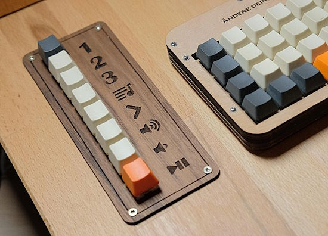](https://medium.com/@geheimbund/mediainterface-howto-dcfd5e7e41b4)

A media keyboard with Raspberry Pi and Python - [Medium](https://medium.com/@geheimbund/mediainterface-howto-dcfd5e7e41b4) via [Reddit](https://www.reddit.com/r/MechanicalKeyboards/comments/zf26t5/howto_mediainterface/).

[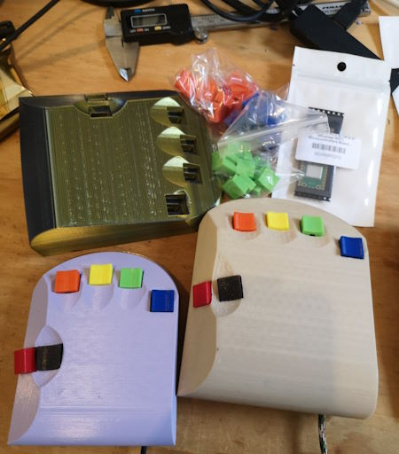](https://twitter.com/VikOlliver/status/1661186354271666176)

Extending the Quirkey chord keyboard code to work with 3D printed modern replicas programmed in CircuitPython - [Twitter](https://twitter.com/VikOlliver/status/1661186354271666176) and [GitHub](https://github.com/VikOlliver/Quirkey).

[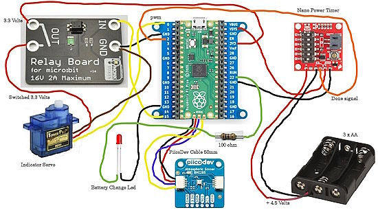](https://twitter.com/CoreElecAU/status/1662594945901838341)

A Raspberry Pi Pico powered Barometer featuring the PiicoDev atmospheric sensor programmed in MicroPython to point out the weather conditions - [Twitter](https://twitter.com/CoreElecAU/status/1662594945901838341) and [Guide](https://core-electronics.com.au/projects/pico-baro-v2/).

[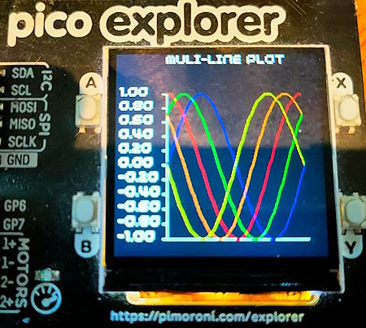](https://twitter.com/rareblog/status/1661344739168247809)

Plotting with the Pimoroni Pico Explorer Base. The Raspberry Pi Pico has the memory and power to do this using MicroPython - [Twitter](https://twitter.com/rareblog/status/1661344739168247809).

[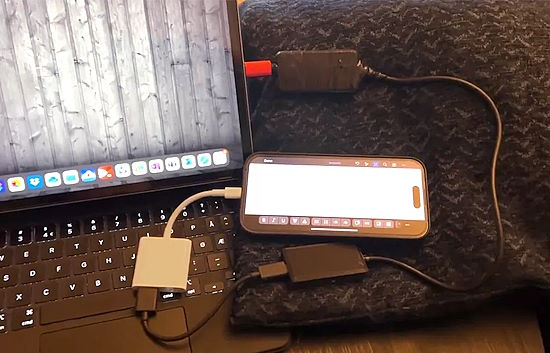](https://www.tomshardware.com/news/raspberry-pi-ipad-hid-adapter)

Raspberry Pi Adapter Sends Keyboard Input From iPad via HID to Devices - [Tom's Hardware](https://www.tomshardware.com/news/raspberry-pi-ipad-hid-adapter).

[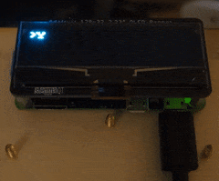](https://www.reddit.com/r/adafruit/comments/13ofzd8/chatgpt_on_adafruit_128x32_oled_display/)

ChatGPT running on a Raspberry Pi W with an Adafruit LCD display via Python - [Reddit](https://www.reddit.com/r/adafruit/comments/13ofzd8/chatgpt_on_adafruit_128x32_oled_display/) and [GitHub](https://github.com/ThomasBurgess2000/AlphaPi/blob/master/AlphaPi/alphapichat.py).

[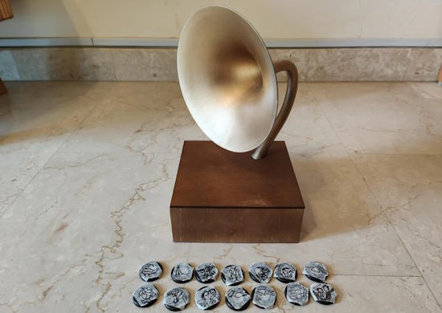](https://www.instructables.com/Raspberry-Pi-Gramophone/)

Raspberry Pi Gramophone with Python - [Instructables](https://www.instructables.com/Raspberry-Pi-Gramophone/) and [YouTube](https://youtu.be/tPRoDP0BIKs).

Keyboard Builders' Digest, Issue 123 - [kbd.news](https://kbd.news/issue/123/) via [Twitter](https://twitter.com/KbdNews/status/1661357993684762624).

PyDev of the Week: NAME on [Mouse vs Python]()

CircuitPython Weekly Meeting for DATE ([notes]()) [on YouTube]()

**#ICYDNCI What was the most popular, most clicked link, in [last week's newsletter](https://link)? [title](url).**

## Coming Soon

text - [site](url).

[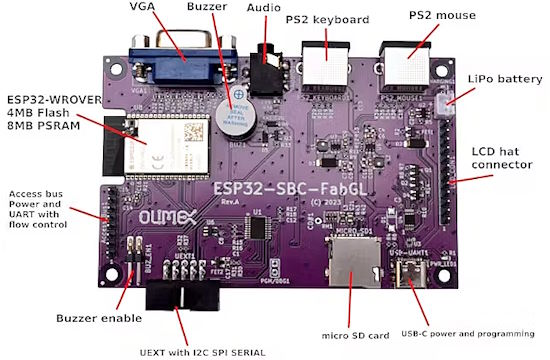](https://www.hackster.io/news/olimex-shows-off-an-esp32-open-hardware-single-board-computer-built-specifically-for-fabgl-a3a5bb28cc38)

Olimex shows off an ESP32-WROVER Open-Hardware Single-Board Computer built specifically for Fabrizio Di Vittorio's [FabGL library](http://www.fabglib.org/). This new board can power emulated PCs, handheld games consoles, and more - [hackster.io](https://www.hackster.io/news/olimex-shows-off-an-esp32-open-hardware-single-board-computer-built-specifically-for-fabgl-a3a5bb28cc38).

## New Boards Supported by CircuitPython

The number of supported microcontrollers and Single Board Computers (SBC) grows every week. This section outlines which boards have been included in CircuitPython or added to [CircuitPython.org](https://circuitpython.org/).

This week, there were (#/no) new boards added!

- [Board name](url)
- [Board name](url)
- [Board name](url)

*Note: For non-Adafruit boards, please use the support forums of the board manufacturer for assistance, as Adafruit does not have the hardware to assist in troubleshooting.*

Looking to add a new board to CircuitPython? It's highly encouraged! Adafruit has four guides to help you do so:

- [How to Add a New Board to CircuitPython](https://learn.adafruit.com/how-to-add-a-new-board-to-circuitpython/overview)
- [How to add a New Board to the circuitpython.org website](https://learn.adafruit.com/how-to-add-a-new-board-to-the-circuitpython-org-website)
- [Adding a Single Board Computer to PlatformDetect for Blinka](https://learn.adafruit.com/adding-a-single-board-computer-to-platformdetect-for-blinka)
- [Adding a Single Board Computer to Blinka](https://learn.adafruit.com/adding-a-single-board-computer-to-blinka)

## New Learn Guides!

[title](url) from [name](url)

[title](url) from [name](url)

[title](url) from [name](url)

## Updated Learn Guides!

[title](url) from [name](url)

## CircuitPython Libraries!

CircuitPython support for hardware continues to grow. We are adding support for new sensors and breakouts all the time, as well as improving on the drivers we already have. As we add more libraries and update current ones, you can keep up with all the changes right here!

For the latest libraries, download the [Adafruit CircuitPython Library Bundle](https://circuitpython.org/libraries). For the latest community contributed libraries, download the [CircuitPython Community Bundle](https://github.com/adafruit/CircuitPython_Community_Bundle/releases).

If you'd like to contribute, CircuitPython libraries are a great place to start. Have an idea for a new driver? File an issue on [CircuitPython](https://github.com/adafruit/circuitpython/issues)! Have you written a library you'd like to make available? Submit it to the [CircuitPython Community Bundle](https://github.com/adafruit/CircuitPython_Community_Bundle). Interested in helping with current libraries? Check out the [CircuitPython.org Contributing page](https://circuitpython.org/contributing). We've included open pull requests and issues from the libraries, and details about repo-level issues that need to be addressed. We have a guide on [contributing to CircuitPython with Git and GitHub](https://learn.adafruit.com/contribute-to-circuitpython-with-git-and-github) if you need help getting started. You can also find us in the #circuitpython channels on the [Adafruit Discord](https://adafru.it/discord).

You can check out this [list of all the Adafruit CircuitPython libraries and drivers available](https://github.com/adafruit/Adafruit_CircuitPython_Bundle/blob/master/circuitpython_library_list.md). 

The current number of CircuitPython libraries is **###**!

**New Libraries!**

Here's this week's new CircuitPython libraries:

* [library](url)

**Updated Libraries!**

Here's this week's updated CircuitPython libraries:

* [library](url)

**Library Statistics**

## What’s the CircuitPython team up to this week?

What is the team up to this week? Let’s check in!

**Dan**

I released CircuitPython 8.1.0 final on Monday May 22, and followed quickly with CircuitPython. 8.2.0-beta.0 on Wednesday, May 24. It's great to have 8.1.0 out the door.

We'll continue to work on 8.2.0, which will probably appear as a stable release relatively soon. However, I'm also working toward the longer range goal of 9.0.0. The first task is to merge the MicroPython v1.19.1 changes; later someone else may do the v1.20 changes.

I also spruced up the Adafruit Forums a bit last week. I updated subforum titles and descriptions, and moved a few forums around.

**Kattni**

This week I published the [Canary Nightlight](https://learn.adafruit.com/canary-nightlight) guide. In this project, you'll build a little glowing friend to watch over you from the outlet by the light switch. This 3D printed canary lights up blue when it's your time to be awake, and red when it's your time to sleep. As well, it watches over you by telling you when your internet is down by blinking red. The code is _super_ customisable, so you can change the timing, colors, and brightness to whatever works for you, or disable the network down detection if that isn't your thing. Not to put to fine a point on it, but you should definitely check out this guide!

**Melissa**

This week, I worked with Erin to finish up the [Magic Storybook with ChatGPT learn guide](https://learn.adafruit.com/magic-storybook-with-chatgpt/usage). I wrote the Software Setup and Usage pages. I was able to fix the majority of the bugs, but being that this project is as complex as it is, there are likely some cases where bugs can occur. It was a joy to work with Erin and she kept me on my toes by finding bugs that I had overlooked.

**Tim**

This week I finalized testing and reviews on an update to the `HTTPServer` library that brings many new features and improved functionality. I've also submitted a few changes for the requests, and `websocket` libraries to allow more control over redirect behavior and headers sent to open the socket respectively. I've continued building an API for NeoPixels and DotStars on top of the upgraded `HTTPServer` library, dynamically import animations are the latest feature added.

**Jeff**

After several weeks of work, I think that CircuitPython's new synthesizer support is pretty complete. You can check it out in the new beta of CircuitPython 8.2! Thanks to all who helped educate me during this project. I can't wait to see what folks do with this new capability.

**Scott**

This week I've been bouncing between [MCU flasher](https://github.com/adafruit/Adafruit_CircuitPython_MCU_Flasher) and the [Pyrate](https://github.com/adafruit/Circuit_Pyrate/) code bases. MCU flasher needs a little reorg and polish. Pyrate has many more modes to implement. I got the prototype board, so I've been making that work fully. You can now toggle power supplies, pull ups and use SPI mode.

**Liz**

This week I published a guide for the new [ANO encoder STEMMA QT breakout](https://learn.adafruit.com/adafruit-ano-rotary-navigation-encoder-to-i2c-stemma-qt-adapter). This breakout uses an ATtiny816 to run seesaw firmware. This makes wiring up one of these encoders super easy. It makes it so much easier that I started working on a project with five of them to build a synth using the new synthio module in CircuitPython. The circular shape of the encoders has inspired the evolution of the synth to use Euclidean rhythms and advance chords using the circle of fifths. 

## Upcoming events!

The next MicroPython Meetup in Melbourne will be on June 28th – [Meetup](https://www.meetup.com/MicroPython-Meetup/). From the May 24th meeting - [Notes](https://docs.google.com/presentation/d/e/2PACX-1vQ3rvNGR3NyBkSc6t1nXMoGvNuf9Btq10ZQR-4DagW5q4cbPtGMZXOoRRRo2wWOi2u7xH-Bf_HTBjb2/pub?slide=id.p).

EuroPython 2023 will be July 17-23, 2023, in Prague, Czech Republic and Remote - [EuroPython 2023](https://ep2023.europython.eu/).

PyCon UK will be returning to Cardiff City Hall from Friday 22nd September to Monday 25th September 2023 - [PyCon UK](https://2023.pyconuk.org/).

Hackaday has announced that the Hackaday Supercon is on for 2023, and will be taking place November 3 – 5 in Pasadena, California, USA.They’d like to hear your proposals for talks and workshops! The [Call for Speakers](https://docs.google.com/forms/d/e/1FAIpQLSfYDwIzWTHZ0_7d8GUznm3Z9w3y8aDcV1MVGSUyY1nTcdJ9Jw/viewform?usp=sf_link) and [Call for Workshops](https://docs.google.com/forms/d/e/1FAIpQLSeJIm0fWcrJIN8ge1K6Mvt2tfoFYOqre3isod5vKRGr-iyvJg/viewform?usp=sf_link) forms are online now, and you have until July 18th to sign up - [Adafruit Blog](https://blog.adafruit.com/2023/05/10/hackaday-supercon-2023-is-on-supercon-hackaday/) and [Hackaday](https://hackaday.com/2023/05/10/supercon-2023-is-on-we-want-you/).

**Send Your Events In**

If you know of virtual events or upcoming events, please let us know via email to cpnews(at)adafruit(dot)com.

## Latest releases

CircuitPython's stable release is [#.#.#](https://github.com/adafruit/circuitpython/releases/latest) and its unstable release is [#.#.#-##.#](https://github.com/adafruit/circuitpython/releases). New to CircuitPython? Start with our [Welcome to CircuitPython Guide](https://learn.adafruit.com/welcome-to-circuitpython).

[2023####](https://github.com/adafruit/Adafruit_CircuitPython_Bundle/releases/latest) is the latest CircuitPython library bundle.

[v#.#.#](https://micropython.org/download) is the latest MicroPython release. Documentation for it is [here](http://docs.micropython.org/en/latest/pyboard/).

[#.#.#](https://www.python.org/downloads/) is the latest Python release. The latest pre-release version is [#.#.#](https://www.python.org/download/pre-releases/).

[#,### Stars](https://github.com/adafruit/circuitpython/stargazers) Like CircuitPython? [Star it on GitHub!](https://github.com/adafruit/circuitpython)

## Call for help -- Translating CircuitPython is now easier than ever!

[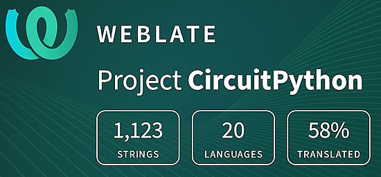](https://hosted.weblate.org/engage/circuitpython/)

One important feature of CircuitPython is translated control and error messages. With the help of fellow open source project [Weblate](https://weblate.org/), we're making it even easier to add or improve translations. 

Sign in with an existing account such as GitHub, Google or Facebook and start contributing through a simple web interface. No forks or pull requests needed! As always, if you run into trouble join us on [Discord](https://adafru.it/discord), we're here to help.

## NUMBER thanks!

The Adafruit Discord community, where we do all our CircuitPython development in the open, reached over NUMBER humans - thank you!  Adafruit believes Discord offers a unique way for Python on hardware folks to connect. Join today at [https://adafru.it/discord](https://adafru.it/discord).

## ICYMI - In case you missed it

Python on hardware is the Adafruit Python video-newsletter-podcast! The news comes from the Python community, Discord, Adafruit communities and more and is broadcast on ASK an ENGINEER Wednesdays. The complete Python on Hardware weekly videocast [playlist is here](https://www.youtube.com/playlist?list=PLjF7R1fz_OOXRMjM7Sm0J2Xt6H81TdDev). The video podcast is on [iTunes](https://itunes.apple.com/us/podcast/python-on-hardware/id1451685192?mt=2), [YouTube](http://adafru.it/pohepisodes), [IGTV (Instagram TV](https://www.instagram.com/adafruit/channel/)), and [XML](https://itunes.apple.com/us/podcast/python-on-hardware/id1451685192?mt=2).

[The weekly community chat on Adafruit Discord server CircuitPython channel - Audio / Podcast edition](https://itunes.apple.com/us/podcast/circuitpython-weekly-meeting/id1451685016) - Audio from the Discord chat space for CircuitPython, meetings are usually Mondays at 2pm ET, this is the audio version on [iTunes](https://itunes.apple.com/us/podcast/circuitpython-weekly-meeting/id1451685016), Pocket Casts, [Spotify](https://adafru.it/spotify), and [XML feed](https://adafruit-podcasts.s3.amazonaws.com/circuitpython_weekly_meeting/audio-podcast.xml).

## Contribute!

The CircuitPython Weekly Newsletter is a CircuitPython community-run newsletter emailed every Tuesday. The complete [archives are here](https://www.adafruitdaily.com/category/circuitpython/). It highlights the latest CircuitPython related news from around the web including Python and MicroPython developments. To contribute, edit next week's draft [on GitHub](https://github.com/adafruit/circuitpython-weekly-newsletter/tree/gh-pages/_drafts) and [submit a pull request](https://help.github.com/articles/editing-files-in-your-repository/) with the changes. You may also tag your information on Twitter with #CircuitPython. 

Join the Adafruit [Discord](https://adafru.it/discord) or [post to the forum](https://forums.adafruit.com/viewforum.php?f=60) if you have questions.
