- [ ] Kattni updates
- [ ] change date
- [ ] update title
- [ ] Feature story
- [ ] Update  for images
- [ ] Update ICYDNCI
- [ ] All images 550w max only
- [ ] Link "View this email in your browser."

News Sources

- Twitter: [CircuitPython](https://twitter.com/search?q=circuitpython&src=typed_query&f=live), [MicroPython](https://twitter.com/search?q=micropython&src=typed_query&f=live) and [Python](https://twitter.com/search?q=python&src=typed_query)
- Mastodon [CircuitPython](https://octodon.social/tags/CircuitPython) and [MicroPython](https://octodon.social/tags/MicroPython)
- [python.org](https://www.python.org/)
- [Python Insider - dev team blog](https://pythoninsider.blogspot.com/)
- [MicroPython Meetup Blog](https://melbournemicropythonmeetup.github.io/)
- [hackaday.io newest projects MicroPython](https://hackaday.io/projects?tag=micropython&sort=date) and [CircuitPython](https://hackaday.io/projects?tag=circuitpython&sort=date)
- [hackaday CircuitPython](https://hackaday.com/blog/?s=circuitpython) and [MicroPython](https://hackaday.com/blog/?s=micropython)
- [hackster.io CircuitPython](https://www.hackster.io/search?q=circuitpython&i=projects&sort_by=most_recent) and [MicroPython](https://www.hackster.io/search?q=micropython&i=projects&sort_by=most_recent)
- [https://opensource.com/tags/python](https://opensource.com/tags/python)
- Check Issues and PRs for input

Information Links

- [Last weeks Stats & Subscribers](https://us10.admin.mailchimp.com/campaigns/show?id=569021) - Mailchimp (login needed)
- [Last Week's Newsletter](https://www.adafruitdaily.com/category/circuitpython/) - adafruitdaily.com
- New CircuitPython Boards: [Microcontrollers](https://circuitpython.org/downloads?sort-by=date-desc) and [Blinka](https://circuitpython.org/blinka?sort-by=date-desc). Compare with [last week](https://www.adafruitdaily.com/category/circuitpython/)
- [Team Updates](https://3.basecamp.com/3732686/buckets/4356693/questions/1994563901) - Basecamp, internal data
- [Weblate latest graphic](https://hosted.weblate.org/widgets/circuitpython/#open) - crop and resize to 550px, name yyddmmweblate.jpg
- Discord Users: Use **/serverinfo** in any channel to get the user count
- For Weblate graphic, go [here](https://hosted.weblate.org/widgets/circuitpython/), click the last one then copy the full size, cut down via photo editor and resize to 550px
- Get Deep Dive info from Adafruit YouTube [Live](https://studio.youtube.com/channel/UCpOlOeQjj7EsVnDh3zuCgsA/videos/live?filter=%5B%5D&sort=%7B%22columnType%22%3A%22date%22%2C%22sortOrder%22%3A%22DESCENDING%22%7D) and CircuitPython Parsec from John Park posting on the [Adafruit Blog](https://blog.adafruit.com/?s=parsec)

View this email in your browser. **Warning: Flashing Imagery**

Welcome to the latest Python on Microcontrollers newsletter! *insert 2-3 sentences from editor (what's in overview, banter) - Ed.*

We're on [Discord](https://discord.gg/HYqvREz), [Twitter](https://twitter.com/search?q=circuitpython&src=typed_query&f=live), and for past newsletters - [view them all here](https://www.adafruitdaily.com/category/circuitpython/). If you're reading this on the web, [subscribe here](https://www.adafruitdaily.com/). Here's the news this week:

## CircuitPython 8.2.0 Released

CircuitPython 8.2.0, the latest minor revision of CircuitPython, has a new stable release. - [Adafruit Blog](https://blog.adafruit.com/2023/07/05/circuitpython-8-2-0-released/) and [GitHub release page](https://github.com/adafruit/circuitpython/releases/tag/8.2.0).

**Notable changes to 8.2.0 since 8.1.0**

- Continued enhancement of `synthio`.
- RP2040 `alarm.sleep_memory`.

## Thonny 4.1.0 Released

[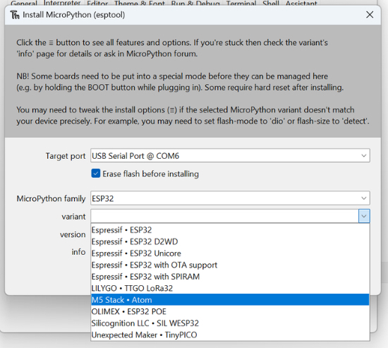]

The Thonny Python IDE has released 4.1.0.  It includes an ESP flashing dialog that allows you to select from a list of known MicroPython or CircuitPython boards and downloads them for you, comes with Python 3.10, as well as additional updates.  [Twitter](https://twitter.com/thonnyide/status/1665220202219335681) and [Release Notes on GitHub](https://github.com/thonny/thonny/releases/tag/v4.1.0).

## United Kingdom Primary Schools to get free BBC micro:bits

[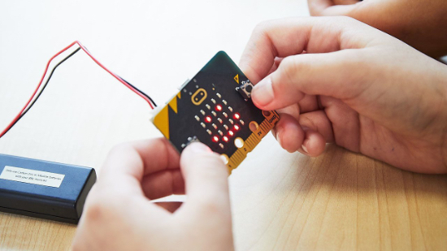](https://www.bbc.co.uk/teach/microbit/register-free-microbit/zxrp3qt)

The BBC has announced their new campaign, the BBC micro:bit - the next gen, to empower primary school children aged 8 to 11 to gain digital skills.

Each primary school in the UK can register to claim 30 micro:bits.  The campaign is sponsored by the Micro:bit Educational Foundation and Nominet, who made the donation possible.

Teachers will be able to access training on the micro:bit in person and online. - [BBC](https://www.bbc.co.uk/teach/microbit/register-free-microbit/zxrp3qt).

## IoT with Raspberry Pi Pico in Kenya

[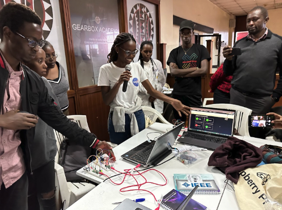](https://www.raspberrypi.com/news/iot-with-raspberry-pi-pico-in-kenya/)

The Raspberry Pi Foundation provided free workshops in Kenya last month for the hardware community around Nairobi.  In partnership with Gearbox and Safaricom, they started with a Raspberry Pi Pico W and MicroPython.

The participants started by learning the basis of MicroPython and blinking an LED.  From there they moved to more advanced topics, including how to work with motion and proximity sensors, and environmental sensors.

Lastly, they connected the Raspberry Pi Pico W to the Internet and used Adafruit IO, Adafruit's cloud platform for IoT, to graph their data, set up alerts, and create dashboards. - [Raspberry Pi](https://www.raspberrypi.com/news/iot-with-raspberry-pi-pico-in-kenya/)

## Tech Preview of PyScript released

[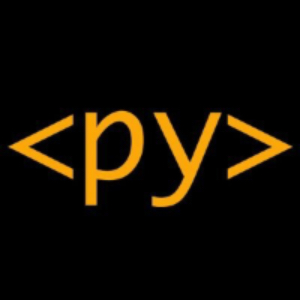](https://github.com/pyscript/pyscript/discussions/1571)

PyScript has announced the Tech-Preview Release of the new PyScript core.  PyScript is a framework that allows users to create rich Python applications in the browser using HTML's interface and the power of Pyodide, WASM, and modern web technologies. Using MicroPython as the core, PyScript sees a massive size reduction with the core library being only 10kb compressed, a reduction of 98%, and improves speed and performance. - [Announcement on GitHub](https://github.com/pyscript/pyscript/discussions/1571).

## PSF Board Election Results

The Python Software Foundation has released the results of the recent 2023 PSF Board Election.  Congratulations to Board members-elect Cheuk Tink Ho, Denny Perez, Georgi Ker, Christopher Neugebauer, and KwonHan Bae. - [PSF News](https://pyfound.blogspot.com/2023/06/announcing-2023-psf-board-election.html).

## This Week's Python Streams

Python on Hardware is all about building a cooperative ecosphere which allows contributions to be valued and to grow knowledge. Below are the streams within the last week focusing on the community.

### CircuitPython Deep Dive Stream

[This week](link), Tim streamed work on {subject}.

You can see the latest video and past videos on the Adafruit YouTube channel under the Deep Dive playlist - [YouTube](https://www.youtube.com/playlist?list=PLjF7R1fz_OOXBHlu9msoXq2jQN4JpCk8A).

### CircuitPython Parsec

John Park’s CircuitPython Parsec this week is on the Circuit Playground library in CircuitPython. - [Adafruit Blog](link) and [YouTube](link).

Catch all the episodes in the [YouTube playlist](https://www.youtube.com/playlist?list=PLjF7R1fz_OOWFqZfqW9jlvQSIUmwn9lWr).

## Project of the Week: Simple Audio Book Reader

[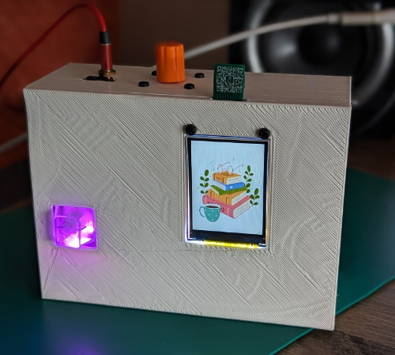](https://learn.adafruit.com/u/ntynen/pages/simple-audio-book-reader)

The Simple Audio Book Reader allows you to enjoy audio books without having to be connected to the internet or use an app.   It  supports WAV file playback and automatically moves from chapter to chapter and book to book.

The Simple Audio Book reader's main parts include a Feather rp2040, a 320x240 Color TFT Display with microSD card, and an Adafruit I2S Class D Amplifier.  Also included are the CAD, Fritzing and STL files for 3d Printing the enclosure.

User nytnen created their own Learn Guide for the project.  It includes more photos, parts list, soldering guide, and how to code it. -  [Simple Audio Book Reader Learn Guide](https://learn.adafruit.com/u/ntynen/pages/simple-audio-book-reader) and [GitHub](https://github.com/niccit/cyborg-reader)

## News from around the web!

[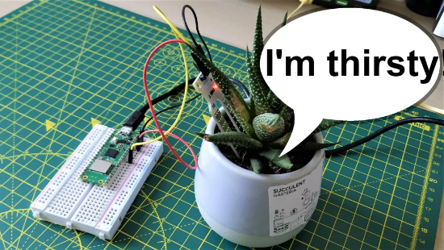](https://www.tomshardware.com/how-to/monitor-houseplants-raspberry-pi-pico)

Les Pounder of Tom's Hardware shares how to monitor if your houseplants need water using a Raspberry Pi Pico W, Telegram, and Micropython. - [Tom's Hardware](https://www.tomshardware.com/how-to/monitor-houseplants-raspberry-pi-pico).

[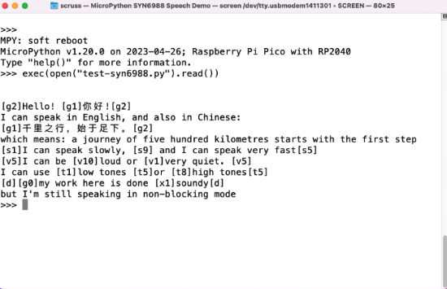](https://github.com/scruss/micropython-SYN6988)

scruss ported his Text to Speech libray using a YuTone VoiceTX SYN6899 in MicroPython to CircuitPython. - [GitHub](https://github.com/scruss/micropython-SYN6988).

[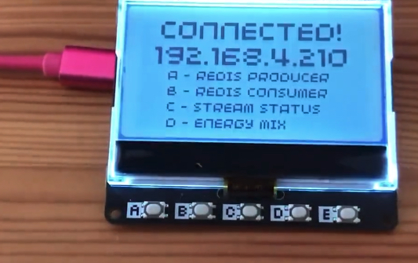](https://twitter.com/simon_prickett/status/1675818486801608704?s=20)

Simon Prickett used a Pimoroni GFX Pack an, Redis, and MicroPython to view the engergy generation mix by postcode. - [Twitter](https://twitter.com/simon_prickett/status/1675818486801608704?s=20).

Using CircuitPython, Andrew Kleindolph created and sells Soft Thoughts, an interactive piece that glows in blues, purples and whites. - [Twitter](https://twitter.com/akleindolph/status/1675285126870351874?s=20) and [Extra Sleepy](http://www.extrasleepy.com/#/soft-thoughts/).

[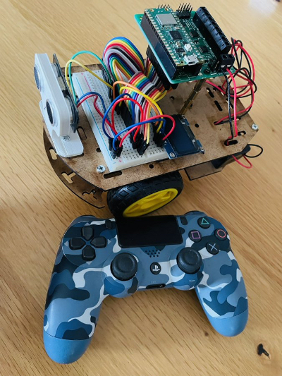](https://twitter.com/r_schulz_maker/status/1676256638657875970)

Roland Shulz used a Raspberry Pi Pico, MicroPython, and a Kitronik Robotics board to connect to a Playstation 4 controller. - [Twitter](https://twitter.com/r_schulz_maker/status/1676256638657875970).

[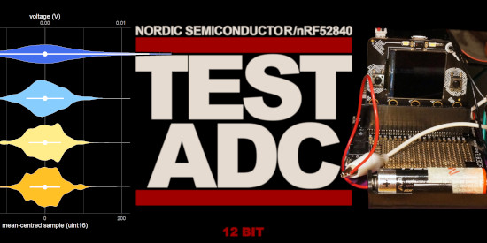](https://www.instructables.com/Exploring-and-Reducing-ADC-Noise-on-Adafruit-CLUE-/)

A look at measuring voltages using the Nordic nRF52840-based Adafruit CLUE's analog-to-digital converter (ADC) and CircuitPython, focused on analysis of noise and software techniques for improving accuracy - [Instructables](https://www.instructables.com/Exploring-and-Reducing-ADC-Noise-on-Adafruit-CLUE-/).

[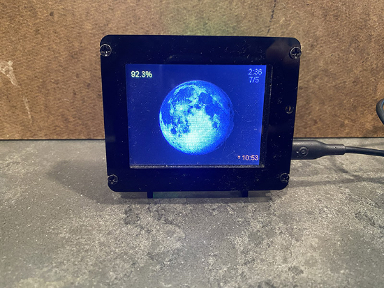]

A PyPortal project to display the current moon phase. - [Adafruit forums](https://forums.adafruit.com/viewtopic.php?t=202370&start=15)

The CircuitPython Weekly Meeting will be back next week! The next meeting is Monday, July 10th, 2023.

**#ICYDNCI What was the most popular, most clicked link, in [last week's newsletter](https://www.adafruitdaily.com/2023/07/04/python-on-microcontrollers-newsletter-raspberry-pi-going-strong-projects-and-much-more-circuitpython-python-micropython-thepsf-raspberry_pi/)? [Tom's Hardwware PiCast](https://www.youtube.com/watch?v=BU3dnNQF2uE).**

## New Boards from Around the Web

[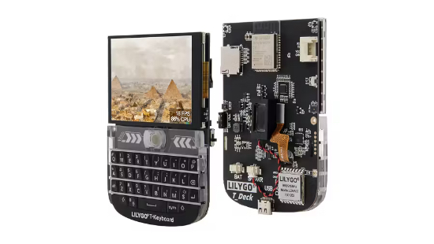]

The LILYGO T-Deck is a BlackBerry like handheld using an Espressif ESP32-S3. [Hacker.io](https://www.hackster.io/news/lilygo-s-t-deck-is-an-espressif-esp32-s3-powered-blackberry-like-handheld-dev-board-f96abddac8ea)

[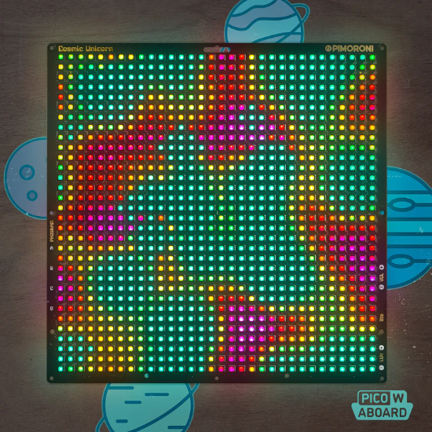]

Pimoroni announced a new Stellar Unicorn, a 16x16 256 pixel Smart LED Matrix powered by a Raspberry Pi Pico W. [Twitter](https://twitter.com/pimoroni/status/1676691998797963267) and [Pimoroni](https://shop.pimoroni.com/products/space-unicorns?variant=40842632953939)

[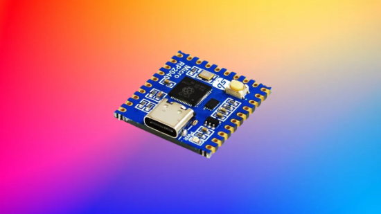]

SB Components has launched the open source Micro RP2040 with MicroPython support. [Tom's Hardware](https://www.tomshardware.com/news/sb-components-announce-micro-rp2040-for-smaller-raspberry-pi-pico-projects)

[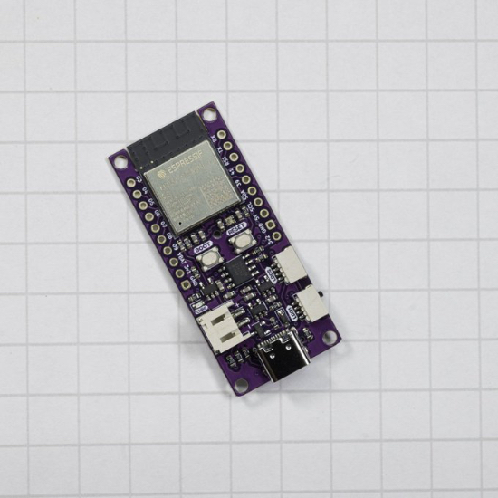]

Smart Bee Designs has created an ESP32 data logger with built in RTC and microSD card. [Twitter](https://twitter.com/smartbeedesigns/status/1676556957375688704)

## New Boards Supported by CircuitPython

The number of supported microcontrollers and Single Board Computers (SBC) grows every week. This section outlines which boards have been included in CircuitPython or added to [CircuitPython.org](https://circuitpython.org/).

This week, there were no new boards added!

*Note: For non-Adafruit boards, please use the support forums of the board manufacturer for assistance, as Adafruit does not have the hardware to assist in troubleshooting.*

Looking to add a new board to CircuitPython? It's highly encouraged! Adafruit has four guides to help you do so:

- [How to Add a New Board to CircuitPython](https://learn.adafruit.com/how-to-add-a-new-board-to-circuitpython/overview)
- [How to add a New Board to the circuitpython.org website](https://learn.adafruit.com/how-to-add-a-new-board-to-the-circuitpython-org-website)
- [Adding a Single Board Computer to PlatformDetect for Blinka](https://learn.adafruit.com/adding-a-single-board-computer-to-platformdetect-for-blinka)
- [Adding a Single Board Computer to Blinka](https://learn.adafruit.com/adding-a-single-board-computer-to-blinka)

## New Learn Guides!

[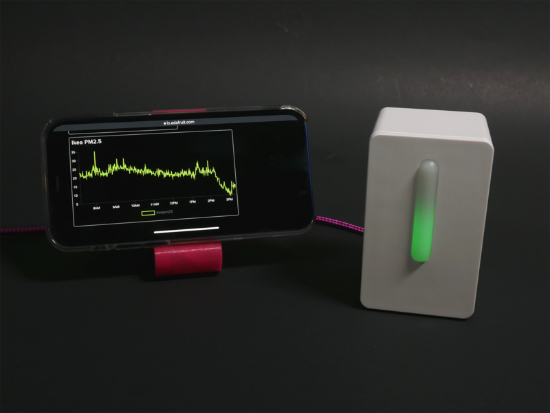](https://learn.adafruit.com/guides/latest)

[title](url) from [name](url)

[title](url) from [name](url)

[title](url) from [name](url)

## Updated Learn Guides!

[title](url) from [name](url)

## CircuitPython Libraries!

The CircuitPython library numbers are continually increasing, while existing ones continue to be updated. Here we provide library numbers and updates!

To get the latest Adafruit libraries, download the [Adafruit CircuitPython Library Bundle](https://circuitpython.org/libraries). To get the latest community contributed libraries, download the [CircuitPython Community Bundle](https://circuitpython.org/libraries).

If you'd like to contribute to the CircuitPython project on the Python side of things, the libraries are a great place to start. Check out the [CircuitPython.org Contributing page](https://circuitpython.org/contributing). If you're interested in reviewing, check out Open Pull Requests. If you'd like to contribute code or documentation, check out Open Issues. We have a guide on [contributing to CircuitPython with Git and GitHub](https://learn.adafruit.com/contribute-to-circuitpython-with-git-and-github), and you can find us in the #help-with-circuitpython and #circuitpython-dev channels on the [Adafruit Discord](https://adafru.it/discord).

You can check out this [list of all the Adafruit CircuitPython libraries and drivers available](https://github.com/adafruit/Adafruit_CircuitPython_Bundle/blob/master/circuitpython_library_list.md). 

The current number of CircuitPython libraries is **###**!

**New Libraries!**

Here's this week's new CircuitPython libraries:

* [library](url)

**Updated Libraries!**

Here's this week's updated CircuitPython libraries:

* [library](url)

**Library PyPI Weekly Download Stats**

## What’s the CircuitPython team up to this week?

What is the team up to this week? Let’s check in!

**Dan**

I released CircuitPython 8.2.0 final on Wednesday, July 5. Thanks to everyone who brought it to fruition. Note that if you have an nRF52 board with an old bootloader, you will need to update the bootloader to be able to load CircuitPython 8.2.0. Bootloaders older than version 0.6.1 cannot handle the larger size of 8.2.0. See the [release notes](https://github.com/adafruit/circuitpython/releases/tag/8.2.0) for details.

I did some Learn Guide revisions this and last week. I added [bootloader update pages](https://learn.adafruit.com/introducing-the-adafruit-nrf52840-feather/update-bootloader) for all nRF52 boards in preparation for the caveat mentioned above. And, with Carter's assistance, I added more detailed pages to all the Blinka-capable board guides explaining in more detail about "[Running CircuitPython Code without CircuitPython](https://learn.adafruit.com/circuitpython-on-raspberrypi-linux/running-circuitpython-code-without-circuitpython).

I'm continuing on the MicroPython merge.

**Kattni**

text - [site](url).

**Melissa**

text - [site](url).

**Tim**

text - [site](url).

**Jeff**

[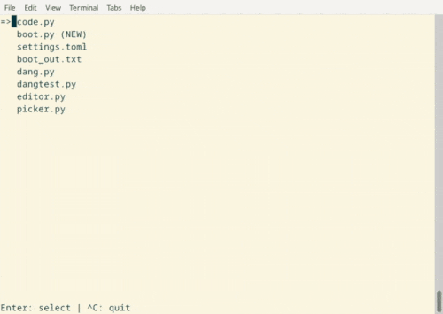](https://www.circuitpython.org/)

With Scott's work for USB Host taking shape, one of the things we want to do is offer a "local" circuitpython workflow, in which you can edit your CircuitPython code without a computer attached. In this workflow, you need a display (such as `displayio` compatible TFT) and a keyboard (such as a USB keyboard connected to the Adafruit RP2040 USB Host Feather)

To that end, I've done some beginning work on implementing a full-screen editor in pure Python code. I found [a project by @seeM on github](https://github.com/seeM/editor) that I have [forked and adapted to CircuitPython], mostly by creating a very tiny subset of the standard "curses" library known as "dang". I also added a rudimentary file picker.

Integrating this, such as adding a way to switch between running and editing code, will be among the next steps.

**Scott**

I've been out for the long holiday weekend here in the US. Lots of lovely family time. I'm getting caught up and then diving back into USB host support. I'll be collaborating with Thach and Jeff on USB host support.

**Liz**

This week I published the [Ikea Vindriktning Hack guide](https://learn.adafruit.com/ikea-vindriktning-hack-with-qt-py-esp32-s3-and-adafruit-io). This guide walks you through adding a QT Py ESP32-S3 running CircuitPython to the Ikea Vindriktning air quality monitor to make it an IoT device. I also included pages on setting up a dashboard in Adafruit IO to visualize the data and creating alerts when the AQI starts to become unhealthy.

## Upcoming events!

The next MicroPython Meetup in Melbourne will be on July 26th – [Meetup](https://www.meetup.com/micropython-meetup/events). From the May 24th meeting - [Notes](https://docs.google.com/presentation/d/e/2PACX-1vQ3rvNGR3NyBkSc6t1nXMoGvNuf9Btq10ZQR-4DagW5q4cbPtGMZXOoRRRo2wWOi2u7xH-Bf_HTBjb2/pub?slide=id.p).

EuroPython 2023 will be July 17-23, 2023, in Prague, Czech Republic and Remote - [EuroPython 2023](https://ep2023.europython.eu/).

North Bay Python, the community Python conference on a Farm, will be held July 29 and 30 in Petaluma, California. [North Bay Python](https://2023.northbaypython.org/) and [Schedule](https://pretalx.northbaypython.org/nbpy-2023/schedule/#).

PyCon UK will be returning to Cardiff City Hall from Friday 22nd September to Monday 25th September 2023 - [PyCon UK](https://2023.pyconuk.org/).

Hackaday has announced that the Hackaday Supercon is on for 2023, and will be taking place November 3 – 5 in Pasadena, California, USA. They’d like to hear your proposals for talks and workshops! The [Call for Speakers](https://docs.google.com/forms/d/e/1FAIpQLSfYDwIzWTHZ0_7d8GUznm3Z9w3y8aDcV1MVGSUyY1nTcdJ9Jw/viewform?usp=sf_link) and [Call for Workshops](https://docs.google.com/forms/d/e/1FAIpQLSeJIm0fWcrJIN8ge1K6Mvt2tfoFYOqre3isod5vKRGr-iyvJg/viewform?usp=sf_link) forms are online now, and you have until July 18th to sign up - [Adafruit Blog](https://blog.adafruit.com/2023/05/10/hackaday-supercon-2023-is-on-supercon-hackaday/) and [Hackaday](https://hackaday.com/2023/05/10/supercon-2023-is-on-we-want-you/).

**Send Your Events In**

If you know of virtual events or upcoming events, please let us know via email to cpnews(at)adafruit(dot)com.

## Latest releases

CircuitPython's stable release is [8.2.0](https://github.com/adafruit/circuitpython/releases/latest) and its unstable release is [8.2.0-rc.1](https://github.com/adafruit/circuitpython/releases). New to CircuitPython? Start with our [Welcome to CircuitPython Guide](https://learn.adafruit.com/welcome-to-circuitpython).

[20230707](https://github.com/adafruit/Adafruit_CircuitPython_Bundle/releases/latest) is the latest CircuitPython library bundle.

[v1.20.0](https://micropython.org/download) is the latest MicroPython release. Documentation for it is [here](http://docs.micropython.org/en/latest/pyboard/).

[3.11.4](https://www.python.org/downloads/) is the latest Python release. The latest pre-release version is [3.12.0b3](https://www.python.org/download/pre-releases/).

[3,584 Stars](https://github.com/adafruit/circuitpython/stargazers) Like CircuitPython? [Star it on GitHub!](https://github.com/adafruit/circuitpython)

## Call for help -- Translating CircuitPython is now easier than ever!

[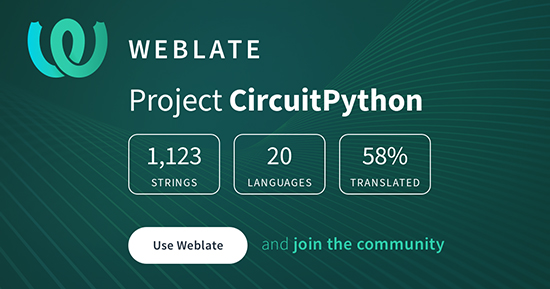](https://hosted.weblate.org/engage/circuitpython/)

One important feature of CircuitPython is translated control and error messages. With the help of fellow open source project [Weblate](https://weblate.org/), we're making it even easier to add or improve translations. 

Sign in with an existing account such as GitHub, Google or Facebook and start contributing through a simple web interface. No forks or pull requests needed! As always, if you run into trouble join us on [Discord](https://adafru.it/discord), we're here to help.

## 37502 thanks!

The Adafruit Discord community, where we do all our CircuitPython development in the open, reached over 37502 humans - thank you!  Adafruit believes Discord offers a unique way for Python on hardware folks to connect. Join today at [https://adafru.it/discord](https://adafru.it/discord).

## ICYMI - In case you missed it

Python on hardware is the Adafruit Python video-newsletter-podcast! The news comes from the Python community, Discord, Adafruit communities and more and is broadcast on ASK an ENGINEER Wednesdays. The complete Python on Hardware weekly videocast [playlist is here](https://www.youtube.com/playlist?list=PLjF7R1fz_OOXRMjM7Sm0J2Xt6H81TdDev). The video podcast is on [iTunes](https://itunes.apple.com/us/podcast/python-on-hardware/id1451685192?mt=2), [YouTube](http://adafru.it/pohepisodes), [IGTV (Instagram TV](https://www.instagram.com/adafruit/channel/)), and [XML](https://itunes.apple.com/us/podcast/python-on-hardware/id1451685192?mt=2).

[The weekly community chat on Adafruit Discord server CircuitPython channel - Audio / Podcast edition](https://itunes.apple.com/us/podcast/circuitpython-weekly-meeting/id1451685016) - Audio from the Discord chat space for CircuitPython, meetings are usually Mondays at 2pm ET, this is the audio version on [iTunes](https://itunes.apple.com/us/podcast/circuitpython-weekly-meeting/id1451685016), Pocket Casts, [Spotify](https://adafru.it/spotify), and [XML feed](https://adafruit-podcasts.s3.amazonaws.com/circuitpython_weekly_meeting/audio-podcast.xml).

## Contribute!

The CircuitPython Weekly Newsletter is a CircuitPython community-run newsletter emailed every Tuesday. The complete [archives are here](https://www.adafruitdaily.com/category/circuitpython/). It highlights the latest CircuitPython related news from around the web including Python and MicroPython developments. To contribute, edit next week's draft [on GitHub](https://github.com/adafruit/circuitpython-weekly-newsletter/tree/gh-pages/_drafts) and [submit a pull request](https://help.github.com/articles/editing-files-in-your-repository/) with the changes. You may also tag your information on Twitter with #CircuitPython. 

Join the Adafruit [Discord](https://adafru.it/discord) or [post to the forum](https://forums.adafruit.com/viewforum.php?f=60) if you have questions.
