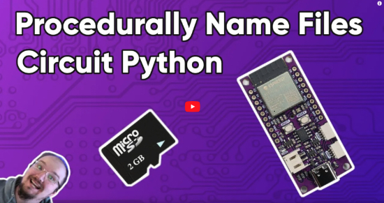
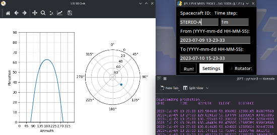
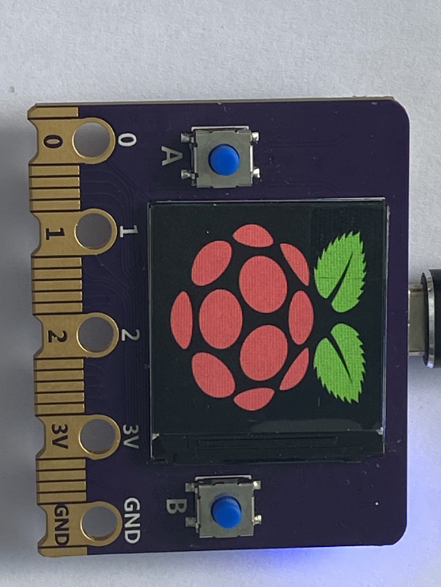
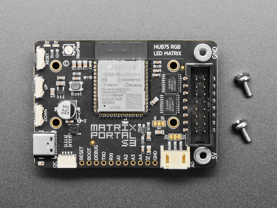

View this email in your browser. **Warning: Flashing Imagery**

Welcome to the latest Python on Microcontrollers newsletter! EuroPython starts this week and there are a couple talks you should check out.  I'm Paul Cutler, host of The CircuitPython Show and along with Kattni, your guest editor for this issue.  Next week's issue will be our last, so keep sending us your cool projects! *- Ed.*

We're on [Discord](https://discord.gg/HYqvREz), [Twitter](https://twitter.com/search?q=circuitpython&src=typed_query&f=live), and for past newsletters - [view them all here](https://www.adafruitdaily.com/category/circuitpython/). If you're reading this on the web, [subscribe here](https://www.adafruitdaily.com/). Here's the news this week:

## EuroPython starts today, July 17

EuroPython 2023 starts today, July 17.  Monday and Tuesday feature workshops, Wednesday through Friday includes conference talks, and Saturday and Sunday features sprints.

Notable things to check out include the [WASM Summit](https://ep2023.europython.eu/wasm) on July 18th and the talk [Async Robots by Radomir Dopieralski](https://ep2023.europython.eu/session/async-robots) on July 19th. - [EuroPython 2023](https://ep2023.europython.eu/).

## πCalc Kickstarter

The  πCalc is a fully featured programmable Python calculator powered by a rp2040 with a color touchscreen, sound output, and microphone.

The πCalc includes an interactive MicroPython mode which allows yout to solve complex mathematical tasks and programming in Python without any delay.  You can also control hardware components including the I/O ports, RGB LEDs, and the integrated speaker for sound output.

The πCalc is compatible with MicroPython or CircuitPython - [Kickstarter](https://www.kickstarter.com/projects/shellbrix/calc).

## Pico Powered Roboat

The Roboat is powered by a Raspberry Pi Pico W, a battery pack, a mini electric fan motor and three repurposed plastic contact lens solution bottles.  A water bottle lit keeps the electric motor safely dry as it powers the fan. - [Raspberry Pi](https://www.raspberrypi.com/news/set-sail-in-the-pico-powered-roboat/).

## Picopad

The PicoPad is an open source gaming console kit.  It includes all the components necessary to building a hand held gaming device powered by a Raspberry Pi Pico or Pico W.

It features a 2-inch IPS 240x320 display, MicroSD slot, eight buttons, and a lithium-ion battery.

The Picopad supports programming in C and MicroPython. - [Picopad](https://picopad.eu/en/index.html).

## This Week's Python Streams

Python on Hardware is all about building a cooperative ecosphere which allows contributions to be valued and to grow knowledge. Below are the streams within the last week focusing on the community.

**CircuitPython Deep Dive Stream**

[This week](https://www.youtube.com/watch?v=4gWgTj_KGps), Tim streamed work on testing and reviewing library PRs..

You can see the latest video and past videos on the Adafruit YouTube channel under the Deep Dive playlist - [YouTube](https://www.youtube.com/playlist?list=PLjF7R1fz_OOXBHlu9msoXq2jQN4JpCk8A).

**CircuitPython Parsec**

John Park’s CircuitPython Parsec this week is on tap detection using a Circuit Playground. - [Adafruit Blog](link) and [YouTube](link).

Catch all the episodes in the [YouTube playlist](https://www.youtube.com/playlist?list=PLjF7R1fz_OOWFqZfqW9jlvQSIUmwn9lWr).

## Project of the Week

Olav Martin Kvern modified a Squier Telecaster guitar using a Pimoroni Servo 2040, digital servos, and CircuitPython to create a guitar picking robot.

He shares his design goals, tools, and how he overcame power challenges to show how he plays with the guitar robot. - [Make](https://makezine.com/article/craft/music/how-i-built-a-guitar-picking-robot/).

## News from around the web!

Debra Ansell has created an illuminated tote bag for an upcoming article in Make Magazine. - [Mastodon](https://mastodon.social/@geekmomprojects/110675873570142431).

todbot has created a new prototype board to use with CircuitPython's new `synthio` library. - [Mastodon](https://mastodon.social/@todbot/110685924953136302).

Scott Monaghan demonstrates his CircuitPython powered robot's body tracking movement in a short video. - [Mastodon](https://octodon.social/@ScottMonaghan@hackaday.social/110657995019270244).

In his latest video, Kevin McAleer covers how to draw graphics in MicroPython with PicoGraphics. - [YouTube](https://www.youtube.com/watch?v=oqUUc-mqdak).

Joshua Bech shows the first watchyface made with the experimental version of CircuitPython for Watchy. - [Twitter](https://twitter.com/JoshuaBeck7088/status/1676837036618293248?s=20).

Python People is a new podcast from Brian Okken about the people who make the Python community awesome.  In his first episode, he interviews his Python Bytes co-host, Michael Kennedy. - [Python People](https://pythonpeople.fm/).

Learn how to procedurally name files in CircuitPython in the latest video from Paul's Projects. - [YouTube](https://www.youtube.com/watch?v=lwxBt7VoAcw).

JEPT is a tool for viewing azimuth and elevation of selected spacecraft from NASA JPL data based on the entered QTH location. - [GitHub](https://github.com/Mnux9/JEPT).

Twitter user @yongxiangxu251 created an RP2040 board with a look similar to a micro:bit. - [Twitter](https://twitter.com/yongxiangxu251/status/1676435505733566465).

Codon is a high performance Python implemention that compiles to native machine code without any runtime overhead.  Codon supports native multithreading and can see speedups over Python on the order of 10 - 100x on a single thread.

LuaDec is a Lua decompiler for Lua 5.1 with experimental support for Lua 5.2 and 5.3. - [GitHub](https://github.com/viruscamp/luadec).

Machine-code function in uLisp can be written with thelp of an ARM assembler written in Lisap. - [Ulisp Forum](http://forum.ulisp.com/t/an-arm-assembler-written-in-lisp/1237).

PyDev of the Week: Micaela Reyes on [Mouse vs Python](https://www.blog.pythonlibrary.org/2023/07/10/pydev-of-the-week-micaela-reyes/)

CircuitPython Weekly Meeting for July 10, 2023 ([notes](https://github.com/adafruit/adafruit-circuitpython-weekly-meeting/blob/main/2023/2023-07-10.md)) [on YouTube](https://youtu.be/XBphwOsFKdU)

**#ICYDNCI What was the most popular, most clicked link, in [last week's newsletter](https://link)? [title](url).**

## Coming Soon

The Adafruit Matrix Portal S3 is an updated version that replaces the SAMD chip with an Espressif ESP32-S3.  The new Matrix Portal can do almost everything the original can.  The new S3 has a parallel output drive peripheral allowing it to control the matrix without bitbanging; has two cores allowing one to be dedicated to WiFi or matrix control while the other runs your code; and lots of memory: 8MB of Flash means plenty of space for code, files, GIFs, and more.  2MB of PSRAM means you can read lots of data and still have plenty of RAM for the matrix display buffers. - [Adafruit](https://www.adafruit.com/product/5778).

## New Boards Supported by CircuitPython

The number of supported microcontrollers and Single Board Computers (SBC) grows every week. This section outlines which boards have been included in CircuitPython or added to [CircuitPython.org](https://circuitpython.org/).

This week, there was 1 new board added!

- [Adafruit QT Py ESP32-S3 4MB Flash/2MB PSRAM](https://circuitpython.org/board/adafruit_qtpy_esp32s3_4mbflash_2mbpsram/)

*Note: For non-Adafruit boards, please use the support forums of the board manufacturer for assistance, as Adafruit does not have the hardware to assist in troubleshooting.*

Looking to add a new board to CircuitPython? It's highly encouraged! Adafruit has four guides to help you do so:

- [How to Add a New Board to CircuitPython](https://learn.adafruit.com/how-to-add-a-new-board-to-circuitpython/overview)
- [How to add a New Board to the circuitpython.org website](https://learn.adafruit.com/how-to-add-a-new-board-to-the-circuitpython-org-website)
- [Adding a Single Board Computer to PlatformDetect for Blinka](https://learn.adafruit.com/adding-a-single-board-computer-to-platformdetect-for-blinka)
- [Adding a Single Board Computer to Blinka](https://learn.adafruit.com/adding-a-single-board-computer-to-blinka)

## New Learn Guides!

[Adabot Toy Robot Friend](https://learn.adafruit.com/adabot-rp2040) from the [Ruiz Brothers](https://learn.adafruit.com/u/pixil3d)

[Adafruit Swirly Aluminum Mounting Grid](https://learn.adafruit.com/swirly-grid) from [Kattni Rembor](https://learn.adafruit.com/u/kattni)

[Adafruit STEMMA Audio Amp](https://learn.adafruit.com/stemma-audio-amp) from [Kattni Rembor](https://learn.adafruit.com/u/kattni)

[Adafruit I2C Quad Rotary Encoder Breakout](https://learn.adafruit.com/adafruit-i2c-quad-rotary-encoder-breakout) from [Liz Clark](https://learn.adafruit.com/u/BlitzCityDIY)

## Updated Learn Guides!

[Adafruit QT Py ESP32 Pico](https://learn.adafruit.com/adafruit-qt-py-esp32-pico) from [Kattni Rembor](https://learn.adafruit.com/u/kattni)

[CircuitPython Essentials](https://learn.adafruit.com/circuitpython-essentials) from [Kattni Rembor](https://learn.adafruit.com/u/kattni)

[Adafruit ESP32 Feather V2](https://learn.adafruit.com/adafruit-esp32-feather-v2) from [Kattni Rembor](https://learn.adafruit.com/u/kattni)

[Adafruit QT Py ESP32-S3](https://learn.adafruit.com/adafruit-qt-py-esp32-s3) from [Liz Clark](https://learn.adafruit.com/u/BlitzCityDIY)

[Adafruit Proximity Trinkey](https://learn.adafruit.com/adafruit-proximity-trinkey) from [Kattni Rembor](https://learn.adafruit.com/u/kattni)

[Adafruit 2.13" Monochrome E-Ink Bonnet for Raspberry Pi](https://learn.adafruit.com/2-13-in-e-ink-bonnet) from [Kattni Rembor](https://learn.adafruit.com/u/kattni)

[MQTT in CircuitPython](https://learn.adafruit.com/mqtt-in-circuitpython) from [Brent Rubell](https://learn.adafruit.com/u/brubell)

[CircuitPython Libraries on Linux and Raspberry Pi](https://learn.adafruit.com/circuitpython-on-raspberrypi-linux) from [M. LeBlanc-Williams](https://learn.adafruit.com/u/MakerMelissa)

## CircuitPython Libraries!

The CircuitPython library numbers are continually increasing, while existing ones continue to be updated. Here we provide library numbers and updates!

To get the latest Adafruit libraries, download the [Adafruit CircuitPython Library Bundle](https://circuitpython.org/libraries). To get the latest community contributed libraries, download the [CircuitPython Community Bundle](https://circuitpython.org/libraries).

If you'd like to contribute to the CircuitPython project on the Python side of things, the libraries are a great place to start. Check out the [CircuitPython.org Contributing page](https://circuitpython.org/contributing). If you're interested in reviewing, check out Open Pull Requests. If you'd like to contribute code or documentation, check out Open Issues. We have a guide on [contributing to CircuitPython with Git and GitHub](https://learn.adafruit.com/contribute-to-circuitpython-with-git-and-github), and you can find us in the #help-with-circuitpython and #circuitpython-dev channels on the [Adafruit Discord](https://adafru.it/discord).

You can check out this [list of all the Adafruit CircuitPython libraries and drivers available](https://github.com/adafruit/Adafruit_CircuitPython_Bundle/blob/master/circuitpython_library_list.md). 

The current number of CircuitPython libraries is **446**!

**New Libraries!**

Here's this week's new CircuitPython libraries:

* [adafruit/Adafruit_CircuitPython_EK79686](https://github.com/adafruit/Adafruit_CircuitPython_EK79686)
* [furbrain/CircuitPython_CaveBLE](https://github.com/furbrain/CircuitPython_CaveBLE)

**Updated Libraries!**

Here's this week's updated CircuitPython libraries:

* [adafruit/Adafruit_CircuitPython_WSGI](https://github.com/adafruit/Adafruit_CircuitPython_WSGI)
* [adafruit/Adafruit_CircuitPython_Display_Button](https://github.com/adafruit/Adafruit_CircuitPython_Display_Button)
 * [adafruit/Adafruit_CircuitPython_EPD](https://github.com/adafruit/Adafruit_CircuitPython_EPD)

**Library PyPI Weekly Download Stats**
* **Total Library Stats**
  * 151103 PyPI downloads over 311 libraries
* **Top 10 Libraries by PyPI Downloads**
  * Adafruit CircuitPython BusDevice (adafruit-circuitpython-busdevice): 6706
  * Adafruit CircuitPython Requests (adafruit-circuitpython-requests): 6044
  * Adafruit CircuitPython Register (adafruit-circuitpython-register): 1987
  * Adafruit CircuitPython Motor (adafruit-circuitpython-motor): 1451
  * Adafruit CircuitPython MiniMQTT (adafruit-circuitpython-minimqtt): 1320
  * Adafruit CircuitPython Display Text (adafruit-circuitpython-display-text): 1264
  * Adafruit CircuitPython ESP32SPI (adafruit-circuitpython-esp32spi): 1263
  * Adafruit CircuitPython Wiznet5k (adafruit-circuitpython-wiznet5k): 1214
  * Adafruit CircuitPython NeoPixel (adafruit-circuitpython-neopixel): 1191
  * Adafruit CircuitPython BLE (adafruit-circuitpython-ble): 1105

## What’s the CircuitPython team up to this week?

What is the team up to this week? Let’s check in!

**Dan**

I spent most of my time on the MicroPython merge this week. We are merging changes relevant to CircuitPython from MicroPython v1.19.1, and then when that is done, we will merge v1.20, and v1.21 if it is released soon.

Deciding what code to merge can be difficult, because it is not obvious whether a code difference reflects new MicroPython code that should just replace the current code in CircuitPython, or whether the differences reflect changes made in CircutPython that should not be overridden. The origin of a piece of code can be tracked down, but it is tedious. I am thinking about marking our changes by adding "this was done for CircuitPython"-style comments. Then the origin of the code will clearer, and will be preserved and readily apparent when doing a future merge.

**Kattni**

This week I've been going through guide feedback. On each guide in the Adafruit Learn System, there is a "Feedback? Corrections?" link at the bottom of the left sidebar that allows you to submit feedback on the guide. These are aggregated for us so we can go through and update the guides as needed. It's been a bit since I went through it, so there were quite a few. I'm making excellent progress, and expect to finish it up next week.

**Melissa**

This past week I've been working on getting the TSC2046 touch screen controller working with the Raspberry Pi so that it can be used in place of a mouse. Adafruit's previous go-to resistive touchscreen chip, the STMPE610 and it's replacement the STMPE811 are no longer being produced or obtainable. This was to find a suitable replacement so the PiTFTs can be redesigned with chips that are available.

**Tim**

This week I wrote an Outlined Label class that can be used with upcoming changes within bitmaptools in the core to provide an easy way to make text with colored stroke outlines. I've also been working on changing over the ESP32SPI library and examples to use settings.toml instead of secrets.py and looking around at other library example and learn guide code to find other instances that can be changed over.

**Jeff**

I've been pitching in to help Scott with some of the USB Host project.

In particular, I've started adding support for non-US-QWERTY keyboards. With my current work in progress code, keyboards are still limited to ASCII, but alternate layouts can be used. I tested with a French AZERTY keyboard layout, which moves some characters around (such as swapping Q and A), places punctuation in unusual spots ({} are on top row keys with the Alt-Gr modifier) and also requires the shift key to enter numerals 0-9!

This was made much easier by the keyboard layout bundle from @Neradoc!

**Scott**

This week I've been primarily working on USB host. I've determined the two bigger issues to solve before moving on. The first is implementing sharing control of a device between TinyUSB class driver code and CircuitPython-level user code. pyusb has an API for detaching and attaching devices so we'll need to implement it fully.

The other issue is how to handle re-initializing the host port in code.py. With displays we have you call `displayio.release_displays()`. Since USB host doesn't have any settings, we'll silently return the same successful port a second time. The only trick with this is that changing pins of the port will require a reset.

**Liz**

This past week I published a guide for the new [Quad Rotary Encoder Breakout](https://learn.adafruit.com/adafruit-i2c-quad-rotary-encoder-breakout). This is a seesaw-based board that lets you use four rotary encoders over I2C. Currently I'm working on a project that will use four of these boards for a total of 16 encoders.

I also wrote code for the very cute [Adabot Toy Robot Friend project](https://learn.adafruit.com/adabot-rp2040). If you've ever wanted an adorable Adabot desk companion, definitely check out that guide for an excellent 3D model of Adabot.

Finally, I also updated the [QT Py ESP32-S3 guide](https://learn.adafruit.com/adafruit-qt-py-esp32-s3) for the new PSRAM version of the board. This involved some minor copy edits and creating UF2 and binary factory reset files.

## Upcoming events!

The next MicroPython Meetup in Melbourne will be on July 26th – [Meetup](https://www.meetup.com/micropython-meetup/events). From the June 28th meeting - [Notes](https://docs.google.com/presentation/d/e/2PACX-1vQ07ara8H4jIgiZZOQ8rqyBkdTmM_HzDP02lqqbODc9e5u1oh4TORrTiz2rKITw4P7fq8knlMocOnES/pub#slide=id.p).

[

PyConAU will be held August 18th - 22nd in Adelaide, Australia.  The conference schedule was recently published and notable talks include [You can't do that in MicroPython](https://2023.pycon.org.au/program/F7JN7X/) by Matt Trentini and [10 Years of MicroPython](https://2023.pycon.org.au/program/ZDUVFF/) by Damien George.

PyCon UK will be returning to Cardiff City Hall from Friday 22nd September to Monday 25th September 2023 - [PyCon UK](https://2023.pyconuk.org/).

Hackaday has announced that the Hackaday Supercon is on for 2023, and will be taking place November 3 – 5 in Pasadena, California, USA. They’d like to hear your proposals for talks and workshops! The [Call for Speakers](https://docs.google.com/forms/d/e/1FAIpQLSfYDwIzWTHZ0_7d8GUznm3Z9w3y8aDcV1MVGSUyY1nTcdJ9Jw/viewform?usp=sf_link) and [Call for Workshops](https://docs.google.com/forms/d/e/1FAIpQLSeJIm0fWcrJIN8ge1K6Mvt2tfoFYOqre3isod5vKRGr-iyvJg/viewform?usp=sf_link) forms are online now, and you have until July 18th to sign up - [Adafruit Blog](https://blog.adafruit.com/2023/05/10/hackaday-supercon-2023-is-on-supercon-hackaday/) and [Hackaday](https://hackaday.com/2023/05/10/supercon-2023-is-on-we-want-you/).

[]

The Pyjamas Conference, the 24 hour online Python conference, will be returning for a fifth year.  The Call for Papers will bein on September 2nd. - [Twitter](https://twitter.com/PyjamasConf/status/1675278222798495745)

**Send Your Events In**

If you know of virtual events or upcoming events, please let us know via email to cpnews(at)adafruit(dot)com.

## Latest releases

CircuitPython's stable release is [8.2.0](https://github.com/adafruit/circuitpython/releases/latest). New to CircuitPython? Start with our [Welcome to CircuitPython Guide](https://learn.adafruit.com/welcome-to-circuitpython).

[20230711](https://github.com/adafruit/Adafruit_CircuitPython_Bundle/releases/latest) is the latest Adafruit CircuitPython library bundle.

[20230710](https://github.com/adafruit/CircuitPython_Community_Bundle/releases/latest) is the latest CircuitPython Community library bundle.

[v1.20.0](https://micropython.org/download) is the latest MicroPython release. Documentation for it is [here](http://docs.micropython.org/en/latest/pyboard/).

[3.11.4](https://www.python.org/downloads/) is the latest Python release. The latest pre-release version is [3.12.0b4](https://www.python.org/download/pre-releases/).

[3,594 Stars](https://github.com/adafruit/circuitpython/stargazers) Like CircuitPython? [Star it on GitHub!](https://github.com/adafruit/circuitpython)

## Call for help -- Translating CircuitPython is now easier than ever!

One important feature of CircuitPython is translated control and error messages. With the help of fellow open source project [Weblate](https://weblate.org/), we're making it even easier to add or improve translations. 

Sign in with an existing account such as GitHub, Google or Facebook and start contributing through a simple web interface. No forks or pull requests needed! As always, if you run into trouble join us on [Discord](https://adafru.it/discord), we're here to help.

## 37,539 thanks!

The Adafruit Discord community, where we do all our CircuitPython development in the open, reached over 37,539 humans - thank you!  Adafruit believes Discord offers a unique way for Python on hardware folks to connect. Join today at [https://adafru.it/discord](https://adafru.it/discord).

## ICYMI - In case you missed it

Python on hardware is the Adafruit Python video-newsletter-podcast! The news comes from the Python community, Discord, Adafruit communities and more and is broadcast on ASK an ENGINEER Wednesdays. The complete Python on Hardware weekly videocast [playlist is here](https://www.youtube.com/playlist?list=PLjF7R1fz_OOXRMjM7Sm0J2Xt6H81TdDev). The video podcast is on [iTunes](https://itunes.apple.com/us/podcast/python-on-hardware/id1451685192?mt=2), [YouTube](http://adafru.it/pohepisodes), [IGTV (Instagram TV](https://www.instagram.com/adafruit/channel/)), and [XML](https://itunes.apple.com/us/podcast/python-on-hardware/id1451685192?mt=2).

[The weekly community chat on Adafruit Discord server CircuitPython channel - Audio / Podcast edition](https://itunes.apple.com/us/podcast/circuitpython-weekly-meeting/id1451685016) - Audio from the Discord chat space for CircuitPython, meetings are usually Mondays at 2pm ET, this is the audio version on [iTunes](https://itunes.apple.com/us/podcast/circuitpython-weekly-meeting/id1451685016), Pocket Casts, [Spotify](https://adafru.it/spotify), and [XML feed](https://adafruit-podcasts.s3.amazonaws.com/circuitpython_weekly_meeting/audio-podcast.xml).

## Contribute!

The CircuitPython Weekly Newsletter is a CircuitPython community-run newsletter emailed every Tuesday. The complete [archives are here](https://www.adafruitdaily.com/category/circuitpython/). It highlights the latest CircuitPython related news from around the web including Python and MicroPython developments. To contribute, edit next week's draft [on GitHub](https://github.com/adafruit/circuitpython-weekly-newsletter/tree/gh-pages/_drafts) and [submit a pull request](https://help.github.com/articles/editing-files-in-your-repository/) with the changes. You may also tag your information on Twitter with #CircuitPython. 

Join the Adafruit [Discord](https://adafru.it/discord) or [post to the forum](https://forums.adafruit.com/viewforum.php?f=60) if you have questions.
