View this email in your browser. **Warning: Flashing Imagery**

Welcome to the latest Python on Microcontrollers newsletter! Big news this week with a Silabs CircuitPython support announcement and a CircuitPython Hack Chat! Read on for details on those, as well as all the great news and projects from web. This is your final issue with guest editors Kattni and Paul! Thanks for bearing with us and doing all the amazing things we were able to put into our newsletters. Next week, we're happy to welcome back Anne, and we hope you are too! - *Eds.*

We're on [Discord](https://discord.gg/HYqvREz), [Twitter](https://twitter.com/search?q=circuitpython&src=typed_query&f=live), and for past newsletters - [view them all here](https://www.adafruitdaily.com/category/circuitpython/). If you're reading this on the web, [subscribe here](https://www.adafruitdaily.com/). Here's the news this week:

## Silicon Labs introduces support for CircuitPython

[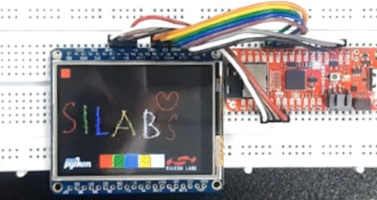](https://community.silabs.com/s/share/a5U8Y000001a2QoUAI/introducing-circuitpython-support-for-silabs-xg24-boards?language=en_US)

Silicon Labs announced CircuitPython support for their xG24 boards.

> Silabs, a leading provider of silicon, software, and solutions for a smarter, more connected world, is proud to introduce CircuitPython support for our xG24 boards. 
> 
> This exciting development expands the capabilities of the xG24 explorer kit, xG24 dev kit, and the Sparkfun Thingplus Matter - MGM240P, allowing users to leverage the power of CircuitPython's simplicity and flexibility while harnessing the advanced features of Silabs' boards. 

The announcement includes details on getting started with CircuitPython on these boards. - [Silicon Labs Technical Blog](https://community.silabs.com/s/share/a5U8Y000001a2QoUAI/introducing-circuitpython-support-for-silabs-xg24-boards?language=en_US)

## CircuitPython Hack Chat with Adafruit

[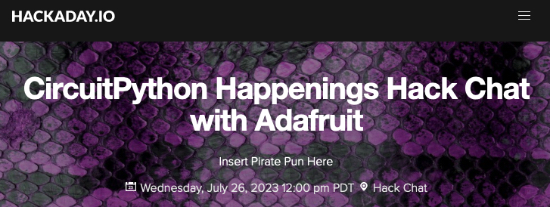](https://hackaday.io/event/191758-circuitpython-happenings-hack-chat-with-adafruit)

Hackaday is hosting a CircuitPython Happenings Hack Chat with Scott, PT, and Ladyada from Adafruit on Wednesday, July 26th at 3 p.m. EDT / 12 p.m. PDT. - [Hackaday](https://hackaday.io/event/191758-circuitpython-happenings-hack-chat-with-adafruit)

## OpenSauce

[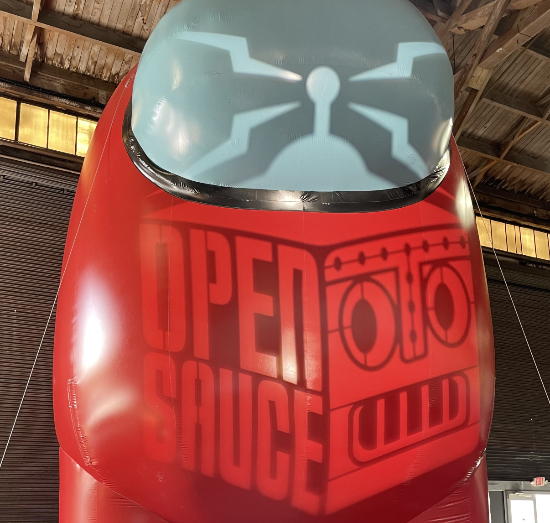](https://opensauce.live/)

Our own Maker Melissa went to Open Sauce in San Francisco, California. There were a number of interesting talks by some of the most popular YouTube makers. There were also exhibits that ranged from PCB manufacturers to BattleBots, which had some of the robots that had been featured on the television show.

## smolOS - a Tiny Operating System for Tiny Devices

[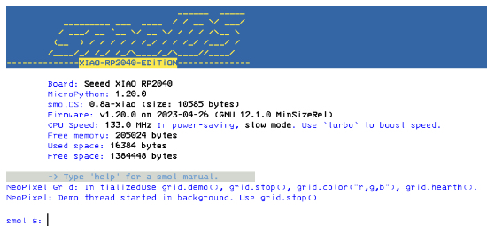](http://smol.p1x.in/os/)

smolOS is a research project providing a DOS / POSIX-like operating system on top of MicroPython. smolOS runs on ESP8266 and rp2040 chipsets. - [smolOS Home Page](http://smol.p1x.in/os/) and [GitHub](https://github.com/w84death/smolOS).

## Tod Kurt's CircuitPython `synthio` Tricks

[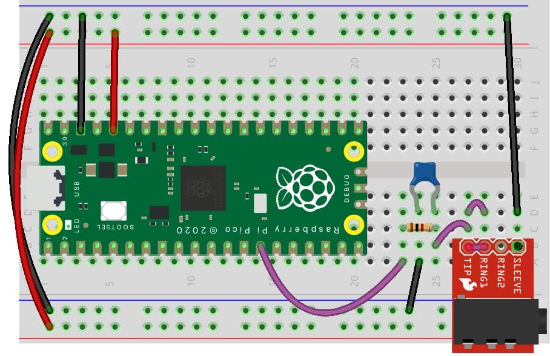](https://github.com/todbot/circuitpython-synthio-tricks)

CircuitPython only recently added music synthesis using the new `synthio` module. Tod Kurt has been testing `synthio` since early in its development and has written an extensive guide to using `synthio`.

It covers what is `synthio`, which boards work with it, building audio circuits, playing chords, and both basic and advanced techniques. He includes wiring diagrams and code samples to help you learn `synthio`. - [GitHub](https://github.com/todbot/circuitpython-synthio-tricks).

## MicroPython is a first class programming language for Arduino

[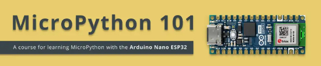](https://docs.arduino.cc/micropython-course/)

Arduino has launched a MicroPython 101 course for learning MicroPython with the Arduino Nano ESP32.  It features a number of chapters including a MicroPython installation guide, using digital input/output, IoT, and more. - [Arduino](https://docs.arduino.cc/micropython-course/).

## This Week's Python Streams

Python on Hardware is all about building a cooperative ecosphere which allows contributions to be valued and to grow knowledge. Below are the streams within the last week focusing on the community.

**CircuitPython Deep Dive Stream**

[This week](https://www.youtube.com/watch?v=lvbMvE5F2Ug), Tim streamed work on testing various library PRs.

You can see the latest video and past videos on the Adafruit YouTube channel under the Deep Dive playlist - [YouTube](https://www.youtube.com/playlist?list=PLjF7R1fz_OOXBHlu9msoXq2jQN4JpCk8A).

**CircuitPython Parsec**

John Park’s CircuitPython Parsec will return next week!

Catch all the episodes in the [YouTube playlist](https://www.youtube.com/playlist?list=PLjF7R1fz_OOWFqZfqW9jlvQSIUmwn9lWr).

## Project of the Week: CircuitPython powered Typewriter

[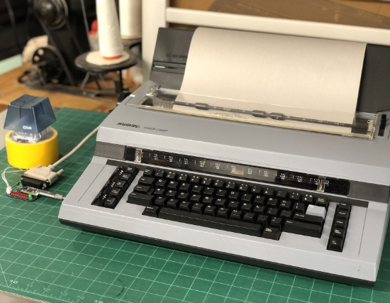](https://fosstodon.org/@mlupo/110709796354267099)
[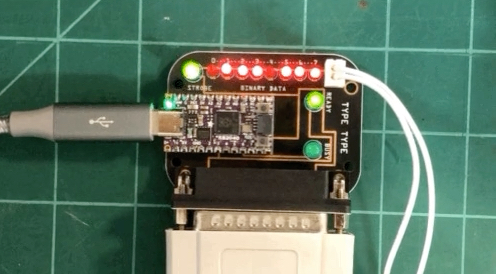](https://fosstodon.org/@mlupo/110709796354267099)

Max Lupo created a custom PCB that connects to a KB2040 running CircuitPython to control a Swintec 1146 typewriter.

The CircuitPython code on the KB2040 blips out a sequence of binary data into the typewriter's parallel port, one character at a time. When the typewriter receives a newline, it tells the code it's busy and taps out its text buffer. - [Mastodon](https://fosstodon.org/@mlupo/110709796354267099) and [GitHub](https://github.com/mlupo/type-type).

## News from around the web!

[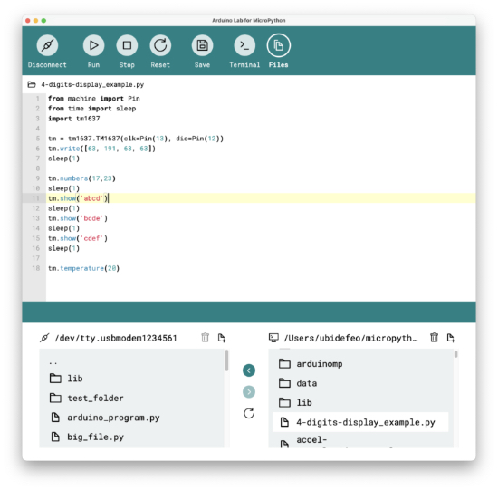](https://blog.arduino.cc/2023/07/14/experiment-with-new-tools-for-micropython/)

Arduino Lab Editor version 0.8 with MicroPython support has been released by Arduino Labs. It features an improved user interface, better file management support, and easier ways to manage library files. - [Arduino Blog](https://blog.arduino.cc/2023/07/14/experiment-with-new-tools-for-micropython/).

[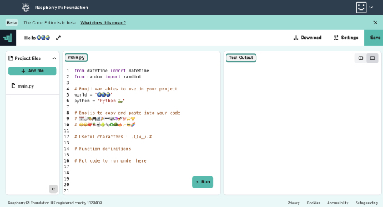](https://www.raspberrypi.org/blog/code-editor-open-source/)

Raspberry Pi open sourced its online text-based Code Editor. Built for ages 7 and older to learn to write code, it is now easier to contribute to it. - [Raspberry Pi](https://www.raspberrypi.org/blog/code-editor-open-source/).

[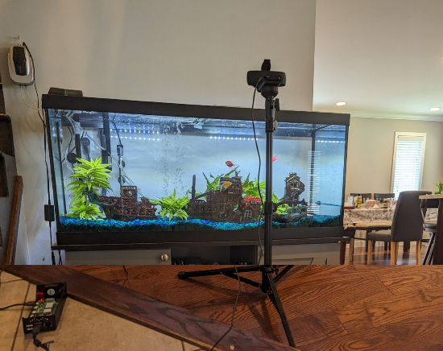](https://fosstodon.org/@mariatta/110623688671770050)

Mariatta used Python, Flickr, and a Raspberry Pi to remotely monitor an aquarium - [Mastodon](https://fosstodon.org/@mariatta/110623688671770050).

[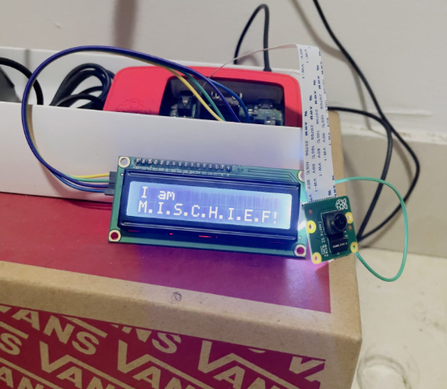](https://www.raspberrypi.com/news/m-i-s-c-h-i-e-f-smart-home-system/)

Project M.I.S.C.H.I.E.F is an AI powered smart home system using a Raspberry Pi 3B, an ESP32 microcontroller, and Python. - [Raspberry Pi](https://www.raspberrypi.com/news/m-i-s-c-h-i-e-f-smart-home-system/).

[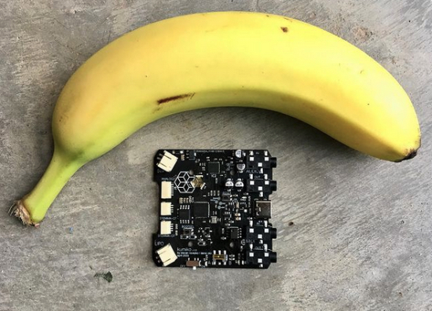](https://www.instagram.com/p/Cry_KWluGvm/?utm_source=ig_web_copy_link&igshid=MzRlODBiNWFlZA%3D%3D)

denki_oto shares Kumiko, a new rp2040 based audio and midi development board - [Instagram](https://www.instagram.com/p/Cry_KWluGvm/?utm_source=ig_web_copy_link&igshid=MzRlODBiNWFlZA%3D%3D), [Instagram Video](https://www.instagram.com/reel/CrptKLgANJO/?utm_source=ig_web_copy_link&igshid=MzRlODBiNWFlZA%3D%3D), and [Instagram](https://www.instagram.com/p/CrpuihAOwfa/?img_index=1).

[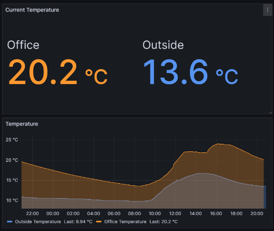](https://github.com/mark-gladding/weatherstation)

Weatherstation uses MicroPython, a Raspberry Pi Pico W, a display, and temperature sensor to measure the current indoor and outdoor temperatures. Built by Mark Gladding, the temperature is then displayed in a Grafana dashboard. - [GitHub](https://github.com/mark-gladding/weatherstation).

[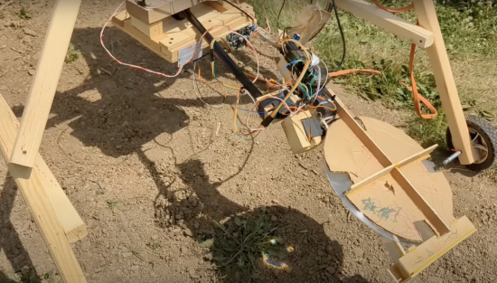](https://www.raspberrypi.com/news/ai-weed-killer-uses-sunlight-and-raspberry-pi/)

Nathan used a Raspberry Pi 3, camera, motors, Fresnel lens, and photoresistors to build a robot that detects and kills weeds. The Raspberry Pi is mounted underneath and when it detects a weed the motors flip out the giant lens and positions it to kill the weed. The photoresistors track the direction the light is coming and helps focus the sun's beam through the lens. It knows what a weed is based on the TensorFlow image classification model that was used to teach the robot. - [Raspberry Pi](https://www.raspberrypi.com/news/ai-weed-killer-uses-sunlight-and-raspberry-pi/).

[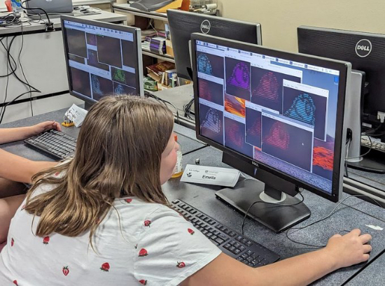](https://twitter.com/KodyKinzie/status/1681497676737839104)

Last week at CyberCat Academy, middle school students were introduced to CircuitPython as the kids learned about ethical hacking. - [Twitter](https://twitter.com/KodyKinzie/status/1681497676737839104).

[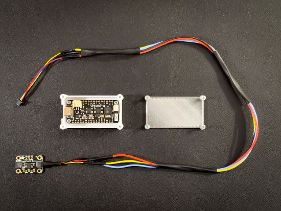](http://www.movingelectrons.net/posts/freezer-temperature-monitor-and-alarm/)

Moving Electrons has a detailed post showing how to build a HomeKit compatible freezer temperature monitoring system. Using CircuitPython, an Unexpected Maker Feather S2 board, temperature sensor, and a 3D printed case, a notification is sent every time the freezer door opens. - [Moving Electrons](http://www.movingelectrons.net/posts/freezer-temperature-monitor-and-alarm/).

[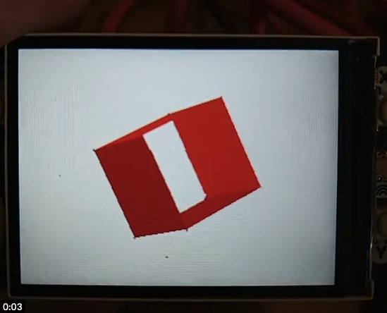](https://twitter.com/digitalMakerCIC/status/1681268997885419521?s=20)

Phil shows working with polygons using a CircuitPython and a Pimoroni PicoDisplay. - [Twitter](https://twitter.com/digitalMakerCIC/status/1681268997885419521?s=20).

[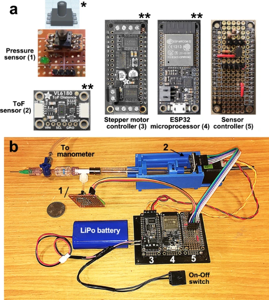](https://www.nature.com/articles/s41598-023-38310-7#Sec13)

In this academic paper, Jesse Roberts writes about LungElast, an open source MicroPython powered instrument that can measure lung elasticity and volumes in immature mice. - [Nature](https://www.nature.com/articles/s41598-023-38310-7#Sec13).

[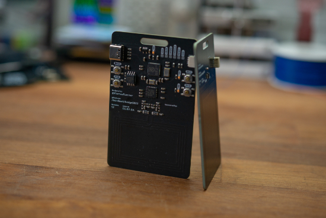](https://github.com/bornhack/badge2023bor)

[BornHack 2023](https://bornhack.dk/bornhack-2023/), a week long outdoor tent camp on the Danish island of Funen, shares their CircuitPython powered badge for this year's conference. - [GitHub](https://github.com/bornhack/badge2023).

PyDev of the Week: Sophia Yang on [Mouse vs Python](https://www.blog.pythonlibrary.org/2023/07/17/pydev-of-the-week-sophia-yang/)

CircuitPython Weekly Meeting for July 17, 2023 ([notes](https://github.com/adafruit/adafruit-circuitpython-weekly-meeting/blob/main/2023/2023-07-17.md)) [on YouTube](https://github.com/adafruit/adafruit-circuitpython-weekly-meeting/blob/main/2023/2023-07-17.md)

**#ICYDNCI What was the most popular, most clicked link, in [last week's newsletter](https://www.adafruitdaily.com/2023/07/17/python-on-microcontrollers-newsletter-europython-starts-today-updated-events-and-more-circuitpython-python-micropython-thepsf-raspberry_pi/)? [π Calc : Python Calculator](https://www.kickstarter.com/projects/shellbrix/calc).**

## New Boards Supported by CircuitPython

The number of supported microcontrollers and Single Board Computers (SBC) grows every week. This section outlines which boards have been included in CircuitPython or added to [CircuitPython.org](https://circuitpython.org/).

This week, there were no new boards added!

*Note: For non-Adafruit boards, please use the support forums of the board manufacturer for assistance, as Adafruit does not have the hardware to assist in troubleshooting.*

Looking to add a new board to CircuitPython? It's highly encouraged! Adafruit has four guides to help you do so:

- [How to Add a New Board to CircuitPython](https://learn.adafruit.com/how-to-add-a-new-board-to-circuitpython/overview)
- [How to add a New Board to the circuitpython.org website](https://learn.adafruit.com/how-to-add-a-new-board-to-the-circuitpython-org-website)
- [Adding a Single Board Computer to PlatformDetect for Blinka](https://learn.adafruit.com/adding-a-single-board-computer-to-platformdetect-for-blinka)
- [Adding a Single Board Computer to Blinka](https://learn.adafruit.com/adding-a-single-board-computer-to-blinka)

## New Learn Guides!

[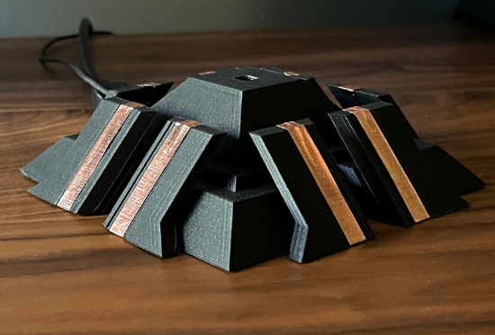](https://learn.adafruit.com/guides/latest)

[Tyrell Desktop Synthesizer](https://learn.adafruit.com/tyrell-desktop-synthesizer) from [John Park](https://learn.adafruit.com/u/johnpark)

[NES Emulator for RP2040 DVI Boards](https://learn.adafruit.com/nes-emulator-for-rp2040-dvi-boards) from [Phillip Burgess](https://learn.adafruit.com/u/pburgess)

[Fisher-Price USB Foot Pedal](https://learn.adafruit.com/fisher-price-usb-foot-pedal) from [Robert Dale Smith](https://learn.adafruit.com/u/RobertDaleSmith)

[Adafruit Audio BFF](https://learn.adafruit.com/adafruit-audio-bff) from [Liz Clark](https://learn.adafruit.com/u/BlitzCityDIY)

## CircuitPython Libraries!

The CircuitPython library numbers are continually increasing, while existing ones continue to be updated. Here we provide library numbers and updates!

To get the latest Adafruit libraries, download the [Adafruit CircuitPython Library Bundle](https://circuitpython.org/libraries). To get the latest community contributed libraries, download the [CircuitPython Community Bundle](https://circuitpython.org/libraries).

If you'd like to contribute to the CircuitPython project on the Python side of things, the libraries are a great place to start. Check out the [CircuitPython.org Contributing page](https://circuitpython.org/contributing). If you're interested in reviewing, check out Open Pull Requests. If you'd like to contribute code or documentation, check out Open Issues. We have a guide on [contributing to CircuitPython with Git and GitHub](https://learn.adafruit.com/contribute-to-circuitpython-with-git-and-github), and you can find us in the #help-with-circuitpython and #circuitpython-dev channels on the [Adafruit Discord](https://adafru.it/discord).

You can check out this [list of all the Adafruit CircuitPython libraries and drivers available](https://github.com/adafruit/Adafruit_CircuitPython_Bundle/blob/master/circuitpython_library_list.md). 

The current number of CircuitPython libraries is **446**!

**Updated Libraries!**

Here's this week's updated CircuitPython libraries:

* [adafruit/Adafruit_CircuitPython_PortalBase](https://github.com/adafruit/Adafruit_CircuitPython_PortalBase)
* [adafruit/Adafruit_CircuitPython_SGP40](https://github.com/adafruit/Adafruit_CircuitPython_SGP40)
* [jposada202020/CircuitPython_uplot](https://github.com/jposada202020/CircuitPython_uplot)

**Library PyPI Weekly Download Stats**
* **Total Library Stats**
  * 91318 PyPI downloads over 311 libraries
* **Top 10 Libraries by PyPI Downloads**
  * Adafruit CircuitPython BusDevice (adafruit-circuitpython-busdevice): 7005
  * Adafruit CircuitPython Requests (adafruit-circuitpython-requests): 6354
  * Adafruit CircuitPython Register (adafruit-circuitpython-register): 1775
  * Adafruit CircuitPython NeoPixel (adafruit-circuitpython-neopixel): 1039
  * Adafruit CircuitPython PCA9685 (adafruit-circuitpython-pca9685): 960
  * Adafruit CircuitPython Motor (adafruit-circuitpython-motor): 891
  * Adafruit CircuitPython ServoKit (adafruit-circuitpython-servokit): 853
  * Adafruit CircuitPython ADS1x15 (adafruit-circuitpython-ads1x15): 837
  * Adafruit CircuitPython Wiznet5k (adafruit-circuitpython-wiznet5k): 682
  * Adafruit CircuitPython SSD1306 (adafruit-circuitpython-ssd1306): 653

## What’s the CircuitPython team up to this week?

What is the team up to this week? Let’s check in!

**Dan**

I'm still working on the MicroPython v1.19.1 merge to CircuitPython. I made one pass through the merge and am now revisiting the changes, now that I have the context for everything.

It looks like we'll be doing a CircuitPython 8.2.1 with some necessary fixes soon.

I visited the [Center for Engineering Education and Outreach at Tufts University](https://www.ceeoinnovations.org/fetlab/) today, on the invitation of Prof. Chris Rogers, to let the summer student interns play with some CircuitPython boards. I've been there several times. They are using MicroPython, CircuitPython, AdafruitIO, LEGO robotics, and similar technologies to improve engineering education from kindergarten up through college. It's always fun to visit and see what they're up to.

**Kattni**

This week I continued to work through guide feedback, and kept up with making sure this newsletter was ready to go. Turns out when I'm down to the most difficult feedback to resolve, it can literally be a full-time job!

**Melissa**

This past week I finished writing a learn guide for the MatrixPortal S3. The guide is currently in moderation, so keep an eye out for it to be published soon.

I also attended [Open Sauce](https://opensauce.live/) in San Francisco. If you were there, I hope I had a chance to meet you.

**Tim**

I didn't get as much CircuitPython activity as usual due to a power outage at my home over a chunk of time where I normally work and stream CircuitPython related things. The work I did get into after the power returned was following up on Library PR Reviews, and learning the ropes on how to prepare the data to submit to OSHWA for certification of open source hardware.

**Jeff**

I've worked on supporting SD card interfacing using the faster SDIO protocol on the RP2040 microcontroller. This would be handy on an upcoming board from Adafruit, as well some other boards like the Pimoroni Pico DV Base.

Raspberry Pi has provided some code in their repository called "pico-extras"; I've cleaned it up and made it suitable for inclusion in CircuitPython. However, it's not super stable (frequently corrupts the SD card when writing files) and is unable to determine the capacity of the SD card, so it's not going to be immediately added into CircuitPython.

The code is [on my github](https://github.com/adafruit/circuitpython/compare/main...jepler:circuitpython:rp2-sdioio?expand=1) if you want to check it out, but don't expect it to work properly yet!

For the moment, our goal of verifying that this RP2040 Metro board design is correct for 4-bit SDIO is satisfied.

**Scott**

This last week has been overwhelmed by "just started daycare" sickness. So, I haven't done a bunch. I was a bit distracted by Jeff finding [color bitmap emoji from the Serenity OS project](https://chaos.social/@linusgroh/110729628638311045). My [PR](https://github.com/adafruit/circuitpython/pull/8182) to fix the usb_host.Port initialization was merged. I've found a caching issue on the iMX and will have [fix](https://github.com/adafruit/circuitpython/pull/8187) for that shortly too. These issues were found as I try to add support for usb mass storage device (aka usb thumb drives) on the iMX.

**Liz**

This week I wrote a guide for the new [Audio BFF breakout](https://learn.adafruit.com/adafruit-audio-bff). This breakout has an I2S amp and micro SD card slot that can attach directly to a QT Py board. I think it could make for a really great tiny music player. 

## Upcoming events!

The next MicroPython Meetup in Melbourne will be on June 28th – [Meetup](https://www.meetup.com/micropython-meetup/events). From the May 24th meeting - [Notes](https://docs.google.com/presentation/d/e/2PACX-1vQ3rvNGR3NyBkSc6t1nXMoGvNuf9Btq10ZQR-4DagW5q4cbPtGMZXOoRRRo2wWOi2u7xH-Bf_HTBjb2/pub?slide=id.p).

[PyCon AU](https://2023.pycon.org.au/) will be held August 18th - 22nd in Adelaide, Australia. The conference schedule was recently published and notable talks include [You can't do that in MicroPython](https://2023.pycon.org.au/program/F7JN7X/) by Matt Trentini and [10 Years of MicroPython](https://2023.pycon.org.au/program/ZDUVFF/) by Damien George. - [PyCon AU](https://2023.pycon.org.au/).

PyCon UK will be returning to Cardiff City Hall from Friday 22nd September to Monday 25th September 2023 - [PyCon UK](https://2023.pyconuk.org/).

[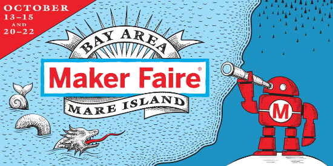](https://makezine.com/article/maker-news/maker-faire/big-news-maker-faire-bay-area-will-return-this-october/)

Maker Faire Bay Area will be held this October at Mare Island over two consecutive weekends, October 13-15 and October 20-22. - [Make](https://makezine.com/article/maker-news/maker-faire/big-news-maker-faire-bay-area-will-return-this-october/)

Hackaday has announced that the Hackaday Supercon is on for 2023, and will be taking place November 3 – 5 in Pasadena, California, USA. They’d like to hear your proposals for talks and workshops! The [Call for Speakers](https://docs.google.com/forms/d/e/1FAIpQLSfYDwIzWTHZ0_7d8GUznm3Z9w3y8aDcV1MVGSUyY1nTcdJ9Jw/viewform?usp=sf_link) and [Call for Workshops](https://docs.google.com/forms/d/e/1FAIpQLSeJIm0fWcrJIN8ge1K6Mvt2tfoFYOqre3isod5vKRGr-iyvJg/viewform?usp=sf_link) forms are online now, and you have until July 18th to sign up - [Adafruit Blog](https://blog.adafruit.com/2023/05/10/hackaday-supercon-2023-is-on-supercon-hackaday/) and [Hackaday](https://hackaday.com/2023/05/10/supercon-2023-is-on-we-want-you/).

The Pyjamas Conference, the 24-hour online Python conference, will be returning for a fifth year. The Call for Papers will begin on September 2nd. - [Twitter](https://twitter.com/PyjamasConf/status/1675278222798495745).

**Send Your Events In**

If you know of virtual events or upcoming events, please let us know via email to cpnews(at)adafruit(dot)com.

## Latest releases

CircuitPython's stable release is [8.2.0](https://github.com/adafruit/circuitpython/releases/latest). New to CircuitPython? Start with our [Welcome to CircuitPython Guide](https://learn.adafruit.com/welcome-to-circuitpython).

[20230718](https://github.com/adafruit/Adafruit_CircuitPython_Bundle/releases/latest) is the latest Adafruit CircuitPython library bundle.

[20230720](https://github.com/adafruit/CircuitPython_Community_Bundle/releases/latest) is the latest CircuitPython Community library bundle.

[v1.20.0](https://micropython.org/download) is the latest MicroPython release. Documentation for it is [here](http://docs.micropython.org/en/latest/pyboard/).

[3.11.4](https://www.python.org/downloads/) is the latest Python release. The latest pre-release version is [3.12.0b4](https://www.python.org/download/pre-releases/).

[3,598 Stars](https://github.com/adafruit/circuitpython/stargazers) Like CircuitPython? [Star it on GitHub!](https://github.com/adafruit/circuitpython)

## Call for help -- Translating CircuitPython is now easier than ever!

[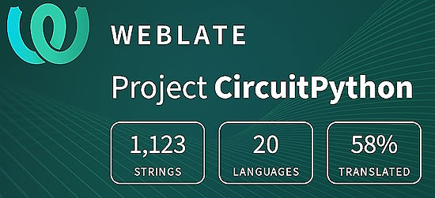](https://hosted.weblate.org/engage/circuitpython/)

One important feature of CircuitPython is translated control and error messages. With the help of fellow open source project [Weblate](https://weblate.org/), we're making it even easier to add or improve translations. 

Sign in with an existing account such as GitHub, Google or Facebook and start contributing through a simple web interface. No forks or pull requests needed! As always, if you run into trouble join us on [Discord](https://adafru.it/discord), we're here to help.

## 37,952 thanks!

The Adafruit Discord community, where we do all our CircuitPython development in the open, reached over 37,952 humans - thank you! Adafruit believes Discord offers a unique way for Python on hardware folks to connect. Join today at [https://adafru.it/discord](https://adafru.it/discord).

## ICYMI - In case you missed it

Python on hardware is the Adafruit Python video-newsletter-podcast! The news comes from the Python community, Discord, Adafruit communities and more and is broadcast on ASK an ENGINEER Wednesdays. The complete Python on Hardware weekly videocast [playlist is here](https://www.youtube.com/playlist?list=PLjF7R1fz_OOXRMjM7Sm0J2Xt6H81TdDev). The video podcast is on [iTunes](https://itunes.apple.com/us/podcast/python-on-hardware/id1451685192?mt=2), [YouTube](http://adafru.it/pohepisodes), [IGTV (Instagram TV](https://www.instagram.com/adafruit/channel/)), and [XML](https://itunes.apple.com/us/podcast/python-on-hardware/id1451685192?mt=2).

[The weekly community chat on Adafruit Discord server CircuitPython channel - Audio / Podcast edition](https://itunes.apple.com/us/podcast/circuitpython-weekly-meeting/id1451685016) - Audio from the Discord chat space for CircuitPython, meetings are usually Mondays at 2pm ET, this is the audio version on [iTunes](https://itunes.apple.com/us/podcast/circuitpython-weekly-meeting/id1451685016), Pocket Casts, [Spotify](https://adafru.it/spotify), and [XML feed](https://adafruit-podcasts.s3.amazonaws.com/circuitpython_weekly_meeting/audio-podcast.xml).

## Contribute!

The CircuitPython Weekly Newsletter is a CircuitPython community-run newsletter emailed every Tuesday. The complete [archives are here](https://www.adafruitdaily.com/category/circuitpython/). It highlights the latest CircuitPython related news from around the web including Python and MicroPython developments. To contribute, edit next week's draft [on GitHub](https://github.com/adafruit/circuitpython-weekly-newsletter/tree/gh-pages/_drafts) and [submit a pull request](https://help.github.com/articles/editing-files-in-your-repository/) with the changes. You may also tag your information on Twitter with #CircuitPython. 

Join the Adafruit [Discord](https://adafru.it/discord) or [post to the forum](https://forums.adafruit.com/viewforum.php?f=60) if you have questions.
