View this email in your browser. **Warning: Flashing Imagery**

Welcome to the latest Python on Microcontrollers newsletter! Your editor is back and extends thanks to Kattni & Paul for their hard work covering in my stead. CircuitPython Day 2023 is on for August 18th, keep an eye out for scheduled activities. CircuitPython 8.2.1 is out with more functionality. Finally, I'm looking to keep newsletters being published on Monday mornings (US time), so keep an eye on your inboxes every Monday instead of Tuesday *- Anne Barela, Ed.*

We're on [Discord](https://discord.gg/HYqvREz), [Twitter](https://twitter.com/search?q=circuitpython&src=typed_query&f=live), and for past newsletters - [view them all here](https://www.adafruitdaily.com/category/circuitpython/). If you're reading this on the web, [subscribe here](https://www.adafruitdaily.com/). Here's the news this week:

## CircuitPython 8.2.1 Released

CircuitPython 8.2.1 is now the latest bugfix revision of CircuitPython, and is the new stable release - [Adsafruit Blog](https://blog.adafruit.com/2023/07/25/circuitpython-8-2-1-released/) and [Release Notes](https://github.com/adafruit/circuitpython/releases/tag/8.2.1).

**Notable changes to 8.2.1 since 8.1.0**

- Continued enhancement of `synthio`.
- RP2040 `alarm.sleep_memory`.

Note for nRF52 boards only: If your board has an nRF52 UF2 bootloader whose version is before 0.6.1, you will not be able to load CircuitPython 8.2.0 and later. The 8.2.0 firmware is larger than what the bootloader can handle. See [these instructions](https://learn.adafruit.com/introducing-the-adafruit-nrf52840-feather/update-bootloader) for updating your bootloader.

## CircuitPython Hack Chat

[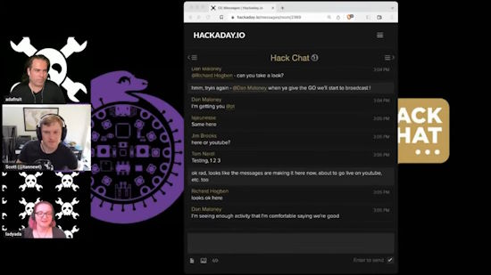](https://www.youtube.com/watch?v=8VhdFH7UEEQ)

Hackaday.io and Adafruit cosponsored a Hack Chat with key Adafruit folks about CircuitPython. If you missed the live broadcast last week, you can see it now - [YouTube](https://www.youtube.com/watch?v=8VhdFH7UEEQ).

## Adafruit IO WipperSnapper Now Supports 20 Boards

[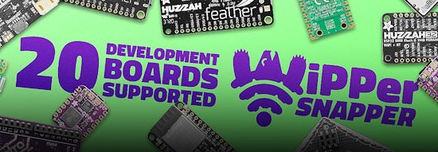](https://blog.adafruit.com/2023/07/20/adafruit-io-wippersnapper-now-supports-20-boards/)

Wippersnapper is the no code firmware for building internet-connected electronics projects. It now supports twenty (20) development boards with more to come - [Adafruit Blog](https://blog.adafruit.com/2023/07/20/adafruit-io-wippersnapper-now-supports-20-boards/).

## CircuitPython Day: August 18, 2023

The annual CircuitPython Day celebrations have been scheduled for August 18, 2023. Keep an eye on the [Adafruit Blog](https://blog.adafruit.com/) for announcements as well as next week's newsletter.

## MicroPython Adds LoRa Support

[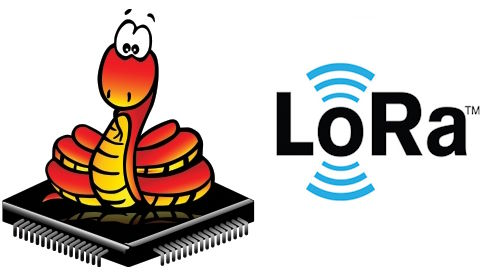](url)

LoRa driver is a MicroPython library providing synchronous and asynchronous wireless drivers for Semtech's LoRa (Long Range Radio) modem devices - [GitHub](https://github.com/micropython/micropython-lib/tree/master/micropython/lora) via [Twitter](https://twitter.com/matt_trentini/status/1682033849180753920https://twitter.com/matt_trentini/status/1682033849180753920).

## Tom's Hardware Interviews Edublocks Founder Josh Lowe

The Tom's Hardware Pi Cast (July 25th) featres Edublocks with Josh Lowe. "Learning to code with Python is fun, but it can also be difficult. So how can we help learners moving from blocks to Python?" - [YouTube](https://www.youtube.com/watch?v=13zUSwWfzv8).

## A Comprehensive Python Cheatsheet

[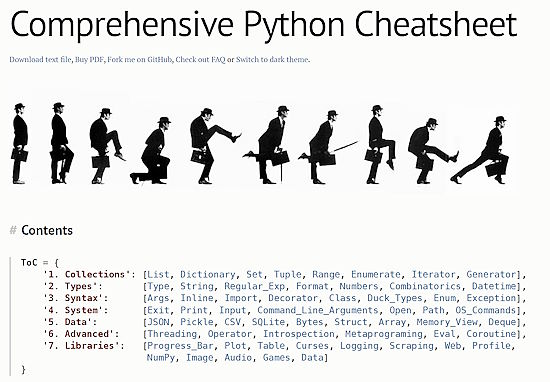](https://gto76.github.io/python-cheatsheet/)

One of the most popular items in our newsletters are when new cheat sheets are published in the community. Here is a newsly published sheet by Jure Šorn - [github.io](https://gto76.github.io/python-cheatsheet/).

## hackster.io Reviews the Adafruit Matrix Portal S3

[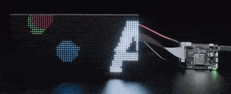](https://www.hackster.io/news/adafruit-matrix-portal-s3-controls-large-led-matrices-with-circuitpython-5e28e3687c81)

Adafruit Matrix Portal S3 Controls Large LED Matrices with CircuitPython. The update to their previous board improves performance and adds BLE support - [hackster.io](https://www.hackster.io/news/adafruit-matrix-portal-s3-controls-large-led-matrices-with-circuitpython-5e28e3687c81).

## This Week's Python Streams

Python on Hardware is all about building a cooperative ecosphere which allows contributions to be valued and to grow knowledge. Below are the streams within the last week focusing on the community.

**CircuitPython Deep Dive Stream**

[On Friday](https://www.youtube.com/watch?v=lNmwbJ5EH7o), Scott (the CircuitPython lead developer) returned and streamed work on USB Host.

You can see the latest video and past videos on the Adafruit YouTube channel under the Deep Dive playlist - [YouTube](https://www.youtube.com/playlist?list=PLjF7R1fz_OOXBHlu9msoXq2jQN4JpCk8A).

**CircuitPython Parsec**

John Park’s CircuitPython Parsec this week is on Circuit Playground NeoPixels - [Adafruit Blog](https://blog.adafruit.com/2023/07/28/john-parks-circuitpython-parsec-circuit-playground-neopixels-adafruit-circuitpython/https://blog.adafruit.com/2023/07/28/john-parks-circuitpython-parsec-circuit-playground-neopixels-adafruit-circuitpython/), [GitHub](https://github.com/jedgarpark/parsec) and [YouTube](https://youtu.be/8wGLAw9xhUg).

Catch all the episodes in the [YouTube playlist](https://www.youtube.com/playlist?list=PLjF7R1fz_OOWFqZfqW9jlvQSIUmwn9lWr).

## Project of the Week: Placing a Raspberry Pi Zero or CM4 in a Sony Playstaion Portable

[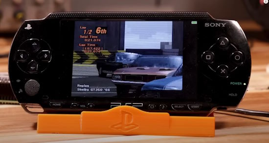](https://www.youtube.com/watch?v=PBcK6hLdLKg)

PSPi 6 is a combination of hardware and software development aiming to retrofit a Sony PSP with almost any type of Raspberry Pi, including a Compute Module 4 - [YouTube](https://www.youtube.com/watch?v=PBcK6hLdLKg) and [GitHub](https://github.com/othermod/PSPi-Version-6).

## News from around the web!

[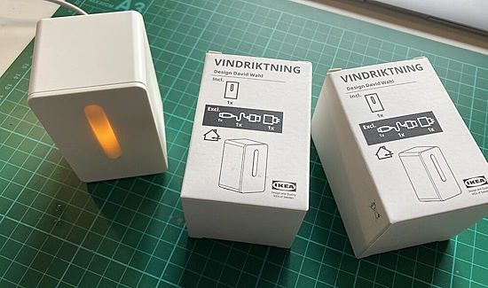](https://www.raspberrypi.com/news/hacking-ikea/)

Alasdair Allan documents his work with hacking the Ikea Vindriktning air quality sensor. The project is in MicroPython and adds an Adafruit BMP280 barometric pressure sensor. The project borrows from [Liz Clark's tutorial](https://learn.adafruit.com/ikea-vindriktning-hack-with-qt-py-esp32-s3-and-adafruit-io/overview) which used CircuitPython and Adafruit IO - [Raspberry Pi](https://www.raspberrypi.com/news/hacking-ikea/) and [GitHub](https://gist.github.com/aallan/510847c5ca0d74843d0fb8818a06df0c).

[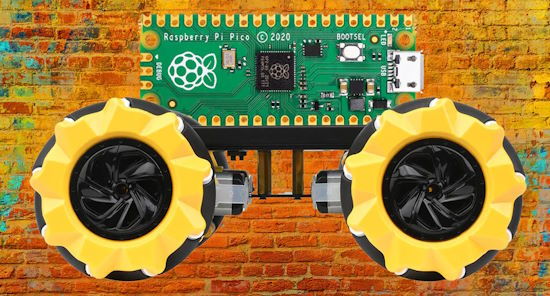](https://thepihut.com/blogs/raspberry-pi-tutorials/build-a-raspberry-pi-pico-robot-with-mecanum-wheels)

Build a Raspberry Pi Pico Robot with Mecanum Wheels, programmed in MicroPython - [The PiHut](https://thepihut.com/blogs/raspberry-pi-tutorials/build-a-raspberry-pi-pico-robot-with-mecanum-wheels).

[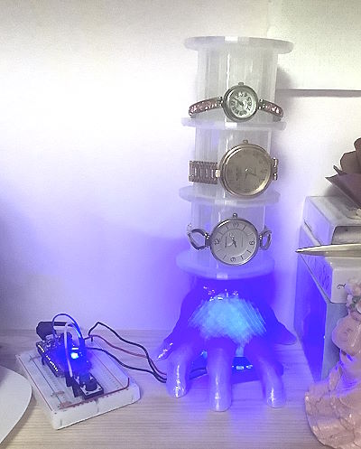](https://twitter.com/OwainM713/status/1682484669462503425)

> "A stacking watch stand for my daughter is mostly complete. Each section is adjustable for different sizes of watches/wrists. A simple CircuitPython program for the lights" - [Twitter](https://twitter.com/OwainM713/status/1682484669462503425).

Chris Heninger has taken [Allie Katz' BMO project](https://twitter.com/KatzCreates/status/1683039193113452544?t=loD1VEELWSLe3IUWDXNNKg&s=03) and built an operating system for it in Python with menus and more - [Twitter](https://twitter.com/chrisheninger/status/1682973025862287360) and [GitHub](https://github.com/chrisheninger/BMOctoprint/blob/chris/Code%20Files/BMO-OS.py).

[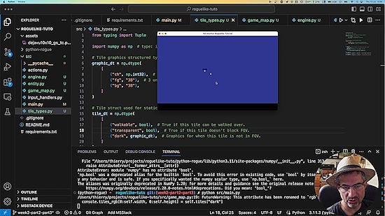](https://gitlab.com/TitiMoby/roguelike-tuto)

Making a [Rogue](https://en.wikipedia.org/wiki/Rogue_(video_game))-like game in Python - [GitLab](https://gitlab.com/TitiMoby/roguelike-tuto) and YouTube videos in French [First](https://youtu.be/p0bcdIfrOV8) and [Second](https://youtu.be/lZJgs2wqjVo).

[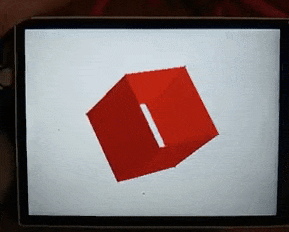](https://twitter.com/digitalMakerCIC/status/1681268997885419521)

Drawing a 3D cube with CircuitPython and a Pimoroni PicoDisplay - [Twitter](https://twitter.com/digitalMakerCIC/status/1681268997885419521).

> "It was a lot of work the past months and a huge team effort but I'm extremely happy how the #flow3r Badge for #cccamp23 turned out! I hope it will bring a lot of fun to people long after the event. It is a small hand held touch music instrument that runs Micropython" - [Twitter](https://twitter.com/timonsku/status/1684990430650216465).

[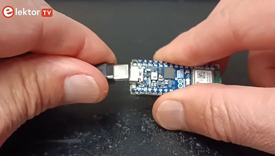](https://www.youtube.com/watch?v=JZn006KMmQY)

Arduino Nano ESP32 - A Short Tutorial to Setup and IoT Usage - [YouTube](https://www.youtube.com/watch?v=JZn006KMmQY).

[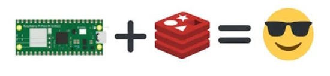](https://github.com/simonprickett/micropython-workshop)

Redis MicroPython Workshop with Raspberry Pi Pico W and Pimoroni GFX Pack - [GitHub](https://github.com/simonprickett/micropython-workshop).

[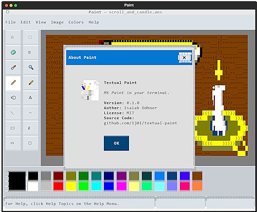](https://github.com/1j01/textual-paint)

Textual Paint is a TUI (Text User Interface) image editor for a terminal. Inspired by MS Paint, it is built with Textual - [GitHub](https://github.com/1j01/textual-paint).

[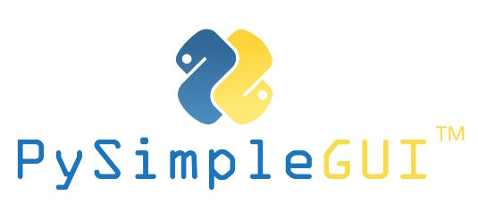](https://github.com/PySimpleGUI/PySimpleGUI)

PySimpleGUI is a Python package that enables Python programmers of all levels to create GUIs - [GitHub](https://github.com/PySimpleGUI/PySimpleGUI).

[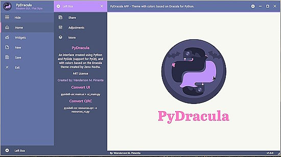](https://github.com/Wanderson-Magalhaes/Modern_GUI_PyDracula_PySide6_or_PyQt6)

PyDracula, a modern GUI using PySide6 / PyQt6 - [GitHub](https://github.com/Wanderson-Magalhaes/Modern_GUI_PyDracula_PySide6_or_PyQt6).

[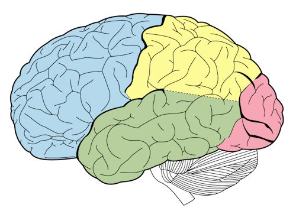](https://github.com/jaseg/cerebrum)

Cerebrum is a system building modular firmware images for embedded microcontrollers that can be controlled from a host application connected via an RPC-like protocol on any serial bus, written in Python - [GitHub](https://github.com/jaseg/cerebrum).

PyDev of the Week: Sanskar Jethi on [Mouse vs Python](https://www.blog.pythonlibrary.org/2023/07/24/pydev-of-the-week-sanskar-jethi/).

CircuitPython Weekly Meeting for July 24, 2023 ([notes](https://github.com/adafruit/adafruit-circuitpython-weekly-meeting/blob/main/2023/2023-07-24.md)) [on YouTube](https://www.youtube.com/watch?v=ss_cR2TW0sQ).

#ICYDNCI What was the most popular, most clicked link, in [last week's newsletter](https://www.adafruitdaily.com/2023/07/24/python-on-microcontrollers-newsletter-silicon-labs-introduces-circuitpython-support-and-more-circuitpython-python-micropython-thepsf-raspberry_pi/)? [Introducing CircuitPython Support for Silabs' xG24 Boards](https://community.silabs.com/s/share/a5U8Y000001a2QoUAI/introducing-circuitpython-support-for-silabs-xg24-boards?language=en_US).

## New

[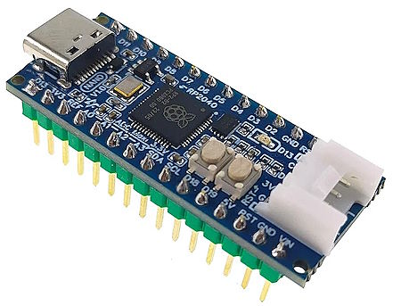](https://www.cnx-software.com/2023/07/26/rp2-nano-raspberry-pi-rp2040-board-arduino-nano/)

RP2 Nano is an inexpensive Raspberry Pi RP2040 board with an Arduino Nano form factor - [CNX Software](https://www.cnx-software.com/2023/07/26/rp2-nano-raspberry-pi-rp2040-board-arduino-nano/).

[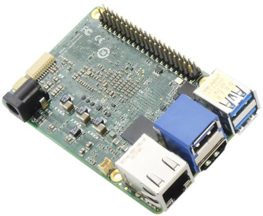](https://www.cnx-software.com/2023/07/26/up-7000-powerful-intel-alder-lake-n-alternative-raspberry-pi-4-sbc/)

UP 7000 is a powerful x86 alternative to the Raspberry Pi 4 SBC with an Intel Processor N50/N97/N100 CPU. The new fanless board also comes with up to 8GB LPDDR5, 64GB eMMC flash, and an onboard TPM 2.0 - [CNX Software](https://www.cnx-software.com/2023/07/26/up-7000-powerful-intel-alder-lake-n-alternative-raspberry-pi-4-sbc/).

[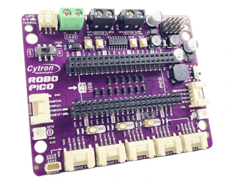](https://www.cytron.io/p-robo-pico)

Robo Pico: Simplifying Robotics for Raspberry Pi Pico / Pico W, works with CircuitPython and MicroPython - [Cytron](https://www.cytron.io/p-robo-pico).

## New Boards Supported by CircuitPython

The number of supported microcontrollers and Single Board Computers (SBC) grows every week. This section outlines which boards have been included in CircuitPython or added to [CircuitPython.org](https://circuitpython.org/).

This week, there were six new boards added!

- [Pajenicko Picopad](https://circuitpython.org/board/pajenicko_picopad/)
- [Liatris](https://circuitpython.org/board/splitkb_liatris/)
- [nRF52840 Connect Kit](https://circuitpython.org/board/makerdiary_nrf52840_connectkit/)
- [PicoADK - Audio Development Kit](https://circuitpython.org/board/datanoise_picoadk/)
- [Adafruit Metro RP2040](https://circuitpython.org/board/adafruit_metro_rp2040/)
- [Adafruit Metro ESP32-S3](https://circuitpython.org/board/adafruit_metro_esp32s3/)

*Note: For non-Adafruit boards, please use the support forums of the board manufacturer for assistance, as Adafruit does not have the hardware to assist in troubleshooting.*

Looking to add a new board to CircuitPython? It's highly encouraged! Adafruit has four guides to help you do so:

- [How to Add a New Board to CircuitPython](https://learn.adafruit.com/how-to-add-a-new-board-to-circuitpython/overview)
- [How to add a New Board to the circuitpython.org website](https://learn.adafruit.com/how-to-add-a-new-board-to-the-circuitpython-org-website)
- [Adding a Single Board Computer to PlatformDetect for Blinka](https://learn.adafruit.com/adding-a-single-board-computer-to-platformdetect-for-blinka)
- [Adding a Single Board Computer to Blinka](https://learn.adafruit.com/adding-a-single-board-computer-to-blinka)

## New Learn Guides!

[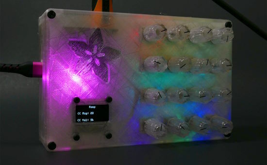](https://learn.adafruit.com/guides/latest)

[4x4 Rotary Encoder MIDI Messenger](https://learn.adafruit.com/4x4-rotary-encoder-midi-messenger) from [Liz Clark](https://learn.adafruit.com/u/BlitzCityDIY)

[Adafruit Audio BFF](https://learn.adafruit.com/adafruit-audio-bff) from [Liz Clark](https://learn.adafruit.com/u/BlitzCityDIY)

[Adafruit MatrixPortal S3](https://learn.adafruit.com/adafruit-matrixportal-s3) from [Melissa LeBlanc-Williams](https://learn.adafruit.com/u/MakerMelissa)

[Adafruit RP2040 Prop-Maker Feather](https://learn.adafruit.com/adafruit-rp2040-prop-maker-feather) from [Liz Clark](https://learn.adafruit.com/u/BlitzCityDIY)

## Updated Learn Guides!

[Contribute to CircuitPython with Git and GitHub](https://learn.adafruit.com/contribute-to-circuitpython-with-git-and-github) from [Kattni](https://learn.adafruit.com/u/kattni)

## CircuitPython Libraries!

The CircuitPython library numbers are continually increasing, while existing ones continue to be updated. Here we provide library numbers and updates!

To get the latest Adafruit libraries, download the [Adafruit CircuitPython Library Bundle](https://circuitpython.org/libraries). To get the latest community contributed libraries, download the [CircuitPython Community Bundle](https://circuitpython.org/libraries).

If you'd like to contribute to the CircuitPython project on the Python side of things, the libraries are a great place to start. Check out the [CircuitPython.org Contributing page](https://circuitpython.org/contributing). If you're interested in reviewing, check out Open Pull Requests. If you'd like to contribute code or documentation, check out Open Issues. We have a guide on [contributing to CircuitPython with Git and GitHub](https://learn.adafruit.com/contribute-to-circuitpython-with-git-and-github), and you can find us in the #help-with-circuitpython and #circuitpython-dev channels on the [Adafruit Discord](https://adafru.it/discord).

You can check out this [list of all the Adafruit CircuitPython libraries and drivers available](https://github.com/adafruit/Adafruit_CircuitPython_Bundle/blob/master/circuitpython_library_list.md). 

The current number of CircuitPython libraries is **445**!

**Updated Libraries!**

Here's this week's updated CircuitPython libraries:

  * [adafruit/Adafruit_CircuitPython_Dash_Dis](https://github.com/adafruit/Adafruit_CircuitPython_Dash_Dis)
  * [adafruit/Adafruit_CircuitPython_Requests](https://github.com/adafruit/Adafruit_CircuitPython_Requests)
  * [jposada202020/CircuitPython_uplot](https://github.com/jposada202020/CircuitPython_uplot)

**Library PyPI Weekly Download Stats**

**Total Library Stats**

  * 117554 PyPI downloads over 311 libraries
 
**Top 10 Libraries by PyPI Downloads**

  * Adafruit CircuitPython BusDevice (adafruit-circuitpython-busdevice): 7288
  * Adafruit CircuitPython Requests (adafruit-circuitpython-requests): 6937
  * Adafruit CircuitPython Register (adafruit-circuitpython-register): 1839
  * Adafruit CircuitPython NeoPixel (adafruit-circuitpython-neopixel): 1351
  * Adafruit CircuitPython Wiznet5k (adafruit-circuitpython-wiznet5k): 1284
  * Adafruit CircuitPython Motor (adafruit-circuitpython-motor): 1197
  * Adafruit CircuitPython ServoKit (adafruit-circuitpython-servokit): 1112
  * Adafruit CircuitPython ESP32SPI (adafruit-circuitpython-esp32spi): 1045
  * Adafruit CircuitPython ADS1x15 (adafruit-circuitpython-ads1x15): 1036
  * Adafruit CircuitPython Display Text (adafruit-circuitpython-display-text): 1014

## What’s the CircuitPython team up to this week?

What is the team up to this week? Let’s check in!

**Dan**

I released CircuitPython 8.2.1 last Tuesday. It has a fix for the newly released MatrixPortal S3, and there are about 15 other changes and fixes, including some new boards.

I'm getting close to actually trying to compile the MicroPython v1.19.1 merge to CircuitPython.

**Kattni**

This week I wrapped up the final newsletter of my editing run. Thanks again to Paul for all the help there. We both greatly appreciate all of you bearing with us and doing amazing things for us to include in our newsletters. 

I also worked on various guide fixes and updates. The biggest update was to the [Contribute to CircuitPython Using Git and GitHub](https://learn.adafruit.com/contribute-to-circuitpython-with-git-and-github) guide. This guide is a first stop for many folks who are new to contributing to CircuitPython or open source projects in general, as well as for experienced folks who are new to contributing to CircuitPython specifically, or are simply interested in how we do things. GitHub updated their user interface in the last couple of years, and we changed how we do our code testing since the guide was written, and, while the info overall was still solid, there were parts of it that were woefully out of date. Not anymore! Everything is now up to date and covers our current testing methods. There's new info on using GitHub Actions, and accepting suggested changes on a pull request through the GitHub interface. Even if you're familiar with this guide, it's worth checking out!

**Melissa**

This past week I added my first CircuitPython board definitions from scratch. I had modified mostly complete ones previously. They're still in the process of being merged at this time. The guide I wrote for the Adafruit MatrixPortal S3 was also published this last week, and you can go [check it out](https://learn.adafruit.com/adafruit-matrixportal-s3).

**Tim**

I've continued learning the ropes for OSHWA certification requests, and have gotten more experience collecting the information and submitting requests. I did testing and reviews for several PRs in the Wiznet5k Ethernet, and Requests libraries. I also started submitting changes related to recent updates to `bitmaptools` from the core.

**Jeff**

This week Ladyada sent me a prototype of the long awaited PyCamera board, which integrates a WiFi microcontroller, 5-megapixel camera and SD card reader, among other goodies. I've been putting it through its paces and fixing bugs that came up along the way.

I also added a small feature to `synthio` to get information about currently playing notes.

**Scott**

I've been working on mass storage support from CircuitPython. It works on iMX RT with another CircuitPython device connected. My usb flash drive doesn't work yet. RP2040 doesn't work with CircuitPython now either. So, I'm still in the USB host debugging weeds.

I'm starting to host Deep Dives again (when not on dad duty.) They are streamed at 2pm Pacific on Fridays. Thanks to Tim (aka FoamyGuy) for deep diving this past year and filling in for me in the future too.

**Liz**

This week I published a guide for my [4x4 Rotary Encoder MIDI Messenger project](https://learn.adafruit.com/4x4-rotary-encoder-midi-messenger). This project uses four of the quad rotary encoder breakouts. The code is written in CircuitPython and uses `asyncio` along with the interrupt pins on the breakouts to make reading the data from the encoders super responsive. It was my first time using `asyncio` and it definitely won't be the last. I'm looking forward to using it for more complicated projects in the future.

## Upcoming Events!

[PyCon AU](https://2023.pycon.org.au/) will be held August 18th - 22nd in Adelaide, Australia. The conference schedule was recently published and notable talks include [You can't do that in MicroPython](https://2023.pycon.org.au/program/F7JN7X/) by Matt Trentini and [10 Years of MicroPython](https://2023.pycon.org.au/program/ZDUVFF/) by Damien George - [PyCon AU](https://2023.pycon.org.au/).

The next MicroPython Meetup in Melbourne, Australia will be on August 23rd – [Meetup](https://www.meetup.com/micropython-meetup/events). 

PyCon UK will be returning to Cardiff City Hall from Friday 22nd September to Monday 25th September 2023 - [PyCon UK](https://2023.pyconuk.org/).

Hackaday has announced that the Hackaday Supercon is on for 2023, and will be taking place November 3 – 5 in Pasadena, California, USA. They’d like to hear your proposals for talks and workshops! The [Call for Speakers](https://docs.google.com/forms/d/e/1FAIpQLSfYDwIzWTHZ0_7d8GUznm3Z9w3y8aDcV1MVGSUyY1nTcdJ9Jw/viewform?usp=sf_link) and [Call for Workshops](https://docs.google.com/forms/d/e/1FAIpQLSeJIm0fWcrJIN8ge1K6Mvt2tfoFYOqre3isod5vKRGr-iyvJg/viewform?usp=sf_link) forms are online now, and you have until July 18th to sign up - [Adafruit Blog](https://blog.adafruit.com/2023/05/10/hackaday-supercon-2023-is-on-supercon-hackaday/) and [Hackaday](https://hackaday.com/2023/05/10/supercon-2023-is-on-we-want-you/).

The Pyjamas Conference, the 24-hour online Python conference, will be returning for a fifth year. The Call for Papers will begin on September 2nd. - [Twitter](https://twitter.com/PyjamasConf/status/1675278222798495745).

**Send Your Events In**

If you know of virtual events or upcoming events, please let us know via email to cpnews(at)adafruit(dot)com.

## Latest releases

CircuitPython's stable release is [8.2.1](https://github.com/adafruit/circuitpython/releases/latest). New to CircuitPython? Start with our [Welcome to CircuitPython Guide](https://learn.adafruit.com/welcome-to-circuitpython).

[20230725](https://github.com/adafruit/Adafruit_CircuitPython_Bundle/releases/latest) is the latest Adafruit CircuitPython library bundle.

[20230724](https://github.com/adafruit/CircuitPython_Community_Bundle/releases/latest) is the latest CircuitPython Community library bundle.

[v1.20.0](https://micropython.org/download) is the latest MicroPython release. Documentation for it is [here](http://docs.micropython.org/en/latest/pyboard/).

[3.11.4](https://www.python.org/downloads/) is the latest Python release. The latest pre-release version is [3.12.0b4](https://www.python.org/download/pre-releases/).

[3,600 Stars](https://github.com/adafruit/circuitpython/stargazers) Like CircuitPython? [Star it on GitHub!](https://github.com/adafruit/circuitpython)

## Call for help -- Translating CircuitPython is now easier than ever!

[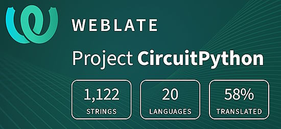](https://hosted.weblate.org/engage/circuitpython/)

One important feature of CircuitPython is translated control and error messages. With the help of fellow open source project [Weblate](https://weblate.org/), we're making it even easier to add or improve translations. 

Sign in with an existing account such as GitHub, Google or Facebook and start contributing through a simple web interface. No forks or pull requests needed! As always, if you run into trouble join us on [Discord](https://adafru.it/discord), we're here to help.

## 37,641 thanks!

The Adafruit Discord community, where we do all our CircuitPython development in the open, reached over 37,641 humans - thank you! Adafruit believes Discord offers a unique way for Python on hardware folks to connect. Join today at [https://adafru.it/discord](https://adafru.it/discord).

## ICYMI - In case you missed it

Python on hardware is the Adafruit Python video-newsletter-podcast! The news comes from the Python community, Discord, Adafruit communities and more and is broadcast on ASK an ENGINEER Wednesdays. The complete Python on Hardware weekly videocast [playlist is here](https://www.youtube.com/playlist?list=PLjF7R1fz_OOXRMjM7Sm0J2Xt6H81TdDev). The video podcast is on [iTunes](https://itunes.apple.com/us/podcast/python-on-hardware/id1451685192?mt=2), [YouTube](http://adafru.it/pohepisodes), [IGTV (Instagram TV](https://www.instagram.com/adafruit/channel/)), and [XML](https://itunes.apple.com/us/podcast/python-on-hardware/id1451685192?mt=2).

[The weekly community chat on Adafruit Discord server CircuitPython channel - Audio / Podcast edition](https://itunes.apple.com/us/podcast/circuitpython-weekly-meeting/id1451685016) - Audio from the Discord chat space for CircuitPython, meetings are usually Mondays at 2pm ET, this is the audio version on [iTunes](https://itunes.apple.com/us/podcast/circuitpython-weekly-meeting/id1451685016), Pocket Casts, [Spotify](https://adafru.it/spotify), and [XML feed](https://adafruit-podcasts.s3.amazonaws.com/circuitpython_weekly_meeting/audio-podcast.xml).

## Contribute!

The CircuitPython Weekly Newsletter is a CircuitPython community-run newsletter emailed every Tuesday. The complete [archives are here](https://www.adafruitdaily.com/category/circuitpython/). It highlights the latest CircuitPython related news from around the web including Python and MicroPython developments. To contribute, edit next week's draft [on GitHub](https://github.com/adafruit/circuitpython-weekly-newsletter/tree/gh-pages/_drafts) and [submit a pull request](https://help.github.com/articles/editing-files-in-your-repository/) with the changes. You may also tag your information on Twitter with #CircuitPython. 

Join the Adafruit [Discord](https://adafru.it/discord) or [post to the forum](https://forums.adafruit.com/viewforum.php?f=60) if you have questions.
