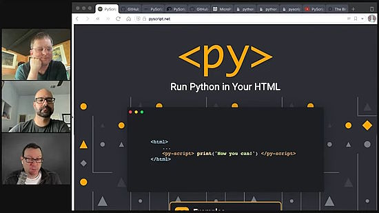
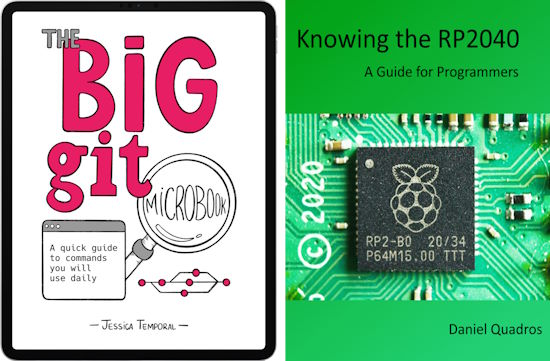
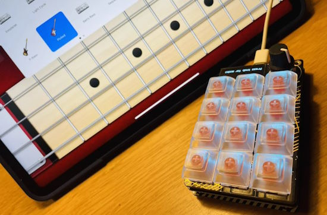
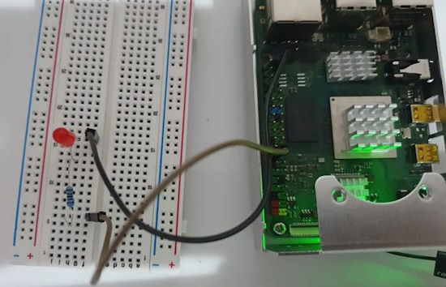
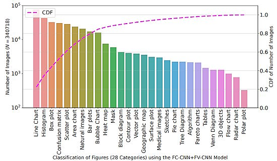
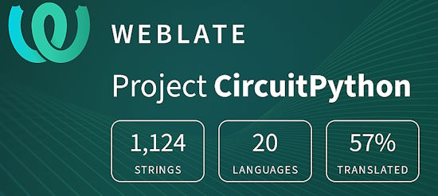

- [X] Kattni updates
- [ ] change date
- [ ] update title
- [ ] Feature story
- [ ] Update  for images
- [ ] Update ICYDNCI
- [ ] All images 550w max only
- [ ] Link "View this email in your browser."

News Sources

- Twitter: [CircuitPython](https://twitter.com/search?q=circuitpython&src=typed_query&f=live), [MicroPython](https://twitter.com/search?q=micropython&src=typed_query&f=live) and [Python](https://twitter.com/search?q=python&src=typed_query)
- Mastodon [CircuitPython](https://octodon.social/tags/CircuitPython) and [MicroPython](https://octodon.social/tags/MicroPython)
- [python.org](https://www.python.org/)
- [Python Insider - dev team blog](https://pythoninsider.blogspot.com/)
- [MicroPython Meetup Blog](https://melbournemicropythonmeetup.github.io/)
- [hackaday.io newest projects MicroPython](https://hackaday.io/projects?tag=micropython&sort=date) and [CircuitPython](https://hackaday.io/projects?tag=circuitpython&sort=date)
- [hackaday CircuitPython](https://hackaday.com/blog/?s=circuitpython) and [MicroPython](https://hackaday.com/blog/?s=micropython)
- [hackster.io CircuitPython](https://www.hackster.io/search?q=circuitpython&i=projects&sort_by=most_recent) and [MicroPython](https://www.hackster.io/search?q=micropython&i=projects&sort_by=most_recent)
- [https://opensource.com/tags/python](https://opensource.com/tags/python)
- Check Issues and PRs for input

Information Links

- [Last weeks Stats & Subscribers](https://us10.admin.mailchimp.com/campaigns/show?id=569021) - Mailchimp (login needed)
- [Last Week's Newsletter](https://www.adafruitdaily.com/category/circuitpython/) - adafruitdaily.com
- New CircuitPython Boards: [Microcontrollers](https://circuitpython.org/downloads?sort-by=date-desc) and [Blinka](https://circuitpython.org/blinka?sort-by=date-desc). Compare with [last week](https://www.adafruitdaily.com/category/circuitpython/)
- [Team Updates](https://3.basecamp.com/3732686/buckets/4356693/questions/1994563901) - Basecamp, internal data
- [Weblate latest graphic](https://hosted.weblate.org/widgets/circuitpython/#open) - crop and resize to 550px, name yyddmmweblate.jpg
- Discord Users: Use **/serverinfo** in any channel to get the user count
- For Weblate graphic, go [here](https://hosted.weblate.org/widgets/circuitpython/), click the last one then copy the full size, cut down via photo editor and resize to 550px
- Get Deep Dive info from Adafruit YouTube [Live](https://studio.youtube.com/channel/UCpOlOeQjj7EsVnDh3zuCgsA/videos/live?filter=%5B%5D&sort=%7B%22columnType%22%3A%22date%22%2C%22sortOrder%22%3A%22DESCENDING%22%7D) and CircuitPython Parsec from John Park posting on the [Adafruit Blog](https://blog.adafruit.com/?s=parsec)

View this email in your browser. **Warning: Flashing Imagery**

Welcome to the latest Python on Microcontrollers newsletter! *insert 2-3 sentences from editor (what's in overview, banter) - Ed.*

We're on [Discord](https://discord.gg/HYqvREz), [Twitter](https://twitter.com/search?q=circuitpython&src=typed_query&f=live), and for past newsletters - [view them all here](https://www.adafruitdaily.com/category/circuitpython/). If you're reading this on the web, [subscribe here](https://www.adafruitdaily.com/). Here's the news this week:

## CircuitPython Day 2023 is Nearly Here - Augist 18th!

This Friday, August 18 (8/18/2023), is CircuitPython Day 2023! The day highlights all things CircuitPython and Python on Hardware - [Adafruit Blog](https://blog.adafruit.com/2023/08/09/circuitpython-day-august-18-2023-schedule-circuitpython-circuitpythonday-python/).

**Here is a current list of events planned (all in US Eastern Time):**

* 10:00am ET – CircuitPython Day Introduction with John Park
* 10:10am ET – Special Edition 3D Hangouts with Pedro, Noe & Liz – In this special livestream, we’re highlighting our favorite projects that use CircuitPython. Special guest Liz Clark joins us to talk about coding and 3D printing.
* 11:00am ET – Beeps and Boops with synthio: A CircuitPython Day Panel Discussion hosted by Paul Cutler – Panelists share everything you might want to know about synthio, including how it came to be, what you need to get started, synthio’s potential for makers and musicians, and more.
* 12:30pm ET – CircuitPython Day Game Jam Stream with Foamyguy – On CircuitPython day I’ll be streaming another game jam session this year. I’m planning to make a replica of the classic Atari and Win 3.11 game Chip’s Challenge. Stop by if your interested in some CircuitPython game development. If anyone else is interested in working on games during CircuitPython Day or the following weekend, I’d be happy to see what you create!
* 1:30pm ET – MatrixPortal Message Board Build with Maker Melissa – Join Maker Melissa on her second live stream. This project will be an animated message board project based on the new Adafruit MatrixPortal S3 and uses the CircuitPython bitmaptools module to produce some graphic effects.
* 2:30pm ET – A CircuitPython Day Chat with Jeff, Dan and Kattni – Join Jeff, Dan and Kattni as they gather again to discuss CircuitPython and related topics. Bring your CircuitPython questions for the live Q&A at the end.
* 4:00pm ET – Special Edition John Park’s Workshop
* 5:30pm ET – Deep Dive with Scott Shawcroft – Join Scott as he answers questions about CircuitPython’s internals and discusses ongoing work including USB host.
* 7:30pm ET – Show & Tell
* 8:00pm ET – Ask an Engineer

Stay tuned to the [Adafruit Blog](https://blog.adafruit.com/) and Adafruit Social Media for links including [YouTube](https://www.youtube.com/channel/UCpOlOeQjj7EsVnDh3zuCgsA)! Interaction with shows in-progress will be via the [Adafruit Discord server](https://adafru.it/discord).

Working with CircuitPython? Tag your projects #CircuitPythonDay2023 on social media and Adafruit will look to highlight them.

## Hackster Café: Adabot Featuring Noe Ruiz & Liz Clark

Meet Adabot! Over at Adafruit, Noe Ruiz and Liz Clark have been cooking up an adorable new 3D-printed mascot. Driven by CircuitPython, Adabot runs on a new board: the RP2040 Prop-Maker Feather with I2S Audio Amplifier. The microcontroller sports screw terminals for connecting NeoPixels, a 3-axis accelerometer with tap detection, a 3-pin servo connector, and a few other bits and bobs to boost your bot - [YouTube - hackster.io](https://www.youtube.com/watch?v=uV7dRsMhHsk).

## Feature

text - [site](url).

## Nicholas Tollervey and Fabio Pliger Give an Update on PyScript

One of the most exciting initiatives in the Python space these days is PyScript, which enables Python running natively in a browser. With consistent support from the folks at Anaconda, this project has been making solid strides since its initial release. On the latest episode of TalkPython, host Michael Kennedy catches up with Fabio Pliger and Nicholas Tollervey to see where they are with the PyScript project. - [TalkPython](https://talkpython.fm/episodes/show/426/whats-new-in-pyscript-august-2023).

## Interesting Books This Week

Here are a couple useful books seen this week:

**The Big Git Microbook** is a quick guide to commands you will use daily. A book where you could find a description of how the most commonly used commands work, with practical examples? This microbook is an introduction to the fundamental concepts and commands of Git, a version control system widely used by software developers.
Throughout this book, you will have the chance to practice concepts and commands through real-world examples - [Jessica Temporal](https://jtemporal.com/gitmicrobook/).

**Knowing the RP2040**, A Guide for Programmers has you learn all the details of the RP2040 microprocessor (used in the Raspberry Pi Pico and other RP2040 boards) and how to leverage them in amazing applications - [Leanpub](https://leanpub.com/rp2040).

## This Week's Python Streams

Python on Hardware is all about building a cooperative ecosphere which allows contributions to be valued and to grow knowledge. Below are the streams within the last week focusing on the community.

**CircuitPython Deep Dive Stream**

[Last Friday](link), Scott streamed work on {subject}.

You can see the latest video and past videos on the Adafruit YouTube channel under the Deep Dive playlist - [YouTube](https://www.youtube.com/playlist?list=PLjF7R1fz_OOXBHlu9msoXq2jQN4JpCk8A).

**CircuitPython Parsec**

John Park’s CircuitPython Parsec this week is on {subject} - [Adafruit Blog](link) and [YouTube](link).

Catch all the episodes in the [YouTube playlist](https://www.youtube.com/playlist?list=PLjF7R1fz_OOWFqZfqW9jlvQSIUmwn9lWr).

## Project of the Week

text - [site](url).

## News from around the web!

The Raspberry Pi Foundation is looking for young people aged 9 to 13 to participate in user research for their new Code Editor. If you're a Parent, Educator, or Code Club or CoderDojo volunteer and can help young people take part, they would love to hear from you - [LinkedIn](https://www.linkedin.com/posts/raspberrypifoundation_parent-educator-computing-activity-7090630660758884352-kKYM/).

Playing bass guitar with an Adafruit MacroPad (3x4 keys + encoder + oled) powered by a Raspberry Pi RP 2040 with an iPad Pro and GarageBand - [Twitter/X](https://twitter.com/r_schulz_maker/status/1689133193939546113).

ADA: the AI Display Assistant is a beginner-friendly project for using ChatGPT on an ESP32 via Adafruit MagTag and CircuitPython - [hackster.io](https://www.hackster.io/jenfoxbot/ada-ai-display-assistant-e3146a).

text - [site](url).

text - [site](url).

text - [site](url).

text - [site](url).

text - [site](url).

text - [site](url).

text - [site](url).

text - [site](url).

Deckility handheld PC uses a BigTreeTech Raspberry Pad 5 IPS touchscreen, outputting a resolution of 800×480 px - [Raspberry Pi](https://www.raspberrypi.com/news/deckility-handheld-pc-magpimonday/).

Hackaday reviews Beepy (formerly Beepberry), the handheld Linux computer in the shape of a Blackberry. It uses a Raspberry Pi and a SHarp memory display - [Hackaday](https://hackaday.com/2023/08/07/review-beepy-a-palm-sized-linux-hacking-playground/).

text - [site](url).

How to install Python via Thonny and program the GPIO on a Rock 4C SBC - [Okdo](https://www.okdo.com/project/how-to-install-python-thonny-ide-and-programme-the-gpio-on-rock-4c/).

Notably Inaccessible -- Data Driven Understanding of Jupyter Data Science Notebook (In)Accessibility - [arxive](https://arxiv.org/abs/2308.03241).

If you're not using Python DATA CLASSES yet, you should  - [YouTube](https://www.youtube.com/watch?v=vRVVyl9uaZc).

text - [site](url).

PyDev of the Week: Zac Hatfield Dodds on [Mouse vs Python](https://www.blog.pythonlibrary.org/2023/08/07/pydev-of-the-week-zac-hatfield-dodds/)

CircuitPython Weekly Meeting for August 7, 2023 ([notes](https://github.com/adafruit/adafruit-circuitpython-weekly-meeting/blob/main/2023/2023-08-07.md)) [on YouTube](https://youtu.be/XbYVRJ9ZuzM)

**#ICYDNCI What was the most popular, most clicked link, in [last week's newsletter](https://link)? [title](url).**

## Coming Soon

text - [site](url).

text - [site](url).

## New Boards Supported by CircuitPython

The number of supported microcontrollers and Single Board Computers (SBC) grows every week. This section outlines which boards have been included in CircuitPython or added to [CircuitPython.org](https://circuitpython.org/).

This week, there were (#/no) new boards added!

- [Board name](url)
- [Board name](url)
- [Board name](url)

*Note: For non-Adafruit boards, please use the support forums of the board manufacturer for assistance, as Adafruit does not have the hardware to assist in troubleshooting.*

Looking to add a new board to CircuitPython? It's highly encouraged! Adafruit has four guides to help you do so:

- [How to Add a New Board to CircuitPython](https://learn.adafruit.com/how-to-add-a-new-board-to-circuitpython/overview)
- [How to add a New Board to the circuitpython.org website](https://learn.adafruit.com/how-to-add-a-new-board-to-the-circuitpython-org-website)
- [Adding a Single Board Computer to PlatformDetect for Blinka](https://learn.adafruit.com/adding-a-single-board-computer-to-platformdetect-for-blinka)
- [Adding a Single Board Computer to Blinka](https://learn.adafruit.com/adding-a-single-board-computer-to-blinka)

## New Learn Guides!

[Make a Zelda Master Sword with the RP2040 Prop-Maker Feather](https://learn.adafruit.com/master-sword-rp2040) from [Noe and Pedro](https://learn.adafruit.com/u/pixil3d)

[Lightsaber Prop-Maker RP2040](https://learn.adafruit.com/lightsaber-rp2040) from [Noe and Pedro](https://learn.adafruit.com/u/pixil3d)

## CircuitPython Libraries!

The CircuitPython library numbers are continually increasing, while existing ones continue to be updated. Here we provide library numbers and updates!

To get the latest Adafruit libraries, download the [Adafruit CircuitPython Library Bundle](https://circuitpython.org/libraries). To get the latest community contributed libraries, download the [CircuitPython Community Bundle](https://circuitpython.org/libraries).

If you'd like to contribute to the CircuitPython project on the Python side of things, the libraries are a great place to start. Check out the [CircuitPython.org Contributing page](https://circuitpython.org/contributing). If you're interested in reviewing, check out Open Pull Requests. If you'd like to contribute code or documentation, check out Open Issues. We have a guide on [contributing to CircuitPython with Git and GitHub](https://learn.adafruit.com/contribute-to-circuitpython-with-git-and-github), and you can find us in the #help-with-circuitpython and #circuitpython-dev channels on the [Adafruit Discord](https://adafru.it/discord).

You can check out this [list of all the Adafruit CircuitPython libraries and drivers available](https://github.com/adafruit/Adafruit_CircuitPython_Bundle/blob/master/circuitpython_library_list.md). 

The current number of CircuitPython libraries is **446**!

**New Libraries!**

Here's this week's new CircuitPython libraries:

  * [adafruit/Adafruit_CircuitPython_USB_Host_Descriptors](https://github.com/adafruit/Adafruit_CircuitPython_USB_Host_Descriptors)

**Updated Libraries!**

Here's this week's updated CircuitPython libraries:

  * [adafruit/Adafruit_CircuitPython_LED_Animation](https://github.com/adafruit/Adafruit_CircuitPython_LED_Animation)
  * [adafruit/Adafruit_CircuitPython_ImageLoad](https://github.com/adafruit/Adafruit_CircuitPython_ImageLoad)

**Library PyPI Weekly Download Stats**

**Total Library Stats**

  * 166078 PyPI downloads over 312 libraries
  
**Top 10 Libraries by PyPI Downloads**

  * Adafruit CircuitPython BusDevice (adafruit-circuitpython-busdevice): 7463
  * Adafruit CircuitPython Requests (adafruit-circuitpython-requests): 7012
  * Adafruit CircuitPython Register (adafruit-circuitpython-register): 2065
  * Adafruit CircuitPython NeoPixel (adafruit-circuitpython-neopixel): 1632
  * Adafruit CircuitPython PortalBase (adafruit-circuitpython-portalbase): 1607
  * Adafruit CircuitPython Display Text (adafruit-circuitpython-display-text): 1543
  * Adafruit CircuitPython ADS1x15 (adafruit-circuitpython-ads1x15): 1542
  * Adafruit CircuitPython Wiznet5k (adafruit-circuitpython-wiznet5k): 1525
  * Adafruit CircuitPython MiniMQTT (adafruit-circuitpython-minimqtt): 1499
  * Adafruit CircuitPython Motor (adafruit-circuitpython-motor): 1479

## What’s the CircuitPython team up to this week?

What is the team up to this week? Let’s check in!

**Dan**

I'm continuing to work on merging MicroPython v1.19.1 into CircuitPython. After discussions with Scott,  I am removing, at least for now, the "long-lived" storage allocation enhancement from CircuitPython, which reduces heap fragmentation. It was increasingly incompatible with MicroPython's storage assumptions. I have some ideas about how to restore it in a more compatible way if it looks like we should put it back.

**Kattni**

This week I worked on the Metro RP2040 guide. This is a new board in the shop. The guide will have everything you need to get started with your new Metro. If you picked up one of these boards, keep an eye out for the guide coming soon!

I also resolved some guide feedback. The Feather ESP32-S2 Reverse TFT PrettyPins diagram had incorrect pins for I2C, the TFT, and NeoPixel power. The diagrams are generated from preexisting data; they are not manually created. When I reran the script to see if it would give me the correct information, it worked perfectly. So, I have no idea why it produced incorrect info on the first round, as I can't replicate the issue. We're all perplexed. Regardless, the version available in the guide and on GitHub is now correct. 

**Melissa**

This past week, I focused on improving graphics in CircuitPython. To begin with, I added support for 16-bit, 24-bit, and 32-bit uncompressed bitmap loading to the [Adafruit_CircuitPython_ImageLoad](https://github.com/adafruit/Adafruit_CircuitPython_ImageLoad) library. 

After that, I worked on the core and updated the `alphablend` function to support multiple blend modes as well as a `skip` index parameter, which allows masking parts of images when blending, which is important since alpha transparencies are not supported in CircuitPython. 

I also created another PR for the `Imageload` library to add support for bitfield compressed images, which is the format that GIMP exports bitmaps. At this time, neither the `alphablend` nor `Imageload` PRs have been merged, but hopefully they will be soon.

All of this graphics work was to improve the performance of a message board project I am currently working on. I was able to combine all of this code along with some double buffering to get some smooth animations on the MatrixPortal S3.

**Tim**

This week I worked on submitting some requests to OSHWA for certification and showing Kattni the process for submitting them. I've also been continuing to work through library PRs, most of the testing this week was around new capabilities added to the `ImageLoad` library. 

**Jeff**

A couple of weeks ago I ordered several ESP32-S3 boards from Tindie, because these boards support what are sometimes called "dot clock" displays. These displays have to be continually refreshed with the display data (they don't contain a framebuffer themselves), and the S3 has a peripheral just for this purpose. If it works out, accessing this kind of display can be more efficient than SPI or I2C displays, though it uses a lot of pins.

Community member kmatch98 previously implemented this, but with some limitations that meant it wasn't suitable for including in mainline CircuitPython. I'm hoping that with the benefit of that code as well as changes to CircuitPython in the meantime, it'll be possible to land a version of this in the core in the coming weeks, for CircuitPython 9.

I'll be on a couple of the CircuitPython Day live streams this week! Check out the list of events elsewhere in the newsletter and join us if it sounds interesting to you.

**Scott**

Last week, I published the [USB_Host_Descriptors](https://github.com/adafruit/Adafruit_CircuitPython_USB_Host_Descriptors) and [USB_Host_Mass_Storage](https://github.com/adafruit/Adafruit_CircuitPython_USB_Host_Mass_Storage/) libraries. Together they enable mounting USB drives from within CircuitPython. Afterward, you can read and write files to the drive.

The start of this week, I've fallen down the CPU trace rabbit hole since I got my [Orb Trace Mini](https://orbcode.org/orbtrace-mini/). Using it I'm able to debug via [blackmagic](https://github.com/blackmagic-debug/blackmagic) as well. However, I had to add 1011 detection and support. It only supported the 1060 previously.

**Liz**

This week, Noe Ruiz and I were guests on the [Hackster Cafe livestream](https://www.youtube.com/watch?v=uV7dRsMhHsk). We chatted about the recent projects we've done with the new [RP2040 Prop-Maker Feather](https://www.adafruit.com/product/5768): [Adabot](https://learn.adafruit.com/adabot-rp2040) and the [RP2040 Lightsaber](https://learn.adafruit.com/lightsaber-rp2040). We also talked about some general project tips and CircuitPython tricks we've utilized.

## Upcoming Events!

[PyCon AU](https://2023.pycon.org.au/) will be held August 18th - 22nd in Adelaide, Australia. The conference schedule was recently published and notable talks include [You can't do that in MicroPython](https://2023.pycon.org.au/program/F7JN7X/) by Matt Trentini and [10 Years of MicroPython](https://2023.pycon.org.au/program/ZDUVFF/) by Damien George - [PyCon AU](https://2023.pycon.org.au/).

The next MicroPython Meetup in Melbourne will be on August 23rd – [Meetup](https://www.meetup.com/micropython-meetup/events). 

The supplier of popular ESP32 and ESP8266 microcontrollers, Espressif, announces their yearly Developers COnference. During the two-day online event, there will be nearly 30 talks created by Espressif technical experts and its partners, covering a wide range of topics, including Thread, the low-power features of ESP32-C6 and Wi-Fi 6, ESP-Mesh-Lite + ESP RainMaker Cloud solution, ESP-IDF, RUST, SquareLine Studio, AWS IoT, and more. September 12-13, 10:00-19:00 CEST - [devcon.espressif.com](https://devcon.espressif.com/).

PyCon UK will be returning to Cardiff City Hall from Friday 22nd September to Monday 25th September 2023 - [PyCon UK](https://2023.pyconuk.org/).

Maker Faire Bay Area will be October 13-15 & October 20-22, 2023 - [Eventbright](https://www.eventbrite.com/e/maker-faire-bay-area-october-13-15-october-20-22-2023-tickets-673771979127).

Hackaday has announced that the Hackaday Supercon is on for 2023, and will be taking place November 3 – 5 in Pasadena, California, USA. They’d like to hear your proposals for talks and workshops! The [Call for Speakers](https://docs.google.com/forms/d/e/1FAIpQLSfYDwIzWTHZ0_7d8GUznm3Z9w3y8aDcV1MVGSUyY1nTcdJ9Jw/viewform?usp=sf_link) and [Call for Workshops](https://docs.google.com/forms/d/e/1FAIpQLSeJIm0fWcrJIN8ge1K6Mvt2tfoFYOqre3isod5vKRGr-iyvJg/viewform?usp=sf_link) forms are online now, and you have until July 18th to sign up - [Adafruit Blog](https://blog.adafruit.com/2023/05/10/hackaday-supercon-2023-is-on-supercon-hackaday/) and [Hackaday](https://hackaday.com/2023/05/10/supercon-2023-is-on-we-want-you/).

The Pyjamas Conference, the 24-hour online Python conference, will be returning for a fifth year. The Call for Papers will begin on September 2nd - [Twitter](https://twitter.com/PyjamasConf/status/1675278222798495745).

**Send Your Events In**

If you know of virtual events or upcoming events, please let us know via email to cpnews(at)adafruit(dot)com.

## Latest Releases

CircuitPython's stable release is [8.2.2](https://github.com/adafruit/circuitpython/releases/latest). New to CircuitPython? Start with our [Welcome to CircuitPython Guide](https://learn.adafruit.com/welcome-to-circuitpython).

[20230808](https://github.com/adafruit/Adafruit_CircuitPython_Bundle/releases/latest) is the latest Adafruit CircuitPython library bundle.

[20230807](https://github.com/adafruit/Adafruit_CircuitPython_Bundle/releases/latest) is the latest Adafruit CircuitPython library bundle.

[v1.20.0](https://micropython.org/download) is the latest MicroPython release. Documentation for it is [here](http://docs.micropython.org/en/latest/pyboard/).

[3.11.4](https://www.python.org/downloads/) is the latest Python release. The latest pre-release version is [3.12.0rc1](https://www.python.org/download/pre-releases/).

[3,617 Stars](https://github.com/adafruit/circuitpython/stargazers) Like CircuitPython? [Star it on GitHub!](https://github.com/adafruit/circuitpython)

## Call for Help -- Translating CircuitPython is now easier than ever!

One important feature of CircuitPython is translated control and error messages. With the help of fellow open source project [Weblate](https://weblate.org/), we're making it even easier to add or improve translations. 

Sign in with an existing account such as GitHub, Google or Facebook and start contributing through a simple web interface. No forks or pull requests needed! As always, if you run into trouble join us on [Discord](https://adafru.it/discord), we're here to help.

## NUMBER Thanks!

The Adafruit Discord community, where we do all our CircuitPython development in the open, reached over NUMBER humans - thank you! Adafruit believes Discord offers a unique way for Python on hardware folks to connect. Join today at [https://adafru.it/discord](https://adafru.it/discord).

## ICYMI - In case you missed it

Python on hardware is the Adafruit Python video-newsletter-podcast! The news comes from the Python community, Discord, Adafruit communities and more and is broadcast on ASK an ENGINEER Wednesdays. The complete Python on Hardware weekly videocast [playlist is here](https://www.youtube.com/playlist?list=PLjF7R1fz_OOXRMjM7Sm0J2Xt6H81TdDev). The video podcast is on [iTunes](https://itunes.apple.com/us/podcast/python-on-hardware/id1451685192?mt=2), [YouTube](http://adafru.it/pohepisodes), [IGTV (Instagram TV](https://www.instagram.com/adafruit/channel/)), and [XML](https://itunes.apple.com/us/podcast/python-on-hardware/id1451685192?mt=2).

[The weekly community chat on Adafruit Discord server CircuitPython channel - Audio / Podcast edition](https://itunes.apple.com/us/podcast/circuitpython-weekly-meeting/id1451685016) - Audio from the Discord chat space for CircuitPython, meetings are usually Mondays at 2pm ET, this is the audio version on [iTunes](https://itunes.apple.com/us/podcast/circuitpython-weekly-meeting/id1451685016), Pocket Casts, [Spotify](https://adafru.it/spotify), and [XML feed](https://adafruit-podcasts.s3.amazonaws.com/circuitpython_weekly_meeting/audio-podcast.xml).

## Contribute!

The CircuitPython Weekly Newsletter is a CircuitPython community-run newsletter emailed every Tuesday. The complete [archives are here](https://www.adafruitdaily.com/category/circuitpython/). It highlights the latest CircuitPython related news from around the web including Python and MicroPython developments. To contribute, edit next week's draft [on GitHub](https://github.com/adafruit/circuitpython-weekly-newsletter/tree/gh-pages/_drafts) and [submit a pull request](https://help.github.com/articles/editing-files-in-your-repository/) with the changes. You may also tag your information on Twitter with #CircuitPython. 

Join the Adafruit [Discord](https://adafru.it/discord) or [post to the forum](https://forums.adafruit.com/viewforum.php?f=60) if you have questions.
