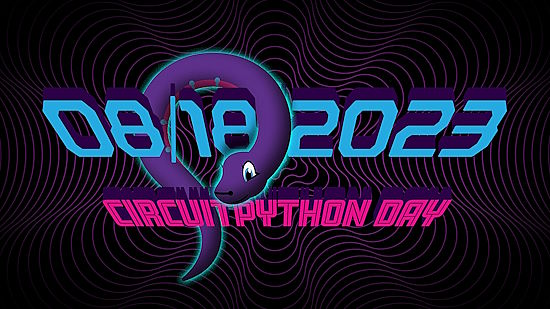
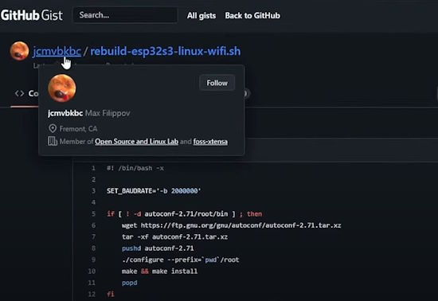
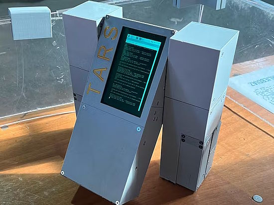
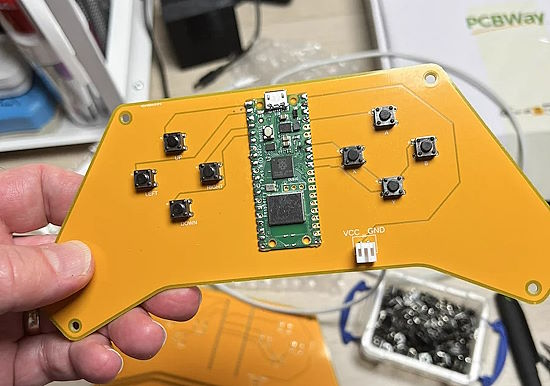
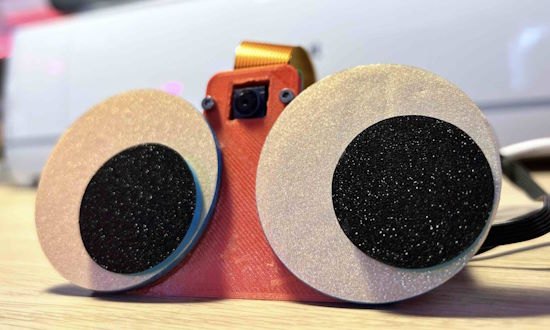
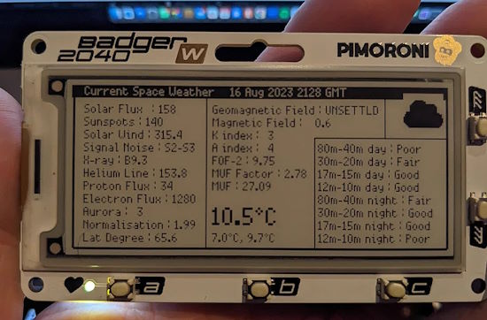
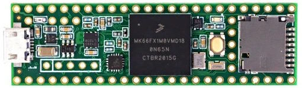
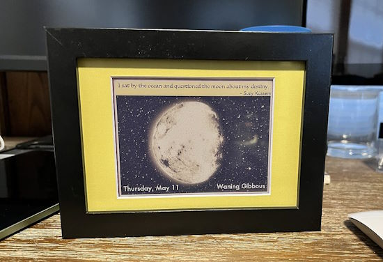
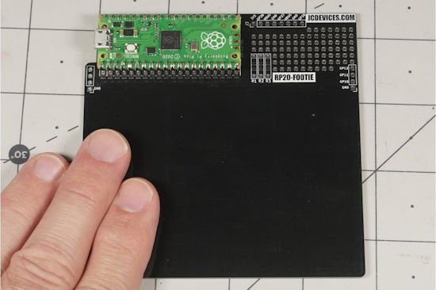
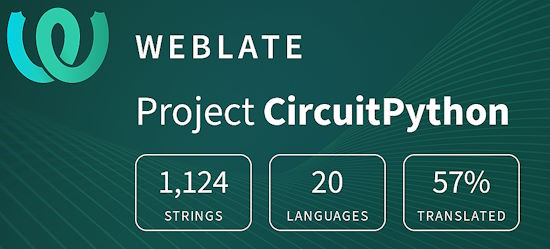

- [ ] Kattni updates
- [ ] change date
- [ ] update title
- [ ] Feature story
- [ ] Update  for images
- [ ] Update ICYDNCI
- [ ] All images 550w max only
- [ ] Link "View this email in your browser."

News Sources

- Twitter: [CircuitPython](https://twitter.com/search?q=circuitpython&src=typed_query&f=live), [MicroPython](https://twitter.com/search?q=micropython&src=typed_query&f=live) and [Python](https://twitter.com/search?q=python&src=typed_query)
- Mastodon [CircuitPython](https://octodon.social/tags/CircuitPython) and [MicroPython](https://octodon.social/tags/MicroPython)
- [python.org](https://www.python.org/)
- [Python Insider - dev team blog](https://pythoninsider.blogspot.com/)
- [MicroPython Meetup Blog](https://melbournemicropythonmeetup.github.io/)
- [hackaday.io newest projects MicroPython](https://hackaday.io/projects?tag=micropython&sort=date) and [CircuitPython](https://hackaday.io/projects?tag=circuitpython&sort=date)
- [hackaday CircuitPython](https://hackaday.com/blog/?s=circuitpython) and [MicroPython](https://hackaday.com/blog/?s=micropython)
- [hackster.io CircuitPython](https://www.hackster.io/search?q=circuitpython&i=projects&sort_by=most_recent) and [MicroPython](https://www.hackster.io/search?q=micropython&i=projects&sort_by=most_recent)
- [https://opensource.com/tags/python](https://opensource.com/tags/python)
- Check Issues and PRs for input

View this email in your browser. **Warning: Flashing Imagery**

Welcome to the latest Python on Microcontrollers newsletter! Wow! CircuitPython Day was full of broadcasts celebrating Python on microcontrollers and single-board computers! Thanks to all who participated this year! A new bump in CircuitPython version was released. CircuitPython 8.x builds will start to get rare as the team is working on version 9.0 with some additions from MicroPython, USB Host support and more. But can it blend? The ESP32-S3 has been demonstrating running real Linux! A huge worldwide effort is underway to get this perfected. And so much more this week. *- Anne Barela, Editor*

We're on [Discord](https://discord.gg/HYqvREz), [Twitter](https://twitter.com/search?q=circuitpython&src=typed_query&f=live), and for past newsletters - [view them all here](https://www.adafruitdaily.com/category/circuitpython/). If you're reading this on the web, [subscribe here](https://www.adafruitdaily.com/). Here's the news this week:

## CircuitPython Day 2023 Wrap-Up

text - [Adafruit Blog](url).

## CircuitPython 8.2.3 Released!

CircuitPython 8.2.3, the latest bugfix revision of CircuitPython, and is a new stable release - [Adafruit Blog](https://blog.adafruit.com/2023/08/11/circuitpython-8-2-3-released/) and [Release Notes](https://github.com/adafruit/circuitpython/releases/tag/8.2.3).

**Notable changes to 8.2.3 since 8.2.2**

Improve RGBMatrix timing on SAMx5x.

## Getting Linux running on an ESP32-S3

Ladyada at Adafruit has been hacking on a community project to get a version of Linux running on an ESP32-S3 microcontroller. She's had success using Docker to run Linux builds when other methods have had issues. Now WiFi and a number of other features works under Linux! - [YouTube](https://www.youtube.com/watch?v=ng1on8prlYo).

> The Dockerfile was fun to put together, a little like a text adventure where you have to figure out the exact order of commands to get the [babel fish](https://www.ifwiki.org/Babel_fish_puzzle) but now when run, it will automagically pop out the right files AND you can always terminal into the docker image at the end to customize and re-compile quickly. You can check out the Dockerfile [here](https://github.com/adafruit/Adafruit_Learning_System_Guides/pull/2589/files) and if you want to just download the container image post-compilation check it out [here](https://login.docker.com/u/login/identifier?state=hKFo2SBvajVES3p1TlI4ZDB2RHJReVFtSWFBLXlqc2w1ajR2UqFur3VuaXZlcnNhbC1sb2dpbqN0aWTZIHJ1RnJzczBPclE3X05IRUVXUEVlaVZfVEM2bEVGRFpyo2NpZNkgbHZlOUdHbDhKdFNVcm5lUTFFVnVDMGxiakhkaTluYjk) (Docker login needed).

## Feature

text - [site](url).

## Big European Companies form RISC-V Venture

The RISC-V open instruction set architecture got a boost today after it emerged that five chip giants are coming together to jointly invest in a company to develop reference architectures based on the standard. The new entity will be formed in Germany with investment from Infineon Technologies, Qualcomm, NXP Semiconductors, Bosch, and Nordic Semiconductor, with the aim of speeding up "the commercialization of future products based on the open-source RISC-V architecture." - [The Register](https://www.theregister.com/2023/08/04/chip_companies_risc_v/).

## This Week's Python Streams

Python on Hardware is all about building a cooperative ecosphere which allows contributions to be valued and to grow knowledge. Below are the streams within the last week focusing on the community.

**CircuitPython Deep Dive Stream**

[Last Friday](link), Scott streamed work on {subject}.

You can see the latest video and past videos on the Adafruit YouTube channel under the Deep Dive playlist - [YouTube](https://www.youtube.com/playlist?list=PLjF7R1fz_OOXBHlu9msoXq2jQN4JpCk8A).

**CircuitPython Parsec**

John Park’s CircuitPython Parsec this week is on {subject} - [Adafruit Blog](link) and [YouTube](link).

Catch all the episodes in the [YouTube playlist](https://www.youtube.com/playlist?list=PLjF7R1fz_OOWFqZfqW9jlvQSIUmwn9lWr).

## Project of the Week: Recreating the TARS Robot from Interstellar

Charlie Diaz describes making a miniature version of the robot TARS from the movie Interstellar - [hackster.io](https://www.hackster.io/charlesdiaz/how-to-build-your-own-replica-of-tars-from-interstellar-224833).

> "I’ve been working to create my own miniature replica of the robot TARS from the movie Interstellar. The goal was always to make a reasonably faithful representation of TARS walk like it did in the movie. I’ve made three versions so far and have gone from a functional but unreliable proof-of-concept to a more refined and highly reliable prototype capable of walking continuously for hours."

Under the hood, TARS uses Python code running on a Raspberry Pi 3B+. Controlling servos is an Adafruit PCA-9685 Servo Driver. The chassis is 3D printed over an aluminum extrusion chassis.

## News from around the web!

Kevin McAleer makes his first PCB, a Bluetooth controller. A Raspberry Pi Pico W is used programmed in MicroPython - [Twitter/X](https://twitter.com/kevsmac/status/1691177996395171840).

Communicating between devices with the MQTT Protocol - [Woolsey Workshop](https://www.woolseyworkshop.com/2023/08/15/communicating-between-devices-with-the-mqtt-protocol/).

Googly eyes which Google what they see. The project uses a Raspberry Pi Zero 2 W, Pi Camera, OpenAI image capture and captioning software and Python - [Raspberry Pi](https://www.raspberrypi.com/news/these-googly-eyes-google-what-they-see/) and [YouTube](https://youtu.be/bV2sw7XBaqo).

Pimoroni is working on a vector graphics library (based on Pretty Poly) for MicroPython and their products. The demo is a clock graphic on an as-yet-named graphics board. The work in progress is on [GitHub](https://github.com/pimoroni/pimoroni-pico/pull/783) - [Twitter/X Thread](https://twitter.com/Gadgetoid/status/1691843386666332285).

Chrissy Roberts provides detailed weather information on a Pimoroni Badger 2040 W using MicroPython - [Twitter/X](https://twitter.com/chrissyhroberts/status/1691926886887121334) and [GitHub](https://github.com/chrissyhroberts/badger2040w_code/tree/main/Space_Weather).

The Memphis #Python group is meeting Monday Aug. 21 at 6:00PM.  There will be talk about IoT development using MicroPython and there will be some cool toys to look at - [Twitter/X](https://twitter.com/poweredbyaltnet/status/1691862642409828727?s=66).

Teensy 3.5 and 3.6 development boards have been announced as "end of life" with the small supplies manufactured by PJRC and no further boards will be available due to chip manufacturer discontinuance - [Twitter/X](https://twitter.com/PaulStoffregen/status/1691784870014656893).

Moon-Pi displays today’s moon phase and a random moon-related quotation on an e-paper display. A Raspberry Pi Zero W hidden in the frame runs the show via Python - [Raspberry Pi](https://www.raspberrypi.com/news/moon-pi-an-e-paper-lunar-cycle-display/) and [GitHub](https://github.com/barryl93/Moon-Pi).

text - [site](url).

text - [site](url).

text - [site](url).

text - [site](url).

text - [site](url).

text - [site](url).

text - [site](url).

text - [site](url).

text - [site](url).

text - [site](url).

PyDev of the Week: NAME on [Mouse vs Python]()

CircuitPython Weekly Meeting for August 14, 2023 ([notes](https://github.com/adafruit/adafruit-circuitpython-weekly-meeting/blob/main/2023/2023-08-14.md)) [on YouTube](https://youtu.be/AmrYnWMLpFo)

#ICYDNCI What was the most popular, most clicked link, in [last week's newsletter](https://www.adafruitdaily.com/2023/08/14/python-on-microcontrollers-newsletter-circuitpython-day-2023-is-this-week-projects-and-more-circuitpython-python-micropython-thepsf-raspberry_pi/)? [GIT Microbook](https://jtemporal.com/gitmicrobook/).

## New

The CM4 Ether Board is now available. It's a tiny (40*100mm) Raspberry Pi CM4 carrier board focused on network applications, like setting up your own Raspberry Pi server. It's main feature is an onboard M.2 connector for NVMe SSD solid state storage - [Tindie](https://www.tindie.com/products/dphacks/cm4-ether-board/) via [Twitter/X](https://twitter.com/makerbymistake/status/1691831014333489389).

RP20-Footie is a capacitive pedal using a Raspberry Pi Pico - [Tindie](https://www.tindie.com/products/jeremycook/rp20-footie-raspberry-pi-pico-capacitive-pedal/) via [Twitter/X](https://twitter.com/JeremySCook/status/1691885952954732600).

## New Boards Supported by CircuitPython

The number of supported microcontrollers and Single Board Computers (SBC) grows every week. This section outlines which boards have been included in CircuitPython or added to [CircuitPython.org](https://circuitpython.org/).

This week, there were (#/no) new boards added!

- [Board name](url)
- [Board name](url)
- [Board name](url)

*Note: For non-Adafruit boards, please use the support forums of the board manufacturer for assistance, as Adafruit does not have the hardware to assist in troubleshooting.*

Looking to add a new board to CircuitPython? It's highly encouraged! Adafruit has four guides to help you do so:

- [How to Add a New Board to CircuitPython](https://learn.adafruit.com/how-to-add-a-new-board-to-circuitpython/overview)
- [How to add a New Board to the circuitpython.org website](https://learn.adafruit.com/how-to-add-a-new-board-to-the-circuitpython-org-website)
- [Adding a Single Board Computer to PlatformDetect for Blinka](https://learn.adafruit.com/adding-a-single-board-computer-to-platformdetect-for-blinka)
- [Adding a Single Board Computer to Blinka](https://learn.adafruit.com/adding-a-single-board-computer-to-blinka)

## New Learn Guides!

[title](url) from [name](url)

[title](url) from [name](url)

[title](url) from [name](url)

## Updated Learn Guides!

[title](url) from [name](url)

## CircuitPython Libraries!

The CircuitPython library numbers are continually increasing, while existing ones continue to be updated. Here we provide library numbers and updates!

To get the latest Adafruit libraries, download the [Adafruit CircuitPython Library Bundle](https://circuitpython.org/libraries). To get the latest community contributed libraries, download the [CircuitPython Community Bundle](https://circuitpython.org/libraries).

If you'd like to contribute to the CircuitPython project on the Python side of things, the libraries are a great place to start. Check out the [CircuitPython.org Contributing page](https://circuitpython.org/contributing). If you're interested in reviewing, check out Open Pull Requests. If you'd like to contribute code or documentation, check out Open Issues. We have a guide on [contributing to CircuitPython with Git and GitHub](https://learn.adafruit.com/contribute-to-circuitpython-with-git-and-github), and you can find us in the #help-with-circuitpython and #circuitpython-dev channels on the [Adafruit Discord](https://adafru.it/discord).

You can check out this [list of all the Adafruit CircuitPython libraries and drivers available](https://github.com/adafruit/Adafruit_CircuitPython_Bundle/blob/master/circuitpython_library_list.md). 

The current number of CircuitPython libraries is **###**!

**New Libraries!**

Here's this week's new CircuitPython libraries:

* [library](url)

**Updated Libraries!**

Here's this week's updated CircuitPython libraries:

* [library](url)

**Library PyPI Weekly Download Stats**

## What’s the CircuitPython team up to this week?

What is the team up to this week? Let’s check in!

**Dan**

I finished code merging for the merge of MicroPython V1.19.1 into CircuitPython, and made a draft [pull request](https://github.com/adafruit/circuitpython/pull/8281). Jeff and I are now cleaning up the remaining build and test issues. When those are all resolved, I'll remove it as a draft and then it will be reviewed.

I tried to reduce the number of changes that had existed between CircuitPython and MicroPython in the core interpreter, to make the next merge easier. Necessary changes were also marked in many cases with an indication that the change was deliberately made for CircuitPython. This will save time during later merges because the origin of the changes will be more obvious.

**Kattni**

This week I've been working on the Metro ESP32-S3 guide. It's coming soon in the shop. The guide should be ready by the time it's available to purchase. It'll have everything you need to get started with your new Metro. Keep an eye out for that.

I participated in a CircuitPython Day panel discussion about `synthio`, and a CircuitPython Day Chat with Jeff and Dan. As this was written before CircuitPython Day, I will include any fun details and links to the videos in next week's newsletter.

**Melissa**

text - [site](url).

**Tim**

This week I wrote Python scripts to compare data from the OSHWA API with a full list of Adafruit PIDs to find any remaining that haven't been submitted. The resulting list was narrowed a bit further and I've begun submitting requests for the ones that need it. I've also done some testing on new features for `ImageLoad` that add support for additional types of BMP images that can be exported from GIMP and other editing software.

**Jeff**

My main accomplishment for the week has been to help out Dan with the MicroPython merge. MicroPython and CircuitPython share a large number of tests that are run automatically with each change. Most of these test the behavior of the language itself, not hardware, but they are extremely valuable because they can find the tiniest flaws in the core code.

We started with a large number of test failures, and have shared in fixing them. Frequently, a cluster of failures is fixed by a single change. As I write this, we've gone from over 100 tests to check to only about a dozen left to understand and (hopefully) fix.

**Scott**

This week I've been bouncing between USB host work and updating the PR to update the ESP-IDF to version 5. The IDF 5 update supports newer chips from Espressif but also changes some APIs and increases code size. microdev did the necessary API updates and increased the build size of CircuitPython. This will break folks' CIRCUITPY drive so I'm looking at the cause for the size increase before deciding to do this breakage.

**Liz**

This week I worked on a guide for the [PC joystick to seesaw adapter](https://learn.adafruit.com/adafruit-pc-joystick-to-seesaw-i2c-adapter). There are pages for pinouts, CircuitPython and Python, Arduino and downloadable resources. I had actually never used a PC joystick before, so I had to procure one on eBay for testing but luckily it worked really well. I'm hoping to maybe do a project with it at some point.

## Upcoming Events!

[PyCon AU](https://2023.pycon.org.au/) will be held August 18th - 22nd in Adelaide, Australia. The conference schedule was recently published and notable talks include [You can't do that in MicroPython](https://2023.pycon.org.au/program/F7JN7X/) by Matt Trentini and [10 Years of MicroPython](https://2023.pycon.org.au/program/ZDUVFF/) by Damien George - [PyCon AU](https://2023.pycon.org.au/).

The next MicroPython Meetup in Melbourne will be on August 23rd – [Meetup](https://www.meetup.com/micropython-meetup/events). 

The supplier of popular ESP32 and ESP8266 microcontrollers, Espressif, announces their yearly Developers Conference. During the two-day online event, there will be nearly 30 talks created by Espressif technical experts and its partners, covering a wide range of topics, including Thread, the low-power features of ESP32-C6 and Wi-Fi 6, ESP-Mesh-Lite + ESP RainMaker Cloud solution, ESP-IDF, RUST, SquareLine Studio, AWS IoT, and more. September 12-13, 10:00-19:00 CEST - [devcon.espressif.com](https://devcon.espressif.com/).

PyCon UK will be returning to Cardiff City Hall from Friday 22nd September to Monday 25th September 2023 - [PyCon UK](https://2023.pyconuk.org/).

Maker Faire Bay Area will be October 13-15 & October 20-22, 2023 - [Eventbright](https://www.eventbrite.com/e/maker-faire-bay-area-october-13-15-october-20-22-2023-tickets-673771979127).

Hackaday has announced that the Hackaday Supercon is on for 2023, and will be taking place November 3 – 5 in Pasadena, California, USA. They’d like to hear your proposals for talks and workshops! The [Call for Speakers](https://docs.google.com/forms/d/e/1FAIpQLSfYDwIzWTHZ0_7d8GUznm3Z9w3y8aDcV1MVGSUyY1nTcdJ9Jw/viewform?usp=sf_link) and [Call for Workshops](https://docs.google.com/forms/d/e/1FAIpQLSeJIm0fWcrJIN8ge1K6Mvt2tfoFYOqre3isod5vKRGr-iyvJg/viewform?usp=sf_link) forms are online now, and you have until July 18th to sign up - [Adafruit Blog](https://blog.adafruit.com/2023/05/10/hackaday-supercon-2023-is-on-supercon-hackaday/) and [Hackaday](https://hackaday.com/2023/05/10/supercon-2023-is-on-we-want-you/).

The Pyjamas Conference, the 24-hour online Python conference, will be returning for a fifth year. The Call for Papers will begin on September 2nd - [Twitter](https://twitter.com/PyjamasConf/status/1675278222798495745).

**Send Your Events In**

If you know of virtual events or upcoming events, please let us know via email to cpnews(at)adafruit(dot)com.

## Latest Releases

CircuitPython's stable release is [8.2.3](https://github.com/adafruit/circuitpython/releases/latest) and its unstable release is [#.#.#-##.#](https://github.com/adafruit/circuitpython/releases). New to CircuitPython? Start with our [Welcome to CircuitPython Guide](https://learn.adafruit.com/welcome-to-circuitpython).

[20230814](https://github.com/adafruit/Adafruit_CircuitPython_Bundle/releases/latest) is the latest Adafruit CircuitPython library bundle.

[20230814](https://github.com/adafruit/CircuitPython_Community_Bundle/releases/latest) is the latest CircuitPython Community library bundle.

[v1.20.0](https://micropython.org/download) is the latest MicroPython release. Documentation for it is [here](http://docs.micropython.org/en/latest/pyboard/).

[3.11.4](https://www.python.org/downloads/) is the latest Python release. The latest pre-release version is [3.12.0rc1](https://www.python.org/download/pre-releases/).

[3,625 Stars](https://github.com/adafruit/circuitpython/stargazers) Like CircuitPython? [Star it on GitHub!](https://github.com/adafruit/circuitpython)

## Call for Help -- Translating CircuitPython is now easier than ever!

One important feature of CircuitPython is translated control and error messages. With the help of fellow open source project [Weblate](https://weblate.org/), we're making it even easier to add or improve translations. 

Sign in with an existing account such as GitHub, Google or Facebook and start contributing through a simple web interface. No forks or pull requests needed! As always, if you run into trouble join us on [Discord](https://adafru.it/discord), we're here to help.

## NUMBER Thanks!

The Adafruit Discord community, where we do all our CircuitPython development in the open, reached over NUMBER humans - thank you! Adafruit believes Discord offers a unique way for Python on hardware folks to connect. Join today at [https://adafru.it/discord](https://adafru.it/discord).

## ICYMI - In case you missed it

Python on hardware is the Adafruit Python video-newsletter-podcast! The news comes from the Python community, Discord, Adafruit communities and more and is broadcast on ASK an ENGINEER Wednesdays. The complete Python on Hardware weekly videocast [playlist is here](https://www.youtube.com/playlist?list=PLjF7R1fz_OOXRMjM7Sm0J2Xt6H81TdDev). The video podcast is on [iTunes](https://itunes.apple.com/us/podcast/python-on-hardware/id1451685192?mt=2), [YouTube](http://adafru.it/pohepisodes), [IGTV (Instagram TV](https://www.instagram.com/adafruit/channel/)), and [XML](https://itunes.apple.com/us/podcast/python-on-hardware/id1451685192?mt=2).

[The weekly community chat on Adafruit Discord server CircuitPython channel - Audio / Podcast edition](https://itunes.apple.com/us/podcast/circuitpython-weekly-meeting/id1451685016) - Audio from the Discord chat space for CircuitPython, meetings are usually Mondays at 2pm ET, this is the audio version on [iTunes](https://itunes.apple.com/us/podcast/circuitpython-weekly-meeting/id1451685016), Pocket Casts, [Spotify](https://adafru.it/spotify), and [XML feed](https://adafruit-podcasts.s3.amazonaws.com/circuitpython_weekly_meeting/audio-podcast.xml).

## Contribute!

The CircuitPython Weekly Newsletter is a CircuitPython community-run newsletter emailed every Tuesday. The complete [archives are here](https://www.adafruitdaily.com/category/circuitpython/). It highlights the latest CircuitPython related news from around the web including Python and MicroPython developments. To contribute, edit next week's draft [on GitHub](https://github.com/adafruit/circuitpython-weekly-newsletter/tree/gh-pages/_drafts) and [submit a pull request](https://help.github.com/articles/editing-files-in-your-repository/) with the changes. You may also tag your information on Twitter with #CircuitPython. 

Join the Adafruit [Discord](https://adafru.it/discord) or [post to the forum](https://forums.adafruit.com/viewforum.php?f=60) if you have questions.
