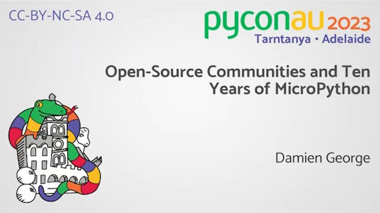
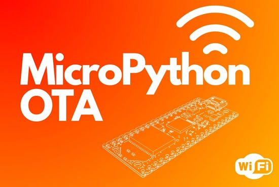
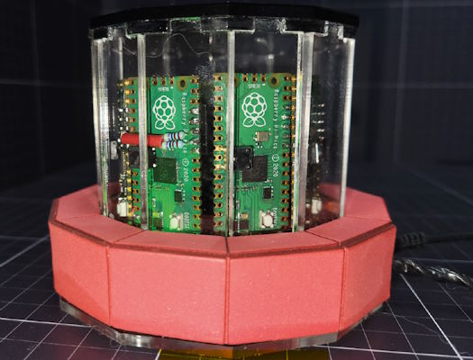
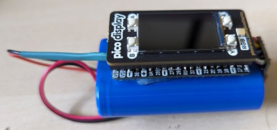
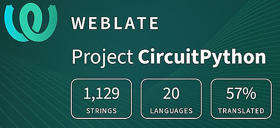

- [X] Kattni updates
- [ ] change date
- [ ] update title
- [ ] Feature story
- [ ] Update  for images
- [ ] Update ICYDNCI
- [ ] All images 550w max only
- [ ] Link "View this email in your browser."

News Sources

- Twitter: [CircuitPython](https://twitter.com/search?q=circuitpython&src=typed_query&f=live), [MicroPython](https://twitter.com/search?q=micropython&src=typed_query&f=live) and [Python](https://twitter.com/search?q=python&src=typed_query)
- Mastodon [CircuitPython](https://octodon.social/tags/CircuitPython) and [MicroPython](https://octodon.social/tags/MicroPython)
- [python.org](https://www.python.org/)
- [Python Insider - dev team blog](https://pythoninsider.blogspot.com/)
- [MicroPython Meetup Blog](https://melbournemicropythonmeetup.github.io/)
- [hackaday.io newest projects MicroPython](https://hackaday.io/projects?tag=micropython&sort=date) and [CircuitPython](https://hackaday.io/projects?tag=circuitpython&sort=date)
- [hackaday CircuitPython](https://hackaday.com/blog/?s=circuitpython) and [MicroPython](https://hackaday.com/blog/?s=micropython)
- [hackster.io CircuitPython](https://www.hackster.io/search?q=circuitpython&i=projects&sort_by=most_recent) and [MicroPython](https://www.hackster.io/search?q=micropython&i=projects&sort_by=most_recent)
- [https://opensource.com/tags/python](https://opensource.com/tags/python)
- Check Issues and PRs for input

View this email in your browser. **Warning: Flashing Imagery**

Welcome to the latest Python on Microcontrollers newsletter! xxx - * Anne Barela, Editor.*

We're on [Discord](https://discord.gg/HYqvREz), [Twitter](https://twitter.com/search?q=circuitpython&src=typed_query&f=live), and for past newsletters - [view them all here](https://www.adafruitdaily.com/category/circuitpython/). If you're reading this on the web, [subscribe here](https://www.adafruitdaily.com/). Here's the news this week:

## "Open-Source Communities and Ten Years of MicroPython" - Damien George (PyCon AU 2023)

Damien George's talk "Open-Source Communities and Ten Years of MicroPython" at PyCon AU 2023 is now available online, with very interesting insights into the language and community - [YouTube](https://www.youtube.com/watch?v=iEQQWpjgFd8).

## Python in Excel: Microsoft Combines the Power of Python and the Flexibility of Excel

Microsoft has announced an evolution in the analytical capabilities available within Excel by releasing a Public Preview of Python in Excel. Python in Excel makes it possible to natively combine Python and Excel analytics within the same workbook - with no setup required. With Python in Excel, you can type Python directly into a cell, the Python calculations run in the Microsoft Cloud, and results are returned to the worksheet, including plots and visualizations - [Microsoft Excel Blog](https://techcommunity.microsoft.com/t5/excel-blog/announcing-python-in-excel-combining-the-power-of-python-and-the/ba-p/3893439).

Python creator Guido van Rossum states he helped the Excel team with this initiative - [Twitter/X](https://twitter.com/gvanrossum/status/1694031794306458056?t=AsdfrW3a1trrNsz_J9yd8g&s=03).

## Feature

text - [site](url).

## Google Launches MediaPipe for Raspberry Pi, Offering a Python SDK for Simplified On-Device ML

Google has announced the launch of MediaPipe for Raspberry Pi, offering a Python-based software development kit (SDK) for machine learning (ML) tasks complete with examples for audio classification, text classification, gesture recognition, and more. - [hackster.io](https://www.hackster.io/news/google-launches-mediapipe-for-raspberry-pi-offering-a-python-sdk-for-simplified-on-device-ml-c821f5ff57b0).

## Over-the-Air Software Updating for MicroPython

If you’ve ever had a software update pop up on your smartphone or smart TV, you’ve encountered an OTA update, even if you didn’t know it by name. OTA, or Over-The-Air, refers to the method of transmitting data across a network without any wired connection. Kevin McAleer has created a simple OTA module for MicroPython  so you can now add OTA to your own projects - [Kev's Robots](https://www.kevsrobots.com/blog/micropython-ota.html), [GitHub](https://github.com/kevinmcaleer/ota) and [YouTube](https://youtu.be/f1widOJYQDc).

## This Week's Python Streams

Python on Hardware is all about building a cooperative ecosphere which allows contributions to be valued and to grow knowledge. Below are the streams within the last week focusing on the community.

**CircuitPython Deep Dive Stream**

[Last Friday](link), Scott streamed work on {subject}.

You can see the latest video and past videos on the Adafruit YouTube channel under the Deep Dive playlist - [YouTube](https://www.youtube.com/playlist?list=PLjF7R1fz_OOXBHlu9msoXq2jQN4JpCk8A).

**CircuitPython Parsec**

John Park’s CircuitPython Parsec this week is on {subject} - [Adafruit Blog](link) and [YouTube](link).

Catch all the episodes in the [YouTube playlist](https://www.youtube.com/playlist?list=PLjF7R1fz_OOWFqZfqW9jlvQSIUmwn9lWr).

## Project of the Week

text - [site](url).

## News from around the web!

text - [site](url).

text - [site](url).

text - [site](url).

Make a multicore Raspberry Pi Pico computing device - [HackSpace Magazine](https://hackspace.raspberrypi.com/downloads/eyJfcmFpbHMiOnsibWVzc2FnZSI6IkJBaHBBbnNoIiwiZXhwIjpudWxsLCJwdXIiOiJibG9iX2lkIn19--c9f6ee36f22a115dddedd05bf5e4a61655b7de76/HS_69_DIGITAL.pdf) (PDF, Page 32).

text - [site](url).

text - [site](url).

Portable temperature, humidity and pressure sensor using a Raspberry Pi Pico W - [recantha.co.uk](https://www.recantha.co.uk/blog/?p=21637).

text - [site](url).

text - [site](url).

text - [site](url).

text - [site](url).

text - [site](url).

text - [site](url).

text - [site](url).

text - [site](url).

text - [site](url).

text - [site](url).

text - [site](url).

CircuitPython Weekly Meeting for August 21, 2023 ([notes](https://github.com/adafruit/adafruit-circuitpython-weekly-meeting/blob/main/2023/2023-08-21.md)) [on YouTube](https://youtu.be/Djc2nLD7uSs).

**#ICYDNCI What was the most popular, most clicked link, in [last week's newsletter](https://link)? [title](url).**

## Coming Soon / New

text - [site](url).

text - [site](url).

## New Boards Supported by CircuitPython

The number of supported microcontrollers and Single Board Computers (SBC) grows every week. This section outlines which boards have been included in CircuitPython or added to [CircuitPython.org](https://circuitpython.org/).

This week, there were (#/no) new boards added!

- [Board name](url)
- [Board name](url)
- [Board name](url)

*Note: For non-Adafruit boards, please use the support forums of the board manufacturer for assistance, as Adafruit does not have the hardware to assist in troubleshooting.*

Looking to add a new board to CircuitPython? It's highly encouraged! Adafruit has four guides to help you do so:

- [How to Add a New Board to CircuitPython](https://learn.adafruit.com/how-to-add-a-new-board-to-circuitpython/overview)
- [How to add a New Board to the circuitpython.org website](https://learn.adafruit.com/how-to-add-a-new-board-to-the-circuitpython-org-website)
- [Adding a Single Board Computer to PlatformDetect for Blinka](https://learn.adafruit.com/adding-a-single-board-computer-to-platformdetect-for-blinka)
- [Adding a Single Board Computer to Blinka](https://learn.adafruit.com/adding-a-single-board-computer-to-blinka)

## New Learn Guides!

[Ahsoka Lightsaber Prop-Maker RP2040 retrofit](https://learn.adafruit.com/lightsaber-retrofit) from [Noe and Pedro](https://learn.adafruit.com/u/pixil3d)

## CircuitPython Libraries!

The CircuitPython library numbers are continually increasing, while existing ones continue to be updated. Here we provide library numbers and updates!

To get the latest Adafruit libraries, download the [Adafruit CircuitPython Library Bundle](https://circuitpython.org/libraries). To get the latest community contributed libraries, download the [CircuitPython Community Bundle](https://circuitpython.org/libraries).

If you'd like to contribute to the CircuitPython project on the Python side of things, the libraries are a great place to start. Check out the [CircuitPython.org Contributing page](https://circuitpython.org/contributing). If you're interested in reviewing, check out Open Pull Requests. If you'd like to contribute code or documentation, check out Open Issues. We have a guide on [contributing to CircuitPython with Git and GitHub](https://learn.adafruit.com/contribute-to-circuitpython-with-git-and-github), and you can find us in the #help-with-circuitpython and #circuitpython-dev channels on the [Adafruit Discord](https://adafru.it/discord).

You can check out this [list of all the Adafruit CircuitPython libraries and drivers available](https://github.com/adafruit/Adafruit_CircuitPython_Bundle/blob/master/circuitpython_library_list.md). 

The current number of CircuitPython libraries is **448**!

**New Libraries!**

Here's this week's new CircuitPython libraries:

  * [todbot/CircuitPython_MicroOSC](https://github.com/todbot/CircuitPython_MicroOSC)

**Updated Libraries!**

Here's this week's updated CircuitPython libraries:

  * [adafruit/Adafruit_CircuitPython_Display_Shapes](https://github.com/adafruit/Adafruit_CircuitPython_Display_Shapes)
  * [adafruit/Adafruit_CircuitPython_HTTPServer](https://github.com/adafruit/Adafruit_CircuitPython_HTTPServer)

**Library PyPI Weekly Download Stats**
* **Total Library Stats**
  * 122622 PyPI downloads over 312 libraries
* **Top 10 Libraries by PyPI Downloads**
  * Adafruit CircuitPython BusDevice (adafruit-circuitpython-busdevice): 7835
  * Adafruit CircuitPython Requests (adafruit-circuitpython-requests): 7151
  * Adafruit CircuitPython Register (adafruit-circuitpython-register): 1743
  * Adafruit CircuitPython NeoPixel (adafruit-circuitpython-neopixel): 1424
  * Adafruit CircuitPython Motor (adafruit-circuitpython-motor): 1397
  * Adafruit CircuitPython ADS1x15 (adafruit-circuitpython-ads1x15): 1356
  * Adafruit CircuitPython Display Text (adafruit-circuitpython-display-text): 1014
  * Adafruit CircuitPython Wiznet5k (adafruit-circuitpython-wiznet5k): 970
  * Adafruit CircuitPython MiniMQTT (adafruit-circuitpython-minimqtt): 923
  * Adafruit CircuitPython PCA9685 (adafruit-circuitpython-pca9685): 882

## What’s the CircuitPython team up to this week?

What is the team up to this week? Let’s check in!

**Dan**

text - [site](url).

**Kattni**

text - [site](url).

**Melissa**

text - [site](url).

**Tim**

text - [site](url).

**Jeff**

text - [site](url).

**Scott**

text - [site](url).

**Liz**

text - [site](url).

## Upcoming Events!

The next MicroPython Meetup in Melbourne will be on August 23rd – [Meetup](https://www.meetup.com/micropython-meetup/events). 

The supplier of popular ESP32 and ESP8266 microcontrollers, Espressif, announces their yearly Developers Conference. During the two-day online event, there will be nearly 30 talks created by Espressif technical experts and its partners, covering a wide range of topics, including Thread, the low-power features of ESP32-C6 and Wi-Fi 6, ESP-Mesh-Lite + ESP RainMaker Cloud solution, ESP-IDF, RUST, SquareLine Studio, AWS IoT, and more. September 12-13, 10:00-19:00 CEST - [devcon.espressif.com](https://devcon.espressif.com/).

PyCon UK will be returning to Cardiff City Hall from Friday 22nd September to Monday 25th September 2023 - [PyCon UK](https://2023.pyconuk.org/).

Maker Faire Bay Area will be October 13-15 & October 20-22, 2023 - [Eventbright](https://www.eventbrite.com/e/maker-faire-bay-area-october-13-15-october-20-22-2023-tickets-673771979127).

Hackaday has announced that the Hackaday Supercon is on for 2023, and will be taking place November 3 – 5 in Pasadena, California, USA - [Adafruit Blog](https://blog.adafruit.com/2023/05/10/hackaday-supercon-2023-is-on-supercon-hackaday/) and [Hackaday](https://hackaday.com/2023/05/10/supercon-2023-is-on-we-want-you/).

The Pyjamas Conference, the 24-hour online Python conference, will be returning for a fifth year. The Call for Papers will begin on September 2nd - [Twitter](https://twitter.com/PyjamasConf/status/1675278222798495745).

**Send Your Events In**

If you know of virtual events or upcoming events, please let us know via email to cpnews(at)adafruit(dot)com.

## Latest Releases

CircuitPython's stable release is [8.2.4](https://github.com/adafruit/circuitpython/releases/latest). New to CircuitPython? Start with our [Welcome to CircuitPython Guide](https://learn.adafruit.com/welcome-to-circuitpython).

[20230824](https://github.com/adafruit/Adafruit_CircuitPython_Bundle/releases/latest) is the latest Adafruit CircuitPython library bundle.

[20230822](https://github.com/adafruit/CircuitPython_Community_Bundle/releases/latest) is the latest CircuitPython Community library bundle.

[v#1.20.0](https://micropython.org/download) is the latest MicroPython release. Documentation for it is [here](http://docs.micropython.org/en/latest/pyboard/).

[3.11.4](https://www.python.org/downloads/) is the latest Python release. The latest pre-release version is [3.12.0rc1](https://www.python.org/download/pre-releases/).

[3,644 Stars](https://github.com/adafruit/circuitpython/stargazers) Like CircuitPython? [Star it on GitHub!](https://github.com/adafruit/circuitpython)

## Call for Help -- Translating CircuitPython is now easier than ever!

One important feature of CircuitPython is translated control and error messages. With the help of fellow open source project [Weblate](https://weblate.org/), we're making it even easier to add or improve translations. 

Sign in with an existing account such as GitHub, Google or Facebook and start contributing through a simple web interface. No forks or pull requests needed! As always, if you run into trouble join us on [Discord](https://adafru.it/discord), we're here to help.

## NUMBER Thanks!

The Adafruit Discord community, where we do all our CircuitPython development in the open, reached over NUMBER humans - thank you! Adafruit believes Discord offers a unique way for Python on hardware folks to connect. Join today at [https://adafru.it/discord](https://adafru.it/discord).

## ICYMI - In case you missed it

Python on hardware is the Adafruit Python video-newsletter-podcast! The news comes from the Python community, Discord, Adafruit communities and more and is broadcast on ASK an ENGINEER Wednesdays. The complete Python on Hardware weekly videocast [playlist is here](https://www.youtube.com/playlist?list=PLjF7R1fz_OOXRMjM7Sm0J2Xt6H81TdDev). The video podcast is on [iTunes](https://itunes.apple.com/us/podcast/python-on-hardware/id1451685192?mt=2), [YouTube](http://adafru.it/pohepisodes), [Instagram Reels](https://www.instagram.com/adafruit/channel/), and [XML](https://itunes.apple.com/us/podcast/python-on-hardware/id1451685192?mt=2).

[The weekly community chat on Adafruit Discord server CircuitPython channel - Audio / Podcast edition](https://itunes.apple.com/us/podcast/circuitpython-weekly-meeting/id1451685016) - Audio from the Discord chat space for CircuitPython, meetings are usually Mondays at 2pm ET, this is the audio version on [iTunes](https://itunes.apple.com/us/podcast/circuitpython-weekly-meeting/id1451685016), Pocket Casts, [Spotify](https://adafru.it/spotify), and [XML feed](https://adafruit-podcasts.s3.amazonaws.com/circuitpython_weekly_meeting/audio-podcast.xml).

## Contribute!

The CircuitPython Weekly Newsletter is a CircuitPython community-run newsletter emailed every Tuesday. The complete [archives are here](https://www.adafruitdaily.com/category/circuitpython/). It highlights the latest CircuitPython related news from around the web including Python and MicroPython developments. To contribute, edit next week's draft [on GitHub](https://github.com/adafruit/circuitpython-weekly-newsletter/tree/gh-pages/_drafts) and [submit a pull request](https://help.github.com/articles/editing-files-in-your-repository/) with the changes. You may also tag your information on Twitter with #CircuitPython. 

Join the Adafruit [Discord](https://adafru.it/discord) or [post to the forum](https://forums.adafruit.com/viewforum.php?f=60) if you have questions.
