View this email in your browser. **Warning: Flashing Imagery**

Welcome to the latest Python on Microcontrollers newsletter! This week both Adafruit and Pimoroni released CircuitPython and a form of MicroPython, respectively, bringing bug fixes and new features. See how you can develop with Python and make interesting projects with a few lines of code and open source software with this issue - *Anne Barela Ed.*

We're on [Discord](https://discord.gg/HYqvREz), [Twitter](https://twitter.com/search?q=circuitpython&src=typed_query&f=live), and for past newsletters - [view them all here](https://www.adafruitdaily.com/category/circuitpython/). If you're reading this on the web, [subscribe here](https://www.adafruitdaily.com/). Here's the news this week:

## CircuitPython 8.2.5 Released

[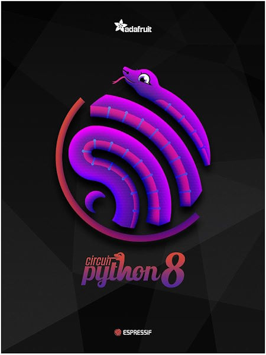](https://blog.adafruit.com/2023/09/07/circuitpython-8-2-5-released/)

CircuitPython 8.2.5 is the latest bugfix revision of CircuitPython and is the new stable release - [Adafruit Blog](https://blog.adafruit.com/2023/09/07/circuitpython-8-2-5-released/) and [GitHub](https://github.com/adafruit/circuitpython/releases/tag/8.2.5). 

**Notable changes to 8.2.5 since 8.2.4**

* Updated TLS root certificates.
* Tuning of `RGBMatrix`.
* New and updated boards.

## Pimoroni MicroPython Version 1.20.5 Released

[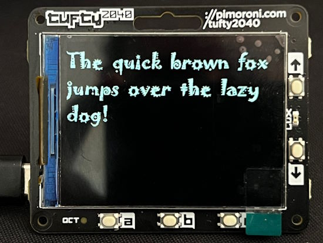](https://github.com/pimoroni/pimoroni-pico/releases/tag/v1.20.5)

Version 1.20.5 of Pimoroni's fork of MicroPython prfovides "Glorious Vector Visuals". This release introduces a beta of PicoVector, a library that sits atop PicoGraphics and supplies anti-aliased vector drawing tools using Pretty Poly.

PicoVector is currently available in the following builds:

* Pico
* Pico W
* Pico LiPo
* Tufty 2040

It includes support for Alright Fonts, allowing you to convert almost any ttf or otf font into a simplified vector format - a sequence of overlapping polygonal contours - which can be used in PicoGraphics projects - [GitHub](https://github.com/pimoroni/pimoroni-pico/releases/tag/v1.20.5).

Version 1.20.4 from August 4th added PNG file support as a better option than JPG - [GitHub](https://github.com/pimoroni/pimoroni-pico/releases/tag/v1.20.4).

## WipperSnapper Update Wednesdays

This past month, a lot has been going on with the Adafruit.io platform and WipperSnapper firmware - it’s hard to keep track of everything! To address this, the Adafruit IO team will publish bi-monthly (or monthly if news is light) “WipperSnapper Updates Wednesday” posts on the Adafruit Blog. This will help folks stay informed about all the activities on the Wippersnapper IoT platform - [Adaruit Blog](https://blog.adafruit.com/2023/09/06/wippersnapper-updates-wednesday-blockly-actions-new-sensors-supported-uart-and-more/).

## Using Conda for Microcontroller Embedded Development Environments

[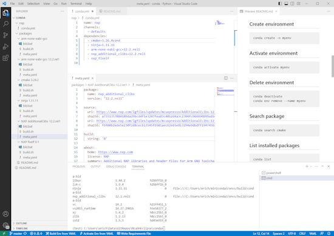](https://mcuoneclipse.com/2023/08/25/vs-code-virtual-environments-for-embedded-development-with-conda/)

Developing for an embedded target means using a certain version of GNU compiler, debugger and other tools. The challenge gets bigger if working with multiple different tool chains and environments. Conda is package, dependency and environment management tool. While it is heavily used for Python and Data Science development, it is surprisingly working very well to set up and managing environments for embedded development. Conda is great for managing non-Python dependencies and setups - [MCU on Eclipse](https://mcuoneclipse.com/2023/08/25/vs-code-virtual-environments-for-embedded-development-with-conda/).

## IoT Survey

Blues, an internet of things (IoT) provider, has completed an interesting poll on the internet of things and microcontrollers. What specifically drew my attention is where folks typically get news about embedded/IoT development. Hackaday, Hackster and the Adafruit Blog make up 40% of the IoT information folks ingest - [blues.io](https://dev.blues.io/blog/blues-iot-survey-2023-results/).

## New Adafruit Metro M7 with microSD – Featuring the NXP iMX RT1011 Microcontroller

[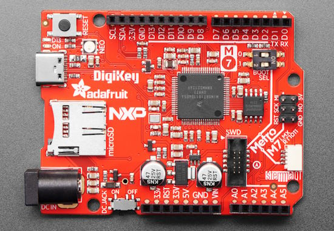](https://www.adafruit.com/product/5600)

Your favorite electronics companies have collaborated to make the fastest Metro ever! DigiKey, NXP and Adafruit all contributed to present the Adafruit Metro M7 with microSD. An NXP iMX RT1011 microcontroller powers this board with a 500 MHz ARM Cortex M7 processor. There's 8 MB of execute-in-place QSPI for firmware + disk storage and 128KB of SRAM in-chip. Arduino-compatible headers make using any 'shield' daughterboard easy. A STEMMA QT/Qwiic connector makes I2C connections to boards a snap without soldering. And there's a micro SD card slot to read files or data log easily to removable, wear-leveled storage. The iMX series of chips is the fastest microcontrollers around, with a Cortex M7 processor that is more powerful than the M0 or M4, and clock speeds of 500MHz+ - [Adafruit Blog](https://www.adafruit.com/product/5600).

## Accurate Cycle Counting on RP2040 and MicroPython

[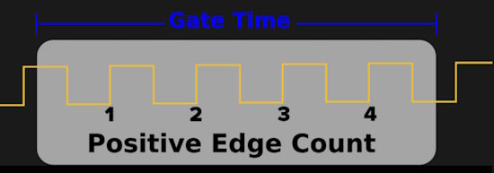](https://hackaday.com/2023/08/26/accurate-cycle-counting-on-rp2040-micropython/)

Accurate frequency measurement using a Pi Pico RP2040 is relatively easy with C but with interpreted Python it is more of a challenge. This article shows how to do so with MicroPython - [iosoft Blog](https://iosoft.blog/2023/08/21/picofreq_python/), [GitHub](https://github.com/jbentham/picofreq) and [Hackaday](https://hackaday.com/2023/08/26/accurate-cycle-counting-on-rp2040-micropython/).

## This Week's Python Streams

Python on Hardware is all about building a cooperative ecosphere which allows contributions to be valued and to grow knowledge. Below are the streams within the last week focusing on the community.

**CircuitPython Deep Dive Stream**

[Last Friday](https://www.youtube.com/watch?v=c-ITBBC8vhI), Scott streamed work on his new office, boxes and Kconfig.

You can see the latest video and past videos on the Adafruit YouTube channel under the Deep Dive playlist - [YouTube](https://www.youtube.com/playlist?list=PLjF7R1fz_OOXBHlu9msoXq2jQN4JpCk8A).

**CircuitPython Parsec**

John Park’s CircuitPython Parsec this week is on Circuit Playground Touch Sensing - [Adafruit Blog](https://blog.adafruit.com/2023/09/08/john-parks-circuitpython-parsec-circuit-playground-touch-sensing-adafruit-circuitpython/) and [YouTube](https://youtu.be/chTv2PMTZ-E).

Catch all the episodes in the [YouTube playlist](https://www.youtube.com/playlist?list=PLjF7R1fz_OOWFqZfqW9jlvQSIUmwn9lWr).

## Project of the Week: Windess IoT Garden Chimes

[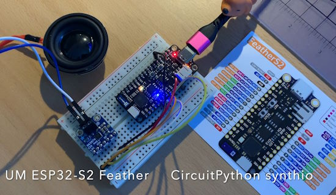](https://github.com/CedarGroveStudios/CircuitPython_Chime)

CircuitPython_Chime is a CircuitPython class for generating wind chime and bell sounds using `synthio`. The CedarGrove CircuitPython Chime class provides `synthio` note overtones and envelopes developed from a combination of tubular chime algorithms and empirical models. Three chime voices are included in the class (`Voice.Tubular`, `Voice.Bell`, and `Voice.Perfect`) as well as selectable chime and striker materials. The Scales class contains a library of common wind chime and bell scales in a collection of Scientific Pitch Notation (SPN) lists - [GitHub](https://github.com/CedarGroveStudios/CircuitPython_Chime) and [YouTube](https://www.youtube.com/watch?v=85vy7aG6j2c).

## News from around the web!

[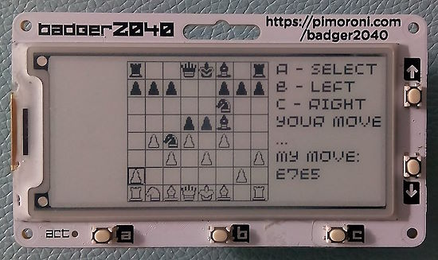](https://github.com/niutech/chess-badger2040)

Chess Game on Badger 2040 is a chess game based on the Sunfish Chess Engine ported to MicroPython by Quan Lin and modified to run on Pimoroni Badger 2040 e-ink device using a RP2040 MCU. It is a single-player game and works fully offline - [GitHub](https://github.com/niutech/chess-badger2040) via [X](https://twitter.com/niu_tech/status/1696888854190461252).

[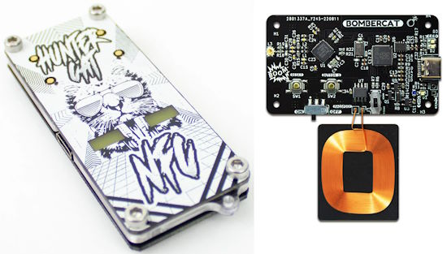](https://github.com/ElectronicCats/ElectronicCats_CircuitPython_PN7150/tree/main)

ElectronicCats_CircuitPython_PN7150 is a library for I2C access to the PN7150 RFID/Near Field Communication chip - [GitHub](https://github.com/ElectronicCats/ElectronicCats_CircuitPython_PN7150/tree/main) via [X](https://twitter.com/Sabasacustico/status/1698728445516062904).

[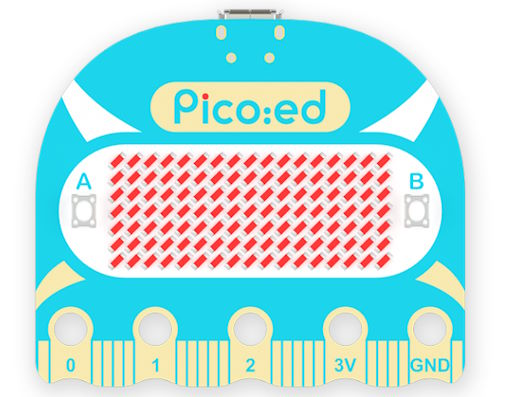](https://maresaku.wixsite.com/raspberry/post/pico-ed-v2%E3%82%92circuitpython%E3%81%A7%E5%8B%95%E3%81%8B%E3%81%97%E3%81%A6%E3%81%BF%E3%81%BE%E3%81%97%E3%81%9F)

Setting up the Pico:ed V2 with CircuitPython - [Raspberry Pi Diary](https://maresaku.wixsite.com/raspberry/post/pico-ed-v2%E3%82%92circuitpython%E3%81%A7%E5%8B%95%E3%81%8B%E3%81%97%E3%81%A6%E3%81%BF%E3%81%BE%E3%81%97%E3%81%9F).

[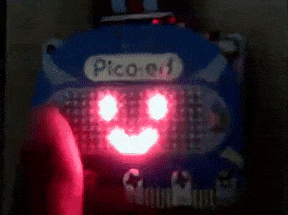](https://twitter.com/maresaku_mono/status/1698358817099227643)

> I ran Pico:ed V2 with CircuitPython and attached it to the ELECFREAKS micro:bit smart coding watch kit. In addition, when I showed this to my 3-year-old relative, it was well received - [X, formerly Twitter](https://twitter.com/maresaku_mono/status/1698358817099227643).

[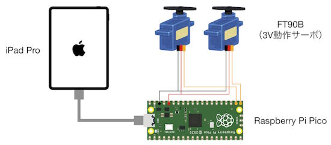](https://github.com/bricklife/MIDI-Servo-Control)

MIDI-Servo-Control is a project for a USB MIDI device and an operation app that can control servos with MIDI messages using CircuitPython - [GitHub](https://github.com/bricklife/MIDI-Servo-Control).

[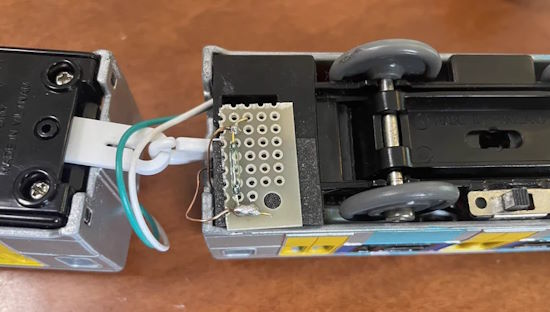](https://twitter.com/iwango_system/status/1699252680915583381)

> The magnetic sensor on the Pico W sound Suigun line was replaced with a reed switch. By the way, using CircuitPython's `countio` library, you can detect magnets even during WiFi communication - [X, formerly Twitter](https://twitter.com/iwango_system/status/1699252680915583381).

[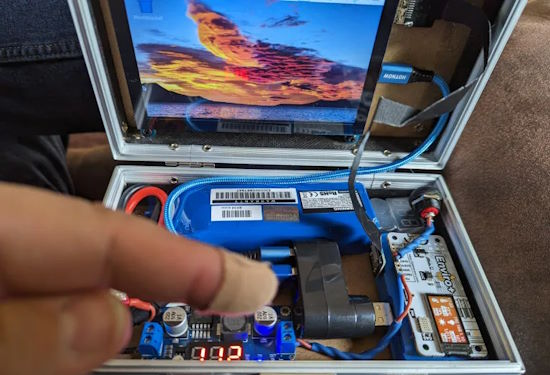](https://www.recantha.co.uk/blog/?p=21665)

An extremely mini Raspberry Pi cyberdeck - [Raspberry PiPod](https://www.recantha.co.uk/blog/?p=21665).

[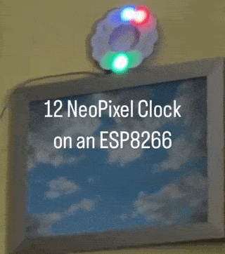](https://twitter.com/idig3d/status/1698949194852057179)

12 LED NeoPixel clock on an ESP8266 running MicroPython - [X, formerly Twitter](https://twitter.com/idig3d/status/1698949194852057179).

[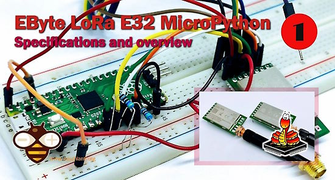](https://mischianti.org/2023/09/04/ebyte-lora-e32-micropython-specifications-overview-and-first-use-1/)

Ebyte LoRa E32 & MicroPython: specifications, overview and first use - [Renzo Mischianti](https://mischianti.org/2023/09/04/ebyte-lora-e32-micropython-specifications-overview-and-first-use-1/).

[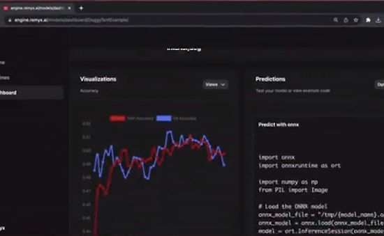](https://www.hackster.io/myx/smart-dog-tent-with-remyx-ai-639ec0)

Smart Dog Tent with Remyx AI and Python - [hackster.io](https://www.hackster.io/myx/smart-dog-tent-with-remyx-ai-639ec0).

Dog vs. MicroPython a talk by Łukasz Mach will be at PyCon CZ 23 15-17 September - [cz.pycon.org](https://cz.pycon.org/2023/program/talks/75/).

micropython-pyscpidev privides a [SCPI command interface](https://en.wikipedia.org/wiki/Standard_Commands_for_Programmable_Instruments) to programmable test equipment - [GitHub](https://github.com/Aikhjarto/micropython-scpidev).

[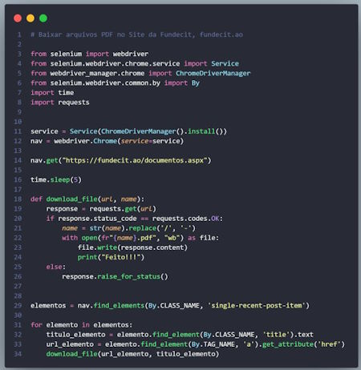](https://www.linkedin.com/feed/update/urn:li:activity:7101167926656872448/?utm_source=share&utm_medium=member_android)

How to create a bot that downloads files from the web, with Python - [LinkedIn](https://www.linkedin.com/feed/update/urn:li:activity:7101167926656872448/?utm_source=share&utm_medium=member_android).

[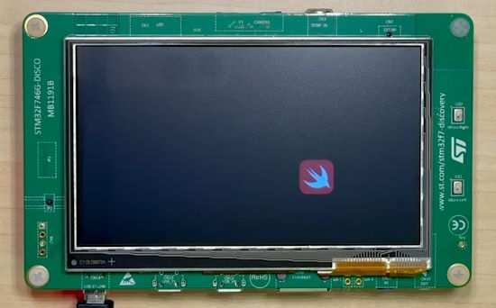](https://forums.swift.org/t/embedded-swift/67057)

Embedded Swift is being discussed as another modern language to program microcontrollers - [Swift Forums](https://forums.swift.org/t/embedded-swift/67057).

PyDev of the Week: Franek Magiera on [Mouse vs Python](https://www.blog.pythonlibrary.org/2023/09/04/pydev-of-the-week-franek-magiera/).

CircuitPython Weekly Meeting for September 5th: ([notes](https://github.com/adafruit/adafruit-circuitpython-weekly-meeting/blob/main/2023/2023-09-05.md)) [on YouTube](https://youtu.be/rW5lD_LyQy8).

#ICYDNCI What was the most popular, most clicked link, in [last week's newsletter](https://www.adafruitdaily.com/2023/09/04/python-on-microcontrollers-newsletter-250-issues-displays-galore-cheat-sheets-and-much-more-circuitpython-python-micropython-thepsf-raspberry_pi/)? [Python Cheat Sheet](https://twitter.com/_PythonByte/status/1696001857943204193?t=iZwrkztzXtiCOKnvgi0ltQ&s=03).

## New

[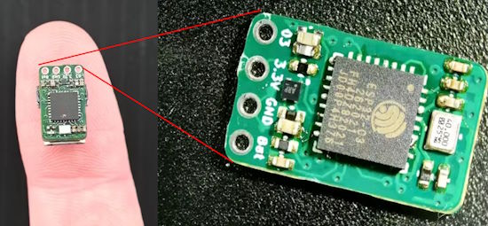](https://www.hackster.io/news/tiny-esp32-dev-board-is-tiny-4b7c85d3117d)

Paul Price's ESP32-C3 board is barely larger than the QFN32 itself, but has USB and an RGB LED - [hackster.io](https://www.hackster.io/news/tiny-esp32-dev-board-is-tiny-4b7c85d3117d) and [Hackaday](https://hackaday.com/2023/09/07/how-small-can-the-esp32-get/).

[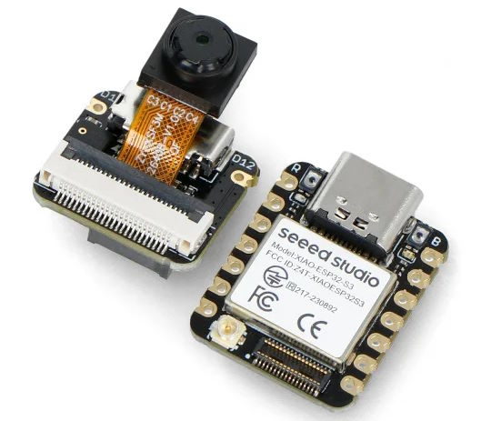](https://botland.store/esp32-wifi-and-bt-modules/22926-seeed-xiao-esp32-s3-sense-set-with-ov2640-camera-wifibluetooth-seeedstudio-113991115.html)

The Seeed Xiao ESP32-S3 Sense is a set from Seeedstudio consisting of two modules - Seeed Xiao ESP32-S3 and the OV2640 camera - [botland](https://botland.store/esp32-wifi-and-bt-modules/22926-seeed-xiao-esp32-s3-sense-set-with-ov2640-camera-wifibluetooth-seeedstudio-113991115.html).

## New Boards Supported by CircuitPython

The number of supported microcontrollers and Single Board Computers (SBC) grows every week. This section outlines which boards have been included in CircuitPython or added to [CircuitPython.org](https://circuitpython.org/).

This week, there were four new boards added!

- [Banana Pro](https://circuitpython.org/blinka/lemaker_banana_pro/) (Blinka)
- [Metro M7 with microSD](https://circuitpython.org/board/adafruit_metro_m7_1011_sd/)
- [Nano ESP32](https://circuitpython.org/board/arduino_nano_esp32s3/)
- [Nano ESP32 with inverted Status LED](https://circuitpython.org/board/arduino_nano_esp32s3_inverted_statusled/)

*Note: For non-Adafruit boards, please use the support forums of the board manufacturer for assistance, as Adafruit does not have the hardware to assist in troubleshooting.*

Looking to add a new board to CircuitPython? It's highly encouraged! Adafruit has four guides to help you do so:

- [How to Add a New Board to CircuitPython](https://learn.adafruit.com/how-to-add-a-new-board-to-circuitpython/overview)
- [How to add a New Board to the circuitpython.org website](https://learn.adafruit.com/how-to-add-a-new-board-to-the-circuitpython-org-website)
- [Adding a Single Board Computer to PlatformDetect for Blinka](https://learn.adafruit.com/adding-a-single-board-computer-to-platformdetect-for-blinka)
- [Adding a Single Board Computer to Blinka](https://learn.adafruit.com/adding-a-single-board-computer-to-blinka)

## New Learn Guides!

[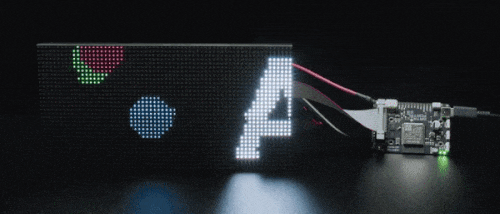](https://learn.adafruit.com/guides/latest)

[Adafruit MatrixPortal S3](https://learn.adafruit.com/adafruit-matrixportal-s3) from [Melissa LeBlanc-Williams](https://learn.adafruit.com/u/MakerMelissa)

[Adafruit EYESPI Pi Beret](https://learn.adafruit.com/eyespi-pi-beret) from [Kattni Rembor](https://learn.adafruit.com/u/kattni)

## Updated Learn Guides!

[Temperature and Humidity Sensing in Home Assistant](https://learn.adafruit.com/guides/latest#:~:text=Temperature%20and%20Humidity%20Sensing%20in%20Home%20Assistant) from [Melissa LeBlanc-Williams](https://learn.adafruit.com/u/MakerMelissa)

[Pet Bowl Water Level Sensing](https://learn.adafruit.com/pet-bowl-water-level-sensing-with-the-funhouse-and-home-assistant) from [Melissa LeBlanc-Williams](https://learn.adafruit.com/u/MakerMelissa)

[MacroPad Remote Procedure Calls over USB to Control Home Assistant](https://learn.adafruit.com/macropad-remote-procedure-calls-over-usb-to-control-home-assistant) from [Melissa LeBlanc-Williams](https://learn.adafruit.com/u/MakerMelissa)

[Motion Activated Outlet with the Adafruit FunHouse](https://learn.adafruit.com/motion-activated-outlet-with-the-adafruit-funhouse) from [Melissa LeBlanc-Williams](https://learn.adafruit.com/u/MakerMelissa)

## CircuitPython Libraries!

The CircuitPython library numbers are continually increasing, while existing ones continue to be updated. Here we provide library numbers and updates!

To get the latest Adafruit libraries, download the [Adafruit CircuitPython Library Bundle](https://circuitpython.org/libraries). To get the latest community contributed libraries, download the [CircuitPython Community Bundle](https://circuitpython.org/libraries).

If you'd like to contribute to the CircuitPython project on the Python side of things, the libraries are a great place to start. Check out the [CircuitPython.org Contributing page](https://circuitpython.org/contributing). If you're interested in reviewing, check out Open Pull Requests. If you'd like to contribute code or documentation, check out Open Issues. We have a guide on [contributing to CircuitPython with Git and GitHub](https://learn.adafruit.com/contribute-to-circuitpython-with-git-and-github), and you can find us in the #help-with-circuitpython and #circuitpython-dev channels on the [Adafruit Discord](https://adafru.it/discord).

You can check out this [list of all the Adafruit CircuitPython libraries and drivers available](https://github.com/adafruit/Adafruit_CircuitPython_Bundle/blob/master/circuitpython_library_list.md). 

The current number of CircuitPython libraries is **448**!

**Updated Libraries!**

Here's this week's updated CircuitPython libraries:

  * [adafruit/Adafruit_CircuitPython_HTTPServer](https://github.com/adafruit/Adafruit_CircuitPython_HTTPServer)
  * [adafruit/Adafruit_CircuitPython_turtle](https://github.com/adafruit/Adafruit_CircuitPython_turtle)
  * [2bndy5/CircuitPython_nRF24L01](https://github.com/2bndy5/CircuitPython_nRF24L01)
  * [furbrain/CircuitPython_async_button](https://github.com/furbrain/CircuitPython_async_button)
  * [jposada202020/CircuitPython_MC3479](https://github.com/jposada202020/CircuitPython_MC3479)

**Library PyPI Weekly Download Stats**

  * 59663 PyPI downloads over 312 libraries

**Top 10 Libraries by PyPI Downloads**

  * Adafruit CircuitPython BusDevice (adafruit-circuitpython-busdevice): 6467
  * Adafruit CircuitPython Requests (adafruit-circuitpython-requests): 5416
  * Adafruit CircuitPython Register (adafruit-circuitpython-register): 1658
  * Adafruit CircuitPython ServoKit (adafruit-circuitpython-servokit): 961
  * Adafruit CircuitPython Motor (adafruit-circuitpython-motor): 951
  * Adafruit CircuitPython NeoPixel (adafruit-circuitpython-neopixel): 938
  * Adafruit CircuitPython PCA9685 (adafruit-circuitpython-pca9685): 919
  * Adafruit CircuitPython DHT (adafruit-circuitpython-dht): 643
  * Adafruit CircuitPython ADS1x15 (adafruit-circuitpython-ads1x15): 584
  * Adafruit CircuitPython Pixelbuf (adafruit-circuitpython-pixelbuf): 543

## What’s the CircuitPython team up to this week?

What is the team up to this week? Let’s check in!

**Dan**

I got back from vacation, and updated the TLS root certificates for CircuitPython. This fixes a problem with accessing certain sites that appeared when we updated the certificates in version 8.2.2. I removed our dependency on the NINA-FW repository, and created a new repo just for certificates. This fix will be released as CircuitPython 8.2.5, along with a few other fixes.

Next, I'll be working on merging MicroPython v1.20 into CircuitPython, following up on the V1.19.1 merge. I'm anticipating this will be a lot easier because I'm quite familiar with the previous set of changes. Jeff and I will probably tag-team on this as before.

**Kattni**

This week the [EYESPI Pi Beret guide](https://learn.adafruit.com/eyespi-pi-beret) went live. There’s a nifty GIF player example available in Python. Next up is the guide for the Metro M7 microSD board. Keep an eye out for that this week.

**Melissa**

This week, I worked on going through all of the Home Assistant guides I have done up to this point and updated the code in each of the guides to use the newer settings.toml file instead of the older secrets.py. I also went through and updated the Home Assistant configuration code to use the latest syntax and tested every example. Check out [the latest Adafruit Learn guides](https://learn.adafruit.com/guides/latest) to see all of the guides.

**Tim**

This week was light on CircuitPython for me due to the holiday on Monday. The main things I worked on were library PR reviews, and updates to stalled PRs to get them wrapped up. The bulk of the testing was in the `HTTPServer` library where a recent PR has added many new features and conveniences.

**Jeff**

The "dot clock framebuffer" is getting close to the finish line, though we know that the performance is not as good as we'd like. Hopefully, the IDF5 update will give us important improvements to the performance of PSRAM; until then we will make due with some degree of tearing & distortion when heavily accessing the flash or PSRAM from Python code.

Next up is investigating the code design for generic I2C I/O expanders. Ideally I'd like to enable these devices to work with `DigitalInOut`, `bitbangio.SPI`, and maybe even `keypad.Keys`; and to work with a wide range of I2C I/O expanders.

**Scott**

I successfully moved into my new office space over the long weekend. Most of my other time has been spent on catching on email after the long weekend.

I went down a bit of a rabbit hole a week or so ago when thinking about a better way to store all of the dev boards I have for testing. The ideal is to have a lot of surface area to lay them all out. One way to do that is with shallow drawers, commonly call flat file storage. I found a flat file cabinet on Craiglist but it was pretty pricey and very large. They are often used for large prints that need to be kept flat. For dev boards, I don't need a lot of area together.

After seeing creative drawer inserts for the Ikea Kallax bookshelf, I realized I could get custom cardboard boxes to fit in each square. I found a custom box place with low minimum quantities and now have just over 20 boxes for around $40. 10 of the shallowest boxes can fit in a single square. A wood 10 drawer set is $140. I'll be moving over to the boxes as I use dev boards (and dig them out of my packing.) ESP boards will be one of the first as I move onto testing the IDF 5 update.

**Liz**

This week I started working on a project using the MatrixPortal S3. I'll be using four 64x32 matrices arranged to be 128x64 to display data from the ESPN API. One aspect of the project that I was a little concerned about was getting all of the team logos across the various leagues (NBA, MLB, NHL, NFL and MLS) to look nice on the matrices. I ended up writing a Python script to download the logo images from the API and convert them using the gamma correction script from the [Image Correction for RGB Matrices guide](https://learn.adafruit.com/image-correction-for-rgb-led-matrices). I will be including the script in the Learn Guide for the project but for now I've posted it on a [Learn Playground page](https://adafruit-playground.com/u/BlitzCityDIY/pages/prepping-images-for-an-iot-rgb-matrix-project).

## Upcoming Events!

The supplier of popular ESP32 and ESP8266 microcontrollers, Espressif, announces their yearly Developers Conference. During the two-day online event, there will be nearly 30 talks created by Espressif technical experts and its partners, covering a wide range of topics, including Thread, the low-power features of ESP32-C6 and Wi-Fi 6, ESP-Mesh-Lite + ESP RainMaker Cloud solution, ESP-IDF, RUST, SquareLine Studio, AWS IoT, and more. September 12-13, 10:00-19:00 CEST - [devcon.espressif.com](https://devcon.espressif.com/).

PyCon UK will be returning to Cardiff City Hall from Friday 22nd September to Monday 25th September 2023 - [PyCon UK](https://2023.pyconuk.org/).

The next MicroPython Meetup in Melbourne will be on September 27th – [Meetup](https://www.meetup.com/micropython-meetup/events). 

Maker Faire Bay Area will be October 13-15 & October 20-22, 2023 - [Eventbright](https://www.eventbrite.com/e/maker-faire-bay-area-october-13-15-october-20-22-2023-tickets-673771979127).

Hackaday has announced that the Hackaday Supercon is on for 2023, and will be taking place November 3 – 5 in Pasadena, California, USA - [Adafruit Blog](https://blog.adafruit.com/2023/05/10/hackaday-supercon-2023-is-on-supercon-hackaday/) and [Hackaday](https://hackaday.com/2023/05/10/supercon-2023-is-on-we-want-you/).

The inaugural PyLadies Conference will take place December 1-3, 2023 - [pretalx](https://pretalx.com/pyladiescon-2023/cfp).

The Pyjamas Conference, the 24-hour online Python conference, will be returning for a fifth year on December 9-10. The Call for Papers began on September 2nd and extends to September 30th - [Twitter](https://twitter.com/PyjamasConf/status/1675278222798495745).

**Send Your Events In**

If you know of virtual events or upcoming events, please let us know via email to cpnews(at)adafruit(dot)com.

## Latest Releases

CircuitPython's stable release is [8.2.5](https://github.com/adafruit/circuitpython/releases/latest). New to CircuitPython? Start with our [Welcome to CircuitPython Guide](https://learn.adafruit.com/welcome-to-circuitpython).

[20230908](https://github.com/adafruit/Adafruit_CircuitPython_Bundle/releases/latest) is the latest Adafruit CircuitPython library bundle.

[20230906](https://github.com/adafruit/CircuitPython_Community_Bundle/releases/latest) is the latest CircuitPython Community library bundle.

[v1.20.0](https://micropython.org/download) is the latest official MicroPython release. Documentation for it is [here](http://docs.micropython.org/en/latest/pyboard/).

[3.11.5](https://www.python.org/downloads/) is the latest Python release. The latest pre-release version is [3.12.0rc2](https://www.python.org/download/pre-releases/).

[3,655 Stars](https://github.com/adafruit/circuitpython/stargazers) Like CircuitPython? [Star it on GitHub!](https://github.com/adafruit/circuitpython)

## Call for Help -- Translating CircuitPython is now easier than ever!

One important feature of CircuitPython is translated control and error messages. With the help of fellow open source project [Weblate](https://weblate.org/), we're making it even easier to add or improve translations. 

Sign in with an existing account such as GitHub, Google or Facebook and start contributing through a simple web interface. No forks or pull requests needed! As always, if you run into trouble join us on [Discord](https://adafru.it/discord), we're here to help.

## 37,817 Thanks!

The Adafruit Discord community, where we do all our CircuitPython development in the open, reached over 37,817 humans - thank you! Adafruit believes Discord offers a unique way for Python on hardware folks to connect. Join today at [https://adafru.it/discord](https://adafru.it/discord).

## ICYMI - In case you missed it

Python on hardware is the Adafruit Python video-newsletter-podcast! The news comes from the Python community, Discord, Adafruit communities and more and is broadcast on ASK an ENGINEER Wednesdays. The complete Python on Hardware weekly videocast [playlist is here](https://www.youtube.com/playlist?list=PLjF7R1fz_OOXRMjM7Sm0J2Xt6H81TdDev). The video podcast is on [iTunes](https://itunes.apple.com/us/podcast/python-on-hardware/id1451685192?mt=2), [YouTube](http://adafru.it/pohepisodes), [Instagram Reels](https://www.instagram.com/adafruit/channel/)), and [XML](https://itunes.apple.com/us/podcast/python-on-hardware/id1451685192?mt=2).

[The weekly community chat on Adafruit Discord server CircuitPython channel - Audio / Podcast edition](https://itunes.apple.com/us/podcast/circuitpython-weekly-meeting/id1451685016) - Audio from the Discord chat space for CircuitPython, meetings are usually Mondays at 2pm ET, this is the audio version on [iTunes](https://itunes.apple.com/us/podcast/circuitpython-weekly-meeting/id1451685016), Pocket Casts, [Spotify](https://adafru.it/spotify), and [XML feed](https://adafruit-podcasts.s3.amazonaws.com/circuitpython_weekly_meeting/audio-podcast.xml).

## Contribute!

The CircuitPython Weekly Newsletter is a CircuitPython community-run newsletter emailed every Tuesday. The complete [archives are here](https://www.adafruitdaily.com/category/circuitpython/). It highlights the latest CircuitPython related news from around the web including Python and MicroPython developments. To contribute, edit next week's draft [on GitHub](https://github.com/adafruit/circuitpython-weekly-newsletter/tree/gh-pages/_drafts) and [submit a pull request](https://help.github.com/articles/editing-files-in-your-repository/) with the changes. You may also tag your information on Twitter with #CircuitPython. 

Join the Adafruit [Discord](https://adafru.it/discord) or [post to the forum](https://forums.adafruit.com/viewforum.php?f=60) if you have questions.
