- [X] Kattni updates
- [ ] change date
- [ ] update title
- [ ] Feature story
- [ ] Update  for images
- [ ] Update ICYDNCI
- [ ] All images 550w max only
- [ ] Link "View this email in your browser.

View this email in your browser. **Warning: Some Flashing Imagery**

Welcome to the latest Python on Microcontrollers newsletter! Python popularity seems to have few bounds, and the IEEE concurs. And it seems like the RP2040 processor is becoming the favorite for hobby work and production floors. It's a great time to use Python on Hardware! - *Anne Barela, Ed.*

We're on [Discord](https://discord.gg/HYqvREz), [Twitter](https://twitter.com/search?q=circuitpython&src=typed_query&f=live), and for past newsletters - [view them all here](https://www.adafruitdaily.com/category/circuitpython/). If you're reading this on the web, [subscribe here](https://www.adafruitdaily.com/). Here's the news this week:

## The IEEE Spectrum Top Programming Languages for 2023

In the latest IEEE Spectrum ranking of the top programming languages, Python and Java are on top with Python the leader by a considerable margin - [IEEE Spectrum](https://spectrum.ieee.org/the-top-programming-languages-2023).

> "Python has become the jack-of-all-trades language—and the master of some, such as AI, where powerful and extensive libraries make it ubiquitous. And although Moore’s Law is winding down for high-end computing, low-end microcontrollers are still benefiting from performance gains, which means there’s now enough computing power available on a US $0.70 CPU to make Python a contender in embedded development."

## CircuitPython 8.2.6 Released

CircuitPython 8.2.6 is the latest bugfix revision of CircuitPython, and is the new stable release - [Adafruit Blog](https://blog.adafruit.com/2023/09/12/circuitpython-8-2-6-released) and [GitHub Release Page](https://github.com/adafruit/circuitpython/releases/tag/8.2.6).

**Notable changes to 8.2.6 since 8.2.5**

* Updated the TLS root certificates to support servers using Let’s Encrypt.

## Limor "Ladyada" Fried Interviewed on The Pi Cast

[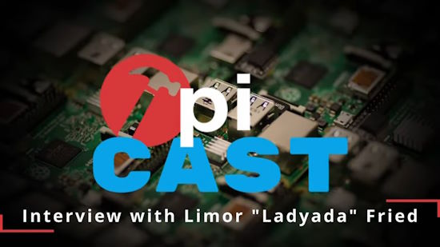](https://www.youtube.com/watch?v=IZwBl_HNvJk)

The Tom's Hardware Pi Cast on September 12th featured Limor "Ladyada" Fried from Adafruit. They discuss "Writing Arduino Drivers With AI" - [YouTube](https://www.youtube.com/watch?v=IZwBl_HNvJk).

> Writing libraries to support our favorite microcontrollers is a big task, but what if ChatGPT could lend a hand? Adafruit's own Limor "Ladyada" Fried has tasked ChatGPT to write Arduino drivers in her own style, creating a "mini-Limor" bot to handle the task. We sat down with Fried to talk about how AI can help Adafruit and the wider community to write drivers, and improve workflows.

## Unicomp Switches Popular Model M Keyboards to Use Raspberry Pi Pico

[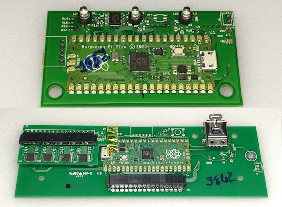](https://sharktastica.co.uk/guides/unicomp_pico)

For years, enthusiasts have been asking for reprogrammable Model M keyboards from Unicomp. Thanks to the 2022 discontinuation of the Cypress microcontroller Unicomp previously used for its USB keyboards, Unicomp keyboards are now mostly reflashable, thanks to their selection of the RP2040-based Raspberry Pi Pico as the heart of its new generation of USB controller cards, allowing for custom firmware just by copying a new UF2 - [Admiral Shark's Keyboards](https://sharktastica.co.uk/guides/unicomp_pico).

## Open Source Hardware Certifications For August 2023

[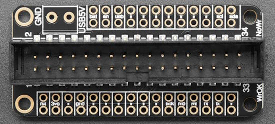](https://makezine.com/article/maker-news/open-source-hardware-certifications-for-august-2023/)

Make is providing written summaries of hardware certifications by the Open Source Hardware Association (OSHWA). Three are highighted including the Adafruit Floppy FeatherWing - [Makezine](https://makezine.com/article/maker-news/open-source-hardware-certifications-for-august-2023/).

## Pimoroni's Pi-Powered 'Pico Vision' Nears Completion

[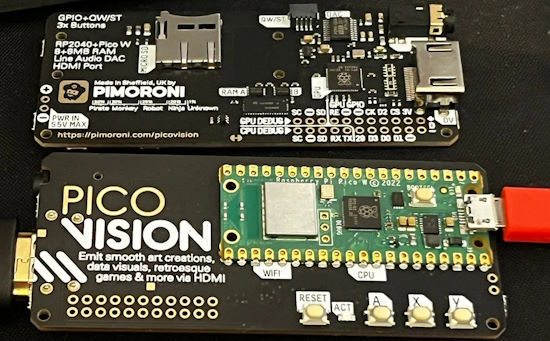](https://www.tomshardware.com/news/pimoronis-pi-powered-pico-vision-nears-completion)

[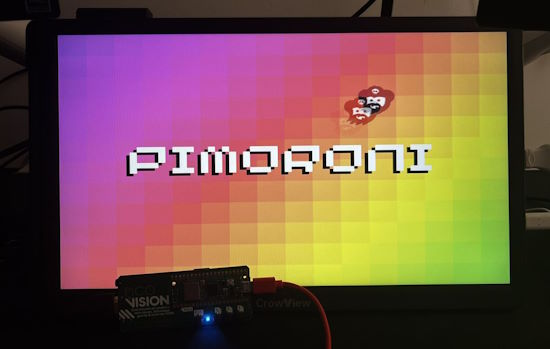](https://www.tomshardware.com/news/pimoronis-pi-powered-pico-vision-nears-completion)

Squeezing the Raspberry Pi Pico's RP2040 into another breakout board, UK-based Pimoroni is working on Pico Vision. The board, according to Pimoroni software developer Phil 'Gadgetoid' [Howard](https://twitter.com/Gadgetoid/status/1701304106650878398), is "a dual RP2040 'CPU' and 'GPU' HDMI stick for … doin’ graphics stuff on big screens." GPIO access is limited to QW/ST connections and a few GPIO pins broken out via the CPU and GPU debug pins - [Tom's Hardware](https://www.tomshardware.com/news/pimoronis-pi-powered-pico-vision-nears-completion).

## Bus Pirate 5 Teased

[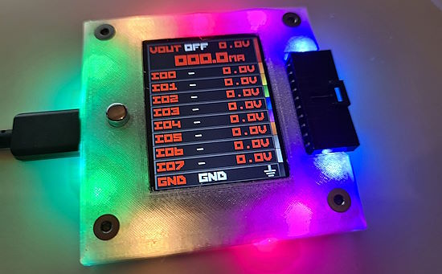](https://twitter.com/dangerousproto/status/1701521001329147923)

Dangerous Prototypes has been demonstrating fresh progress with the Bus Pirate 5, a multiprotocol test device. It's built using the Raspberry Pi RP2040 - [X, formerly Twitter](https://twitter.com/dangerousproto/status/1701521001329147923) and [buspirate.com](https://buspirate.com/coming-soon/).

## This Week's Python Streams

Python on Hardware is all about building a cooperative ecosphere which allows contributions to be valued and to grow knowledge. Below are the streams within the last week focusing on the community.

**CircuitPython Deep Dive Stream**

[Last Friday](https://www.youtube.com/watch?v=VsuwSUXU9q0), Scott streamed work on ESP IDF 5.0.

You can see the latest video and past videos on the Adafruit YouTube channel under the Deep Dive playlist - [YouTube](https://www.youtube.com/playlist?list=PLjF7R1fz_OOXBHlu9msoXq2jQN4JpCk8A).

**CircuitPython Parsec**

John Park’s CircuitPython Parsec this week is on Circuit Playground Tones - [Adafruit Blog](https://blog.adafruit.com/2023/09/15/john-parks-circuitpython-parsec-circuit-playground-tones-adafruit-circuitpython/) and [YouTube](https://youtu.be/H9Hfe5ff-g0).

Catch all the episodes in the [YouTube playlist](https://www.youtube.com/playlist?list=PLjF7R1fz_OOWFqZfqW9jlvQSIUmwn9lWr).

## Project of the Week: Tulip CC on the LILYGO T-Deck

[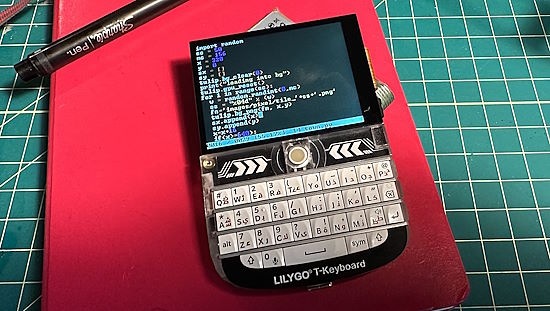](https://github.com/bwhitman/tulipcc/tree/main/tulip/tdeck)

The T-Deck is a ESP32-S3 N16R8 device with touchscreen, small blackberry-style keyboard, LoRA (optional), speaker, microphone, SD card slot, battery charging IC, and trackball. Developers have been doing some interesting projects with it including a [handheld MS-DOS/Windows machine](https://blog.adafruit.com/2023/09/05/a-blackberry-form-factor-ms-dos-computer-via-a-esp32-s3-esp32-msdos-vintagecomputing-moononournation/). The folks behind Tulip CC have ported their software to the device. This provides an interactive MicroPython "deck" experience for music, graphics, and games - [GitHub](https://github.com/bwhitman/tulipcc/tree/main/tulip/tdeck).

## News from around the web!

[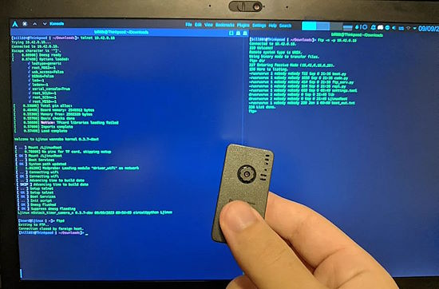](https://twitter.com/bill88t/status/1700268275471618349)

CircuitPython FTP Server is a library providing a simple FTP server for Circuitpython 8.x, with PASV and ACTIVE support - [GitHub](https://github.com/bill88t/CircuitPython_FTP_Server) via [X](https://twitter.com/bill88t/status/1700268275471618349).

[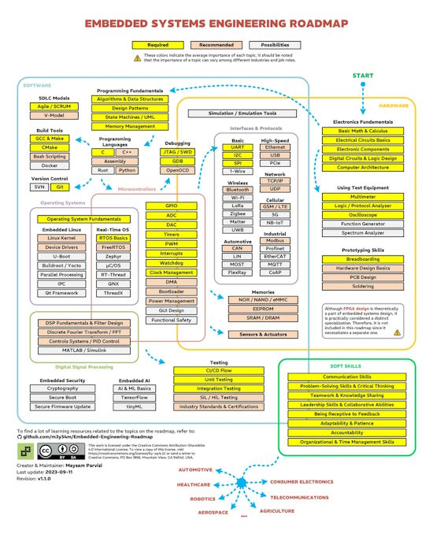](https://twitter.com/m3y54m/status/1701202351619457131)

A revision to the Embedded Systems Engineering Roadmap - [X](https://twitter.com/m3y54m/status/1701202351619457131).

Configure your MicroPython project with JSON files. Learn how to get your microcontroller to remember your settings, so you can quickly get it back in working state even if it loses power or reboots - [Bhavesh Kakwani](https://bhave.sh/micropython-json-config/).

[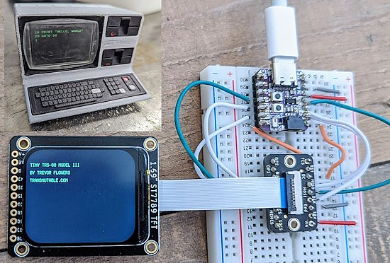](https://machines.social/@trevorflowers/111049705564727275)

Trevor Flowers builds replicas and machines from alternate timelines. The current project is a miniature replica of a TRS-80 Model III. Inside it uses an [Adafruit display](https://www.adafruit.com/product/5206), Adafruit QT Py microcontroller and EYESPI connector breakout, all running CircuitPython - [Mastodon](https://machines.social/@trevorflowers/111049705564727275).

[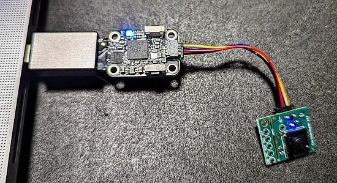](https://twitter.com/LetsOKdo/status/1701714371578069050?t=brqXA-4cBYmYkdtCT42DuA&s=03)

Turn an Adafruit Trinkey into a QR code scanner with CircuitPython and Useful Sensors' new Tiny Code Reader module - [X](https://twitter.com/LetsOKdo/status/1701714371578069050?t=brqXA-4cBYmYkdtCT42DuA&s=03).

Max Van Leeuwen turned a gifted Polaroid camera into a Raspberry Pi camera capable of sending digital pictures to his Grandmothers' picture frame - [Raspberry Pi](https://www.raspberrypi.com/news/globetrotting-polaroid-camera-magically-fills-grandmas-photo-frame/).

[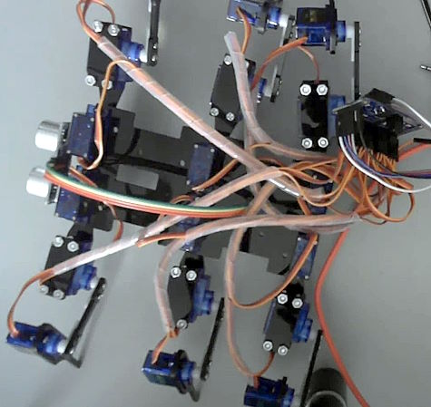](https://twitter.com/orionrobots/status/1701337763230978247)

Revisiting a 2017 video on making a hexapod, and turned the notes into a similarly dated blog post. The code is from 2017, but the write up is todays. For hexapods with ESP8266, MicroPython and the PCA9685 - [X](https://twitter.com/orionrobots/status/1701337763230978247) and [Orionrobots](https://orionrobots.co.uk/2017/08/09/building-esp8266-hexapod-robot.html).

[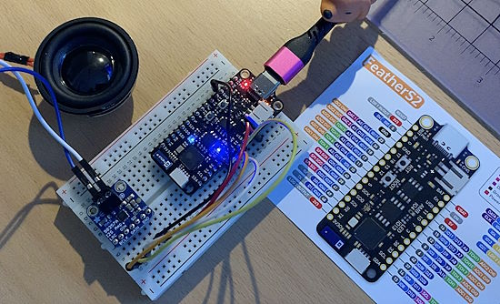](https://github.com/CedarGroveStudios/Weather_Chimes)

Details + code are now up for Cedar Grove Studio's "windless" electronic chimes - [GitHub](https://github.com/CedarGroveStudios/Weather_Chimes).

[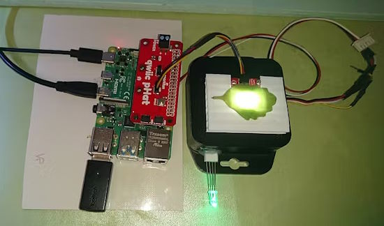](https://www.hackster.io/news/guillermo-perez-guillen-s-raspberry-pi-spectrometer-puts-the-power-of-light-at-your-fingertips-33cbbfd35373)

Raspberry Pi Spectrometer puts the power of light at your fingertips, programmed in Python - [hackster.io](https://www.hackster.io/news/guillermo-perez-guillen-s-raspberry-pi-spectrometer-puts-the-power-of-light-at-your-fingertips-33cbbfd35373).

[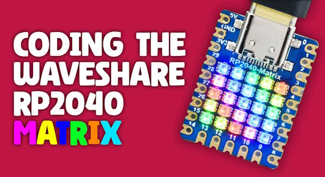](https://thepihut.com/blogs/raspberry-pi-tutorials/coding-the-waveshare-rp2040-matrix)

Coding the Waveshare RP2040 Matrix in CircuitPython or MicroPython - [The Pi Hut](https://thepihut.com/blogs/raspberry-pi-tutorials/coding-the-waveshare-rp2040-matrix).

[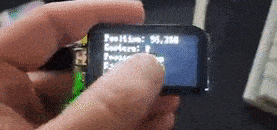](https://twitter.com/Alfie_Rivera/status/1702454510877089936)

The Lilygo9 T-display S3 touch running MicroPython with the touch driver - [X](https://twitter.com/Alfie_Rivera/status/1702454510877089936).

[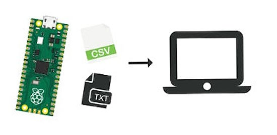](https://www.electromaker.io/project/view/transfer-data-from-raspberry-pi-pico-to-local-computer)

Transfer Data From Raspberry Pi Pico To Local Computer - [Electromaker](https://www.electromaker.io/project/view/transfer-data-from-raspberry-pi-pico-to-local-computer) andf [YouTube](https://youtu.be/OfJ5Y1FlW94).

PicoBricks WiFi gamepad projects with MicroPython - [GitHub](https://github.com/selimgayretli/PB_wifi_gamepad) and [X](https://twitter.com/selimgayretlii/status/1702320492932436099).

[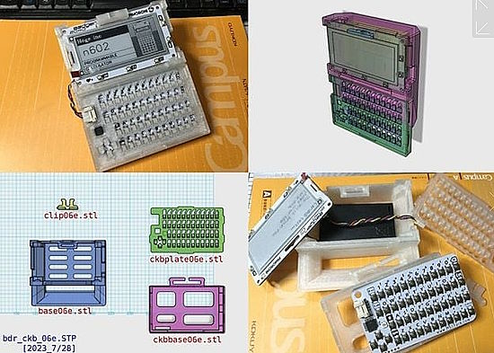](https://www.thingiverse.com/thing:6144044)

A Badger 2040 W + mini Keyboard case makes a small console with a Pimoroni Badger 2040 W and a small keyboard - [Thingiverse](https://www.thingiverse.com/thing:6144044).

[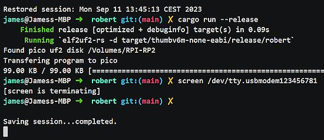](https://bsky.app/profile/jamesmunns.com/post/3k74julmn6w2v)

Running forth3 on an RP2040 via no-std + async things - [Bluesky](https://bsky.app/profile/jamesmunns.com/post/3k74julmn6w2v) and [asciinema](https://asciinema.org/a/0PK3ulRZimYeno8HE3B8CS2Jb).

[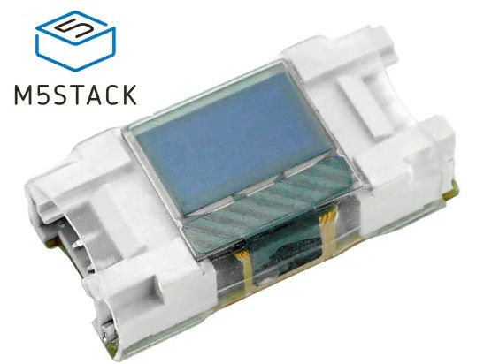](https://twitter.com/ushineko3n/status/1701726635488346135)

It is a 1×2 size Lego block with display (after a bit of trimming)! And it can display bitmaps from MicroPython - Mini OLED Unit 0.42" 72x40 Display with I2C - [X](https://twitter.com/ushineko3n/status/1701726635488346135) and [M5Stack](https://shop.m5stack.com/products/mini-oled-unit-0-42-72x40-display).

PyDev of the Week: Jelle Zijlstra on [Mouse vs Python](https://www.blog.pythonlibrary.org/2023/09/11/pydev-of-the-week-jelle-zijlstra/).

CircuitPython Weekly Meeting for September 11th: ([notes](https://github.com/adafruit/adafruit-circuitpython-weekly-meeting/blob/main/2023/2023-09-11.md)) [on YouTube](https://youtu.be/mQohLco1O-g).

#ICYDNCI What was the most popular, most clicked link, in [last week's newsletter](https://www.adafruitdaily.com/2023/09/11/python-on-microcontrollers-newsletter-new-versions-of-circuitpython-and-pimoroni-micropython-and-more-circuitpython-python-micropython-thepsf-raspberry_pi/)? [VS Code: Virtual Environments for Embedded Development with Conda](https://mcuoneclipse.com/2023/08/25/vs-code-virtual-environments-for-embedded-development-with-conda/).

## New

The Waveshare RP2040-PiZero provides a Raspberry Pi RP2040 microcontroller in a Pi Zero form factor. It includes a microSD reader and 40 pin header - [LinuxGizmos.com](https://linuxgizmos.com/waveshare-presents-rp2040-pi-zero-board/).

[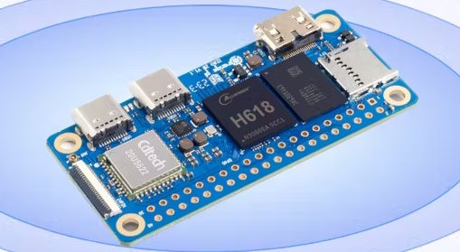](https://www.hackster.io/news/orange-pi-launches-its-zero-2w-single-board-computer-offering-faster-clocks-and-eight-times-the-ram-07f6aa4e0284)

Orange Pi launches its Zero 2W Single-Board Computer, offering faster clocks and 8x Times the RAM. The board was designed to go toe-to-toe with the Raspberry Pi Zero 2 W. This SBC includes a handy 24-pin expansion header with USB, Ethernet, and more - [hackster.io](https://www.hackster.io/news/orange-pi-launches-its-zero-2w-single-board-computer-offering-faster-clocks-and-eight-times-the-ram-07f6aa4e0284).

[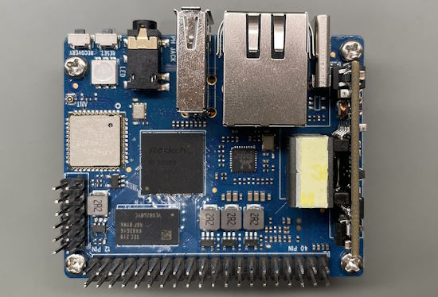](https://twitter.com/judyhuang9/status/1701079536778301811)

Banana Pi BPI-P2 PRO provides PoE and low power consumption with excellent thermal characteristics, making this board an excellent basis for building a smart voice-controlled device, the sound part of a smart robot, smart speaker, or home assistant - [X](https://twitter.com/judyhuang9/status/1701079536778301811).

## New Boards Supported by CircuitPython

The number of supported microcontrollers and Single Board Computers (SBC) grows every week. This section outlines which boards have been included in CircuitPython or added to [CircuitPython.org](https://circuitpython.org/).

This week, there were (#/no) new boards added!

- [Board name](url)
- [Board name](url)
- [Board name](url)

*Note: For non-Adafruit boards, please use the support forums of the board manufacturer for assistance, as Adafruit does not have the hardware to assist in troubleshooting.*

Looking to add a new board to CircuitPython? It's highly encouraged! Adafruit has four guides to help you do so:

- [How to Add a New Board to CircuitPython](https://learn.adafruit.com/how-to-add-a-new-board-to-circuitpython/overview)
- [How to add a New Board to the circuitpython.org website](https://learn.adafruit.com/how-to-add-a-new-board-to-the-circuitpython-org-website)
- [Adding a Single Board Computer to PlatformDetect for Blinka](https://learn.adafruit.com/adding-a-single-board-computer-to-platformdetect-for-blinka)
- [Adding a Single Board Computer to Blinka](https://learn.adafruit.com/adding-a-single-board-computer-to-blinka)

## New Learn Guides!

[Audio Synthesis with CircuitPython synthio](https://learn.adafruit.com/audio-synthesis-with-circuitpython-synthio) from [John Park](https://learn.adafruit.com/u/johnpark)

[Tombstone Prop-Maker RP2040](https://learn.adafruit.com/tombstone-prop-maker-rp2040) from [Noe and Pedro](https://learn.adafruit.com/u/pixil3d)

[Adafruit MatrixPortal S3](https://learn.adafruit.com/adafruit-matrixportal-s3) from [Melissa LeBlanc-Williams](https://learn.adafruit.com/u/MakerMelissa)

## CircuitPython Libraries!

The CircuitPython library numbers are continually increasing, while existing ones continue to be updated. Here we provide library numbers and updates!

To get the latest Adafruit libraries, download the [Adafruit CircuitPython Library Bundle](https://circuitpython.org/libraries). To get the latest community contributed libraries, download the [CircuitPython Community Bundle](https://circuitpython.org/libraries).

If you'd like to contribute to the CircuitPython project on the Python side of things, the libraries are a great place to start. Check out the [CircuitPython.org Contributing page](https://circuitpython.org/contributing). If you're interested in reviewing, check out Open Pull Requests. If you'd like to contribute code or documentation, check out Open Issues. We have a guide on [contributing to CircuitPython with Git and GitHub](https://learn.adafruit.com/contribute-to-circuitpython-with-git-and-github), and you can find us in the #help-with-circuitpython and #circuitpython-dev channels on the [Adafruit Discord](https://adafru.it/discord).

You can check out this [list of all the Adafruit CircuitPython libraries and drivers available](https://github.com/adafruit/Adafruit_CircuitPython_Bundle/blob/master/circuitpython_library_list.md). 

The current number of CircuitPython libraries is **449**!

**New Libraries!**

Here's this week's new CircuitPython libraries:

  * [adafruit/Adafruit_CircuitPython_JSON_Stream](https://github.com/adafruit/Adafruit_CircuitPython_JSON_Stream)

**Updated Libraries!**

Here's this week's updated CircuitPython libraries:

  * [adafruit/Adafruit_CircuitPython_BME680](https://github.com/adafruit/Adafruit_CircuitPython_BME680)
  * [adafruit/Adafruit_CircuitPython_HTTPServer](https://github.com/adafruit/Adafruit_CircuitPython_HTTPServer)

**Library PyPI Weekly Download Stats**

**Total Library Stats**

  * 73763 PyPI downloads over 313 libraries

**Top 10 Libraries by PyPI Downloads**

  * Adafruit CircuitPython BusDevice (adafruit-circuitpython-busdevice): 7375
  * Adafruit CircuitPython Requests (adafruit-circuitpython-requests): 6442
  * Adafruit CircuitPython Register (adafruit-circuitpython-register): 2347
  * Adafruit CircuitPython Motor (adafruit-circuitpython-motor): 1570
  * Adafruit CircuitPython PCA9685 (adafruit-circuitpython-pca9685): 1522
  * Adafruit CircuitPython ServoKit (adafruit-circuitpython-servokit): 1442
  * Adafruit CircuitPython NeoPixel (adafruit-circuitpython-neopixel): 1050
  * Adafruit CircuitPython ESP32SPI (adafruit-circuitpython-esp32spi): 827
  * Adafruit CircuitPython RGB Display (adafruit-circuitpython-rgb-display): 754
  * Adafruit CircuitPython DHT (adafruit-circuitpython-dht): 722

## What’s the CircuitPython team up to this week?

What is the team up to this week? Let’s check in!

**Dan**

I released CircuitPython 8.2.6 last Tuesday, to add a new root TLS root certificate to the roots certificate we use in the Espressif and Pico W ports. The certificate changes in 8.2.5 updated the list, but did not include a special certificate needed by webservers that use Let's Encrypt certificates.

After the release, I did some debugging with colleagues of a couple of issues that turned out to be hardware rather than software related. Now I'm back working on the MicroPython v1.20.0 merge.

**Kattni**

This week I worked on the Metro M7 with microSD guide. It has everything you need to get started with your fancy new Metro. Check it out in the Adafruit Learn System.

On a personal note, I have some news to share. My last day with Adafruit will be September 22, 2023. I will get into this more next week, but I wanted to include it along side the rest of the announcements. Thank you for being such an amazing community! You are what drew me to this in the first place, and I am honored to have been a part of this for the last seven years. I will still be a member of the community, but I will be participating in a different capacity. 

**Melissa**

I've been working on going through [Blinka](https://github.com/adafruit/Adafruit_Blinka/issues) and related issues on GitHub and either closing the issues if they have been resolved already or creating Pull Requests if the solution is relatively easy. As I go through and more issues are closed, I find it less overwhelming and easier to address the remaining issues. The goal is to get the issues down to the more complex ones that really should have some actions taken at some point.

**Tim**

This week I worked on validating a recent fix for Read the Docs docs building and creating a patch file that adabot will be able to use to apply this fix to all of the CircuitPython libraries in an automated fashion. I've submitted PRs with the patch, as well as the same fix in the cookie cutter. I've also been trying options for templating libraries, `utemplate` is one made for MicroPython and a community member is working on a new one focused more directly for CircuitPython. This can be used along with the `HTTPServer` library to render HTML webpages with dynamic data populated into them from Python variables.

**Jeff**

The "dot clock display" pull request has been merged. Thanks for everyone who tested and provided feedback!

Next up is some even less glitzy work to better send display initialization sequences for these kinds of displays, particularly when the display's SPI bus is connected to a GPIO expander rather than directly to the microcontroller, as it is on the Espressif devkit and Adafriut's upcoming board.

**Scott**

This week I've been continuing to work on the ESP IDF5 update PR. I've slimmed down the builds so they all fit and reworked the board config to make flash and psram settings more explicit. Now, I'm smoke testing on each different chip to ensure that basic Python URL requests still work. S3 is ok but S2 is having memory issues with HTTPS currently. C3 and ESP32 still need to be checked. Once they all work, then I'll update the PR. There will definitely still be bugs but they'll be easier to find once it is merged into main. I can also follow up with a 5.1 update after that too.

**Liz**

This week I worked on updating the [2.8" TFT Touch Shield v2 guide](https://learn.adafruit.com/adafruit-2-8-tft-touch-shield-v2) for the new version that just came into the shop. The new version uses the TSC2007 for touch screen functionality. I worked on the guide for the STEMMA QT breakout version of that chip so it was cool to use it in conjunction with a TFT screen. I added a fun CircuitPython example that uses the touch screen to advance a slideshow of Circuit Playground characters.

## Upcoming Events!

The supplier of popular ESP32 and ESP8266 microcontrollers, Espressif, announces their yearly Developers Conference. During the two-day online event, there will be nearly 30 talks created by Espressif technical experts and its partners, covering a wide range of topics, including Thread, the low-power features of ESP32-C6 and Wi-Fi 6, ESP-Mesh-Lite + ESP RainMaker Cloud solution, ESP-IDF, RUST, SquareLine Studio, AWS IoT, and more. September 12-13, 10:00-19:00 CEST - [devcon.espressif.com](https://devcon.espressif.com/).

PyCon UK will be returning to Cardiff City Hall from Friday 22nd September to Monday 25th September 2023 - [PyCon UK](https://2023.pyconuk.org/).

The next MicroPython Meetup in Melbourne will be on September 27th – [Meetup](https://www.meetup.com/micropython-meetup/events). 

Maker Faire Bay Area will be October 13-15 & October 20-22, 2023 - [Eventbright](https://www.eventbrite.com/e/maker-faire-bay-area-october-13-15-october-20-22-2023-tickets-673771979127).

Hackaday has announced that the Hackaday Supercon is on for 2023, and will be taking place November 3 – 5 in Pasadena, California, USA - [Adafruit Blog](https://blog.adafruit.com/2023/05/10/hackaday-supercon-2023-is-on-supercon-hackaday/) and [Hackaday](https://hackaday.com/2023/05/10/supercon-2023-is-on-we-want-you/).

The inaugural PyLadies Conference will take place December 1-3, 2023 - [pretalx](https://pretalx.com/pyladiescon-2023/cfp).

The Pyjamas Conference, the 24-hour online Python conference, will be returning for a fifth year on December 9-10. The Call for Papers began on September 2nd and extends to September 30th - [Twitter](https://twitter.com/PyjamasConf/status/1675278222798495745).

**Send Your Events In**

If you know of virtual events or upcoming events, please let us know via email to cpnews(at)adafruit(dot)com.

## Latest Releases

CircuitPython's stable release is [8.2.6](https://github.com/adafruit/circuitpython/releases/latest). New to CircuitPython? Start with our [Welcome to CircuitPython Guide](https://learn.adafruit.com/welcome-to-circuitpython).

[20230912](https://github.com/adafruit/Adafruit_CircuitPython_Bundle/releases/latest) is the latest Adafruit CircuitPython library bundle.

[20230906](https://github.com/adafruit/CircuitPython_Community_Bundle/releases/latest) is the latest CircuitPython Community library bundle.

[v1.20.0](https://micropython.org/download) is the latest MicroPython release. Documentation for it is [here](http://docs.micropython.org/en/latest/pyboard/).

[3.11.5](https://www.python.org/downloads/) is the latest Python release. The latest pre-release version is [3.12.0rc2](https://www.python.org/download/pre-releases/).

[3,658 Stars](https://github.com/adafruit/circuitpython/stargazers) Like CircuitPython? [Star it on GitHub!](https://github.com/adafruit/circuitpython)

## Call for Help -- Translating CircuitPython is now easier than ever!

[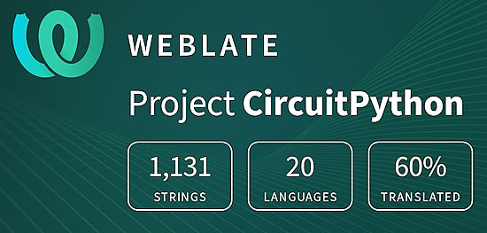](https://hosted.weblate.org/engage/circuitpython/)

One important feature of CircuitPython is translated control and error messages. With the help of fellow open source project [Weblate](https://weblate.org/), we're making it even easier to add or improve translations. 

Sign in with an existing account such as GitHub, Google or Facebook and start contributing through a simple web interface. No forks or pull requests needed! As always, if you run into trouble join us on [Discord](https://adafru.it/discord), we're here to help.

## 37,847 Thanks!

The Adafruit Discord community, where we do all our CircuitPython development in the open, reached over 37,847 humans - thank you! Adafruit believes Discord offers a unique way for Python on hardware folks to connect. Join today at [https://adafru.it/discord](https://adafru.it/discord).

## ICYMI - In case you missed it

Python on hardware is the Adafruit Python video-newsletter-podcast! The news comes from the Python community, Discord, Adafruit communities and more and is broadcast on ASK an ENGINEER Wednesdays. The complete Python on Hardware weekly videocast [playlist is here](https://www.youtube.com/playlist?list=PLjF7R1fz_OOXRMjM7Sm0J2Xt6H81TdDev). The video podcast is on [iTunes](https://itunes.apple.com/us/podcast/python-on-hardware/id1451685192?mt=2), [YouTube](http://adafru.it/pohepisodes), [Instagram Reels](https://www.instagram.com/adafruit/channel/)), and [XML](https://itunes.apple.com/us/podcast/python-on-hardware/id1451685192?mt=2).

[The weekly community chat on Adafruit Discord server CircuitPython channel - Audio / Podcast edition](https://itunes.apple.com/us/podcast/circuitpython-weekly-meeting/id1451685016) - Audio from the Discord chat space for CircuitPython, meetings are usually Mondays at 2pm ET, this is the audio version on [iTunes](https://itunes.apple.com/us/podcast/circuitpython-weekly-meeting/id1451685016), Pocket Casts, [Spotify](https://adafru.it/spotify), and [XML feed](https://adafruit-podcasts.s3.amazonaws.com/circuitpython_weekly_meeting/audio-podcast.xml).

## Contribute!

The CircuitPython Weekly Newsletter is a CircuitPython community-run newsletter emailed every Tuesday. The complete [archives are here](https://www.adafruitdaily.com/category/circuitpython/). It highlights the latest CircuitPython related news from around the web including Python and MicroPython developments. To contribute, edit next week's draft [on GitHub](https://github.com/adafruit/circuitpython-weekly-newsletter/tree/gh-pages/_drafts) and [submit a pull request](https://help.github.com/articles/editing-files-in-your-repository/) with the changes. You may also tag your information on Twitter with #CircuitPython. 

Join the Adafruit [Discord](https://adafru.it/discord) or [post to the forum](https://forums.adafruit.com/viewforum.php?f=60) if you have questions.
