- [X] Kattni updates
- [ ] change date
- [ ] update title
- [ ] Feature story
- [ ] Update  for images
- [ ] Update ICYDNCI
- [ ] All images 550w max only
- [ ] Link "View this email in your browser."

News Sources

- Twitter: [CircuitPython](https://twitter.com/search?q=circuitpython&src=typed_query&f=live), [MicroPython](https://twitter.com/search?q=micropython&src=typed_query&f=live) and [Python](https://twitter.com/search?q=python&src=typed_query)
- Mastodon [CircuitPython](https://octodon.social/tags/CircuitPython) and [MicroPython](https://octodon.social/tags/MicroPython)
- [python.org](https://www.python.org/)
- [Python Insider - dev team blog](https://pythoninsider.blogspot.com/)
- [MicroPython Meetup Blog](https://melbournemicropythonmeetup.github.io/)
- [hackaday.io newest projects MicroPython](https://hackaday.io/projects?tag=micropython&sort=date) and [CircuitPython](https://hackaday.io/projects?tag=circuitpython&sort=date)
- [hackaday CircuitPython](https://hackaday.com/blog/?s=circuitpython) and [MicroPython](https://hackaday.com/blog/?s=micropython)
- [hackster.io CircuitPython](https://www.hackster.io/search?q=circuitpython&i=projects&sort_by=most_recent) and [MicroPython](https://www.hackster.io/search?q=micropython&i=projects&sort_by=most_recent)
- [https://opensource.com/tags/python](https://opensource.com/tags/python)
- [Raspberry Pi News](https://www.raspberrypi.com/news/)
- Check Issues and PRs for input

View this email in your browser. **Warning: Flashing Imagery**

Welcome to the latest Python on Microcontrollers newsletter! *insert 2-3 sentences from editor (what's in overview, banter)* - *Anne Barela, Ed.*

We're on [Discord](https://discord.gg/HYqvREz), [Twitter](https://twitter.com/search?q=circuitpython&src=typed_query&f=live), and for past newsletters - [view them all here](https://www.adafruitdaily.com/category/circuitpython/). If you're reading this on the web, [subscribe here](https://www.adafruitdaily.com/). Here's the news this week:

## Hacktoberfest 10 Starts October 1st

This year marks the 10th anniversary of Hacktoberfest! Hacktoberfest has grown from 676 participants in 2014 to nearly 147,000 participants last year - [Hacktoberfest](https://hacktoberfest.com/).

What is Hacktoberfest? 

> "Join forces in virtual and in-person events to get your project's pull/merge requests done as a team, learn new skills, and meet lifelong friends. This year we’re partnering with Major League Hacking to help the community connect. Open source projects, maintained by community-minded coders, make the modern internet function. Supporting that essential work, and the folks behind it, is what Hacktoberfest is all about."

As in previous years, CircuitPython will be participating in Hacktoberfest, marking some Pull Requests as Hacktober eligible. Keep an eye on the Adafruit Blog and Social Media for details as October approaches. Note the reward system is shifting from T-shirts to virtual rewards - [Hacktoberfest Rewards](https://hacktoberfest.com/about/#digital-rewards).

## New Interview With Eben Upton, Raspberry Pi Founder

[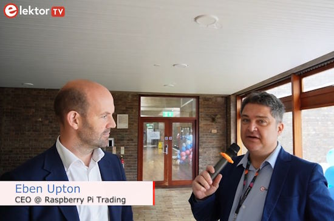](https://youtu.be/YkXCUW_gf2M?feature=shared)

At the 2023 Raspberry Pi Partner event in Cambridge, UK, Elektor’s Brian Tristam Williams caught up with Raspberry Pi Trading CEO Eben Upton to talk origins, vision, and mission. - [YouTube](https://youtu.be/YkXCUW_gf2M?feature=shared).

## CircuitPython Getting Pieces Ready for Version 9

[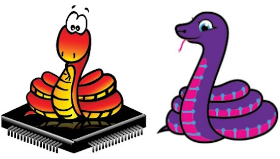](https://github.com/adafruit/circuitpython/pulls)

The CircuitPython team have been getting key code into CircuitPython ahead of a new Version 9 - [GitHub](https://github.com/adafruit/circuitpython/pulls).

These include:

* [Updating to the Espressif ESP-IDF 5.0](https://github.com/adafruit/circuitpython/pull/8411) (goal is to get to 5.1)
* Merging changes from MicroPython v1.20 (goal is to get to the latest version)

## EuroPython 2023 Talk Videos Now Available

EuroPython 2023 talk videos have been released on YouTube as a playlist - [YouTube](https://www.youtube.com/playlist?list=PL8uoeex94UhFcwvAfWHybD7SfNgIUBRo-).

Some interesting talks below including from the Python on Hardware community:

* [The Future of Microprocessors](https://www.youtube.com/watch?v=olXire09ZnE&list=PL8uoeex94UhFcwvAfWHybD7SfNgIUBRo-&index=46) — Sophie Wilson
* [Python on Arm Architecture](https://www.youtube.com/watch?v=nYf7r0lkTIs&list=PL8uoeex94UhFcwvAfWHybD7SfNgIUBRo-&index=94&pp=iAQB) - Diego Russo
* [Async Robots](https://www.youtube.com/watch?v=9uIA3RaaUkU&list=PL8uoeex94UhFcwvAfWHybD7SfNgIUBRo-&index=107) - Radomir Dopieralski
* [PyScript and the magic of Python in the browser](https://www.youtube.com/watch?v=rlgC-v8l_Sk&list=PL8uoeex94UhFcwvAfWHybD7SfNgIUBRo-&index=140) - Nicholas Tollervey, Fabio Pliger

## pico-ice: A RP2040 plus Lattice iCE40UP5K FPGA Development Board

[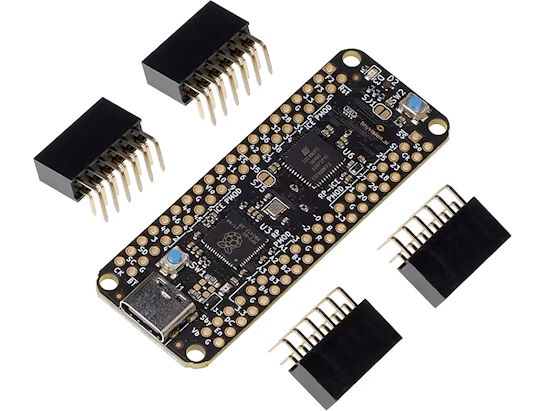](https://www.elecrow.com/pico-ice-rp2040-plus-lattice-ice40up5k-fpga.html)

pico-ice is a small, low cost board with the Raspberry Pi Pico RP2040 microcontroller along with a Lattice Semiconductor iCE40UP5K FPGA. The board features independent flash for the FPGA and RP2040, low power SSRAM, two pushbuttons and a 3 color LED with all FPGA and RP2040 pins brought out to easy to use 0.1” header pins (arranged as PMODs) for prototyping - [Elecrow](https://www.elecrow.com/pico-ice-rp2040-plus-lattice-ice40up5k-fpga.html).

## Making a Single-Button Keyboard With CircuitPython

[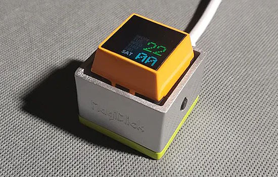](https://www.hackster.io/news/modular-s-magiclick-s3-is-a-circuitpython-powered-single-button-keyboard-with-tricks-up-its-sleeve-7aa3eec95aff)

MagiClick S3 is a single-button keyboard, based on an Espressif ESP32-S3 microcontroller, with a color screen. The display part adopts a 0.85-inch color screen, 128×128 resolution. The main control board is currently designed with the ESP32-S3 which supports WiFi, flash, and RAM large enough to help add more functional scripts in CircuitPython - [hackster.io](https://www.hackster.io/news/modular-s-magiclick-s3-is-a-circuitpython-powered-single-button-keyboard-with-tricks-up-its-sleeve-7aa3eec95aff), [GitHub](https://github.com/MakerM0/MagiClick-esp32s3) and the [Adafruit Blog](https://blog.adafruit.com/2023/09/19/magiclick-s3-is-a-circuitpython-powered-single-button-keyboard-with-display-circuitpython-hacksterio/).

## PyScript "Next" Rewrites Browser-based Python Scripting

[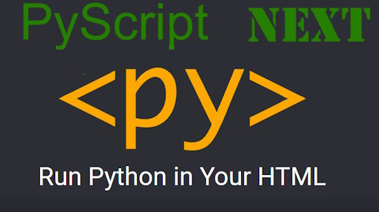](https://github.com/pyscript/pyscript/discussions/1744)

After a huge amount of effort, the PyScript team announces the release of the first technical preview of the [next version of PyScript](https://pyscript.net/unstable/).

This is a big change. In summary, the team writes:

* We have re-architected PyScript on top of a new core: Polyscript.
* This has significantly reduced the size of PyScript and improved its performance.
* PyScript supports multiple Python interpreters (Pyodide and MicroPython).
* PyScript now supports parallel execution of code via web workers.
* There is a new plugin system.
* We've started a complete re-write of the documentation.

Changelog: We re-wrote everything - [GitHub](https://github.com/pyscript/pyscript/discussions/1744).

## This Week's Python Streams

Python on Hardware is all about building a cooperative ecosphere which allows contributions to be valued and to grow knowledge. Below are the streams within the last week focusing on the community.

**CircuitPython Deep Dive Stream**

[Last Friday](link), Scott streamed work on {subject}.

You can see the latest video and past videos on the Adafruit YouTube channel under the Deep Dive playlist - [YouTube](https://www.youtube.com/playlist?list=PLjF7R1fz_OOXBHlu9msoXq2jQN4JpCk8A).

**CircuitPython Parsec**

John Park’s CircuitPython Parsec this week is on {subject} - [Adafruit Blog](link) and [YouTube](link).

Catch all the episodes in the [YouTube playlist](https://www.youtube.com/playlist?list=PLjF7R1fz_OOWFqZfqW9jlvQSIUmwn9lWr).

## Project of the Week: Steering a Robot Via QR Codes

[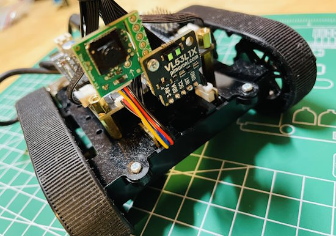](https://twitter.com/r_schulz_maker/status/1704132708111450112)

Roland Schulz demonstrates an innovative Pimoroni Inventor 2040 W mars-rover. It uses a Raspberry Pi and a [Tiny Useful Sensors Reader](https://www.adafruit.com/product/5744) and CircuitPython/MicroPython. The sensor will help to navigate the robot by reading QR codes - [X (formerly Twitter)](https://twitter.com/r_schulz_maker/status/1704132708111450112) and [Adafruit Blog](https://blog.adafruit.com/2023/09/19/navigating-a-robot-using-qr-codes-robotics-circuitpython-ml-r_schulz_maker/).

## News from around the web!

[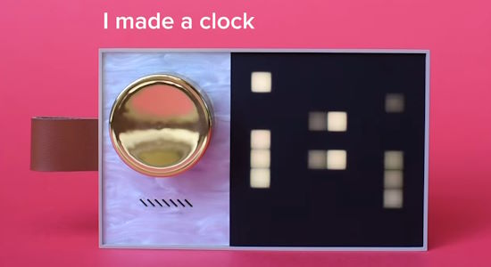](https://www.instagram.com/p/CxUVY0VrjZ_/?img_index=1)

A multi-use clock made with an Adafruit Prop-Maker Feather, RGB LED matrix and CircuitPython - [Instagram](https://www.instagram.com/p/CxUVY0VrjZ_/?img_index=1).

[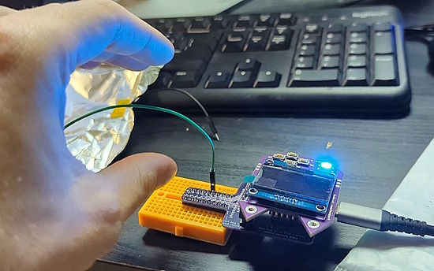](https://infosec.exchange/@skickar/111094974731272773)

A CircuitPython program that shows the capacitance of a pin as a color on the ROYGBIV color scale - [Mastodon](https://infosec.exchange/@skickar/111094974731272773).

[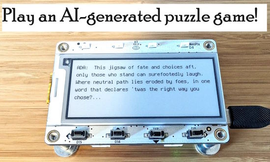](https://www.hackster.io/jenfoxbot/ai-generated-puzzle-hunt-ada-project-2-f4ff47)

Use AI to generate clues for a fun, interactive puzzle hunt and learn how to program with LLMs! Uses an [Adafruit MagTag](https://www.adafruit.com/product/4800) and the OpenAI Python API - [hackster.io](https://www.hackster.io/jenfoxbot/ai-generated-puzzle-hunt-ada-project-2-f4ff47).

[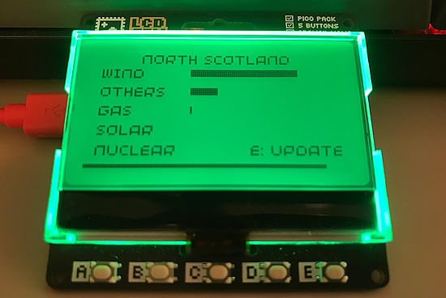](https://simonprickett.dev/carbon-intensity-display-with-raspberry-pi-pico-and-pimoroni-gfx-pack/)

A carbon intensity display with a Raspberry Pi Pico, a Pimoroni GFX Pack and MicroPython - [SimonPrickett.dev](https://simonprickett.dev/carbon-intensity-display-with-raspberry-pi-pico-and-pimoroni-gfx-pack/) via [X](https://twitter.com/simon_prickett/status/1703146438371230167?t=i_uXwdJbRZsajiGsl4V-wQ&s=03).

[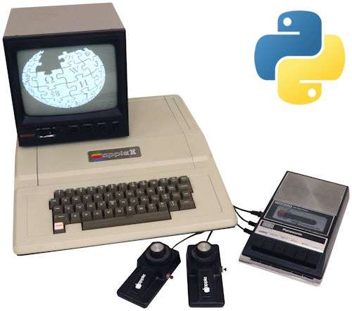](https://github.com/ArthurFerreira2/reinette-II-plus-dot-py)

REINETTE II PLUS DOT PY is an easy to use, yet efficient, Apple II plus emulator in Python - [GitHub](https://github.com/ArthurFerreira2/reinette-II-plus-dot-py).

We previously highlighted Bhavesh Kakwan's MicroPython [tutorial](https://bhave.sh/micropython-json-config/) “How to configure your MicroPython project with JSON files” and now there is an accompanying YouTube video - [YouTube](https://youtu.be/xcVGfjlLReE) and [Adafruit Blog](https://blog.adafruit.com/2023/09/19/how-to-configure-your-micropython-project-with-json-files-micropython-bhavesh_kakwani/).

[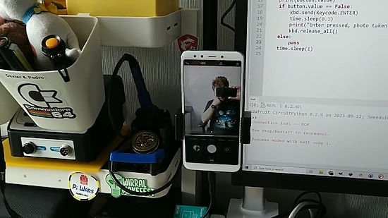](https://twitter.com/biglesp/status/1703021583508410609)

Using a button, microcontroller and CircuitPython to trigger a phone camera - [X](https://twitter.com/biglesp/status/1703021583508410609) and [Adafruit Blog](https://blog.adafruit.com/2023/09/19/use-a-microcontroller-and-circuitpython-to-trigger-a-phone-camera-circuitpython-biglesp/).

A follow-up on the addition of Python to Excel - [LinkedIn](https://www.linkedin.com/pulse/pythons-gonna-get-ya-jason-yallop/).

[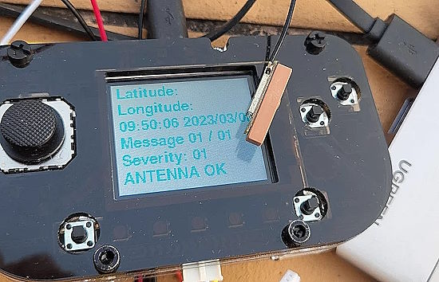](https://twitter.com/TheGrouchHK/status/1704747755707707870)

Using an Adafruit PyGamer as a basic GPS receiver - [X](https://twitter.com/TheGrouchHK/status/1704747755707707870).

[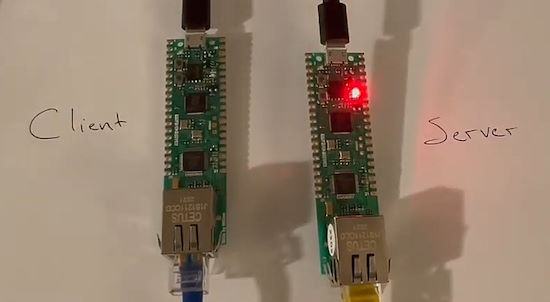](https://sjhennion.github.io/jekyll/update/2023/09/22/w5500-intro.html)

Using Micropython to connect Wiznet W5500 Pico Pis over Ethernet - [Stephanj's Writings](https://sjhennion.github.io/jekyll/update/2023/09/22/w5500-intro.html).

[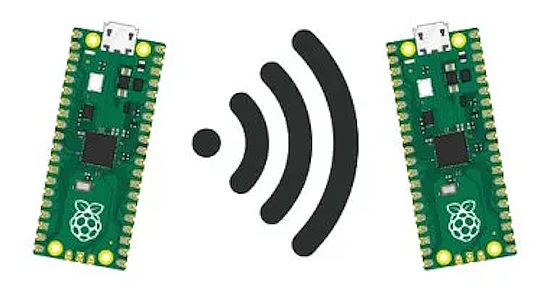](https://www.electromaker.io/project/view/sending-data-between-raspberry-pi-pico-ws-in-thonny)

Sharing data between multiple Raspberry Pi Pico W boards using Thonny, MicroPython and sockets - [Electromaker](https://www.electromaker.io/project/view/sending-data-between-raspberry-pi-pico-ws-in-thonny).

text - [site](url).

text - [site](url).

text - [site](url).

text - [site](url).

[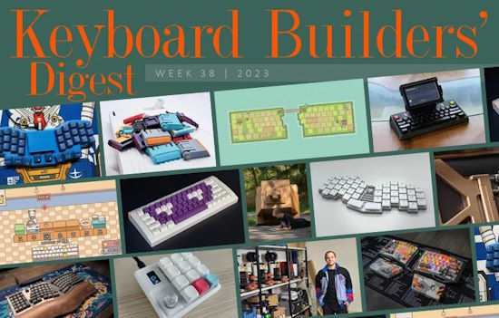](https://kbd.news/Behind-the-scenes-2023-38-2128.html)

Keyboard Builders' Digest latest issue - [Keyboard Builders' Digest](https://kbd.news/Behind-the-scenes-2023-38-2128.html).

[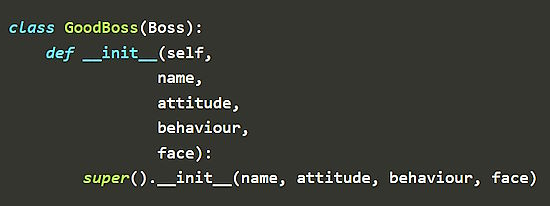](https://pybit.es/articles/python-subclasses/)

How to Write a Python Subclass - [pybytes](https://pybit.es/articles/python-subclasses/).

PyDev of the Week: Timothée Mazzucotelli on [Mouse vs Python](https://www.blog.pythonlibrary.org/2023/09/18/pydev-of-the-week-timothee-mazzucotelli/).

CircuitPython Weekly Meeting for September 18th ([notes](https://github.com/adafruit/adafruit-circuitpython-weekly-meeting/blob/main/2023/2023-09-18.md)) [on YouTube](https://youtu.be/SeUVtXUTQew).

#ICYDNCI What was the most popular, most clicked link, in [last week's newsletter](https://www.adafruitdaily.com/2023/09/18/python-on-microcontrollers-newsletter-python-top-language-picos-are-everywhere-and-much-more-circuitpython-python-micropython-thepsf-raspberry_pi/)? [Embedded Systems Engineering Roadmap](https://twitter.com/m3y54m/status/1701202351619457131).

## New

[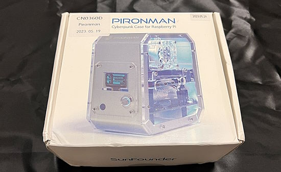](https://twitter.com/search?q=%40murasametech%20pironman&src=typed_query)

Murasan on X posts a series of reviews for the SUNFOUNDER Pironman case for Raspberry Pi - [X](https://twitter.com/search?q=%40murasametech%20pironman&src=typed_query), [Amazon.co.jp](https://www.amazon.co.jp/Pironman-Raspberry-%E3%82%B1%E3%83%BC%E3%82%B9%E3%80%81Raspberry-Mini-%E3%82%A2%E3%83%AB%E3%83%9F%E5%90%88%E9%87%91%E8%A3%BD%E3%82%BF%E3%83%AF%E3%83%BC%E3%82%B1%E3%83%BC%E3%82%B9%E3%80%81%E3%82%BF%E3%83%AF%E3%83%BC%E3%82%AF%E3%83%BC%E3%83%A9%E3%83%BC%E3%80%81M-2/dp/B0BL7QLX8W) and [Amazon.com](https://www.amazon.com/s?k=B0BL7QLX8W&crid=1PB4QYZ4MGQV6).

text - [site](url).

## New Boards Supported by CircuitPython

The number of supported microcontrollers and Single Board Computers (SBC) grows every week. This section outlines which boards have been included in CircuitPython or added to [CircuitPython.org](https://circuitpython.org/).

This week, there were (#/no) new boards added!

- [Board name](url)
- [Board name](url)
- [Board name](url)

*Note: For non-Adafruit boards, please use the support forums of the board manufacturer for assistance, as Adafruit does not have the hardware to assist in troubleshooting.*

Looking to add a new board to CircuitPython? It's highly encouraged! Adafruit has four guides to help you do so:

- [How to Add a New Board to CircuitPython](https://learn.adafruit.com/how-to-add-a-new-board-to-circuitpython/overview)
- [How to add a New Board to the circuitpython.org website](https://learn.adafruit.com/how-to-add-a-new-board-to-the-circuitpython-org-website)
- [Adding a Single Board Computer to PlatformDetect for Blinka](https://learn.adafruit.com/adding-a-single-board-computer-to-platformdetect-for-blinka)
- [Adding a Single Board Computer to Blinka](https://learn.adafruit.com/adding-a-single-board-computer-to-blinka)

## New Learn Guides!

[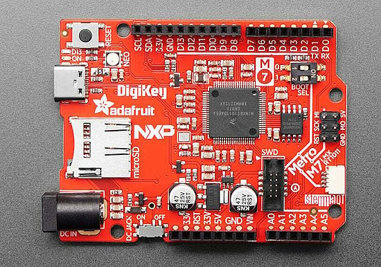](https://learn.adafruit.com/guides/latest)

[Adafruit Metro M7 with microSD](https://learn.adafruit.com/adafruit-metro-m7-microsd) from [Kattni](https://learn.adafruit.com/u/kattni)

## CircuitPython Libraries!

The CircuitPython library numbers are continually increasing, while existing ones continue to be updated. Here we provide library numbers and updates!

To get the latest Adafruit libraries, download the [Adafruit CircuitPython Library Bundle](https://circuitpython.org/libraries). To get the latest community contributed libraries, download the [CircuitPython Community Bundle](https://circuitpython.org/libraries).

If you'd like to contribute to the CircuitPython project on the Python side of things, the libraries are a great place to start. Check out the [CircuitPython.org Contributing page](https://circuitpython.org/contributing). If you're interested in reviewing, check out Open Pull Requests. If you'd like to contribute code or documentation, check out Open Issues. We have a guide on [contributing to CircuitPython with Git and GitHub](https://learn.adafruit.com/contribute-to-circuitpython-with-git-and-github), and you can find us in the #help-with-circuitpython and #circuitpython-dev channels on the [Adafruit Discord](https://adafru.it/discord).

You can check out this [list of all the Adafruit CircuitPython libraries and drivers available](https://github.com/adafruit/Adafruit_CircuitPython_Bundle/blob/master/circuitpython_library_list.md). 

The current number of CircuitPython libraries is **449**!

**Updated Libraries!**

Here's this week's updated CircuitPython libraries:

  * [adafruit/Adafruit_CircuitPython_HID](https://github.com/adafruit/Adafruit_CircuitPython_HID)
  * [adafruit/Adafruit_CircuitPython_AHTx0](https://github.com/adafruit/Adafruit_CircuitPython_AHTx0)
  * [adafruit/Adafruit_CircuitPython_Wiznet5k](https://github.com/adafruit/Adafruit_CircuitPython_Wiznet5k)
  * [furbrain/CircuitPython_CaveBLE](https://github.com/furbrain/CircuitPython_CaveBLE)
  * [CedarGroveStudios/CircuitPython_MIDI_Tools](https://github.com/CedarGroveStudios/CircuitPython_MIDI_Tools)

**Library PyPI Weekly Download Stats**

**Total Library Stats**

  * 70124 PyPI downloads over 313 libraries

* **Top 10 Libraries by PyPI Downloads**
  
  * Adafruit CircuitPython BusDevice (adafruit-circuitpython-busdevice): 8369
  * Adafruit CircuitPython Requests (adafruit-circuitpython-requests): 7512
  * Adafruit CircuitPython Register (adafruit-circuitpython-register): 2495
  * Adafruit CircuitPython PCA9685 (adafruit-circuitpython-pca9685): 1275
  * Adafruit CircuitPython Motor (adafruit-circuitpython-motor): 1228
  * Adafruit CircuitPython ServoKit (adafruit-circuitpython-servokit): 1211
  * Adafruit CircuitPython NeoPixel (adafruit-circuitpython-neopixel): 1097
  * Adafruit CircuitPython ADS1x15 (adafruit-circuitpython-ads1x15): 871
  * Adafruit CircuitPython Pixelbuf (adafruit-circuitpython-pixelbuf): 679
  * Adafruit CircuitPython Wiznet5k (adafruit-circuitpython-wiznet5k): 620

## What’s the CircuitPython team up to this week?

What is the team up to this week? Let’s check in!

**Dan**

After several hours of "pair merging" with Jeff, we resolved all the pending merge conflicts in the MicroPython v1.20.0 merge to CircuitPython. I was then able to make the first commit to my merge branch. Jeff then got the mpy-cross executable to build after numerous small changes, and I made some further touch-ups. I'll be continuing on the merge in the coming days.

We would all like to thank Kattni for her years of work on the CircuitPython, its community, libraries, and guides. We are looking forward to seeing what she'll be doing next.

**Kattni**

My last day working with Adafruit was Friday, September 22, 2023. I want to say thank you to everyone in this community. This community is a huge part of what started this chapter in my life, and my involvement with it has been one of the most fulfilling and amazing things I’ve done over the last five years. I would not be where I am today without the support and encouragement I received from so many folks along the way. You have read my guides, helped me with code and bugs, taught me new things, and so much more. 

One of the best things has been you telling me when something I suggested, created or helped create had a positive impact on you or folks you know. Keep sharing those stories. Thank you for being amazing, thank you for being a part of the welcoming, positive, supportive place that we’ve created together, and finally, thank you for welcoming me as a community leader and giving me the opportunity to gain the experience of building an open source community.

**Melissa**

This week I continued working on going through issues in the various GitHub repos starting with Blinka. I also went through and updated the configuration and documentation settings so that everything was building properly. Eventually I moved over to working on the Blinka `Displayio` issues by updating the code to better align it with the CircuitPython `displayio` code layout and making it more readable.

**Tim**

This week I ran the RTD Theme fix patch with the Adabot Utility that applies the patch to all Libraries. It was my first time using this functionality of Adabot, I was shown how prior but had no "hands on" experience. There were a handful that it failed to push, so I also created PRs on those ones with the same fix. I also tested some changes to the Ethernet `Wiznet5k` Library, and I've been continuing work on a templating engine with a community member.

**Jeff**

I added code to the core to initialize dot clock LCD displays that require use of an I2C bus expander. This sounds pretty esoteric, but is needed in order to support the built in LCD screen on the Espressif ESP32-S3 LCD Evaluation Kit.

I'm also helping out Dan with the MicroPython 1.20 merge. We're making progress but there are a large number of errors to fix, first in the build process and then the problems that turn up during automated and manual testing. This merge is one of the things that we want to get done before the first alpha release of CircuitPython 9.

It had been months since I had time to do a keyboard conversion guide. That changed this past week when I took a couple of hours to write up a conversion of the Unicomp "Mini M" tenkeyless keyboard to use CircuitPython. You can find it on the [learn playground](https://adafruit-playground.com/u/jepler/pages/unicomp-micro-m-with-circuitpython). This buckling spring keyboard was recently updated with a Raspberry Pi Pico as the controller, which makes putting CircuitPython easy, if you don't mind potentially voiding your warranty by opening up the enclosure.

**Scott**

Last week I finished up the Espressif IDF 5.0 update for CircuitPython and [made a PR](https://github.com/adafruit/circuitpython/pull/8411). I also [started the 5.1 merge during my stream](https://www.youtube.com/live/VsuwSUXU9q0?si=_F7I8HPU9njNqr6q&t=2621). More changes were needed this week to enable ESP32-C6 support but it is working now. Code size is still an issue unfortunately. The 5.1 update should come pretty quickly after 5.0.

**Liz**

This week I worked on the Adafruit Learning System guide for the [LED Matrix Sports Scoreboard](https://learn.adafruit.com/led-matrix-sports-scoreboard). This project uses four 64x32 RGB LED matrices with the Matrix Portal S3 to fetch data from the ESPN API for various sports and leagues. I took the hero shots while the New England Patriots were playing against the Miami Dolphins and, although they ultimately lost to the Dolphins, it was fun to see the data update alongside the live feed.

## Upcoming Events!

PyCon UK will be returning to Cardiff City Hall from Friday 22nd September to Monday 25th September 2023 - [PyCon UK](https://2023.pyconuk.org/).

The next MicroPython Meetup in Melbourne will be on September 27th – [Meetup](https://www.meetup.com/micropython-meetup/events). 

Maker Faire Bay Area will be October 13-15 & October 20-22, 2023 - [Eventbright](https://www.eventbrite.com/e/maker-faire-bay-area-october-13-15-october-20-22-2023-tickets-673771979127).

Hackaday has announced that the Hackaday Supercon is on for 2023, and will be taking place November 3 – 5 in Pasadena, California, USA - [Adafruit Blog](https://blog.adafruit.com/2023/05/10/hackaday-supercon-2023-is-on-supercon-hackaday/) and [Hackaday](https://hackaday.com/2023/05/10/supercon-2023-is-on-we-want-you/).

The inaugural PyLadies Conference will take place December 1-3, 2023 - [pretalx](https://pretalx.com/pyladiescon-2023/cfp).

The Pyjamas Conference, the 24-hour online Python conference, will be returning for a fifth year on December 9-10. The Call for Papers began on September 2nd and extends to September 30th - [Twitter](https://twitter.com/PyjamasConf/status/1675278222798495745).

**Send Your Events In**

If you know of virtual events or upcoming events, please let us know via email to cpnews(at)adafruit(dot)com.

## Latest Releases

CircuitPython's stable release is [8.2.6](https://github.com/adafruit/circuitpython/releases/latest). New to CircuitPython? Start with our [Welcome to CircuitPython Guide](https://learn.adafruit.com/welcome-to-circuitpython).

[20230920](https://github.com/adafruit/Adafruit_CircuitPython_Bundle/releases/latest) is the latest Adafruit CircuitPython library bundle.

[20230917](https://github.com/adafruit/CircuitPython_Community_Bundle/releases/latest) is the latest CircuitPython Community library bundle.

[v1.20.0](https://micropython.org/download) is the latest MicroPython release. Documentation for it is [here](http://docs.micropython.org/en/latest/pyboard/).

[3.11.5](https://www.python.org/downloads/) is the latest Python release. The latest pre-release version is [3.12.0rc3](https://www.python.org/download/pre-releases/).

[3,666 Stars](https://github.com/adafruit/circuitpython/stargazers) Like CircuitPython? [Star it on GitHub!](https://github.com/adafruit/circuitpython)

## Call for Help -- Translating CircuitPython is now easier than ever!

[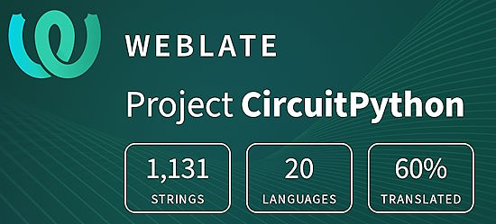](https://hosted.weblate.org/engage/circuitpython/)

One important feature of CircuitPython is translated control and error messages. With the help of fellow open source project [Weblate](https://weblate.org/), we're making it even easier to add or improve translations. 

Sign in with an existing account such as GitHub, Google or Facebook and start contributing through a simple web interface. No forks or pull requests needed! As always, if you run into trouble join us on [Discord](https://adafru.it/discord), we're here to help.

## 37,712 Thanks!

The Adafruit Discord community, where we do all our CircuitPython development in the open, reached over 37,712 humans - thank you! Adafruit believes Discord offers a unique way for Python on hardware folks to connect. Join today at [https://adafru.it/discord](https://adafru.it/discord).

## ICYMI - In case you missed it

Python on hardware is the Adafruit Python video-newsletter-podcast! The news comes from the Python community, Discord, Adafruit communities and more and is broadcast on ASK an ENGINEER Wednesdays. The complete Python on Hardware weekly videocast [playlist is here](https://www.youtube.com/playlist?list=PLjF7R1fz_OOXRMjM7Sm0J2Xt6H81TdDev). The video podcast is on [iTunes](https://itunes.apple.com/us/podcast/python-on-hardware/id1451685192?mt=2), [YouTube](http://adafru.it/pohepisodes), [Instagram Reels](https://www.instagram.com/adafruit/channel/)), and [XML](https://itunes.apple.com/us/podcast/python-on-hardware/id1451685192?mt=2).

[The weekly community chat on Adafruit Discord server CircuitPython channel - Audio / Podcast edition](https://itunes.apple.com/us/podcast/circuitpython-weekly-meeting/id1451685016) - Audio from the Discord chat space for CircuitPython, meetings are usually Mondays at 2pm ET, this is the audio version on [iTunes](https://itunes.apple.com/us/podcast/circuitpython-weekly-meeting/id1451685016), Pocket Casts, [Spotify](https://adafru.it/spotify), and [XML feed](https://adafruit-podcasts.s3.amazonaws.com/circuitpython_weekly_meeting/audio-podcast.xml).

## Contribute!

The CircuitPython Weekly Newsletter is a CircuitPython community-run newsletter emailed every Tuesday. The complete [archives are here](https://www.adafruitdaily.com/category/circuitpython/). It highlights the latest CircuitPython related news from around the web including Python and MicroPython developments. To contribute, edit next week's draft [on GitHub](https://github.com/adafruit/circuitpython-weekly-newsletter/tree/gh-pages/_drafts) and [submit a pull request](https://help.github.com/articles/editing-files-in-your-repository/) with the changes. You may also tag your information on Twitter with #CircuitPython. 

Join the Adafruit [Discord](https://adafru.it/discord) or [post to the forum](https://forums.adafruit.com/viewforum.php?f=60) if you have questions.
