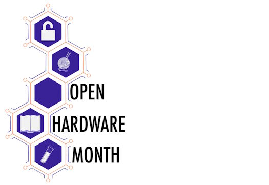
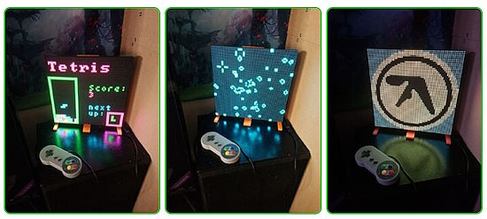
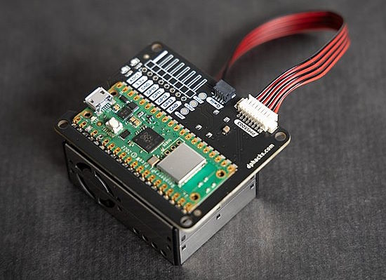
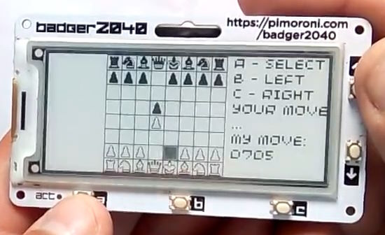
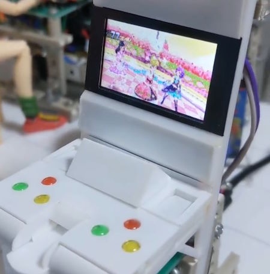
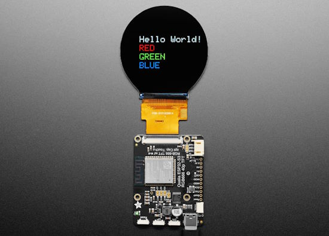
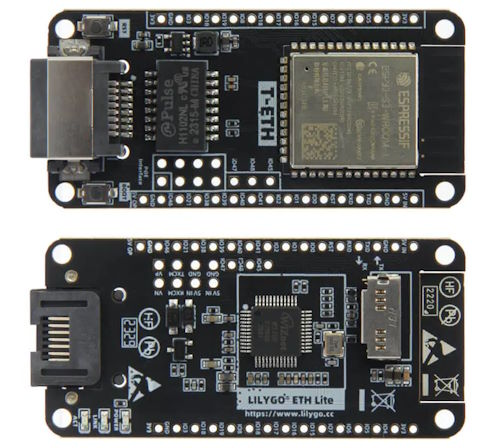
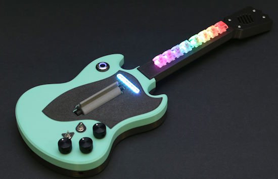
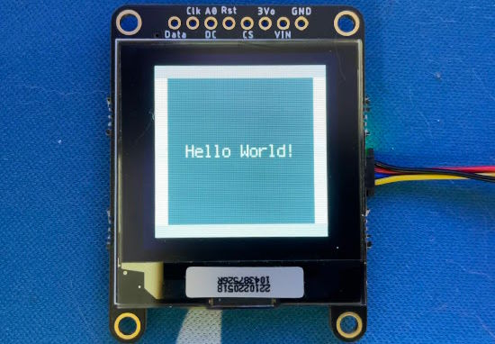
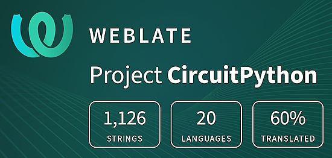

- [ ] Library and info updates
- [ ] change date
- [ ] update title
- [ ] Feature story
- [ ] Update  for images
- [ ] Update ICYDNCI
- [ ] All images 550w max only
- [ ] Link "View this email in your browser."

News Sources

- Twitter: [CircuitPython](https://twitter.com/search?q=circuitpython&src=typed_query&f=live), [MicroPython](https://twitter.com/search?q=micropython&src=typed_query&f=live) and [Python](https://twitter.com/search?q=python&src=typed_query)
- Mastodon [CircuitPython](https://octodon.social/tags/CircuitPython) and [MicroPython](https://octodon.social/tags/MicroPython)
- [python.org](https://www.python.org/)
- [Python Insider - dev team blog](https://pythoninsider.blogspot.com/)
- [MicroPython Meetup Blog](https://melbournemicropythonmeetup.github.io/)
- [hackaday.io newest projects MicroPython](https://hackaday.io/projects?tag=micropython&sort=date) and [CircuitPython](https://hackaday.io/projects?tag=circuitpython&sort=date)
- [hackaday CircuitPython](https://hackaday.com/blog/?s=circuitpython) and [MicroPython](https://hackaday.com/blog/?s=micropython)
- [hackster.io CircuitPython](https://www.hackster.io/search?q=circuitpython&i=projects&sort_by=most_recent) and [MicroPython](https://www.hackster.io/search?q=micropython&i=projects&sort_by=most_recent)
- [https://opensource.com/tags/python](https://opensource.com/tags/python)
- [Raspberry Pi News](https://www.raspberrypi.com/news/)
- Check Issues and PRs for input

View this email in your browser. **Warning: Flashing Imagery**

Welcome to the latest Python on Microcontrollers newsletter! *insert 2-3 sentences from editor (what's in overview, banter)* - *Anne Barela, Ed.*

We're on [Discord](https://discord.gg/HYqvREz), [Twitter](https://twitter.com/search?q=circuitpython&src=typed_query&f=live), and for past newsletters - [view them all here](https://www.adafruitdaily.com/category/circuitpython/). If you're reading this on the web, [subscribe here](https://www.adafruitdaily.com/). Here's the news this week:

## Headline

text - [site](url).

## October is Open Hardware Month

October is Open Hardware Month! Join [OSHWA](https://www.oshwa.org/) by [Certifying](https://certification.oshwa.org/) hardware as open source, becoming a member, or – where it is safe due to the pandemic – hosting a small event. OSHWA is providing resources and asking the community to host small, local events (if it’s safe) in the name of open source hardware - [OSHWA](https://ohm.oshwa.org/).

hackster.io welcomes Sid Drmay to discuss everything the Open Source Hardware Association (OSHWA) is planning for Open Hardware Month! Returning guest Ayesha Iftiqhar-Wilson joins the conversation as Alex Glow explore the process of documenting your projects on the way to OSHWA certification. Now's the perfect time to certify your own project, become a member of OSHWA, or get involved in other ways - [YouTube](https://www.youtube.com/live/GXs-nZ3JXy8?feature=shared).

## Feature

text - [site](url).

## LibrePCB 1.0 Announced

The [1.0 version](https://librepcb.org/blog/2023-09-24_release_1.0.0/) of the [LibrePCB](https://librepcb.org/) "free, cross-platform, easy-to-use electronic design automation suite to draw schematics and design printed circuit boards" is out. A grant this year has helped spur development of the tool with the focus for the release being adding features that were needed so that "there should be no show stopper anymore which prevents you from using LibrePCB for more complex PCB (printed circuit board) designs". New features include a 3D viewer and export format for working with designs in a mechanical computer aided design (CAD) tool, support for manufacturer part number (MFN) management, and lots of board editor features such as thermal relief pads in planes, blind & buried vias, keepout zones, and more - [LibrePCB](https://librepcb.org/blog/2023-09-24_release_1.0.0/) and [lwn.net](https://lwn.net/Articles/945519/).

## A RGB LED Matrix visualizer

RGB LED Matrix visualizer provides various methods to display information on "HUB75" RGB LED matrix modules, running on Raspberry Pi and Pico W. Various graphics, text and animated GIFs are all supported - [xythobuz.de](https://www.xythobuz.de/ledmatrix_v2.html) and [GitHub](https://github.com/xythobuz/rgb-matrix-visualizer).

## This Week's Python Streams

Python on Hardware is all about building a cooperative ecosphere which allows contributions to be valued and to grow knowledge. Below are the streams within the last week focusing on the community.

**CircuitPython Deep Dive Stream**

[Last Friday](link), Scott streamed work on {subject}.

You can see the latest video and past videos on the Adafruit YouTube channel under the Deep Dive playlist - [YouTube](https://www.youtube.com/playlist?list=PLjF7R1fz_OOXBHlu9msoXq2jQN4JpCk8A).

**CircuitPython Parsec**

Catch all the episodes of John Park’s CircuitPython Parsec in the [YouTube playlist](https://www.youtube.com/playlist?list=PLjF7R1fz_OOWFqZfqW9jlvQSIUmwn9lWr).

## Project of the Week: The Pico W Air is a Sensor Data Logger using MQTT

Pico W Air is a tiny board to get started on environment data logging. It broadcasts PMS5003 particulate matter (and other STEMMA QT/Qwiic) sensor data over MQTT. It's also a tiny web server with a JSON API running on CircuitPython - [X, Formerly Twitter](https://twitter.com/makerbymistake/status/1705960530605686988) and [GitHub](https://github.com/DPHacks/picow-air).

## News from around the web!

A game of chess on a Pimoroni eInk Badger2040 running MicroPython - [X](https://twitter.com/niu_tech/status/1696888854190461252) and [GitHub](https://github.com/niutech/chess-badger2040).

Building a hex key keyboard synth with CircuitPython and `synthio` - [Mastodon](https://merveilles.town/@s_ol/111109987340636898).

Meet Karma, GeekMomProjects new colorful companion bot designed in collaboration with @odd_jayy. She (she's definitely a girl, because Karma's a bitch) sits on my shoulders and responds to faces and to touch. One ear lights blue, depending on which side of midline she sees the closest face. Her head moves to track it too, though that part needs work. There is a small ($10!) "person" sensor in her head that locates face bounding boxes, plus a capacitive touch sensor that changes animation patterns along her back ridge when petted - [Instagram](https://www.instagram.com/reel/Cxgaq96Sbgj/).

Free Python book online: Research Software Engineering with Python - [Merely Useful Tech](https://merely-useful.tech/py-rse/).

Making dioramas with small screens running CircuitPython displaying animated GIFs - [X (Japanese)](https://twitter.com/hajime_araiso/status/1706974868934426733) and [Adafruit Blog](https://blog.adafruit.com/2023/09/27/making-dioramas-with-animated-gifs-and-circuitpython-hajime_araiso/).

text - [site](url).

text - [site](url).

Last month we reported on the Pimoroni Pico Vision board with two RP2040 chips to provide computing and video display. On GitHub is code for a concept microcomputer based on Pico Vision - [GitHub](https://github.com/Gadgetoid/picovision-micro-computer).

text - [site](url).

text - [site](url).

text - [site](url).

text - [site](url).

text - [site](url).

text - [site](url).

text - [site](url).

text - [site](url).

text - [site](url).

text - [site](url).

PyDev of the Week: NAME on [Mouse vs Python]().

CircuitPython Weekly Meeting for DATE ([notes]()) [on YouTube]().

**#ICYDNCI What was the most popular, most clicked link, in [last week's newsletter](https://www.adafruitdaily.com/2023/09/25/python-on-microcontrollers-newsletter-hacktoberfest-europython-talks-online-and-much-more-circuitpython-python-micropython-thepsf-raspberry_pi/)? [pico-ice RP2040 plus Lattice iCE40UP5K FPGA](https://www.elecrow.com/pico-ice-rp2040-plus-lattice-ice40up5k-fpga.html).**

## New

Adafruit Qualia ESP32-S3 is a microcontroller board with capabilities for driving large TTL RGB-666 displays. RGB TTL interface TFT displays can get big: they start out at around 4.3" diagonal 480x272, and can get to 800x480, 800x600 or even 720x720 square, round or bar displays - [Adafruit](https://www.adafruit.com/product/5800https://www.adafruit.com/product/5800).

LILYGO T-ETH-Lite is an ESP32-S3 board with RJ45 Ethernet and optional PoE support - [CNX Software](https://www.cnx-software.com/2023/09/27/lilygo-t-eth-lite-esp32-s3-board-ethernet-poe/).

## New Boards Supported by CircuitPython

The number of supported microcontrollers and Single Board Computers (SBC) grows every week. This section outlines which boards have been included in CircuitPython or added to [CircuitPython.org](https://circuitpython.org/).

This week there were no new boards, but several are in development.

*Note: For non-Adafruit boards, please use the support forums of the board manufacturer for assistance, as Adafruit does not have the hardware to assist in troubleshooting.*

Looking to add a new board to CircuitPython? It's highly encouraged! Adafruit has four guides to help you do so:

- [How to Add a New Board to CircuitPython](https://learn.adafruit.com/how-to-add-a-new-board-to-circuitpython/overview)
- [How to add a New Board to the circuitpython.org website](https://learn.adafruit.com/how-to-add-a-new-board-to-the-circuitpython-org-website)
- [Adding a Single Board Computer to PlatformDetect for Blinka](https://learn.adafruit.com/adding-a-single-board-computer-to-platformdetect-for-blinka)
- [Adding a Single Board Computer to Blinka](https://learn.adafruit.com/adding-a-single-board-computer-to-blinka)

## New Learn Guides!

[Guitar Synth with CircuitPython SynthIO](https://learn.adafruit.com/guitar-synth-with-circuitpython-synthiohttps://learn.adafruit.com/guitar-synth-with-circuitpython-synthio) from [Ruiz Brothers](https://learn.adafruit.com/u/pixil3d)

## CircuitPython Libraries!

The CircuitPython library numbers are continually increasing, while existing ones continue to be updated. Here we provide library numbers and updates!

To get the latest Adafruit libraries, download the [Adafruit CircuitPython Library Bundle](https://circuitpython.org/libraries). To get the latest community contributed libraries, download the [CircuitPython Community Bundle](https://circuitpython.org/libraries).

If you'd like to contribute to the CircuitPython project on the Python side of things, the libraries are a great place to start. Check out the [CircuitPython.org Contributing page](https://circuitpython.org/contributing). If you're interested in reviewing, check out Open Pull Requests. If you'd like to contribute code or documentation, check out Open Issues. We have a guide on [contributing to CircuitPython with Git and GitHub](https://learn.adafruit.com/contribute-to-circuitpython-with-git-and-github), and you can find us in the #help-with-circuitpython and #circuitpython-dev channels on the [Adafruit Discord](https://adafru.it/discord).

You can check out this [list of all the Adafruit CircuitPython libraries and drivers available](https://github.com/adafruit/Adafruit_CircuitPython_Bundle/blob/master/circuitpython_library_list.md). 

The current number of CircuitPython libraries is **###**!

**New Libraries!**

Here's this week's new CircuitPython libraries:

* [library](url)

**Updated Libraries!**

Here's this week's updated CircuitPython libraries:

* [library](url)

**Library PyPI Weekly Download Stats**

## What’s the CircuitPython team up to this week?

What is the team up to this week? Let’s check in!

**Dan**

I continued working on the MicroPython V1.20.0 merge into CircuitPython. Thanks to Jeff who got mpy-cross and the unix port building. I am starting with Trinket M0 and I am correcting things to make it build, and then will do the same for other representative boards. We also have various test failures to address.

I also spent some time trying to track down why the NINA-FW firmware does not work with a particular certificate chain. I did not yet find a cause. The same chain also fails on the Arduino version of NINA-FW. It works fine with the native WiFi module in CircuitPython on Espressif boards. 

**Melissa**

This past week I've been working on revamping [Blinka's displayio implementation](https://github.com/adafruit/Adafruit_Blinka_Displayio) and added grayscale and monochrome screen support. This also updates much of the underlying logic to be much more in line with CircuitPython's `displayio` implementation. It also adds dirty rectangle tracking so it draws more efficiently and it has been updated to use CircuitPython's font.

**Tim**

This week I've been working on a tool that can make releases on GitHub for all CircuitPython libraries that have newer commits than the most recent release. I used it initially to make releases for the patch that was pushed out last week. Next I'll work on adding some additional review steps and potentially more capabilities like allowing the user to input a tag name rather than using the auto-generated one.

**Jeff**

Last week, I continued to divide my time between further improvements to the dot clock TFT initialization code and the MicroPython 1.20 merge. I also refined the [CircuitPython firmware for the Unicomp Mini M Keyboard](https://adafruit-playground.com/u/jepler/pages/unicomp-mini-m-with-circuitpython). I'm taking some time off so this will be my last update for a few weeks! See you in November.

**Scott**

Last week I merged in the updates for [ESP IDF 5.0](https://github.com/adafruit/circuitpython/pull/8411) and [5.1](https://github.com/adafruit/circuitpython/pull/8424). Now, I'm fixing bugs we've found. :-) First, thanks to [@bill88t who noticed ESP32 was broken after the 5.1 update](https://github.com/adafruit/circuitpython/issues/8429). I just [merged in a fix](https://github.com/adafruit/circuitpython/pull/8435) for that. Second, the original 5.0 merge disabled `rgbmatrix` so I'm working to re-enable it but finding some crashes that need fixing too.

**Liz**

This week I worked on the guide for the [HUSB238 breakout](https://learn.adafruit.com/adafruit-husb238-usb-type-c-power-delivery-breakout). This breakout lets you request specific voltages from a USB C PD adapter. I'm hoping to use this breakout to convert some gear I have to use USB C for power rather than random wall wart DC power.

## Upcoming Events!

Maker Faire Bay Area will be October 13-15 & October 20-22, 2023 - [Eventbright](https://www.eventbrite.com/e/maker-faire-bay-area-october-13-15-october-20-22-2023-tickets-673771979127).

The next MicroPython Meetup in Melbourne will be on October 25th – [Meetup](https://www.meetup.com/micropython-meetup/events). 

Hackaday has announced that the Hackaday Supercon is on for 2023, and will be taking place November 3 – 5 in Pasadena, California, USA - [Adafruit Blog](https://blog.adafruit.com/2023/05/10/hackaday-supercon-2023-is-on-supercon-hackaday/) and [Hackaday](https://hackaday.com/2023/05/10/supercon-2023-is-on-we-want-you/).

The inaugural PyLadies Conference will take place December 1-3, 2023 - [pretalx](https://pretalx.com/pyladiescon-2023/cfp).

The Pyjamas Conference, the 24-hour online Python conference, will be returning for a fifth year on December 9-10. 

**Send Your Events In**

If you know of virtual events or upcoming events, please let us know via email to cpnews(at)adafruit(dot)com.

## Latest Releases

CircuitPython's stable release is [8.2.6](https://github.com/adafruit/circuitpython/releases/latest) and its unstable release is [8.2.6](https://github.com/adafruit/circuitpython/releases). New to CircuitPython? Start with our [Welcome to CircuitPython Guide](https://learn.adafruit.com/welcome-to-circuitpython).

[20230927](https://github.com/adafruit/Adafruit_CircuitPython_Bundle/releases/latest) is the latest Adafruit CircuitPython library bundle.

[20230917](https://github.com/adafruit/CircuitPython_Community_Bundle/releases/latest) is the latest CircuitPython Community library bundle.

[v1.20.0](https://micropython.org/download) is the latest MicroPython release. Documentation for it is [here](http://docs.micropython.org/en/latest/pyboard/).

[3.11.5](https://www.python.org/downloads/) is the latest Python release. The latest pre-release version is [3.12.0rc3](https://www.python.org/download/pre-releases/).

[3,672 Stars](https://github.com/adafruit/circuitpython/stargazers) Like CircuitPython? [Star it on GitHub!](https://github.com/adafruit/circuitpython)

## Call for Help -- Translating CircuitPython is now easier than ever!

One important feature of CircuitPython is translated control and error messages. With the help of fellow open source project [Weblate](https://weblate.org/), we're making it even easier to add or improve translations. 

Sign in with an existing account such as GitHub, Google or Facebook and start contributing through a simple web interface. No forks or pull requests needed! As always, if you run into trouble join us on [Discord](https://adafru.it/discord), we're here to help.

## 37,770 Thanks!

The Adafruit Discord community, where we do all our CircuitPython development in the open, reached over 37,770 humans - thank you! Adafruit believes Discord offers a unique way for Python on hardware folks to connect. Join today at [https://adafru.it/discord](https://adafru.it/discord).

## ICYMI - In case you missed it

Python on hardware is the Adafruit Python video-newsletter-podcast! The news comes from the Python community, Discord, Adafruit communities and more and is broadcast on ASK an ENGINEER Wednesdays. The complete Python on Hardware weekly videocast [playlist is here](https://www.youtube.com/playlist?list=PLjF7R1fz_OOXRMjM7Sm0J2Xt6H81TdDev). The video podcast is on [iTunes](https://itunes.apple.com/us/podcast/python-on-hardware/id1451685192?mt=2), [YouTube](http://adafru.it/pohepisodes), [Instagram Reels](https://www.instagram.com/adafruit/channel/)), and [XML](https://itunes.apple.com/us/podcast/python-on-hardware/id1451685192?mt=2).

[The weekly community chat on Adafruit Discord server CircuitPython channel - Audio / Podcast edition](https://itunes.apple.com/us/podcast/circuitpython-weekly-meeting/id1451685016) - Audio from the Discord chat space for CircuitPython, meetings are usually Mondays at 2pm ET, this is the audio version on [iTunes](https://itunes.apple.com/us/podcast/circuitpython-weekly-meeting/id1451685016), Pocket Casts, [Spotify](https://adafru.it/spotify), and [XML feed](https://adafruit-podcasts.s3.amazonaws.com/circuitpython_weekly_meeting/audio-podcast.xml).

## Contribute!

The CircuitPython Weekly Newsletter is a CircuitPython community-run newsletter emailed every Tuesday. The complete [archives are here](https://www.adafruitdaily.com/category/circuitpython/). It highlights the latest CircuitPython related news from around the web including Python and MicroPython developments. To contribute, edit next week's draft [on GitHub](https://github.com/adafruit/circuitpython-weekly-newsletter/tree/gh-pages/_drafts) and [submit a pull request](https://help.github.com/articles/editing-files-in-your-repository/) with the changes. You may also tag your information on Twitter with #CircuitPython. 

Join the Adafruit [Discord](https://adafru.it/discord) or [post to the forum](https://forums.adafruit.com/viewforum.php?f=60) if you have questions.

