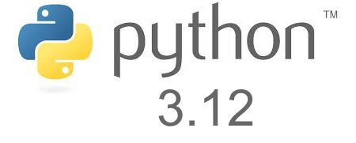
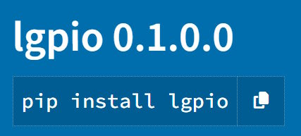
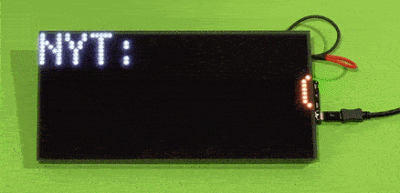
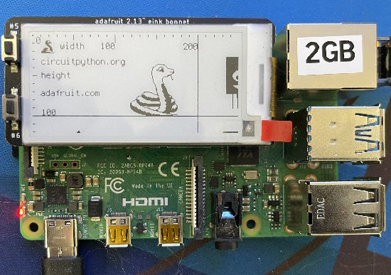
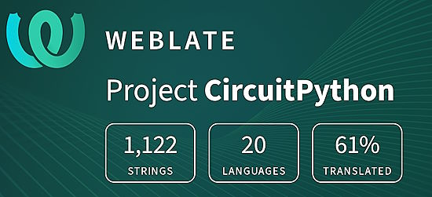

- [ ] Library and info updates
- [ ] change date
- [ ] update title
- [ ] Feature story
- [ ] Update  for images
- [ ] Update ICYDNCI
- [ ] All images 550w max only
- [ ] Link "View this email in your browser."

News Sources

- Twitter: [CircuitPython](https://twitter.com/search?q=circuitpython&src=typed_query&f=live), [MicroPython](https://twitter.com/search?q=micropython&src=typed_query&f=live) and [Python](https://twitter.com/search?q=python&src=typed_query)
- Mastodon [CircuitPython](https://octodon.social/tags/CircuitPython) and [MicroPython](https://octodon.social/tags/MicroPython)
- [python.org](https://www.python.org/)
- [Python Insider - dev team blog](https://pythoninsider.blogspot.com/)
- [MicroPython Meetup Blog](https://melbournemicropythonmeetup.github.io/)
- [hackaday.io newest projects MicroPython](https://hackaday.io/projects?tag=micropython&sort=date) and [CircuitPython](https://hackaday.io/projects?tag=circuitpython&sort=date)
- [hackaday CircuitPython](https://hackaday.com/blog/?s=circuitpython) and [MicroPython](https://hackaday.com/blog/?s=micropython)
- [hackster.io CircuitPython](https://www.hackster.io/search?q=circuitpython&i=projects&sort_by=most_recent) and [MicroPython](https://www.hackster.io/search?q=micropython&i=projects&sort_by=most_recent)
- [https://opensource.com/tags/python](https://opensource.com/tags/python)
- [Raspberry Pi News](https://www.raspberrypi.com/news/)
- Check Issues and PRs for input

View this email in your browser. **Warning: Flashing Imagery**

Welcome to the latest Python on Microcontrollers newsletter! *insert 2-3 sentences from editor (what's in overview, banter)* - *Anne Barela, Ed.*

We're on [Discord](https://discord.gg/HYqvREz), [Twitter](https://twitter.com/search?q=circuitpython&src=typed_query&f=live), and for past newsletters - [view them all here](https://www.adafruitdaily.com/category/circuitpython/). If you're reading this on the web, [subscribe here](https://www.adafruitdaily.com/). Here's the news this week:

## Headline

text - [site](url).

## Python 3.12.0 Final Released

Python 3.12 final is now out – [Python.org](https://www.python.org/downloads/release/python-3120/).

**New features**

* More flexible f-string parsing, allowing many things previously disallowed (PEP 701).
* Support for the buffer protocol in Python code (PEP 688).
* A new debugging/profiling API (PEP 669).
* Support for isolated subinterpreters with separate Global Interpreter Locks (PEP 684).
* Even more improved error messages. More exceptions potentially caused by typos now make suggestions to the user.
* Support for the Linux perf profiler to report Python function names in traces.
* Many large and small performance improvements (like PEP 709 and support for the BOLT binary optimizer), delivering an estimated 5% overall performance improvement.

## Open Hardware Summit 2024 - Call for Proposals

The Open Hardware Summit is the annual conference organized by the [Open Source Hardware Association](http://oshwa.org/), a 501(c)(3) not for profit charity. It is the world’s first comprehensive conference on open hardware; a venue and community in which we discuss and draw attention to the rapidly growing Open Source Hardware movement.

Speakers include world renowned leaders from industry, academia, the arts and maker community. Talks cover a wide range of subjects from electronics, mechanics to related fields such as digital fabrication, fashion technology, self-quantification devices, and IP law. As a microcosm of the Open Source Hardware community, the Summit provides an annual friendly forum for the community.

[Tentative dates](https://bsky.app/profile/arturo182.bsky.social/post/3kavywd4lqm2s) are April 26th and 27th. Livestream and remote talks will be permmitted.

OSHWA is officially on the prowl for wonderful talks, workshops and exhibitions for Open Hardware Summit 2024 in Montreal! Fill out the call for proposals form and toss your hat in the ring to make OHS2024 extra cool and fun! - [2024.oshwa.org](https://2024.oshwa.org/), [Proposal Form](https://docs.google.com/forms/d/e/1FAIpQLSc-8r3w-DiqwWqFqWsyHccnoFcdGer9MyD0XM4isXenHe50rQ/viewform).

## Feature

text - [site](url).

## lgpio - a Python module which allows control of GPIO on a Linux SBC

lgpio is a module for Linux Single Board Computers (SBC) which allows control of the General Purpose Input Outputs (GPIO). It comes with C and Python bindings and is installable via PyPI - [abyz.me.uk](http://abyz.me.uk/lg/index.html).

**Features**

* reading and writing GPIO singly and in groups
* software timed PWM and waves
* GPIO callbacks
* pipe notification of GPIO alerts
* I2C wrapper
* SPI wrapper
* serial link wrapper

## Hacktoberfest 10 is Here

This year marks the 10th anniversary of Hacktoberfest! Hacktoberfest has grown from 676 participants in 2014 to nearly 147,000 participants last year - [Hacktoberfest](https://hacktoberfest.com/).

What is Hacktoberfest? 

> "Join forces in virtual and in-person events to get your project's pull/merge requests done as a team, learn new skills, and meet lifelong friends. This year we’re partnering with Major League Hacking to help the community connect. Open source projects, maintained by community-minded coders, make the modern internet function. Supporting that essential work, and the folks behind it, is what Hacktoberfest is all about."

As in previous years, CircuitPython will be participating in Hacktoberfest, marking some pull requests as Hacktober eligible. The list of issues is [here](https://circuitpython.org/contributing/open-issues?label=hacktoberfest). More info - [Adafruit Blog](https://blog.adafruit.com/2023/09/22/participate-in-hacktoberfest-2023-circuitpython-hacktoberfest-github-digitalocean/).

Note the reward system is shifting from T-shirts to virtual rewards - [Hacktoberfest Rewards](https://hacktoberfest.com/about/#digital-rewards).

## Feature

text - [site](url).

## This Week's Python Streams

Python on Hardware is all about building a cooperative ecosphere which allows contributions to be valued and to grow knowledge. Below are the streams within the last week focusing on the community.

**CircuitPython Deep Dive Stream**

[Last Friday](link), Scott streamed work on {subject}.

You can see the latest video and past videos on the Adafruit YouTube channel under the Deep Dive playlist - [YouTube](https://www.youtube.com/playlist?list=PLjF7R1fz_OOXBHlu9msoXq2jQN4JpCk8A).

**CircuitPython Parsec**

John Park’s CircuitPython Parsec this week is on {subject} - [Adafruit Blog](link) and [YouTube](link).

Catch all the episodes in the [YouTube playlist](https://www.youtube.com/playlist?list=PLjF7R1fz_OOWFqZfqW9jlvQSIUmwn9lWr).

## Project of the Week

text - [site](url).

## News from around the web!

text - [site](url).

text - [site](url).

text - [site](url).

text - [site](url).

text - [site](url).

text - [site](url).

text - [site](url).

text - [site](url).

text - [site](url).

text - [site](url).

text - [site](url).

text - [site](url).

text - [site](url).

text - [site](url).

text - [site](url).

text - [site](url).

text - [site](url).

text - [site](url).

PyDev of the Week: Sarah Boyce on [Mouse vs Python](https://www.blog.pythonlibrary.org/2023/10/02/pydev-of-the-week-sarah-boyce/).

CircuitPython Weekly Meeting for October 2, 2023 ([notes](https://github.com/adafruit/adafruit-circuitpython-weekly-meeting/blob/main/2023/2023-10-02.md)) [on YouTube](https://youtu.be/zPS2fC6E_8g).

#ICYDNCI What was the most popular, most clicked link, in [last week's newsletter](https://www.adafruitdaily.com/2023/10/02/python-on-microcontrollers-newsletter-the-raspberry-pi-5-announced-python-survey-results-and-more-circuitpython-python-micropython-thepsf-raspberry_pi/)? [Free Book: Research Software Engineering with Python](https://merely-useful.tech/py-rse/).

## Coming Soon / New

text - [site](url).

text - [site](url).

## New Boards Supported by CircuitPython

The number of supported microcontrollers and Single Board Computers (SBC) grows every week. This section outlines which boards have been included in CircuitPython or added to [CircuitPython.org](https://circuitpython.org/).

This week, there were (#/no) new boards added!

- [Board name](url)
- [Board name](url)
- [Board name](url)

*Note: For non-Adafruit boards, please use the support forums of the board manufacturer for assistance, as Adafruit does not have the hardware to assist in troubleshooting.*

Looking to add a new board to CircuitPython? It's highly encouraged! Adafruit has four guides to help you do so:

- [How to Add a New Board to CircuitPython](https://learn.adafruit.com/how-to-add-a-new-board-to-circuitpython/overview)
- [How to add a New Board to the circuitpython.org website](https://learn.adafruit.com/how-to-add-a-new-board-to-the-circuitpython-org-website)
- [Adding a Single Board Computer to PlatformDetect for Blinka](https://learn.adafruit.com/adding-a-single-board-computer-to-platformdetect-for-blinka)
- [Adding a Single Board Computer to Blinka](https://learn.adafruit.com/adding-a-single-board-computer-to-blinka)

## New Learn Guides!

[RGB Matrix New York Times Title Scroller](https://learn.adafruit.com/rgb-matix-nyt-text-scroller) from [Trevor Beaton](https://learn.adafruit.com/u/Seekwill)

[LED Matrix Sports Scoreboard](https://learn.adafruit.com/led-matrix-sports-scoreboard) from [Liz Clark](https://learn.adafruit.com/u/BlitzCityDIY)

## CircuitPython Libraries!

The CircuitPython library numbers are continually increasing, while existing ones continue to be updated. Here we provide library numbers and updates!

To get the latest Adafruit libraries, download the [Adafruit CircuitPython Library Bundle](https://circuitpython.org/libraries). To get the latest community contributed libraries, download the [CircuitPython Community Bundle](https://circuitpython.org/libraries).

If you'd like to contribute to the CircuitPython project on the Python side of things, the libraries are a great place to start. Check out the [CircuitPython.org Contributing page](https://circuitpython.org/contributing). If you're interested in reviewing, check out Open Pull Requests. If you'd like to contribute code or documentation, check out Open Issues. We have a guide on [contributing to CircuitPython with Git and GitHub](https://learn.adafruit.com/contribute-to-circuitpython-with-git-and-github), and you can find us in the #help-with-circuitpython and #circuitpython-dev channels on the [Adafruit Discord](https://adafru.it/discord).

You can check out this [list of all the Adafruit CircuitPython libraries and drivers available](https://github.com/adafruit/Adafruit_CircuitPython_Bundle/blob/master/circuitpython_library_list.md). 

The current number of CircuitPython libraries is **449**!

**Updated Libraries!**

Here's this week's updated CircuitPython libraries:

  * [adafruit/Adafruit_CircuitPython_SSD1680](https://github.com/adafruit/Adafruit_CircuitPython_SSD1680)
  * [adafruit/Adafruit_CircuitPython_Simple_Text_Display](https://github.com/adafruit/Adafruit_CircuitPython_Simple_Text_Display)
  * [furbrain/CircuitPython_mag_cal](https://github.com/furbrain/CircuitPython_mag_cal)
  * [jepler/Jepler_CircuitPython_udecimal](https://github.com/jepler/Jepler_CircuitPython_udecimal)

**Library PyPI Weekly Download Stats**

**Total Library Stats**

  * 116600 PyPI downloads over 313 libraries

**Top 10 Libraries by PyPI Downloads**

  * Adafruit CircuitPython Requests (adafruit-circuitpython-requests): 9337
  * Adafruit CircuitPython BusDevice (adafruit-circuitpython-busdevice): 7237
  * Adafruit CircuitPython Register (adafruit-circuitpython-register): 3143
  * Adafruit CircuitPython Motor (adafruit-circuitpython-motor): 1664
  * Adafruit CircuitPython NeoPixel (adafruit-circuitpython-neopixel): 1662
  * Adafruit CircuitPython ServoKit (adafruit-circuitpython-servokit): 1553
  * Adafruit CircuitPython PCA9685 (adafruit-circuitpython-pca9685): 1538
  * Adafruit CircuitPython Pixelbuf (adafruit-circuitpython-pixelbuf): 1170
  * Adafruit CircuitPython ADS1x15 (adafruit-circuitpython-ads1x15): 1109
  * Adafruit CircuitPython DHT (adafruit-circuitpython-dht): 1086

## What’s the CircuitPython team up to this week?

What is the team up to this week? Let’s check in!

**Dan**

Last week I continued to work on the MicroPython v1.20.0 merge. I'm going through the ports, picking representative boards, and getting them to compile. Most of the errors I'm seeing are simple errors from the merge and needed updates.

We dropped building Version 7.x bundles a few days ago. I updated the circup utility to take note of this.

**Melissa**

This past week, I added eInk support to Blinka `displayio` so that even more projects can be run on Blinka. This can be used instead of the `Adafruit_CircuitPython_EPD` library that the guides have been recommending for the past few years.

**Tim**

This week I've been working on enhancing the automated library release utility to make it less hardcoded and more generally useful in cases that aren't the exact same type of patch that was recently rolled out which it was originally made for. I've also submitted some old kits to OSHWA for certification. Lastly I submitted the first device simpletest script that we discussed during the meeting a few weeks back.

**Scott**

This past week I've been diving into CircuitPython's memory allocation mechanics. It was prompted by crashes I saw when [re-enabling `rgbmatrix` on ESP IDF 5.1](https://github.com/adafruit/circuitpython/pull/8447). `rgbmatrix` does allocations for the underlying Protomatter library. It does this using the existing supervisor memory manager. The manager's responsibility is to allocate memory in the VM heap when the VM is running and then move and consolidate it when the VM finishes. Moving memory is the problem because Protomatter expects its memory to stay in the same place. We [work around it](https://github.com/adafruit/circuitpython/pull/8446) by reinitializing Protomatter after memory is moved. This isn't perfect because Protomatter may still use it after the memory is moved but it hasn't been reinitialized.

So, after brainstorming and talking with other folks, we've decided to remove the supervisor memory management in favor of using a traditional heap in combination with MicroPython's new split heap functionality. This will allow us to allocate memory outside the VM even when the VM is running (assuming it hasn't used up all memory) and *not* have to move it after the VM is done. On ports like ESP32 where the vendor SDK already has a heap, we'll just reuse that. MicroPython [just started doing this](https://github.com/micropython/micropython/pull/12141). Thanks to the MicroPython folks for the new capabilities we'll use in CircuitPython 9!

**Liz**

This week I worked on some code for an upcoming project with the Ruiz brothers. It is a prop project to recreate the Fraz Wrench from the Five Nights at Freddy's games. The code is written in CircuitPython and runs on the RP2040 Prop-Maker Feather. Sound effects from the game are played through the I2S amp and various messages are shown on an LCD character display. The wrench is used to solve puzzles in the game so there is a puzzle mode in the code. In that mode, the LCD shows random letters and numbers on it. To do this, I wrote a function that randomly generates a string to show on both lines of the LCD. I hope this project will be another fun CircuitPython prop example for folks.

## Upcoming Events!

Maker Faire Bay Area will be October 13-15 & October 20-22, 2023 - [Eventbright](https://www.eventbrite.com/e/maker-faire-bay-area-october-13-15-october-20-22-2023-tickets-673771979127).

The next MicroPython Meetup in Melbourne will be on October 25th – [Meetup](https://www.meetup.com/micropython-meetup/events). 

Hackaday has announced that the Hackaday Supercon is on for 2023, and will be taking place November 3 – 5 in Pasadena, California, USA - [Adafruit Blog](https://blog.adafruit.com/2023/05/10/hackaday-supercon-2023-is-on-supercon-hackaday/) and [Hackaday](https://hackaday.com/2023/05/10/supercon-2023-is-on-we-want-you/).

The inaugural PyLadies Conference will take place December 1-3, 2023 - [pretalx](https://pretalx.com/pyladiescon-2023/cfp).

The Pyjamas Conference, the 24-hour online Python conference, will be returning for a fifth year on December 9-10.

**Send Your Events In**

If you know of virtual events or upcoming events, please let us know via email to cpnews(at)adafruit(dot)com.

## Latest Releases

CircuitPython's stable release is [8.2.6](https://github.com/adafruit/circuitpython/releases/latest). New to CircuitPython? Start with our [Welcome to CircuitPython Guide](https://learn.adafruit.com/welcome-to-circuitpython).

[20231003](https://github.com/adafruit/Adafruit_CircuitPython_Bundle/releases/latest) is the latest Adafruit CircuitPython library bundle.

[20231004](https://github.com/adafruit/CircuitPython_Community_Bundle/releases/latest) is the latest CircuitPython Community library bundle.

[v1.20..0](https://micropython.org/download) is the latest MicroPython release. Documentation for it is [here](http://docs.micropython.org/en/latest/pyboard/).

[3.12.0](https://www.python.org/downloads/) is the latest Python release.

[3,675 Stars](https://github.com/adafruit/circuitpython/stargazers) Like CircuitPython? [Star it on GitHub!](https://github.com/adafruit/circuitpython)

## Call for Help -- Translating CircuitPython is now easier than ever!

One important feature of CircuitPython is translated control and error messages. With the help of fellow open source project [Weblate](https://weblate.org/), we're making it even easier to add or improve translations. 

Sign in with an existing account such as GitHub, Google or Facebook and start contributing through a simple web interface. No forks or pull requests needed! As always, if you run into trouble join us on [Discord](https://adafru.it/discord), we're here to help.

## NUMBER Thanks!

The Adafruit Discord community, where we do all our CircuitPython development in the open, reached over NUMBER humans - thank you! Adafruit believes Discord offers a unique way for Python on hardware folks to connect. Join today at [https://adafru.it/discord](https://adafru.it/discord).

## ICYMI - In case you missed it

Python on hardware is the Adafruit Python video-newsletter-podcast! The news comes from the Python community, Discord, Adafruit communities and more and is broadcast on ASK an ENGINEER Wednesdays. The complete Python on Hardware weekly videocast [playlist is here](https://www.youtube.com/playlist?list=PLjF7R1fz_OOXRMjM7Sm0J2Xt6H81TdDev). The video podcast is on [iTunes](https://itunes.apple.com/us/podcast/python-on-hardware/id1451685192?mt=2), [YouTube](http://adafru.it/pohepisodes), [Instagram Reels](https://www.instagram.com/adafruit/channel/)), and [XML](https://itunes.apple.com/us/podcast/python-on-hardware/id1451685192?mt=2).

[The weekly community chat on Adafruit Discord server CircuitPython channel - Audio / Podcast edition](https://itunes.apple.com/us/podcast/circuitpython-weekly-meeting/id1451685016) - Audio from the Discord chat space for CircuitPython, meetings are usually Mondays at 2pm ET, this is the audio version on [iTunes](https://itunes.apple.com/us/podcast/circuitpython-weekly-meeting/id1451685016), Pocket Casts, [Spotify](https://adafru.it/spotify), and [XML feed](https://adafruit-podcasts.s3.amazonaws.com/circuitpython_weekly_meeting/audio-podcast.xml).

## Contribute!

The CircuitPython Weekly Newsletter is a CircuitPython community-run newsletter emailed every Tuesday. The complete [archives are here](https://www.adafruitdaily.com/category/circuitpython/). It highlights the latest CircuitPython related news from around the web including Python and MicroPython developments. To contribute, edit next week's draft [on GitHub](https://github.com/adafruit/circuitpython-weekly-newsletter/tree/gh-pages/_drafts) and [submit a pull request](https://help.github.com/articles/editing-files-in-your-repository/) with the changes. You may also tag your information on Twitter with #CircuitPython. 

Join the Adafruit [Discord](https://adafru.it/discord) or [post to the forum](https://forums.adafruit.com/viewforum.php?f=60) if you have questions.
