- [ ] Library and info updates
- [ ] change date
- [ ] update title
- [ ] Feature story
- [ ] Update  for images
- [ ] Update ICYDNCI
- [ ] All images 550w max only
- [ ] Link "View this email in your browser."

News Sources

- Twitter: [CircuitPython](https://twitter.com/search?q=circuitpython&src=typed_query&f=live), [MicroPython](https://twitter.com/search?q=micropython&src=typed_query&f=live) and [Python](https://twitter.com/search?q=python&src=typed_query)
- Mastodon [CircuitPython](https://octodon.social/tags/CircuitPython) and [MicroPython](https://octodon.social/tags/MicroPython)
- [python.org](https://www.python.org/)
- [Python Insider - dev team blog](https://pythoninsider.blogspot.com/)
- [MicroPython Meetup Blog](https://melbournemicropythonmeetup.github.io/)
- [hackaday.io newest projects MicroPython](https://hackaday.io/projects?tag=micropython&sort=date) and [CircuitPython](https://hackaday.io/projects?tag=circuitpython&sort=date)
- [hackaday CircuitPython](https://hackaday.com/blog/?s=circuitpython) and [MicroPython](https://hackaday.com/blog/?s=micropython)
- [hackster.io CircuitPython](https://www.hackster.io/search?q=circuitpython&i=projects&sort_by=most_recent) and [MicroPython](https://www.hackster.io/search?q=micropython&i=projects&sort_by=most_recent)
- [https://opensource.com/tags/python](https://opensource.com/tags/python)
- [Raspberry Pi News](https://www.raspberrypi.com/news/)
- Check Issues and PRs for input

View this email in your browser. **Warning: Flashing Imagery**

Welcome to the latest Python on Microcontrollers newsletter! *insert 2-3 sentences from editor (what's in overview, banter)* - *Anne Barela, Ed.*

We're on [Discord](https://discord.gg/HYqvREz), [Twitter](https://twitter.com/search?q=circuitpython&src=typed_query&f=live), and for past newsletters - [view them all here](https://www.adafruitdaily.com/category/circuitpython/). If you're reading this on the web, [subscribe here](https://www.adafruitdaily.com/). Here's the news this week:

## Raspberry Pi 5 Capabilities Emerge

[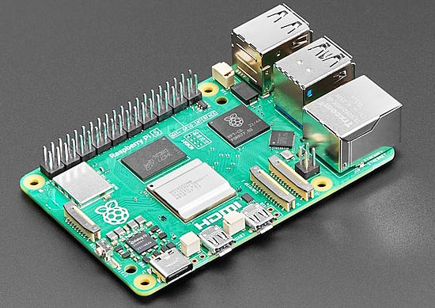](https://www.raspberrypi.com/news/)

Each week, more information is released on the Raspberry 5 single board computer (SBC). Here is this week's crop of interesting tidbits. 

### Raspberry Pi 5 Benchmarks

A number of folks have been benchmarking the Raspberry Pi 5 using various test suites and operating systems. A roundup of several tests - [Raspberry Pi](https://www.raspberrypi.com/news/benchmarking-raspberry-pi-5/).

### GPIO Handling Differences on the Raspberry Pi 5

On Raspberry Pi single board computers prior to Raspberry Pi 5, all GPIO was memory mapped. Accessing a pin was accessing a location in the processor address space. Most software libraries used the memory mapped access technique. With the Raspberry Pi 5, the new RP1 bridge chip handles the GPIO pins. This means they are no longer mapped to the processor's memory. This may break software using older techniques.

In the Raspberry Pi documentation, they refer to the GPIO Zero library as able to properly access the GPIO pins on a Raspberry Pi 5.

GPIO Zero - [Raspberry Pi](https://www.raspberrypi.com/documentation/computers/os.html#gpio-in-python) and [PDF book on GPIO Zero (free)](https://github.com/raspberrypipress/released-pdfs/raw/main/simple-electronics-with-gpio-zero.pdf).

### RP1 Draft Datasheet Available

A draft copy of the RP1 datasheet is now available from Raspberry Pi with registers and offsets to access various peripherals - [Raspberry Pi](https://datasheets.raspberrypi.com/rp1/rp1-peripherals.pdf). Hackaday also has an article :Why the RP1 is the most important product Raspberry Pi has ever made" - [Hackaday](https://hackaday.com/2023/10/16/why-the-rp1-is-the-most-important-product-raspberry-pi-have-ever-made/).

### Image Processing on Raspberry Pi 5

Raspberry Pi 5 handles image processing very differently from its predecessors. A new hardware ISP (image signal processor) facilitates imaging, built partly into the chip RP1 but mostly into Raspberry Pi 5‘s Broadcom BCM2712 application processor - [Raspberry Pi](https://www.raspberrypi.com/news/image-processing-on-raspberry-pi-5-our-new-hardware-image-signal-processor/).

### Google Coral USB Accelerator on Raspberry Pi Bookworm

Google [Coral USB Accelerator](https://coral.ai/docs/accelerator/get-started) currently doesn't work on Raspberry Pi OS Bookworm. In order to get the USB accelerator to work, one needs to do a few extra things like install Python 3.9 and create a Python virtual environment - [Adafruit Playground](https://adafruit-playground.com/u/bdsvac/pages/google-coral-usb-accelerator-on-raspberry-pi-bookworm).

## CircuitPython 8.2.7 Released

CircuitPython 8.2.7 is the latest bugfix revision of CircuitPython and is a new stable release - [Adafruit Blog](https://blog.adafruit.com/2023/10/19/circuitpython-8-2-7-released/) and [GitHub](https://github.com/adafruit/circuitpython/releases/tag/8.2.7).

**Notable changes to 8.2.7 since 8.2.6**

* Improve RGBMatrix memory allocation tracking to prevent leaks.
* Reset MDNS after turning off WiFi.
* Three new boards.

## A Pocket MicroPython Calculator with Hidden Capabilities

[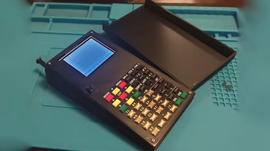](https://www.hackster.io/news/angel-cabello-s-galdeano-handheld-is-a-pocket-micropython-calculator-with-hidden-capabilities-00e10207dc21)

Angel Cabello's Galdeano Handheld is a pocket MicroPython calculator with hidden capabilities. Designed after dissatisfaction with commercial calculators, this Espressif ESP32-powered handheld has secrets to share, such as being an Internet of Things (IoT) control system - [hackster.io](https://www.hackster.io/news/angel-cabello-s-galdeano-handheld-is-a-pocket-micropython-calculator-with-hidden-capabilities-00e10207dc21) and [YouTube](https://youtu.be/FbEnjJ8u0y4).

## Nordic Unveils Its nRF54L15 Cortex-M33 wireless MCU

[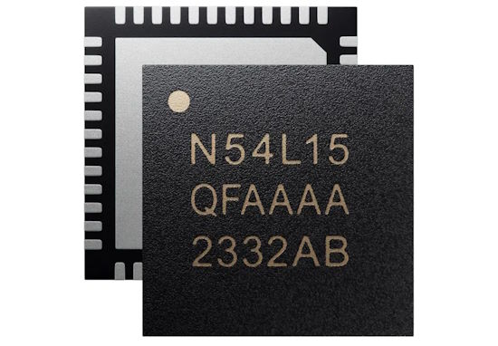](https://www.cnx-software.com/2023/10/16/nordic-nrf54l15-cortex-m33-wireless-mcu-halves-rx-power-consumption-over-nrf52-chips/)

Nordic Semiconductor has recently unveiled the 128 MHz nRF54L15 Cortex-M33 multi-protocol wireless microcontroller, the first from the nRF54L Series, and the second from the wider nRF54 family after the more powerful 320 MHz nRF54H20 dual-core Cortex-M33 MCU was introduced last Spring. The new nRF54L15 aims to be an upgrade to the nRF52 series with twice the performance and much better power efficiency: half the Rx power consumption over its predecessor - [CNX Software](https://www.cnx-software.com/2023/10/16/nordic-nrf54l15-cortex-m33-wireless-mcu-halves-rx-power-consumption-over-nrf52-chips/) and [YouTube](https://youtu.be/XG8bRNaNHrg).

## Post Your Projects for Free on Adafruit Playground

Adafruit publishes free guides in its Adafruit Learning System. Now, using the same technoogy, you can post your own mini guides with the same look & feel on adafruit-playground.com for free. At [adafruit-playground.com](https://adafruit-playground.com/) you can find a bunch of community guides. And you can click the right-hand "My Playground link to create your own notes. Have a project, a how-to, or documentation on that knarly Raspberry Pi issue you found a solution to? Post them on Adafruit Playground and share the URL with the world! - [Adafruit Learning System](https://learn.adafruit.com/adafruit-playground-notes).

## Qualcomm and Google Expand Agreement On RISC-V Snapdragon Wear Platform

Qualcomm and Google announced that they had agreed to expand their partnership to development of a Snapdragon Wear platform based on the RISC-V instruction set architecture (ISA) designed for next-generation [Wear OS](https://wearos.google.com/) products - [Tom's Hardware](https://www.tomshardware.com/news/qualcomm-adopts-risc-v-for-next-gen-snapdragon-wear-platform).

## feature

text - [site](url).

## This Week's Python Streams

Python on Hardware is all about building a cooperative ecosphere which allows contributions to be valued and to grow knowledge. Below are the streams within the last week focusing on the community.

**CircuitPython Deep Dive Stream**

[Last Friday](link), Scott streamed work on {subject}.

You can see the latest video and past videos on the Adafruit YouTube channel under the Deep Dive playlist - [YouTube](https://www.youtube.com/playlist?list=PLjF7R1fz_OOXBHlu9msoXq2jQN4JpCk8A).

**CircuitPython Parsec**

John Park’s CircuitPython Parsec this week is on {subject} - [Adafruit Blog](link) and [YouTube](link).

Catch all the episodes in the [YouTube playlist](https://www.youtube.com/playlist?list=PLjF7R1fz_OOWFqZfqW9jlvQSIUmwn9lWr).

## Project of the Week: A NeoPixel-lit Elvis Cape

[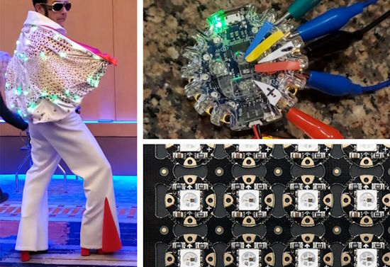](https://adafruit-playground.com/u/hotsharptoxic/pages/elvis-cape-with-40-neopixels-and-circuitpython)

Adafruit Playground user hotsharptoxic shares a guide on adding 40 programmable lights to an off-the-shelf Elvis costume. "NeoPixels and CircuitPython made this easy. Wiring it up took a few hours" - [Adafruit Playground](https://adafruit-playground.com/u/hotsharptoxic/pages/elvis-cape-with-40-neopixels-and-circuitpython).

## News from around the web!

[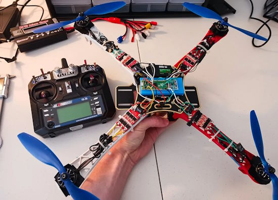](https://timhanewich.medium.com/taking-flight-with-the-raspberry-pi-pico-micropython-diy-quadcopter-drone-61ed4f7ee746)

Taking flight with a Raspberry Pi Pico and MicroPython DIY quadcopter drone - [Medium](https://timhanewich.medium.com/taking-flight-with-the-raspberry-pi-pico-micropython-diy-quadcopter-drone-61ed4f7ee746) and [Adafruit Blog](https://blog.adafruit.com/2023/10/16/raspberry-pi-pico-micropython-diy-quadcopter-drone-raspberrypi-rp2040-raspberry_pi-timhanewich/).

[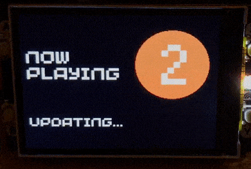](https://twitter.com/simon_prickett/status/1715072814187762043)

Display the current song and artist from a configurable set of BBC radio stations.  It uses MicroPython and the Pimoroni Pico Display Pack 2 for the Raspberry Pi Pico W - [X](https://twitter.com/simon_prickett/status/1715072814187762043) and [GitHub](https://github.com/simonprickett/pico-display-pack-2-radio-whats-on).

M5Stack's Cardputer Kit puts a microcontroller-powered microcomputer in your pocket — for under $30. Powered by an Espressif ESP32-S3, this compact computer includes a tiny color TFT, sound capabilities, and a working keyboard - [hackster.io](https://www.hackster.io/news/m5stack-s-cardputer-kit-puts-a-microcontroller-powered-microcomputer-in-your-pocket-for-under-30-ef6896036fd3).

[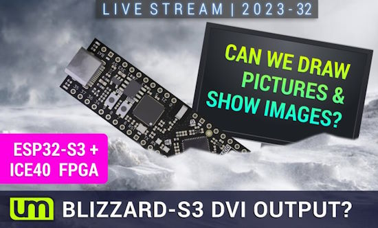](https://www.youtube.com/watch?v=0r1SKhGT7Mw)

Unexpected Maker livestream to hack away in CircuitPython on a Blizzard-S3 to see more than a lorikeet output on a monitor - [YouTube](https://www.youtube.com/watch?v=0r1SKhGT7Mw) via [X](https://twitter.com/unexpectedmaker/status/1714221201089085908).

[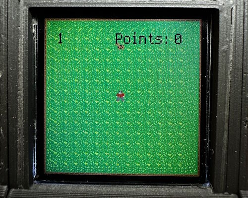](https://twitter.com/oakdevtech/status/1713294954104238091)

Last week, we featured Oak Dev Tech's KeyBoy handheld game. Now it has a snake game, but the twist is it chases cows. Programmed in CircuitPython - [X](https://twitter.com/oakdevtech/status/1713294954104238091).

[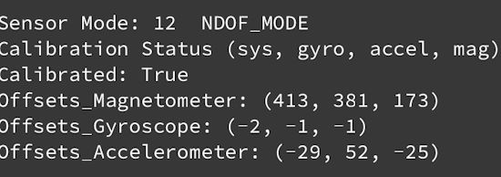](https://adafruit-playground.com/u/CGrover/pages/bno055-sensor-calibration-and-tap-detection)

BNO055 sensor calibration and tap detection in CircuitPython - [Adafruit Playground](https://adafruit-playground.com/u/CGrover/pages/bno055-sensor-calibration-and-tap-detection).

Les Pounder demonstrates use of the Pimoroni PicoVision, adding a Tom's Hardware Pi Cast screen and bouncing happer logo - [X](https://twitter.com/biglesp/status/1715069528709763418).

Porting CPython's Template class to MicroPython - [X](https://twitter.com/JeffersGlass/status/1714438532897374567) and [GitHub](https://github.com/JeffersGlass/mp-templates).

text - [site](url).

text - [site](url).

[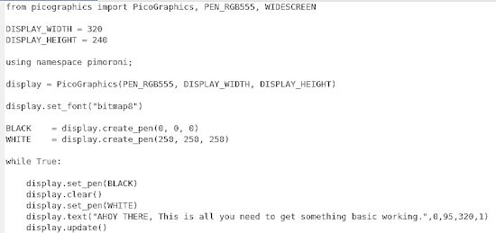](https://twitter.com/iamhodgy/status/1714772250996437321)

If you have a Pimoroni PicoVision and are using MicroPython, these few lines of code will get you started - [X](https://twitter.com/iamhodgy/status/1714772250996437321) and [GitHub](https://github.com/technolhodgy/picovision-demos/blob/main/micropython/basics.py).

Kevin McAleer's stream on Raspberry Pi 5 Projects you have to make - [YouTube](https://www.youtube.com/watch?v=dfquulcbD7M) via [X](https://twitter.com/kevsmac/status/1713463172487688502?t=34eFFNbG8aV96SfCaT3eoA&s=03).

text - [site](url).

text - [site](url).

text - [site](url).

[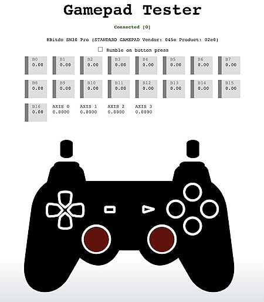](https://twitter.com/RobertDaleSmith/status/1713606901177438211?t=uudIMHVHIHlrKN3e35Qnhg&s=03)

A USB/Bluetooth gamepad tester free at [test.controlleradapter.com](https://test.controlleradapter.com/) - [X](https://twitter.com/RobertDaleSmith/status/1713606901177438211?t=uudIMHVHIHlrKN3e35Qnhg&s=03).

text - [site](url).

Real Python podcast: Building Python Best Practices and Fundamental Skills - [Real Python](https://realpython.com/podcasts/rpp/176/).

PyDev of the Week: Pradeep Kumar Srinivasan on [Mouse vs Python](https://www.blog.pythonlibrary.org/2023/10/09/pydev-of-the-week-pradeep-kumar-srinivasan/).

CircuitPython Weekly Meeting for October 16, 2023 ([notes](https://github.com/adafruit/adafruit-circuitpython-weekly-meeting/blob/main/2023/2023-10-16.md)) [on YouTube](https://youtu.be/RA4vVJrvXPU).

**#ICYDNCI What was the most popular, most clicked link, in [last week's newsletter](https://link)? [How Not to Build a Custom RP2040 Dev Board](https://embeddedcomputing.com/technology/open-source/development-kits/how-not-to-build-a-custom-rp2040-dev-board).**

## New

[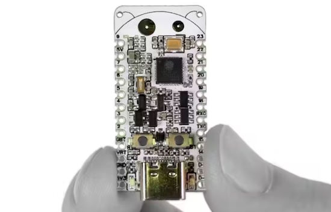](https://www.hackster.io/news/prokyber-s-esp32-c6-bug-is-a-compact-risc-v-dev-board-for-iot-projects-with-matter-and-more-62768b0c266c)

Prokyber's ESP32-C6-Bug is a compact RISC-V dev board for IoT projects. The ESP32-C6 stand out: it's Espressif's first part to offer IEEE 802.11ax Wi-Fi 6 support on the 2.4GHz band. The radio functionality also includes Bluetooth 5.0 Low Energy (BLE) and IEEE 802.15.4 with Zigbee and Thread support — as well as compliance with the cross-vendor Matter standard - [hackster.io](https://www.hackster.io/news/prokyber-s-esp32-c6-bug-is-a-compact-risc-v-dev-board-for-iot-projects-with-matter-and-more-62768b0c266c).

text - [site](url).

## New Boards Supported by CircuitPython

The number of supported microcontrollers and Single Board Computers (SBC) grows every week. This section outlines which boards have been included in CircuitPython or added to [CircuitPython.org](https://circuitpython.org/).

This week, there were (#/no) new boards added:

- [Board name](url)
- [Board name](url)
- [Board name](url)

*Note: For non-Adafruit boards, please use the support forums of the board manufacturer for assistance, as Adafruit does not have the hardware to assist in troubleshooting.*

Looking to add a new board to CircuitPython? It's highly encouraged! Adafruit has four guides to help you do so:

- [How to Add a New Board to CircuitPython](https://learn.adafruit.com/how-to-add-a-new-board-to-circuitpython/overview)
- [How to add a New Board to the circuitpython.org website](https://learn.adafruit.com/how-to-add-a-new-board-to-the-circuitpython-org-website)
- [Adding a Single Board Computer to PlatformDetect for Blinka](https://learn.adafruit.com/adding-a-single-board-computer-to-platformdetect-for-blinka)
- [Adding a Single Board Computer to Blinka](https://learn.adafruit.com/adding-a-single-board-computer-to-blinka)

## New Learn Guides!

[Faz-Wrench - Five Nights at Freddy's](https://learn.adafruit.com/faz-wrench) from [Ruiz Brothers](https://learn.adafruit.com/u/pixil3d)

[Bricktunes: LEGO Synthesizer Glove](https://learn.adafruit.com/bricktunes-lego-glove-synthesizer) from [John Park](https://learn.adafruit.com/u/johnpark)

[No-Code WipperSnapper Summoning Horn](https://learn.adafruit.com/adafruit-io-wippersnapper-summoning-horn) from [Tyeth Gundry](https://learn.adafruit.com/u/tyeth)

## Updated Learn Guides!

[title](url) from [name](url)

## CircuitPython Libraries!

The CircuitPython library numbers are continually increasing, while existing ones continue to be updated. Here we provide library numbers and updates!

To get the latest Adafruit libraries, download the [Adafruit CircuitPython Library Bundle](https://circuitpython.org/libraries). To get the latest community contributed libraries, download the [CircuitPython Community Bundle](https://circuitpython.org/libraries).

If you'd like to contribute to the CircuitPython project on the Python side of things, the libraries are a great place to start. Check out the [CircuitPython.org Contributing page](https://circuitpython.org/contributing). If you're interested in reviewing, check out Open Pull Requests. If you'd like to contribute code or documentation, check out Open Issues. We have a guide on [contributing to CircuitPython with Git and GitHub](https://learn.adafruit.com/contribute-to-circuitpython-with-git-and-github), and you can find us in the #help-with-circuitpython and #circuitpython-dev channels on the [Adafruit Discord](https://adafru.it/discord).

You can check out this [list of all the Adafruit CircuitPython libraries and drivers available](https://github.com/adafruit/Adafruit_CircuitPython_Bundle/blob/master/circuitpython_library_list.md). 

The current number of CircuitPython libraries is **###**!

**New Libraries!**

Here's this week's new CircuitPython libraries:

* [library](url)

**Updated Libraries!**

Here's this week's updated CircuitPython libraries:

* [library](url)

**Library PyPI Weekly Download Stats**

## What’s the CircuitPython team up to this week?

What is the team up to this week? Let’s check in!

**Dan**

Scott and I finished the MicroPython v1.20.0 merge into CircuitPython last Monday. I immediately started on the v1.21.0 merge. The initial merging went quickly, and I'll be moving on to getting builds to compile.

There is a [problem](https://github.com/adafruit/circuitpython/issues/8449) with delayed disk writes with macOS Sonoma, which was recently released. There can be a delay of 10-20 seconds between data writes and the corresponding metadata writes. This causes CircuitPython to see the CIRCUITPY drive in an inconsistent state until the write finishes. It causes auto-reload to fail. I'll work on characterizing the problem and reporting it to Apple. Others have already done so, too. We encourage you to report it as well if it interferes with your work.

**Melissa**

This past week I continued to update the [Adafruit Qualia ESP32-S3 guide](https://learn.adafruit.com/adafruit-qualia-esp32-s3-for-rgb666-displays). I added content such as how to gather the timing information to use your own displays, touch display usage, and updated the page on extracting the init codes with an additional method.

**Tim**

This week I've been looking into an issue that resulted from a change in default behavior inside of ReadTheDocs when our documentation pages get built there. They used to install some modules automatically that we utilize, but no longer do. I've tested and submitted a patch that can be pushed out to the libraries to fix their docs builds moving forward. Aside from that I've been trying to update the PyGameDisplay library to work with the newest version of Blinka_DisplayIO, I've made progress but have incorrect colors coming out currently. 

**Scott**

This week we've been hard at work on CircuitPython 9.0.0. Dan and I [merged in MicroPython 1.20](https://github.com/adafruit/circuitpython/pull/8481). I [updated ARM GCC to 12.3](https://github.com/adafruit/circuitpython/pull/8485). I also [fixed and polished the silabs port](https://github.com/adafruit/circuitpython/pull/8484). Now I'm working to [split displayio into more modules so that device support can be enabled and disabled more precisely](https://github.com/adafruit/circuitpython/issues/7667). I'll also help with the MicroPython 1.21 merge as needed and then complete our transition to the auto-growing MP heap for CP 9.

**Liz**

This week I worked on a CircuitPython library for the HUSB238. This is the breakout for communicating with USB PD power supplies. I also started working on a CircuitPython library for the VCNL4020, the new STEMMA proximity sensor. I'm really enjoying working on libraries and am excited that I am contributing to CircuitPython more.

## Upcoming Events!

The next MicroPython Meetup in Melbourne will be on October 25th – [Meetup](https://www.meetup.com/micropython-meetup/events). The September Meetup recording - [X](https://twitter.com/matt_trentini/status/1713436531212623958?t=ft1e36MPJ10U6OdZyo5oBw&s=03) and [slides](https://docs.google.com/presentation/d/e/2PACX-1vR_SMao_UTt_Jd00iFrvA2wKjc_q-VgvKd-8hBZeJonScQ55hr0EcYNiKkS6cgTzdfC4DFqqAlGd5ue/pub?slide=id.p).

Hackaday has announced that the Hackaday Supercon is on for 2023, and will be taking place November 3 – 5 in Pasadena, California, USA - [Adafruit Blog](https://blog.adafruit.com/2023/05/10/hackaday-supercon-2023-is-on-supercon-hackaday/) and [Hackaday](https://hackaday.com/2023/05/10/supercon-2023-is-on-we-want-you/).

The inaugural PyLadies Conference will take place December 1-3, 2023 - [pretalx](https://pretalx.com/pyladiescon-2023/cfp).

The Pyjamas Conference, the 24-hour online Python conference, will be returning for a fifth year on December 9-10.

**Send Your Events In**

If you know of virtual events or upcoming events, please let us know via email to cpnews(at)adafruit(dot)com.

## Latest Releases

CircuitPython's stable release is [#.#.#](https://github.com/adafruit/circuitpython/releases/latest) and its unstable release is [#.#.#-##.#](https://github.com/adafruit/circuitpython/releases). New to CircuitPython? Start with our [Welcome to CircuitPython Guide](https://learn.adafruit.com/welcome-to-circuitpython).

[2023####](https://github.com/adafruit/Adafruit_CircuitPython_Bundle/releases/latest) is the latest Adafruit CircuitPython library bundle.

[2023####](https://github.com/adafruit/CircuitPython_Community_Bundle/releases/latest) is the latest CircuitPython Community library bundle.

[v#.#.#](https://micropython.org/download) is the latest MicroPython release. Documentation for it is [here](http://docs.micropython.org/en/latest/pyboard/).

[#.#.#](https://www.python.org/downloads/) is the latest Python release. The latest pre-release version is [#.#.#](https://www.python.org/download/pre-releases/).

[#,### Stars](https://github.com/adafruit/circuitpython/stargazers) Like CircuitPython? [Star it on GitHub!](https://github.com/adafruit/circuitpython)

## Call for Help -- Translating CircuitPython is now easier than ever!

[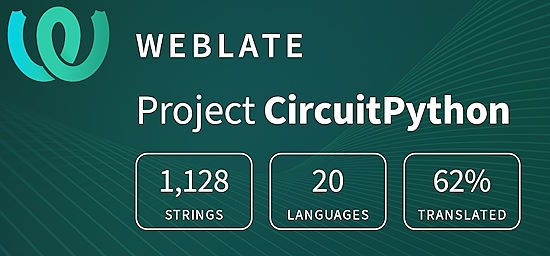](https://hosted.weblate.org/engage/circuitpython/)

One important feature of CircuitPython is translated control and error messages. With the help of fellow open source project [Weblate](https://weblate.org/), we're making it even easier to add or improve translations. 

Sign in with an existing account such as GitHub, Google or Facebook and start contributing through a simple web interface. No forks or pull requests needed! As always, if you run into trouble join us on [Discord](https://adafru.it/discord), we're here to help.

## NUMBER Thanks!

The Adafruit Discord community, where we do all our CircuitPython development in the open, reached over NUMBER humans - thank you! Adafruit believes Discord offers a unique way for Python on hardware folks to connect. Join today at [https://adafru.it/discord](https://adafru.it/discord).

## ICYMI - In case you missed it

Python on hardware is the Adafruit Python video-newsletter-podcast! The news comes from the Python community, Discord, Adafruit communities and more and is broadcast on ASK an ENGINEER Wednesdays. The complete Python on Hardware weekly videocast [playlist is here](https://www.youtube.com/playlist?list=PLjF7R1fz_OOXRMjM7Sm0J2Xt6H81TdDev). The video podcast is on [iTunes](https://itunes.apple.com/us/podcast/python-on-hardware/id1451685192?mt=2), [YouTube](http://adafru.it/pohepisodes), [Instagram Reels](https://www.instagram.com/adafruit/channel/)), and [XML](https://itunes.apple.com/us/podcast/python-on-hardware/id1451685192?mt=2).

[The weekly community chat on Adafruit Discord server CircuitPython channel - Audio / Podcast edition](https://itunes.apple.com/us/podcast/circuitpython-weekly-meeting/id1451685016) - Audio from the Discord chat space for CircuitPython, meetings are usually Mondays at 2pm ET, this is the audio version on [iTunes](https://itunes.apple.com/us/podcast/circuitpython-weekly-meeting/id1451685016), Pocket Casts, [Spotify](https://adafru.it/spotify), and [XML feed](https://adafruit-podcasts.s3.amazonaws.com/circuitpython_weekly_meeting/audio-podcast.xml).

## Contribute!

The CircuitPython Weekly Newsletter is a CircuitPython community-run newsletter emailed every Tuesday. The complete [archives are here](https://www.adafruitdaily.com/category/circuitpython/). It highlights the latest CircuitPython related news from around the web including Python and MicroPython developments. To contribute, edit next week's draft [on GitHub](https://github.com/adafruit/circuitpython-weekly-newsletter/tree/gh-pages/_drafts) and [submit a pull request](https://help.github.com/articles/editing-files-in-your-repository/) with the changes. You may also tag your information on Twitter with #CircuitPython. 

Join the Adafruit [Discord](https://adafru.it/discord) or [post to the forum](https://forums.adafruit.com/viewforum.php?f=60) if you have questions.
