- [ ] Library and info updates
- [ ] change date
- [ ] update title
- [ ] Feature story
- [ ] Update  for images
- [ ] Update ICYDNCI
- [ ] All images 550w max only
- [ ] Link "View this email in your browser."

News Sources

- [Adafruit Playground](https://adafruit-playground.com/)
- Twitter: [CircuitPython](https://twitter.com/search?q=circuitpython&src=typed_query&f=live), [MicroPython](https://twitter.com/search?q=micropython&src=typed_query&f=live) and [Python](https://twitter.com/search?q=python&src=typed_query)
- Mastodon [CircuitPython](https://octodon.social/tags/CircuitPython) and [MicroPython](https://octodon.social/tags/MicroPython)
- [hackster.io CircuitPython](https://www.hackster.io/search?q=circuitpython&i=projects&sort_by=most_recent) and [MicroPython](https://www.hackster.io/search?q=micropython&i=projects&sort_by=most_recent)
- [Raspberry Pi News](https://www.raspberrypi.com/news/)
- [python.org](https://www.python.org/)
- [Python Insider - dev team blog](https://pythoninsider.blogspot.com/)
- [hackaday.io newest projects MicroPython](https://hackaday.io/projects?tag=micropython&sort=date) and [CircuitPython](https://hackaday.io/projects?tag=circuitpython&sort=date)
- [hackaday CircuitPython](https://hackaday.com/blog/?s=circuitpython) and [MicroPython](https://hackaday.com/blog/?s=micropython)
- [https://opensource.com/tags/python](https://opensource.com/tags/python)
- [MicroPython Meetup Blog](https://melbournemicropythonmeetup.github.io/)
- Check Issues and PRs for input

View this email in your browser. **Warning: Flashing Imagery**

Welcome to the latest Python on Microcontrollers newsletter! Documentation and software supporting the new Raspberry Pi 5 are both finally coming out. And hardware is also getting into folks' hands. There are some changes happening in the newsletter as I'm looking to make it more focused to you, the reader. Comments are welcome at cpnews(at)adafruit(dot)com - *Anne Barela, Ed.*

We're on [Discord](https://discord.gg/HYqvREz), [Twitter](https://twitter.com/search?q=circuitpython&src=typed_query&f=live), and for past newsletters - [view them all here](https://www.adafruitdaily.com/category/circuitpython/). If you're reading this on the web, [subscribe here](https://www.adafruitdaily.com/). Here's the news this week:

## CircuitPython 9.0.0 Alpha Is Out With New Features

[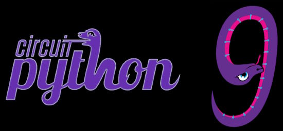](https://blog.adafruit.com/2023/10/27/circuitpython-9-0-0-alpha-2-released/)

CircuitPython 9.0.0-alpha.2, an alpha release for 9.0.0 has been released. Version 9 adds significant capabilities over Version 8 - [Adafruit Blog](https://blog.adafruit.com/2023/10/27/circuitpython-9-0-0-alpha-2-released/) and release notes - [GitHub](https://github.com/adafruit/circuitpython/releases/tag/9.0.0-alpha.2).

**Notable changes to 9.0.0**
* Merge updates from MicroPython v1.19.1, v1.20.0, and v1.21.0.
* Espressif: update to ESP-IDF v5.1.
* Remove 8.x.x deprecations: `displayio.*.show()`, `I2CPeripheral`: now `I2CTarget`.
* Add `repl.py`, which runs just before the REPL starts up.
* Add `OrderedDict.move_to_end()`.
* Add `synthio.Synthesizer.note_state`.
* Further USB host support, on i.MX and RP2040.
* Reorganize and split `displayio`.
* Add `warnings` module, similar to what is in CPython.

## The CircuitPython Blinka Python Compatability Layer Now Supports Raspberry Pi 5

[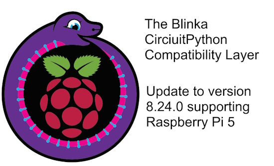](https://pypi.org/project/Adafruit-Blinka/)

The CircuitPython Blinka Python compatability layer now supports Raspberry Pi 5. Create CircuitPython programs for Raspberry Pi and other Single Board Computers (SBCs) running Python. Raspberry Pi 5 support added via the latest Pi 5 compatible version of libgpiod - [PyPI](https://pypi.org/project/Adafruit-Blinka/) and [GitHub](https://github.com/adafruit/Adafruit_Blinka/releases/tag/8.24.0).

For more on Blinka - [CircuitPython.org](https://circuitpython.org/blinka), [Adafruit Learning System](https://learn.adafruit.com/circuitpython-on-raspberrypi-linux) and [GitHub](https://github.com/adafruit/Adafruit_Blinka).

## Using Python Virtual Environments on Raspberry Pi

[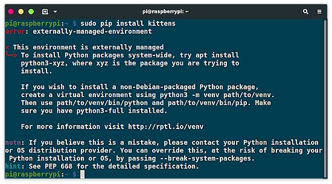](https://learn.adafruit.com/python-virtual-environment-usage-on-raspberry-pi)

Starting with the October 10, 2023 Bookworm release of the Raspberry Pi OS, the use of Python Virtual Environments (venv) when pip installing packages is required. No more sudo pip. This will break things and require learning new things. This change is being done to protect the system level Python installation. This is not a new issue and using venv has long been the recommended solution. We've just been slow to adopt this on Raspberry Pi boards. Learn more - [Adafruit Learning System](https://learn.adafruit.com/python-virtual-environment-usage-on-raspberry-pi).

[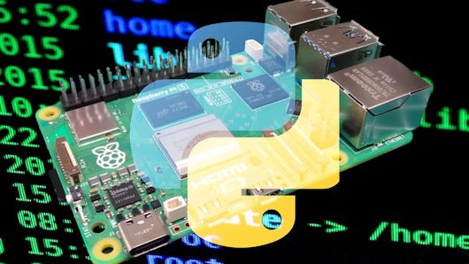](https://www.tomshardware.com/how-to/install-python-modules-raspberry-pi)

Les Pounder at Tom's Hardware also discusses this topic with How To Install Python Modules on Raspberry Pi 5 and Earlier Models - [Tom's Hardware](https://www.tomshardware.com/how-to/install-python-modules-raspberry-pi).

## Latest Raspberry Pi Imager Released 

[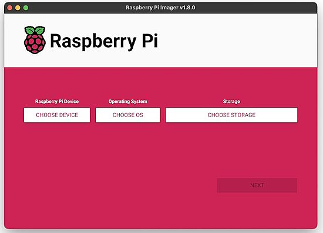](https://www.raspberrypi.com/documentation/computers/getting-started.html#raspberry-pi-imager)

Version 1.8.1 of the Raspberry Pi Imager has been released, which comes with much better support for configuring an installation. Raspberry Pi has totally rewritten their Getting Started documentation - [Raspberry Pi](https://www.raspberrypi.com/documentation/computers/getting-started.html#raspberry-pi-imager) via [X](https://twitter.com/aallan/status/1716435127482400876).

## The Risk of RISC-V: What’s Going on at SiFive?

Reports from multiple sources indicate that the major torch bearer of the RISC-V platform, SiFive, formed from the original architects of the RISC-V instruction set, has gone through some major changes - [Adafruit Blog](https://blog.adafruit.com/2023/10/24/the-risk-of-risc-v-whats-going-on-at-sifive-riscv-iancutress/) and [YouTube](https://youtu.be/l0DUHZ1e48U).

## The Official Raspberry Pi Handbook 2024 Is Out Now

[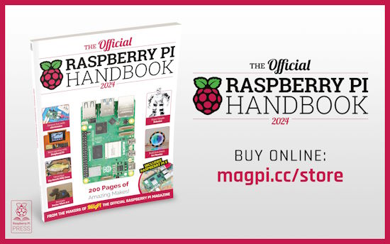](https://store.rpipress.cc/products/the-official-raspberry-pi-handbook-2024)

The Official Raspberry Pi Handbook 2024 is out, packed with projects, step-by-step tutorials, practical guides, and reviews of the best kit - [Raspberry Pi Press](https://store.rpipress.cc/products/the-official-raspberry-pi-handbook-2024).

## This Week's Python Videos

Python on Hardware is all about building a cooperative ecosphere which allows contributions to be valued and to grow knowledge. Below are the streams within the last week focusing on the community.

**CircuitPython Deep Dive Stream**

[Last Friday](link), Scott streamed work on {subject}.

You can see the latest video and past videos on the Adafruit YouTube channel under the Deep Dive playlist - [YouTube](https://www.youtube.com/playlist?list=PLjF7R1fz_OOXBHlu9msoXq2jQN4JpCk8A).

**CircuitPython Parsec**

John Park’s CircuitPython Parsec this week is on Print Debugger - [Adafruit Blog](https://blog.adafruit.com/2023/10/27/john-parks-circuitpython-parsec-print-debugger-adafruit-circuitpython/) and [YouTube](https://youtu.be/sz49X9IKOws).

Catch all the episodes in the [YouTube playlist](https://www.youtube.com/playlist?list=PLjF7R1fz_OOWFqZfqW9jlvQSIUmwn9lWr).

**CircuitPython Weekly Meeting**

CircuitPython Weekly Meeting for October 23, 2023 ([notes](https://github.com/adafruit/adafruit-circuitpython-weekly-meeting/blob/main/2023/2023-01-03.md)) [on YouTube](https://youtu.be/03tQBu0ybF4).

## Project of the Week: A QR Code Menu Printer

[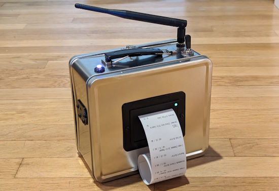](https://hackaday.io/project/193322-a-la-qrte-qr-code-menu-printer)

A LA QRTE is a portable, combination scanner/printer for converting QR code menus into physical copies.

It runs on a rechargeable 12V battery and uses a Tiny Code Reader (from Useful Sensors) for QR scanning. It runs on a Seeed Studio XIAO Esp-32 S3 to read from the scanner, communicate with the backend, and drive the thermal printer module, talking to a web server written in CircuitPython that fetches menus, scrapes the text, feeds it to ChatGPT, and formats the final result - [Hackaday](https://hackaday.io/project/193322-a-la-qrte-qr-code-menu-printer), [YouTube](https://www.youtube.com/watch?v=dytFj5Iw208) and [GitHub](https://github.com/dupontgu/a-la-qrte).

## New Notes from Adafruit Playground

[Adafruit Playground](https://adafruit-playground.com/) is a new place for the community to post their projects and other making tips/tricks/techniques. Ad-free, it's an easy way to publish your work in a safe space for free.

[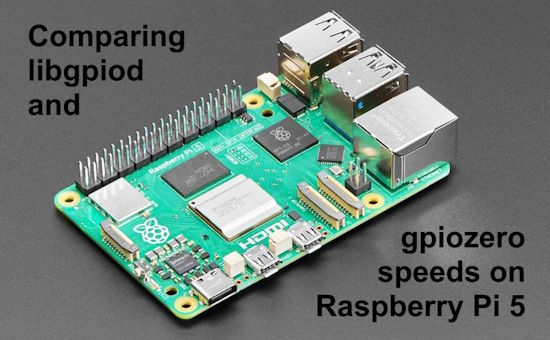](https://adafruit-playground.com/u/MakerMelissa/pages/comparing-libgpiod-and-gpiozero-speeds-on-the-raspberry-pi-5)

Comparing libgpiod and gpiozero speeds on the Raspberry Pi 5 - [Adafruit Playground](https://adafruit-playground.com/u/MakerMelissa/pages/comparing-libgpiod-and-gpiozero-speeds-on-the-raspberry-pi-5).

[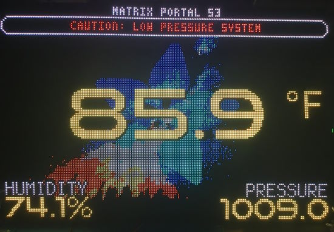](https://adafruit-playground.com/u/DJDevon3/pages/12-panel-matrix-portal-display)

Making a huge 12-Panel Matrix Portal Display - [Adafruit Playground](https://adafruit-playground.com/u/DJDevon3/pages/12-panel-matrix-portal-display).

[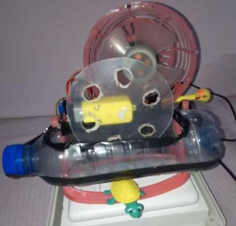](url)

DIY Bubble Machine Using Raspberry Pi Pico and MicroPython - [Adafruit Playground](url) and [YouTube](https://youtu.be/Nvc4s-JU_T4).

[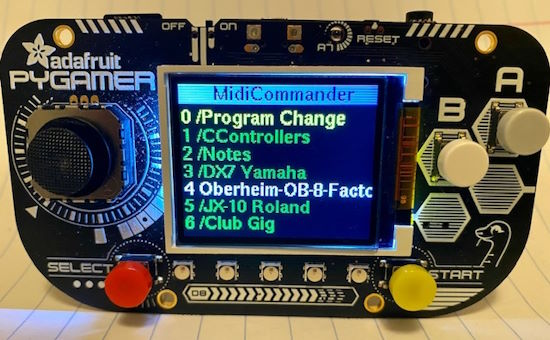](https://adafruit-playground.com/u/gmeader/pages/midi-commander-pygamer)

MIDI Commander is a PyGamer-based MIDI SysEx Patch Loader / MIDI snippet player - [Adafruit Playground](https://adafruit-playground.com/u/gmeader/pages/midi-commander-pygamer).

## Popular Last Week

What was the most popular, most clicked link, in [last week's newsletter](https://www.adafruitdaily.com/2023/10/23/python-on-microcontrollers-newsletter-raspberry-pi-5-details-and-benchmarks-new-circuitpython-and-more-circuitpython-python-micropython-thepsf-raspberry_pi/)? [PDF book on GPIO Zero (free)](https://github.com/raspberrypipress/released-pdfs/raw/main/simple-electronics-with-gpio-zero.pdf).

## News from around the web!

[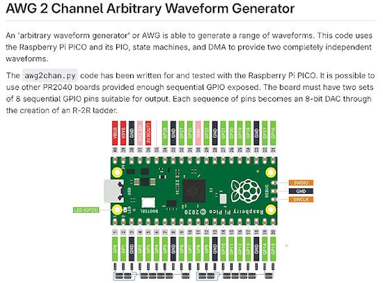](https://twitter.com/bradanlane/status/1717711938602377697)

[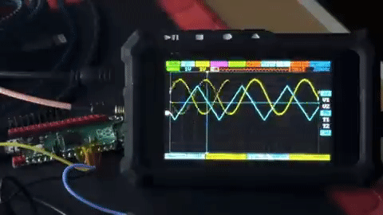](https://twitter.com/bradanlane/status/1716564075323220030)

AWG is a 2 independent channel arbitrary waveform generator using a Raspberry Pi Pico and MicroPython - [X](https://twitter.com/bradanlane/status/1717711938602377697) and [GitLab](https://gitlab.com/bradanlane/awg2chan).

> An 'arbitrary waveform generator' or AWG is able to generate a range of waveforms. This code uses the Raspberry Pi PICO and its PIO, state machines, and DMA to
provide two completely independent waveforms. Each waveform generates values between 0v and VCC (3.3V on the PICO). It is possible to add a combination of voltage dividers and an opamp to provide larger or smaller ranges or make the output a +/- range.

[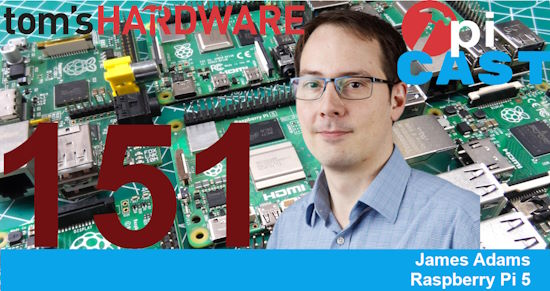](https://www.youtube.com/watch?v=WP5oXh_Gtsc)

The Pi Cast hosted James Adams from Raspberry Pi to talk about the Raspberry Pi 5 - [Tom's Hardware](https://www.youtube.com/watch?v=WP5oXh_Gtscurl) via [X](https://twitter.com/biglesp/status/1715315032240619721).

[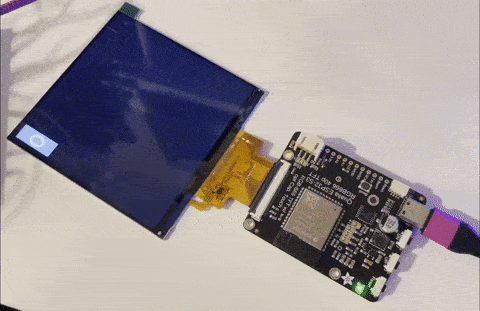](https://octodon.social/@blitzcitydiy@mastodon.social/111269348535990774)

Experimenting with the flip clock library on a dot clock display with CircuitPython font size is 92 on the 720x720 display - [Mastodon](https://octodon.social/@blitzcitydiy@mastodon.social/111269348535990774).

[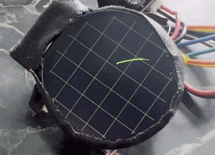](url)

Having some fake vectorscope fun in prep for Hackaday Supercon. This is CircuitPython scribbling on a Bitmap - [Mastodon](https://octodon.social/@todbot@mastodon.social/111279892092647448) and [GitHub](https://gist.github.com/todbot/caee43e4a8da399ffb8062312fe16acd).

[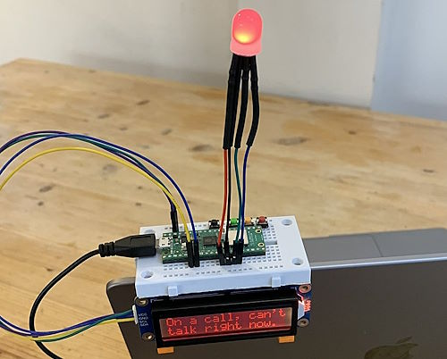](https://twitter.com/PaterPracticus/status/1717161818278248687)

A Raspberry Pi Pico and MicroPython powered video-call status indicator - [X](https://twitter.com/PaterPracticus/status/1717161818278248687) and [YouTube Playlist](https://www.youtube.com/playlist?list=PLINj_KlhE4lPepu-BMrTNNUWayCI6QuWn).

[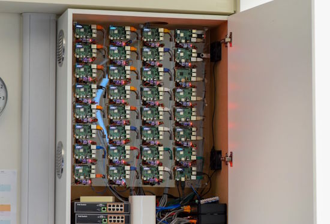](https://www.raspberrypi.com/news/teachers-pi-cluster-controls-digital-learning-classroom/)

Teacher’s Pi cluster controls digital learning classroom - [Raspberry Pi](https://www.raspberrypi.com/news/teachers-pi-cluster-controls-digital-learning-classroom/).

[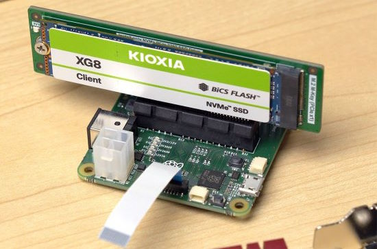](url)

Booting the Raspberry Pi 5 With an NVMe SSD - [Jeff Geerling](https://www.jeffgeerling.com/blog/2023/nvme-ssd-boot-raspberry-pi-5) and [hackaday](https://hackaday.com/2023/10/25/booting-the-raspberry-pi-5-with-an-nvme-ssd/) via [X](https://twitter.com/linuxdevices/status/1717466987406770671).

PyCon US 2024 Launches - May 15-23 in Pittsburgh, Pennsylvania US - [PyCon US](https://pycon.blogspot.com/2023/10/pycon-us-2024-launches.html).

Adding basic 3D drawing capabilities to the BlizzardS3 CircuitPython graphics library - [YouTube](https://www.youtube.com/watch?v=fJ94g_ozqX8).

[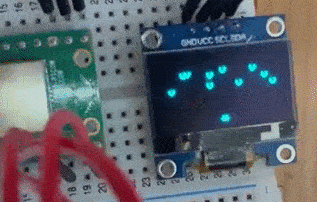](https://twitter.com/moheji1500/status/1717527394972737891)

Making a game for Raspberry Pi Pico and MicroPython with ChatGPT assistance - [X](https://twitter.com/moheji1500/status/1717527394972737891).

[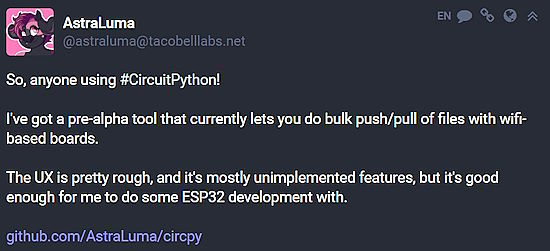](https://octodon.social/@astraluma@tacobelllabs.net/111257980813777830)

AstraLuma on Mastodon has a pre-alpha tool that currently lets you do bulk push/pull of files with wWiFi-based boards. The UX is pretty rough, and it's mostly unimplemented features, but it's good enough for me to do some ESP32 development with - [Mastodon](https://octodon.social/@astraluma@tacobelllabs.net/111257980813777830).

text - [site](url).

text - [site](url).

text - [site](url).

[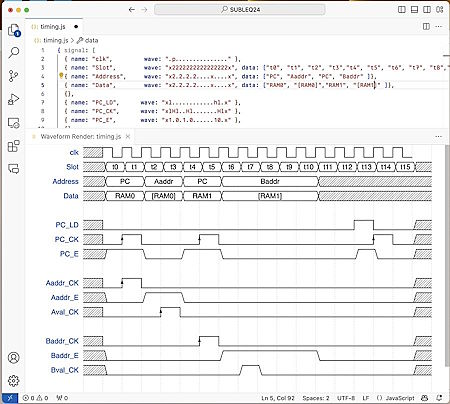](https://twitter.com/matseng/status/1716343101126553848)

The WaveDrom plugin for Visual Code makes timing diagrams and bitfield illustrations right there and not have to use a standalone app or online service - [X](https://twitter.com/matseng/status/1716343101126553848) and [WaveDom](https://wavedrom.com/).

[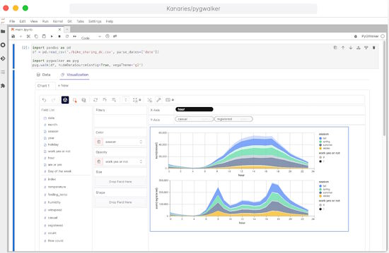](https://github.com/Kanaries/pygwalker)

PyGWalker can simplify your Jupyter Notebook data analysis and data visualization workflow, by turning your pandas dataframe (and polars dataframe) into a Tableau-style User Interface for visual exploration - [GitHub](https://github.com/Kanaries/pygwalker).

Make Your Ordinary Washing Machine Smart using Python - [Adafruit Blog](https://blog.adafruit.com/2023/10/20/make-your-ordinary-washing-machine-smart-using-python-piday-raspberrypi/) and [YouTube](https://youtu.be/Lht7hF2Tblg).

Create a Screen recorder using Python - [X](https://twitter.com/clcoding/status/1716736787346043327).

## New Boards Supported by CircuitPython

The number of supported microcontrollers and Single Board Computers (SBC) grows every week. This section outlines which boards have been included in CircuitPython or added to [CircuitPython.org](https://circuitpython.org/).

This week, there were (#/no) new boards added:

- [Board name](url)
- [Board name](url)
- [Board name](url)

*Note: For non-Adafruit boards, please use the support forums of the board manufacturer for assistance, as Adafruit does not have the hardware to assist in troubleshooting.*

Looking to add a new board to CircuitPython? It's highly encouraged! Adafruit has four guides to help you do so:

- [How to Add a New Board to CircuitPython](https://learn.adafruit.com/how-to-add-a-new-board-to-circuitpython/overview)
- [How to add a New Board to the circuitpython.org website](https://learn.adafruit.com/how-to-add-a-new-board-to-the-circuitpython-org-website)
- [Adding a Single Board Computer to PlatformDetect for Blinka](https://learn.adafruit.com/adding-a-single-board-computer-to-platformdetect-for-blinka)
- [Adding a Single Board Computer to Blinka](https://learn.adafruit.com/adding-a-single-board-computer-to-blinka)

## New Learn Guides

[Python Virtual Environment Usage on Raspberry Pi](https://learn.adafruit.com/python-virtual-environment-usage-on-raspberry-pi) from [Carter Nelson](https://learn.adafruit.com/u/caternuson)

## CircuitPython Libraries

The CircuitPython library numbers are continually increasing, while existing ones continue to be updated. Here we provide library numbers and updates!

To get the latest Adafruit libraries, download the [Adafruit CircuitPython Library Bundle](https://circuitpython.org/libraries). To get the latest community contributed libraries, download the [CircuitPython Community Bundle](https://circuitpython.org/libraries).

If you'd like to contribute to the CircuitPython project on the Python side of things, the libraries are a great place to start. Check out the [CircuitPython.org Contributing page](https://circuitpython.org/contributing). If you're interested in reviewing, check out Open Pull Requests. If you'd like to contribute code or documentation, check out Open Issues. We have a guide on [contributing to CircuitPython with Git and GitHub](https://learn.adafruit.com/contribute-to-circuitpython-with-git-and-github), and you can find us in the #help-with-circuitpython and #circuitpython-dev channels on the [Adafruit Discord](https://adafru.it/discord).

You can check out this [list of all the Adafruit CircuitPython libraries and drivers available](https://github.com/adafruit/Adafruit_CircuitPython_Bundle/blob/master/circuitpython_library_list.md). 

The current number of CircuitPython libraries is **455**!

**New Libraries!**

Here's this week's new CircuitPython libraries:

  * [adafruit/Adafruit_CircuitPython_TemplateEngine](https://github.com/adafruit/Adafruit_CircuitPython_TemplateEngine)
  * [adafruit/Adafruit_CircuitPython_HUSB238](https://github.com/adafruit/Adafruit_CircuitPython_HUSB238)

**Updated Libraries!**

Here's this week's updated CircuitPython libraries:

  * [adafruit/Adafruit_CircuitPython_turtle](https://github.com/adafruit/Adafruit_CircuitPython_turtle)

**Library PyPI Weekly Download Stats**

**Total Library Stats**

  * 156609 PyPI downloads over 316 libraries

**Top 10 Libraries by PyPI Downloads**

  * Adafruit CircuitPython BusDevice (adafruit-circuitpython-busdevice): 8779
  * Adafruit CircuitPython Requests (adafruit-circuitpython-requests): 8202
  * Adafruit CircuitPython Register (adafruit-circuitpython-register): 3143
  * Adafruit CircuitPython ADS1x15 (adafruit-circuitpython-ads1x15): 1698
  * Adafruit CircuitPython Wiznet5k (adafruit-circuitpython-wiznet5k): 1312
  * Adafruit CircuitPython Motor (adafruit-circuitpython-motor): 1282
  * Adafruit CircuitPython Display Text (adafruit-circuitpython-display-text): 1269
  * Adafruit CircuitPython DHT (adafruit-circuitpython-dht): 1229
  * Adafruit CircuitPython MiniMQTT (adafruit-circuitpython-minimqtt): 1212
  * Adafruit CircuitPython ESP32SPI (adafruit-circuitpython-esp32spi): 1171

## What’s the CircuitPython team up to this week?

What is the team up to this week? Let’s check in!

**Dan**

Scott and I finished merging MicroPython v1.21.0 into CircuitPython. We are now caught up with the latest MicroPython release.

I am debugging a certificate issue with NINA-FW, which is the ESP32 fimrware used on AirLift boards. It does not handle ECDSA certificate chains properly. Interestingly, we discovered that rolling back to a very old version of NINA-FW does work, so we need to see what has changed that causes the regression.

By the time you read this, we will probably have released CircuitPython 9.0.0-alpha.2, the first published release of the 9.0.0 series. Alpha.0 and alpha.1 were not released: they were just labels to mark significant points. But they were using other versions of the .mpy format, and we wanted all 9.0.0 releases to use the same format.

**Melissa**

This past week I updated Blinka to run on the Raspberry Pi 5. I used `libgpiod` as the underlying library and added support for pullups and pulldowns which previously was not working.

**Tim**

This week I tested some changes to the core `displayio` API on a few different types of displays. I also worked to re-create an issue a user is having with the Cleveland art PyPortal project. After testing many versions of nina-firmware for the co-processor it's been determined that an old version perhaps shipped on the device originally is able to work successfully, but newer ones aren't. While investigating that issue I found an unrelated problem that `BitmapLabel` can have with certain fonts and text values shown, I'm working now on a fix for that issue.

**Scott**

This week Dan and I got version 1.21 of MicroPython merged into CircuitPython main, which will be released as 9.0. This is a big milestone because it's one of the last major changes to do on it. (The ESP-IDF has already been updated to 5.1 from 4.4.) I've also done all of the breaking changes and am working to add the ability to warn when APIs will be broken in the future. The last major thing on my list is reworking CircuitPython to grow it's heap automatically and simplify our ability to allocate memory to use outside the VM. 9.0.0 alphas will start being released soon!

**Liz**

This past week I worked on a fun collaboration with Noe. He designed a case for the HUSB238 breakout, which lets you request different voltages from a USB PD power supply aka turn your devices that use a wall wart into USB C devices. I had a MIDI keyboard that used a 12V wall wart that had a very short cable, so I wanted to make it USB C. This became the use case that we showed in the [guide](https://learn.adafruit.com/case-for-husb238) and in the [project video](https://www.youtube.com/watch?v=Un2d8Vo-EKs). I added a page to the guide documenting how to check your wall wart supply for the information needed to convert it to USB C with the HUSB238. 

## Upcoming Events!

The next MicroPython Meetup in Melbourne will be on October 25th – [Meetup](https://www.meetup.com/micropython-meetup/events). 

Hackaday has announced that the Hackaday Supercon is on for 2023, and will be taking place November 3 – 5 in Pasadena, California, USA - [Adafruit Blog](https://blog.adafruit.com/2023/05/10/hackaday-supercon-2023-is-on-supercon-hackaday/) and [Hackaday](https://hackaday.com/2023/05/10/supercon-2023-is-on-we-want-you/).

The inaugural PyLadies Conference will take place December 1-3, 2023 - [pretalx](https://pretalx.com/pyladiescon-2023/cfp).

The Pyjamas Conference, the 24-hour online Python conference, will be returning for a fifth year on December 9-10.

PyCon US 2024 Launches - May 15-23 in Pittsburgh, Pennsylvania US - [PyCon US](https://pycon.blogspot.com/2023/10/pycon-us-2024-launches.html).

**Send Your Events In**

If you know of virtual events or upcoming events, please let us know via email to cpnews(at)adafruit(dot)com.

## Latest Releases

CircuitPython's stable release is [8.2.7](https://github.com/adafruit/circuitpython/releases/latest) and its unstable release is [9.0.0-alpha2](https://github.com/adafruit/circuitpython/releases). New to CircuitPython? Start with our [Welcome to CircuitPython Guide](https://learn.adafruit.com/welcome-to-circuitpython).

[20231025](https://github.com/adafruit/Adafruit_CircuitPython_Bundle/releases/latest) is the latest Adafruit CircuitPython library bundle.

[20231020](https://github.com/adafruit/CircuitPython_Community_Bundle/releases/latest) is the latest CircuitPython Community library bundle.

[v1.21.0](https://micropython.org/download) is the latest MicroPython release. Documentation for it is [here](http://docs.micropython.org/en/latest/pyboard/).

[3.12.0](https://www.python.org/downloads/) is the latest Python release. The latest pre-release version is [3.13.0a1](https://www.python.org/download/pre-releases/).

[3,693 Stars](https://github.com/adafruit/circuitpython/stargazers) Like CircuitPython? [Star it on GitHub!](https://github.com/adafruit/circuitpython)

## Call for Help -- Translating CircuitPython is now easier than ever!

[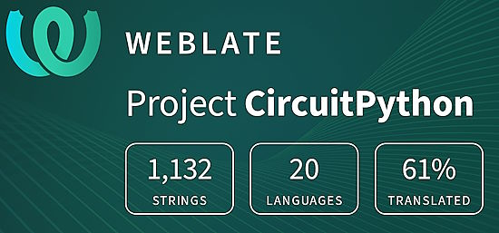](https://hosted.weblate.org/engage/circuitpython/)

One important feature of CircuitPython is translated control and error messages. With the help of fellow open source project [Weblate](https://weblate.org/), we're making it even easier to add or improve translations. 

Sign in with an existing account such as GitHub, Google or Facebook and start contributing through a simple web interface. No forks or pull requests needed! As always, if you run into trouble join us on [Discord](https://adafru.it/discord), we're here to help.

## 37,941 Thanks!

The Adafruit Discord community, where we do all our CircuitPython development in the open, reached over 37,941 humans - thank you! Adafruit believes Discord offers a unique way for Python on hardware folks to connect. Join today at [https://adafru.it/discord](https://adafru.it/discord).

## ICYMI - In case you missed it

Python on hardware is the Adafruit Python video-newsletter-podcast! The news comes from the Python community, Discord, Adafruit communities and more and is broadcast on ASK an ENGINEER Wednesdays. The complete Python on Hardware weekly videocast [playlist is here](https://www.youtube.com/playlist?list=PLjF7R1fz_OOXRMjM7Sm0J2Xt6H81TdDev). The video podcast is on [iTunes](https://itunes.apple.com/us/podcast/python-on-hardware/id1451685192?mt=2), [YouTube](http://adafru.it/pohepisodes), [Instagram Reels](https://www.instagram.com/adafruit/channel/)), and [XML](https://itunes.apple.com/us/podcast/python-on-hardware/id1451685192?mt=2).

[The weekly community chat on Adafruit Discord server CircuitPython channel - Audio / Podcast edition](https://itunes.apple.com/us/podcast/circuitpython-weekly-meeting/id1451685016) - Audio from the Discord chat space for CircuitPython, meetings are usually Mondays at 2pm ET, this is the audio version on [iTunes](https://itunes.apple.com/us/podcast/circuitpython-weekly-meeting/id1451685016), Pocket Casts, [Spotify](https://adafru.it/spotify), and [XML feed](https://adafruit-podcasts.s3.amazonaws.com/circuitpython_weekly_meeting/audio-podcast.xml).

## Contribute!

The CircuitPython Weekly Newsletter is a CircuitPython community-run newsletter emailed every Tuesday. The complete [archives are here](https://www.adafruitdaily.com/category/circuitpython/). It highlights the latest CircuitPython related news from around the web including Python and MicroPython developments. To contribute, edit next week's draft [on GitHub](https://github.com/adafruit/circuitpython-weekly-newsletter/tree/gh-pages/_drafts) and [submit a pull request](https://help.github.com/articles/editing-files-in-your-repository/) with the changes. You may also tag your information on Twitter with #CircuitPython. 

Join the Adafruit [Discord](https://adafru.it/discord) or [post to the forum](https://forums.adafruit.com/viewforum.php?f=60) if you have questions.
