- [ ] Library and info updates
- [ ] change date
- [ ] update title
- [ ] Feature story
- [ ] Update  for images
- [ ] Update ICYDNCI
- [ ] All images 550w max only
- [ ] Link "View this email in your browser."

News Sources

- [Adafruit Playground](https://adafruit-playground.com/)
- Twitter: [CircuitPython](https://twitter.com/search?q=circuitpython&src=typed_query&f=live), [MicroPython](https://twitter.com/search?q=micropython&src=typed_query&f=live) and [Python](https://twitter.com/search?q=python&src=typed_query)
- [Raspberry Pi News](https://www.raspberrypi.com/news/)
- [hackster.io CircuitPython](https://www.hackster.io/search?q=circuitpython&i=projects&sort_by=most_recent) and [MicroPython](https://www.hackster.io/search?q=micropython&i=projects&sort_by=most_recent)
- Mastodon [CircuitPython](https://octodon.social/tags/CircuitPython) and [MicroPython](https://octodon.social/tags/MicroPython)
- [python.org](https://www.python.org/)
- [Python Insider - dev team blog](https://pythoninsider.blogspot.com/)
- [MicroPython Meetup Blog](https://melbournemicropythonmeetup.github.io/)
- [hackaday CircuitPython](https://hackaday.com/blog/?s=circuitpython) and [MicroPython](https://hackaday.com/blog/?s=micropython)
- [hackaday.io newest projects MicroPython](https://hackaday.io/projects?tag=micropython&sort=date) and [CircuitPython](https://hackaday.io/projects?tag=circuitpython&sort=date)
- [https://opensource.com/tags/python](https://opensource.com/tags/python)
- Check Issues and PRs for input

View this email in your browser. **Warning: Flashing Imagery**

Welcome to the latest Python on Microcontrollers newsletter! *insert 2-3 sentences from editor (what's in overview, banter)* - *Anne Barela, Ed.*

We're on [Discord](https://discord.gg/HYqvREz), [Twitter](https://twitter.com/search?q=circuitpython&src=typed_query&f=live), and for past newsletters - [view them all here](https://www.adafruitdaily.com/category/circuitpython/). If you're reading this on the web, [subscribe here](https://www.adafruitdaily.com/). Here's the news this week:

## Headline

text - [site](url).

## Arm Acquires Minority Stake in Raspberry Pi

[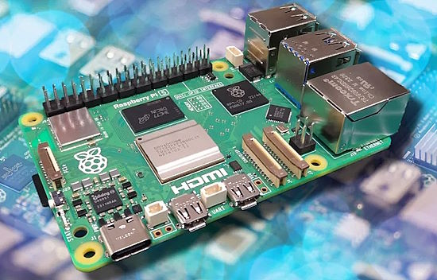](https://www.tomshardware.com/raspberry-pi/arm-acquires-minority-stake-in-raspberry-pi)

Arm Holdings plc today announced late last week that it has made a strategic investment, a minority stake in Raspberry Pi Ltd — the arm of Raspberry Pi responsible for the new Raspberry Pi 5 and past Raspberry Pi products. 

Arm's minority stake extends the long-term partnership between Arm and Raspberry Pi, which has seen Arm CPUs feature in all of the Raspberry Pi and Raspberry Pi Pico SoC. The partnership began way before the Raspberry Pi was available for sale, in 2008 — when the original board was still just a dream. Fast-forward to 2023 and there is a generation of learners who have taken their first steps with coding, science and electronics thanks to the Raspberry Pi - [Tom's Hardware](https://www.tomshardware.com/raspberry-pi/arm-acquires-minority-stake-in-raspberry-pi).

## Girl Scout Maker Badges

[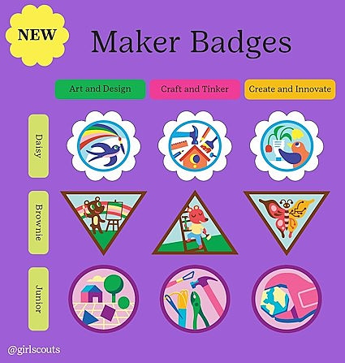](https://www.girlscouts.org/en/footer/press-room/2023-press-announcements/gsusa-launches-new-maker-badges.html)

Stanley Black & Decker has partnered with the Girl Scouts of the USA to launch Maker Badges. These new badges are providing the next generation with the tools to tap into their creativity, discover new interests and explore future careers in the trades - [Girl Scouts](https://www.girlscouts.org/en/footer/press-room/2023-press-announcements/gsusa-launches-new-maker-badges.html) via [X](https://twitter.com/StanleyBlkDeckr/status/1712105873190125956?t=PZfbcSTWVZ-Vj4tUgQQBlg&s=03).

## The Official Raspberry Pi Beginner’s Guide, 5th Edition Is Out Now

[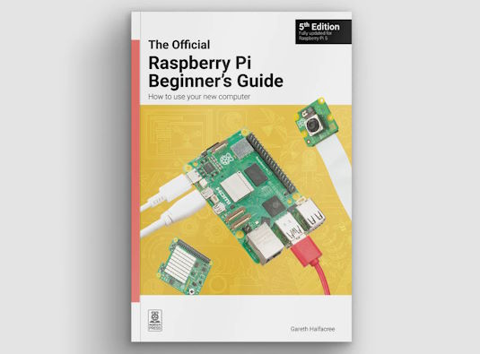](https://www.raspberrypi.com/news/available-now-the-official-raspberry-pi-beginners-guide-5th-edition/)

The latest edition of the flagship book about Raspberry Pi products is now out: The Official Raspberry Pi Beginner’s Guide by Gareth Halfacree. In its fifth edition, there is new coverage of Raspberry Pi 5, Raspberry Pi Zero 2 W, and the most recent version of Raspberry Pi OS. Gareth even included a bonus chapter that covers Raspberry Pi Pico and Pico W - [Raspberry Pi News](https://www.raspberrypi.com/news/available-now-the-official-raspberry-pi-beginners-guide-5th-edition/), [Order](https://store.rpipress.cc/products/the-official-raspberry-pi-beginners-guide-5th-edition) and code on [GitHub](https://github.com/raspberrypipress/official-raspberry-pi-beginners-guide-5e/tree/main).

## Gender Diversity and Representation in Popular Python Community Podcasts

Throughout the years, the Python community as a whole has made significant effort in improving diversity. This can be seen in improvements in speaker diversity at Python conferences, and among PSF Board of Directors. However, when looking at popular podcasts in the Python community, Podcats noticed that women are still under-represented compared to men. They could not find an existing analysis about this, therefore they decided to do their own research to gather data about gender diversity at podcasts about Python - [pypodcats.live](https://pypodcats.live/blog/python_podcast_gender_diversity_and_representation/) via [Mastodon](https://fosstodon.org/@pypodcats/111324564294725597).

## This Week's Python Streams

Python on Hardware is all about building a cooperative ecosphere which allows contributions to be valued and to grow knowledge. Below are the streams within the last week focusing on the community.

**CircuitPython Deep Dive Stream**

[Last Friday](link), Scott streamed work on {subject}.

You can see the latest video and past videos on the Adafruit YouTube channel under the Deep Dive playlist - [YouTube](https://www.youtube.com/playlist?list=PLjF7R1fz_OOXBHlu9msoXq2jQN4JpCk8A).

**CircuitPython Parsec**

John Park’s CircuitPython Parsec this week is on {subject} - [Adafruit Blog](link) and [YouTube](link).

Catch all the episodes in the [YouTube playlist](https://www.youtube.com/playlist?list=PLjF7R1fz_OOWFqZfqW9jlvQSIUmwn9lWr).

**CircuitPython Weekly Meeting**

CircuitPython Weekly Meeting for October 30, 2023 ([notes](file)) [on YouTube](link).

## Project of the Week

text - [site](url).

## Popular Last Week

What was the most popular, most clicked link, in [last week's newsletter](https://www.adafruitdaily.com/2023/10/30/python-on-microcontrollers-newsletter-circuitpython-9-alpha-appears-run-circuitpython-on-raspberry-pi-5-and-much-more-circuitpython-python-micropython-thepsf-raspberry_pi/)? [eBook: Simple Electronics with GPIO Zero](https://github.com/raspberrypipress/released-pdfs/raw/main/simple-electronics-with-gpio-zero.pdf).

## New Notes from Adafruit Playground

[Adafruit Playground](https://adafruit-playground.com/) is a new place for the community to post their projects and other making tips/tricks/techniques. Ad-free, it's an easy way to publish your work in a safe space for free.

[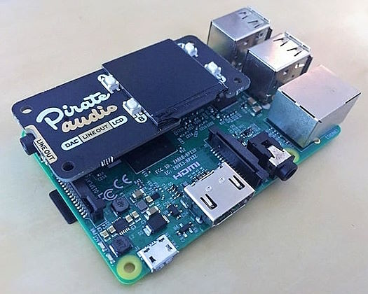](https://adafruit-playground.com/u/gmeader/pages/midi-samplerbox-raspberrypi)

SamplerBox is an electronic musical instrument. Drop audio samples onto it, hook up a MIDI keyboard, and you'll be able to play with realistic piano, organ, drums, etc. sounds! - [Adafruit Playground](https://adafruit-playground.com/u/gmeader/pages/midi-samplerbox-raspberrypi).

[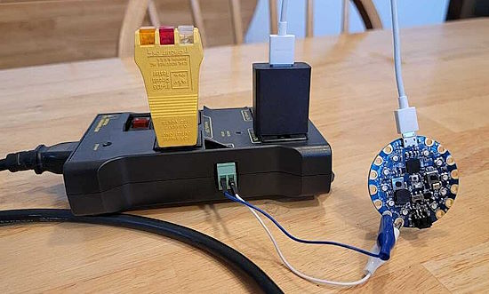](https://adafruit-playground.com/u/AnneBarela/pages/bluetooth-controlled-electrical-outlets)

Bluetooth-controlled electrical outlets - [Adafruit Playground](https://adafruit-playground.com/u/AnneBarela/pages/bluetooth-controlled-electrical-outlets).

[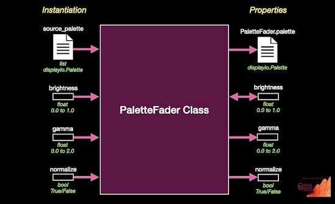](https://adafruit-playground.com/u/CGrover/pages/palettefader)

PaletteFader: a CircuitPython Community Bundle color palette and list brightness setter and normalizer tool - [Adafruit Playground](https://adafruit-playground.com/u/CGrover/pages/palettefader).

## News from around the web!

[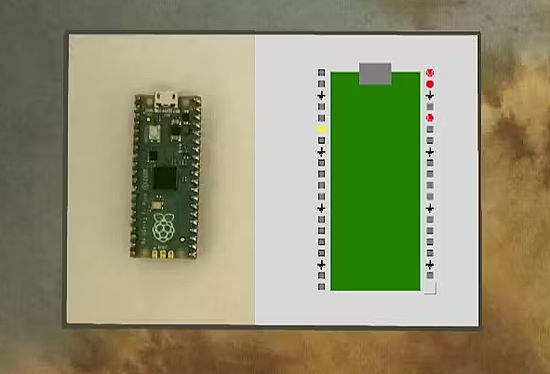](https://www.hackster.io/dandy/dandy-data-acquisition-and-display-a69442)

Dandy is a set of reusable Python functions and examples to help display sensor data in a graphical user interface (GUI) (MicroPython/CircuitPython) - [hackster.io](https://www.hackster.io/dandy/dandy-data-acquisition-and-display-a69442).

text - [site](url).

text - [site](url).

text - [site](url).

text - [site](url).

text - [site](url).

text - [site](url).

text - [site](url).

text - [site](url).

text - [site](url).

text - [site](url).

text - [site](url).

[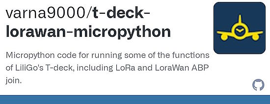](https://github.com/varna9000/t-deck-lorawan-micropython)

MicroPython examples for running LilyGo's T-deck - [GitHub](https://github.com/varna9000/t-deck-lorawan-micropython).

text - [site](url).

text - [site](url).

text - [site](url).

[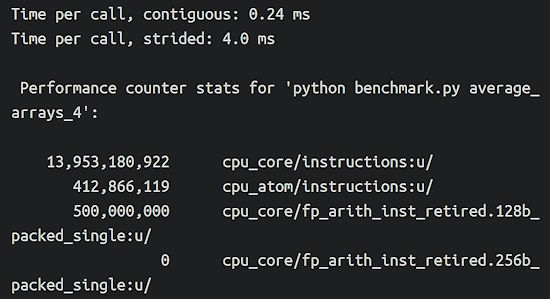](https://pythonspeed.com/articles/faster-cython-simd/)

Speeding up Cython with Intel SIMD instructions - [pythonspeed.com](https://pythonspeed.com/articles/faster-cython-simd/).

[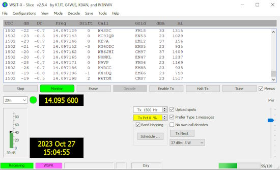](http://www.whiskeytangohotel.com/2023/10/automagically-switch-idle-flexradio-to.html)

Automagically Switch an Idle FlexRadio to WSPR with Python - [Whisky Tango Hotel](http://www.whiskeytangohotel.com/2023/10/automagically-switch-idle-flexradio-to.html).

## New

[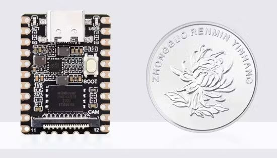](https://www.hackster.io/news/luckfox-launches-an-ultra-compact-linux-capable-single-board-computer-with-on-device-ai-smarts-e28f85428cbf)

Luckfox launches an ultracompact Linux-capable Single-Board Computer (SBC) with on-device AI smarts. With a 32-bit Arm Cortex-A7 and the pairing of a RISC-V microcontroller and a neural processor, this compact board aims for edge AI work - [hackster.io](https://www.hackster.io/news/luckfox-launches-an-ultra-compact-linux-capable-single-board-computer-with-on-device-ai-smarts-e28f85428cbf).

text - [site](url).

## New Boards Supported by CircuitPython

The number of supported microcontrollers and Single Board Computers (SBC) grows every week. This section outlines which boards have been included in CircuitPython or added to [CircuitPython.org](https://circuitpython.org/).

This week, there were (#/no) new boards added:

- [Board name](url)
- [Board name](url)
- [Board name](url)

*Note: For non-Adafruit boards, please use the support forums of the board manufacturer for assistance, as Adafruit does not have the hardware to assist in troubleshooting.*

Looking to add a new board to CircuitPython? It's highly encouraged! Adafruit has four guides to help you do so:

- [How to Add a New Board to CircuitPython](https://learn.adafruit.com/how-to-add-a-new-board-to-circuitpython/overview)
- [How to add a New Board to the circuitpython.org website](https://learn.adafruit.com/how-to-add-a-new-board-to-the-circuitpython-org-website)
- [Adding a Single Board Computer to PlatformDetect for Blinka](https://learn.adafruit.com/adding-a-single-board-computer-to-platformdetect-for-blinka)
- [Adding a Single Board Computer to Blinka](https://learn.adafruit.com/adding-a-single-board-computer-to-blinka)

## New Learn Guides!

[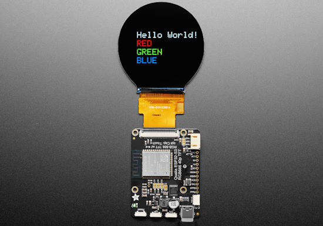](https://learn.adafruit.com/guides/latest)

[Adafruit Qualia ESP32-S3 for RGB-666 Displays](https://learn.adafruit.com/adafruit-qualia-esp32-s3-for-rgb666-displays) from [M. LeBlanc-Williams](https://learn.adafruit.com/u/MakerMelissa)

[title](url) from [name](url)

[title](url) from [name](url)

## Updated Learn Guides!

[Adafruit GPIO Expander Bonnet for Raspberry Pi](https://learn.adafruit.com/gpio-expander-bonnet) from [Liz Clark](https://learn.adafruit.com/gpio-expander-bonnet)

[Adafruit IO Basics: Digital Input](https://learn.adafruit.com/adafruit-io-basics-digital-input) 

## CircuitPython Libraries!

The CircuitPython library numbers are continually increasing, while existing ones continue to be updated. Here we provide library numbers and updates!

To get the latest Adafruit libraries, download the [Adafruit CircuitPython Library Bundle](https://circuitpython.org/libraries). To get the latest community contributed libraries, download the [CircuitPython Community Bundle](https://circuitpython.org/libraries).

If you'd like to contribute to the CircuitPython project on the Python side of things, the libraries are a great place to start. Check out the [CircuitPython.org Contributing page](https://circuitpython.org/contributing). If you're interested in reviewing, check out Open Pull Requests. If you'd like to contribute code or documentation, check out Open Issues. We have a guide on [contributing to CircuitPython with Git and GitHub](https://learn.adafruit.com/contribute-to-circuitpython-with-git-and-github), and you can find us in the #help-with-circuitpython and #circuitpython-dev channels on the [Adafruit Discord](https://adafru.it/discord).

You can check out this [list of all the Adafruit CircuitPython libraries and drivers available](https://github.com/adafruit/Adafruit_CircuitPython_Bundle/blob/master/circuitpython_library_list.md). 

The current number of CircuitPython libraries is **###**!

**New Libraries!**

Here's this week's new CircuitPython libraries:

* [library](url)

**Updated Libraries!**

Here's this week's updated CircuitPython libraries:

* [library](url)

**Library PyPI Weekly Download Stats**

## What’s the CircuitPython team up to this week?

What is the team up to this week? Let’s check in!

**Dan**

I've narrowed down a problem with NINA-FW, used on AirLift boards, that causes it not to work with certain SSL certificate chains. I now know the exact call that's causing the problem, but it's not something that should be breaking. So it may be some kind of configuration problem.

We added CircuitPython,library bundles for version 9.x coincident with the release of CIrcuitPython 9.0.0-alpha.2. Coincidentally, GitHub CI updated the default version of Python to Python 3.12 at just around the same time. This caused some bundle and library building to break, and the circup program also broke. We fixed the bundles and libraries in the past few days, and I changed circup so it is now more robust when unable to download new bundles.

**Melissa**

text - [site](url).

**Tim**

This week I've been working on some infrastructure issues in the CircuitPython org bundle that were raising errors in circup. I've also been working on different components that will be used to make a way for circuitpython libraries to specify dependencies that are in a bundle but not deployed to pypi which is optional and many community bundle libraries are not on pypi. The first step was to alter the build-tool to add the pyproject.toml file into the bundles.

**Scott**

This week I've been getting back to switching CircuitPython (CP) to an auto-growing split heap. MicroPython (MP) 1.21 added this functionality for the ESP32. It greatly simplifies CP code where allocations need to happen outside of the VM even when it is running. We couldn't do this before because the VM heap took all of the remaining memory.

One of the major hurdles with the code change was running out of flash space for the added heap code. It occurred on the continuous integration tests (CI) with GCC 12.3 but built ok on my computer with GCC 13.2. As a long shot, I checked to see if ARM released GCC 13.2 and they had! So, we've updated GCC in the CP CI and now there is room for the split heap stuff.

Next on my plate is bug fixing for 9.0 alphas.

**Liz**

This week I worked on a few things. The first was putting the finishing touches on the [VCNL4020 CircuitPython library](https://github.com/adafruit/Adafruit_CircuitPython_VCNL4020). I wrote this library similarly to the other two I've worked on recently by using Chat-GPT4 to port the Arduino code. Scott also gave me a lot of really helpful feedback during the review of the HUSB238 library that I was able to apply to the VCNL4020 so this went a lot smoother.

I've also started working on a project using the 4" round 720x720 display. This will be a clock project that shows Earth time and Mars time with an "analog" clock face. The trickiest part was figuring out the math for rotating the polygon clock hands. However I was able to figure that out and I'm able to pull down time via Adafruit IO and display it. Next will be adding Earth and Mars modes and converting Earth time to Mars time.

## Upcoming Events!

The next MicroPython Meetup in Melbourne will be on November 22nd – [Meetup](https://www.meetup.com/micropython-meetup/events). 

The inaugural PyLadies Conference will take place December 1-3, 2023 - [pretalx](https://pretalx.com/pyladiescon-2023/cfp).

The Pyjamas Conference, the 24-hour online Python conference, will be returning for a fifth year on December 9-10.

PyCon US 2024 Launches - May 15-23, 2024 in Pittsburgh, Pennsylvania US - [PyCon US](https://pycon.blogspot.com/2023/10/pycon-us-2024-launches.html).

**Send Your Events In**

If you know of virtual events or upcoming events, please let us know via email to cpnews(at)adafruit(dot)com.

## Latest Releases

CircuitPython's stable release is [#.#.#](https://github.com/adafruit/circuitpython/releases/latest) and its unstable release is [#.#.#-##.#](https://github.com/adafruit/circuitpython/releases). New to CircuitPython? Start with our [Welcome to CircuitPython Guide](https://learn.adafruit.com/welcome-to-circuitpython).

[2023####](https://github.com/adafruit/Adafruit_CircuitPython_Bundle/releases/latest) is the latest Adafruit CircuitPython library bundle.

[2023####](https://github.com/adafruit/CircuitPython_Community_Bundle/releases/latest) is the latest CircuitPython Community library bundle.

[v#.#.#](https://micropython.org/download) is the latest MicroPython release. Documentation for it is [here](http://docs.micropython.org/en/latest/pyboard/).

[#.#.#](https://www.python.org/downloads/) is the latest Python release. The latest pre-release version is [#.#.#](https://www.python.org/download/pre-releases/).

[#,### Stars](https://github.com/adafruit/circuitpython/stargazers) Like CircuitPython? [Star it on GitHub!](https://github.com/adafruit/circuitpython)

## Call for Help -- Translating CircuitPython is now easier than ever!

[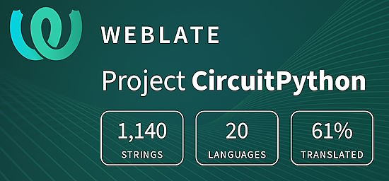](https://hosted.weblate.org/engage/circuitpython/)

One important feature of CircuitPython is translated control and error messages. With the help of fellow open source project [Weblate](https://weblate.org/), we're making it even easier to add or improve translations. 

Sign in with an existing account such as GitHub, Google or Facebook and start contributing through a simple web interface. No forks or pull requests needed! As always, if you run into trouble join us on [Discord](https://adafru.it/discord), we're here to help.

## 37,976 Thanks!

The Adafruit Discord community, where we do all our CircuitPython development in the open, reached over 37,976 humans - thank you! Adafruit believes Discord offers a unique way for Python on hardware folks to connect. Join today at [https://adafru.it/discord](https://adafru.it/discord).

## ICYMI - In case you missed it

Python on hardware is the Adafruit Python video-newsletter-podcast! The news comes from the Python community, Discord, Adafruit communities and more and is broadcast on ASK an ENGINEER Wednesdays. The complete Python on Hardware weekly videocast [playlist is here](https://www.youtube.com/playlist?list=PLjF7R1fz_OOXRMjM7Sm0J2Xt6H81TdDev). The video podcast is on [iTunes](https://itunes.apple.com/us/podcast/python-on-hardware/id1451685192?mt=2), [YouTube](http://adafru.it/pohepisodes), [Instagram Reels](https://www.instagram.com/adafruit/channel/)), and [XML](https://itunes.apple.com/us/podcast/python-on-hardware/id1451685192?mt=2).

[The weekly community chat on Adafruit Discord server CircuitPython channel - Audio / Podcast edition](https://itunes.apple.com/us/podcast/circuitpython-weekly-meeting/id1451685016) - Audio from the Discord chat space for CircuitPython, meetings are usually Mondays at 2pm ET, this is the audio version on [iTunes](https://itunes.apple.com/us/podcast/circuitpython-weekly-meeting/id1451685016), Pocket Casts, [Spotify](https://adafru.it/spotify), and [XML feed](https://adafruit-podcasts.s3.amazonaws.com/circuitpython_weekly_meeting/audio-podcast.xml).

## Contribute!

The CircuitPython Weekly Newsletter is a CircuitPython community-run newsletter emailed every Tuesday. The complete [archives are here](https://www.adafruitdaily.com/category/circuitpython/). It highlights the latest CircuitPython related news from around the web including Python and MicroPython developments. To contribute, edit next week's draft [on GitHub](https://github.com/adafruit/circuitpython-weekly-newsletter/tree/gh-pages/_drafts) and [submit a pull request](https://help.github.com/articles/editing-files-in-your-repository/) with the changes. You may also tag your information on Twitter with #CircuitPython. 

Join the Adafruit [Discord](https://adafru.it/discord) or [post to the forum](https://forums.adafruit.com/viewforum.php?f=60) if you have questions.
