- [ ] Library and info updates
- [ ] change date
- [ ] update title
- [ ] Feature story
- [ ] Update  for images
- [ ] Update ICYDNCI
- [ ] All images 550w max only
- [ ] Link "View this email in your browser."

View this email in your browser.

Welcome to the latest Python on Microcontrollers newsletter! The annual Python developer's Survey is out and it's important for all Python developers to respons, especially embedded development, to ensure equity with the other Python customers. GitHub is reinventing itself, for good or evil. Lots of Raspberry Pi 5 work is being done and RISC-V isn't dead yet, it appears to be thriving. And some very creative projects rounds out the coverage this week - *Anne Barela, Ed.*

We're on [Discord](https://discord.gg/HYqvREz), [Twitter](https://twitter.com/search?q=circuitpython&src=typed_query&f=live), and for past newsletters - [view them all here](https://www.adafruitdaily.com/category/circuitpython/). If you're reading this on the web, [subscribe here](https://www.adafruitdaily.com/). Here's the news this week:

## Python Developers Survey 2023

The Python Software Foundation and JetBrains are conducting the seventh iteration of the official Python Developers Survey. The goal is to capture the current state of the language and the ecosystem around it. By comparing the results with last year’s, they can identify and share with everyone the hottest trends in the Python community and the key insights into it.
 
The PSF encourages you to contribute to our community’s knowledge by sharing your experience and perspective. Your participation is valued! After the survey is over, the PSF will publish the aggregated results and randomly choose 20 winners (among those who complete the survey in its entirety), who will each receive a $100 Amazon Gift Card or a local equivalent - [PSF](https://pyfound.blogspot.com/2023/11/join-python-developers-survey-2023.html) via [X](https://twitter.com/ThePSF/status/1722323603360756206).

## GitHub Leveraging Copilot for an AI-powered developer platform

[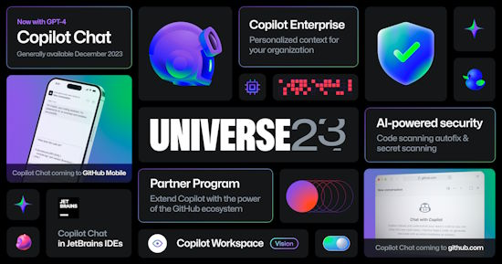](https://github.blog/2023-11-08-universe-2023-copilot-transforms-github-into-the-ai-powered-developer-platform/)

At GitHub Universe 2023, GitHub announced general availability of GitHub Copilot Chat and previews of theie new GitHub Copilot Enterprise offering, new AI-powered security features, and the GitHub Copilot Partner Program. Their new phrase is "Just as GitHub was founded on Git, today we are re-founded on Copilot" - [GitHub Blog](https://github.blog/2023-11-08-universe-2023-copilot-transforms-github-into-the-ai-powered-developer-platform/).

> GitHub is the place where projects get started, where developers collaborate, and where the open source community builds and maintains the world’s code. Now, we’re integrating GitHub Copilot Chat directly into github.com, so developers can dig into code, pull requests, documentation, and general coding questions with Copilot Chat providing suggestions, summaries, analysis, and answers. And, combined with the power of [GitHub’s advanced code search](https://github.com/features/code-search), we are enabling Copilot Chat to understand and help with the latest changes to popular open source projects.

## The Petite Pico Probe is Perfect for Parlaying with a Pi Penta

[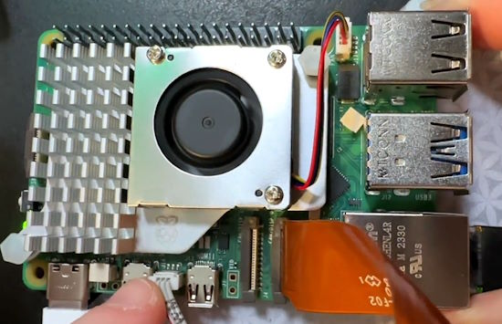](https://twitter.com/adafruit/status/1722318558976184724?t=J0BfzHlefHE1XAid6Ml-rw&s=03)

Ladyada from Adafruit demonstrates debugging the Raspberry Pi 5 via the new UART debug port using the RP2040-based Raspberry Pi Pico Probe - [X](https://twitter.com/adafruit/status/1722318558976184724?t=J0BfzHlefHE1XAid6Ml-rw&s=03).

## Reducing Raspberry Pi 5's Power Consumption By 140x

[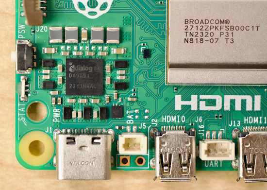](https://www.jeffgeerling.com/blog/2023/reducing-raspberry-pi-5s-power-consumption-140x)

By default, the Raspberry Pi 5 (like the Pi 4 before it) leaves the SoC powered up (just in a shutdown state) when you shut down the Pi. Change an EEPROM config, reboot,  then next time you shut down, you should see power consumption go down from 1-2W to 0.01W or even less - [Jeff Geerling](https://www.jeffgeerling.com/blog/2023/reducing-raspberry-pi-5s-power-consumption-140x) via [Hackaday](https://hackaday.com/2023/11/06/reduce-the-pi-5s-power-consumption-at-a-stroke/).

## Hacking the Pi5's PCIe Into life

[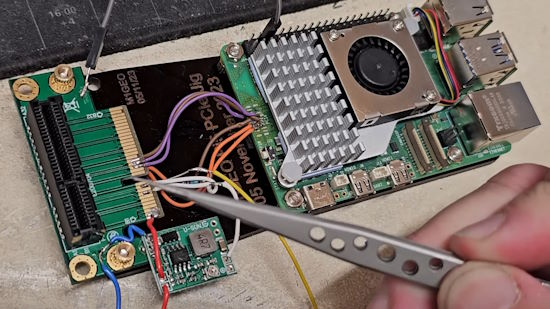](https://www.youtube.com/watch?v=G5VOzO_ERTM)

Folks have been reverse engineering the Raspberry Pi 5 PCIe high speed connector before release of official documentation by Raspberry Pi. George Smart posts on YouTube work to reverse engineer the wiring of the Pi 5 connector - [YouTube](https://www.youtube.com/watch?v=G5VOzO_ERTM) and [Adafruit Blog](https://blog.adafruit.com/2023/11/08/reverse-engineering-the-raspberry-pi-5-pcie-connector-raspberrypi-pcie-m1geo/).

## Why Nordic is Getting Involved in RISC-V

Nordic recently announced that it is joining an industry consortium of semiconductor companies to drive the adoption of an open source chip architecture called RISC-V - [Nordic Blog](https://blog.nordicsemi.com/getconnected/why-nordic-is-getting-involved-in-risc-v).

> "What RISC-V will do is give our customers an extra option when seeking to minimize power consumption in certain applications where the (many) tradeoffs of not using an Arm-based core are acceptable. RISC-V will also lower the barriers-to-entry and level the playing field when it comes to developing IoT applications. This will encourage even greater innovation in the IoT market. What RISC-V will not do is conflict with Nordic's long-established use of Arm cores in its wireless IoT connectivity devices. RISC-V will simply further enhance the design options for Nordic customers and particularly in simpler, ultra lowest power applications where every Joule and Watt counts."

## Making Music with CircuitPython and the Raspberry Pi Pico

[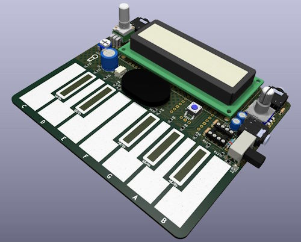](https://pico-synth-sandbox.dcdalrymple.com/)

Anyone looking to do synth music must take a look at the work done by Cooper Dalrymple. Introducing the `pico_synth_sandbox` - a new development board for CircuitPython `synthio` which was featured this past weekend at Pensacola Maker Faire - [pico-synth-sandbox.dcdalrymple.com](https://pico-synth-sandbox.dcdalrymple.com/), [YouTube](https://www.youtube.com/watch?v=vijdwODW_SU) and [GitHub](https://github.com/dcooperdalrymple/pico_synth_sandbox/).

> Want to dive in and started programming your own digital synthesizer? The pico_synth_sandbox might just be the route for you. Leverage the power of the RP2040 and the simplicity and versatility of CircuitPython and the synthio library to get your ideas off the landing strip and into the sky.

## 38,000 Thanks!

The Adafruit Discord community, where CircuitPython development is done in the open, reached over 38,000 humans - thank you! Adafruit believes Discord offers a unique way for Python on hardware folks to connect. Join today at [https://adafru.it/discord](https://adafru.it/discord).

## This Week's Python Streams

Python on Hardware is all about building a cooperative ecosphere which allows contributions to be valued and to grow knowledge. Below are the streams within the last week focusing on the community.

**CircuitPython Deep Dive Stream**

[Last Friday](link), Scott streamed work on {subject}.

You can see the latest video and past videos on the Adafruit YouTube channel under the Deep Dive playlist - [YouTube](https://www.youtube.com/playlist?list=PLjF7R1fz_OOXBHlu9msoXq2jQN4JpCk8A).

**CircuitPython Parsec**

John Park’s CircuitPython Parsec this week is on Set Next Code File - [Adafruit Blog](https://blog.adafruit.com/2023/11/10/john-parks-circuitpython-parsec-set-next-code-file-adafruit-circuitpython/) and [YouTube](https://youtu.be/NZvshzZlQGA).

Catch all the episodes in the [YouTube playlist](https://www.youtube.com/playlist?list=PLjF7R1fz_OOWFqZfqW9jlvQSIUmwn9lWr).

**CircuitPython Weekly Meeting**

CircuitPython Weekly Meeting for November 06, 2023 ([notes](https://github.com/adafruit/adafruit-circuitpython-weekly-meeting/blob/main/2023/2023-11-06.md)) [on YouTube](https://youtu.be/58fBHcE0HN4?si=p0YRP_b_As-8gQFT).

## Project of the Week: Blood Sugar Display

[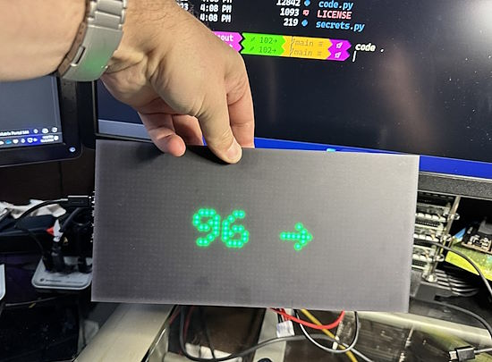](https://twitter.com/shanselman/status/1721324041708208623)

Scott Hanselman builds a project is designed to pull data from a Nightscout and display blood sugar levels in near real-time (every 5 min) on an Adafruit M4 MatrixPortal Display using CircuitPython - [X](https://twitter.com/shanselman/status/1721324041708208623) and [GitHub](https://github.com/shanselman/AdaFruitM4MatrixWithNightScout) via [Mastodon](https://hachyderm.io/@shanselman/111360779185153964).

## Most Popular Last Week

What was the most popular, most clicked link, in [last week's newsletter](https://www.adafruitdaily.com/2023/11/06/python-on-microcontrollers-newsletter-beaglev-fire-is-out-arm-takes-a-bite-of-raspberry-pi-and-more-circuitpython-python-micropython-thepsf-raspberry_pi/)? [PDF book on GPIO Zero (free)](https://github.com/raspberrypipress/released-pdfs/raw/main/simple-electronics-with-gpio-zero.pdf).

## New Notes from Adafruit Playground

[Adafruit Playground](https://adafruit-playground.com/) is a new place for the community to post their projects and other making tips/tricks/techniques. Ad-free, it's an easy way to publish your work in a safe space for free. [Please join](https://adafruit-playground.com/) in posting your projects on Adafruit Playground!

[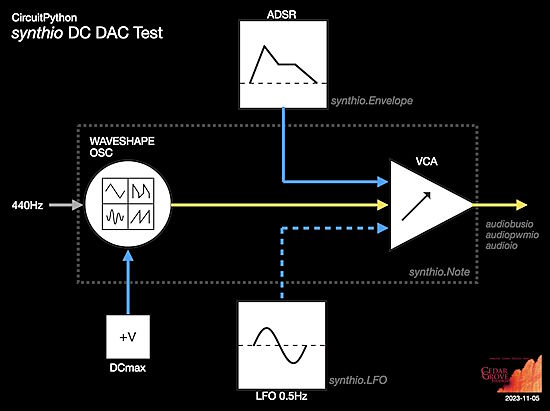](https://adafruit-playground.com/u/CGrover/pages/eurorack-control-voltage-cv-signals-from-synthio)

Eurorack Control Voltage (CV) Signals from `synthio` - [Adafruit Playground](https://adafruit-playground.com/u/CGrover/pages/eurorack-control-voltage-cv-signals-from-synthio).

[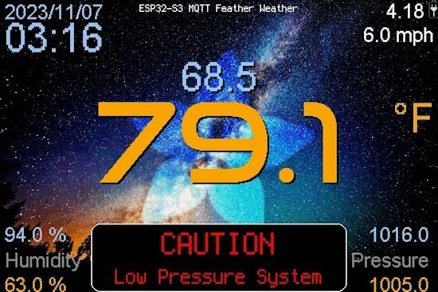](https://blog.adafruit.com/2023/11/07/esp32-s3-mqtt-feather-weather-display-esp32-feather/)

An ESP32-S3 MQTT Feather Weather Display - [Adafruit Playground](https://blog.adafruit.com/2023/11/07/esp32-s3-mqtt-feather-weather-display-esp32-feather/).

## News from around the web!

Bottle Piano is a MIDI controller made of bottles, glitter, and an Adafruit Raspberry Pi RP2040 MCU (and based on an original idea from Adafruit). Coded in CircuitPython and performed in this year's MusicJam project - [X](https://twitter.com/DoomHammerNG/status/1721567613946327479).

[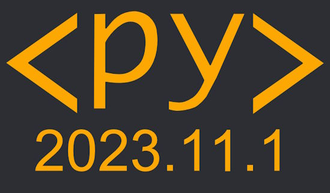](https://jeff.glass/post/whats-new-pyscript-2023-11-1/)

PyScript 2023.11.1 is a ground-up total-rewrite of PyScript that adds a wide swath of new functionality, smaller file sizes, faster loading, and so much more. This release) is a doozy - [jeff.glass](https://jeff.glass/post/whats-new-pyscript-2023-11-1/).

> PyScript now offers you a choice of Python runtimes - you can use either CPython (via Pyodide) or [MicroPython](https://micropython.org/) to execute code. For those unfamiliar with the latter, MicroPython is a very lean Python interpreter originally written for use on microcontrollers, which has since been used in space, in the lab, and in innumerable hobbyists' hands. This makes it a very attractive tool on the web where milliseconds matter.

[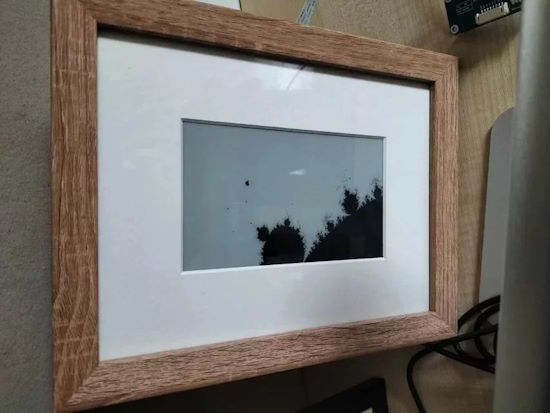](https://www.reddit.com/r/raspberry_pi/comments/17j3l55/raspberry_pi_fractal_art_frame_now_on_github/)

Displaying fractal art on eInk frames with Raspberry Pi and Python - [Reddit](https://www.reddit.com/r/raspberry_pi/comments/17j3l55/raspberry_pi_fractal_art_frame_now_on_github/), [YouTube](https://youtu.be/2JUAojvFpCo) and [GitHub](https://github.com/runezor/PiArtFrame), via [Raspberry Pi](https://www.raspberrypi.com/news/piartframe-displays-fractal-art/).

A Python `async` multitasking tutorial - [YouTube](https://www.youtube.com/watch?v=K56nNuBEd0c).

Adafruit Arcade Buttons and LEDs with MicroPython for the Raspberry Pi Pico - [simonprickett.dev](https://simonprickett.dev/buttons-and-leds-with-micropython-for-pi-pico/).

[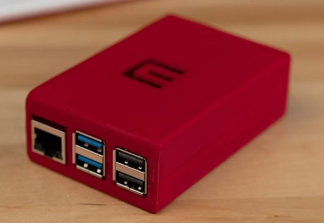](https://www.printables.com/model/605060-raspberry-pi-5-case)

Cases for the new Raspberry Pi 5 are appearing online, like this model provided by Micro Center - [Printables](https://www.printables.com/model/605060-raspberry-pi-5-case).

Making a Harry Potter newspaper PCB with an eInk display, Raspberry Pi Zero and - [hackster.io](https://www.hackster.io/whitney-knitter/harry-potter-newspaper-powered-by-raspberry-pi-zero-3927f8) via [X](https://twitter.com/Hacksterio/status/1719531377681449099?t=z2EdIhphq5_ISppn8WuOnw&s=03).

[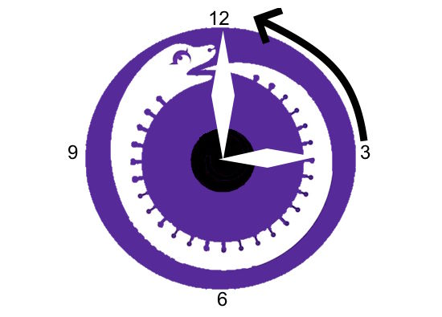](https://github.com/CedarGroveStudios/CircuitPython_DST_Adjuster)

A CircitPython helper to detect and adjust North American Daylight Saving Time (DST) - [GitHub](https://github.com/CedarGroveStudios/CircuitPython_DST_Adjuster).

Hacking an electric scooter with an ESP32 and CircuitPython - [Hackaday](https://hackaday.com/2023/11/06/open-brain-surgery-for-ebikes-and-escooters/).

[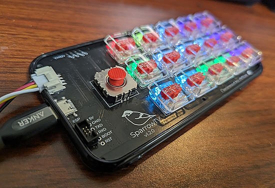](https://twitter.com/74th/status/1722256522334642294)

A Macropad for next to your television, programmed in CircuitPython (Japanese) - [X](https://twitter.com/74th/status/1722256522334642294).

Field testing a RadioFreeFedi display prototype, using a Pimoroni Pico Inky Pack E-paper display for the Raspberry Pi Pico. It shows the currently playing track and can switch between main, comfy and specialty, and can generate a QR code to the artist profile or their music - [Mastodon](https://chaos.social/@axwax/111371062175009377).

BLE performance analysis with pyshark - [Rob Dobbson](https://robdobson.com/2023/10/ble-performance-analysis-with-pyshark/).

[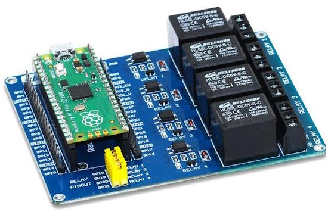](http://www.rp2040learning.com/hardware/a-raspberry-pi-pico-relay-board.php)

A Raspberry Pi Pico relay board programmed in MicroPython - [RP2040 Learning](http://www.rp2040learning.com/hardware/a-raspberry-pi-pico-relay-board.php).

[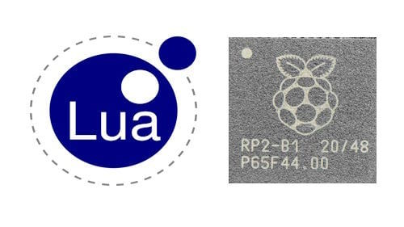](https://blog.adafruit.com/2023/11/08/microlua-lua-for-the-rp2040-microcontroller-rp2040-raspberrypi-lua-raspberry_pi/)

MicroLua: Lua for the RP2040 microcontroller - [Adafruit Blog](https://blog.adafruit.com/2023/11/08/microlua-lua-for-the-rp2040-microcontroller-rp2040-raspberrypi-lua-raspberry_pi/) and [GitHub](https://github.com/MicroLua/MicroLua).

Imagination and Ventana to Build a RISC-V CPU-GPU Platform - [Tom's Hardware](https://www.tomshardware.com/pc-components/cpus/imagination-and-ventana-to-build-a-risc-v-cpu-gpu-platform).

[Faker](https://github.com/joke2k/faker), by Daniele Faraglia, is a Python module that generates fake data. Not for nefarious means, rather it is there to help you generate data to test your databases etc. - [Les Pounder](https://bigl.es/tuesday-tooling-im-a-massive-faker-with-python/).

[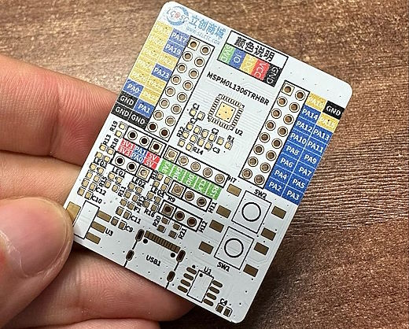](https://twitter.com/JLCPCB/status/1722080906469683461)

JLCPCB plans to launch full-color PCBs via UV printing next year - [X](https://twitter.com/JLCPCB/status/1722080906469683461).

[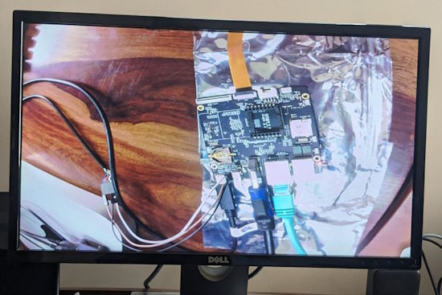](https://twitter.com/dissolveinto/status/1721730313406075288)

Camera drivers for Beagleboard Beagleplay/Beaglebone-AI-64 added to Linux - [X](https://twitter.com/dissolveinto/status/1721730313406075288).

## New

[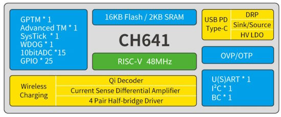](https://twitter.com/patrick_riscv/status/1721436936278302809)

A new RISC-V chip: the CH641. It's like letting a CH32V003 have wireless charging (QI) and USB PD functions. It also built-in 12V pre-driver which can be used directly for motor control without an external pre-driver - [X](https://twitter.com/patrick_riscv/status/1721436936278302809). Devtools - [GitHub](https://github.com/openwch/ch641).

[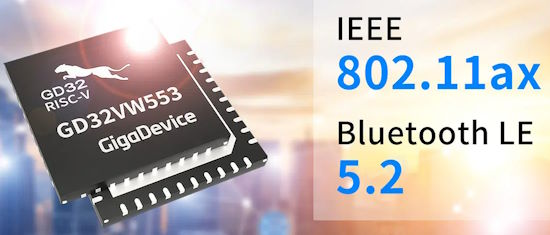](https://www.cnx-software.com/2023/11/10/gigadevice-gd32vw553-risc-v-microcontroller-wifi-6-bluetooth-5-2-le/)

Gigadevice GD32VW553 RISC-V microcontroller supports WiFi 6 and Bluetooth 5.2 LE - [CNX Software](https://www.cnx-software.com/2023/11/10/gigadevice-gd32vw553-risc-v-microcontroller-wifi-6-bluetooth-5-2-le/).

> The GD32VW553 WiFi 6 and Bluetooth 5.2 microcontroller looks quite similar to the ESP32-C6 which also features a RISC-V core clocked at 160 MHz and the same wireless capabilities plus an an extra 802.15.4 radio for Zigbee and Thread. So Gigadevice possibly designed the new chip as an answer to the ESP32-C6 at a cheaper price for application that don’t need an 802.15.4 radio.

## New Boards Supported by CircuitPython

The number of supported microcontrollers and Single Board Computers (SBC) grows every week. This section outlines which boards have been included in CircuitPython or added to [CircuitPython.org](https://circuitpython.org/).

This week, there were no new boards added but several are in the works.

*Note: For non-Adafruit boards, please use the support forums of the board manufacturer for assistance, as Adafruit does not have the hardware to assist in troubleshooting.*

Looking to add a new board to CircuitPython? It's highly encouraged! Adafruit has four guides to help you do so:

- [How to Add a New Board to CircuitPython](https://learn.adafruit.com/how-to-add-a-new-board-to-circuitpython/overview)
- [How to add a New Board to the circuitpython.org website](https://learn.adafruit.com/how-to-add-a-new-board-to-the-circuitpython-org-website)
- [Adding a Single Board Computer to PlatformDetect for Blinka](https://learn.adafruit.com/adding-a-single-board-computer-to-platformdetect-for-blinka)
- [Adding a Single Board Computer to Blinka](https://learn.adafruit.com/adding-a-single-board-computer-to-blinka)

## New Learn Guide

[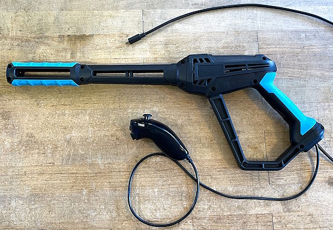](https://learn.adafruit.com/guides/latest)

[PowerWash Simulator Nozzle Controller](https://learn.adafruit.com/powerwash-simulator-nozzle-controller) from [John Park](https://learn.adafruit.com/u/johnpark)

## Updated Learn Guide

[Adafruit Metro ESP32-S3Adafruit Metro ESP32-S3](https://learn.adafruit.com/adafruit-metro-esp32-s3/overview) from [Kattni Rembor](https://learn.adafruit.com/adafruit-metro-esp32-s3/overview)

## CircuitPython Libraries

The CircuitPython library numbers are continually increasing, while existing ones continue to be updated. Here we provide library numbers and updates!

To get the latest Adafruit libraries, download the [Adafruit CircuitPython Library Bundle](https://circuitpython.org/libraries). To get the latest community contributed libraries, download the [CircuitPython Community Bundle](https://circuitpython.org/libraries).

If you'd like to contribute to the CircuitPython project on the Python side of things, the libraries are a great place to start. Check out the [CircuitPython.org Contributing page](https://circuitpython.org/contributing). If you're interested in reviewing, check out Open Pull Requests. If you'd like to contribute code or documentation, check out Open Issues. We have a guide on [contributing to CircuitPython with Git and GitHub](https://learn.adafruit.com/contribute-to-circuitpython-with-git-and-github), and you can find us in the #help-with-circuitpython and #circuitpython-dev channels on the [Adafruit Discord](https://adafru.it/discord).

You can check out this [list of all the Adafruit CircuitPython libraries and drivers available](https://github.com/adafruit/Adafruit_CircuitPython_Bundle/blob/master/circuitpython_library_list.md). 

The current number of CircuitPython libraries is **460**!

**New Libraries**

Here's this week's new CircuitPython libraries:

  * [adafruit/Adafruit_CircuitPython_Qualia](https://github.com/adafruit/Adafruit_CircuitPython_Qualia)
  * [adafruit/Adafruit_CircuitPython_VCNL4020](https://github.com/adafruit/Adafruit_CircuitPython_VCNL4020)
  * [jins-tkomoda/CircuitPython_QMI8658C](https://github.com/jins-tkomoda/CircuitPython_QMI8658C)

**Updated Libraries**

Here's this week's updated CircuitPython libraries:

  * [adafruit/Adafruit_CircuitPython_Slideshow](https://github.com/adafruit/Adafruit_CircuitPython_Slideshow)
  * [adafruit/Adafruit_CircuitPython_SSD1331](https://github.com/adafruit/Adafruit_CircuitPython_SSD1331)
  * [adafruit/Adafruit_CircuitPython_HTTPServer](https://github.com/adafruit/Adafruit_CircuitPython_HTTPServer)
  * [adafruit/Adafruit_CircuitPython_miniQR](https://github.com/adafruit/Adafruit_CircuitPython_miniQR)
  * [adafruit/Adafruit_CircuitPython_PortalBase](https://github.com/adafruit/Adafruit_CircuitPython_PortalBase)

**Library PyPI Weekly Download Stats**

**Top 10 Libraries by PyPI Downloads**

  * Adafruit CircuitPython BusDevice (adafruit-circuitpython-busdevice): 10541
  * Adafruit CircuitPython Requests (adafruit-circuitpython-requests): 10008
  * Adafruit CircuitPython Register (adafruit-circuitpython-register): 4387
  * Adafruit CircuitPython ADS1x15 (adafruit-circuitpython-ads1x15): 2443
  * Adafruit CircuitPython LIS3DH (adafruit-circuitpython-lis3dh): 1989
  * Adafruit CircuitPython Display Text (adafruit-circuitpython-display-text): 1540
  * Adafruit CircuitPython NeoPixel (adafruit-circuitpython-neopixel): 1240
  * Adafruit CircuitPython Pixelbuf (adafruit-circuitpython-pixelbuf): 1186
  * Adafruit CircuitPython PortalBase (adafruit-circuitpython-portalbase): 1158
  * Adafruit CircuitPython Motor (adafruit-circuitpython-motor): 1134

## What’s the CircuitPython team up to this week?

What is the team up to this week? Let’s check in!

**Dan**

I'm now going through the current set of CircuitPython 8.2.x and 9.0.0 issues. I've been able to close several that are now fixed. There are many left to test and fix, and we'll be working on those for a while.

I started the ball rolling on updating CircuitPython `displayio`-related libraries to incorporate the changes introduced in 9.0.0, while still being compatible with 8.x.x. Community members Paul Cutler and RetiredWizard are doing most of the PRs, with FoamyGuy also offering suggestions: thank you!

**Melissa**

This past week, I finished up writing the Adafruit CircuitPython Qualia Library. I ended up generalizing the name instead of something like QualiaS3 or Qualia666 because I didn't want to lock it in. This came in handy when I made the MatrixPortal library For the MatrixPortal M4 and later a MatrixPortal S3 came out. I also realized that 666 displays (named for 6 bit on the Red, Green, and Blue channels) may not be the ony displays supported by this library. The library works very well and I was able to do some surprising stuff with CircuitPython such as automatically enumerating the files and then loading and instantiating the given display, which makes adding new displays much easier.

**Tim**

This week I worked on changes for circup that allow it to check inside of the pyproject.toml to find a list of dependencies that are in CircuitPython bundles, but not deployed to PyPI and install them alongside the other dependencies that it installs. I've also been working through the Learn Guide repo and updating instances of 'displayio' usage for the new API in CircuitPython 9.x.

**Scott**

I haven't been doing a bunch this week because my mom is in the hospital. Dan did merge in the split heap stuff so please try the next 9.0.0 alpha with it. I did a little debugging on SD card support on the ESP32-S3 but didn't figure out the issue. Thanks to Foamyguy for doing Deep Dive last week and this week.

**Liz**

I've continued working on the Mars clock project but ran into an issue when calculating Mars time (MTC). I was hitting the float limits of CircuitPython. Luckily, I was pointed in the direction of the [CircuitPython Decimal library](https://github.com/jepler/Jepler_CircuitPython_udecimal) that Jepler wrote. Using that library, I was able to accurately calculate MTC in CircuitPython and wrap up the code for the project. I documented the process of troubleshooting this issue in a [Playground note](https://adafruit-playground.com/u/BlitzCityDIY/pages/accurately-calculating-coordinated-mars-time-with-circuitpython) that goes through the algorithm for calculating MTC, what the original result was in CircuitPython versus CPython and why the decimal CircuitPython library saves the day.

## Upcoming Events

Webinar: BeagleBoard.org and RISC- V Architecture, Thursday 16th November - 16:00 UK Time - [Element14](https://community.element14.com/learn/events/c/e/1687).

The next MicroPython Meetup in Melbourne will be on November 22nd – [Meetup](https://www.meetup.com/micropython-meetup/events). 

The inaugural PyLadies Conference will take place December 1-3, 2023 - [pretalx](https://pretalx.com/pyladiescon-2023/cfp).

The Pyjamas Conference, the 24-hour online Python conference, will be returning for a fifth year on December 9-10.

PyCon US 2024 Launches - May 15-23, 2024 in Pittsburgh, Pennsylvania US - [PyCon US](https://pycon.blogspot.com/2023/10/pycon-us-2024-launches.html).

**Send Your Events In**

If you know of virtual events or upcoming events, please let us know via email to cpnews(at)adafruit(dot)com.

## Latest Releases

CircuitPython's stable release is [8.2.7](https://github.com/adafruit/circuitpython/releases/latest) and its unstable release is [9.0.0 Alpha 2](https://github.com/adafruit/circuitpython/releases). New to CircuitPython? Start with our [Welcome to CircuitPython Guide](https://learn.adafruit.com/welcome-to-circuitpython).

[20231110](https://github.com/adafruit/Adafruit_CircuitPython_Bundle/releases/latest) is the latest Adafruit CircuitPython library bundle.

[20231105](https://github.com/adafruit/CircuitPython_Community_Bundle/releases/latest) is the latest CircuitPython Community library bundle.

[v1.21.0](https://micropython.org/download) is the latest MicroPython release. Documentation for it is [here](http://docs.micropython.org/en/latest/pyboard/).

[3.12.0](https://www.python.org/downloads/) is the latest Python release. The latest pre-release version is [3.13.0a1](https://www.python.org/download/pre-releases/).

[3,709 Stars](https://github.com/adafruit/circuitpython/stargazers) Like CircuitPython? [Star it on GitHub!](https://github.com/adafruit/circuitpython)

## Call for Help -- Translating CircuitPython is now easier than ever

[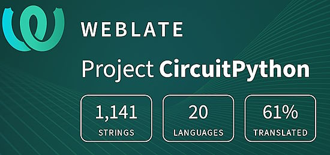](https://hosted.weblate.org/engage/circuitpython/)

One important feature of CircuitPython is translated control and error messages. With the help of fellow open source project [Weblate](https://weblate.org/), we're making it even easier to add or improve translations. 

Sign in with an existing account such as GitHub, Google or Facebook and start contributing through a simple web interface. No forks or pull requests needed! As always, if you run into trouble join us on [Discord](https://adafru.it/discord), we're here to help.

## ICYMI - In case you missed it

Python on hardware is the Adafruit Python video-newsletter-podcast! The news comes from the Python community, Discord, Adafruit communities and more and is broadcast on ASK an ENGINEER Wednesdays. The complete Python on Hardware weekly videocast [playlist is here](https://www.youtube.com/playlist?list=PLjF7R1fz_OOXRMjM7Sm0J2Xt6H81TdDev). The video podcast is on [iTunes](https://itunes.apple.com/us/podcast/python-on-hardware/id1451685192?mt=2), [YouTube](http://adafru.it/pohepisodes), [Instagram Reels](https://www.instagram.com/adafruit/channel/)), and [XML](https://itunes.apple.com/us/podcast/python-on-hardware/id1451685192?mt=2).

[The weekly community chat on Adafruit Discord server CircuitPython channel - Audio / Podcast edition](https://itunes.apple.com/us/podcast/circuitpython-weekly-meeting/id1451685016) - Audio from the Discord chat space for CircuitPython, meetings are usually Mondays at 2pm ET, this is the audio version on [iTunes](https://itunes.apple.com/us/podcast/circuitpython-weekly-meeting/id1451685016), Pocket Casts, [Spotify](https://adafru.it/spotify), and [XML feed](https://adafruit-podcasts.s3.amazonaws.com/circuitpython_weekly_meeting/audio-podcast.xml).

## Contribute

The CircuitPython Weekly Newsletter is a CircuitPython community-run newsletter emailed every Tuesday. The complete [archives are here](https://www.adafruitdaily.com/category/circuitpython/). It highlights the latest CircuitPython related news from around the web including Python and MicroPython developments. To contribute, edit next week's draft [on GitHub](https://github.com/adafruit/circuitpython-weekly-newsletter/tree/gh-pages/_drafts) and [submit a pull request](https://help.github.com/articles/editing-files-in-your-repository/) with the changes. You may also tag your information on Twitter with #CircuitPython. 

Join the Adafruit [Discord](https://adafru.it/discord) or [post to the forum](https://forums.adafruit.com/viewforum.php?f=60) if you have questions.
