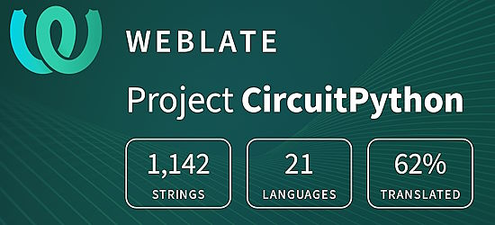

- [ ] Library and info updates
- [ ] change date
- [ ] update title
- [ ] Feature story
- [ ] Update  for images
- [ ] Update ICYDNCI
- [ ] All images 550w max only
- [ ] Link "View this email in your browser."

News Sources

- [Adafruit Playground](https://adafruit-playground.com/)
- Twitter: [CircuitPython](https://twitter.com/search?q=circuitpython&src=typed_query&f=live), [MicroPython](https://twitter.com/search?q=micropython&src=typed_query&f=live) and [Python](https://twitter.com/search?q=python&src=typed_query)
- [Raspberry Pi News](https://www.raspberrypi.com/news/)
- Mastodon [CircuitPython](https://octodon.social/tags/CircuitPython) and [MicroPython](https://octodon.social/tags/MicroPython)
- [hackster.io CircuitPython](https://www.hackster.io/search?q=circuitpython&i=projects&sort_by=most_recent) and [MicroPython](https://www.hackster.io/search?q=micropython&i=projects&sort_by=most_recent)
- [python.org](https://www.python.org/)
- [Python Insider - dev team blog](https://pythoninsider.blogspot.com/)
- [MicroPython Meetup Blog](https://melbournemicropythonmeetup.github.io/)
- [hackaday CircuitPython](https://hackaday.com/blog/?s=circuitpython) and [MicroPython](https://hackaday.com/blog/?s=micropython)
- [hackaday.io newest projects MicroPython](https://hackaday.io/projects?tag=micropython&sort=date) and [CircuitPython](https://hackaday.io/projects?tag=circuitpython&sort=date)
- [https://opensource.com/tags/python](https://opensource.com/tags/python)
- Check Issues and PRs for input

View this email in your browser. **Warning: Flashing Imagery**

Welcome to the latest Python on Microcontrollers newsletter! *insert 2-3 sentences from editor (what's in overview, banter)* - *Anne Barela, Ed.*

We're on [Discord](https://discord.gg/HYqvREz), [Twitter](https://twitter.com/search?q=circuitpython&src=typed_query&f=live), and for past newsletters - [view them all here](https://www.adafruitdaily.com/category/circuitpython/). If you're reading this on the web, [subscribe here](https://www.adafruitdaily.com/). Here's the news this week:

## Headline

text - [site](url).

## CircuitPython 9.0.0 Alpha 5 Released

CircuitPython 9.0.0-alpha.5 is an alpha release for CircuitPython 9.0.0. It has significant known bugs, and will have further additions and fixes before the final release of 9.0.0 - [Adafruit Blog](https://blog.adafruit.com/2023/11/15/circuitpython-9-0-0-alpha-5-released/) and [Release Notes](https://github.com/adafruit/circuitpython/releases/tag/9.0.0-alpha.5).

**Notable changes to 9.0.0**
* New split-heap internal dynamic storage mechanism.
* Merge updates from MicroPython v1.19.1, v1.20.0, and v1.21.0.
* Espressif: update to ESP-IDF v5.1.
* Reorganize and split `displayio`. 8.x.x naming structure is available in 9.x.x, but will be removed in 10.0.0.
* CIRCUITPY drives now mount on Android.
* Increased file capacity on CIRCUITPY drives <= 128kB.
* Further USB host support, on i.MX and RP2040.
* Remove 8.x.x deprecations: `displayio.*.show()`, `I2CPeripheral` renamed to `I2CTarget`.
* Add `repl.py`, which runs just before the REPL starts up.
* Add `OrderedDict.move_to_end()`.
* Add `synthio.Synthesizer.note_state`.
* Add warnings module, similar to what is in CPython.
* Add `locale.getlocale()`.
* Add I2S MCLK support on Espressif.
* Add mDNS TXT record support.

## CircuitPython 8.2.8 Released

CircuitPython 8.2.8, the latest bugfix revision of CircuitPython and is a new stable release - [Adafruit Blog](https://blog.adafruit.com/2023/11/16/circuitpython-8-2-8-released/) and [Release Notes](https://github.com/adafruit/circuitpython/releases/tag/8.2.8).

**Notable changes to 8.2.8 since 8.2.7**
* Add alternative flash chips for many boards. Fixes issue with new-production Adafruit Metro M4 AirLift boards.
* Add `wifi.stop_ap()` for Pico W.
* Fix ESP32 `AnalogIn` on pin IO32.
* Fix race condition in RP2040 `PulseIn`.
* New boards.

## Feature

text - [site](url).

## Feature

text - [site](url).

## Feature

text - [site](url).

## This Week's Python Streams

Python on Hardware is all about building a cooperative ecosphere which allows contributions to be valued and to grow knowledge. Below are the streams within the last week focusing on the community.

**CircuitPython Deep Dive Stream**

[Last Friday](link), Scott streamed work on {subject}.

You can see the latest video and past videos on the Adafruit YouTube channel under the Deep Dive playlist - [YouTube](https://www.youtube.com/playlist?list=PLjF7R1fz_OOXBHlu9msoXq2jQN4JpCk8A).

**CircuitPython Parsec**

John Park’s CircuitPython Parsec this week is on {subject} - [Adafruit Blog](link) and [YouTube](link).

Catch all the episodes in the [YouTube playlist](https://www.youtube.com/playlist?list=PLjF7R1fz_OOWFqZfqW9jlvQSIUmwn9lWr).

**CircuitPython Weekly Meeting**

CircuitPython Weekly Meeting for {date} ([notes](file)) [on YouTube](link).

## Project of the Week

text - [site](url).

## Popular Last Week

What was the most popular, most clicked link, in [last week's newsletter](newslink)? [title](url).

## New Notes from Adafruit Playground

[Adafruit Playground](https://adafruit-playground.com/) is a new place for the community to post their projects and other making tips/tricks/techniques. Ad-free, it's an easy way to publish your work in a safe space for free.

text - [Adafruit Playground](url).

text - [Adafruit Playground](url).

text - [Adafruit Playground](url).

## News from around the web

text - [site](url).

text - [site](url).

text - [site](url).

text - [site](url).

text - [site](url).

text - [site](url).

text - [site](url).

text - [site](url).

text - [site](url).

text - [site](url).

text - [site](url).

text - [site](url).

text - [site](url).

text - [site](url).

text - [site](url).

text - [site](url).

text - [site](url).

text - [site](url).

## Coming Soon / New

text - [site](url).

text - [site](url).

## New Boards Supported by CircuitPython

The number of supported microcontrollers and Single Board Computers (SBC) grows every week. This section outlines which boards have been included in CircuitPython or added to [CircuitPython.org](https://circuitpython.org/).

This week, there were (#/no) new boards added:

- [Board name](url)
- [Board name](url)
- [Board name](url)

*Note: For non-Adafruit boards, please use the support forums of the board manufacturer for assistance, as Adafruit does not have the hardware to assist in troubleshooting.*

Looking to add a new board to CircuitPython? It's highly encouraged! Adafruit has four guides to help you do so:

- [How to Add a New Board to CircuitPython](https://learn.adafruit.com/how-to-add-a-new-board-to-circuitpython/overview)
- [How to add a New Board to the circuitpython.org website](https://learn.adafruit.com/how-to-add-a-new-board-to-the-circuitpython-org-website)
- [Adding a Single Board Computer to PlatformDetect for Blinka](https://learn.adafruit.com/adding-a-single-board-computer-to-platformdetect-for-blinka)
- [Adding a Single Board Computer to Blinka](https://learn.adafruit.com/adding-a-single-board-computer-to-blinka)

## New Learn Guides

[title](url) from [name](url)

[title](url) from [name](url)

[title](url) from [name](url)

## Updated Learn Guides

[title](url) from [name](url)

## CircuitPython Libraries

The CircuitPython library numbers are continually increasing, while existing ones continue to be updated. Here we provide library numbers and updates!

To get the latest Adafruit libraries, download the [Adafruit CircuitPython Library Bundle](https://circuitpython.org/libraries). To get the latest community contributed libraries, download the [CircuitPython Community Bundle](https://circuitpython.org/libraries).

If you'd like to contribute to the CircuitPython project on the Python side of things, the libraries are a great place to start. Check out the [CircuitPython.org Contributing page](https://circuitpython.org/contributing). If you're interested in reviewing, check out Open Pull Requests. If you'd like to contribute code or documentation, check out Open Issues. We have a guide on [contributing to CircuitPython with Git and GitHub](https://learn.adafruit.com/contribute-to-circuitpython-with-git-and-github), and you can find us in the #help-with-circuitpython and #circuitpython-dev channels on the [Adafruit Discord](https://adafru.it/discord).

You can check out this [list of all the Adafruit CircuitPython libraries and drivers available](https://github.com/adafruit/Adafruit_CircuitPython_Bundle/blob/master/circuitpython_library_list.md). 

The current number of CircuitPython libraries is **461**!

**Updated Libraries**

Here's this week's updated CircuitPython libraries:

  * [adafruit/Adafruit_CircuitPython_Wii_Classic](https://github.com/adafruit/Adafruit_CircuitPython_Wii_Classic)
  * [adafruit/Adafruit_CircuitPython_AD569x](https://github.com/adafruit/Adafruit_CircuitPython_AD569x)
  * [adafruit/Adafruit_CircuitPython_miniQR](https://github.com/adafruit/Adafruit_CircuitPython_miniQR)

**Top 10 Libraries by PyPI Downloads**

  * Adafruit CircuitPython BusDevice (adafruit-circuitpython-busdevice): 9384
  * Adafruit CircuitPython Requests (adafruit-circuitpython-requests): 8962
  * Adafruit CircuitPython Register (adafruit-circuitpython-register): 3576
  * Adafruit CircuitPython ADS1x15 (adafruit-circuitpython-ads1x15): 1977
  * Adafruit CircuitPython LIS3DH (adafruit-circuitpython-lis3dh): 1396
  * Adafruit CircuitPython Display Text (adafruit-circuitpython-display-text): 1289
  * Adafruit CircuitPython Motor (adafruit-circuitpython-motor): 1066
  * Adafruit CircuitPython MiniMQTT (adafruit-circuitpython-minimqtt): 1029
  * Adafruit CircuitPython NeoPixel (adafruit-circuitpython-neopixel): 996
  * Adafruit CircuitPython Pixelbuf (adafruit-circuitpython-pixelbuf): 941

## What’s the CircuitPython team up to this week?

What is the team up to this week? Let’s check in:

**Dan**

I released CircuitPython 9.0.0-alpha.5 and 8.2.8 last week. [PROBABLY - CHECK DURING EDIT] The alpha release fixes some significant issues that prevented running larger programs. The 8.2.8 has small fixes, and also handles wider variety of flash chips on various boards, so we can substitute equivalent chips during manufacturing.

I'm continuing to fix more 8.2.x and 9.0.0 bugs as we move toward a 9.0.0 release.

**Melissa**

This past week, I helped Erin St. Blaine out with an upcoming Learn Guide project, which is based on my [Animated Message Board Guide](https://learn.adafruit.com/matrixportal-circuitpython-animated-message-board). In the process, we found a few bugs that I fixed in the Message Board code and update the GitHub Repository.

**Tim**

I updated instances of `displayio` API usage to support the changes in 9.x within learn guide pages. I finished up the code in the Learn repository last week, and then the non-embedded sections of guide pages this week. The other main thing I've been working on is web workflow support within circup so that it can be used to install libraries on devices that don't present as USB storage drives. 

**Jeff**

It's nice to be back from vacation. I've started digging into items on our issue tracker as I work with the rest of the team on stabilizing the development branch after all the changes that have recently been incorporated.

**Scott**

This week I've been mostly out to spend time with family. I did do two major fixes after the split heap changes that were in 9.0.0 alpha 4. One fixed "pystack exhausted" and one fixed memory allocation errors on ESP. Dan is releasing 9.0.0 alpha 5 shortly that should work much better.

**Liz**

This week I worked on the guide and CircuitPython library for the [ADS7830 breakout](https://learn.adafruit.com/adafruit-ads7830-8-channel-8-bit-adc). It is an eight-channel, eight-bit ADC, which means you can use it to add 8 ADC inputs over I2C. I'm currently working on a project with JP that uses two of these breakouts to add 16 slide potentiometers to a project.

## Upcoming Events

The next MicroPython Meetup in Melbourne will be on November 22nd – [Meetup](https://www.meetup.com/micropython-meetup/events). 

The inaugural PyLadies Conference will take place December 1-3, 2023 - [pretalx](https://pretalx.com/pyladiescon-2023/cfp).

The Pyjamas Conference, the 24-hour online Python conference, will be returning for a fifth year on December 9-10.

PyCon US 2024 Launches - May 15-23, 2024 in Pittsburgh, Pennsylvania US - [PyCon US](https://pycon.blogspot.com/2023/10/pycon-us-2024-launches.html).

**Send Your Events In**

If you know of virtual events or upcoming events, please let us know via email to cpnews(at)adafruit(dot)com.

## Latest Releases

CircuitPython's stable release is [#.#.#](https://github.com/adafruit/circuitpython/releases/latest) and its unstable release is [#.#.#-##.#](https://github.com/adafruit/circuitpython/releases). New to CircuitPython? Start with our [Welcome to CircuitPython Guide](https://learn.adafruit.com/welcome-to-circuitpython).

[2023####](https://github.com/adafruit/Adafruit_CircuitPython_Bundle/releases/latest) is the latest Adafruit CircuitPython library bundle.

[2023####](https://github.com/adafruit/CircuitPython_Community_Bundle/releases/latest) is the latest CircuitPython Community library bundle.

[v#.#.#](https://micropython.org/download) is the latest MicroPython release. Documentation for it is [here](http://docs.micropython.org/en/latest/pyboard/).

[#.#.#](https://www.python.org/downloads/) is the latest Python release. The latest pre-release version is [#.#.#](https://www.python.org/download/pre-releases/).

[#,### Stars](https://github.com/adafruit/circuitpython/stargazers) Like CircuitPython? [Star it on GitHub!](https://github.com/adafruit/circuitpython)

## Call for Help -- Translating CircuitPython is now easier than ever

One important feature of CircuitPython is translated control and error messages. With the help of fellow open source project [Weblate](https://weblate.org/), we're making it even easier to add or improve translations. 

Sign in with an existing account such as GitHub, Google or Facebook and start contributing through a simple web interface. No forks or pull requests needed! As always, if you run into trouble join us on [Discord](https://adafru.it/discord), we're here to help.

## NUMBER Thanks

The Adafruit Discord community, where we do all our CircuitPython development in the open, reached over NUMBER humans - thank you! Adafruit believes Discord offers a unique way for Python on hardware folks to connect. Join today at [https://adafru.it/discord](https://adafru.it/discord).

## ICYMI - In case you missed it

Python on hardware is the Adafruit Python video-newsletter-podcast! The news comes from the Python community, Discord, Adafruit communities and more and is broadcast on ASK an ENGINEER Wednesdays. The complete Python on Hardware weekly videocast [playlist is here](https://www.youtube.com/playlist?list=PLjF7R1fz_OOXRMjM7Sm0J2Xt6H81TdDev). The video podcast is on [iTunes](https://itunes.apple.com/us/podcast/python-on-hardware/id1451685192?mt=2), [YouTube](http://adafru.it/pohepisodes), [Instagram Reels](https://www.instagram.com/adafruit/channel/)), and [XML](https://itunes.apple.com/us/podcast/python-on-hardware/id1451685192?mt=2).

[The weekly community chat on Adafruit Discord server CircuitPython channel - Audio / Podcast edition](https://itunes.apple.com/us/podcast/circuitpython-weekly-meeting/id1451685016) - Audio from the Discord chat space for CircuitPython, meetings are usually Mondays at 2pm ET, this is the audio version on [iTunes](https://itunes.apple.com/us/podcast/circuitpython-weekly-meeting/id1451685016), Pocket Casts, [Spotify](https://adafru.it/spotify), and [XML feed](https://adafruit-podcasts.s3.amazonaws.com/circuitpython_weekly_meeting/audio-podcast.xml).

## Contribute

The CircuitPython Weekly Newsletter is a CircuitPython community-run newsletter emailed every Tuesday. The complete [archives are here](https://www.adafruitdaily.com/category/circuitpython/). It highlights the latest CircuitPython related news from around the web including Python and MicroPython developments. To contribute, edit next week's draft [on GitHub](https://github.com/adafruit/circuitpython-weekly-newsletter/tree/gh-pages/_drafts) and [submit a pull request](https://help.github.com/articles/editing-files-in-your-repository/) with the changes. You may also tag your information on Twitter with #CircuitPython. 

Join the Adafruit [Discord](https://adafru.it/discord) or [post to the forum](https://forums.adafruit.com/viewforum.php?f=60) if you have questions.
