- [ ] Library and info updates
- [ ] change date
- [ ] update title
- [ ] Feature story
- [ ] Update  for images
- [ ] Update ICYDNCI
- [ ] All images 550w max only
- [ ] Link "View this email in your browser."

News Sources

- [Adafruit Playground](https://adafruit-playground.com/)
- Twitter: [CircuitPython](https://twitter.com/search?q=circuitpython&src=typed_query&f=live), [MicroPython](https://twitter.com/search?q=micropython&src=typed_query&f=live) and [Python](https://twitter.com/search?q=python&src=typed_query)
- [Raspberry Pi News](https://www.raspberrypi.com/news/)
- Mastodon [CircuitPython](https://octodon.social/tags/CircuitPython) and [MicroPython](https://octodon.social/tags/MicroPython)
- [hackster.io CircuitPython](https://www.hackster.io/search?q=circuitpython&i=projects&sort_by=most_recent) and [MicroPython](https://www.hackster.io/search?q=micropython&i=projects&sort_by=most_recent)
- [python.org](https://www.python.org/)
- [Python Insider - dev team blog](https://pythoninsider.blogspot.com/)
- Individuals: [Jeff Geerling](https://www.jeffgeerling.com/blog)
- [hackaday CircuitPython](https://hackaday.com/blog/?s=circuitpython) and [MicroPython](https://hackaday.com/blog/?s=micropython)
- [hackaday.io newest projects MicroPython](https://hackaday.io/projects?tag=micropython&sort=date) and [CircuitPython](https://hackaday.io/projects?tag=circuitpython&sort=date)
- [https://opensource.com/tags/python](https://opensource.com/tags/python)
- Check Issues and PRs for input

View this email in your browser. **Warning: Flashing Imagery**

Welcome to the latest Python on Microcontrollers newsletter! *insert 2-3 sentences from editor (what's in overview, banter)* - *Anne Barela, Ed.*

We're on [Discord](https://discord.gg/HYqvREz), [Twitter](https://twitter.com/search?q=circuitpython&src=typed_query&f=live), and for past newsletters - [view them all here](https://www.adafruitdaily.com/category/circuitpython/). If you're reading this on the web, [subscribe here](https://www.adafruitdaily.com/). Here's the news this week:

## CircuitPython 8.2.9 Released

[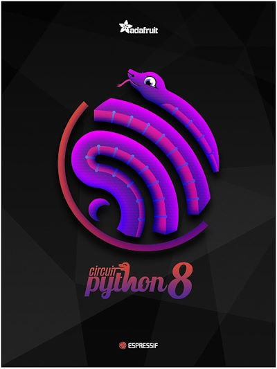](https://blog.adafruit.com/2023/12/06/circuitpython-8-2-9-released/)

CircuitPython 8.2.9 is the latest bugfix revision of CircuitPython and is a new stable release - [Adafruit Blog](https://blog.adafruit.com/2023/12/06/circuitpython-8-2-9-released/) and [GitHub](https://github.com/adafruit/circuitpython/releases/tag/8.2.9).

**Notable changes to 8.2.9 since 8.2.8**
* PIO DMA fix for RP2040.
* New and removed boards.
* Individual board fixes.

## Raspberry Pi Releases the HAT+ Standard and More on PCIe

[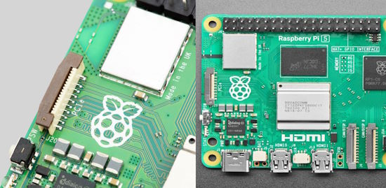](https://www.raspberrypi.com/news/double-standards/)

Two months after the announcement of the Raspberry Pi 5, additional details have been released on the hardware. [Specifications on the PCIe connector](https://datasheets.raspberrypi.com/pcie/pcie-connector-standard.pdf) and required cabling will help hardware developers adhere to hardware specifications. In addition, the new [HAT+ specification](https://datasheets.raspberrypi.com/hat/hat-plus-specification.pdf) updates the 2014 HAT standard for signaling between peripherals and computer - [Raspberry Pi News](https://www.raspberrypi.com/news/double-standards/).

## The First Raspberry Pi OS Update Since Pi 5 Adds Features

[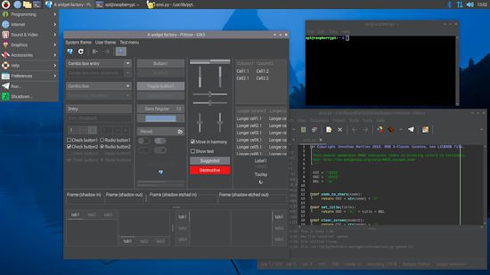](https://www.raspberrypi.com/news/im-theme-ing-of-a-dark-christmas/)

Raspberry Pi OS has now been updated to fix bugs since the launch of their Book worm version. In addition, the update includes improved support for encrypted connections in WayVNC; the latest version of Thonny; Mathematica and Scratch 3 working on Raspberry Pi 5; and a bunch of other small bug fixes and tweaks. And finally, an often requested feature: Dark Mode - [Raspberry Pi News](https://www.raspberrypi.com/news/im-theme-ing-of-a-dark-christmas/) and [The Register](https://www.theregister.com/2023/12/07/raspberry_pi_os_dark_mode/).

## Python 3.12.1 Released

Python 3.12.1 is now available. It is the latest maintenance release containing more than 400 bugfixes, build improvements and documentation changes since 3.12.0 - [Python Insider Blog](https://pythoninsider.blogspot.com/2023/12/python-3121-is-now-available.html).

## Linus Torvalds on the state of Linux today and how AI figures in its future

Linus Torvalds on the state of Linux today and how AI figures in its future - [site](https://www.zdnet.com/article/linus-torvalds-on-state-of-linux-today-and-how-ai-figures-in-its-future/).

> "Linus Torvalds at the Linux Foundation's Open Source Summit Japan talked about the current state of Linux. The next Linux kernel release, Linux 6.7 will arrive right around Christmas.' On AI, Torvalds replied, "I'm convinced it's gonna happen. And it may well be happening already, maybe on a smaller scale where people use it more to help write code."  

## MEMENTO - A Python Programmable DIY Camera 

[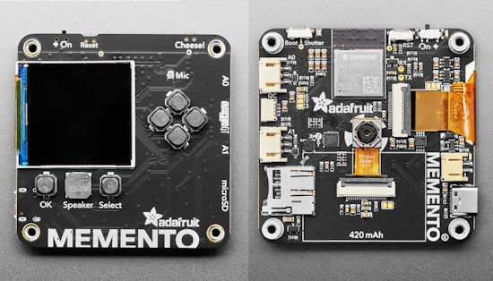](https://www.adafruit.com/product/5420)

Coming soon to adafruit.com, the MEMENTO Camera Board. It's a development board to create programmable camera and vision projects: with a camera module, TFT preview screen, buttons, SD card slot and driven by a powerful ESP32-S3 with 2 MB of PSRAM for buffering 5 MegaPixel camera images. - [Adafruit](https://www.adafruit.com/product/5420).

## Pybricks Team Releases the First Beta of Block Coding for All Modern LEGO® Hubs

[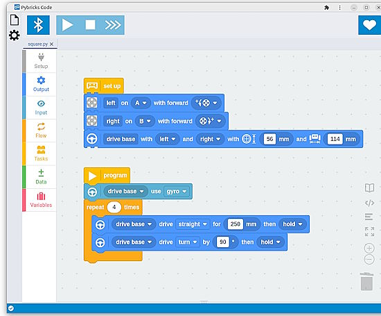](https://pybricks.com/about/new-pybricks-blocks/)

The Pybricks team releaseds the first beta release of block coding for all modern LEGO® hubs. For the first time, fans of all LEGO themes can bring their smart bricks together in a single app. Whether you want to make smart train layouts, autonomous Technic machines, interactive BOOST creatures, or super-precise SPIKE and MINDSTORMS robots, you can do it with Pybricks - [PyBricks](https://pybricks.com/about/new-pybricks-blocks/).

## HP Robots Releases Otto DIY Programmed with MicroPython

[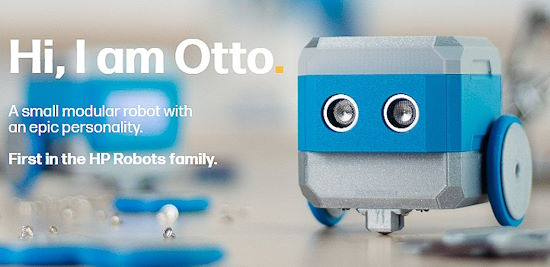](https://hprobots.com/)

[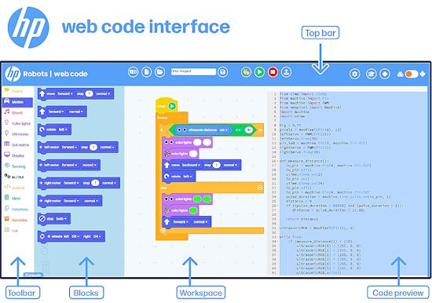](https://hprobots.com/)

Otto is a configurable orobotics kit licensed under HP robots by Moravia. The bots may be programmed in a Blockly language which has MicroPython underneath - [HP Robots](https://hprobots.com/) via [X](https://twitter.com/OttoDIY/status/1730613414018285780?t=WTh7gWWxZnU8ZGNylqhUBA&s=03).

## XDA Developers Choose the Best Single Board Computer for 2023

[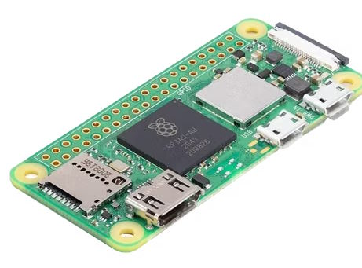](https://www.xda-developers.com/best-single-board-computer/)

XDA looks at the single board computer (SBC) market and choose their favorite eight for 2023 - [XDA](https://www.xda-developers.com/best-single-board-computer/).

## This Week's Python Streams

Python on Hardware is all about building a cooperative ecosphere which allows contributions to be valued and to grow knowledge. Below are the streams within the last week focusing on the community.

**CircuitPython Deep Dive Stream**

[Last Friday](https://www.youtube.com/watch?v=HaYnorjz9Tk), Scott streamed work on CircuitPython workflow refactoring.

You can see the latest video and past videos on the Adafruit YouTube channel under the Deep Dive playlist - [YouTube](https://www.youtube.com/playlist?list=PLjF7R1fz_OOXBHlu9msoXq2jQN4JpCk8A).

**CircuitPython Parsec**

John Park’s CircuitPython Parsec this week is on For Statements with Enumeration - [Adafruit Blog](https://blog.adafruit.com/2023/12/08/john-parks-circuitpython-parsec-for-statements-with-enumeration-adafruit-circuitpython/) and [YouTube](https://youtu.be/63Ft328K6W8).

Catch all the episodes in the [YouTube playlist](https://www.youtube.com/playlist?list=PLjF7R1fz_OOWFqZfqW9jlvQSIUmwn9lWr).

**CircuitPython Weekly Meeting**

CircuitPython Weekly Meeting for December 4, 2023([notes](https://github.com/adafruit/adafruit-circuitpython-weekly-meeting/blob/main/2023/2023-12-04.md)) [on YouTube](https://youtu.be/js676iNzMUI).

## Project of the Week: A CircuitPython-Powered Typewriter

Max Lupo writes about a CircuitPython powered [typewriter project](https://github.com/mlupo/type-type). The project uses an Adafruit KB2040 board to send parallel data to the vintage electronic typewriter via its Centronics (parallel) port - [Mastodon](https://fosstodon.org/@mlupo/111506837985124464).

## Popular Last Week

[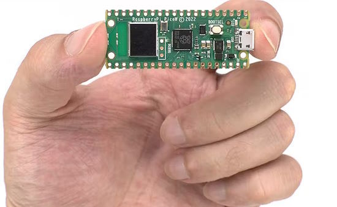](https://www.hackster.io/news/eben-upton-hints-at-an-rp2040-successor-promises-a-raspberry-pi-compute-module-5-in-2024-ec331994aca3)

What was the most popular, most clicked link, in [last week's newsletter](https://www.adafruitdaily.com/2023/12/04/python-on-microcontrollers-newsletter-raspberry-pi-hints-2024-products-eu-and-open-source-and-more-circuitpython-python-micropython-thepsf-raspberry_pi/)? [Eben Upton Hints at an RP2040 Successor, Promises a Raspberry Pi Compute Module 5 in 2024](https://www.hackster.io/news/eben-upton-hints-at-an-rp2040-successor-promises-a-raspberry-pi-compute-module-5-in-2024-ec331994aca3).

## New Notes from Adafruit Playground

[Adafruit Playground](https://adafruit-playground.com/) is a new place for the community to post their projects and other making tips/tricks/techniques. Ad-free, it's an easy way to publish your work in a safe space for free.

Creating a CircuitPython library Bundle for Circup - [Adafruit Playground](https://adafruit-playground.com/u/tyeth/pages/creating-a-circuitpython-library-bundle-for-circup).

Retro blinkenlights: driving 4 charlieplex LED matrices - [Adafruit Playground](https://adafruit-playground.com/u/trevorflowers/pages/retro-blinkenlights-driving-4-charlieplex-led-matrices).

[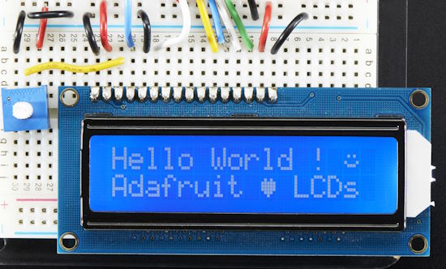](https://adafruit-playground.com/u/dexter_starboard/pages/udp-catcher)

A UDP Catcher with Raspberry Pi Pico W, CircuitPython and a 16x2 character display- [Adafruit Playground](https://adafruit-playground.com/u/dexter_starboard/pages/udp-catcher).

## News from around the web

[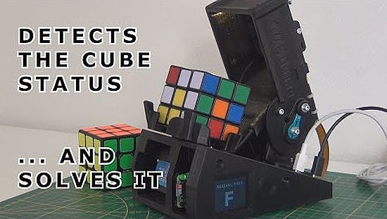](https://www.raspberrypi.com/news/cubotino-the-rubiks-cube-solving-robot/)

CUBOTino, the Rubik’s Cube solving robot. It uses a Raspberry Pi Zero 2W and Python - [Raspberry Pi News](https://www.raspberrypi.com/news/cubotino-the-rubiks-cube-solving-robot/), [GitHub](https://github.com/AndreaFavero71/cubotino) and [Instructables](https://www.instructables.com/CUBOTtino-Micro-the-Worlds-Smallest-Rubiks-Cube-So/).

[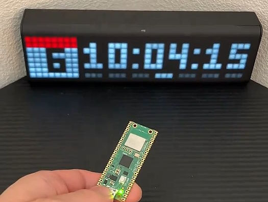](https://twitter.com/sozoraemon/status/1732354102485762338)

The LaMetric Time clock has multiple modes chosen wirelessly using a Raspberry Pi Pico. Programmed in MicroPython - [X](https://twitter.com/sozoraemon/status/1732354102485762338) (Japanese).

Chinese maker Naomi Wu is collaborating with Andrew 'bunnie' Huang to update Bunnie's guide to Shenzhen. The New Essential Guide to Electronics in Shenzhen updates this resource for the present day and is essential for navigating the largest electronics mecca in the world - [Crowd Supply](https://www.crowdsupply.com/machinery-enchantress/the-new-essential-guide-to-electronics-in-shenzhen/) via [Mastodon](https://octodon.social/@SexyCyborg@mastodon.social/111545597950450647) and [X](https://twitter.com/bunniestudios/status/1733148609271759288).

Robot Talk chats with Jorvon Moss (@Odd_Jayy) about making robots at home, and robot design and aesthetics - [Robot Talk](https://www.robottalk.org/2023/11/17/episode-62-jorvon-moss/).

[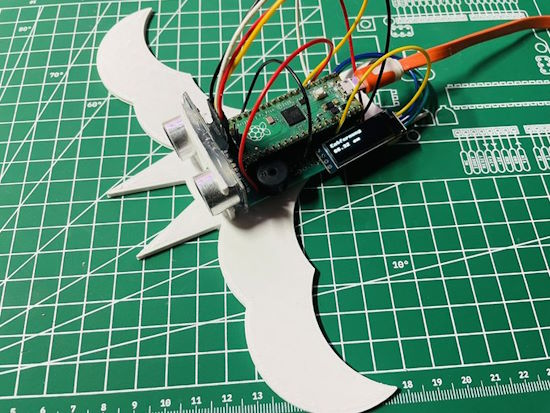](https://twitter.com/r_schulz_maker/status/1730546935860232360)

Roland Schulz has made a simple bat 3D model which can be used to explain to students how it is possible for bats to fly and hunt insects using ultrasound. A speaker and a display show the distance to obstacles. It uses a Raspberry Pi Pico and MicroPython - [X Thread](https://twitter.com/r_schulz_maker/status/1730546935860232360).

[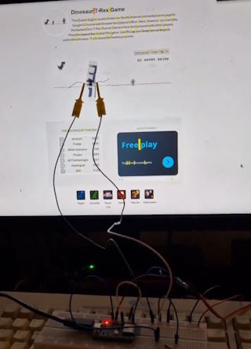](https://twitter.com/splinedrive/status/1731706459451277650)

Automating the Google dinosaur jump game with an ESP32 and MicroPython - [X](https://twitter.com/splinedrive/status/1731706459451277650).

text - [site](url).

text - [site](url).

text - [site](url).

text - [site](url).

text - [site](url).

YOLOv7 pose to OSC output including support for multiple pose detection in Python. Based on the [Yolov7 implementation](https://github.com/WongKinYiu/yolov7) - [The Little-Scale Blog](https://little-scale.blogspot.com/2023/11/yolov7-to-osc.html).

[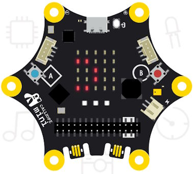](https://python.calliope.cc/)

The Calliope mini Python Editor is a web browser-based editor for Python on a [Calliope mini board](https://calliope.cc/) (which appears to be aimed at German schools) - [python.calliope.cc](https://python.calliope.cc/).

[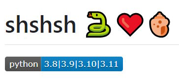](https://github.com/zqqqqz2000/shshsh)

Shshsh is a bridge which connects Python with the Linux shell - [GitHub](https://github.com/zqqqqz2000/shshsh).

[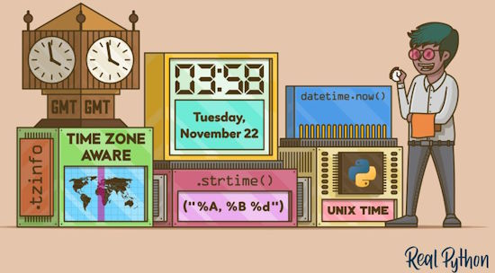](https://realpython.com/courses/python-get-current-time/)

How to Get the current time in Python - [Real Python(https://realpython.com/courses/python-get-current-time/).

text - [site](url).

## New

[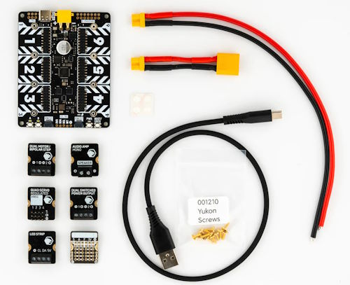](https://shop.pimoroni.com/products/yukon?variant=41185258143827)

Pimoroni Yukon is a high-power modular robotics and engineering platform, built around RP2040 and designed to drive robots, props and devices - [Pimoroni](https://shop.pimoroni.com/products/yukon?variant=41185258143827) via [X](https://twitter.com/ZodiusInfuser/status/1732853160983576749). Programmed in MicroPython - [GitHub](https://github.com/pimoroni/yukon).

[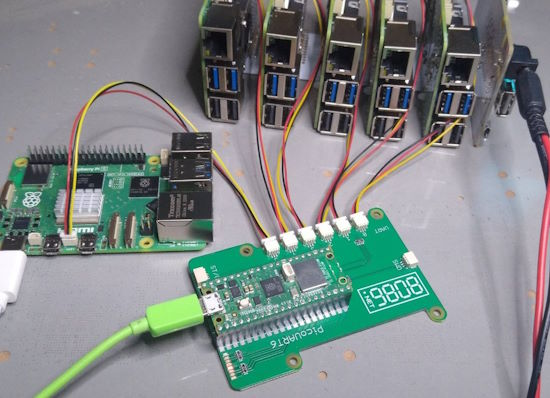](https://www.cnx-software.com/2023/12/04/picouart6-board-6x-uart-to-usb-bridge-6-raspberry-pi-5-boards/)

PicoUART6 6x UART to USB bridge supports up to 6 Raspberry Pi 5 boards. The PicoUART6 board makes use of the new Raspberry Pi 5 UART connector to interface multiple Raspberry Pi 5 over UART and control them through the USB board of the Pico board. - [CNX Software](https://www.cnx-software.com/2023/12/04/picouart6-board-6x-uart-to-usb-bridge-6-raspberry-pi-5-boards/).

[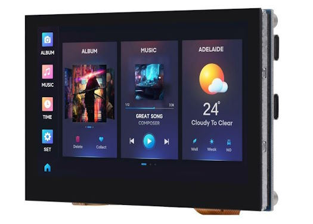](https://www.notebookcheck.net/Waveshare-ESP32-S3-New-board-launches-for-under-US-30-with-integrated-display-for-smart-home-usage.778134.0.html)

Waveshare has an ESP32-S3 based board with an integrated 4.3 inch TFT LCD, RS-485, and CAN bus for home automation and robotics applications - [Notebook Check](https://www.notebookcheck.net/Waveshare-ESP32-S3-New-board-launches-for-under-US-30-with-integrated-display-for-smart-home-usage.778134.0.html).

## New Boards Supported by CircuitPython

The number of supported microcontrollers and Single Board Computers (SBC) grows every week. This section outlines which boards have been included in CircuitPython or added to [CircuitPython.org](https://circuitpython.org/).

This week, there were no new boards added. More are in development.

*Note: For non-Adafruit boards, please use the support forums of the board manufacturer for assistance, as Adafruit does not have the hardware to assist in troubleshooting.*

Looking to add a new board to CircuitPython? It's highly encouraged! Adafruit has four guides to help you do so:

- [How to Add a New Board to CircuitPython](https://learn.adafruit.com/how-to-add-a-new-board-to-circuitpython/overview)
- [How to add a New Board to the circuitpython.org website](https://learn.adafruit.com/how-to-add-a-new-board-to-the-circuitpython-org-website)
- [Adding a Single Board Computer to PlatformDetect for Blinka](https://learn.adafruit.com/adding-a-single-board-computer-to-platformdetect-for-blinka)
- [Adding a Single Board Computer to Blinka](https://learn.adafruit.com/adding-a-single-board-computer-to-blinka)

## New Learn Guides

[Simplifying Qualia CircuitPython Projects](https://learn.adafruit.com/simplifying-qualia-cirtcuitpython-projects) from [M. LeBlanc-Williams](https://learn.adafruit.com/u/MakerMelissa)

## CircuitPython Libraries

The CircuitPython library numbers are continually increasing, while existing ones continue to be updated. Here we provide library numbers and updates!

To get the latest Adafruit libraries, download the [Adafruit CircuitPython Library Bundle](https://circuitpython.org/libraries). To get the latest community contributed libraries, download the [CircuitPython Community Bundle](https://circuitpython.org/libraries).

If you'd like to contribute to the CircuitPython project on the Python side of things, the libraries are a great place to start. Check out the [CircuitPython.org Contributing page](https://circuitpython.org/contributing). If you're interested in reviewing, check out Open Pull Requests. If you'd like to contribute code or documentation, check out Open Issues. We have a guide on [contributing to CircuitPython with Git and GitHub](https://learn.adafruit.com/contribute-to-circuitpython-with-git-and-github), and you can find us in the #help-with-circuitpython and #circuitpython-dev channels on the [Adafruit Discord](https://adafru.it/discord).

You can check out this [list of all the Adafruit CircuitPython libraries and drivers available](https://github.com/adafruit/Adafruit_CircuitPython_Bundle/blob/master/circuitpython_library_list.md). 

The current number of CircuitPython libraries is **468**!

**New Libraries**

Here's this week's new CircuitPython libraries:

  * [adafruit/Adafruit_CircuitPython_PyCamera](https://github.com/adafruit/Adafruit_CircuitPython_PyCamera)

**Updated Libraries**

Here's this week's updated CircuitPython libraries:

  * [adafruit/Adafruit_CircuitPython_RGB_Display](https://github.com/adafruit/Adafruit_CircuitPython_RGB_Display)
  * [adafruit/Adafruit_CircuitPython_Qualia](https://github.com/adafruit/Adafruit_CircuitPython_Qualia)
  * [rgrizzell/CircuitPython_LILYGO_T-Deck](https://github.com/rgrizzell/CircuitPython_LILYGO_T-Deck)

**Library PyPI Weekly Download Stats**

**Total Library Stats**

  * 145627 PyPI downloads over 323 libraries

* **Top 10 Libraries by PyPI Downloads**

  * Adafruit CircuitPython BusDevice (adafruit-circuitpython-busdevice): 11437
  * Adafruit CircuitPython Requests (adafruit-circuitpython-requests): 10753
  * Adafruit CircuitPython Register (adafruit-circuitpython-register): 3602
  * Adafruit CircuitPython ADS1x15 (adafruit-circuitpython-ads1x15): 1576
  * Adafruit CircuitPython MiniMQTT (adafruit-circuitpython-minimqtt): 1485
  * Adafruit CircuitPython NeoPixel (adafruit-circuitpython-neopixel): 1271
  * Adafruit CircuitPython RGB Display (adafruit-circuitpython-rgb-display): 1245
  * Adafruit CircuitPython Motor (adafruit-circuitpython-motor): 1230
  * Adafruit CircuitPython Pixelbuf (adafruit-circuitpython-pixelbuf): 1212
  * Adafruit CircuitPython Display Text (adafruit-circuitpython-display-text): 1210

## What’s the CircuitPython team up to this week?

What is the team up to this week? Let’s check in:

**Dan**

I'm continuing with fixes and additions to CircuitPython 8.2.x and 9.0.0. I released CircuitPython 8.2.9 last week with some minor but useful fixes.

**Melissa**

This week I wrote a Learn guide on [Simplifying Qualia CircuitPython Projects](https://learn.adafruit.com/simplifying-qualia-cirtcuitpython-projects) by using the [Qualia Helper Library](https://github.com/adafruit/Adafruit_CircuitPython_Qualia). I also added information on [using the new 4.58" Bar Display](https://learn.adafruit.com/adafruit-qualia-esp32-s3-for-rgb666-displays/qualia-rgb666-with-hd458002c40-4-58-320x960-bar-display) and [3.7" Bar Display](https://learn.adafruit.com/adafruit-qualia-esp32-s3-for-rgb666-displays/qualia-rgb666-with-hd371001c-3-7-240x960-bar-display). In the process of doing all of that, I found a couple of CircuitPython bugs and am helping with testing out the fixes.

**Tim**

This week I ran a patch on all of the libraries to fix an issue occuring with the docs build inside of Read The Docs. A small chunk of them didn't complete automatically for one reason or another so I went through those ones manually and applied the same fix. I've also continued refactoring the web workflow support proposed for circup.

**Jeff**

This week a lot of things came together. I published the CircuitPython library for the upcoming camera product (PyCamera). I fixed a problem with CircuitPython on the Qualia board for displays that were not a multiple of 16 pixels in width, and I am in the process of adding JPEG decoding to CircuitPython using the TJpg decoder.

Jpeg decoding with bug (or, accidental glitch art):

Jpeg decoding without bug:

[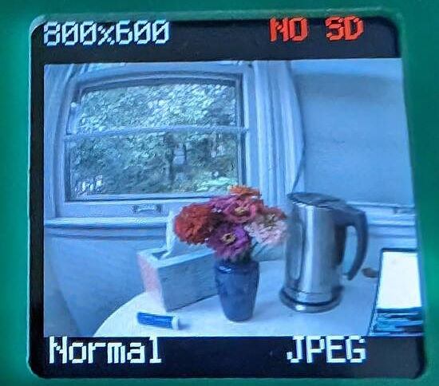](https://www.circuitpython.org/)

**Scott**

This last week I've been in Espressif ESP land. I upgraded the ESP IDF to version 5.1.2 and noticed it features dynamic BLE services. Now we should be able to complete `bleio` support on ESP. (We haven't started though and it's non-trivial.) I've also continued working on improving the web workflow. I [proposed changes](https://github.com/adafruit/circuitpython/pull/8699) to allow SD cards to be used from the web workflow and found and fixed a big bug in the process. 

**Liz**

This week I started working on a couple of different tasks. I'm updating the guide for the 3.5" TFT with Capacitive Touch display for the new revision in the shop. The new version uses the FT5336 capacitive touch driver, so I've written a new CircuitPython driver for it. I also started working on a new project with the Qualia S3 and the 4" round display. The project will be a flight tracker with compass functionality so you can visualize where the flights are overhead. So far I've been working on the `displayio` elements with `vectorio` and next I'll start on calculating the compass math with a 9 DoF sensor.

## Upcoming Events

The next MicroPython Meetup in Melbourne will be on December 27th – [Meetup](https://www.meetup.com/micropython-meetup/events). 

PyCon US 2024 Launches - May 15-23, 2024 in Pittsburgh, Pennsylvania US - [PyCon US](https://pycon.blogspot.com/2023/10/pycon-us-2024-launches.html).

**Send Your Events In**

If you know of virtual events or upcoming events, please let us know via email to cpnews(at)adafruit(dot)com.

## Latest Releases

CircuitPython's stable release is [8.2.9](https://github.com/adafruit/circuitpython/releases/latest) and its unstable release is [9.0.0-alpha5](https://github.com/adafruit/circuitpython/releases). New to CircuitPython? Start with our [Welcome to CircuitPython Guide](https://learn.adafruit.com/welcome-to-circuitpython).

[20231207](https://github.com/adafruit/Adafruit_CircuitPython_Bundle/releases/latest) is the latest Adafruit CircuitPython library bundle.

[20231207](https://github.com/adafruit/CircuitPython_Community_Bundle/releases/latest) is the latest CircuitPython Community library bundle.

[v1.21.0](https://micropython.org/download) is the latest MicroPython release. Documentation for it is [here](http://docs.micropython.org/en/latest/pyboard/).

[3.12.1](https://www.python.org/downloads/) is the latest Python release. The latest pre-release version is [3.13.0a2](https://www.python.org/download/pre-releases/).

[3,733 Stars](https://github.com/adafruit/circuitpython/stargazers) Like CircuitPython? [Star it on GitHub!](https://github.com/adafruit/circuitpython)

## Call for Help -- Translating CircuitPython is now easier than ever

[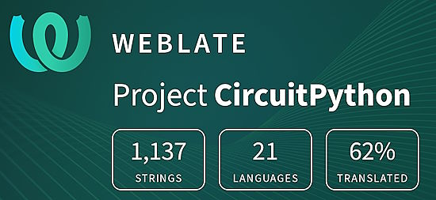](https://hosted.weblate.org/engage/circuitpython/)

One important feature of CircuitPython is translated control and error messages. With the help of fellow open source project [Weblate](https://weblate.org/), we're making it even easier to add or improve translations. 

Sign in with an existing account such as GitHub, Google or Facebook and start contributing through a simple web interface. No forks or pull requests needed! As always, if you run into trouble join us on [Discord](https://adafru.it/discord), we're here to help.

## 38,223 Thanks

The Adafruit Discord community, where we do all our CircuitPython development in the open, reached over 38,223 humans - thank you! Adafruit believes Discord offers a unique way for Python on hardware folks to connect. Join today at [https://adafru.it/discord](https://adafru.it/discord).

## ICYMI - In case you missed it

Python on hardware is the Adafruit Python video-newsletter-podcast! The news comes from the Python community, Discord, Adafruit communities and more and is broadcast on ASK an ENGINEER Wednesdays. The complete Python on Hardware weekly videocast [playlist is here](https://www.youtube.com/playlist?list=PLjF7R1fz_OOXRMjM7Sm0J2Xt6H81TdDev). The video podcast is on [iTunes](https://itunes.apple.com/us/podcast/python-on-hardware/id1451685192?mt=2), [YouTube](http://adafru.it/pohepisodes), [Instagram Reels](https://www.instagram.com/adafruit/channel/)), and [XML](https://itunes.apple.com/us/podcast/python-on-hardware/id1451685192?mt=2).

[The weekly community chat on Adafruit Discord server CircuitPython channel - Audio / Podcast edition](https://itunes.apple.com/us/podcast/circuitpython-weekly-meeting/id1451685016) - Audio from the Discord chat space for CircuitPython, meetings are usually Mondays at 2pm ET, this is the audio version on [iTunes](https://itunes.apple.com/us/podcast/circuitpython-weekly-meeting/id1451685016), Pocket Casts, [Spotify](https://adafru.it/spotify), and [XML feed](https://adafruit-podcasts.s3.amazonaws.com/circuitpython_weekly_meeting/audio-podcast.xml).

## Contribute

The CircuitPython Weekly Newsletter is a CircuitPython community-run newsletter emailed every Tuesday. The complete [archives are here](https://www.adafruitdaily.com/category/circuitpython/). It highlights the latest CircuitPython related news from around the web including Python and MicroPython developments. To contribute, edit next week's draft [on GitHub](https://github.com/adafruit/circuitpython-weekly-newsletter/tree/gh-pages/_drafts) and [submit a pull request](https://help.github.com/articles/editing-files-in-your-repository/) with the changes. You may also tag your information on Twitter with #CircuitPython. 

Join the Adafruit [Discord](https://adafru.it/discord) or [post to the forum](https://forums.adafruit.com/viewforum.php?f=60) if you have questions.
