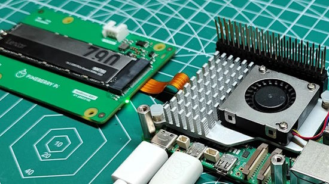
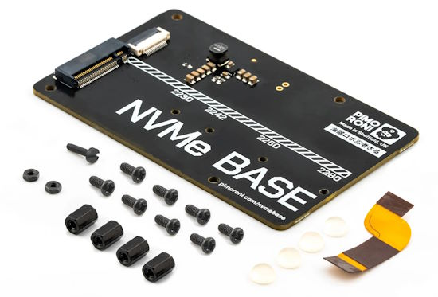
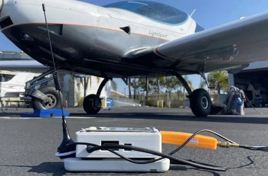
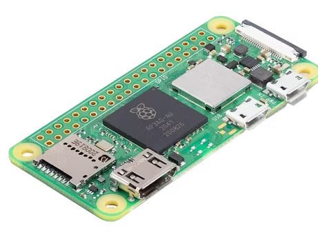
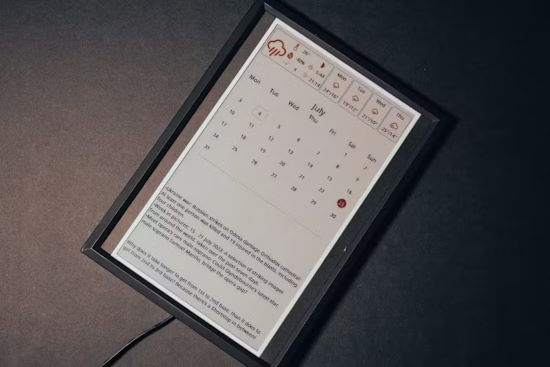
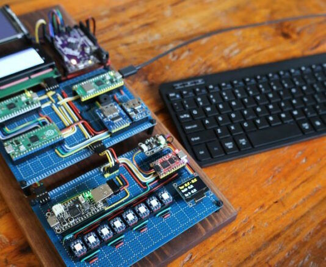
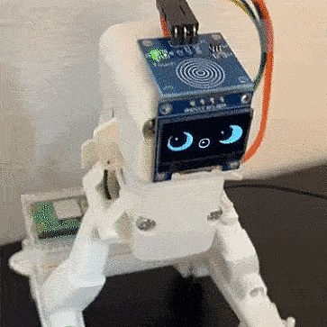
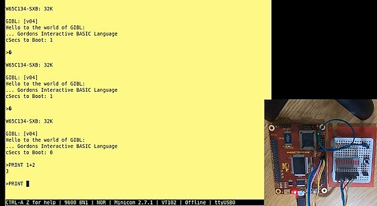
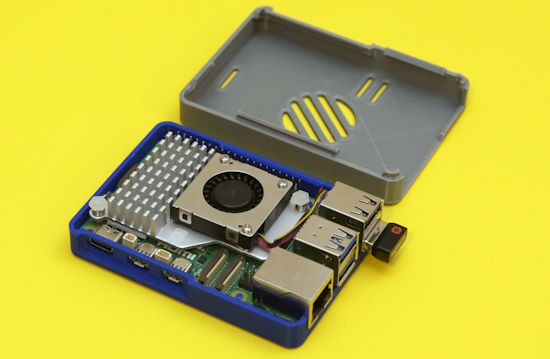
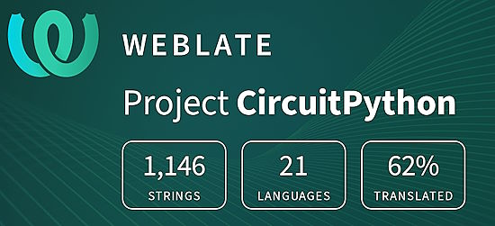

- [ ] Library and info updates
- [ ] change date
- [ ] update title
- [ ] Feature story
- [ ] Update  for images
- [ ] Update ICYDNCI
- [ ] All images 550w max only
- [ ] Link "View this email in your browser."

News Sources

- [Adafruit Playground](https://adafruit-playground.com/)
- Twitter: [CircuitPython](https://twitter.com/search?q=circuitpython&src=typed_query&f=live), [MicroPython](https://twitter.com/search?q=micropython&src=typed_query&f=live) and [Python](https://twitter.com/search?q=python&src=typed_query)
- [Raspberry Pi News](https://www.raspberrypi.com/news/)
- Mastodon [CircuitPython](https://octodon.social/tags/CircuitPython) and [MicroPython](https://octodon.social/tags/MicroPython)
- [hackster.io CircuitPython](https://www.hackster.io/search?q=circuitpython&i=projects&sort_by=most_recent) and [MicroPython](https://www.hackster.io/search?q=micropython&i=projects&sort_by=most_recent)
- [python.org](https://www.python.org/)
- [Python Insider - dev team blog](https://pythoninsider.blogspot.com/)
- Individuals: [Jeff Geerling](https://www.jeffgeerling.com/blog)
- [hackaday CircuitPython](https://hackaday.com/blog/?s=circuitpython) and [MicroPython](https://hackaday.com/blog/?s=micropython)
- [hackaday.io newest projects MicroPython](https://hackaday.io/projects?tag=micropython&sort=date) and [CircuitPython](https://hackaday.io/projects?tag=circuitpython&sort=date)
- [https://opensource.com/tags/python](https://opensource.com/tags/python)
- Check Issues and PRs for input

View this email in your browser. **Warning: Flashing Imagery**

Welcome to the latest Python on Microcontrollers newsletter! *insert 2-3 sentences from editor (what's in overview, banter)* - *Anne Barela, Ed.*

We're on [Discord](https://discord.gg/HYqvREz), [Twitter](https://twitter.com/search?q=circuitpython&src=typed_query&f=live), and for past newsletters - [view them all here](https://www.adafruitdaily.com/category/circuitpython/). If you're reading this on the web, [subscribe here](https://www.adafruitdaily.com/). Here's the news this week:

## CircuitPython 9.0.0 Alpha 6 Released

CircuitPython 9.0.0-alpha.6, an alpha release for 9.0.0 has been released. It has significant known bugs, and will have further additions and fixes before the final release of 9.0.0 - [Adafruit Blog](https://blog.adafruit.com/2023/12/12/circuitpython-9-0-0-alpha-6-released/) and [GitHub Release Notes](https://github.com/adafruit/circuitpython/releases/tag/9.0.0-alpha.6).

**Notable changes to 9.0.0**

* New split-heap internal dynamic storage mechanism.
* Merge updates from MicroPython v1.19.1, v1.20.0, and v1.21.0.
* Espressif: update to ESP-IDF v5.1.2.
* Reorganize and split displayio. 8.x.x naming structure is available in 9.x.x, but will be removed in 10.0.0.
* CIRCUITPY drives now mount on Android.
* Increased file capacity on CIRCUITPY drives <= 128kB.
* Further USB host support, on i.MX and RP2040.
* Remove 8.x.x deprecations: displayio.*.show(), I2CPeripheral renamed to I2CTarget.
* Add jpegio JPEG decoder support.
* Add repl.py, which runs just before the REPL starts up.
* Add OrderedDict.move_to_end().
* Add synthio.Synthesizer.note_state.
* Add warnings module, similar to what is in CPython.
* Add locale.getlocale().
* Add I2S MCLK support on Espressif.
* Add mDNS TXT record support.
* Add synthio.Note .loop_start and .loop_end properties.
* Allow signed amplitude in synthio.

## Feature

text - [site](url).

## Feature

text - [site](url).

## Feature

text - [site](url).

## Feature

text - [site](url).

## How to Turbo-Charge Your Raspberry Pi 5 With an NVMe Boot Drive

Turbo-charge your Raspberry Pi 5 with an NVMe flash SSD boot drive. Les  Pounder shows how to add the drive to a Pi 5 step by step with the Pineberry Pi PCIe board - [Tom's Hardware](https://www.tomshardware.com/raspberry-pi/how-to-turbo-charge-your-raspberry-pi-5-with-an-nvme-boot-drive).

And other PCIe storage boards are coming to market:

Pimoroni NVMe Base coming soon to add M.2 SSDs to RasPi 5 - [Notebook Check](https://www.notebookcheck.net/Raspberry-Pi-5-Pimoroni-NVMe-Base-arrives-as-cheaper-way-to-add-M-2-SSDs-to-popular-single-board-computer.780666.0.html).

## This Week's Python Streams

Python on Hardware is all about building a cooperative ecosphere which allows contributions to be valued and to grow knowledge. Below are the streams within the last week focusing on the community.

**CircuitPython Deep Dive Stream**

[Last Friday](link), Scott streamed work on {subject}.

You can see the latest video and past videos on the Adafruit YouTube channel under the Deep Dive playlist - [YouTube](https://www.youtube.com/playlist?list=PLjF7R1fz_OOXBHlu9msoXq2jQN4JpCk8A).

**CircuitPython Parsec**

John Park’s CircuitPython Parsec this week is on {subject} - [Adafruit Blog](link) and [YouTube](link).

Catch all the episodes in the [YouTube playlist](https://www.youtube.com/playlist?list=PLjF7R1fz_OOWFqZfqW9jlvQSIUmwn9lWr).

**The CircuitPython Show**

The CircuitPython Show is an independent podcast hosted by Paul Cutler, focusing on the people doing awesome things with CircuitPython. Each episode features Paul in conversation with a guest for a short interview – [CircuitPython Show](https://www.circuitpythonshow.com/).

The latest episode was released December 18th and features Jan Goolsbey. Jan and Paul discuss the CircuitPython Community Bundle, Jan's IoT wind chimes project, and the string car racer project.

**CircuitPython Weekly Meeting**

CircuitPython Weekly Meeting for December 11, 2023 ([notes](https://github.com/adafruit/adafruit-circuitpython-weekly-meeting/blob/main/2023/2023-12-11.md)) [on YouTube](https://www.youtube.com/watch?v=b4RFRgLTfZE).

## Project of the Week: Detecting Ghost Aircraft with Python

Angelina Tsuboi has created what she calls Fly Catcher — a Raspberry Pi-powered system that can detect false aircraft using Automatic Dependent Surveillance. Fly Catcher works by monitoring the 1090MHz frequency and can determine whether or not a potential aircraft is genuine thanks to a neural network developed just for this project, with the app coded in Python - [Tom's Hardware](https://www.tomshardware.com/raspberry-pi/raspberry-pi-detects-ghost-aircraft-using-sdr), [YouTube](https://youtu.be/NJ9ep0IlddA) and [GitHub](https://github.com/ANG13T/fly-catcher).

## Popular Last Week

What was the most popular, most clicked link, in [last week's newsletter](https://www.adafruitdaily.com/2023/12/11/python-on-microcontrollers-newsletter-new-python-and-circuitpython-versions-raspi-5-developments-and-much-more-circuitpython-python-micropython-thepsf-raspberry_pi/)? [Best single board computer in 2023](https://www.xda-developers.com/best-single-board-computer/).

## New Notes from Adafruit Playground

[Adafruit Playground](https://adafruit-playground.com/) is a new place for the community to post their projects and other making tips/tricks/techniques. Ad-free, it's an easy way to publish your work in a safe space for free.

text - [Adafruit Playground](url).

Making alternative mouse buttons - [Adafruit Playground](https://adafruit-playground.com/u/dexter_starboard/pages/two-hand-mouse).

text - [Adafruit Playground](url).

## News from around the web

Inkycal is software for select E-Paper displays written in Python. It converts these displays into useful information dashboards. It's open-source, free for personal use, fully modular and user-friendly. Despite all this, Inkycal can run well even on the Raspberry Pi Zero - [GitHub](https://github.com/aceinnolab/Inkycal) and [hackaday.io](https://www.hackster.io/news/ace-innovation-lab-s-inkycal-v3-puts-a-raspberry-pi-powered-modular-epaper-dashboard-on-your-desk-b55a83cc0f46).

Making a homebrew computer using microcontrollers - [Adafruit Blog](https://blog.adafruit.com/2023/12/11/making-a-homebrew-computer-using-microcontrollers-microchipmakes-hackadayio/), [YouTube](https://youtu.be/exvY3OEy6o0) and [hackaday.io](https://hackaday.io/project/193995-homebrew-computer-os-from-modern-mcus).

A pet robot who gets sleepy when petted programmed in MicroPython - [X](https://blog.adafruit.com/2023/12/12/a-pet-robot-who-gets-sleepy-when-petted-micropython-sozoraemon/) and [Adafruit Blog](https://blog.adafruit.com/2023/12/12/a-pet-robot-who-gets-sleepy-when-petted-micropython-sozoraemon/).

text - [site](url).

text - [site](url).

text - [site](url).

Jasper Devreker sets his sights on a fully-open WiFi stack for Espressif's ESP32 microcontrollers - [hackster.io](https://www.hackster.io/news/jasper-devreker-sets-his-sights-on-a-fully-open-wi-fi-stack-for-espressif-s-esp32-microcontrollers-57733a9ee18a).

text - [site](url).

text - [site](url).

text - [site](url).

text - [site](url).

text - [site](url).

text - [site](url).

text - [site](url).

text - [site](url).

text - [site](url).

Porting TinyBasic to the W65C134-SXB - [Gordons Projects](https://projects.drogon.net/porting-my-tinybasic-to-the-w65c134-sxb/) and [YouTube](https://youtu.be/-66T_P7qPq4).

text - [site](url).

## Coming Soon / New

text - [site](url).

text - [site](url).

## New Boards Supported by CircuitPython

The number of supported microcontrollers and Single Board Computers (SBC) grows every week. This section outlines which boards have been included in CircuitPython or added to [CircuitPython.org](https://circuitpython.org/).

This week, there were (#/no) new boards added:

- [Board name](url)
- [Board name](url)
- [Board name](url)

*Note: For non-Adafruit boards, please use the support forums of the board manufacturer for assistance, as Adafruit does not have the hardware to assist in troubleshooting.*

Looking to add a new board to CircuitPython? It's highly encouraged! Adafruit has four guides to help you do so:

- [How to Add a New Board to CircuitPython](https://learn.adafruit.com/how-to-add-a-new-board-to-circuitpython/overview)
- [How to add a New Board to the circuitpython.org website](https://learn.adafruit.com/how-to-add-a-new-board-to-the-circuitpython-org-website)
- [Adding a Single Board Computer to PlatformDetect for Blinka](https://learn.adafruit.com/adding-a-single-board-computer-to-platformdetect-for-blinka)
- [Adding a Single Board Computer to Blinka](https://learn.adafruit.com/adding-a-single-board-computer-to-blinka)

## New Learn Guides

[Raspberry Pi 5 3D Printed Case](https://learn.adafruit.com/pi-5-case) from [Ruiz Brothers](https://learn.adafruit.com/u/pixil3d)

## Updated Learn Guides

[Adafruit 3.5" 320x480 Color TFT Touchscreen Breakout](https://learn.adafruit.com/adafruit-3-5-color-320x480-tft-touchscreen-breakout) from [lady ada](https://learn.adafruit.com/u/adafruit2)

[Adafruit Qualia ESP32-S3 for RGB-666 Displays](https://learn.adafruit.com/adafruit-qualia-esp32-s3-for-rgb666-displays) from [M. LeBlanc-Williams](https://learn.adafruit.com/u/MakerMelissa)

## CircuitPython Libraries

The CircuitPython library numbers are continually increasing, while existing ones continue to be updated. Here we provide library numbers and updates!

To get the latest Adafruit libraries, download the [Adafruit CircuitPython Library Bundle](https://circuitpython.org/libraries). To get the latest community contributed libraries, download the [CircuitPython Community Bundle](https://circuitpython.org/libraries).

If you'd like to contribute to the CircuitPython project on the Python side of things, the libraries are a great place to start. Check out the [CircuitPython.org Contributing page](https://circuitpython.org/contributing). If you're interested in reviewing, check out Open Pull Requests. If you'd like to contribute code or documentation, check out Open Issues. We have a guide on [contributing to CircuitPython with Git and GitHub](https://learn.adafruit.com/contribute-to-circuitpython-with-git-and-github), and you can find us in the #help-with-circuitpython and #circuitpython-dev channels on the [Adafruit Discord](https://adafru.it/discord).

You can check out this [list of all the Adafruit CircuitPython libraries and drivers available](https://github.com/adafruit/Adafruit_CircuitPython_Bundle/blob/master/circuitpython_library_list.md). 

The current number of CircuitPython libraries is **###**!

**New Libraries**

Here's this week's new CircuitPython libraries:

* [library](url)

**Updated Libraries**

Here's this week's updated CircuitPython libraries:

* [library](url)

**Library PyPI Weekly Download Stats**

## What’s the CircuitPython team up to this week?

What is the team up to this week? Let’s check in:

**Dan**

I released CircuitPython 9.0.0-alpha.6 last week, about a month after alpha.5. Alpha.6 has jpegio courtesy Jeff, and about 50 other fixes and improvements.

I'm continuing to debug issues with the NINA-FW firmware used on AirLift boards, now with Ha Thach's help. Some things that did not work a couple of months ago are now working, which is quite confusing.

**Melissa**

This past week, I worked on updating the [circuitpython.org](https://circuitpython.org/) website to allow using multiple URLs with each board. This is in preparation for a new feature on the Adafruit website to identify boards that can run CircuitPython. I also updated the Arduino library used for the Qualia displays to add a new parameter similar to CircuitPython so that a couple of bar displays that require an overscan parameter can be used.

**Tim**

This week I used a recently utility I added recently to Adabot to release all of the libraries that were changed by the patch rollout from last week. As with the patch itself there were a few that the utility didn't work on so I tracked them down and fixed various infrastructure issues to get them sorted out. I believe I'm nearing the end of the work in circup to refactor proposed addition of support for web workflow.

**Jeff**

Last week I added support for jpeg decoding in CircuitPython, which has appeared in the latest release. We enabled the new `jpegio` module on as many boards as we could. I'm in the process of making an adaptation of an existing guide to use `jpegio` and qualia instead of using Adafruit IO to convert a JPEG image to a format that CircuitPython can handle.

**Scott**

This week I've been around off and on. I've been keeping up with emails and reviews but not a ton else. My main focus is to add SD card support to the BLE and web workflows. To make that easier, I'm doing a bit of refactoring to share code and clarify how filesystems are locked. The locking will prevent one workflow from reading while another is in the middle of a something. An interrupted change can look like corruption and an interrupted read could slow both reads down.

**Liz**

This week I worked on a CircuitPython library for the FT5336 capacitive touch driver and [updated the associated guide](https://learn.adafruit.com/adafruit-3-5-color-320x480-tft-touchscreen-breakout) for the new 3.5" 480x320 display. This driver allows for up to 5 simultaneous touch points and the libraries for both Arduino and CircuitPython can keep track of the coordinates for each touch in a list which could make for some interesting projects. I also finally setup a Raspberry Pi 5 with Raspberry Pi OS Bookworm. I had been putting it off because I had heard about all of the changes for Python but the [updated Blinka guide](https://learn.adafruit.com/circuitpython-on-raspberrypi-linux) made everything go very smoothly.

## Upcoming Events

The next MicroPython Meetup in Melbourne will be on December 27th – [Meetup](https://www.meetup.com/micropython-meetup/events). 

PyCon US 2024 Launches - May 15-23, 2024 in Pittsburgh, Pennsylvania US - [PyCon US](https://pycon.blogspot.com/2023/10/pycon-us-2024-launches.html).

**Send Your Events In**

If you know of virtual events or upcoming events, please let us know via email to cpnews(at)adafruit(dot)com.

## Latest Releases

CircuitPython's stable release is [#.#.#](https://github.com/adafruit/circuitpython/releases/latest) and its unstable release is [#.#.#-##.#](https://github.com/adafruit/circuitpython/releases). New to CircuitPython? Start with our [Welcome to CircuitPython Guide](https://learn.adafruit.com/welcome-to-circuitpython).

[2023####](https://github.com/adafruit/Adafruit_CircuitPython_Bundle/releases/latest) is the latest Adafruit CircuitPython library bundle.

[2023####](https://github.com/adafruit/CircuitPython_Community_Bundle/releases/latest) is the latest CircuitPython Community library bundle.

[v#.#.#](https://micropython.org/download) is the latest MicroPython release. Documentation for it is [here](http://docs.micropython.org/en/latest/pyboard/).

[#.#.#](https://www.python.org/downloads/) is the latest Python release. The latest pre-release version is [#.#.#](https://www.python.org/download/pre-releases/).

[#,### Stars](https://github.com/adafruit/circuitpython/stargazers) Like CircuitPython? [Star it on GitHub!](https://github.com/adafruit/circuitpython)

## Call for Help -- Translating CircuitPython is now easier than ever

One important feature of CircuitPython is translated control and error messages. With the help of fellow open source project [Weblate](https://weblate.org/), we're making it even easier to add or improve translations. 

Sign in with an existing account such as GitHub, Google or Facebook and start contributing through a simple web interface. No forks or pull requests needed! As always, if you run into trouble join us on [Discord](https://adafru.it/discord), we're here to help.

## NUMBER Thanks

The Adafruit Discord community, where we do all our CircuitPython development in the open, reached over NUMBER humans - thank you! Adafruit believes Discord offers a unique way for Python on hardware folks to connect. Join today at [https://adafru.it/discord](https://adafru.it/discord).

## ICYMI - In case you missed it

Python on hardware is the Adafruit Python video-newsletter-podcast! The news comes from the Python community, Discord, Adafruit communities and more and is broadcast on ASK an ENGINEER Wednesdays. The complete Python on Hardware weekly videocast [playlist is here](https://www.youtube.com/playlist?list=PLjF7R1fz_OOXRMjM7Sm0J2Xt6H81TdDev). The video podcast is on [iTunes](https://itunes.apple.com/us/podcast/python-on-hardware/id1451685192?mt=2), [YouTube](http://adafru.it/pohepisodes), [Instagram Reels](https://www.instagram.com/adafruit/channel/)), and [XML](https://itunes.apple.com/us/podcast/python-on-hardware/id1451685192?mt=2).

[The weekly community chat on Adafruit Discord server CircuitPython channel - Audio / Podcast edition](https://itunes.apple.com/us/podcast/circuitpython-weekly-meeting/id1451685016) - Audio from the Discord chat space for CircuitPython, meetings are usually Mondays at 2pm ET, this is the audio version on [iTunes](https://itunes.apple.com/us/podcast/circuitpython-weekly-meeting/id1451685016), Pocket Casts, [Spotify](https://adafru.it/spotify), and [XML feed](https://adafruit-podcasts.s3.amazonaws.com/circuitpython_weekly_meeting/audio-podcast.xml).

## Contribute

The CircuitPython Weekly Newsletter is a CircuitPython community-run newsletter emailed every Tuesday. The complete [archives are here](https://www.adafruitdaily.com/category/circuitpython/). It highlights the latest CircuitPython related news from around the web including Python and MicroPython developments. To contribute, edit next week's draft [on GitHub](https://github.com/adafruit/circuitpython-weekly-newsletter/tree/gh-pages/_drafts) and [submit a pull request](https://help.github.com/articles/editing-files-in-your-repository/) with the changes. You may also tag your information on Twitter with #CircuitPython. 

Join the Adafruit [Discord](https://adafru.it/discord) or [post to the forum](https://forums.adafruit.com/viewforum.php?f=60) if you have questions.
