- [ ] Library and info updates
- [ ] change date
- [ ] update title
- [ ] Feature story
- [ ] Update  for images
- [ ] Update ICYDNCI
- [ ] All images 550w max only
- [ ] Link "View this email in your browser."

News Sources

- [Adafruit Playground](https://adafruit-playground.com/)
- Twitter: [CircuitPython](https://twitter.com/search?q=circuitpython&src=typed_query&f=live), [MicroPython](https://twitter.com/search?q=micropython&src=typed_query&f=live) and [Python](https://twitter.com/search?q=python&src=typed_query)
- [Raspberry Pi News](https://www.raspberrypi.com/news/)
- Mastodon [CircuitPython](https://octodon.social/tags/CircuitPython) and [MicroPython](https://octodon.social/tags/MicroPython)
- [hackster.io CircuitPython](https://www.hackster.io/search?q=circuitpython&i=projects&sort_by=most_recent) and [MicroPython](https://www.hackster.io/search?q=micropython&i=projects&sort_by=most_recent)
- [python.org](https://www.python.org/)
- [Python Insider - dev team blog](https://pythoninsider.blogspot.com/)
- Individuals: [Jeff Geerling](https://www.jeffgeerling.com/blog)
- [hackaday CircuitPython](https://hackaday.com/blog/?s=circuitpython) and [MicroPython](https://hackaday.com/blog/?s=micropython)
- [hackaday.io newest projects MicroPython](https://hackaday.io/projects?tag=micropython&sort=date) and [CircuitPython](https://hackaday.io/projects?tag=circuitpython&sort=date)
- [https://opensource.com/tags/python](https://opensource.com/tags/python)
- Check Issues and PRs for input

View this email in your browser. **Warning: Flashing Imagery**

Welcome to the latest Python on Microcontrollers newsletter! We certainly hope you are enjoying the holidays! Your newsletter is out on time every Monday, no matter the occasion, and what better way to read it but with a warm drink in the Northern hemisphere and a cold drink in the South. - *Anne Barela, Ed.*

We're on [Discord](https://discord.gg/HYqvREz), [Twitter](https://twitter.com/search?q=circuitpython&src=typed_query&f=live), and for past newsletters - [view them all here](https://www.adafruitdaily.com/category/circuitpython/). If you're reading this on the web, [subscribe here](https://www.adafruitdaily.com/). Here's the news this week:

## Headline

text - [site](url).

## A Programmable Keyboard and Standalone CircuitPython Computer

[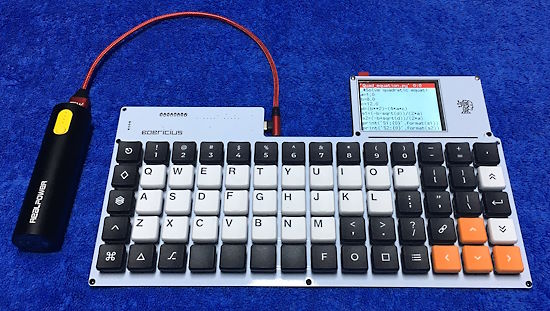](https://hackaday.io/project/193912-kailh-choc-low-profile-ortholinear-keyboard-14x5)

bobricius has created a Kailh choc Low Profile Ortholinear keyboard 14x5, 70 switch keyboard optimized for DIY assembly. - [Hackaday.io](https://hackaday.io/project/193912-kailh-choc-low-profile-ortholinear-keyboard-14x5) via [X](https://twitter.com/bobricius/status/1737234075432182078?t=gjwSV1jspTGgp4ouALRQQA&s=03).

> "Because is powered with Raspberry pico can work also as standalone Python computer with CircuitPython apps. I2C/UART grove, beeper, 2.8" IPS 320x240 color display ST7789."

## The CircuitPython Blinka Python Compatibility Layer Updates libgpiod and More

[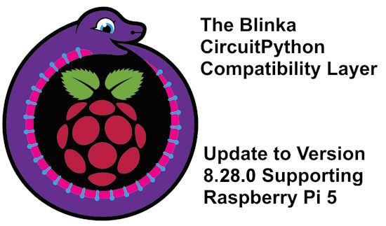](https://github.com/adafruit/Adafruit_Blinka/releases/tag/8.28.0)

The CircuitPython Blinka Python compatibility layer, supporting SBCs, has been updated for better support of Raspberry Pi 5 GPIO and more - [GitHub](https://github.com/adafruit/Adafruit_Blinka/releases/tag/8.28.0).

For more on Blinka – [CircuitPython.org](https://circuitpython.org/blinka), [Adafruit Learning System](https://learn.adafruit.com/circuitpython-on-raspberrypi-linux) and [GitHub](https://github.com/adafruit/Adafruit_Blinka).

## Linux at Thirty-two

Linus Torvalds has been working on Linux for 32 years, longer than many software developers have been alive. Surprisingly though, Linux, Torvalds’ earliest “hobby project,” arguably gains in importance each year, despite its age. In the case of Linux, its ongoing relevance isn’t an accident. Instead, it’s a testament to some key lessons Torvalds has learned and applied for years. He [shared some of those lessons](https://www.youtube.com/watch?v=OvuEYtkOH88&t=6s) at the recent Open Source Summit in Japan - [InfoWorld](https://www.infoworld.com/article/3711723/thirty-two-years-of-linux-and-its-community.html).

## A Review of the Pineberry Pi Raspberry Pi 5 M.2 NVME SSD HAT

[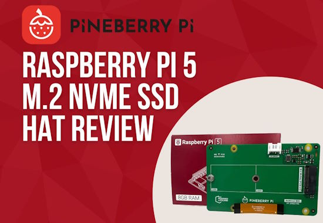](https://bret.dk/pineberry-pi-hatdrive-review-raspberry-pi-5-m-2-hat/)

Pineberry Pi is a Polish company founded in September 2023 with the goal of creating incredibly useful hardware to support Raspberry Pi Single Board Computers (SBC). They've developed two versions of a M.2 NVME SSD storage HAT, one mounted on top of a Pi 5 and one that is mounted below the Pi. bret.dk kicks the tires and provides a detailed review of the boards - [bret.dk](https://bret.dk/pineberry-pi-hatdrive-review-raspberry-pi-5-m-2-hat/).

## PyCon US 2024 Receives a Record Number of Submissions

Mariatta Wijaya posts about the number of talk submissions received for PyCon US 2024  - [Mastodon](https://fosstodon.org/@mariatta/111610354676141174).

> PyCon US received record number of CFP submissions with 973 proposals!!! (This number includes all the talks, Charlas, tutorials, and posters submitted). Thank you to everyone who took the time to craft your proposals! Good luck! And let's show our appreciation to the program committee and reviewers; you all made their job even harder this year!

## PikaPython: A Cross Platform Ultra Lightweight Embedded Python Engine

[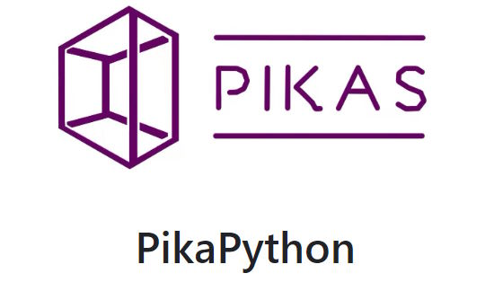](https://github.com/pikasTech/PikaPython)

PikaPython is an ultra-lightweight Python interpreter that runs with only 4KB of RAM, zero dependencies. It is ready to use out of the box without any configuration required and easy to extend with C - [GitHub](https://github.com/pikasTech/PikaPython) and [Project Site](https://pikapython.com/).

## Python Streams

Python on Hardware is all about building a cooperative ecosphere which allows contributions to be valued and to grow knowledge. Below are the streams within the last week focusing on the community.

**CircuitPython Deep Dive Stream**

Deep Dive is on holiday recess and will return after the New Year. You can see the latest video and past videos on the Adafruit YouTube channel under the Deep Dive playlist - [YouTube](https://www.youtube.com/playlist?list=PLjF7R1fz_OOXBHlu9msoXq2jQN4JpCk8A).

**CircuitPython Parsec**

John Park is on holiday this week. You can catch all episodes  of CircuitPython Parsec in the [YouTube playlist](https://www.youtube.com/playlist?list=PLjF7R1fz_OOWFqZfqW9jlvQSIUmwn9lWr).

**CircuitPython Weekly Meeting**

CircuitPython Weekly Meeting for December 18, 2023 ([notes](https://github.com/adafruit/adafruit-circuitpython-weekly-meeting/blob/main/2023/2023-12-18.md)) [on YouTube](https://youtu.be/HaZwRZp-W_8).

## Project of the Week: Create Your Own Slack Bot With a Raspberry Pi Pico W

[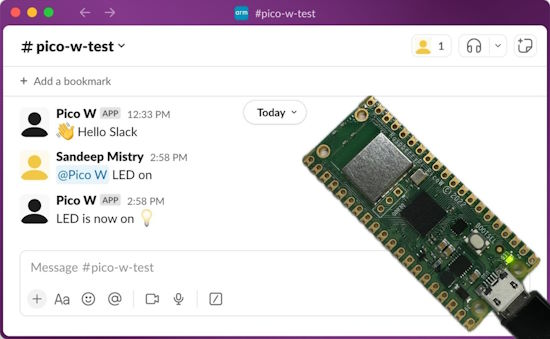](https://www.raspberrypi.com/news/create-your-own-slack-bot-with-a-raspberry-pi-pico-w/)

Sandeep Mistry provides a tutorial on how to connect a Raspberry Pi Pico W to Slack and create an interactive Slack bot that can send and receive messages - [Raspberry Pi News](https://www.raspberrypi.com/news/create-your-own-slack-bot-with-a-raspberry-pi-pico-w/).

## Popular Last Week

What was the most popular, most clicked link, in [last week's newsletter](https://www.adafruitdaily.com/2023/12/18/python-on-microcontrollers-newsletter-circuitpython-9-alpha-6-released-gpt-via-circuitpython-new-books-and-more-circuitpython-python-micropython-thepsf-raspberry_pi/)? [X](https://twitter.com/KirkDBorne/status/1735563697681055776).

## New Notes from Adafruit Playground

[Adafruit Playground](https://adafruit-playground.com/) is a new place for the community to post their projects and other making tips/tricks/techniques. Ad-free, it's an easy way to publish your work in a safe space for free.

text - [Adafruit Playground](url).

text - [Adafruit Playground](url).

text - [Adafruit Playground](url).

## News from around the web

Maker Advent 2023 Day 21: Linux VMs, Android apps, electronics and more with Chromebooks and some coding with Adafruit Feather RP2040 and CircuitPython - [YouTube](https://www.youtube.com/watch?v=uiFb4grNIrc).

[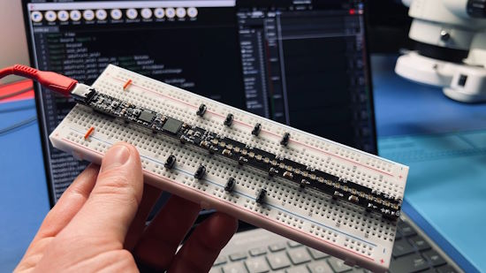](https://www.youtube.com/watch?v=JbaBoqpMZks)

Demonstrating MIDI and CircuitPython on the new [Breadstick board](https://www.crowdsupply.com/breadstick-innovations/raspberry-breadstick/) - [YouTube](https://www.youtube.com/watch?v=JbaBoqpMZks) and [Crowd Supply](https://www.crowdsupply.com/breadstick-innovations/raspberry-breadstick/updates/making-midi-music-with-raspberry-breadstick).

The Yozh robot – using an ESP32-S3 programmed in CircuitPython - [Adafruit Blog](https://blog.adafruit.com/2023/12/20/the-yozh-robot-using-an-esp32-s3-programmed-in-circuitpython-robotics-circuitpython-islandrobotics/), [hackaday.io](https://hackaday.io/project/193665-yozh-robot), [GitHub](https://github.com/shurik179/yozh) and [documentation](https://yozh.readthedocs.io/en/latest/).

[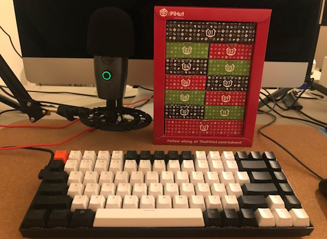](https://simonprickett.dev/completing-the-pihut-maker-advent-calendar/)

Simon Prickett writes about completing The Pi Hut “12 Projects of Codemas” maker advent calendar based on Raspberry Pi Pico and programmed in MicroPython - [simonprickett.dev](https://simonprickett.dev/completing-the-pihut-maker-advent-calendar/).

[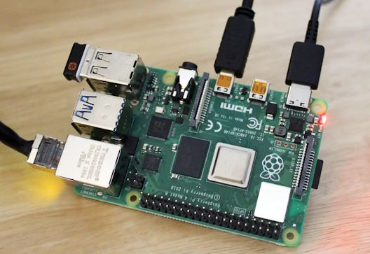](https://www.pcworld.com/article/2168199/raspberry-pi-the-best-beginner-projects-with-the-popular-single-board-computer.html)

Raspberry Pi: The best beginner projects - [PCWorld](https://www.pcworld.com/article/2168199/raspberry-pi-the-best-beginner-projects-with-the-popular-single-board-computer.html).

[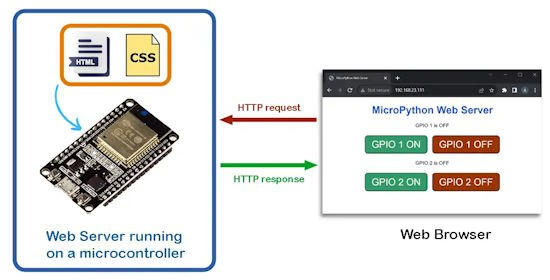](https://electrocredible.com/micropython-web-server-tutorial-examples/)

MicroPython Web Server Guide with ESP32, Pi Pico W Examples - [Electrocredible](https://electrocredible.com/micropython-web-server-tutorial-examples/).

[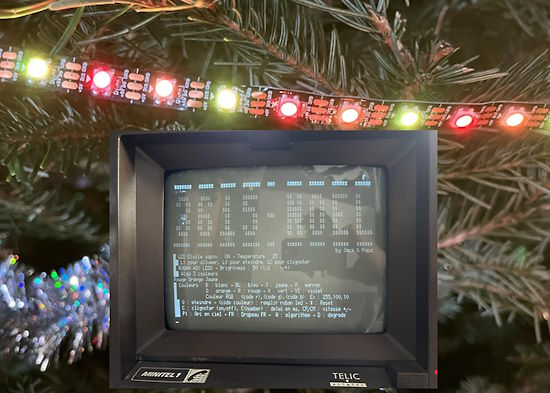](https://github.com/electriccatblog/3615noel)

Using a Raspberry Pi Pico + MicroPython interface to controlling NeoPixel strips via a vintage Minitel terminal - [ElectricCat](http://electriccat.free.fr/3615noel-minitel-raspberry-pico.htm) and [GitHub](https://github.com/electriccatblog/3615noel) via [X](https://twitter.com/electriccatblog/status/1736415836393357338) (French).

[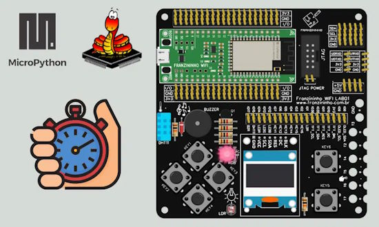](https://embarcados.com.br/trabalhando-com-timers-na-franzininho-wifi-usando-micropython/)

Working with timers at Franzininho WiFi using MicroPython - [Embarcados](https://embarcados.com.br/trabalhando-com-timers-na-franzininho-wifi-usando-micropython/).

text - [site](url).

text - [site](url).

text - [site](url).

text - [site](url).

text - [site](url).

[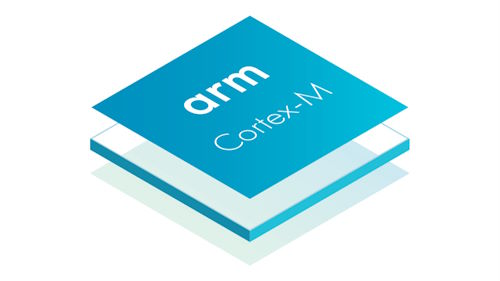](https://blog.adafruit.com/2023/12/20/udynlink-a-dynamic-linker-for-arm-cortex-m-mcus-arm-programming/)

udynlink: a dynamic linker for ARM Cortex-M MCUs - [Adafruit Blog](https://blog.adafruit.com/2023/12/20/udynlink-a-dynamic-linker-for-arm-cortex-m-mcus-arm-programming/) and [GitHub](https://github.com/bogdanm/udynlink).

[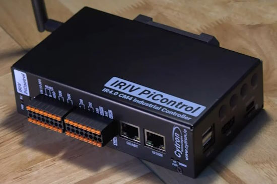](https://www.cnx-software.com/2023/12/21/cytron-iriv-picontrol-industry-4-0-controller-raspberry-pi-cm4/)

Cytron IRIV PiControl is an Industry 4.0 controller based on Raspberry Pi CM4 module - [CNX Software](https://www.cnx-software.com/2023/12/21/cytron-iriv-picontrol-industry-4-0-controller-raspberry-pi-cm4/) and [YouTube](https://youtu.be/mdh2O6r5iB0).

text - [site](url).

text - [site](url).

text - [site](url).

## Coming Soon

The Raspberry Pi 5 Industrial PC brings the heat with Integrated NVMe SSD - [Tom's Hardware](https://www.tomshardware.com/news/raspberry-pi-5-edatec-industrial-pc-with-nvme).

## New Boards Supported by CircuitPython

The number of supported microcontrollers and Single Board Computers (SBC) grows every week. This section outlines which boards have been included in CircuitPython or added to [CircuitPython.org](https://circuitpython.org/).

This week, there was one new board added:

- [Raspberry Breadstick](https://circuitpython.org/board/breadstick_raspberry/)

*Note: For non-Adafruit boards, please use the support forums of the board manufacturer for assistance, as Adafruit does not have the hardware to assist in troubleshooting.*

Looking to add a new board to CircuitPython? It's highly encouraged! Adafruit has four guides to help you do so:

- [How to Add a New Board to CircuitPython](https://learn.adafruit.com/how-to-add-a-new-board-to-circuitpython/overview)
- [How to add a New Board to the circuitpython.org website](https://learn.adafruit.com/how-to-add-a-new-board-to-the-circuitpython-org-website)
- [Adding a Single Board Computer to PlatformDetect for Blinka](https://learn.adafruit.com/adding-a-single-board-computer-to-platformdetect-for-blinka)
- [Adding a Single Board Computer to Blinka](https://learn.adafruit.com/adding-a-single-board-computer-to-blinka)

## New Learn Guides

[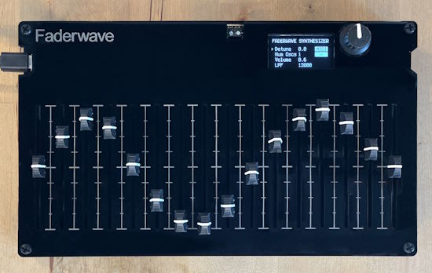](https://learn.adafruit.com/guides/latest)

[Faderwave Synthesizer](https://learn.adafruit.com/faderwave-synthesizer) from [John Park](https://learn.adafruit.com/u/johnpark)

[Adafruit USB Host FeatherWing with MAX3421E](https://learn.adafruit.com/adafruit-usb-host-featherwing-with-max3421e) from [Liz Clark](https://learn.adafruit.com/u/BlitzCityDIY)

## CircuitPython Libraries

The CircuitPython library numbers are continually increasing, while existing ones continue to be updated. Here we provide library numbers and updates!

To get the latest Adafruit libraries, download the [Adafruit CircuitPython Library Bundle](https://circuitpython.org/libraries). To get the latest community contributed libraries, download the [CircuitPython Community Bundle](https://circuitpython.org/libraries).

If you'd like to contribute to the CircuitPython project on the Python side of things, the libraries are a great place to start. Check out the [CircuitPython.org Contributing page](https://circuitpython.org/contributing). If you're interested in reviewing, check out Open Pull Requests. If you'd like to contribute code or documentation, check out Open Issues. We have a guide on [contributing to CircuitPython with Git and GitHub](https://learn.adafruit.com/contribute-to-circuitpython-with-git-and-github), and you can find us in the #help-with-circuitpython and #circuitpython-dev channels on the [Adafruit Discord](https://adafru.it/discord).

You can check out this [list of all the Adafruit CircuitPython libraries and drivers available](https://github.com/adafruit/Adafruit_CircuitPython_Bundle/blob/master/circuitpython_library_list.md). 

The current number of CircuitPython libraries is **###**!

**New Libraries**

Here's this week's new CircuitPython libraries:

* [library](url)

**Updated Libraries**

Here's this week's updated CircuitPython libraries:

* [library](url)

**Library PyPI Weekly Download Stats**

## What’s the CircuitPython team up to this week?

What is the team up to this week? Let’s check in:

**Dan**

This past week I released NINA-FW 1.7.7 to update the latest roots certificate list. This firmware is not CircuitPython, but is the WiFi/BLE firmware used on AirLift boards. There are still issues with certain TLS/SSL certificates which we are working to understand.

I added checking to reject BMP files for **OnDiskBitmap** that are run-length-encoded (RLE). Previously we didn’t check for this, and as a result they displayed as garbage. This fix will show up in the next 8.2.x stable release and 9.0.0 development release. The fix was easy but it pushed one board over the firmware storage limit for a large translation. I was able to consolidate and refactor a number of error messages to reduce the firmware size enough to be able to fit.

**Tim**

This week I worked on fixing the tests run by the circup repo actions to work with the refactored version of the library in the proposed web workflow PR branch. I've also been working on adding pixel location to cell coordinate helpers to the GridLayout helper class. This functionality can be used to make a soft keyboard with displayio and touch screens.

**Jeff**

[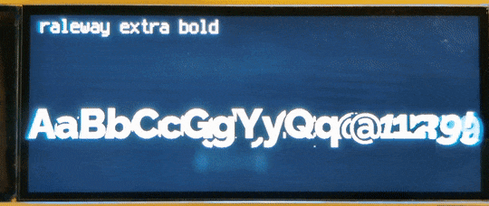](https://www.circuitpython.org/)

I'm excited to announce the launch of a new bundle called [circuitpython-fonts](https://github.com/adafruit/circuitpython-fonts). With `circuitpython-fonts`, you have 75 fonts in 14 different sizes at your disposal, each easy to install with [circup](https://pypi.org/project/circup/) or manually by copying a folder to your CIRCUITPY drive. Above are just a few of them at 72 pixels on an Adafruit Qualia with the 320x820 bar display.

**Liz**

This week I've been working on documenting two new products in the shop before the holidays. The [USB Host FeatherWing](https://learn.adafruit.com/adafruit-usb-host-featherwing-with-max3421e) uses a MAX3421E USB host chip so that you can easily add USB host support to your project. The TinyUSB Arduino library has native interface for host support for all TinyUSB supported chips. I included a few of the examples from the library in the guide and tested with multiple Feathers.

The second guide is for the MEMENTO camera board. There are a ton of features on this board and taking photos with it while documenting has been really fun. Although standalone digital cameras and cell phone cameras have been common for most of my life, I still remember when they were new and too expensive for my teenage budget so it's pretty incredible to now have that capability in a hackable dev board.

I'm going to be taking the next two weeks off to recharge for 2024. I look forward to more great projects in the New Year.

## Upcoming Events

The next MicroPython Meetup in Melbourne will be on December 27th – [Meetup](https://www.meetup.com/micropython-meetup/events). 

PyCascades 2024 is back in Seattle, Washington, USA and online, April 5-8th at the University of Washington's Kane Hall. - [PyCascades](https://2024.pycascades.com/).

PyCon US 2024 Launches - May 15-23, 2024 in Pittsburgh, Pennsylvania US - [PyCon US](https://pycon.blogspot.com/2023/10/pycon-us-2024-launches.html).

**Send Your Events In**

If you know of virtual events or upcoming events, please let us know via email to cpnews(at)adafruit(dot)com.

## Latest Releases

CircuitPython's stable release is [8.2.9](https://github.com/adafruit/circuitpython/releases/latest) and its unstable release is [9.0.0-alpha6](https://github.com/adafruit/circuitpython/releases). New to CircuitPython? Start with our [Welcome to CircuitPython Guide](https://learn.adafruit.com/welcome-to-circuitpython).

[20231220](https://github.com/adafruit/Adafruit_CircuitPython_Bundle/releases/latest) is the latest Adafruit CircuitPython library bundle.

[20231222](https://github.com/adafruit/CircuitPython_Community_Bundle/releases/latest) is the latest CircuitPython Community library bundle.

[v1.21.0](https://micropython.org/download) is the latest MicroPython release. Documentation for it is [here](http://docs.micropython.org/en/latest/pyboard/).

[3.12.1](https://www.python.org/downloads/) is the latest Python release. The latest pre-release version is [3.13.0a2](https://www.python.org/download/pre-releases/).

[3,761 Stars](https://github.com/adafruit/circuitpython/stargazers) Like CircuitPython? [Star it on GitHub!](https://github.com/adafruit/circuitpython)

## Call for Help -- Translating CircuitPython is now easier than ever

[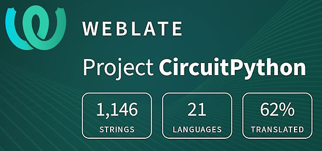](https://hosted.weblate.org/engage/circuitpython/)

One important feature of CircuitPython is translated control and error messages. With the help of fellow open source project [Weblate](https://weblate.org/), we're making it even easier to add or improve translations. 

Sign in with an existing account such as GitHub, Google or Facebook and start contributing through a simple web interface. No forks or pull requests needed! As always, if you run into trouble join us on [Discord](https://adafru.it/discord), we're here to help.

## 38,302 Thanks

The Adafruit Discord community, where we do all our CircuitPython development in the open, reached over 38,302 humans - thank you! Adafruit believes Discord offers a unique way for Python on hardware folks to connect. Join today at [https://adafru.it/discord](https://adafru.it/discord).

## ICYMI - In case you missed it

Python on hardware is the Adafruit Python video-newsletter-podcast! The news comes from the Python community, Discord, Adafruit communities and more and is broadcast on ASK an ENGINEER Wednesdays. The complete Python on Hardware weekly videocast [playlist is here](https://www.youtube.com/playlist?list=PLjF7R1fz_OOXRMjM7Sm0J2Xt6H81TdDev). The video podcast is on [iTunes](https://itunes.apple.com/us/podcast/python-on-hardware/id1451685192?mt=2), [YouTube](http://adafru.it/pohepisodes), [Instagram Reels](https://www.instagram.com/adafruit/channel/)), and [XML](https://itunes.apple.com/us/podcast/python-on-hardware/id1451685192?mt=2).

[The weekly community chat on Adafruit Discord server CircuitPython channel - Audio / Podcast edition](https://itunes.apple.com/us/podcast/circuitpython-weekly-meeting/id1451685016) - Audio from the Discord chat space for CircuitPython, meetings are usually Mondays at 2pm ET, this is the audio version on [iTunes](https://itunes.apple.com/us/podcast/circuitpython-weekly-meeting/id1451685016), Pocket Casts, [Spotify](https://adafru.it/spotify), and [XML feed](https://adafruit-podcasts.s3.amazonaws.com/circuitpython_weekly_meeting/audio-podcast.xml).

## Contribute

The CircuitPython Weekly Newsletter is a CircuitPython community-run newsletter emailed every Tuesday. The complete [archives are here](https://www.adafruitdaily.com/category/circuitpython/). It highlights the latest CircuitPython related news from around the web including Python and MicroPython developments. To contribute, edit next week's draft [on GitHub](https://github.com/adafruit/circuitpython-weekly-newsletter/tree/gh-pages/_drafts) and [submit a pull request](https://help.github.com/articles/editing-files-in-your-repository/) with the changes. You may also tag your information on Twitter with #CircuitPython. 

Join the Adafruit [Discord](https://adafru.it/discord) or [post to the forum](https://forums.adafruit.com/viewforum.php?f=60) if you have questions.
