- [ ] Library and info updates
- [ ] change date
- [ ] update title
- [ ] Feature story
- [ ] Update  for images
- [ ] Update ICYDNCI
- [ ] All images 550w max only
- [ ] Link "View this email in your browser."

News Sources

- [Adafruit Playground](https://adafruit-playground.com/)
- Twitter: [CircuitPython](https://twitter.com/search?q=circuitpython&src=typed_query&f=live), [MicroPython](https://twitter.com/search?q=micropython&src=typed_query&f=live) and [Python](https://twitter.com/search?q=python&src=typed_query)
- [Raspberry Pi News](https://www.raspberrypi.com/news/)
- Mastodon [CircuitPython](https://octodon.social/tags/CircuitPython) and [MicroPython](https://octodon.social/tags/MicroPython)
- [hackster.io CircuitPython](https://www.hackster.io/search?q=circuitpython&i=projects&sort_by=most_recent) and [MicroPython](https://www.hackster.io/search?q=micropython&i=projects&sort_by=most_recent)
- [python.org](https://www.python.org/)
- [Python Insider - dev team blog](https://pythoninsider.blogspot.com/)
- Individuals: [Jeff Geerling](https://www.jeffgeerling.com/blog)
- [hackaday CircuitPython](https://hackaday.com/blog/?s=circuitpython) and [MicroPython](https://hackaday.com/blog/?s=micropython)
- [hackaday.io newest projects MicroPython](https://hackaday.io/projects?tag=micropython&sort=date) and [CircuitPython](https://hackaday.io/projects?tag=circuitpython&sort=date)
- [https://opensource.com/tags/python](https://opensource.com/tags/python)
- Check Issues and PRs for input

View this email in your browser. **Warning: Flashing Imagery**

Welcome to the latest Python on Microcontrollers newsletter! We welcome 2024 as a wonderous year for Python on Hardware. A new version of MicroPython is out now and CircuitPython 9 is on the horizon. New Raspberry Pi hardware has invigorated single board computers. May everyone have a joyful New Year. - *Anne Barela, Ed.*

We're on [Discord](https://discord.gg/HYqvREz), [Twitter](https://twitter.com/search?q=circuitpython&src=typed_query&f=live), and for past newsletters - [view them all here](https://www.adafruitdaily.com/category/circuitpython/). If you're reading this on the web, [subscribe here](https://www.adafruitdaily.com/). Here's the news this week:

## MicroPython Version 1.22.0 Out Now

[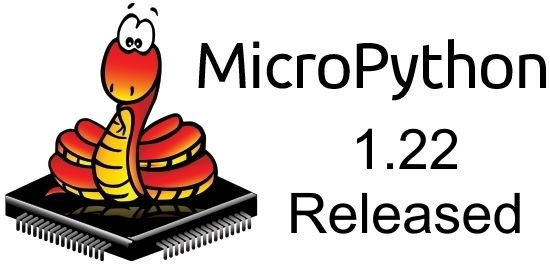](https://github.com/micropython/micropython/releases)

The latest release of MicroPython introduces SSL/TLS support to `asyncio`, for both the client and server sides. The interface matches CPython: `asyncio.open_connection()` and `asyncio.start_serve()` now both accept an SSL argument to supply an `SSLContext` object. As part of this, new methods were added to `SSLContext` to load certificates, and certificate date/time validation was enabled on all ports that use mbedTLS.

Qstr pools are now sorted, which provides a significant performance boost for `qstr_find_strn()`, which is called a lot during parsing and loading of .mpy files, as well as interning of string objects, which happens in most string methods that return new strings. The static pool (part of the .mpy ABI) isn't currently sorted, but could be in the future. And much more - [GitHub](https://github.com/micropython/micropython/releases).

Note with MicroPython 1.21 and earlier versions, an advisory was released December 28th CVE-2023-7158 · ISSUE 13007 - [VilDB](https://vuldb.com/?id.249180).

## Arduino Exploring Manufacturing in India to Limit Counterfeit Sales

[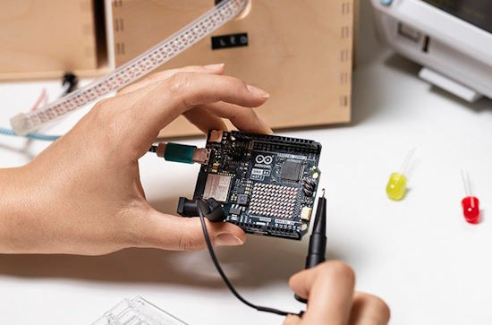](https://techcrunch.com/2023/12/22/arduino-india-manufacturing/)

Arduino is considering manufacturing in India. The company, best known for its open source microcontroller boards, hopes to restrict the rise of counterfeit boards and cater to the growing demand from India’s youth population.

The Italian firm is currently exploring partnerships with electronic manufacturing service (EMS) companies in the South Asian nation to begin its local production by as early as the first quarter of next year, CEO Fabio Violante told TechCrunch in a virtual interview. This marks a substantial shift from the company’s practice of producing all its boards in Italy.

> “It is a challenge, because we are open source and make money from selling the original hardware,” he noted. “So, the clones and counterfeits are a big chunk of the market.”

Arduino is looking to address the problem of fake boards globally by making its hardware more sophisticated, which makes it more difficult to counterfeit - [Techcrunch](https://techcrunch.com/2023/12/22/arduino-india-manufacturing/).

## PEP Talk: What is a Python Enhancement Proposal

[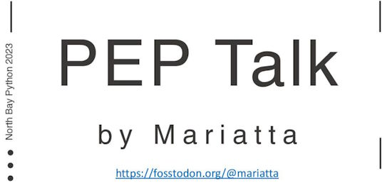](https://speakerdeck.com/mariatta/pep-talk)

Mariatta's talk at the 2023 North Bay Python gathering explains what Python Enhancement Proposals (PEPs) are and how they provide information to the Python community  - [Speakerdeck](https://speakerdeck.com/mariatta/pep-talk).

## GitHub Slash Commands Save Time Writing Markdown

Are you placing your code in GitHub and documenting with Markdown? GitHub slash commands make it easier to type more complex Markdown, such as tables, tasklists, and code blocks - [GitHub](https://docs.github.com/en/issues/tracking-your-work-with-issues/about-slash-commands).

## FreeRTOS Version 11 Out with Symmetric Multiprocessing

[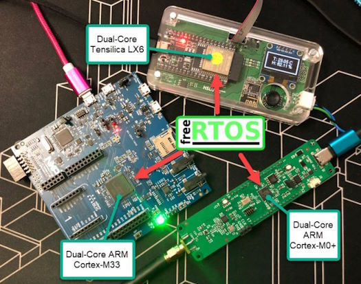](https://mcuoneclipse.com/2023/12/29/multi-core-symmetric-multi-processing-smp-with-freertos/)

FreeRTOS V11.0 is out, and the big news is that it has finally Symmetric Multi-Processing (SMP) integrated into the mainline. This greatly simplifies FreeRTOS usage, easily switching between single-core and multi-core applications - [MCU On Eclipse](https://mcuoneclipse.com/2023/12/29/multi-core-symmetric-multi-processing-smp-with-freertos/).

## CircuitPython Powering Adafruit's MEMENTO Camera Board Makes Programming Vision Apps a Snap

[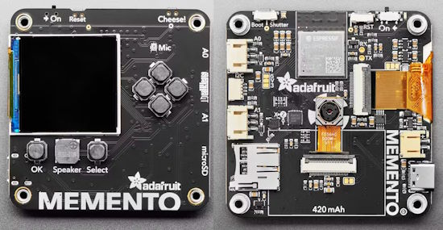](https://www.hackster.io/news/circuitpython-powering-adafruit-s-memento-camera-board-makes-programming-vision-apps-a-snap-eaa156ce11b0)

Adafruit's latest development platform focuses on camera and vision. The [MEMENTO Camera Board](https://www.adafruit.com/product/5420) lets you experiment with an all-in-one, CircuitPython-enabled five-megapixel camera board with a rich set of peripherals, like those you might find on an IoT device. Plus, it fits in the palm of your hand!

The centerpiece of MEMENTO's 63.6 x 63.3 x 13 millimeter printed circuit board is an OV5640 camera module. This 5MP still image sensor supports manual and auto-focus. An Espressif ESP32-S3 system-on-chip (SoC) module powers the camera board - [hackster.io](https://www.hackster.io/news/circuitpython-powering-adafruit-s-memento-camera-board-makes-programming-vision-apps-a-snap-eaa156ce11b0) and [CNX Software](https://www.cnx-software.com/2023/12/27/memento-esp32-s3-circuitpython-arduino-programmable-diy-camera-module/).

## 10 Raspberry Pi Projects with Python to Boost Your Skills

[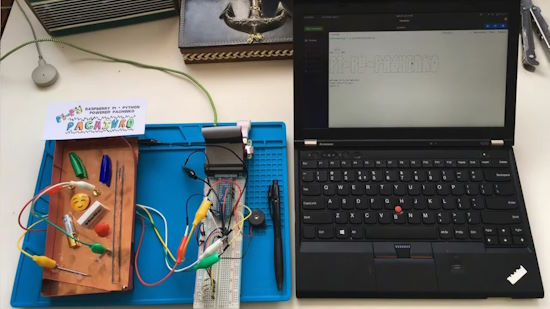](https://all3dp.com/2/best-raspberry-pi-projects-with-python/)

The internationally popular series of Raspberry Pi boards comes with the simple, yet powerful, Python programming language built in. Once you’ve got your bearings and have things set up with your Pi, you can get your hands on projects that work with additional Python derivatives such as MicroPython and CircuitPython. In this list of Raspberry Pi projects that work with Python, you’ll find some intriguing ways to sharpen your programming skills. Whether for practical use or just for fun, being able to program in Python is a valuable asset - [All3DP](https://all3dp.com/2/best-raspberry-pi-projects-with-python/).

## This Week's Python Streams

Python on Hardware is all about building a cooperative ecosphere which allows contributions to be valued and to grow knowledge. Below are the streams within the last week focusing on the community.

**CircuitPython Deep Dive Stream**

Deep Dive with Scott and Tim will resume January 5th, live on YouTube. You can see the latest video and past videos on the Adafruit YouTube channel under the Deep Dive playlist - [YouTube](https://www.youtube.com/playlist?list=PLjF7R1fz_OOXBHlu9msoXq2jQN4JpCk8A).

**CircuitPython Parsec**

John Park’s CircuitPython Parsec is off this week. You may catch all the episodes in the [YouTube playlist](https://www.youtube.com/playlist?list=PLjF7R1fz_OOWFqZfqW9jlvQSIUmwn9lWr).

**CircuitPython Weekly Meeting**

The CircuitPython Weekly Meeting will return January 8th.

## Project of the Week: Raspberry Pi ZeroWriter eInk Typewriter

[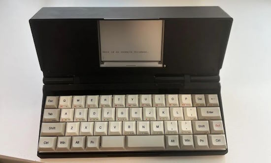](https://www.tomshardware.com/raspberry-pi/raspberry-pi-zerowriter-eink-typewriter-lets-you-take-notes-on-the-go)

ZeroWriter is an open-source DIY eink typewriter. It's built for beginners to the DIY/Cyberdeck/Raspberry Pi world. It uses an inexpensive 4.2" e-paper panel with modified drivers and is powered by a Raspberry Pi Zero 2W, coded in Python - [Tom's Hardware](https://www.tomshardware.com/raspberry-pi/raspberry-pi-zerowriter-eink-typewriter-lets-you-take-notes-on-the-go) and [Reddit](https://www.reddit.com/r/zerowriter/comments/18m8pvf/zerowriter_build_guide/).

## Popular Last Week: Python in EXCEL Cheatsheet 

[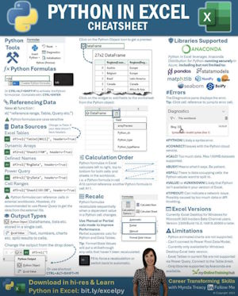](https://twitter.com/KirkDBorne/status/1735563697681055776)

The most popular link in the newsletter continues to be a Python in EXCEL Cheatsheet - [X](https://twitter.com/KirkDBorne/status/1735563697681055776).

## New Notes from Adafruit Playground

[Adafruit Playground](https://adafruit-playground.com/) is a new place for the community to post their projects and other making tips/tricks/techniques. Ad-free, it's an easy way to publish your work in a safe space for free.

[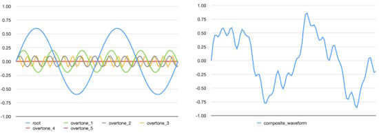](https://adafruit-playground.com/u/CGrover/pages/wavebuilder-construct-a-synthio-wave-table-from-a-list-of-oscillators)

WaveBuilder: Construct a synthio Wave Table from a List of Oscillators - [Adafruit Playground](https://adafruit-playground.com/u/CGrover/pages/wavebuilder-construct-a-synthio-wave-table-from-a-list-of-oscillators).

## News from around the web

CT6 Is a Raspberry Pi Pico W-powered four-port home energy monitor running on a Raspberry Pi Pico W and MicroPython - [hackster.io](https://www.hackster.io/news/paul-austen-s-ct6-is-a-raspberry-pi-pico-w-powered-four-port-home-energy-monitor-f9dac15770a6) and [GitHub](https://github.com/pjaos/ct6_meter_os/tree/master/software/picow).

[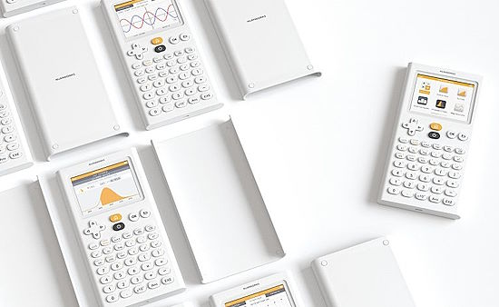](https://qiita.com/inachi/items/e418e8f1d45c5ebac32d)

The evolution of NumWorks calculators running MicroPython - [Qiita](https://qiita.com/inachi/items/e418e8f1d45c5ebac32d) (Japanese).

[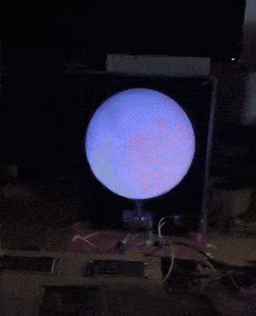](https://twitter.com/LMcUnderwood/status/1740420160777830609)

Lorraine Underwood is completing a Raspberry Pi project where you enter a date and the moon shows what it was on that date, coded in MicroPython - [X](https://twitter.com/LMcUnderwood/status/1740420160777830609).

> Testing a PCF8523 real-time clock (RTC) on an [Adafruit Adalogger FeatherWing](https://learn.adafruit.com/adafruit-adalogger-featherwing). The MCU is a 
Raspberry Pi RP2040 on a Feather board ([Guide](https://learn.adafruit.com/adafruit-feather-rp2040-pico)). The 'Wing also has an SD card slot - [X](https://twitter.com/_rac01/status/1740081130378838484).

[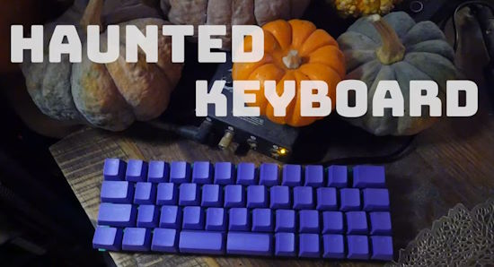](https://www.tindie.com/products/jackandstephsworkshop/40-pico-keyboard-pcb-with-ai/)

The haunted keyboard: a 40% Pico Keyboard PCB with ChatGPT integration (written in CircuitPython) - [Tindie](https://www.tindie.com/products/jackandstephsworkshop/40-pico-keyboard-pcb-with-ai/), [YouTube](https://youtu.be/a3yib46zEyk) and [Hackaday](https://hackaday.com/2023/11/20/2023-halloween-hackfest-this-years-spooky-winners/).

[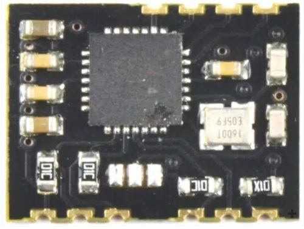](https://github.com/7h3rAm/es100-wwvb)

es100-wwvb is a WWVB 60Khz Full functionality receiver/parser for the I2C bus based ES100-MOD, receiving the time signal from NIST in Colorado to Python and CircuitPython - [GitHub](https://github.com/7h3rAm/es100-wwvb).

> Using an Adafruit ItsyBitsy M4 with CircuitPython and Microsoft's MakeCode. Choose your game and copy its bootloader (UF2) to the circuitpy drive, then play - [X](https://twitter.com/Fr4nkFletcher/status/1739330709725032759).

[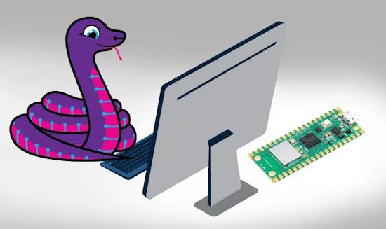](https://www.opensourceforu.com/2023/12/leveraging-the-power-of-circuitpython-for-iot-devices/)

Leveraging The Power Of CircuitPython For IoT Devices - [OpenSource](https://www.opensourceforu.com/2023/12/leveraging-the-power-of-circuitpython-for-iot-devices/).

[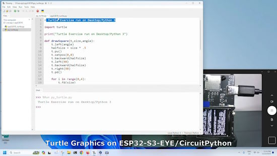](https://www.youtube.com/watch?v=6bd7cRkkXQI)

Turtle graphics on ann ESP32-S3-EYE with CircuitPython - [YouTube](https://www.youtube.com/watch?v=6bd7cRkkXQIhttps://www.youtube.com/watch?v=6bd7cRkkXQI) and [Coxxect](https://coxxect.blogspot.com/2023/12/turtle-graphics-on-esp32-s3.html).

[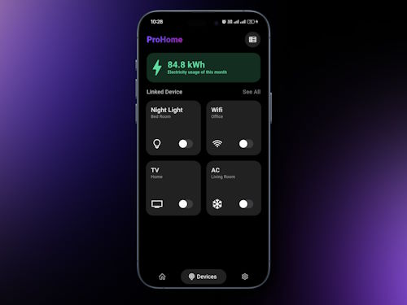](https://github.com/Pavitra554/IOT_App)

An Internet of Things (IoT) Flutter application that allows users to interact with and control connected devices which are programmed in MicroPython - [GitHub](https://github.com/Pavitra554/IOT_App) via [X](https://twitter.com/pavitra_ts/status/1740226833839522063).

[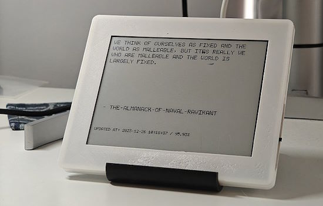](https://twitter.com/Jack_Wu_/status/1739681550935986498)

> A weekend project to view my Readwise daily highlight, it refreshes every hour. Built with Inkplate 6 from Soldered Electronics and Micropython - [X](https://twitter.com/Jack_Wu_/status/1739681550935986498).

text - [site](url).

Another year of keyboard news (2023) from Keyboard Builders' Digest - [kbd.news](https://kbd.news/Another-year-of-kbd.news-2023-2235.html).

A review of the Flirc Raspberry Pi 5 case - [bret.dk](https://bret.dk/flirc-raspberry-pi-5-case-review/).

Revolution Pi is an open, modular and inexpensive industrial PC based on the well-known Raspberry Pi. Housed in a slim DIN-rail housing, the three available base modules can be seamlessly expanded by a variety of suitable I/O modules and fieldbus gateways - [Revolution Pi](https://revolutionpi.com/revolution-pi-series).

A Python/Django Advent calendar - [b-list.org](https://www.b-list.org/weblog/2023/dec/03/python-enums/).

[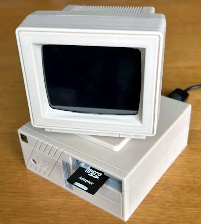](https://hackaday.com/2023/12/28/raspberry-pi-does-its-best-retro-pc-impression/)

Using a Raspberry Pi to emulate a vintage PC - [Hackaday](https://hackaday.com/2023/12/28/raspberry-pi-does-its-best-retro-pc-impression/) and [Printables](https://www.printables.com/model/694802-retro-desktop-pc-raspberry-pi-case-v2).

## New

[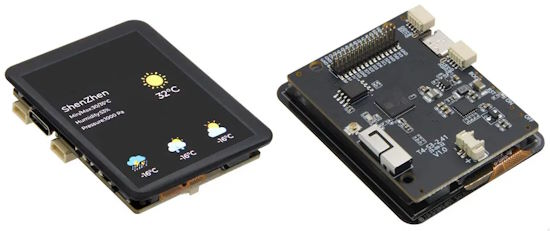](https://www.cnx-software.com/2023/12/27/lilygo-t4-s3-board-2-41-inch-amoled-touchscreen-display-esp32-s3r8/)

The LILYGO T4-S3 board combines a 2.41-inch AMOLED touchscreen display with a ESP32-S3R8 microcontroller - [CNX Software](https://www.cnx-software.com/2023/12/27/lilygo-t4-s3-board-2-41-inch-amoled-touchscreen-display-esp32-s3r8/) and [GitHub](https://github.com/Xinyuan-LilyGO/LilyGo-AMOLED-Series).

[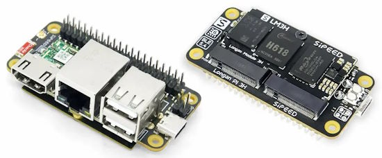](https://www.cnx-software.com/2023/12/29/sipeed-longan-pi3h-a-raspberry-pi-zero-sized-board-with-gigabit-ethernet-wifi-6-hdmi-and-usb-ports/)

The Sipeed Longan Pi3H is a Raspberry Pi Zero-sized board with gigabit Ethernet, WiFi 6, HDMI, and USB ports - [CNX Software](https://www.cnx-software.com/2023/12/29/sipeed-longan-pi3h-a-raspberry-pi-zero-sized-board-with-gigabit-ethernet-wifi-6-hdmi-and-usb-ports/) and [GitHub](https://github.com/sipeed/LonganPi-3H-SDK/tree/main).

## New Boards Supported by CircuitPython

The number of supported microcontrollers and Single Board Computers (SBC) grows every week. This section outlines which boards have been included in CircuitPython or added to [CircuitPython.org](https://circuitpython.org/).

This week, there were (#/no) new boards added:

- [Board name](url)
- [Board name](url)
- [Board name](url)

*Note: For non-Adafruit boards, please use the support forums of the board manufacturer for assistance, as Adafruit does not have the hardware to assist in troubleshooting.*

Looking to add a new board to CircuitPython? It's highly encouraged! Adafruit has four guides to help you do so:

- [How to Add a New Board to CircuitPython](https://learn.adafruit.com/how-to-add-a-new-board-to-circuitpython/overview)
- [How to add a New Board to the circuitpython.org website](https://learn.adafruit.com/how-to-add-a-new-board-to-the-circuitpython-org-website)
- [Adding a Single Board Computer to PlatformDetect for Blinka](https://learn.adafruit.com/adding-a-single-board-computer-to-platformdetect-for-blinka)
- [Adding a Single Board Computer to Blinka](https://learn.adafruit.com/adding-a-single-board-computer-to-blinka)

## New Learn Guides

[Adafruit MEMENTO Camera Board](https://learn.adafruit.com/adafruit-memento-camera-board) from [Liz Clark](https://learn.adafruit.com/u/BlitzCityDIY)

## CircuitPython Libraries

The CircuitPython library numbers are continually increasing, while existing ones continue to be updated. Here we provide library numbers and updates!

To get the latest Adafruit libraries, download the [Adafruit CircuitPython Library Bundle](https://circuitpython.org/libraries). To get the latest community contributed libraries, download the [CircuitPython Community Bundle](https://circuitpython.org/libraries).

If you'd like to contribute to the CircuitPython project on the Python side of things, the libraries are a great place to start. Check out the [CircuitPython.org Contributing page](https://circuitpython.org/contributing). If you're interested in reviewing, check out Open Pull Requests. If you'd like to contribute code or documentation, check out Open Issues. We have a guide on [contributing to CircuitPython with Git and GitHub](https://learn.adafruit.com/contribute-to-circuitpython-with-git-and-github), and you can find us in the #help-with-circuitpython and #circuitpython-dev channels on the [Adafruit Discord](https://adafru.it/discord).

You can check out this [list of all the Adafruit CircuitPython libraries and drivers available](https://github.com/adafruit/Adafruit_CircuitPython_Bundle/blob/master/circuitpython_library_list.md). 

The current number of CircuitPython libraries is **471**!

**New Libraries**

Here's this week's new CircuitPython libraries:

  * [CedarGroveStudios/CircuitPython_WaveBuilder](https://github.com/CedarGroveStudios/CircuitPython_WaveBuilder)

**Updated Libraries**

Here's this week's updated CircuitPython libraries:

  * [adafruit/Adafruit_CircuitPython_GFX](https://github.com/adafruit/Adafruit_CircuitPython_GFX)
  * [adafruit/Adafruit_CircuitPython_BME680](https://github.com/adafruit/Adafruit_CircuitPython_BME680)
  * [adafruit/Adafruit_CircuitPython_LED_Animation](https://github.com/adafruit/Adafruit_CircuitPython_LED_Animation)
  * [CedarGroveStudios/CircuitPython_RangeSlicer](https://github.com/CedarGroveStudios/CircuitPython_RangeSlicer)

**Library PyPI Weekly Download Stats**

**Total Library Stats**

  * 90423 PyPI downloads over 323 libraries
    
**Top 10 Libraries by PyPI Downloads**

  * Adafruit CircuitPython BusDevice (adafruit-circuitpython-busdevice): 6898
  * Adafruit CircuitPython Requests (adafruit-circuitpython-requests): 5994
  * Adafruit CircuitPython Register (adafruit-circuitpython-register): 2107
  * Adafruit CircuitPython PCA9685 (adafruit-circuitpython-pca9685): 904
  * Adafruit CircuitPython Motor (adafruit-circuitpython-motor): 771
  * Adafruit CircuitPython NeoPixel (adafruit-circuitpython-neopixel): 769
  * Adafruit CircuitPython Pixelbuf (adafruit-circuitpython-pixelbuf): 740
  * Adafruit CircuitPython DHT (adafruit-circuitpython-dht): 715
  * Adafruit CircuitPython MiniMQTT (adafruit-circuitpython-minimqtt): 688
  * Adafruit CircuitPython BME680 (adafruit-circuitpython-bme680): 656

## What’s the CircuitPython team up to this week?

What is the team up to this week? Let’s check in:

**Dan**

It's been a quiet week. I am looking at 9.0.0 issues, and also doing some additional support work to cover for people who are out for the holidays.

**Melissa**

This past week I've working on fixing scripts that broke when the new Raspberry Pi OS came out. I've also been fixing Raspberry Pi 5 related issues.

**Jeff**

[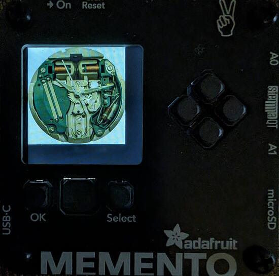](https://www.circuitpython.org/)

I made some improvements to the `jpegio` module. It's now possible to read a jpeg file from a file or even from an `adafruit_requests` response object! You can see sample code within the [Pull Request](https://github.com/adafruit/circuitpython/pull/8723) -- this will be in the next version 9 alpha, whenever it comes out.

## Upcoming Events

The next MicroPython Meetup in Melbourne will be on January 24th – [Meetup](https://www.meetup.com/micropython-meetup/events). 

PyCascades 2024 is back in Seattle, Washington, USA and online, April 5-8th at the University of Washington's Kane Hall. - [PyCascades](https://2024.pycascades.com/).

PyCon US 2024 Launches - May 15-23, 2024 in Pittsburgh, Pennsylvania US - [PyCon US](https://pycon.blogspot.com/2024/10/pycon-us-2024-launches.html).

**Send Your Events In**

If you know of virtual events or upcoming events, please let us know via email to cpnews(at)adafruit(dot)com.

## Latest Releases

CircuitPython's stable release is [8.2.9](https://github.com/adafruit/circuitpython/releases/latest) and its unstable release is [9.0.0-alpha6](https://github.com/adafruit/circuitpython/releases). New to CircuitPython? Start with our [Welcome to CircuitPython Guide](https://learn.adafruit.com/welcome-to-circuitpython).

[20231228](https://github.com/adafruit/Adafruit_CircuitPython_Bundle/releases/latest) is the latest Adafruit CircuitPython library bundle.

[20231227](https://github.com/adafruit/CircuitPython_Community_Bundle/releases/latest) is the latest CircuitPython Community library bundle.

[v1.22.0](https://micropython.org/download) is the latest MicroPython release. Documentation for it is [here](http://docs.micropython.org/en/latest/pyboard/).

[3.12.1](https://www.python.org/downloads/) is the latest Python release. The latest pre-release version is [3.13.0a2](https://www.python.org/download/pre-releases/).

[3,768 Stars](https://github.com/adafruit/circuitpython/stargazers) Like CircuitPython? [Star it on GitHub!](https://github.com/adafruit/circuitpython)

## Call for Help -- Translating CircuitPython is now easier than ever

One important feature of CircuitPython is translated control and error messages. With the help of fellow open source project [Weblate](https://weblate.org/), we're making it even easier to add or improve translations. 

Sign in with an existing account such as GitHub, Google or Facebook and start contributing through a simple web interface. No forks or pull requests needed! As always, if you run into trouble join us on [Discord](https://adafru.it/discord), we're here to help.

## NUMBER Thanks

The Adafruit Discord community, where we do all our CircuitPython development in the open, reached over NUMBER humans - thank you! Adafruit believes Discord offers a unique way for Python on hardware folks to connect. Join today at [https://adafru.it/discord](https://adafru.it/discord).

## ICYMI - In case you missed it

Python on hardware is the Adafruit Python video-newsletter-podcast! The news comes from the Python community, Discord, Adafruit communities and more and is broadcast on ASK an ENGINEER Wednesdays. The complete Python on Hardware weekly videocast [playlist is here](https://www.youtube.com/playlist?list=PLjF7R1fz_OOXRMjM7Sm0J2Xt6H81TdDev). The video podcast is on [iTunes](https://itunes.apple.com/us/podcast/python-on-hardware/id1451685192?mt=2), [YouTube](http://adafru.it/pohepisodes), [Instagram Reels](https://www.instagram.com/adafruit/channel/)), and [XML](https://itunes.apple.com/us/podcast/python-on-hardware/id1451685192?mt=2).

[The weekly community chat on Adafruit Discord server CircuitPython channel - Audio / Podcast edition](https://itunes.apple.com/us/podcast/circuitpython-weekly-meeting/id1451685016) - Audio from the Discord chat space for CircuitPython, meetings are usually Mondays at 2pm ET, this is the audio version on [iTunes](https://itunes.apple.com/us/podcast/circuitpython-weekly-meeting/id1451685016), Pocket Casts, [Spotify](https://adafru.it/spotify), and [XML feed](https://adafruit-podcasts.s3.amazonaws.com/circuitpython_weekly_meeting/audio-podcast.xml).

## Contribute

The CircuitPython Weekly Newsletter is a CircuitPython community-run newsletter emailed every Tuesday. The complete [archives are here](https://www.adafruitdaily.com/category/circuitpython/). It highlights the latest CircuitPython related news from around the web including Python and MicroPython developments. To contribute, edit next week's draft [on GitHub](https://github.com/adafruit/circuitpython-weekly-newsletter/tree/gh-pages/_drafts) and [submit a pull request](https://help.github.com/articles/editing-files-in-your-repository/) with the changes. You may also tag your information on Twitter with #CircuitPython. 

Join the Adafruit [Discord](https://adafru.it/discord) or [post to the forum](https://forums.adafruit.com/viewforum.php?f=60) if you have questions.
