View this email in your browser. **Warning: Flashing Imagery**

Welcome to the latest Python on Microcontrollers newsletter! 2024 is full of possibilities for the electronics industry and for Python running on hardware. Check out this week's crop of articles and projects. - *Anne Barela, Ed.*

We're on [Discord](https://discord.gg/HYqvREz), [Twitter](https://twitter.com/search?q=circuitpython&src=typed_query&f=live), and for past newsletters - [view them all here](https://www.adafruitdaily.com/category/circuitpython/). If you're reading this on the web, [subscribe here](https://www.adafruitdaily.com/). Here's the news this week:

## MicroPython v1.22.1 Patch Release

[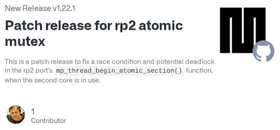](https://github.com/micropython/micropython/releases)

MicroPython v1.22.1 was released to address a specific race condition in using `_thread` in the RP2 port. v1.22.0 has been out since December 27th so the period where the issue has been in effect is short, although it was present in preview builds since November 9th - [GitHub](https://github.com/micropython/micropython/releases).

## Comparing the 1970's Cray-1 Supercomputer Against the Raspberry Pi Single-Board Computer Range

Developer Roy Longbottom, who has been personally benchmarking computer systems large and small for more than 50 years, has published a look at how the venerable Cray-1 supercomputer stacks up against modern devices of a considerably smaller scale: the Raspberry Pi family of single-board computers (SBCs) - [hackster.io](https://www.hackster.io/news/roy-longbottom-pits-1976-s-cray-1-supercomputer-against-the-raspberry-pi-single-board-computer-range-152bbe2d4111).

> "In 1978, the Cray-1 supercomputer cost $7 million, weighed 10,500 pounds and had a 115 kilowatt power supply. It was, by far, the fastest computer in the world," Longbottom writes of the device, designed as the flagship product of Seymour Cray's high-performance computing company. "The Raspberry Pi costs around $70 (CPU board, case, power supply, SD Card), weighs a few ounces, uses a five watt power supply and is more than 4.5 times faster than the Cray 1."

See Longbottom's extensive tests and comparisons article - [roylongbottom.org.uk](http://www.roylongbottom.org.uk/Cray%201%20Supercomputer%20Performance%20Comparisons%20With%20Home%20Computers%20Phones%20and%20Tablets.htm).

## In-Depth: Arduino Exploring Manufacturing in India

Last week's newsletter issue covered a TechCrunch article on Arduino saying they might manufacture in India as the software downloads dwarf the sales of hardware. Adafruit's director Phil Torrone writes a follow-up in the Adafruit Blog on Open Source Hardware and Software - [Adafruit Blog](https://blog.adafruit.com/2024/01/04/techcrunch-arduino-exploring-india-manufacturing-to-limit-counterfeit-sales/) and [Ask an Engineer Segment on YouTube](https://youtu.be/1EER4v5VJns?feature=shared&t=114).

> "What Arduino is calling “fake boards” are primarily Arduino-compatibles and clones, not trademark-infringing counterfeits. Blaming low-cost compatibles and assuming it’s a loss of 3.2 million sales since that’s the download count of the IDE is blaming something that is not really happening. There are counterfeits for sure, but that’s very different than hardware that’s compatible with using the Arduino IDE – the large number of downloads for the open-source Arduino IDE is for compatible board-support-packaged hardware like the ESP8266, ESP32, etc. (Unknown if there’s any telemetry data that lets anyone know what hardware is being used with the IDE, just that it’s downloaded, so we’re going with market indicators, projects published, GitHub repos, and shared online)."

## 8 Reasons to Upgrade to a Raspberry Pi 5, Project by Project

[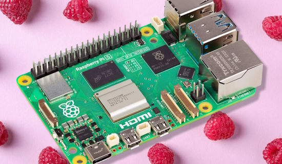](https://www.makeuseof.com/raspberry-pi-5-reasons-upgrade-projects/)

8 Reasons to upgrade to a Raspberry Pi 5, project by project. With a far more capable processor and a bunch of extra features, the Raspberry Pi 5 offers far more power than previous models - [Make Use Of](https://www.makeuseof.com/raspberry-pi-5-reasons-upgrade-projects/) via [Adafruit Blog](https://blog.adafruit.com/2023/12/29/8-reasons-to-upgrade-to-a-raspberry-pi-5-project-by-project-piday-raspberrypi/).

## Free Python for Kids Tutorial with MicroPython and BBC micro:bit

Python For Kids is a free comprehensive online Python development tutorial for kids utilizing a BBC micro:bit Development Board going step-by-step into the world of Python for microcontrollers - [GitHub](https://github.com/mytechnotalent/Python-For-Kids) and [YouTube](https://www.youtube.com/watch?v=b4V13Lvk_jM).

## Use Python Inside of Google Sheets With Neptyne

Neptyne allows use of Python inside of Google Sheets (similar to the announced use of [Python in Microsoft Excel](https://blog.adafruit.com/2023/08/22/microsoft-introduces-python-in-excel-for-data-analysis-and-visualization-microsoft-python-dataanalysis-thepsf/)) - [Neptyne](https://www.neptyne.com/google-sheets) via [X](https://twitter.com/NeptyneHQ/status/1725275803473326313?t=bu-Aq-P3ELG9_kdg3fsVhQ&s=03).

## What are the Age of Some Popular Languages in 2024

How old are languages in 2024? Wisdomic on X compiled a list. We added Python for microcontrollers - [X](https://twitter.com/wisdomicz/status/1741825418053754918).

* Assembly : 77 yrs
* FORTRAN : 70 yrs
* ALGOL : 66 yrs 
* COBOL  : 65 yrs
* LISP : 64 yrs  
* BASIC : 60 yrs
* LOGO : 57 yrs
* Pascal : 54 yrs   
* C  : 52 yrs   
* SQL : 50 yrs
* MATLAB : 40 yrs
* C++ : 39 yrs   
* Python : 33 yrs   
* HTML : 33 yrs  
* Ruby : 31 yrs   
* PHP : 30 yrs   
* JavaScript : 29 yrs   
* Java : 29 yrs 
* C# : 24 yrs 
* Rust : 18 yrs   
* Go : 17 yrs     
* Typescript : 12 yrs   
* Swift : 10 yrs
* MicroPython : 10 yrs
* CircuitPython : 7 yrs 

## This Week's Python Streams

Python on Hardware is all about building a cooperative ecosphere which allows contributions to be valued and to grow knowledge. Below are the streams within the last week focusing on the community.

**CircuitPython Deep Dive Stream**

[Last Friday](https://www.youtube.com/watch?v=oY_fzNfis0s), Tim took a look at the ConnectionManager networking utility.

You can see the latest video and past videos on the Adafruit YouTube channel under the Deep Dive playlist - [YouTube](https://www.youtube.com/playlist?list=PLjF7R1fz_OOXBHlu9msoXq2jQN4JpCk8A).

**CircuitPython Parsec**

John Park’s CircuitPython Parsec this week is on Split Strings - [Adafruit Blog](https://blog.adafruit.com/2024/01/05/john-parks-circuitpython-parsec-split-strings-adafruit-circuitpython/) and [YouTube](https://youtu.be/sabXD3oAwBo).

Catch all the episodes in the [YouTube playlist](https://www.youtube.com/playlist?list=PLjF7R1fz_OOWFqZfqW9jlvQSIUmwn9lWr).

**CircuitPython Weekly Meeting**

CircuitPython Weekly Meeting for January 2, 2024 ([notes](https://github.com/adafruit/adafruit-circuitpython-weekly-meeting/blob/main/2024/2024-01-02.md)) [on YouTube]([link](https://youtu.be/PgvY4-uFFKQ)).

## Project of the Week: Sound Localization with Raspberry Pi and Python

[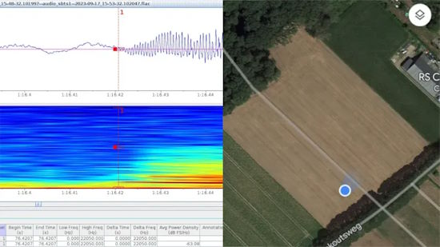](https://github.com/hcfman/sbts-aru)

If you have multiple microphones in known locations, and can determine the time a sound arrives at each one, you can actually determine the location that sound is coming from. This technique is referred to as sound localization via time difference of arrival. Kim Hendrikse decided to put the technique to good use to track down the location of illicit fireworks launches.

The build is based on the Raspberry Pi, with Kim developing an “autonomous recording unit” complete with GPS module for determining their location and keeping everything time synchronized. By deploying a number of these units, spread out over some distance, it’s possible to localize loud sounds based on the time stamps they show up in the recording on each unit - [GitHub](https://github.com/hcfman/sbts-aru), [Medium](https://github.com/hcfman/sbts-aru) and [Hackaday](https://hackaday.com/2023/12/30/localizing-fireworks-launches-with-a-raspberry-pi/).

## Popular Last Week

What was a popular, clicked link, in [last week's newsletter](https://www.adafruitdaily.com/2024/01/01/python-on-microcontrollers-newsletter-micropython-v1-22-0-is-out-freertos-adds-multiprocessing-and-much-more-circuitpython-python-micropython-thepsf-raspberry_pi/)? [10 Raspberry Pi Projects with Python to Boost Your Skills](https://all3dp.com/2/best-raspberry-pi-projects-with-python/).

## New Notes from Adafruit Playground

[Adafruit Playground](https://adafruit-playground.com/) is a new place for the community to post their projects and other making tips/tricks/techniques. Ad-free, it's an easy way to publish your work in a safe space for free.

A morse keyer using a Feather RP2040 and CircuitPython - [Adafruit Playground](https://adafruit-playground.com/u/petitnoel/pages/rp2040-cw-keyer).

## News from around the Web

A 1 button arcade game calls for a custom 1 button arcade console! Guy Dupont built this little Bluetooth cabinet to play JOUNCER PX. Designed in OpenSCAD, printed in PETG. Just an arcade button, LED, battery, power switch, and nRF52840 running CircuitPython - [X Thread](https://twitter.com/gvy_dvpont/status/1743114075234611597).

A 13.3 inch epaper display working with CircuitPython - [Mastodon](https://octodon.social/@tannewt@mastodon.online/111687706928531903).

[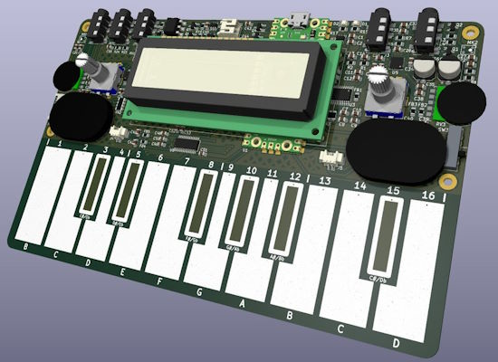](https://pico-synth-sandbox.dcdalrymple.com/revision-2/)

PCB Revision 2 of the Pico Synth Soundbox has been released using CircuitPython - [pico-synth-sandbox](https://pico-synth-sandbox.dcdalrymple.com/revision-2/).

[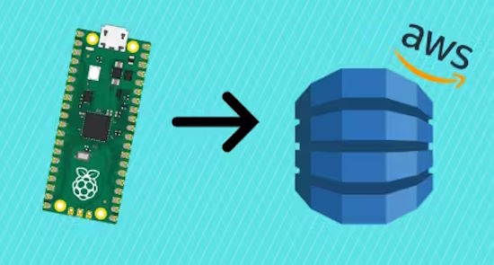](https://www.hackster.io/shilleh/how-to-send-data-to-aws-dynamodb-from-raspberry-pi-pico-w-6a4ee1)

How to Send Data to AWS DynamoDB in MicroPython from Raspberry Pi Pico W - [hackster.io](https://www.hackster.io/shilleh/how-to-send-data-to-aws-dynamodb-from-raspberry-pi-pico-w-6a4ee1).

[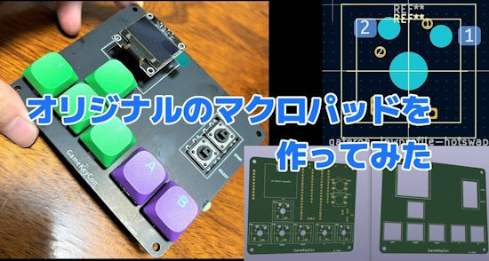](https://inajob.hatenablog.jp/entry/diy-macropad)

A versatile macropad able to use one of two different microcontrollers and three types of keyswitches using CircuitPython - [Hatena Blog](https://inajob.hatenablog.jp/entry/diy-macropad) (Japanese).

PROJEKT: OVERFLOW is a RISC-V assembly board game - [punkx.org](https://punkx.org/overflow/).

> "The game is about creating a small shellcode in memory by copying existing instructions and then exploiting a buffer overflow to jump into it, so that you can overwrite your opponent’s return address to force them to go to the `game_over()` function.There are other mechanics as well and more layers of strategy (like setting the exception handler or monkeypatching)."

[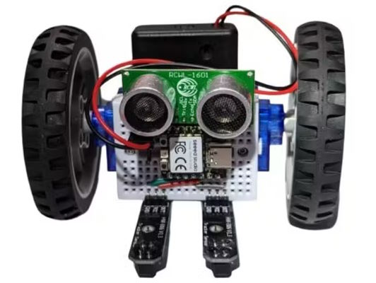](https://www.hackster.io/konstantint/breadboardbot-ec993d)

BreadboardBot is a tiny, versatile and fun toy robotics platform made from a mini-breadboard, two servo-motors with wheels, a Xiao RP2040 and CircuitPython - [hackster.io](https://www.hackster.io/konstantint/breadboardbot-ec993d).

Simon Prickett is doing a series of live streams on the M5Stack Atom Matrix with MicroPython - [GitHub](https://github.com/simonprickett/m5stack-atom-micropython).

[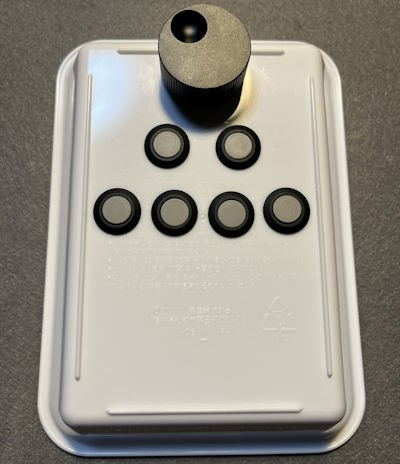](https://twitter.com/yawatta/status/1740726005453770891)

A Left-handed HID input device with rotary encoder and buttons with Raspberry Pi RP2040 and CircuitPython - [X](https://twitter.com/yawatta/status/1740726005453770891) (Japanese).

Implementating of the [DayDreamer](https://danijar.com/daydreamer/) algorithm in TensorFlow 2 with Python and Jupyter Notebooks - [GitHub](https://github.com/danijar/daydreamer) and [project website](https://danijar.com/project/daydreamer/).

[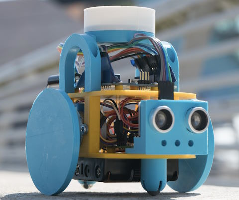](https://www.raspberrypi.com/news/how-to-build-a-pico-powered-hull-pixelbot/)

The Hull Pixelbot is a little robot with a pixel on the top. A tiny programming language, ‘Python-ish’, was developed that runs directly on the robot. The robot can obey Python-ish commands directly at any time – even when running a program - [Raspberry Pi News](https://www.raspberrypi.com/news/how-to-build-a-pico-powered-hull-pixelbot/).

[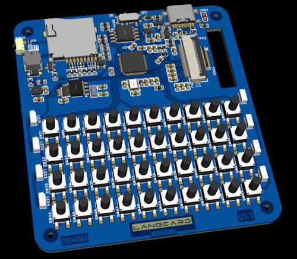](https://hackaday.io/project/194245-langcard)

LangCard is a full keyboard development board for learning programming languages such as CircuitPython, MicroPython, C++, uLisp, etc. - [hackaday.io](https://hackaday.io/project/194245-langcard).

Take the video stream from an ESP32Cam and process it for faces on another, connected computer in Python and OpenCV - [YouTube](https://www.youtube.com/watch?v=DmWkxABZ69o) and [GitHub](https://github.com/kevinmcaleer/esp32cam_rtspstream) via [X](https://twitter.com/kevsmac/status/1741737938960982435).

An interactive flip flop simulation in Python and Jupyter Notebook - [GitHub](https://github.com/mattvenn/flipflop_demo) and [YouTube](https://www.youtube.com/watch?v=5PRuPVIjEcs).

Another Python web framework? Really? But Miguel Grinberg claims Microdot is different! It's small enough to work with MicroPython, compatible with CPython, and has Flask-like syntax - [blog.miguelgrinberg.com/](https://blog.miguelgrinberg.com/post/microdot-yet-another-python-web-framework) via [X](https://twitter.com/grandiopanda/status/1741908414287040956).

Shed Skin is a transpiler which can translate pure, but implicitly statically typed Python 3 programs into optimized C++. It can generate stand-alone programs or extension modules that can be imported and used in larger Python programs - [GitHub](https://github.com/shedskin/shedskin/tree/master?tab=readme-ov-file).

[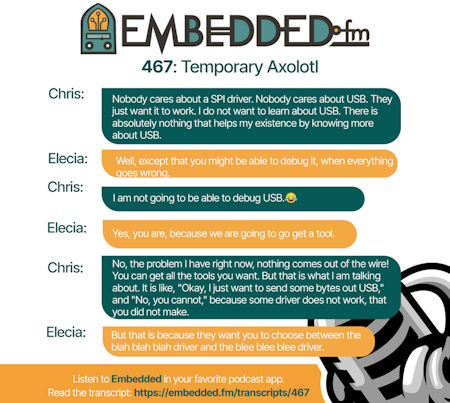](https://twitter.com/embeddedfm/status/1742625259344323061)

If you're an embedded software developer, you'll want to check out embedded.fm. Chris and Elicia know their stuff and are funny doing so - [embedded.fm podcast](https://embedded.fm/episodes/467) and [transcript](https://embedded.fm/transcripts/467), via [X](https://twitter.com/embeddedfm/status/1742625259344323061).

[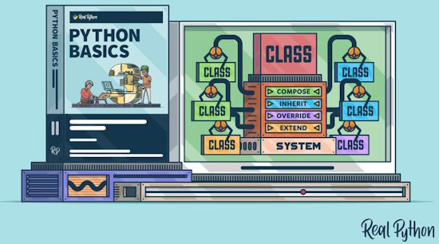](https://realpython.com/courses/python-basics-class/)

Python Basics: Building Systems With Classes - [Real Python](https://realpython.com/courses/python-basics-class/).

[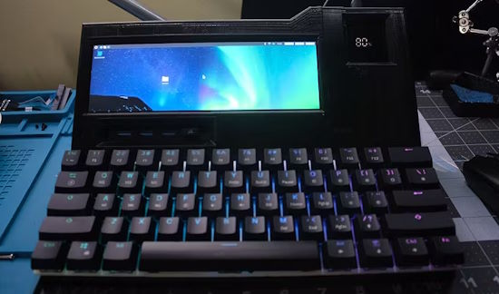](https://www.hackster.io/news/keigen7-s-sleek-3d-printed-raspberry-pi-4-cyberdeck-rings-in-2024-in-style-4f81c6c29d2a)

A 3D-printed Raspberry Pi 4 Cyberdeck - [hackster.io](https://www.hackster.io/news/keigen7-s-sleek-3d-printed-raspberry-pi-4-cyberdeck-rings-in-2024-in-style-4f81c6c29d2a) and [Reddit](https://www.reddit.com/r/cyberDeck/comments/18vcwcl/simple_cyberdeck_build_built_with_raspberry_pi_4b/).

## New

ProPico is an "Improved Raspberry Pi Pico" with better ADC, USB Type-C, and more - [website](https://dmytroengineering.com/content/projects/pro-pico) and [hackster.io](https://www.hackster.io/news/dmytro-s-propico-is-an-improved-raspberry-pi-pico-with-better-adc-usb-type-c-and-more-032d59ebb4a3).

Melopero Sensei is a development board based on the Raspberry Pi RP2040 microcontroller equipped with a 1.3” TFT 240×240 display and a variety of sensors - [Melopero](https://www.melopero.com/shop/melopero/melopero-sensei/).

## New Boards Supported by CircuitPython

The number of supported microcontrollers and Single Board Computers (SBC) grows every week. This section outlines which boards have been included in CircuitPython or added to [CircuitPython.org](https://circuitpython.org/).

This week, there were no new boards added, but several are in development.

*Note: For non-Adafruit boards, please use the support forums of the board manufacturer for assistance, as Adafruit does not have the hardware to assist in troubleshooting.*

Looking to add a new board to CircuitPython? It's highly encouraged! Adafruit has four guides to help you do so:

- [How to Add a New Board to CircuitPython](https://learn.adafruit.com/how-to-add-a-new-board-to-circuitpython/overview)
- [How to add a New Board to the circuitpython.org website](https://learn.adafruit.com/how-to-add-a-new-board-to-the-circuitpython-org-website)
- [Adding a Single Board Computer to PlatformDetect for Blinka](https://learn.adafruit.com/adding-a-single-board-computer-to-platformdetect-for-blinka)
- [Adding a Single Board Computer to Blinka](https://learn.adafruit.com/adding-a-single-board-computer-to-blinka)

## New Learn Guides

WIth the holidays, there are no new guides this week.

## CircuitPython Libraries

The CircuitPython library numbers are continually increasing, while existing ones continue to be updated. Here we provide library numbers and updates!

To get the latest Adafruit libraries, download the [Adafruit CircuitPython Library Bundle](https://circuitpython.org/libraries). To get the latest community contributed libraries, download the [CircuitPython Community Bundle](https://circuitpython.org/libraries).

If you'd like to contribute to the CircuitPython project on the Python side of things, the libraries are a great place to start. Check out the [CircuitPython.org Contributing page](https://circuitpython.org/contributing). If you're interested in reviewing, check out Open Pull Requests. If you'd like to contribute code or documentation, check out Open Issues. We have a guide on [contributing to CircuitPython with Git and GitHub](https://learn.adafruit.com/contribute-to-circuitpython-with-git-and-github), and you can find us in the #help-with-circuitpython and #circuitpython-dev channels on the [Adafruit Discord](https://adafru.it/discord).

You can check out this [list of all the Adafruit CircuitPython libraries and drivers available](https://github.com/adafruit/Adafruit_CircuitPython_Bundle/blob/master/circuitpython_library_list.md). 

The current number of CircuitPython libraries is **471**!

**Updated Libraries**

Here's this week's updated CircuitPython libraries:

  * [adafruit/Adafruit_CircuitPython_LPS2X](https://github.com/adafruit/Adafruit_CircuitPython_LPS2X)
  * [jins-tkomoda/CircuitPython_MPU6886](https://github.com/jins-tkomoda/CircuitPython_MPU6886)

**Library PyPI Weekly Download Stats**

**Total Library Stats**

  * 56744 PyPI downloads over 323 libraries

**Top 10 Libraries by PyPI Downloads**

  * Adafruit CircuitPython BusDevice (adafruit-circuitpython-busdevice): 6839
  * Adafruit CircuitPython Requests (adafruit-circuitpython-requests): 6358
  * Adafruit CircuitPython Register (adafruit-circuitpython-register): 1929
  * Adafruit CircuitPython MiniMQTT (adafruit-circuitpython-minimqtt): 927
  * Adafruit CircuitPython PCA9685 (adafruit-circuitpython-pca9685): 867
  * Adafruit CircuitPython Pixelbuf (adafruit-circuitpython-pixelbuf): 739
  * Adafruit CircuitPython NeoPixel (adafruit-circuitpython-neopixel): 722
  * Adafruit CircuitPython DHT (adafruit-circuitpython-dht): 717
  * Adafruit CircuitPython Motor (adafruit-circuitpython-motor): 629
  * Adafruit CircuitPython ADS1x15 (adafruit-circuitpython-ads1x15): 611

## What’s the CircuitPython team up to this week?

What is the team up to this week? Let’s check in:

**Melissa**

This past week with it being slow, I decided to add `vectorio` support to [Blinka Displayio](https://github.com/adafruit/Adafruit_Blinka_Displayio). While I was in there, I removed Pillow as a requirement, which was only being used to load a font, so the entire library is now pure Python code, which makes it much more portable to other boards.

**Tim**

I took time off over the holiday and New Years. During some downtime I continued work on the `displayio` soft keyboard library. I also worked on the `Blinka_DisplayIO_PyGame_Display` library, it has needed re-writing to work with latest versions of `Blinka_DisplayIO`. It's functional and most of the major issues are tackled now, with only a few smaller quirks to work out.

**Jeff**

Like many folks I have been taking it easy around the end of the year. However, I did do a few things. One of them was to enable the `hashlib` module across many more boards. At this time, the pull request is ready for review.

I'm really proud of what I accomplished in 2023. Here's a GitHub skyline to remember the year by:

## Upcoming Events

The next MicroPython Meetup in Melbourne will be on January 24th – [Meetup](https://www.meetup.com/micropython-meetup/events). 

PyCascades 2024 is back in Seattle, Washington, USA and online, April 5-8th at the University of Washington's Kane Hall. - [PyCascades](https://2024.pycascades.com/).

PyCon US 2024 Launches - May 15-23, 2024 in Pittsburgh, Pennsylvania US - [PyCon US](https://pycon.blogspot.com/2024/10/pycon-us-2024-launches.html).

**Send Your Events In**

If you know of virtual events or upcoming events, please let us know via email to cpnews(at)adafruit(dot)com.

## Latest Releases

CircuitPython's stable release is [8.2.9](https://github.com/adafruit/circuitpython/releases/latest) and its unstable release is [9.0.0 alpha 6](https://github.com/adafruit/circuitpython/releases). New to CircuitPython? Start with our [Welcome to CircuitPython Guide](https://learn.adafruit.com/welcome-to-circuitpython).

[20240105](https://github.com/adafruit/Adafruit_CircuitPython_Bundle/releases/latest) is the latest Adafruit CircuitPython library bundle.

[20231230](https://github.com/adafruit/CircuitPython_Community_Bundle/releases/latest) is the latest CircuitPython Community library bundle.

[v1.22.1](https://micropython.org/download) (general)is the latest MicroPython release. Documentation for it is [here](http://docs.micropython.org/en/latest/pyboard/).

[3.12.1](https://www.python.org/downloads/) is the latest Python release. The latest pre-release version is [3.13.0a2](https://www.python.org/download/pre-releases/).

[3,778 Stars](https://github.com/adafruit/circuitpython/stargazers) Like CircuitPython? [Star it on GitHub!](https://github.com/adafruit/circuitpython)

## Call for Help -- Translating CircuitPython is now easier than ever

One important feature of CircuitPython is translated control and error messages. With the help of fellow open source project [Weblate](https://weblate.org/), we're making it even easier to add or improve translations. 

Sign in with an existing account such as GitHub, Google or Facebook and start contributing through a simple web interface. No forks or pull requests needed! As always, if you run into trouble join us on [Discord](https://adafru.it/discord), we're here to help.

## 38,412 Thanks

The Adafruit Discord community, where we do all our CircuitPython development in the open, reached over 38,412 humans - thank you! Adafruit believes Discord offers a unique way for Python on hardware folks to connect. Join today at [https://adafru.it/discord](https://adafru.it/discord).

## ICYMI - In case you missed it

Python on hardware is the Adafruit Python video-newsletter-podcast! The news comes from the Python community, Discord, Adafruit communities and more and is broadcast on ASK an ENGINEER Wednesdays. The complete Python on Hardware weekly videocast [playlist is here](https://www.youtube.com/playlist?list=PLjF7R1fz_OOXRMjM7Sm0J2Xt6H81TdDev). The video podcast is on [iTunes](https://itunes.apple.com/us/podcast/python-on-hardware/id1451685192?mt=2), [YouTube](http://adafru.it/pohepisodes), [Instagram Reels](https://www.instagram.com/adafruit/channel/)), and [XML](https://itunes.apple.com/us/podcast/python-on-hardware/id1451685192?mt=2).

[The weekly community chat on Adafruit Discord server CircuitPython channel - Audio / Podcast edition](https://itunes.apple.com/us/podcast/circuitpython-weekly-meeting/id1451685016) - Audio from the Discord chat space for CircuitPython, meetings are usually Mondays at 2pm ET, this is the audio version on [iTunes](https://itunes.apple.com/us/podcast/circuitpython-weekly-meeting/id1451685016), Pocket Casts, [Spotify](https://adafru.it/spotify), and [XML feed](https://adafruit-podcasts.s3.amazonaws.com/circuitpython_weekly_meeting/audio-podcast.xml).

## Contribute

The CircuitPython Weekly Newsletter is a CircuitPython community-run newsletter emailed every Tuesday. The complete [archives are here](https://www.adafruitdaily.com/category/circuitpython/). It highlights the latest CircuitPython related news from around the web including Python and MicroPython developments. To contribute, edit next week's draft [on GitHub](https://github.com/adafruit/circuitpython-weekly-newsletter/tree/gh-pages/_drafts) and [submit a pull request](https://help.github.com/articles/editing-files-in-your-repository/) with the changes. You may also tag your information on Twitter with #CircuitPython. 

Join the Adafruit [Discord](https://adafru.it/discord) or [post to the forum](https://forums.adafruit.com/viewforum.php?f=60) if you have questions.
