- [ ] Library and info updates
- [ ] change date
- [ ] update title
- [ ] Feature story
- [ ] Update  for images
- [ ] Update ICYDNCI
- [ ] All images 550w max only
- [ ] Link "View this email in your browser."

News Sources

- [Adafruit Playground](https://adafruit-playground.com/)
- Twitter: [CircuitPython](https://twitter.com/search?q=circuitpython&src=typed_query&f=live), [MicroPython](https://twitter.com/search?q=micropython&src=typed_query&f=live) and [Python](https://twitter.com/search?q=python&src=typed_query)
- [Raspberry Pi News](https://www.raspberrypi.com/news/)
- Mastodon [CircuitPython](https://octodon.social/tags/CircuitPython) and [MicroPython](https://octodon.social/tags/MicroPython)
- [hackster.io CircuitPython](https://www.hackster.io/search?q=circuitpython&i=projects&sort_by=most_recent) and [MicroPython](https://www.hackster.io/search?q=micropython&i=projects&sort_by=most_recent)
- [python.org](https://www.python.org/)
- [Python Insider - dev team blog](https://pythoninsider.blogspot.com/)
- Individuals: [Jeff Geerling](https://www.jeffgeerling.com/blog)
- [hackaday CircuitPython](https://hackaday.com/blog/?s=circuitpython) and [MicroPython](https://hackaday.com/blog/?s=micropython)
- [hackaday.io newest projects MicroPython](https://hackaday.io/projects?tag=micropython&sort=date) and [CircuitPython](https://hackaday.io/projects?tag=circuitpython&sort=date)
- [https://opensource.com/tags/python](https://opensource.com/tags/python)
- Check Issues and PRs for input

View this email in your browser. **Warning: Flashing Imagery**

Welcome to the latest Python on Microcontrollers newsletter! *insert 2-3 sentences from editor (what's in overview, banter)* - *Anne Barela, Ed.*

We're on [Discord](https://discord.gg/HYqvREz), [Twitter](https://twitter.com/search?q=circuitpython&src=typed_query&f=live), and for past newsletters - [view them all here](https://www.adafruitdaily.com/category/circuitpython/). If you're reading this on the web, [subscribe here](https://www.adafruitdaily.com/). Here's the news this week:

## Thea Flowers is Now the New OSHWA Board President

[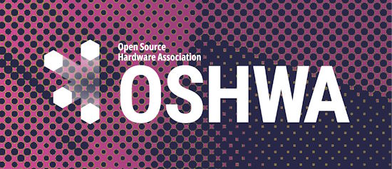](https://www.oshwa.org/2024/01/14/welcome-thea-flowers-new-oshwa-board-president/)

The Open Source Hardware Association (OSHWA) welcomes Thea “Stargirl” Flowers as the new OSHWA Board President.

> As many members of the OSHWA community already know, Thea is a creative technologist and passionate open source advocate.  She is the creator of the Winterbloom open source synthesizers ([many of which](https://certification.oshwa.org/list.html?q=winterbloom) are OSHWA certified).  Thea is also the creator of [KiCanvas](https://kicanvas.org/), a maintainer of CircuitPython, and a former Python Software Foundation Fellow.  Oh, and she recently [redesigned](https://www.oshwa.org/2023/07/19/new-oshw-certification-mark-usage-guide-and-directory-updates/) the certification mark brand guide - [OSHWA](https://www.oshwa.org/2024/01/14/welcome-thea-flowers-new-oshwa-board-president/).

## Raspberry Pi is now manufacturing 70,000 Pi 5s per week, will surge to 90,000 in February

[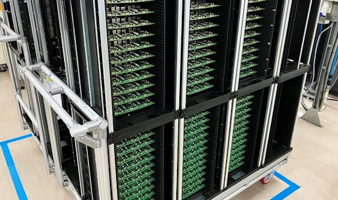](https://www.tomshardware.com/raspberry-pi/raspberry-pi-is-now-manufacturing-70000-pi-5s-per-week-will-surge-to-90000-in-february)

Raspberry Pi Ltd is currently producing 70,000 Raspberry Pi 5 boards a week with plans to scale up to as many as 90,000 units per week in the near future. 

Raspberry Pi CEO Eben Upton shared the promising news with Tom's Hardware, along with the picture above, which he says he took during a recent factory visit. It shows dozens of panels filled with completed Raspberry Pi 5 boards that are about to be tested and packed for shipping. Each panel in the picture (shown uncropped below) contains nine individual Pi boards - [Tom's Hardware](https://www.tomshardware.com/raspberry-pi/raspberry-pi-is-now-manufacturing-70000-pi-5s-per-week-will-surge-to-90000-in-february).

## CircuitPython Online IDE 2 Alpha Launched

[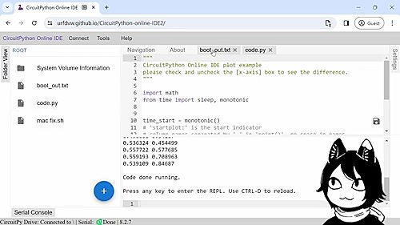](https://twitter.com/River___Wang/status/1746811619563241484)

River Wang has released an alpha revision to the CircuitPython Online IDE (integrated development environment). They're looking for feedback - [X](https://twitter.com/River___Wang/status/1746811619563241484), [Mastodon](https://octodon.social/@Riverwang@fosstodon.org/111759021894663729) and [IDE](https://urfdvw.github.io/CircuitPython-online-IDE2/).

## Four Raspberry Pi 5 projects to Make Use of the Power of One of the Best SBCs Out There

The Raspberry Pi 5 is a single board computer that has seen a significant boost to performance this generation. With support for PCIE devices, massive overclocking headroom, a physical on / off switch and an active cooling option, Notebook Check presents 4 projects to get folks started with a new Raspberry Pi - [Notebook Check](https://www.notebookcheck.net/4-Raspberry-Pi-5-projects-to-make-use-of-the-power-of-one-of-the-best-SBCs-out-there.792524.0.html).

## Raspberry Pi Compute Module 5 is in Development, CEO Eben Upton Confirms

[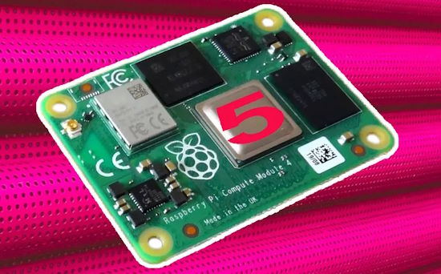](https://www.tomshardware.com/raspberry-pi/raspberry-pi-compute-module-5-confirmed-by-ceo-eben-upton)

Raspberry Pi YouTuber Jeff Geerling had the chance to interview Raspberry Pi CEO Eben Upton at CES. During the interview, Upton confirming that Raspberry Pi 5 production is ramping up, and first confirmation that the Raspberry Pi Compute Module 5 is an upcoming product in 2024 - [Tom's Hardware](https://www.tomshardware.com/raspberry-pi/raspberry-pi-compute-module-5-confirmed-by-ceo-eben-upton) and [YouTube](https://youtu.be/Lky4FSfbc1E).

## EU’s Cyber Resilience Act Passes with Wins for Open Source

Six weeks ago, [we reported](https://blog.adafruit.com/2023/12/05/icymi-python-on-microcontrollers-newsletter-raspberry-pi-hints-2024-products-eu-and-open-source-and-more-circuitpython-python-micropython-icymi-raspberry_pi/) the Python Software Foundation was bristling at European Cybersecurity rules on Open Source Software. The Foundation writes:

> "The good news is that CRA text changed a lot between the time the open source community – including the PSF – started expressing our concerns and the Act’s final text which was cemented on December 1st. That text introduces the idea of an 'open source steward'.” - [PSF](https://pyfound.blogspot.com/2024/01/CRA-update.html).

## Espressif Reveals ESP32-P4: A High-Performance MCU with Numerous IO-Connectivity and Security Features

Espressif has announced the ESP32-P4, a high-performance MCU with numerous IO-connectivity and security features. It is powered by a dual-core RISC-V CPU with an AI instructions extension, an advanced memory subsystem, and integrated high-speed peripherals - [Espressif](https://www.espressif.com/en/news/ESP32-P4).

## This Week's Python Streams

Python on Hardware is all about building a cooperative ecosphere which allows contributions to be valued and to grow knowledge. Below are the streams within the last week focusing on the community.

**CircuitPython Deep Dive Stream**

[Last Friday](link), Scott streamed work on {subject}.

You can see the latest video and past videos on the Adafruit YouTube channel under the Deep Dive playlist - [YouTube](https://www.youtube.com/playlist?list=PLjF7R1fz_OOXBHlu9msoXq2jQN4JpCk8A).

**CircuitPython Parsec**

John Park’s CircuitPython Parsec this week is on {subject} - [Adafruit Blog](link) and [YouTube](link).

Catch all the episodes in the [YouTube playlist](https://www.youtube.com/playlist?list=PLjF7R1fz_OOWFqZfqW9jlvQSIUmwn9lWr).

**CircuitPython Weekly Meeting**

CircuitPython Weekly Meeting for January 16, 2024 ([notes](https://github.com/adafruit/adafruit-circuitpython-weekly-meeting/blob/main/2024/2024-01-16.md)) [on YouTube](https://youtu.be/0AiRXLfS2G4).

## Project of the Week

text - [site](url).

## Popular Last Week

[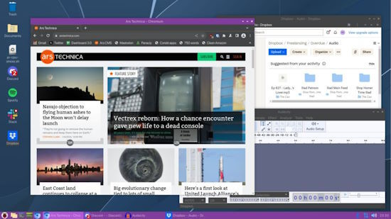](url)

What was the most popular, most clicked link, in [last week's newsletter](newslink)? [title](url).

## New Notes from Adafruit Playground

[Adafruit Playground](https://adafruit-playground.com/) is a new place for the community to post their projects and other making tips/tricks/techniques. Ad-free, it's an easy way to publish your work in a safe space for free.

[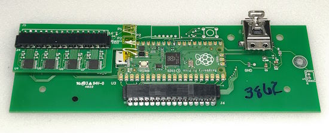](https://adafruit-playground.com/u/jepler/pages/unicomp-mini-m-with-circuitpython)

Programming a Unicomp Mini M keyboard with CircuitPython - [Adafruit Playground](https://adafruit-playground.com/u/jepler/pages/unicomp-mini-m-with-circuitpython).

text - [Adafruit Playground](url).

text - [Adafruit Playground](url).

## News from around the web

[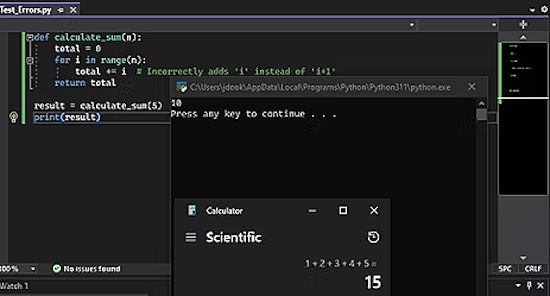](https://www.howtogeek.com/beginners-guide-to-debugging-python-functions/)

A beginner's guide to debugging Python functions effectively - [How-To Geek](https://www.howtogeek.com/beginners-guide-to-debugging-python-functions/).

Python packaging, one year later: a look back at 2023 in Python packaging - [Chris Warrick](https://chriswarrick.com/blog/2024/01/15/python-packaging-one-year-later/).

[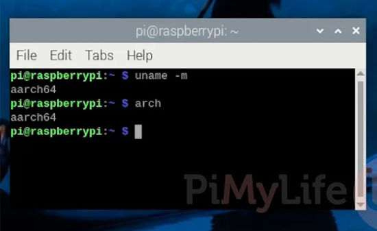](https://pimylifeup.com/raspberry-pi-os-check-32-bit-64-bit/)

How to check if you’re running Raspberry Pi OS 32-bit or 64-bit - [PiMyLifeUp](https://pimylifeup.com/raspberry-pi-os-check-32-bit-64-bit/).

[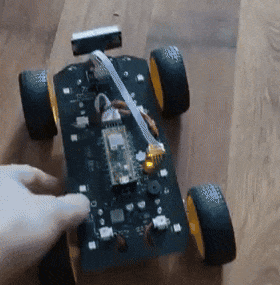](https://twitter.com/piers_storey/status/1746552467880386639)

> "First re-write of the Arduino RC car into MicroPython with the DC motor control. It's a bit hard coded atm but functionally it works" - [X](https://twitter.com/piers_storey/status/1746552467880386639).

[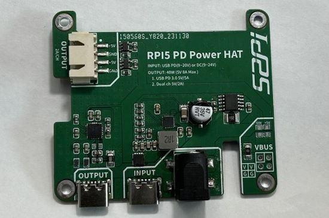](https://github.com/geerlingguy/raspberry-pi-pcie-devices/issues/587)

52Pi is solving the Raspberry Pi 5's PD problem (5v/5A supplies are rare) with a new PD Power HAT - [GitHub](https://github.com/geerlingguy/raspberry-pi-pcie-devices/issues/587) via [X](https://twitter.com/geerlingguy/status/1747300481347559831).

text - [site](url).

text - [site](url).

[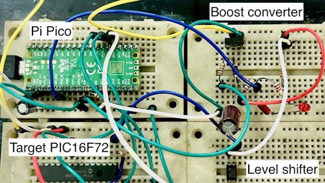](https://twitter.com/MicrochipMakes/status/1746553251028168710)

A quick and dirty PIC16F72 programmer with a Raspberry Pi Pico and MicroPython - [Tahmid's blog](https://twitter.com/MicrochipMakes/status/1746553251028168710) via [X](https://twitter.com/MicrochipMakes/status/1746553251028168710).

[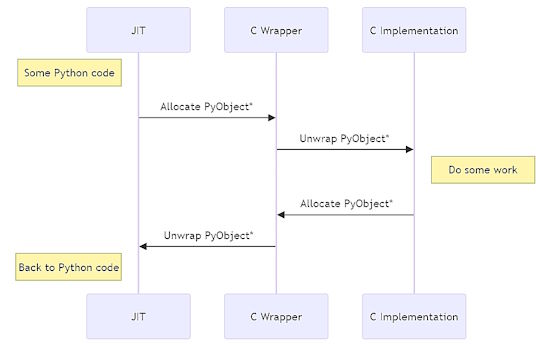](https://bernsteinbear.com/blog/typed-c-extensions/)

Type information for faster Python C extensions - [Bernsteinbear.com](https://bernsteinbear.com/blog/typed-c-extensions/).

text - [site](url).

text - [site](url).

text - [site](url).

text - [site](url).

text - [site](url).

text - [site](url).

text - [site](url).

Huawei chip design arm HiSilicon launches RISC-V MCUs to overcome Arm restrictions - [Tom's Hardware](https://www.tomshardware.com/news/huaweis-hisilicon-develops-first-risc-v-design-to-overcome-arm-restrictions) and [DigiTimes Asia](https://www.digitimes.com/news/a20240115PD228/huawei-hisilicon-risc-v-mcu.html).

[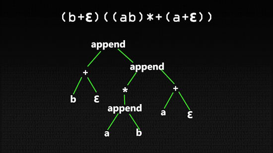](https://www.youtube.com/watch?v=DqabogrIVNk)

Python Regular Expressions (video) - [YouTube](https://www.youtube.com/watch?v=DqabogrIVNk).

## New

[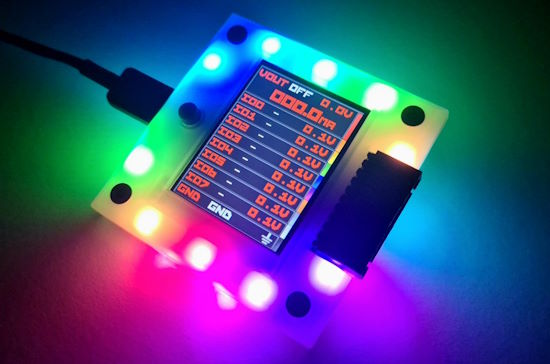](https://hardware.buspirate.com/)

Bus Pirate 5 REV 10 hardware is finally for sale. Bus Pirate 5 is an open-source hardware debugging tool that converts simple commands into common bus protocols such as 1-Wire, I2C, SPI, UART, several LEDs and more. Send commands to a chip or sensor and get the response, without writing a line of code - [Bus Pirate](https://hardware.buspirate.com/).

[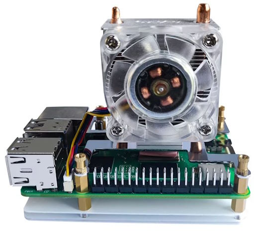](https://bret.dk/raspberry-pi-5-ice-tower-cooler-review/)

A review of the Raspberry Pi 5 ICE tower cooler - [bret.dk](https://bret.dk/raspberry-pi-5-ice-tower-cooler-review/).

text - [site](url).

## New Boards Supported by CircuitPython

The number of supported microcontrollers and Single Board Computers (SBC) grows every week. This section outlines which boards have been included in CircuitPython or added to [CircuitPython.org](https://circuitpython.org/).

This week, there were (#/no) new boards added:

- [Board name](url)
- [Board name](url)
- [Board name](url)

*Note: For non-Adafruit boards, please use the support forums of the board manufacturer for assistance, as Adafruit does not have the hardware to assist in troubleshooting.*

Looking to add a new board to CircuitPython? It's highly encouraged! Adafruit has four guides to help you do so:

- [How to Add a New Board to CircuitPython](https://learn.adafruit.com/how-to-add-a-new-board-to-circuitpython/overview)
- [How to add a New Board to the circuitpython.org website](https://learn.adafruit.com/how-to-add-a-new-board-to-the-circuitpython-org-website)
- [Adding a Single Board Computer to PlatformDetect for Blinka](https://learn.adafruit.com/adding-a-single-board-computer-to-platformdetect-for-blinka)
- [Adding a Single Board Computer to Blinka](https://learn.adafruit.com/adding-a-single-board-computer-to-blinka)

## New Learn Guides

[LED Glasses Custom Animated Graphics with Sprites](https://learn.adafruit.com/led-glasses-custom-animated-graphics-with-sprites) from [Erin St Blaine](https://learn.adafruit.com/u/firepixie)

[NeoPixel Rotary Fidget](https://learn.adafruit.com/neopixel-rotary-fidget) from [Ruiz Brothers](https://learn.adafruit.com/u/pixil3d)

## Updated Learn Guides

[Adafruit MEMENTO Camera Board](https://learn.adafruit.com/adafruit-memento-camera-board)

## CircuitPython Libraries

The CircuitPython library numbers are continually increasing, while existing ones continue to be updated. Here we provide library numbers and updates!

To get the latest Adafruit libraries, download the [Adafruit CircuitPython Library Bundle](https://circuitpython.org/libraries). To get the latest community contributed libraries, download the [CircuitPython Community Bundle](https://circuitpython.org/libraries).

If you'd like to contribute to the CircuitPython project on the Python side of things, the libraries are a great place to start. Check out the [CircuitPython.org Contributing page](https://circuitpython.org/contributing). If you're interested in reviewing, check out Open Pull Requests. If you'd like to contribute code or documentation, check out Open Issues. We have a guide on [contributing to CircuitPython with Git and GitHub](https://learn.adafruit.com/contribute-to-circuitpython-with-git-and-github), and you can find us in the #help-with-circuitpython and #circuitpython-dev channels on the [Adafruit Discord](https://adafru.it/discord).

You can check out this [list of all the Adafruit CircuitPython libraries and drivers available](https://github.com/adafruit/Adafruit_CircuitPython_Bundle/blob/master/circuitpython_library_list.md). 

The current number of CircuitPython libraries is **###**!

**New Libraries**

Here's this week's new CircuitPython libraries:

* [library](url)

**Updated Libraries**

Here's this week's updated CircuitPython libraries:

* [library](url)

**Library PyPI Weekly Download Stats**

## What’s the CircuitPython team up to this week?

What is the team up to this week? Let’s check in:

**Dan**

I'm experimentally updating the CircuitPython **nrf** port to use the latest version of the **nrfx** library from Nordic. It fixes at least one issue we had to work around in the past, and I'll see what else it improves as well.

**Melissa**

This past week, I've been working on trying to get the Displays working on Raspberry Pi Bookworm. I've had some success and will continue working on those until we have something easy to install. Many guide updates will likely be needed after that.

**Tim**

This week I looked into some `DisplayIO` bugs, one related to non built-in Eink displays not refreshing in some cases, and another for the Flip Input widget that is a result of incompatibility with the current version of the `Display_Text` library. I've also started a new game project that will become an Adafruit Learn guide, it's an implementation of a 1 dimensional pacman style game that has a single long hallway map that fits perfectly on one of the very long Qualia displays. I'm planning to mount everything to a cardboard box and print out some decals for the outside that are inspired by the original game's arcade cabinet.

**Jeff**

I've continued to work on the pull request to add "bitmapfilter", a small collection of routines for manipulating bitmaps. Since the last update, I added a routine for false color mapping and one for applying look-up tables to image channels.

**Scott**

Last week I was away visiting family. This week I'm getting caught up and wrapping up the SD card over WiFi and BLE support.

**Liz**

This week I worked on two new product guides: the 3.5" capacitive touch TFT FeatherWing and the MCP3421, which is an 18-bit ADC. Both guides have pages for overview, pinouts, CircuitPython, Arduino and resources for download. I also worked on some code for the NeoPixel Rotary Fidget project. I was able to incorporate a smaller version of an older project, the NeoPixel run game, which the Ruiz brothers and I had wanted to do for quite some time.

## Upcoming Events

The next MicroPython Meetup in Melbourne will be on January 24th – [Meetup](https://www.meetup.com/micropython-meetup/events). 

PyCascades 2024 is back in Seattle, Washington, USA and online, April 5-8th at the University of Washington's Kane Hall. - [PyCascades](https://2024.pycascades.com/).

PyCon US 2024 Launches - May 15-23, 2024 in Pittsburgh, Pennsylvania US - [PyCon US](https://pycon.blogspot.com/2024/10/pycon-us-2024-launches.html).

**Send Your Events In**

If you know of virtual events or upcoming events, please let us know via email to cpnews(at)adafruit(dot)com.

## Latest Releases

CircuitPython's stable release is [#.#.#](https://github.com/adafruit/circuitpython/releases/latest) and its unstable release is [#.#.#-##.#](https://github.com/adafruit/circuitpython/releases). New to CircuitPython? Start with our [Welcome to CircuitPython Guide](https://learn.adafruit.com/welcome-to-circuitpython).

[2024####](https://github.com/adafruit/Adafruit_CircuitPython_Bundle/releases/latest) is the latest Adafruit CircuitPython library bundle.

[2024####](https://github.com/adafruit/CircuitPython_Community_Bundle/releases/latest) is the latest CircuitPython Community library bundle.

[v#.#.#](https://micropython.org/download) is the latest MicroPython release. Documentation for it is [here](http://docs.micropython.org/en/latest/pyboard/).

[#.#.#](https://www.python.org/downloads/) is the latest Python release. The latest pre-release version is [#.#.#](https://www.python.org/download/pre-releases/).

[#,### Stars](https://github.com/adafruit/circuitpython/stargazers) Like CircuitPython? [Star it on GitHub!](https://github.com/adafruit/circuitpython)

## Call for Help -- Translating CircuitPython is now easier than ever

[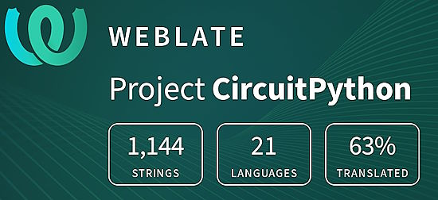](https://hosted.weblate.org/engage/circuitpython/)

One important feature of CircuitPython is translated control and error messages. With the help of fellow open source project [Weblate](https://weblate.org/), we're making it even easier to add or improve translations. 

Sign in with an existing account such as GitHub, Google or Facebook and start contributing through a simple web interface. No forks or pull requests needed! As always, if you run into trouble join us on [Discord](https://adafru.it/discord), we're here to help.

## NUMBER Thanks

The Adafruit Discord community, where we do all our CircuitPython development in the open, reached over NUMBER humans - thank you! Adafruit believes Discord offers a unique way for Python on hardware folks to connect. Join today at [https://adafru.it/discord](https://adafru.it/discord).

## ICYMI - In case you missed it

Python on hardware is the Adafruit Python video-newsletter-podcast! The news comes from the Python community, Discord, Adafruit communities and more and is broadcast on ASK an ENGINEER Wednesdays. The complete Python on Hardware weekly videocast [playlist is here](https://www.youtube.com/playlist?list=PLjF7R1fz_OOXRMjM7Sm0J2Xt6H81TdDev). The video podcast is on [iTunes](https://itunes.apple.com/us/podcast/python-on-hardware/id1451685192?mt=2), [YouTube](http://adafru.it/pohepisodes), [Instagram Reels](https://www.instagram.com/adafruit/channel/)), and [XML](https://itunes.apple.com/us/podcast/python-on-hardware/id1451685192?mt=2).

[The weekly community chat on Adafruit Discord server CircuitPython channel - Audio / Podcast edition](https://itunes.apple.com/us/podcast/circuitpython-weekly-meeting/id1451685016) - Audio from the Discord chat space for CircuitPython, meetings are usually Mondays at 2pm ET, this is the audio version on [iTunes](https://itunes.apple.com/us/podcast/circuitpython-weekly-meeting/id1451685016), Pocket Casts, [Spotify](https://adafru.it/spotify), and [XML feed](https://adafruit-podcasts.s3.amazonaws.com/circuitpython_weekly_meeting/audio-podcast.xml).

## Contribute

The CircuitPython Weekly Newsletter is a CircuitPython community-run newsletter emailed every Monday. The complete [archives are here](https://www.adafruitdaily.com/category/circuitpython/). It highlights the latest CircuitPython related news from around the web including Python and MicroPython developments. To contribute, edit next week's draft [on GitHub](https://github.com/adafruit/circuitpython-weekly-newsletter/tree/gh-pages/_drafts) and [submit a pull request](https://help.github.com/articles/editing-files-in-your-repository/) with the changes. You may also tag your information on Twitter with #CircuitPython. 

Join the Adafruit [Discord](https://adafru.it/discord) or [post to the forum](https://forums.adafruit.com/viewforum.php?f=60) if you have questions.
