- [ ] Library and info updates
- [ ] change date
- [ ] update title
- [ ] Feature story
- [ ] Update  for images
- [ ] Update ICYDNCI
- [ ] All images 550w max only
- [ ] Link "View this email in your browser."

View this email in your browser. **Warning: Flashing Imagery**

Welcome to the latest Python on Microcontrollers newsletter! No sooner had I predicted the first beta for CircuitPython, it was released. Help the team find any issues by trying it now. Can you remember the difference between Espressif chips? Download a handy chart and never struggle again. If you want to use TensorFlow Lite on an RP2040 dual core, a new version provides that. And much, much more in this week's edition. - *Anne Barela, Ed.*

We're on [Discord](https://discord.gg/HYqvREz), [Twitter](https://twitter.com/search?q=circuitpython&src=typed_query&f=live), and for past newsletters - [view them all here](https://www.adafruitdaily.com/category/circuitpython/). If you're reading this on the web, [subscribe here](https://www.adafruitdaily.com/). Here's the news this week:

## CircuitPython 9.0.0 Beta 0 Released

CircuitPython 9.0.0-beta.0, a beta release for 9.0.0, is now available and is the new unstable release. This release has known bugs that will be addressed before 9.0.0 final - [Adafruit Blog](https://blog.adafruit.com/2024/01/27/circuitpython-9-0-0-beta-0-released/) and the release page - [GitHub](https://github.com/adafruit/circuitpython/releases/tag/9.0.0-beta.0).

**Notable changes to 9.0.0**
* New split-heap internal dynamic storage mechanism.
* Merge updates from MicroPython v1.19.1, v1.20.0, and v1.21.0.
* Espressif: update to ESP-IDF v5.1.2.
* Reorganize and split `displayio`. 8.x.x naming structure is available in 9.x.x, but will be removed in 10.0.0.
* CIRCUITPY drives now mount on Android.
* Increased file capacity on CIRCUITPY drives <= 128kB.
* Further USB host support, on i.MX and RP2040.
* Make SD cards available over web workflow.
* Remove 8.x.x deprecations: `displayio.*.show()`, `I2CPeripheral` renamed to `I2CTarget`.
* Add `jpegio` JPEG decoder support.
* Add `bitmapfilter` image manipulation.
* Add `repl.py`, which runs just before the REPL starts up.
* Add `OrderedDict.move_to_end()`.
* Add `synthio.Synthesizer.note_state`.
* Add `warnings` module, similar to what is in CPython.
* Add `locale.getlocale()`.
* Add I2S MCLK support on Espressif.
* Add mDNS TXT record support.
* Add `synthio.Note` `.loop_start` and `.loop_end` properties.
* Allow signed amplitude in `synthio`.
* HID can wake up sleeping host computer.
* Allow specifying protocol for raw sockets.
* Add `codeop.compile_command()`.

## A Chart on the Espressif Microcontroller Portfolio

[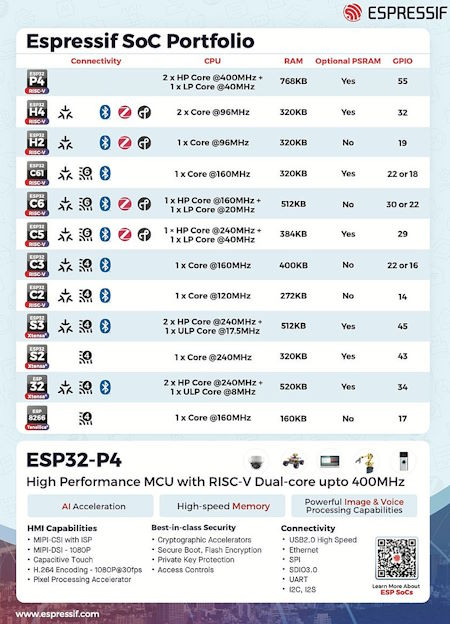](https://twitter.com/gojimmypi/status/1750942307887816720)

In Espressif's latest newsletter, they have a consise chart of their microcontroller offerings - [X](https://twitter.com/gojimmypi/status/1750942307887816720).

## More #CircuitPython2024 Responses Received

Scott Shawcroft shares more community responses to the #CircuitPython2024 campaign - [Adafruit Blog](https://blog.adafruit.com/2024/01/31/first-circuitpython2024-posts-2-2/).

## Raspberry Pi and Python Powers First Driverless Car in Formula SAE Brazil Competition

[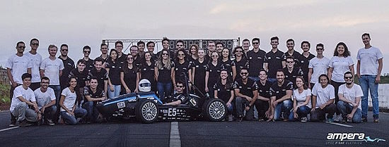](https://www.raspberrypi.com/news/raspberry-pi-powers-first-driverless-car-in-formula-sae-brazil-competition/)

A Raspberry Pi running Python powers the first driverless car in Formula SAE Brazil competition. Team Ampera pushed through various prototypes before creating a Raspberry Pi-powered car capable of navigating the Formula SAE Brazil track completely autonomously - [Raspberry Pi News](https://www.raspberrypi.com/news/raspberry-pi-powers-first-driverless-car-in-formula-sae-brazil-competition/) and [YouTube](https://youtu.be/KMtS09EsBOo).

> "Python algorithms (are used) to build a map of the track. These algorithms don’t just calculate the best path to follow; they also determine control actions, such as steering and acceleration, and send these suggestions to the car’s electronic control unit (ECU)."

## A Video Player in a VHS Tape

[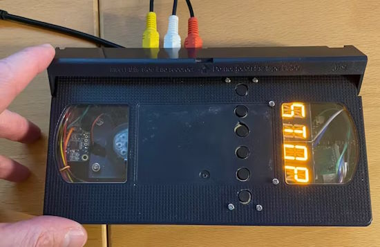](https://www.hackster.io/alan-boris/vhs-cassette-video-recorder-4f3f81)

A fun mini-project to cram a Raspberry Pi-based composite video player/recorder inside a VHS cassette. The build uses a Raspberry Pi 3 A+ controlled by Python - [hackster.io](https://www.hackster.io/alan-boris/vhs-cassette-video-recorder-4f3f81), [GitHub](https://github.com/alanb128/pi-vcr) and [YouTube](https://youtu.be/sYreNd7PwSI?si=DqLtNv-wiON-AaUu).

## A Big Update for TensorFlow Lite for RP2040 Microcontrollers

[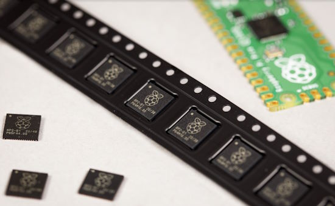](https://www.raspberrypi.com/news/a-big-bang-update-for-tensorflow-lite-for-microcontrollers/)

Pete Warden just upstreamed three years of changes to TensorFlow Lite for Microcontrollers, focused on the Raspberry Pi RP2040. There are dual core optimizations resulting in a 1.4x speed improvement. These updates and changes reduce the time for the person detection benchmark code from 824ms to 588ms - [Raspberry Pi News](https://www.raspberrypi.com/news/a-big-bang-update-for-tensorflow-lite-for-microcontrollers/) and [GitHub](https://github.com/raspberrypi/pico-tflmicro).

## Installing CircuitPython 9.0.0-beta.0 on a Raspberry Pi Zero 2 W

[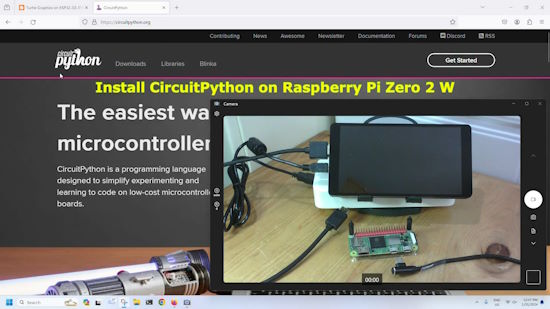](https://www.youtube.com/watch?v=3cHAPLul5cQ&t=2s)

coXXect shows the steps to install CircuitPython 9.0.0-beta.0 bare metal on a Raspberry Pi Zero 2 W - [Blog](https://coxxect.blogspot.com/2024/02/install-circuitpython-on-raspberry-pi.html) and [YouTube](https://www.youtube.com/watch?v=3cHAPLul5cQ&t=2s).

## This Week's Python Streams

Python on Hardware is all about building a cooperative ecosphere which allows contributions to be valued and to grow knowledge. Below are the streams within the last week focusing on the community.

**CircuitPython Deep Dive Stream**

[Last Friday](link), Scott streamed work on {subject}.

You can see the latest video and past videos on the Adafruit YouTube channel under the Deep Dive playlist - [YouTube](https://www.youtube.com/playlist?list=PLjF7R1fz_OOXBHlu9msoXq2jQN4JpCk8A).

**CircuitPython Parsec**

John Park’s CircuitPython Parsec this week is on using sin and cos to move a display object in a circular path - [Adafruit Blog](https://blog.adafruit.com/2024/02/02/john-parks-circuitpython-parsec-circular-path-adafruit-circuitpython/) and [YouTube](https://www.youtube.com/embed/nI55N6q0sUo).

Catch all the episodes in the [YouTube playlist](https://www.youtube.com/playlist?list=PLjF7R1fz_OOWFqZfqW9jlvQSIUmwn9lWr).

**CircuitPython Weekly Meeting**

CircuitPython Weekly Meeting for January 29th, 2024 ([notes](https://github.com/adafruit/adafruit-circuitpython-weekly-meeting/blob/main/2024/2024-01-29.md)) [on YouTube](https://youtu.be/G1wTH6PpfxQ).

## Project of the Week: Streamline Robot Control With an XRP Program Selector

[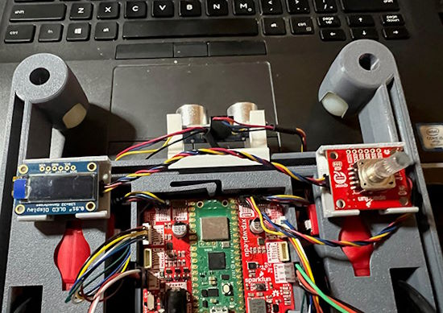](https://www.digikey.com/en/maker/projects/streamline-robot-control-build-an-xrp-program-selector/c41d399bd58b42f99f9d9e81a07a7135)

Getting a SparkFun Qwiic Twist RGB rotary encoder and an Adafruit ‎‎0.91” OLED display to work with the [XRP robotics kit](https://www.digikey.com/en/products/detail/sparkfun-electronics/KIT-22296/19117674)'s drive_examples.py MicroPython file. Both boards are ‎Qwiic and Stemma QT compatible - [DigiKey](https://www.digikey.com/en/maker/projects/streamline-robot-control-build-an-xrp-program-selector/c41d399bd58b42f99f9d9e81a07a7135).

## Popular Last Week

What was the most popular, most clicked link, in [last week's newsletter](https://www.adafruitdaily.com/2024/01/29/python-on-microcontrollers-newsletter-circuitpython-python-micropython-thepsf-raspberry_pi/)? [These 8 Raspberry Pi attachments radically expand its powers](https://www.pcworld.com/article/2204701/the-best-extensions-for-the-raspberry-pi.html).

## New Notes from Adafruit Playground

[Adafruit Playground](https://adafruit-playground.com/) is a new place for the community to post their projects and other making tips/tricks/techniques. Ad-free, it's an easy way to publish your work in a safe space for free.

[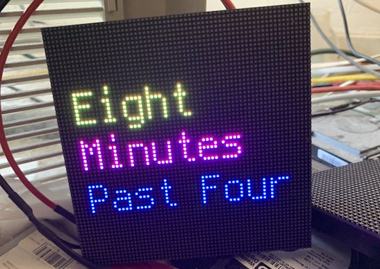](https://adafruit-playground.com/u/VPTechOps/pages/rgb-matrix-word-clocks)

A classic word clock on an RGB color LED matrix with ESP32-S3 and CircuitPython - [Adafruit Playground](https://adafruit-playground.com/u/VPTechOps/pages/rgb-matrix-word-clocks).

[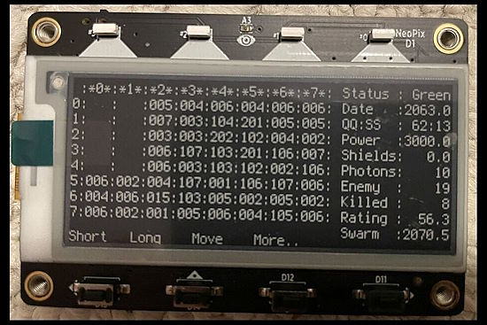](https://adafruit-playground.com/u/vrtisworks/pages/space-war-a-game-for-the-magtag)

Space War: A game for the Adafruit MagTag is a port from 1977 FORTRAN to CircuitPython - [Adafruit Playground](https://adafruit-playground.com/u/vrtisworks/pages/space-war-a-game-for-the-magtag).

[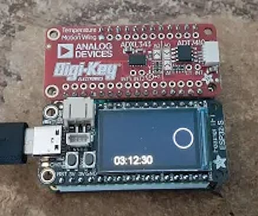](https://adafruit-playground.com/u/dexter_starboard/pages/desktop-multifunction-device-clock)

Randall Bohn makes a clock in CircuitPython for a multifunction device based on an ESP32-S2 Feather with a TFT LCD display FeatherWing - [Adafruit Playground](https://adafruit-playground.com/u/dexter_starboard/pages/desktop-multifunction-device-clock).

## News from around the web

Bluetooth on the Raspberry Pi Pico W with MicroPython, Pi Cast January 3oth with Kevin McAleer - [YouTube](https://www.youtube.com/watch?v=GuikWq0WNNI).

Statistics on the Python on Microcontrollers Newsletter for 2023 Q4 - [Adafruit Blog](https://blog.adafruit.com/2024/01/31/statistics-on-the-python-on-microcontrollers-newsletter-for-2023-q4-python-circuitpython-python-micropython-adafruit/).

[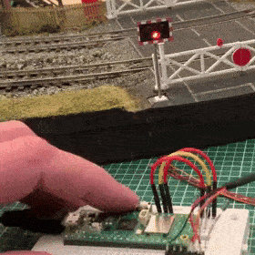](https://twitter.com/PaterPracticus/status/1752264809263898727)

Making model railroad level crossing lights with Raspberry Pi Pico and MicroPython - [X](https://twitter.com/PaterPracticus/status/1752264809263898727).

[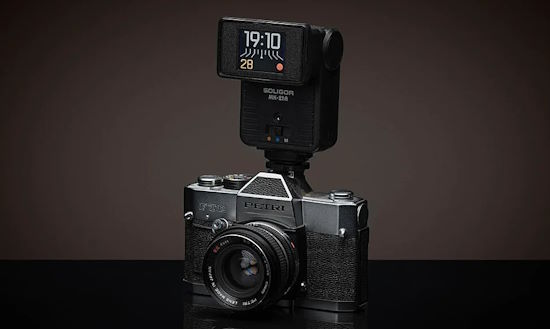](https://petapixel.com/2024/01/30/how-a-photographer-built-the-ultimate-diy-digital-clock-inside-a-flash-unit/)

How a photographer built the ultimate DIY digital clock inside a flash unit with Raspberry Pi Pico and CircuitPython - [PetaPixel](https://petapixel.com/2024/01/30/how-a-photographer-built-the-ultimate-diy-digital-clock-inside-a-flash-unit/).

[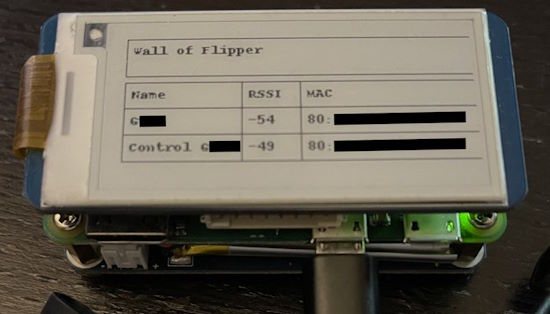](https://twitter.com/MarkusR0st/status/1744074145183223815)

Making a Wall of Flippers on a pwnagotchi using Python on a Raspberry Pi Zero - [GitHub](https://github.com/MarkusR0st/wall-of-pwn-flipper) and [X](https://twitter.com/MarkusR0st/status/1744074145183223815).

[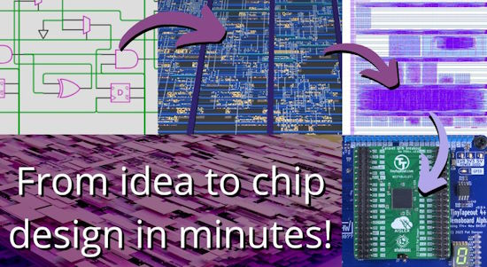](https://tinytapeout.com/)

TinyTapeout is an educational project that makes it easier and cheaper than ever to get your digital designs manufactured on a real chip! TT06 builds on TT05, with the same space, IOs and speed, but now adds power gating for all designs, mixed signal support and analog pins - [Tiny Tapeout](https://tinytapeout.com/).

Using the Adafruit CircuitPython BLE library to make a Bluetooth snooze button - [Tea and Tech Time](https://teaandtechtime.com/bluetooth-snooze-button-for-iphone/) and [YouTube](https://youtu.be/BAhrKnQMPFE), via [X](https://twitter.com/tdsepsilon/status/1752041183017410873).

[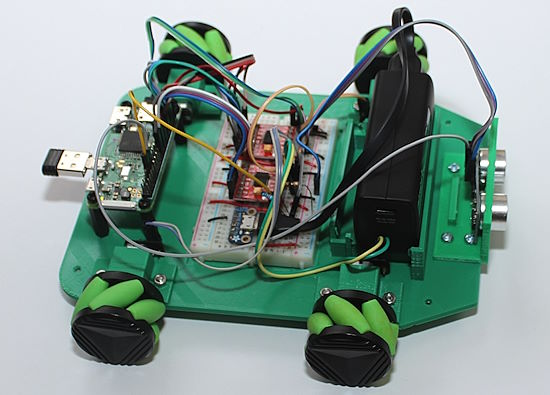](https://www.raspberrypi.com/news/build-a-raspberry-pi-mecanum-robot-hackspace-75/)

Build a Raspberry Pi mecanum robot with Raspberry Pi Zero W / 2W and Python - [Raspberry Pi News](https://www.raspberrypi.com/news/build-a-raspberry-pi-mecanum-robot-hackspace-75/).

[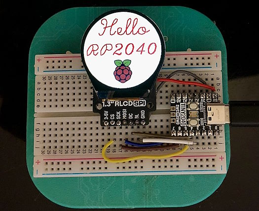](https://twitter.com/knaveen/status/1752294521772322838)

Using a Pimoroni 1.3" round display with a Tiny2040 board in MicroPython - [X](https://twitter.com/knaveen/status/1752294521772322838).

ESP32-S3-Zero/CircuitPython display on a 128x64 SSD1306 I2C OLED - [YouTube](https://www.youtube.com/watch?v=mdyNBVjnC2c).

[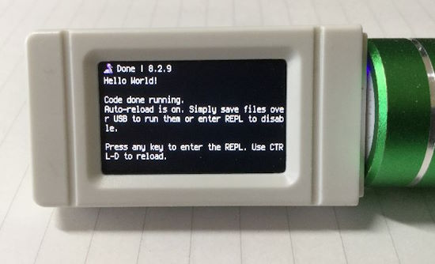](https://twitter.com/n602_NA/status/1752510666156712291)

Loading CircuitPython on the Waveshare RP2040-GEEK - [X](https://twitter.com/n602_NA/status/1752510666156712291) and [Waveshare](https://www.waveshare.com/wiki/RP2040-GEEK).

[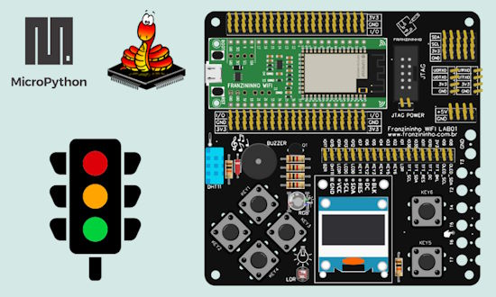](https://embarcados.com.br/controlador-de-semaforo-com-a-franzininho-wifi-lab01/)

Making a traffic light controller with a Franzininho WiFi Lab01 and MicroPython - [Embarcados](https://embarcados.com.br/controlador-de-semaforo-com-a-franzininho-wifi-lab01/) (Portuguese) and [YouTube](https://youtu.be/raox5xzUYwI).

[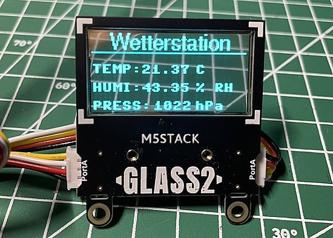](https://twitter.com/r_schulz_maker/status/1752428519148146760)

An EMV III SHT30 sensor data displayed with a M5Stack GLASS2 unit using MicroPython - [X](https://twitter.com/r_schulz_maker/status/1752428519148146760).

[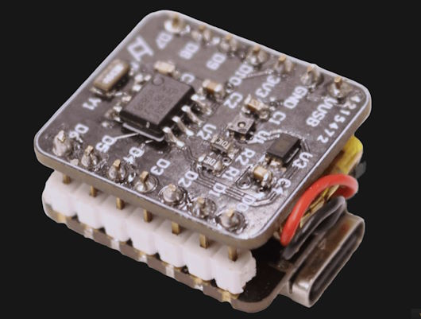](https://hackaday.io/project/194659-xiao-log)

XIAO-log is a miniature temperature, humidity and luminosity logger hat for the XIAO ESP32-C3  programmed in MicroPython - [hackaday.io](https://hackaday.io/project/194659-xiao-log).

[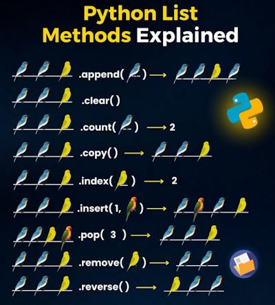](https://twitter.com/KirkDBorne/status/1751750659114733679)

Python List Methods Explained - [X](https://twitter.com/KirkDBorne/status/1751750659114733679).

Python Best Practices for More Pythonic Code - [Real Python](https://realpython.com/tutorials/best-practices/).

## New

[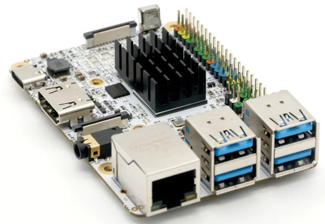](https://www.notebookcheck.net/Libre-Computer-Solitude-New-cheap-alternative-to-the-Raspberry-Pi-comes-with-NPU.798277.0.html)

The Libre Computer Solitude is a new single-board computer. A Amologic S905D3 ARM-based SoC is installed with up to 4GB RAM. Thanks to the built-in infrared sensor, the Libre Computer Solitude can also be easily controlled using a remote control - [Notebook Check](https://www.notebookcheck.net/Libre-Computer-Solitude-New-cheap-alternative-to-the-Raspberry-Pi-comes-with-NPU.798277.0.html).

[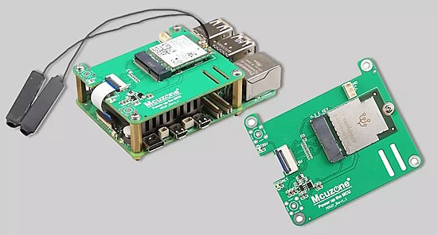](https://www.cnx-software.com/2024/02/02/m2-e-key-wifi-7-hat-for-raspberry-pi-5-google-tpu/)

The M.2 E-Key Wi-Fi 7 HAT for Raspberry Pi 5 also supports Google TPU - [CNX Software](https://www.cnx-software.com/2024/02/02/m2-e-key-wifi-7-hat-for-raspberry-pi-5-google-tpu/).

## New Boards Supported by CircuitPython

The number of supported microcontrollers and Single Board Computers (SBC) grows every week. This section outlines which boards have been included in CircuitPython or added to [CircuitPython.org](https://circuitpython.org/).

This week, there was another board added:

- [EDU PICO for Pico W](https://circuitpython.org/board/cytron_edu_pico_w/)

*Note: For non-Adafruit boards, please use the support forums of the board manufacturer for assistance, as Adafruit does not have the hardware to assist in troubleshooting.*

Looking to add a new board to CircuitPython? It's highly encouraged! Adafruit has four guides to help you do so:

- [How to Add a New Board to CircuitPython](https://learn.adafruit.com/how-to-add-a-new-board-to-circuitpython/overview)
- [How to add a New Board to the circuitpython.org website](https://learn.adafruit.com/how-to-add-a-new-board-to-the-circuitpython-org-website)
- [Adding a Single Board Computer to PlatformDetect for Blinka](https://learn.adafruit.com/adding-a-single-board-computer-to-platformdetect-for-blinka)
- [Adding a Single Board Computer to Blinka](https://learn.adafruit.com/adding-a-single-board-computer-to-blinka)

## New Learn Guides

[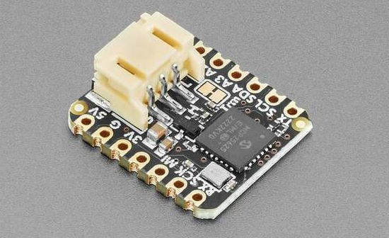](https://learn.adafruit.com/guides/latest)

[Adafruit CAN Bus BFF](https://learn.adafruit.com/adafruit-can-bus-bff) from [Liz Clark](https://learn.adafruit.com/adafruit-can-bus-bff)

## Updated Learn Guides

[Adafruit MEMENTO Camera Board](https://learn.adafruit.com/adafruit-memento-camera-board)

Numerous guides using Adafruit HATs with displays on Raspberry Pi (updated for Raspberry 5 and Bookworm)

## CircuitPython Libraries

The CircuitPython library numbers are continually increasing, while existing ones continue to be updated. Here we provide library numbers and updates!

To get the latest Adafruit libraries, download the [Adafruit CircuitPython Library Bundle](https://circuitpython.org/libraries). To get the latest community contributed libraries, download the [CircuitPython Community Bundle](https://circuitpython.org/libraries).

If you'd like to contribute to the CircuitPython project on the Python side of things, the libraries are a great place to start. Check out the [CircuitPython.org Contributing page](https://circuitpython.org/contributing). If you're interested in reviewing, check out Open Pull Requests. If you'd like to contribute code or documentation, check out Open Issues. We have a guide on [contributing to CircuitPython with Git and GitHub](https://learn.adafruit.com/contribute-to-circuitpython-with-git-and-github), and you can find us in the #help-with-circuitpython and #circuitpython-dev channels on the [Adafruit Discord](https://adafru.it/discord).

You can check out this [list of all the Adafruit CircuitPython libraries and drivers available](https://github.com/adafruit/Adafruit_CircuitPython_Bundle/blob/master/circuitpython_library_list.md). 

The current number of CircuitPython libraries is **476**!

**New Libraries**

Here's this week's new CircuitPython libraries:

  * [FoamyGuy/CircuitPython_SoftKeyboard](https://github.com/FoamyGuy/CircuitPython_SoftKeyboard)

**Updated Libraries**

Here's this week's updated CircuitPython libraries:

  * [adafruit/Adafruit_CircuitPython_PIOASM](https://github.com/adafruit/Adafruit_CircuitPython_PIOASM)
  * [adafruit/Adafruit_CircuitPython_PyCamera](https://github.com/adafruit/Adafruit_CircuitPython_PyCamera)
  * [cedargrovestudios/circuitpython_waveviz](https://github.com/cedargrovestudios/circuitpython_waveviz)

**Library PyPI Weekly Download Stats**

**Total Library Stats**

  * 133283 PyPI downloads over 324 libraries

**Top 10 Libraries by PyPI Downloads**

  * Adafruit CircuitPython BusDevice (adafruit-circuitpython-busdevice): 8801
  * Adafruit CircuitPython Requests (adafruit-circuitpython-requests): 8704
  * Adafruit CircuitPython Register (adafruit-circuitpython-register): 3046
  * Adafruit CircuitPython MiniMQTT (adafruit-circuitpython-minimqtt): 1548
  * Adafruit CircuitPython ADS1x15 (adafruit-circuitpython-ads1x15): 1329
  * Adafruit CircuitPython Wiznet5k (adafruit-circuitpython-wiznet5k): 1206
  * Adafruit CircuitPython Motor (adafruit-circuitpython-motor): 1193
  * Adafruit CircuitPython Display Text (adafruit-circuitpython-display-text): 1125
  * Adafruit CircuitPython DHT (adafruit-circuitpython-dht): 1118
  * Adafruit CircuitPython ServoKit (adafruit-circuitpython-servokit): 1096

## What’s the CircuitPython team up to this week?

What is the team up to this week? Let’s check in:

**Melissa**

This past week, I finally wrapped up my fixes for the displays which now run on Bookworm. This includes creating my first pull request to Raspberry Pi Linux to fix up some of the device tree overlays and add additional functionality, which has been merged in. It should be part of the next release of Bookworm and once it is, we can simplify the installer scripts. With the displays now working, I'm going through and testing and updating the learn guides which we had to add warnings to when Bookworm was initially released.

**Tim**

This week I tested a handful of PRs for MiniMQTT and Wiznet5k libraries. I've also begun working on a project for an upcoming guide that is a small text editor cyberdeck built from the Feather RP2040 USB Host and a TFT Feathering. I started with a project that Jeff published a few months back and have added a visible cursor to it that is drawn with `displayio` on the display so it can be seen there in addition to the serial console. Next up is getting the keyboard input working into the USB Host feather.

**Jeff**

I added an example in `Adafruit_CircuitPython_PyCamera` of all the features of the new `bitmapfilter` module, which was released as part of 9.0.0-beta.0 last week.

Well, almost all the features of `bitmapfilter`, because this week I also added support for "blend functions", similar to the layer blend functions in photo editing programs. There's one base function coded in C to perform a blend, while the mathematics of each specific blend mode are specified as Python functions (many are quite simple). Applying a blend function on a pair of 208x208 pixel images takes about 20ms on an ESP32-S3.

This code will be in the next beta, and the Memento PyCamera filter example has already been updated to show some blending modes.

**Scott**

A number of [fixes I made](https://github.com/adafruit/circuitpython/pulls?q=is%3Apr+is%3Aclosed+author%3Atannewt) for CircuitPython 9.0.0 were merged this past week. I'm really trying to push us to where 9.0.0 is stable.

The SD card over BLE and WiFi work was merged and folks have been hitting the behavior change of `storage.mount()`. With 9.0.0 you'll need to make a directory where you want to mount another file system. So, for example, you'll need to make a `sd` directory on the CIRCUITPY drive in order to mount to `/sd` from CircuitPython code.

Lastly, I've wrapped up #CircuitPython2024 this week. Thanks to [everyone who posted their ideas](https://blog.adafruit.com/tag/circuitpython2024/).

**Liz**

This past week I worked on the [CAN Bus BFF guide](https://learn.adafruit.com/adafruit-can-bus-bff). This breakout lets you use CAN Bus with a QT Py form factor board. I've worked on a few CAN Bus products in the past year and this guide features a nice demo written by Ladyada that sends CAN messages every time you rotate a rotary encoder.

## Upcoming Events

The next MicroPython Meetup in Melbourne will be on February 28th – [Meetup](https://www.meetup.com/micropython-meetup/events). 

PyCascades 2024 is back in Seattle, Washington, USA and online, April 5-8th at the University of Washington's Kane Hall. CircuitPython lead Scott Shawcroft will have a talk - [PyCascades](https://2024.pycascades.com/).

PyCon US 2024 launches May 15-23, 2024 in Pittsburgh, Pennsylvania US - [PyCon US](https://pycon.blogspot.com/2024/10/pycon-us-2024-launches.html).

EuroPython is the oldest and longest running volunteer-led Python programming conference on the planet. This year it will be held July 8-14 in Prague. Call for Proposals, the Mentorship Programme, and the Financial Aid Programme will be starting this month - [EuroPython 2024](https://ep2024.europython.eu/).

**Send Your Events In**

If you know of virtual events or upcoming events, please let us know via email to cpnews(at)adafruit(dot)com.

## Latest Releases

CircuitPython's stable release is [8.2.9](https://github.com/adafruit/circuitpython/releases/latest) and its unstable release is [9.0.0 beta 0](https://github.com/adafruit/circuitpython/releases). New to CircuitPython? Start with our [Welcome to CircuitPython Guide](https://learn.adafruit.com/welcome-to-circuitpython).

[20240130](https://github.com/adafruit/Adafruit_CircuitPython_Bundle/releases/latest) is the latest Adafruit CircuitPython library bundle.

[20240131](https://github.com/adafruit/CircuitPython_Community_Bundle/releases/latest) is the latest CircuitPython Community library bundle.

[v1.22.0](https://micropython.org/download) is the latest MicroPython release. Documentation for it is [here](http://docs.micropython.org/en/latest/pyboard/).

[3.12.1](https://www.python.org/downloads/) is the latest Python release. The latest pre-release version is [3.13.0a3](https://www.python.org/download/pre-releases/).

[3,800 Stars](https://github.com/adafruit/circuitpython/stargazers) Like CircuitPython? [Star it on GitHub!](https://github.com/adafruit/circuitpython)

## Call for Help -- Translating CircuitPython is now easier than ever

One important feature of CircuitPython is translated control and error messages. With the help of fellow open source project [Weblate](https://weblate.org/), we're making it even easier to add or improve translations. 

Sign in with an existing account such as GitHub, Google or Facebook and start contributing through a simple web interface. No forks or pull requests needed! As always, if you run into trouble join us on [Discord](https://adafru.it/discord), we're here to help.

## 38,616 Thanks

The Adafruit Discord community, where we do all our CircuitPython development in the open, reached over 38,616 humans - thank you! Adafruit believes Discord offers a unique way for Python on hardware folks to connect. Join today at [https://adafru.it/discord](https://adafru.it/discord).

## ICYMI - In case you missed it

Python on hardware is the Adafruit Python video-newsletter-podcast! The news comes from the Python community, Discord, Adafruit communities and more and is broadcast on ASK an ENGINEER Wednesdays. The complete Python on Hardware weekly videocast [playlist is here](https://www.youtube.com/playlist?list=PLjF7R1fz_OOXRMjM7Sm0J2Xt6H81TdDev). The video podcast is on [iTunes](https://itunes.apple.com/us/podcast/python-on-hardware/id1451685192?mt=2), [YouTube](http://adafru.it/pohepisodes), [Instagram Reels](https://www.instagram.com/adafruit/channel/)), and [XML](https://itunes.apple.com/us/podcast/python-on-hardware/id1451685192?mt=2).

[The weekly community chat on Adafruit Discord server CircuitPython channel - Audio / Podcast edition](https://itunes.apple.com/us/podcast/circuitpython-weekly-meeting/id1451685016) - Audio from the Discord chat space for CircuitPython, meetings are usually Mondays at 2pm ET, this is the audio version on [iTunes](https://itunes.apple.com/us/podcast/circuitpython-weekly-meeting/id1451685016), Pocket Casts, [Spotify](https://adafru.it/spotify), and [XML feed](https://adafruit-podcasts.s3.amazonaws.com/circuitpython_weekly_meeting/audio-podcast.xml).

## Contribute

The CircuitPython Weekly Newsletter is a CircuitPython community-run newsletter emailed every Monday. The complete [archives are here](https://www.adafruitdaily.com/category/circuitpython/). It highlights the latest CircuitPython related news from around the web including Python and MicroPython developments. To contribute, edit next week's draft [on GitHub](https://github.com/adafruit/circuitpython-weekly-newsletter/tree/gh-pages/_drafts) and [submit a pull request](https://help.github.com/articles/editing-files-in-your-repository/) with the changes. You may also tag your information on Twitter with #CircuitPython. 

Join the Adafruit [Discord](https://adafru.it/discord) or [post to the forum](https://forums.adafruit.com/viewforum.php?f=60) if you have questions.
