- [ ] Library and info updates
- [ ] change date
- [ ] update title
- [ ] Feature story
- [ ] Update  for images
- [ ] Update ICYDNCI
- [ ] All images 550w max only
- [ ] Link "View this email in your browser."

News Sources

- [Adafruit Playground](https://adafruit-playground.com/)
- Twitter: [CircuitPython](https://twitter.com/search?q=circuitpython&src=typed_query&f=live), [MicroPython](https://twitter.com/search?q=micropython&src=typed_query&f=live) and [Python](https://twitter.com/search?q=python&src=typed_query)
- [Raspberry Pi News](https://www.raspberrypi.com/news/)
- Mastodon [CircuitPython](https://octodon.social/tags/CircuitPython) and [MicroPython](https://octodon.social/tags/MicroPython)
- [hackster.io CircuitPython](https://www.hackster.io/search?q=circuitpython&i=projects&sort_by=most_recent) and [MicroPython](https://www.hackster.io/search?q=micropython&i=projects&sort_by=most_recent)
- [python.org](https://www.python.org/)
- [Python Insider - dev team blog](https://pythoninsider.blogspot.com/)
- Individuals: [Jeff Geerling](https://www.jeffgeerling.com/blog)
- [hackaday CircuitPython](https://hackaday.com/blog/?s=circuitpython) and [MicroPython](https://hackaday.com/blog/?s=micropython)
- [hackaday.io newest projects MicroPython](https://hackaday.io/projects?tag=micropython&sort=date) and [CircuitPython](https://hackaday.io/projects?tag=circuitpython&sort=date)
- [https://opensource.com/tags/python](https://opensource.com/tags/python)
- Check Issues and PRs for input

View this email in your browser. **Warning: Flashing Imagery**

Welcome to the latest Python on Microcontrollers newsletter! *insert 2-3 sentences from editor (what's in overview, banter)* - *Anne Barela, Ed.*

We're on [Discord](https://discord.gg/HYqvREz), [Twitter](https://twitter.com/search?q=circuitpython&src=typed_query&f=live), and for past newsletters - [view them all here](https://www.adafruitdaily.com/category/circuitpython/). If you're reading this on the web, [subscribe here](https://www.adafruitdaily.com/). Here's the news this week:

## Headline

text - [site](url).

## How to Fail with CircuitPython

[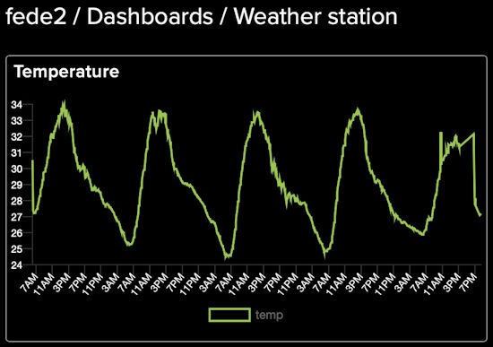](https://adafruit-playground.com/u/fede2/pages/failing-with-circuitpython)

Code can fail as can hardware. Learning how it might fail and what to do can be important, especially if a device running ones code is remote. Adafruit Playground author fede2 looks at how CircuitPython detects failures and how to devise a programmatic method for recovery - [Adafruit Playground](https://adafruit-playground.com/u/fede2/pages/failing-with-circuitpython).

## A Submarine Hunting Game With CircuitPython

[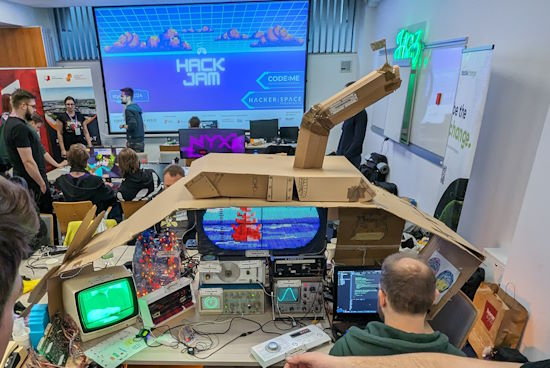](https://twitter.com/DoomHammerNG/status/1751913265263689752)

For Global Game Jam, Piotr Gaczkowski and his team built a 3D game using a mix of 2D and 3D assets found in their Hackerspace, garages, local trash bins, etc., the perfect embodiment of "one man's trash is another man's treasure." The protagonist is the captain of a nuclear submarine. The vessel is controlled using a discarded washing machine front panel. An oscilloscope acts as a sonar and shows incoming enemies. A 128x64 LED matrix panel acts as a periscope. And there's lots of cardboard for the hull. 

Gameplay consists of several mini games played using the washing machine panel, a PiDP11 (Raspberry Pi powered) computer, and other items. A Raspberry Pi acts as the central game "server" and communicates with other devices using a serial protocol. The controllers are a mix of Raspberry Pi Pico and Arduino Nano. Code was written in C and C++ along with CircuitPython - [X](https://twitter.com/DoomHammerNG/status/1751913265263689752).

## PCWorld Reviews the Raspberry Pi 5

[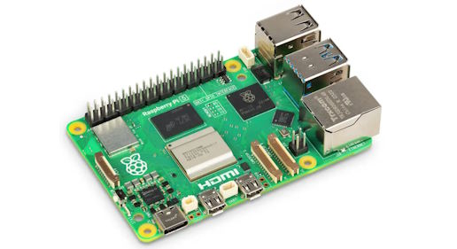](https://www.pcworld.com/article/2219346/raspberry-pi-5-review.html)

PCWorld reviewed the Raspberry Pi 5 - [PCWorld](https://www.pcworld.com/article/2219346/raspberry-pi-5-review.html) and [Adafruit Blog](https://blog.adafruit.com/2024/02/07/pcworld-reviews-the-raspberry-pi-5-raspberrypi-pcworld/).

> "With Model 5 and the new Raspberry Pi OS, the Raspberry Pi Foundation does almost everything right: even demanding program such as Firefox, Chromium, and VS Code run absolutely smoothly on the desktop. Working is simply fun. In normal use, the mini computer is still silent. If a fan is installed, it only starts during longer CPU-intensive work. The Pi 5 is ideal for server use (NAS), as a media center, for home automation, or as a desktop. The biggest disadvantage is its price. While an impulse purchase for experimentation was still conceivable with earlier models, a clear purpose is now required to justify the cost. The predecessor models are better suited to hobbyists and makers. They are sufficiently fast, less fussy about the power supply, don’t run as hot, are cheaper, and are currently more readily available."

## The Five Best Raspberry Pi Alternatives in 2024

[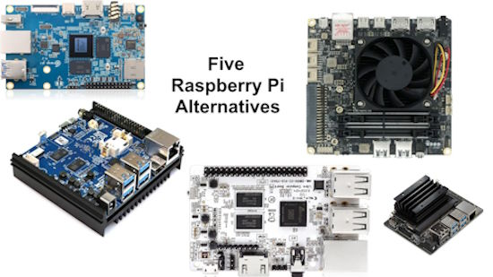](url)

Digital Trends looks at the single board computer market and picks five that they believe can be worthy alternatives to Raspberry Pi - [DigitalTrends](url) and [Adafruit Blog](https://blog.adafruit.com/2024/02/06/four-raspberry-pi-alternatives-for-2024-digitaltrends/).

> "While there are a ton of competitors out there, we’ve picked our five favorites and listed them below, as well as going into their specs and some of their best use cases. Of course, you don’t have to use them in the way we suggest, which is one of the great things about SBCs like this: you can use them in pretty much any way you choose."

## Apple Just Launched a New Open Source Programming Language

Apple has released Pkl, a new open source ‘embeddable configuration language’, hoping to take the stress out of ‘small to large, simple to complex, ad-hoc to repetitive configuration tasks’. Launched on February 1 2024 into version 0.25, the tech giant’s team have provided a ‘[quick tour](https://pkl-lang.org/blog/introducing-pkl.html)’ of the language in a text post on the Pkl documentation [website](https://pkl-lang.org/main/current/index.html) - [Techradar Pro](https://www.techradar.com/pro/apple-just-launched-a-new-open-source-programming-language).

> "Pkl is designed around a key value structure, in a manner akin to JSON, rather than imperative instructions like many other traditional programming languages, Apple has designed Pkl to specialise in configuration, along with a few neat quality-of-life features to turn heads. Indeed, Pkl supports JSON, XML, and YAML property lists at launch to generate static configuration files."

## This Week's Python Streams

Python on Hardware is all about building a cooperative ecosphere which allows contributions to be valued and to grow knowledge. Below are the streams within the last week focusing on the community.

**CircuitPython Deep Dive Stream**

[Last Friday](link), Scott streamed work on {subject}.

You can see the latest video and past videos on the Adafruit YouTube channel under the Deep Dive playlist - [YouTube](https://www.youtube.com/playlist?list=PLjF7R1fz_OOXBHlu9msoXq2jQN4JpCk8A).

**CircuitPython Parsec**

John Park’s CircuitPython Parsec this week is on {subject} - [Adafruit Blog](link) and [YouTube](link).

Catch all the episodes in the [YouTube playlist](https://www.youtube.com/playlist?list=PLjF7R1fz_OOWFqZfqW9jlvQSIUmwn9lWr).

**CircuitPython Weekly Meeting**

CircuitPython Weekly Meeting for February 5, 2024 ([notes](https://github.com/adafruit/adafruit-circuitpython-weekly-meeting/blob/main/2024/2024-02-05.md)) [on YouTube](https://youtu.be/WWtOcufAGEM).

## Project of the Week: Raspberry Pi Crystal Sculpture

[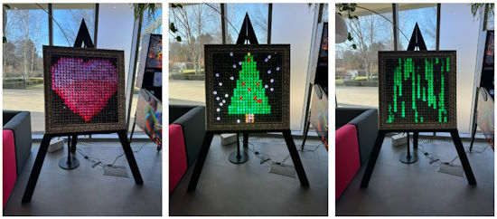](https://www.raspberrypi.com/news/we-made-something-massive-and-strange-for-the-pi-towers-lobby/)

Raspberry Pi Maker in Residence Toby Roberts made a grid of 24x24 NeoPixel LEDs each with a crystal in front of it. Using a Raspberry Pi Touch Display, the grid can display multicolored artwork using a Raspberry Pi 4 with Python - [Raspberry Pi News](https://www.raspberrypi.com/news/we-made-something-massive-and-strange-for-the-pi-towers-lobby/).

## Popular Last Week

What was the most popular, most clicked link, in [last week's newsletter](https://www.adafruitdaily.com/2024/02/05/python-on-microcontrollers-newsletter-circuitpython-9-beta-0-out-circuitpython2024-wraps-raspi-autonomous-car-and-more-circuitpython-python-micropython-thepsf-raspberry_pi/)? [Espressif Systems
 SoC Portfolio Summary Graphic](https://twitter.com/gojimmypi/status/1750942307887816720).

## New Notes from Adafruit Playground

[Adafruit Playground](https://adafruit-playground.com/) is a new place for the community to post their projects and other making tips/tricks/techniques. Ad-free, it's an easy way to publish your work in a safe space for free.

A Badger Mountain themed art piece using Feather RP2040 and CircuitPython - [Adafruit Playground](https://adafruit-playground.com/u/nickcramer/pages/hiking-masterpiece).

Spock on a Chip will blink LEDs on an Adafruit NeoTrinkey with CircuitPython then print a Spock quote when touched - [Adafruit Playground](https://adafruit-playground.com/u/mrklingon/pages/spock-on-a-chip).

[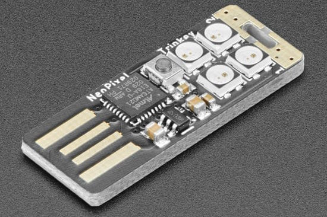](https://adafruit-playground.com/u/mrklingon/pages/teach-your-neotrinkey-morse-code)

Teach your NeoTrinkey Morse code with CircuitPython - [Adafruit Playground](https://adafruit-playground.com/u/mrklingon/pages/teach-your-neotrinkey-morse-code).

[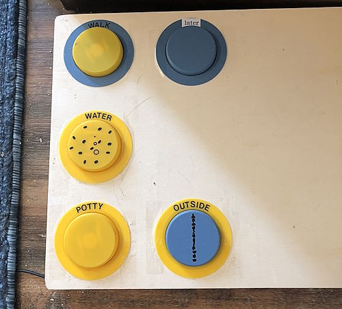](https://adafruit-playground.com/u/cadet702/pages/doggy-buttons)

Signalling buttons for your dog with Raspberry Pi and Python - [Adafruit Playground](https://adafruit-playground.com/u/cadet702/pages/doggy-buttons).

## News from around the web

[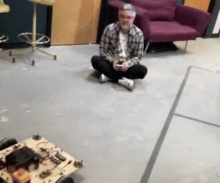](https://twitter.com/scottmonaghan/status/1753950105973965079)

Scott achieves full remote control of his robot via WiFi using Raspberry Pi Pico W and CircuitPython - [X](https://twitter.com/scottmonaghan/status/1753950105973965079) and [GitHub](https://github.com/ScottMonaghan/2024_01_06_Robot_Base/tree/2024_02_03-implement-full-reverse).

[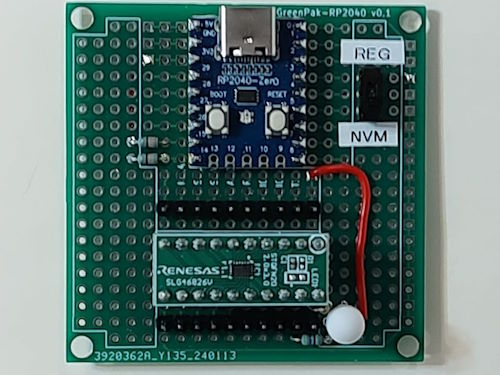](https://elchika.com/article/d674e070-8c72-4314-9769-b48681c84f18/)

Programming Renesas GreenPAK chips with an RP2040 and CircuitPython - [elchika](https://elchika.com/article/d674e070-8c72-4314-9769-b48681c84f18/) (Japanese).

[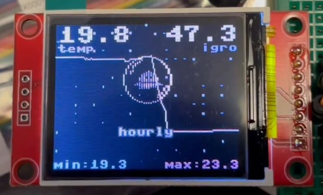](https://github.com/antirez/64-thermometer)

An ESP8266 MicroPython project providing a thermometer that is also a tribute to the old 80s computing era: the graphics is reminiscent of the Commodore 64, and the backgrounds are extracted from actual games screenshots - [GitHub](https://github.com/antirez/64-thermometer) via [X](https://twitter.com/antirez).

An automated pet feeder using 3D printed parts, Raspberry Pi Pico and MicroPython - [Raspberry Pi News](https://www.raspberrypi.com/news/raspberry-pi-pico-feeds-pikita-the-chihuahua-twice-a-day/) and [Instagram](https://www.instagram.com/p/C20BkN6xkCK/).

[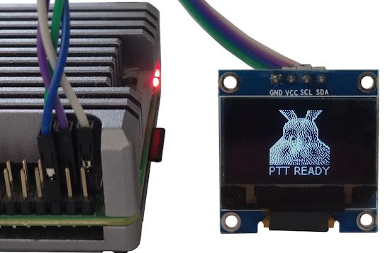](https://towardsdatascience.com/a-weekend-ai-project-using-speech-recognition-ptt-and-a-large-action-model-on-a-raspberry-pi-ac8d839d078a)

Using speech recognition, Push-to-Talk (PTT), and an AI large action model on a Raspberry Pi in Python - [Towards Data Science](https://towardsdatascience.com/a-weekend-ai-project-using-speech-recognition-ptt-and-a-large-action-model-on-a-raspberry-pi-ac8d839d078a).

[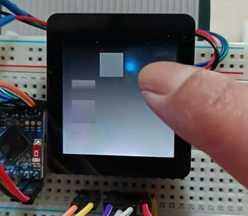](https://twitter.com/android_er/status/1755659582658245059)

A visual illusion on ESP32-S3/CircuitPython + ST7789/FT6236 cap touch display - [X](https://twitter.com/android_er/status/1755659582658245059) and [YouTube Short](https://youtu.be/gbUvEAqoQCY).

[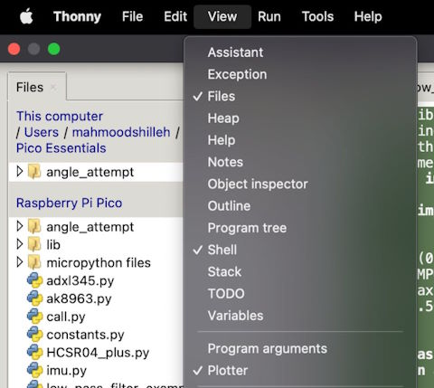](https://www.electromaker.io/project/view/how-to-plot-in-thonny)

How to plot MicroPython or CircuitPython data in the Thonny editor - [electromaker](https://www.electromaker.io/project/view/how-to-plot-in-thonny).

Support for image blitting from a file with a PNG conversion tool for the ST77xx display with a pure MicroPython driver - [X](https://twitter.com/antirez/status/1754894897247597056) and [GitHub](https://github.com/antirez/ST77xx-pure-MP).

[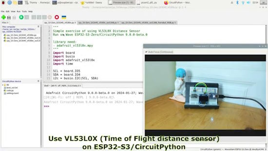](https://youtu.be/6aRnYehbYE0)

Using a VL53L0X (Time of Flight distance sensor) on an ESP32-S3 microcontroller running CircuitPython - [YouTube](https://youtu.be/6aRnYehbYE0) via [X](https://twitter.com/KcCoxxect/status/1753822210689736860).

[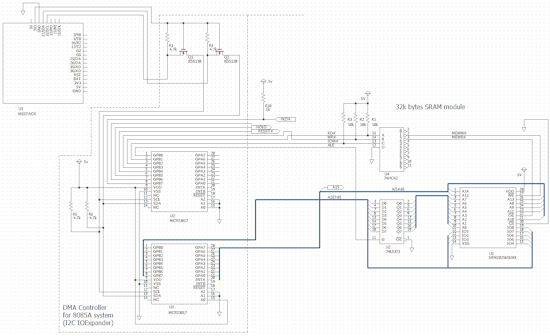](https://jhalfmoon.com/dbc/2024/02/08/micropython%e7%9a%84%e5%8d%88%e7%9d%a1141m5stack%e3%80%81sram%e3%83%a2%e3%82%b8%e3%83%a5%e3%83%bc%e3%83%ab%e8%aa%ad%e3%81%bf%e6%9b%b8%e3%81%8d%e3%80%81%e3%83%80%e3%83%a1%e3%83%80%e3%83%a1%e3%82%88/)

Accessing an SRAM chip with an M5Stack and MicroPython - [jhalfmoon.com](https://jhalfmoon.com/dbc/2024/02/08/micropython%e7%9a%84%e5%8d%88%e7%9d%a1141m5stack%e3%80%81sram%e3%83%a2%e3%82%b8%e3%83%a5%e3%83%bc%e3%83%ab%e8%aa%ad%e3%81%bf%e6%9b%b8%e3%81%8d%e3%80%81%e3%83%80%e3%83%a1%e3%83%80%e3%83%a1%e3%82%88/) (Japanese).

Hacking USB HID descriptors with MicroPython - [Hackaday](https://hackaday.com/2024/02/06/human-interfacing-devices-packing-for-the-descriptor-heist/).

[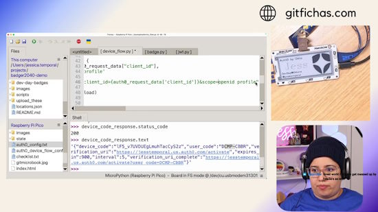](https://twitter.com/jesstemporal/status/1755970034739146961)

Device Auth Flow with Pimoroni Badger 2040W and MicroPython - [X](https://twitter.com/jesstemporal/status/1755970034739146961).

text - [site](url).

text - [site](url).

text - [site](url).

How to use Python Lambda functions - [Real Python](https://realpython.com/python-lambda/).

[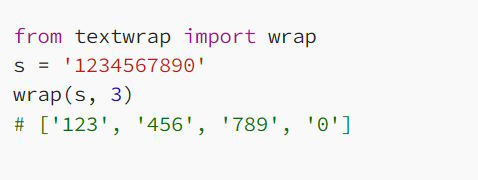](https://towardsdatascience.com/everything-you-can-do-with-pythons-textwrap-module-0d82c377a4c8)

Everything you can do with the Python `textwrap` module - [Towards Data Science](https://towardsdatascience.com/everything-you-can-do-with-pythons-textwrap-module-0d82c377a4c8).

## New

[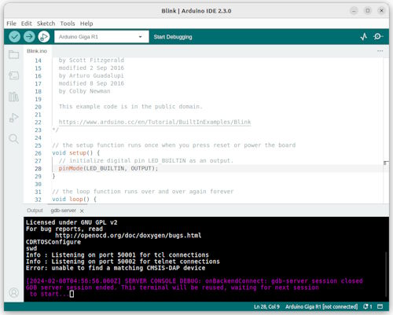](https://www.cnx-software.com/2024/02/08/arduino-ide-2-3-release-debug-feature/)

Arduino IDE 2.3 has just been released with a range of bug fixes and improvements, but the main change is that the debug feature is not experimental anymore and is now considered stable - [CNX Software](https://www.cnx-software.com/2024/02/08/arduino-ide-2-3-release-debug-feature/).

[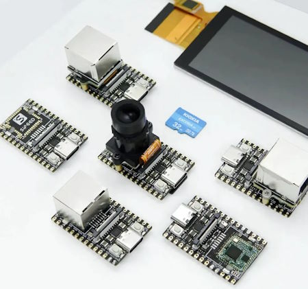](https://www.cnx-software.com/2024/02/08/licheerv-nano-low-cost-sg2002-risc-v-arm-camera-display-board-wifi-6-ethernet/)

LicheeRV Nano is a low-cost SG2002 RISC-V and Arm camera and display board with optional WiFi 6 and/or Ethernet running Linux - [CNX Software](https://www.cnx-software.com/2024/02/08/licheerv-nano-low-cost-sg2002-risc-v-arm-camera-display-board-wifi-6-ethernet/).

## New Boards Supported by CircuitPython

The number of supported microcontrollers and Single Board Computers (SBC) grows every week. This section outlines which boards have been included in CircuitPython or added to [CircuitPython.org](https://circuitpython.org/).

This week, there were (#/no) new boards added:

- [Board name](url)
- [Board name](url)
- [Board name](url)

*Note: For non-Adafruit boards, please use the support forums of the board manufacturer for assistance, as Adafruit does not have the hardware to assist in troubleshooting.*

Looking to add a new board to CircuitPython? It's highly encouraged! Adafruit has four guides to help you do so:

- [How to Add a New Board to CircuitPython](https://learn.adafruit.com/how-to-add-a-new-board-to-circuitpython/overview)
- [How to add a New Board to the circuitpython.org website](https://learn.adafruit.com/how-to-add-a-new-board-to-the-circuitpython-org-website)
- [Adding a Single Board Computer to PlatformDetect for Blinka](https://learn.adafruit.com/adding-a-single-board-computer-to-platformdetect-for-blinka)
- [Adding a Single Board Computer to Blinka](https://learn.adafruit.com/adding-a-single-board-computer-to-blinka)

## New Learn Guides

[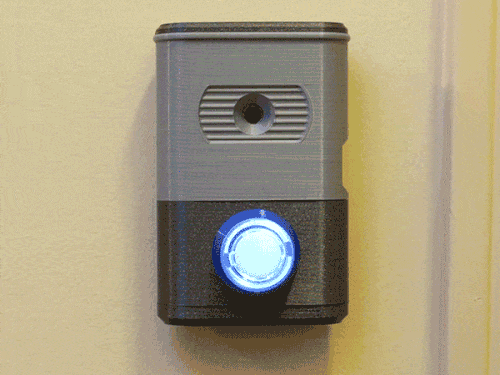](https://learn.adafruit.com/guides/latest)

[DIY IoT Doorbell Camera with MEMENTO](https://learn.adafruit.com/diy-iot-doorbell-camera-with-memento) from [Brent Rubell](https://learn.adafruit.com/u/brubell)

[Adafruit UPDI Friend](https://learn.adafruit.com/adafruit-updi-friend) from [Liz Clark](https://learn.adafruit.com/u/BlitzCityDIY)

## CircuitPython Libraries

The CircuitPython library numbers are continually increasing, while existing ones continue to be updated. Here we provide library numbers and updates!

To get the latest Adafruit libraries, download the [Adafruit CircuitPython Library Bundle](https://circuitpython.org/libraries). To get the latest community contributed libraries, download the [CircuitPython Community Bundle](https://circuitpython.org/libraries).

If you'd like to contribute to the CircuitPython project on the Python side of things, the libraries are a great place to start. Check out the [CircuitPython.org Contributing page](https://circuitpython.org/contributing). If you're interested in reviewing, check out Open Pull Requests. If you'd like to contribute code or documentation, check out Open Issues. We have a guide on [contributing to CircuitPython with Git and GitHub](https://learn.adafruit.com/contribute-to-circuitpython-with-git-and-github), and you can find us in the #help-with-circuitpython and #circuitpython-dev channels on the [Adafruit Discord](https://adafru.it/discord).

You can check out this [list of all the Adafruit CircuitPython libraries and drivers available](https://github.com/adafruit/Adafruit_CircuitPython_Bundle/blob/master/circuitpython_library_list.md). 

The current number of CircuitPython libraries is **###**!

**New Libraries**

Here's this week's new CircuitPython libraries:

* [library](url)

**Updated Libraries**

Here's this week's updated CircuitPython libraries:

* [library](url)

**Library PyPI Weekly Download Stats**

## What’s the CircuitPython team up to this week?

What is the team up to this week? Let’s check in:

**Dan**

I returned from a short vacation and am now back to working on fixing issues needed for a CircuitPython 9.0.0 release.

I am investigating an unusual problem: on ESP32-S3 only, the first byte received on a busio.UART object can be a stray junk byte with a few consecutive 1's. A simple fix is just to wait a bit and clear the input buffer when first using the object. But I'd like to understand the problem in more detail before applying such a fix.

**Melissa**

Now that I have the PiTFTs up and running, this past week I've been focusing on the Snake Eyes Bonnet, which allows driving 2 displays at the same time. While I was able to get the HDMI only version of Pi Eyes running on the Raspberry Pi 5 by converting a bunch of code to Blinka, so far I haven't had much success with getting two displays running on the bonnet at the same time. In the process of trying different things, I did end up finding and fixing some bugs related to Blinka and the Blinka port of Displayio.

**Tim**

This week I've been working on a Text Editor project for the Feather RP2040 with USB Host port. It uses a TFT Display and a USB keyboard to allow editing text files directly on the microcontroller. I also integrated a tool created by a community member that generates device specific board stubs with the stubs that are automatically generated by the core repo.

**Scott**

This week I've continued replacing our last few uses of IDF 4 APIs in favor of the IDF 5 versions. Overall, they are working better for us. I'm having to retest the affected classes, including protomatter and then will make a PR. Hopefully I'll fix some crashes during file system writes that the old code was susceptible to.

**Liz**

This past week I worked on a guide for the [Adafruit UPDI Friend](https://learn.adafruit.com/adafruit-updi-friend). This breakout lets you easily program ATtiny chips like the ones found on the seesaw breakouts. Previously we had instructions for how to build a DIY programmer, but this makes it so that you can have a solderless solution.

I also setup PlatformIO to work on some larger MEMENTO and Qualia S3 projects. Brent wrote a great page on [how to setup PlatformIO](https://learn.adafruit.com/adafruit-memento-camera-board/usage-with-platformio) in the MEMENTO product guide. I had never used PlatformIO before and I was able to get up and running very quickly by following along with his steps.

## Upcoming Events

The next MicroPython Meetup in Melbourne will be on February 28th – [Meetup](https://www.meetup.com/micropython-meetup/events). 

PyCascades 2024 is back in Seattle, Washington, USA and online, April 5-8th at the University of Washington, Kane Hall - [PyCascades](https://2024.pycascades.com/).

PyCon US 2024 launches May 15-23, 2024 in Pittsburgh, Pennsylvania US - [PyCon US](https://pycon.blogspot.com/2024/10/pycon-us-2024-launches.html).

EuroPython is the oldest and longest running volunteer-led Python programming conference on the planet. This year it will be held July 8-14 in Prague. Call for Proposals, the Mentorship Programme, and the Financial Aid Programme will be starting this month - [EuroPython 2024](https://ep2024.europython.eu/).

**Send Your Events In**

If you know of virtual events or upcoming events, please let us know via email to cpnews(at)adafruit(dot)com.

## Latest Releases

CircuitPython's stable release is [#.#.#](https://github.com/adafruit/circuitpython/releases/latest) and its unstable release is [#.#.#-##.#](https://github.com/adafruit/circuitpython/releases). New to CircuitPython? Start with our [Welcome to CircuitPython Guide](https://learn.adafruit.com/welcome-to-circuitpython).

[2024####](https://github.com/adafruit/Adafruit_CircuitPython_Bundle/releases/latest) is the latest Adafruit CircuitPython library bundle.

[2024####](https://github.com/adafruit/CircuitPython_Community_Bundle/releases/latest) is the latest CircuitPython Community library bundle.

[v#.#.#](https://micropython.org/download) is the latest MicroPython release. Documentation for it is [here](http://docs.micropython.org/en/latest/pyboard/).

[#.#.#](https://www.python.org/downloads/) is the latest Python release. The latest pre-release version is [#.#.#](https://www.python.org/download/pre-releases/).

[#,### Stars](https://github.com/adafruit/circuitpython/stargazers) Like CircuitPython? [Star it on GitHub!](https://github.com/adafruit/circuitpython)

## Call for Help -- Translating CircuitPython is now easier than ever

[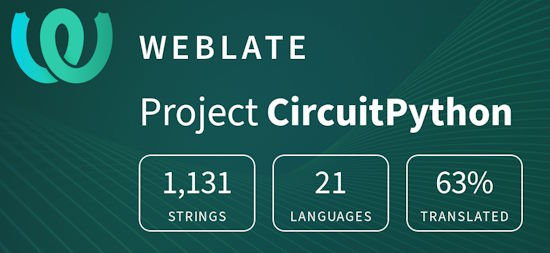](https://hosted.weblate.org/engage/circuitpython/)

One important feature of CircuitPython is translated control and error messages. With the help of fellow open source project [Weblate](https://weblate.org/), we're making it even easier to add or improve translations. 

Sign in with an existing account such as GitHub, Google or Facebook and start contributing through a simple web interface. No forks or pull requests needed! As always, if you run into trouble join us on [Discord](https://adafru.it/discord), we're here to help.

## NUMBER Thanks

The Adafruit Discord community, where we do all our CircuitPython development in the open, reached over NUMBER humans - thank you! Adafruit believes Discord offers a unique way for Python on hardware folks to connect. Join today at [https://adafru.it/discord](https://adafru.it/discord).

## ICYMI - In case you missed it

Python on hardware is the Adafruit Python video-newsletter-podcast! The news comes from the Python community, Discord, Adafruit communities and more and is broadcast on ASK an ENGINEER Wednesdays. The complete Python on Hardware weekly videocast [playlist is here](https://www.youtube.com/playlist?list=PLjF7R1fz_OOXRMjM7Sm0J2Xt6H81TdDev). The video podcast is on [iTunes](https://itunes.apple.com/us/podcast/python-on-hardware/id1451685192?mt=2), [YouTube](http://adafru.it/pohepisodes), [Instagram Reels](https://www.instagram.com/adafruit/channel/)), and [XML](https://itunes.apple.com/us/podcast/python-on-hardware/id1451685192?mt=2).

[The weekly community chat on Adafruit Discord server CircuitPython channel - Audio / Podcast edition](https://itunes.apple.com/us/podcast/circuitpython-weekly-meeting/id1451685016) - Audio from the Discord chat space for CircuitPython, meetings are usually Mondays at 2pm ET, this is the audio version on [iTunes](https://itunes.apple.com/us/podcast/circuitpython-weekly-meeting/id1451685016), Pocket Casts, [Spotify](https://adafru.it/spotify), and [XML feed](https://adafruit-podcasts.s3.amazonaws.com/circuitpython_weekly_meeting/audio-podcast.xml).

## Contribute

The CircuitPython Weekly Newsletter is a CircuitPython community-run newsletter emailed every Monday. The complete [archives are here](https://www.adafruitdaily.com/category/circuitpython/). It highlights the latest CircuitPython related news from around the web including Python and MicroPython developments. To contribute, edit next week's draft [on GitHub](https://github.com/adafruit/circuitpython-weekly-newsletter/tree/gh-pages/_drafts) and [submit a pull request](https://help.github.com/articles/editing-files-in-your-repository/) with the changes. You may also tag your information on Twitter with #CircuitPython. 

Join the Adafruit [Discord](https://adafru.it/discord) or [post to the forum](https://forums.adafruit.com/viewforum.php?f=60) if you have questions.
