- [ ] Library and info updates
- [ ] change date
- [ ] update title
- [ ] Feature story
- [ ] Update  for images
- [ ] Update ICYDNCI
- [ ] All images 550w max only
- [ ] Link "View this email in your browser."

News Sources

- [Adafruit Playground](https://adafruit-playground.com/)
- Twitter: [CircuitPython](https://twitter.com/search?q=circuitpython&src=typed_query&f=live), [MicroPython](https://twitter.com/search?q=micropython&src=typed_query&f=live) and [Python](https://twitter.com/search?q=python&src=typed_query)
- [Raspberry Pi News](https://www.raspberrypi.com/news/)
- Mastodon [CircuitPython](https://octodon.social/tags/CircuitPython) and [MicroPython](https://octodon.social/tags/MicroPython)
- [hackster.io CircuitPython](https://www.hackster.io/search?q=circuitpython&i=projects&sort_by=most_recent) and [MicroPython](https://www.hackster.io/search?q=micropython&i=projects&sort_by=most_recent)
- [python.org](https://www.python.org/)
- [Python Insider - dev team blog](https://pythoninsider.blogspot.com/)
- Individuals: [Jeff Geerling](https://www.jeffgeerling.com/blog)
- [hackaday CircuitPython](https://hackaday.com/blog/?s=circuitpython) and [MicroPython](https://hackaday.com/blog/?s=micropython)
- [hackaday.io newest projects MicroPython](https://hackaday.io/projects?tag=micropython&sort=date) and [CircuitPython](https://hackaday.io/projects?tag=circuitpython&sort=date)
- [https://opensource.com/tags/python](https://opensource.com/tags/python)
- Check Issues and PRs for input

View this email in your browser. **Warning: Flashing Imagery**

Welcome to the latest Python on Microcontrollers newsletter! *insert 2-3 sentences from editor (what's in overview, banter)* - *Anne Barela, Ed.*

We're on [Discord](https://discord.gg/HYqvREz), [Twitter](https://twitter.com/search?q=circuitpython&src=typed_query&f=live), and for past newsletters - [view them all here](https://www.adafruitdaily.com/category/circuitpython/). If you're reading this on the web, [subscribe here](https://www.adafruitdaily.com/). Here's the news this week:

## CircuitPython 8.2.10 Released

CircuitPython 8.2.10 is the latest bugfix revision of CircuitPython and is a new stable release - [Adafruit Blog](https://blog.adafruit.com/2024/02/14/circuitpython-8-2-10-released/) and release notes - [GitHub](https://github.com/adafruit/circuitpython/releases/tag/8.2.10).

**Notable changes to 8.2.10 since 8.2.9**

* Fix `EPaperDisplay` garbage collection.
* Add `proto` argument to `SocketPool.socket` constructor to allow specifying protocol.
* Allow `RGBMatrix` framebuffer size to be more than 65535 bytes.
* Allow creating a mount point on an existing directory.
* Individual board fixes.

## Renesas to Buy PCB Design Software Firm Altium for US $5.9 Billion

Japanese chip company Renesas Electronics Corp. has said it plans to acquire PCB design software firm Altium Ltd. for Aus$9.1 billion (about US$5.9 billion).
The move is an extension of Renesas’ mainstream business, which is predominantly the supply of digital and mixed-signal chips for automotive and industrial applications - [EE News](https://www.eenewseurope.com/en/renesas-to-buy-pcb-design-software-firm-altium-for-us5-9-billion).

## The Telegraph Interviews Eben Upton About the Upcoming Stock IPO

A direct interview of Eben Upton, Raspberry Pi CEO on their work towards a stock IPO. Raspberry Pi is gearing up for a flotation that is likely to value it at hundreds of millions of pounds. The company has opted for London over New York, [a rare choice for a tech busines](https://www.telegraph.co.uk/business/2024/02/08/shares-surge-40pc-arm-new-york-listing/) - [The Telegraph](https://www.telegraph.co.uk/business/2024/02/11/britain-homebrew-computer-raspberry-pi-london-listing/).

## Hands-on With the Bus Pirate 5 Debugging Tool

[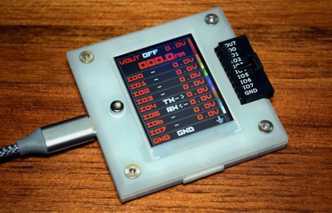](https://hackaday.com/2024/02/12/hands-on-bus-pirate-5/)

The Bus Pirate is a hardware protocol analyzer used by thousands of designers since its introduction in 2008. It's been a number of years since the last iteration but now the Bus Pirate 5 is available, based on the Raspberry Pi RP2040 chip. Hackaday provides a hands-on look at the latest incarnation - [Hackaday](https://hackaday.com/2024/02/12/hands-on-bus-pirate-5/) and [Adafruit Blog](https://blog.adafruit.com/2024/02/14/hackaday-hands-on-the-bus-pirate-5-rp2040-hackaday/).

## uv: Python Packaging in Rust

[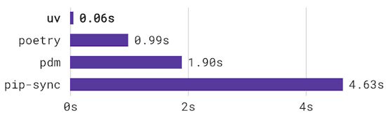](https://astral.sh/blog/uv)

uv is an extremely fast Python package installer and resolver, written in Rust, and designed as a drop-in replacement for pip and pip-tools workflows. uv is 8-10x faster than pip and pip-tools without caching, and 80-115x faster when running with a warm cache.  APIs behind the uv pip interface make it usable by existing projects with zero configuration - [Astral](https://astral.sh/blog/uv).

## YARP5R - Yet Another Raspberry Pi 5 Review

[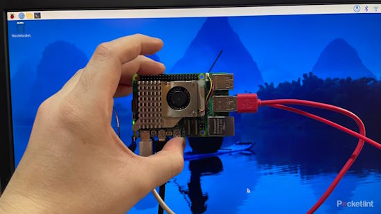](https://www.pocket-lint.com/raspberry-pi-5-review/)

Pocket-lint takes their own look at the Raspberry Pi 5 - [Pocket-lint](https://www.pocket-lint.com/raspberry-pi-5-review/).

> "My Raspberry Pi 5 is a delight, and I'm excited about all its future uses. The Raspberry Pi 5 has plenty of upgrades, but do you need all that extra horsepower? I put it to the test."

## CircuitPythonista Helen Leigh Featured on Embedded.fm Podcast

CircuitPythonista Helen Leigh joined embedded.fm to talk about putting together conferences (including Teardown 2024), indie hardware producers (including via Crowd Supply), and building communities - [embedded.fm](https://embedded.fm/episodes/470).

## This Week's Python Streams

Python on Hardware is all about building a cooperative ecosphere which allows contributions to be valued and to grow knowledge. Below are the streams within the last week focusing on the community.

**CircuitPython Deep Dive Stream**

[Last Friday](link), Scott streamed work on {subject}.

You can see the latest video and past videos on the Adafruit YouTube channel under the Deep Dive playlist - [YouTube](https://www.youtube.com/playlist?list=PLjF7R1fz_OOXBHlu9msoXq2jQN4JpCk8A).

**CircuitPython Parsec**

John Park’s CircuitPython Parsec this week is on {subject} - [Adafruit Blog](link) and [YouTube](link).

Catch all the episodes in the [YouTube playlist](https://www.youtube.com/playlist?list=PLjF7R1fz_OOWFqZfqW9jlvQSIUmwn9lWr).

**CircuitPython Weekly Meeting**

CircuitPython Weekly Meeting for February 12,2024 ([notes](https://github.com/adafruit/adafruit-circuitpython-weekly-meeting/blob/main/2024/2024-02-12.md)) [on YouTube](https://youtu.be/aalN_YdxS2I).

## Project of the Week: Pico and microPython Meets Vintage Radio Shack Kit

[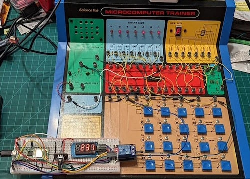](https://blog.adafruit.com/2024/02/13/raspberry-pi-pico-enhances-a-vintage-radio-shack-microcomputer-kit-raspberrypi-radioshack-allaboutcircuit/)

Don Wilcher uses a Raspberry Pi Pico to build an adjustable clock with an LED display then integrate the clock with a vintage Radio Shack Science Fair Microcomputer Trainer programmed to function as a 7-bit binary counter. Don adds a Raspberry Pi Pico programmed in MicroPython, making an adjustable digital clock - [Adafruit Blog](https://blog.adafruit.com/2024/02/13/raspberry-pi-pico-enhances-a-vintage-radio-shack-microcomputer-kit-raspberrypi-radioshack-allaboutcircuit/) and [All About Circuits](https://www.allaboutcircuits.com/projects/using-a-raspberry-pi-pico-to-enhance-a-vintage-radio-shack-microcomputer-kit/).

## Popular Last Week

[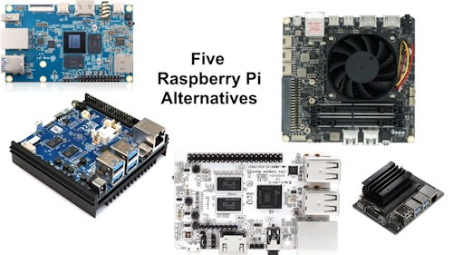](https://blog.adafruit.com/2024/02/06/four-raspberry-pi-alternatives-for-2024-digitaltrends/)

What was the most popular, most clicked link, in [last week's newsletter](https://www.adafruitdaily.com/2024/02/12/python-on-microcontrollers-newsletter-raspberry-pi-alternatives-when-circuitpython-fails-and-much-more-circuitpython-python-micropython-thepsf-raspberry_pi/)? [Five Raspberry Pi Alternatives for 2024](https://blog.adafruit.com/2024/02/06/four-raspberry-pi-alternatives-for-2024-digitaltrends/).

## New Notes from Adafruit Playground

[Adafruit Playground](https://adafruit-playground.com/) is a new place for the community to post their projects and other making tips/tricks/techniques. Ad-free, it's an easy way to publish your work in a safe space for free.

Custo CircuitPython firmware for the NeoPixel rotary fidget project - [Adafruit Playground](https://adafruit-playground.com/u/squid_jpg/pages/custom-ano-fidget-firmware).

[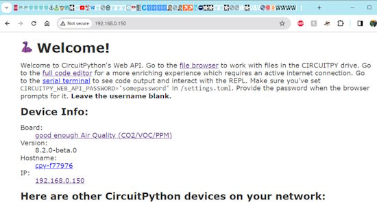](https://adafruit-playground.com/u/tyeth/pages/using-circup-with-web-workflow)

Using CIRCUP with Web-Workflow (beta) - [Adafruit Playground](https://adafruit-playground.com/u/tyeth/pages/using-circup-with-web-workflow).

[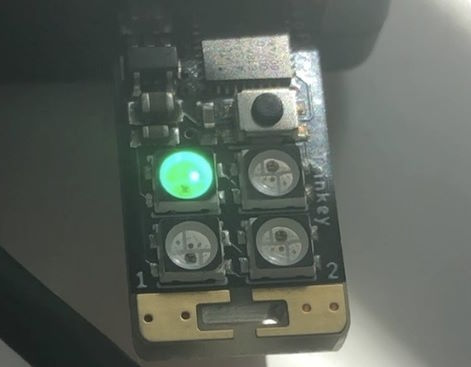](https://adafruit-playground.com/u/mrklingon/pages/how-about-a-4-pixel-video-game)

How about.... a 4 Pixel Video Game?? - [Adafruit Playground](https://adafruit-playground.com/u/mrklingon/pages/how-about-a-4-pixel-video-game).

## News from around the web

Python 3.13.0 alpha 4 is now available - [Python Insider Blog](https://blog.python.org/2024/02/python-3130-alpha-4-is-now-available.html).

A Gen AI powered tiny photo frame using CircuitPython - [AshishWare](https://ashishware.com/2024/02/10/gen_ai_photo_frame/) and [GitHub](https://github.com/code2k13/GenAIPhotoFrame/blob/main/cp_code.py) via [X](https://twitter.com/patilsaheb/status/1756219007764455655).

[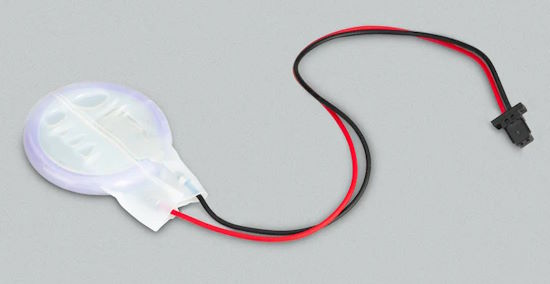](https://www.raspberrypi.com/news/how-to-use-the-real-time-clock-functionality-in-raspberry-pi-5-magpimonday/)

How to use the real-time clock functionality in Raspberry Pi 5 - [Raspberry Pi News](https://www.raspberrypi.com/news/how-to-use-the-real-time-clock-functionality-in-raspberry-pi-5-magpimonday/).

[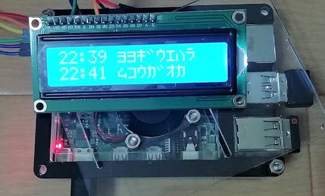](https://otoku-pc.com/raspberry_pi_clock/)

Create a station electronic bulletin board with Raspberry Pi, a 1602 LCD display and MicroPython - [otoku-pc](https://otoku-pc.com/raspberry_pi_clock/) (Japanese).

[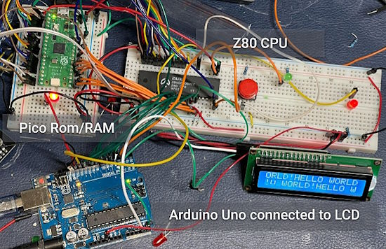](https://www.makerhacks.com/z80-io-lcd/)

Using a Raspberry Pi Pico operating as ROM, RAM and clock for a Z80 microprocessor, outputting to a serial terminal over UART for status via MicroPython - [MakerHacks](https://www.makerhacks.com/z80-io-lcd/).

[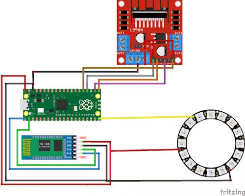](https://www.hackster.io/MohammadReza_Sharifi/upgrading-an-old-laptop-coolpad-using-rpi-pico-and-python-e93829)

Upgrading an old laptop Coolpad using Raspberry Pi Pico and MicroPython - [hackster.io](https://www.hackster.io/MohammadReza_Sharifi/upgrading-an-old-laptop-coolpad-using-rpi-pico-and-python-e93829).

Detect CO, ammonia, ethanol, H2, and methane/propane/iso-butane with a USB Nugget running CircuitPython and a MICS5524 sensor - [X](https://twitter.com/KodyKinzie/status/1757214928023199864).

Bark is a transformer-based text-to-audio model created by Suno. Bark, written in Python, can generate highly realistic, multilingual speech as well as other audio, including music, background noise and simple sound effects. MIT License - [GitHub](https://github.com/suno-ai/bark).

Learn how to send SMS text messages with the Raspberry Pi Pico W for free using Twilio and MicroPython - [electromaker](https://www.electromaker.io/project/view/send-sms-with-raspberry-pi-pico-w).

[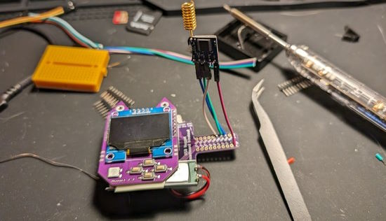](https://infosec.exchange/@skickar/111904667507859997)

Airborn LoRa beacon transmitter made using a retia.io USB nugget and CircuitPython to test line of sight range with a drone - [Mastodon](https://infosec.exchange/@skickar/111904667507859997).

[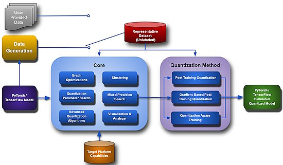](https://github.com/sony/model_optimization?tab=readme-ov-file)

Model Compression Toolkit (MCT) is an open-source project for neural network model optimization under efficient, constrained hardware. Written in Python under an Apache 2.0 license - [GitHub](https://github.com/sony/model_optimization?tab=readme-ov-file).

[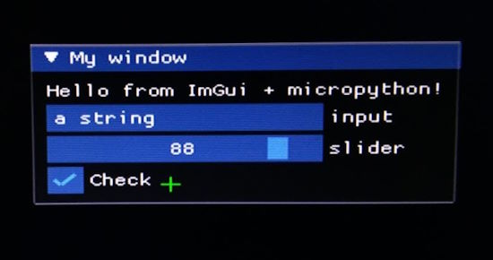](https://twitter.com/suarezvictor/status/1758254434377666703?t=ktIlPtFAuut-Ql91zyTPaQ&s=03)

Basic Imgui integration for graphics and USB mouse/keyboard with MicroPython - [X](https://twitter.com/suarezvictor/status/1758254434377666703?t=ktIlPtFAuut-Ql91zyTPaQ&s=03) and [GitHub](https://github.com/suarezvictor/micropython/tree/litex-rebase/ports/litex/gateware).

A demo showing how to use MicroPython code to loop over data structures in a Pimoroni Phew template. Tested on a Raspberry Pi Pico W running MicroPython v1.22.1 - [GitHub](https://github.com/simonprickett/pimoroni-phew-template-demo) via [X](https://twitter.com/simon_prickett/status/1758507466872991905).

text - [site](url).

text - [site](url).

text - [site](url).

10 AI Python code generators - [Analytics Insight](https://www.analyticsinsight.net/10-best-ai-python-code-generators-for-developers/).

Python Type Checking Guide - [Real Python](https://realpython.com/python-type-checking/).

## New

[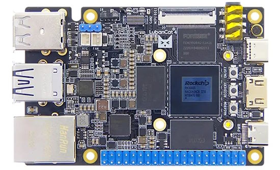](https://www.cnx-software.com/2024/02/15/embedfire-lubancat-4-card-computer-a-rockchip-rk3588s-dev-board-with-mini-pcie-sockt-with-wifi-or-4g-lte/)

EmbedFire LubanCat 4 card computer is a Rockchip RK3588S dev board with a mini PCIe socket for WiFi or 4G LTE - [CNX Software](https://www.cnx-software.com/2024/02/15/embedfire-lubancat-4-card-computer-a-rockchip-rk3588s-dev-board-with-mini-pcie-sockt-with-wifi-or-4g-lte/).

[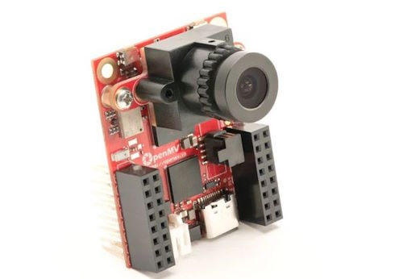](https://www.antratek.com/openmv-cam-rt)

The OpenMV Cam is a small, low-power microcontroller board to implement applications using machine vision using Python scripts on a RT1062 ARM Cortex M7 processor running at 600MHz - [Antratek](https://www.antratek.com/openmv-cam-rt).

## New Boards Supported by CircuitPython

The number of supported microcontrollers and Single Board Computers (SBC) grows every week. This section outlines which boards have been included in CircuitPython or added to [CircuitPython.org](https://circuitpython.org/).

This week, there were no new boards added, but there are some in progress.

*Note: For non-Adafruit boards, please use the support forums of the board manufacturer for assistance, as Adafruit does not have the hardware to assist in troubleshooting.*

Looking to add a new board to CircuitPython? It's highly encouraged! Adafruit has four guides to help you do so:

- [How to Add a New Board to CircuitPython](https://learn.adafruit.com/how-to-add-a-new-board-to-circuitpython/overview)
- [How to add a New Board to the circuitpython.org website](https://learn.adafruit.com/how-to-add-a-new-board-to-the-circuitpython-org-website)
- [Adding a Single Board Computer to PlatformDetect for Blinka](https://learn.adafruit.com/adding-a-single-board-computer-to-platformdetect-for-blinka)
- [Adding a Single Board Computer to Blinka](https://learn.adafruit.com/adding-a-single-board-computer-to-blinka)

## New Learn Guides

[MEMENTO Focus Stacking](https://learn.adafruit.com/memento-focus-stacking) from [John Park](https://learn.adafruit.com/u/johnpark)

[Qualia S3 Sushi Conveyor Belt](https://learn.adafruit.com/qualia-s3-sushi-conveyor-belt) from [Liz Clark](https://learn.adafruit.com/qualia-s3-sushi-conveyor-belt)

[Digital Clock with CircuitPython](https://learn.adafruit.com/digital-clock-with-circuitpython) from [Ruiz Brothers](https://learn.adafruit.com/u/pixil3d)

[CircuitPython Text Editor On The Go](https://learn.adafruit.com/circuitpython-text-editor-on-the-go) from [Tim C](https://learn.adafruit.com/u/Foamyguy)

## CircuitPython Libraries

The CircuitPython library numbers are continually increasing, while existing ones continue to be updated. Here we provide library numbers and updates!

To get the latest Adafruit libraries, download the [Adafruit CircuitPython Library Bundle](https://circuitpython.org/libraries). To get the latest community contributed libraries, download the [CircuitPython Community Bundle](https://circuitpython.org/libraries).

If you'd like to contribute to the CircuitPython project on the Python side of things, the libraries are a great place to start. Check out the [CircuitPython.org Contributing page](https://circuitpython.org/contributing). If you're interested in reviewing, check out Open Pull Requests. If you'd like to contribute code or documentation, check out Open Issues. We have a guide on [contributing to CircuitPython with Git and GitHub](https://learn.adafruit.com/contribute-to-circuitpython-with-git-and-github), and you can find us in the #help-with-circuitpython and #circuitpython-dev channels on the [Adafruit Discord](https://adafru.it/discord).

You can check out this [list of all the Adafruit CircuitPython libraries and drivers available](https://github.com/adafruit/Adafruit_CircuitPython_Bundle/blob/master/circuitpython_library_list.md). 

The current number of CircuitPython libraries is **###**!

**New Libraries**

Here's this week's new CircuitPython libraries:

* [library](url)

**Updated Libraries**

Here's this week's updated CircuitPython libraries:

* [library](url)

**Library PyPI Weekly Download Stats**

## What’s the CircuitPython team up to this week?

What is the team up to this week? Let’s check in:

**Dan**

I released CircuitPython 8.2.10 this past week. It incorporates about six weeks of minor but useful bug fixes for 8.2.x users.

I'm fixing more bugs and reviewing fixes in preparation for 9.0.0 final. One was a setting change for elliptic-curve TLS certificates that fixed access to certain websites. I also updated circup to understand 9.0.0 versions of .mpy files.

**Melissa**

This past week I've been working on updating the [Pi_Eyes](https://github.com/adafruit/Pi_Eyes) project to work on the newer Raspberry Pis. I have the main Python project updated so it works and am now updating the C code of the project that displays whatever is on the desktop onto the displays. I have updated the code so it is correctly outputting pixels to the display and am now working on the portion that gets the desktop image.

**Tim**

text.

**Jeff**

text.

**Scott**

This week I've been trying to hammer out the last few 9.0.0 issues on Espressif chips before moving onto another platform. I updated the internal APIs for `neopixel_write`, `rotaryio`, `pulseio`, `frequencyio`, and `countio`. Hopefully we'll have fewer crashes now and also work on newer chips too. I fixed an issue with the Memento IoT doorbell example (thanks to Jerry for finding the issue.) Lastly, I just spent a bit of time tuning `neopixel` on ESP to primarily fix flickering on the ESP32-S2.

**Liz**

This week I published the [Qualia S3 Sushi Conveyor Belt guide](https://learn.adafruit.com/qualia-s3-sushi-conveyor-belt). The guide includes UF2 files for the 320x820 and 240x960 bar displays to endlessly scroll plates of sushi. I also remixed a nigiri sushi model to house the project. I'm really happy with how everything came together.

I also wrote code for the [Digital Clock with CircuitPython project](https://learn.adafruit.com/digital-clock-with-circuitpython). Noe did a fantastic job designing a sleek mid-century modern style clock enclosure. The code uses an RTC module and a rotary encoder to help you reset the time. With this it means that for daylight savings time you can easily adjust the time without having to dive into the code.

## Upcoming Events

The next MicroPython Meetup in Melbourne will be on February 28th – [Meetup](https://www.meetup.com/micropython-meetup/events). 

PyCascades 2024 is back in Seattle, Washington, USA and online, April 5-8th at the University of Washington, Kane Hall - [PyCascades](https://2024.pycascades.com/).

PyCon US 2024 launches May 15-23, 2024 in Pittsburgh, Pennsylvania US - [PyCon US](https://pycon.blogspot.com/2024/10/pycon-us-2024-launches.html).

EuroPython is the oldest and longest running volunteer-led Python programming conference on the planet. This year it will be held July 8-14 in Prague. Call for Proposals, the Mentorship Programme, and the Financial Aid Programme will be starting this month - [EuroPython 2024](https://ep2024.europython.eu/).

**Send Your Events In**

If you know of virtual events or upcoming events, please let us know via email to cpnews(at)adafruit(dot)com.

## Latest Releases

CircuitPython's stable release is [#.#.#](https://github.com/adafruit/circuitpython/releases/latest) and its unstable release is [#.#.#-##.#](https://github.com/adafruit/circuitpython/releases). New to CircuitPython? Start with our [Welcome to CircuitPython Guide](https://learn.adafruit.com/welcome-to-circuitpython).

[2024####](https://github.com/adafruit/Adafruit_CircuitPython_Bundle/releases/latest) is the latest Adafruit CircuitPython library bundle.

[2024####](https://github.com/adafruit/CircuitPython_Community_Bundle/releases/latest) is the latest CircuitPython Community library bundle.

[v#.#.#](https://micropython.org/download) is the latest MicroPython release. Documentation for it is [here](http://docs.micropython.org/en/latest/pyboard/).

[#.#.#](https://www.python.org/downloads/) is the latest Python release. The latest pre-release version is [#.#.#](https://www.python.org/download/pre-releases/).

[#,### Stars](https://github.com/adafruit/circuitpython/stargazers) Like CircuitPython? [Star it on GitHub!](https://github.com/adafruit/circuitpython)

## Call for Help -- Translating CircuitPython is now easier than ever

[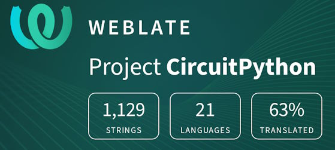](https://hosted.weblate.org/engage/circuitpython/)

One important feature of CircuitPython is translated control and error messages. With the help of fellow open source project [Weblate](https://weblate.org/), we're making it even easier to add or improve translations. 

Sign in with an existing account such as GitHub, Google or Facebook and start contributing through a simple web interface. No forks or pull requests needed! As always, if you run into trouble join us on [Discord](https://adafru.it/discord), we're here to help.

## 38,689 Thanks

The Adafruit Discord community, where we do all our CircuitPython development in the open, reached over 38,689 humans - thank you! Adafruit believes Discord offers a unique way for Python on hardware folks to connect. Join today at [https://adafru.it/discord](https://adafru.it/discord).

## ICYMI - In case you missed it

Python on hardware is the Adafruit Python video-newsletter-podcast! The news comes from the Python community, Discord, Adafruit communities and more and is broadcast on ASK an ENGINEER Wednesdays. The complete Python on Hardware weekly videocast [playlist is here](https://www.youtube.com/playlist?list=PLjF7R1fz_OOXRMjM7Sm0J2Xt6H81TdDev). The video podcast is on [iTunes](https://itunes.apple.com/us/podcast/python-on-hardware/id1451685192?mt=2), [YouTube](http://adafru.it/pohepisodes), [Instagram Reels](https://www.instagram.com/adafruit/channel/)), and [XML](https://itunes.apple.com/us/podcast/python-on-hardware/id1451685192?mt=2).

[The weekly community chat on Adafruit Discord server CircuitPython channel - Audio / Podcast edition](https://itunes.apple.com/us/podcast/circuitpython-weekly-meeting/id1451685016) - Audio from the Discord chat space for CircuitPython, meetings are usually Mondays at 2pm ET, this is the audio version on [iTunes](https://itunes.apple.com/us/podcast/circuitpython-weekly-meeting/id1451685016), Pocket Casts, [Spotify](https://adafru.it/spotify), and [XML feed](https://adafruit-podcasts.s3.amazonaws.com/circuitpython_weekly_meeting/audio-podcast.xml).

## Contribute

The CircuitPython Weekly Newsletter is a CircuitPython community-run newsletter emailed every Monday. The complete [archives are here](https://www.adafruitdaily.com/category/circuitpython/). It highlights the latest CircuitPython related news from around the web including Python and MicroPython developments. To contribute, edit next week's draft [on GitHub](https://github.com/adafruit/circuitpython-weekly-newsletter/tree/gh-pages/_drafts) and [submit a pull request](https://help.github.com/articles/editing-files-in-your-repository/) with the changes. You may also tag your information on Twitter with #CircuitPython. 

Join the Adafruit [Discord](https://adafru.it/discord) or [post to the forum](https://forums.adafruit.com/viewforum.php?f=60) if you have questions.
