- [ ] Library and info updates
- [ ] change date
- [ ] update title
- [ ] Feature story
- [ ] Update  for images
- [ ] Update ICYDNCI
- [ ] All images 550w max only
- [ ] Link "View this email in your browser."

View this email in your browser. **Warning: Flashing Imagery**

Welcome to the latest Python on Microcontrollers newsletter! This week has been a cornucopia of news! Enough for two weeks, but I'm not holding back. A rare new version of MicroPython is out with bug fixes. Similarly CircuitPython 9.0.0 Beta 2 is out and an important upgrade for MEMENTO camera owners. More Raspberry Pi news (of course) as well as knowing Python is rather a good thing in the job market. Some fabulous projects and much more, this week. - *Anne Barela, Ed.*

We're on [Discord](https://discord.gg/HYqvREz), [Twitter](https://twitter.com/search?q=circuitpython&src=typed_query&f=live), and for past newsletters - [view them all here](https://www.adafruitdaily.com/category/circuitpython/). If you're reading this on the web, [subscribe here](https://www.adafruitdaily.com/). Here's the news this week:

## MicroPython v1.22.2 Released

MicroPython was just updated. Changes are described as a "patch release for rp2 DMA, UART and BLE, esp32 BLE, renesas-ra I2C" - [GitHub](https://github.com/micropython/micropython/releases/tag/v1.22.2).

## CircuitPython 9.0.0-beta.2 Released with Urge to Update for MEMENTO

CircuitPython 9.0.0-beta.2, a beta release for 9.0.0 is the new unstable release. This release has known bugs that will be addressed before 9.0.0 final - [Adafruit Blog](https://blog.adafruit.com/2024/02/19/circuitpython-9-0-0-beta-2-released/) and [Release Notes](https://github.com/adafruit/circuitpython/releases/tag/9.0.0-beta.2).

> [Note for MEMENTO Camera Board users](https://blog.adafruit.com/2024/02/21/memento-camera-board-users-update-circuitpython-to-9-0-0-beta-2-or-later/): This release contains an important fix for MEMENTO. If you originally installed a version of CircuitPython older than 9.0.0-beta.2 on your board, your CIRCUITPY drive thinks it is larger than it really is. **This can cause crashes.** To fix this, back up what is on your drive, install CircuitPython 9.0.0-beta.2 or later, and then erase and reformat CIRCUITPY by running two commands in the REPL.

## Considerations for a Long-Running Raspberry

[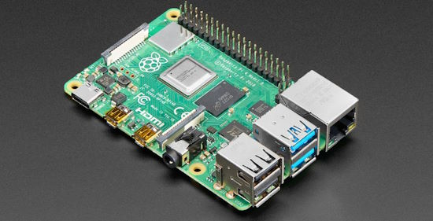](https://blog.adafruit.com/2024/02/22/considerations-for-a-long-running-raspberry-pi-raspberrypi-raspberry_pi/)

Keeping a Raspberry Pi online and working with zero intervention for weeks, months, or years is somewhat of an art form. Several classes of things can go wrong, and you need to consider how your Pi will recover from each of them - [chris dzombak](https://www.dzombak.com/blog/2023/12/Considerations-for-a-long-running-Raspberry-Pi.html) and [Adafruit Blog](https://blog.adafruit.com/2024/02/22/considerations-for-a-long-running-raspberry-pi-raspberrypi-raspberry_pi/).

## Breaking the Enigma Code using Python and a Raspberry Pi 5 Cluster

Kevin McAleer shows how to use a cluster of Raspberry Pi 5s to break the World War II Enigma code using Python and distributed parallel computing - [YouTube](https://www.youtube.com/watch?v=cIq2AEbYotA).

## Why Python Continues to Reign Supreme on the Job Market

The rapid increase in the pace of digitalisation brought on by the pandemic is one part of the picture, but when it comes to why Python is so in demand, this extremely versatile programming language can be used for AI, machine learning, and quantitative and qualitative analysis - [TNW](https://thenextweb.com/news/why-python-continues-to-reign-supreme-on-the-job-market).

## Connecting an FPGA Accelerator to the Raspberry Pi 5

[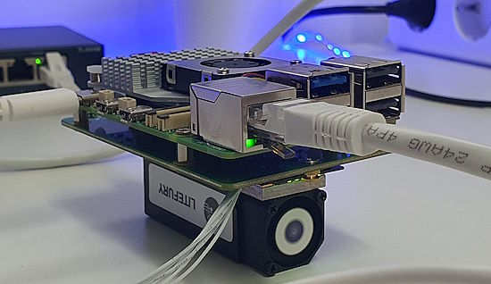](https://www.controlpaths.com/2024/02/18/connecting-litefury-to-raspberrypi5/)

Connecting an FPGA accelerator to the Raspberry Pi 5 using the Litefury board. This board features an Artix XC7A100T with an M.2 format, accessable via Python and Jupyter Notebook - [controlpaths.com](https://www.controlpaths.com/2024/02/18/connecting-litefury-to-raspberrypi5/) and [GitHub](https://github.com/controlpaths/litefury_rp5).

## Making a Ring Mouse With Buttons and Wheel

These rings are HID mouse controllers with 4 buttons each. There buttons are: left mouse click, right mouse click, wheel up and wheel down. They connect to a PC via Bluetooth. The controller works as a ring on ones hand, one is designed as left handed and one right. The device is based on a Seeed Studio XIAO nRF52840 microcontroller programmed in CircuitPython - [Instructables](https://www.instructables.com/Ring-With-Mouse-Buttons-Wheel/?s=03) and [GitHub](https://github.com/rafgaj/Mouse-buttons-and-wheel/tree/main).

## Raspberry Pi 5 vs 4: Is the extra power worth the cost?

[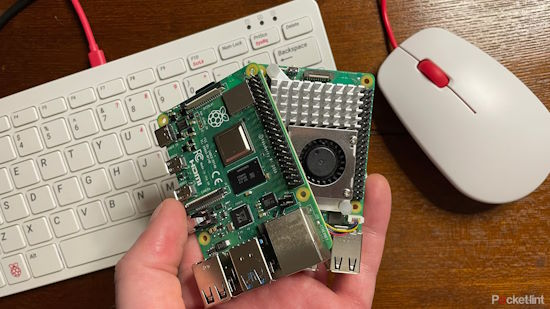](https://www.pocket-lint.com/raspberry-pi-5-vs-4/)

There are pros and cons to both the Raspberry Pi 5 and Raspberry Pi 4, depending on how you plan to use your mini computer. To figure out which is best for different purposes, Pocket-lint puts Pi 5 and 4 computers to the test, comparing their performance and capabilities in different situations - [Pocket-lint](https://www.pocket-lint.com/raspberry-pi-5-vs-4/).

## This Week's Python Streams

Python on Hardware is all about building a cooperative ecosphere which allows contributions to be valued and to grow knowledge. Below are the streams within the last week focusing on the community.

**CircuitPython Deep Dive Stream**

Check out Scott's stream from Friday afternoon [here](https://www.youtube.com/watch?v=_5-9sBt3apg).

You can see the latest video and past videos on the Adafruit YouTube channel under the Deep Dive playlist - [YouTube](https://www.youtube.com/playlist?list=PLjF7R1fz_OOXBHlu9msoXq2jQN4JpCk8A).

**CircuitPython Parsec**

John Park’s CircuitPython Parsec is off this week. Catch all the episodes in the [YouTube playlist](https://www.youtube.com/playlist?list=PLjF7R1fz_OOWFqZfqW9jlvQSIUmwn9lWr).

**CircuitPython Weekly Meeting**

CircuitPython Weekly Meeting for February 20, 2024 ([notes](https://github.com/adafruit/adafruit-circuitpython-weekly-meeting/blob/main/2024/2024-02-20.md)) [on YouTube](https://youtu.be/eTzS26wERFw).

## Project of the Week: Making a MIDI Kalimba with Raspberry Pi Pico and CircuitPython

[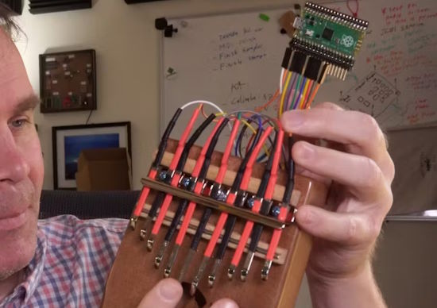](https://www.hackster.io/JeremyCook/midi-kalimba-with-raspberry-pi-pico-2c1362)

Converting a Kalimba instrument to MIDI use with capacitive sensing, Raspberry Pi Pico and CircuitPython - [hackster.io Project](https://www.hackster.io/JeremyCook/midi-kalimba-with-raspberry-pi-pico-2c1362), [hackster.io News](https://www.hackster.io/news/midi-kalimba-with-raspberry-pi-pico-18dabb44c22c) and [YouTube](https://youtu.be/rYfwJlpY2-8).

## Popular Last Week

[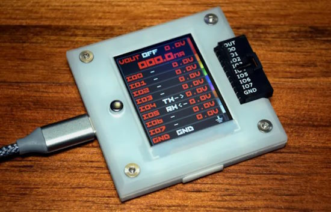](https://hackaday.com/2024/02/12/hands-on-bus-pirate-5/)

What was the most popular, most clicked link, in [last week's newsletter](https://www.adafruitdaily.com/2024/02/19/python-on-microcontrollers-newsletter-circuitpython-8-2-10-released-renesas-buys-altium-and-much-more-circuitpython-python-micropython-thepsf-raspberry_pi/)? [Hands-on: Bus Pirate 5](https://hackaday.com/2024/02/12/hands-on-bus-pirate-5/).

## New Notes from Adafruit Playground

[Adafruit Playground](https://adafruit-playground.com/) is a new place for the community to post their projects and other making tips/tricks/techniques. Ad-free, it's an easy way to publish your work in a safe space for free.

Memento: Flicking USB ReadOnly/Write@Boot + Setting WiFi using QRCode - [Adafruit Playground](https://adafruit-playground.com/u/tyeth/pages/memento-flicking-usb-readonly-write-boot-setting-wifi-using-qrcode).

[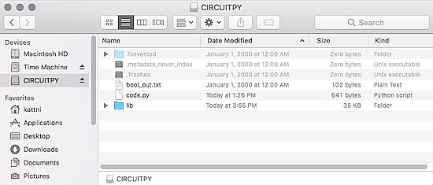](https://adafruit-playground.com/u/brubell/pages/uf2-workflow-backup-circuitpython-files)

UF2 Workflow: Backup CircuitPython Files - [Adafruit Playground](https://adafruit-playground.com/u/brubell/pages/uf2-workflow-backup-circuitpython-files).

Web Workflow: Backup CircuitPython Files - [Adafruit Playground](https://adafruit-playground.com/u/brubell/pages/web-workflow-backup-circuitpython-files).

## News from around the web

Gemini Advanced subscribers can now edit and run Python code directly in the Gemini interface. This will help developers quickly verify experimental code and ensure that the code runs as expected. It will also help developers to immediately view the results of code modifications. This feature is currently only available to Gemini Advanced premium users (US $20/month) and is not available in the Gemini free version - [BizChina](https://www.gizchina.com/2024/02/20/google-gemini-gets-an-advanced-update/).

Use microWakeWord to recognize phrases spoken to an ESP32-S3 and initiate actions in Home Assistant - [Home Assistant Blog](https://www.home-assistant.io/blog/2024/02/21/voice-chapter-6/) and [YouTube]().

> "[microWakeWord](https://github.com/kahrendt/microWakeWord/tree/main) is an open-source wakeword library for detecting custom wake words on low power devices. It produces models that are suitable for using TensorFlow Lite for Microcontrollers and Python."

[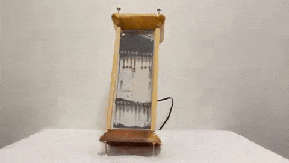](https://twitter.com/ozidiicongo/status/1760954462431003114)

A digital hourglass controlled by a Raspberry Pi Pico and running code in MicroPython. Iron filings fall between two pieces of plexiglass while numbers appear, counting down 30 seconds - [X](https://twitter.com/ozidiicongo/status/1760954462431003114).

[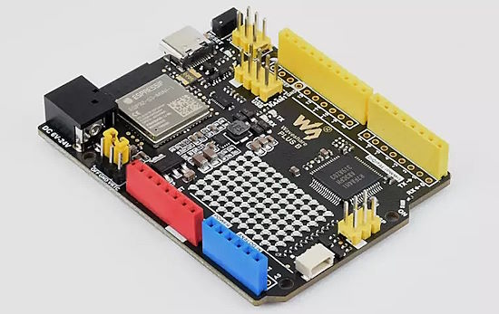](https://www.cnx-software.com/2024/02/22/waveshare-r7fa4-plus-a-b-clones-arduino-uno-r4-minima-wifi/)

The new Waveshare R7FA4 PLUS A and B boards are nearly identical to the Arduino UNO R4 Minima and WiFi - [CNX Software](https://www.cnx-software.com/2024/02/22/waveshare-r7fa4-plus-a-b-clones-arduino-uno-r4-minima-wifi/).

[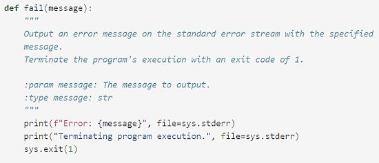](https://www.spinellis.gr/blog/20240205/)

A Python exception handling revelation - [Diomidis Spinellis](https://www.spinellis.gr/blog/20240205/).

[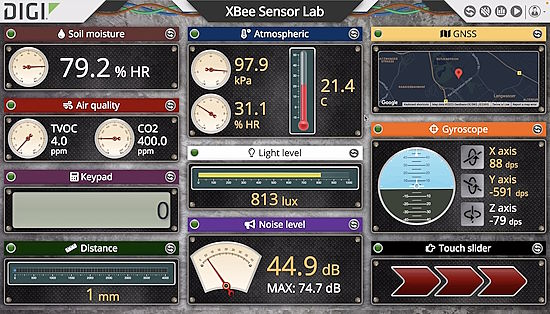](https://www.faludi.com/2023/03/31/live-demo-digi-xbee-sensor-lab/)

A live demo of Digi XBee Sensor Lab with MicroPython - [Rob Faludi](https://www.faludi.com/2023/03/31/live-demo-digi-xbee-sensor-lab/) and [YouTube](https://www.youtube.com/watch?v=zfkEAhnPG1s).

Revolutionizing LEGO RC control with Pybricks and Xbox - [YouTube](https://www.youtube.com/watch?v=fxInp9cutNg).

[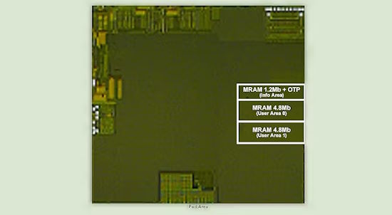](https://www.hackster.io/news/renesas-shows-off-a-high-performance-stt-mram-design-for-200mhz-plus-microcontrollers-e86264e44dd5)

Renesas shows off a high-performance STT-MRAM design for 200MHz-plus microcontrollers. Offering read and write speeds eclipsing previous efforts, MRAM could be coming to a microcontroller near you sooner thank you think - [hackster.io](https://www.hackster.io/news/renesas-shows-off-a-high-performance-stt-mram-design-for-200mhz-plus-microcontrollers-e86264e44dd5).

[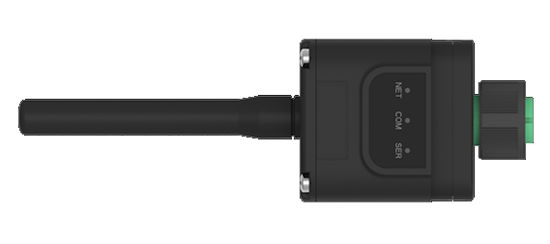](https://nerdralph.blogspot.com/2023/05/modbus-communication-with-solis-4g-us.html)

Modbus communication for Solis inverters with Python - [Nerd Ralph](https://nerdralph.blogspot.com/2023/05/modbus-communication-with-solis-4g-us.html) and [GitHub](https://github.com/nerdralph/solis-us).

Building the eInk Memory Box with Raspberry Pi Zero W and Python - [Mike Buss](https://www.mikebuss.com/posts/memory-box).

[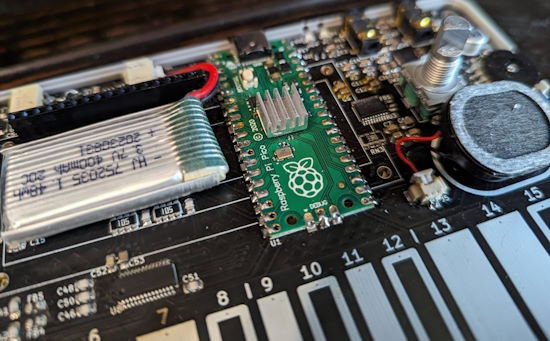](https://pico-synth-sandbox.dcdalrymple.com/version-0-3-0/)

Version 0.3.0 of the `pico_synth_sandbox-synthesizer` CircuitPython library released - [pico-synth-sandbox.dcdalrymple.com](https://pico-synth-sandbox.dcdalrymple.com/version-0-3-0/) and [GitHub](https://github.com/dcooperdalrymple/pico_synth_sandbox-synthesizer).

[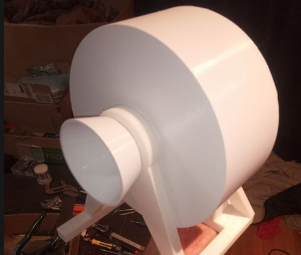](https://hackaday.io/project/193119-automatic-cat-feeder-3d-printable)

An automated cat feeder, 3D printed and programmed in MicroPython - [hackaday.io](https://hackaday.io/project/193119-automatic-cat-feeder-3d-printable).

[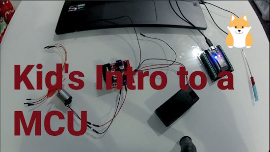](https://www.youtube.com/watch?v=m4XRoc_9GfI)

A kid's intro to a MCU (Microcontroller Unit) using MicroPython - [YouTube](https://www.youtube.com/watch?v=m4XRoc_9GfI).

[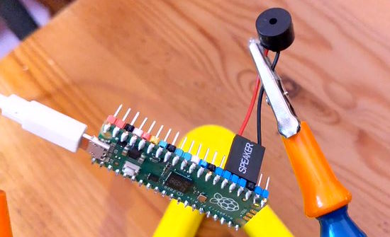](https://scruss.com/blog/2024/02/19/crickets-in-february/)

Simulating crickets in February with Raspberry Pi Pico and MicroPython - [scruss.com](https://scruss.com/blog/2024/02/19/crickets-in-february/).

[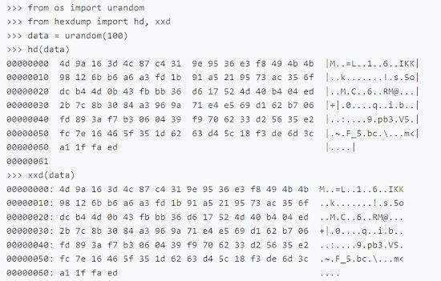](https://github.com/mattytrentini/micropython-hexdump)

micropython-hexdump: a simple implementation of hexdump (hd and xxd) tools for MicroPython - [GitHub](https://github.com/mattytrentini/micropython-hexdump).

[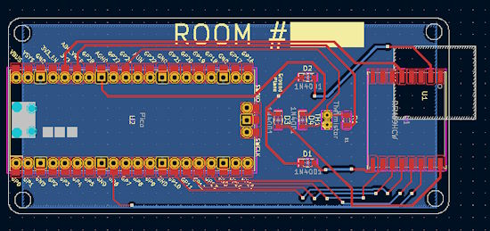](https://hackerpublicradio.org/eps/hpr4058/index.html)

A radio thermometer with Raspberry Pi Pico and CircuitPython - [Hacker Public Radio](https://hackerpublicradio.org/eps/hpr4058/index.html) via [Mastodon](https://octodon.social/@hpr@botsin.space/111968461353989608).

## New

[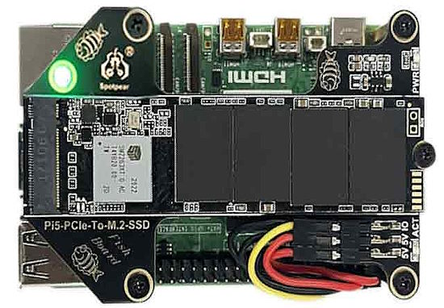](https://spotpear.com/shop/Raspberry-Pi-5-PCIe-M.2-NVMe-SSD-Fish-A.html)

The Raspberry Pi 5 PCIe to M.2 NVMe SSD Board Pi5-Pcie-Fish-Board For Pi5 allows access to ports and can be mounted on the front or rear of the Pi - [Spotpear](https://spotpear.com/shop/Raspberry-Pi-5-PCIe-M.2-NVMe-SSD-Fish-A.html).

[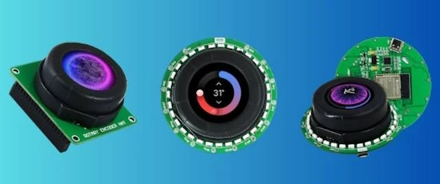](https://www.allaboutcircuits.com/news/rotary-encoder-project-offers-customized-ui-any-mcu-mpu-display/)

Kickstarter project Rotary Encoder aims to bring touch screen rotary encoders to the DIY electronics community. Rotary offers three different variations: Rotary HAT, Rotary ESP32, and Rotary Pico W - [All About Circuits](https://www.allaboutcircuits.com/news/rotary-encoder-project-offers-customized-ui-any-mcu-mpu-display/).

## New Boards Supported by CircuitPython

The number of supported microcontrollers and Single Board Computers (SBC) grows every week. This section outlines which boards have been included in CircuitPython or added to [CircuitPython.org](https://circuitpython.org/).

This week there were three new boards added:

- [Dial - Smart Rotary Knob with Touch Screen](https://circuitpython.org/board/m5stack_dial/)
- [Adafruit ItsyBitsy ESP32](https://circuitpython.org/board/adafruit_itsybitsy_esp32/)
- [senseBox MCU-S2](https://circuitpython.org/board/sensebox_mcu_esp32s2/)

*Note: For non-Adafruit boards, please use the support forums of the board manufacturer for assistance, as Adafruit does not have the hardware to assist in troubleshooting.*

Looking to add a new board to CircuitPython? It's highly encouraged! Adafruit has four guides to help you do so:

- [How to Add a New Board to CircuitPython](https://learn.adafruit.com/how-to-add-a-new-board-to-circuitpython/overview)
- [How to add a New Board to the circuitpython.org website](https://learn.adafruit.com/how-to-add-a-new-board-to-the-circuitpython-org-website)
- [Adding a Single Board Computer to PlatformDetect for Blinka](https://learn.adafruit.com/adding-a-single-board-computer-to-platformdetect-for-blinka)
- [Adding a Single Board Computer to Blinka](https://learn.adafruit.com/adding-a-single-board-computer-to-blinka)

## CircuitPython Libraries

The CircuitPython library numbers are continually increasing, while existing ones continue to be updated. Here we provide library numbers and updates!

To get the latest Adafruit libraries, download the [Adafruit CircuitPython Library Bundle](https://circuitpython.org/libraries). To get the latest community contributed libraries, download the [CircuitPython Community Bundle](https://circuitpython.org/libraries).

If you'd like to contribute to the CircuitPython project on the Python side of things, the libraries are a great place to start. Check out the [CircuitPython.org Contributing page](https://circuitpython.org/contributing). If you're interested in reviewing, check out Open Pull Requests. If you'd like to contribute code or documentation, check out Open Issues. We have a guide on [contributing to CircuitPython with Git and GitHub](https://learn.adafruit.com/contribute-to-circuitpython-with-git-and-github), and you can find us in the #help-with-circuitpython and #circuitpython-dev channels on the [Adafruit Discord](https://adafru.it/discord).

You can check out this [list of all the Adafruit CircuitPython libraries and drivers available](https://github.com/adafruit/Adafruit_CircuitPython_Bundle/blob/master/circuitpython_library_list.md). 

The current number of CircuitPython libraries is **478**!

**New Libraries**

Here's this week's new CircuitPython libraries:

  * [adafruit/Adafruit_CircuitPython_ConnectionManager](https://github.com/adafruit/Adafruit_CircuitPython_ConnectionManager)

**Updated Libraries**

Here's this week's updated CircuitPython libraries:

  * [adafruit/Adafruit_CircuitPython_MiniMQTT](https://github.com/adafruit/Adafruit_CircuitPython_MiniMQTT)
  * [adafruit/Adafruit_CircuitPython_PyCamera](https://github.com/adafruit/Adafruit_CircuitPython_PyCamera)
  * [adafruit/Adafruit_CircuitPython_HTTPServer](https://github.com/adafruit/Adafruit_CircuitPython_HTTPServer)
  * [adafruit/Adafruit_CircuitPython_MacroPad](https://github.com/adafruit/Adafruit_CircuitPython_MacroPad)
  * [furbrain/CircuitPython_seeed_xiao_nRF52840](https://github.com/furbrain/CircuitPython_seeed_xiao_nRF52840)
  * [cedargrovestudios/circuitpython_waveviz](https://github.com/cedargrovestudios/circuitpython_waveviz)

**Library PyPI Weekly Download Stats**

**Total Library Stats**

  * 93041 PyPI downloads over 325 libraries

**Top 10 Libraries by PyPI Downloads**

  * Adafruit CircuitPython BusDevice (adafruit-circuitpython-busdevice): 8308
  * Adafruit CircuitPython Requests (adafruit-circuitpython-requests): 8142
  * Adafruit CircuitPython Register (adafruit-circuitpython-register): 1993
  * Adafruit CircuitPython framebuf (adafruit-circuitpython-framebuf): 1152
  * Adafruit CircuitPython RGB Display (adafruit-circuitpython-rgb-display): 1049
  * Adafruit CircuitPython ADS1x15 (adafruit-circuitpython-ads1x15): 1024
  * Adafruit CircuitPython Pixelbuf (adafruit-circuitpython-pixelbuf): 1012
  * Adafruit CircuitPython DHT (adafruit-circuitpython-dht): 932
  * Adafruit CircuitPython Motor (adafruit-circuitpython-motor): 906
  * Adafruit CircuitPython NeoPixel (adafruit-circuitpython-neopixel): 884

## What’s the CircuitPython team up to this week?

What is the team up to this week? Let’s check in:

**Dan**

I released CircuitPython 8.2.10, 9.0.0-beta.1, and then 9.0.0-beta.2 in the past week. 9.0.0-beta.2 fixes an issue with the MEMENTO CIRCUITPY filesystem. Thanks to everyone who worked on this: we had a quick solution. The PyCamera library will now notice if you have not updated and tell you what to do.

I'm now working on some remaining issues with the nRF port for 9.0.0.

**Melissa**

[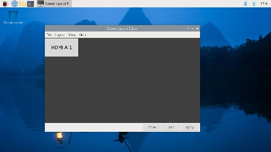](https://circuitPython.org/)

This past week, I made some progress with `Pi_Eyes` and now have it successfully retrieving and saving the desktop as an image. This is done in C and the idea is to have it constantly retrieve the image, shrink it, and display it across 2 displays.

I also update the [CircuitPython Code Editor](https://code.circuitpython.org/) so that it works with some changes made in CircuitPython 9 to Web Workflow. Previously it was failing to connect. Additional improvements are planned as well.

**Tim**

This week I've been working on a demo for the MEMENTO that adds decorative overlays on top of the photos that it takes. This required figuring out the correct colorspace conversions and modifying the `adafruit_bitmapsaver` library to support `ColorConverter` in addition to `Palette` for getting color information to save. I've submitted a PR with some of the most basic usage of this functionality and am working on a more advanced version that allows modifying the overlay position with the D pad.

**Jeff**

I've gotten back into retro floppy disk coding. The current goal is to implement MFM writing so that it is possible to both read and write from a real DOS-formatted floppy disk connected to a modern PC through a device like the Adafruit Floppsy. This work will appear first for Arduino but might be ported to CircuitPython later if it turns out to be feasible.

**Scott**

This week I've continued squishing bugs for 9.0.0. I made socket reuse work like CPython. I fixed ctrl-c issues on iMX RT. I also fixed UART RX issues on iMX RT. I improved NeoPixel transmission on ESP32. Now I'm looking at a hard crash on SAMD21 when using `PulseIn`.

**Liz**

This week I worked on a guide for the new [NeoRGB breakout](https://learn.adafruit.com/adafruit-neorgb-stemma). This breakout lets you send NeoPixel-compatible signals to an analog RGB strip. I've dealt with using PWM on the three red, green and blue channels before and being able to send NeoPixel data with the built-in animations was really cool. I hope to do a project with it at some point.

## Upcoming Events

The next MicroPython Meetup in Melbourne will be on February 28th – [Meetup](https://www.meetup.com/micropython-meetup/events). 

PyCascades 2024 is back in Seattle, Washington, USA and online, April 5-8th at the University of Washington, Kane Hall - [PyCascades](https://2024.pycascades.com/).

The 2024 Open Hardware Summit will be taking place May 3 & 4, 2024 at Concordia University and lespacemaker in Montreal, Canada - [oshwa.org](https://2024.oshwa.org/).

PyCon US 2024 launches May 15-23, 2024 in Pittsburgh, Pennsylvania US - [PyCon US](https://pycon.blogspot.com/2024/10/pycon-us-2024-launches.html).

EuroPython is the oldest and longest running volunteer-led Python programming conference on the planet. This year it will be held July 8-14 in Prague. Call for Proposals, the Mentorship Programme, and the Financial Aid Programme will be starting this month - [EuroPython 2024](https://ep2024.europython.eu/).

**Send Your Events In**

If you know of virtual events or upcoming events, please let us know via email to cpnews(at)adafruit(dot)com.

## Latest Releases

CircuitPython's stable release is [8.2.10](https://github.com/adafruit/circuitpython/releases/latest) and its unstable release is [9.0.0-beta2](https://github.com/adafruit/circuitpython/releases). New to CircuitPython? Start with our [Welcome to CircuitPython Guide](https://learn.adafruit.com/welcome-to-circuitpython).

[20240223](https://github.com/adafruit/Adafruit_CircuitPython_Bundle/releases/latest) is the latest Adafruit CircuitPython library bundle.

[20240221](https://github.com/adafruit/CircuitPython_Community_Bundle/releases/latest) is the latest CircuitPython Community library bundle.

[v1.22.2](https://micropython.org/download) is the latest MicroPython release. Documentation for it is [here](http://docs.micropython.org/en/latest/pyboard/).

[3.12.2](https://www.python.org/downloads/) is the latest Python release. The latest pre-release version is [3.13alpha3](https://www.python.org/download/pre-releases/).

[3,817 Stars](https://github.com/adafruit/circuitpython/stargazers) Like CircuitPython? [Star it on GitHub!](https://github.com/adafruit/circuitpython)

## Call for Help -- Translating CircuitPython is now easier than ever

[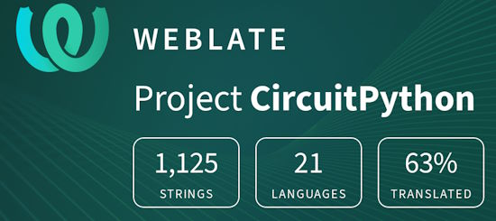](https://hosted.weblate.org/engage/circuitpython/)

One important feature of CircuitPython is translated control and error messages. With the help of fellow open source project [Weblate](https://weblate.org/), we're making it even easier to add or improve translations. 

Sign in with an existing account such as GitHub, Google or Facebook and start contributing through a simple web interface. No forks or pull requests needed! As always, if you run into trouble join us on [Discord](https://adafru.it/discord), we're here to help.

## 38,747 Thanks

The Adafruit Discord community, where we do all our CircuitPython development in the open, reached over 38,747 humans - thank you! Adafruit believes Discord offers a unique way for Python on hardware folks to connect. Join today at [https://adafru.it/discord](https://adafru.it/discord).

## ICYMI - In case you missed it

Python on hardware is the Adafruit Python video-newsletter-podcast! The news comes from the Python community, Discord, Adafruit communities and more and is broadcast on ASK an ENGINEER Wednesdays. The complete Python on Hardware weekly videocast [playlist is here](https://www.youtube.com/playlist?list=PLjF7R1fz_OOXRMjM7Sm0J2Xt6H81TdDev). The video podcast is on [iTunes](https://itunes.apple.com/us/podcast/python-on-hardware/id1451685192?mt=2), [YouTube](http://adafru.it/pohepisodes), [Instagram Reels](https://www.instagram.com/adafruit/channel/)), and [XML](https://itunes.apple.com/us/podcast/python-on-hardware/id1451685192?mt=2).

[The weekly community chat on Adafruit Discord server CircuitPython channel - Audio / Podcast edition](https://itunes.apple.com/us/podcast/circuitpython-weekly-meeting/id1451685016) - Audio from the Discord chat space for CircuitPython, meetings are usually Mondays at 2pm ET, this is the audio version on [iTunes](https://itunes.apple.com/us/podcast/circuitpython-weekly-meeting/id1451685016), Pocket Casts, [Spotify](https://adafru.it/spotify), and [XML feed](https://adafruit-podcasts.s3.amazonaws.com/circuitpython_weekly_meeting/audio-podcast.xml).

## Contribute

The CircuitPython Weekly Newsletter is a CircuitPython community-run newsletter emailed every Monday. The complete [archives are here](https://www.adafruitdaily.com/category/circuitpython/). It highlights the latest CircuitPython related news from around the web including Python and MicroPython developments. To contribute, edit next week's draft [on GitHub](https://github.com/adafruit/circuitpython-weekly-newsletter/tree/gh-pages/_drafts) and [submit a pull request](https://help.github.com/articles/editing-files-in-your-repository/) with the changes. You may also tag your information on Twitter with #CircuitPython. 

Join the Adafruit [Discord](https://adafru.it/discord) or [post to the forum](https://forums.adafruit.com/viewforum.php?f=60) if you have questions.
