- [ ] Library and info updates
- [ ] change date
- [ ] update title
- [ ] Feature story
- [ ] Update  for images
- [ ] Update ICYDNCI
- [ ] All images 550w max only
- [ ] Link "View this email in your browser."

News Sources

- [Adafruit Playground](https://adafruit-playground.com/)
- Twitter: [CircuitPython](https://twitter.com/search?q=circuitpython&src=typed_query&f=live), [MicroPython](https://twitter.com/search?q=micropython&src=typed_query&f=live) and [Python](https://twitter.com/search?q=python&src=typed_query)
- [Raspberry Pi News](https://www.raspberrypi.com/news/)
- Mastodon [CircuitPython](https://octodon.social/tags/CircuitPython) and [MicroPython](https://octodon.social/tags/MicroPython)
- [hackster.io CircuitPython](https://www.hackster.io/search?q=circuitpython&i=projects&sort_by=most_recent) and [MicroPython](https://www.hackster.io/search?q=micropython&i=projects&sort_by=most_recent)
- [python.org](https://www.python.org/)
- [Python Insider - dev team blog](https://pythoninsider.blogspot.com/)
- Individuals: [Jeff Geerling](https://www.jeffgeerling.com/blog)
- [hackaday CircuitPython](https://hackaday.com/blog/?s=circuitpython) and [MicroPython](https://hackaday.com/blog/?s=micropython)
- [hackaday.io newest projects MicroPython](https://hackaday.io/projects?tag=micropython&sort=date) and [CircuitPython](https://hackaday.io/projects?tag=circuitpython&sort=date)
- [Google News Python](https://news.google.com/topics/CAAqIQgKIhtDQkFTRGdvSUwyMHZNRFY2TVY4U0FtVnVLQUFQAQ?hl=en-US&gl=US&ceid=US%3Aen)
- Check Issues and PRs for input

View this email in your browser. **Warning: Flashing Imagery**

Welcome to the latest Python on Microcontrollers newsletter! Another busy week! CircuitPython 9 is one step closer to being complete with its first release candidate. Please test if you can as any last issues are taken care of. What's different between MicroPython & CircuitPython? Catch a comparison article. And much more in this packed issue. - *Anne Barela, Ed.*

We're on [Discord](https://discord.gg/HYqvREz), [Twitter](https://twitter.com/search?q=circuitpython&src=typed_query&f=live), and for past newsletters - [view them all here](https://www.adafruitdaily.com/category/circuitpython/). If you're reading this on the web, [subscribe here](https://www.adafruitdaily.com/). Here's the news this week:

## CircuitPython 9.0.0 Release Candidate 0 Now Out

CircuitPython 9.0.0-rc.0, a release candidate for 9.0.0 final, has been released. This release is believed to be stable and is meant for testing before the final release of 9.0.0. See the post for all the additions and changes - [Adafruit Blog](https://blog.adafruit.com/2024/03/07/circuitpython-9-0-0-release-candidate-0-released/) and [GitHub](https://github.com/adafruit/circuitpython/releases/tag/9.0.0-rc.0).

## MicroPython vs CircuitPython: A Comprehensive Comparison

MicroPython and CircuitPython are two popular programming languages that have gained significant attention in the world of embedded systems and Internet of Things (IoT) development. Both languages are based on Python, a versatile and easy-to-use programming language. This article explores the similarities and differences between MicroPython and CircuitPython whic may help you choose the right language for your project - [APalgorithm.com](https://apalgorithm.com/micropython-vs-circuitpython-a-comprehensive-comparison/).

## Developing FPGAs on a Raspberry Pi 400 with Python

[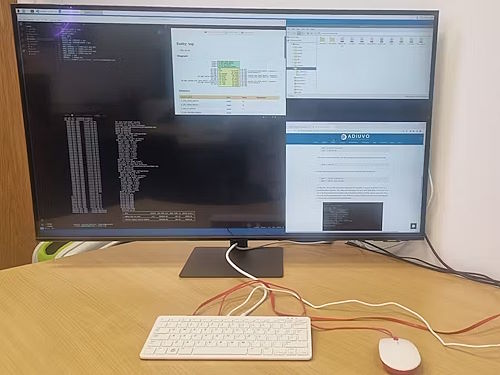](https://www.hackster.io/adam-taylor/developing-fpgas-on-a-raspberry-pi-400-with-cocotb-fd4b7e)

Learning FPGA needs complex tools and large powerful computers, right? No. One can develop FPGAs on a Raspberry Pi 400 with Cocotb. [Cocotb](https://www.cocotb.org/) can test and verify chip designs in Python - [hackster.io](https://www.hackster.io/adam-taylor/developing-fpgas-on-a-raspberry-pi-400-with-cocotb-fd4b7e).

## Back to the Future Time Circuits Built with a Raspberry Pi Pico and CircuitPython

Reddit user traveling_fred presents a lovely Back to the Future time circuit build with dial in time setting. The displays come from [Circuit Setup](https://circuitsetup.us/product/complete-time-circuits-display-kit/) and the project uses a Raspberry Pi Pico running CircuitPython - [Reddit](https://www.reddit.com/r/raspberry_pi/comments/1b3yp29/back_to_the_future_time_circuits_built_with/) and [Tom's Hardware](https://www.tomshardware.com/raspberry-pi/raspberry-pi-pico-used-in-back-to-the-future-time-circuits-replica).

## How to Control your Raspberry Pi Camera using Python and a web UI

[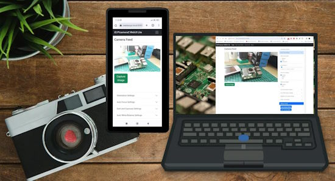](https://www.tomshardware.com/raspberry-pi/how-to-control-your-raspberry-pi-camera-using-a-web-ui)

Using Picamera2 on a Raspberry Pi SBC isn’t difficult, but for some the pure Python interface can be challenging. James Mitchell has created Picamera2 Web UI Lite, a web interface for Picamera2 which provides a full suite of camera settings to tweak, along with an image gallery where we can view and download images - [Tom's Hardware](https://www.tomshardware.com/raspberry-pi/how-to-control-your-raspberry-pi-camera-using-a-web-ui).

## Raspberry Pi 5 Operating Systems

Raspberry Pi OS is far from being the only operating system for the Raspberry Pi 5. Explaining Computers looks at seven different OSes and how they stack up - [YouTube](https://www.youtube.com/watch?v=7G6jZd4gHtM).

Also: Venturing beyond the default OS on Raspberry Pi 5 - [The Register](https://www.theregister.com/2024/03/07/alt_pi_5_linux_distros/).

## This Week's Python Streams

Python on Hardware is all about building a cooperative ecosphere which allows contributions to be valued and to grow knowledge. Below are the streams within the last week focusing on the community.

**CircuitPython Deep Dive Stream**

[Last Friday](link), Scott streamed work on {subject}.

You can see the latest video and past videos on the Adafruit YouTube channel under the Deep Dive playlist - [YouTube](https://www.youtube.com/playlist?list=PLjF7R1fz_OOXBHlu9msoXq2jQN4JpCk8A).

**CircuitPython Parsec**

John Park’s CircuitPython Parsec this week is on {subject} - [Adafruit Blog](link) and [YouTube](link).

Catch all the episodes in the [YouTube playlist](https://www.youtube.com/playlist?list=PLjF7R1fz_OOWFqZfqW9jlvQSIUmwn9lWr).

**CircuitPython Weekly Meeting**

CircuitPython Weekly Meeting for March 4th, 2024 ([notes]([file](https://github.com/adafruit/adafruit-circuitpython-weekly-meeting/blob/main/2024/2024-03-04.md))) [on YouTube]([link](https://youtu.be/uYEvP0F4EhA)).

## Project of the Week: The stoRPer Robot

[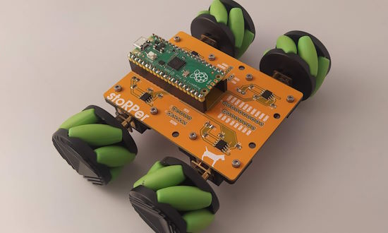](https://github.com/concretedog/stoRPer)

stoRPer is a modular adaptable AWD Raspberry Pi Pico based robot rover. A novel twist is the circuit board forms the base of the robot. It is programmable in MicroPython, making it more affordable - [GitHub](https://github.com/concretedog/stoRPer), [Hackaday](https://hackaday.com/2024/03/06/the-16-pcb-robot/) and [YouTube](https://youtu.be/Y8ddx1Og3Xw).

## Popular Last Week

[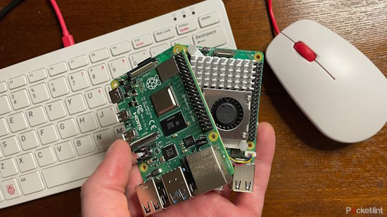](https://www.pocket-lint.com/raspberry-pi-tips-tricks/#get-connected-to-wi-fi)

What was the most popular, most clicked link, in [last week's newsletter](https://www.adafruitdaily.com/2024/03/04/python-on-microcontrollers-newsletter-raspberry-pi-turns-12-pycon-schedule-kicad-8-and-more-circuitpython-python-micropython-thepsf-raspberry_pi/)? [9 tips I wish I knew before starting my first Raspberry Pi project](https://www.pocket-lint.com/raspberry-pi-tips-tricks/#get-connected-to-wi-fi).

## New Notes from Adafruit Playground

[Adafruit Playground](https://adafruit-playground.com/) is a new place for the community to post their projects and other making tips/tricks/techniques. Ad-free, it's an easy way to publish your work in a safe space for free.

[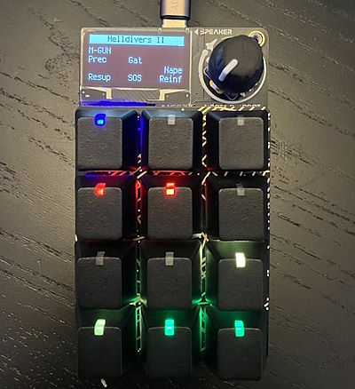](https://adafruit-playground.com/u/squid_jpg/pages/easy-helldivers-ii-stratagem-macros-for-rp2040-macropad)

Easy Helldivers II Stratagem Macros for RP2040 Macropad - [Adafruit Playground](https://adafruit-playground.com/u/squid_jpg/pages/easy-helldivers-ii-stratagem-macros-for-rp2040-macropad).

Adafruit Connection Manager - [Adafruit Playground](https://adafruit-playground.com/u/justmobilize/pages/adafruit-connection-manager).

## News from around the web

CircuitPython statistics: [Pull Request #9000](https://github.com/adafruit/circuitpython/pull/9000) was recently opened by a community member in CircuitPython. As the same pool of numbers is used for issues and for PRs so it's not accurate to call it the "9000th pull request" but it is very significant (it is actually about the 5100th pull request) - [GitHub](https://github.com/adafruit/circuitpython).

[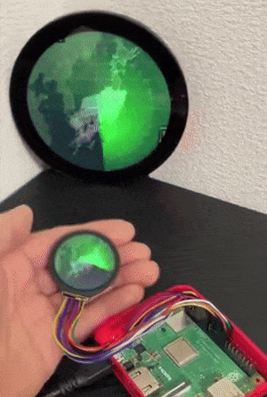](https://twitter.com/sozoraemon/status/1764946328113889290)

A small radar-style clock using a Raspberry Pi, a round display and Python - [X](https://twitter.com/sozoraemon/status/1764946328113889290).

[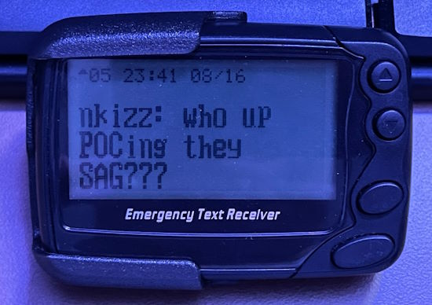](https://finnley.dolphinhome.net/2024/02/25/from-beeps-to-toots-reviving-pagers-with-python-and-mastodon/)

From Beeps to Toots: Reviving Pagers with Python and Mastodon - [Finney Dolfin](https://finnley.dolphinhome.net/2024/02/25/from-beeps-to-toots-reviving-pagers-with-python-and-mastodon/).

[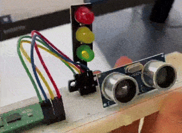](https://twitter.com/r_schulz_maker/status/1764658209036324903)

Physical computing with Raspberry Pi Pico. Students learning about MCU pins, how to connect and control electronic components like traffic light LEDs with MicroPython in computer science class - [X](https://twitter.com/r_schulz_maker/status/1764658209036324903).

[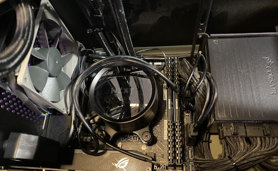](https://calbryant.uk/blog/better-pc-cooling-with-python/)

Better PC cooling with Python and Grafana - [Cal Bryant](https://calbryant.uk/blog/better-pc-cooling-with-python/).

[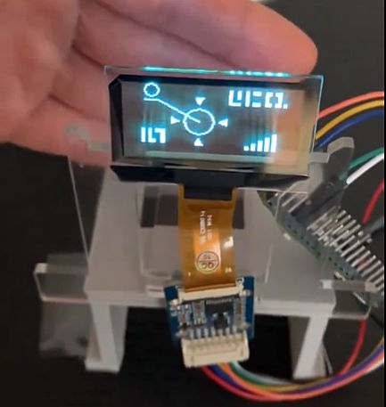](https://twitter.com/sozoraemon/status/1763879405007654989)

A Dragon Ball scouter using Raspberry Pi Pico and MicroPython with a transparent OLED display - [X](https://twitter.com/sozoraemon/status/1763879405007654989).

A CircuitPython compatible RP2040-based dev board that's less than 15mm wide for use in Eurorack designs that are as narrow as 3HP, without having to do the shark-fin thing off the back - [Mastodon](https://octodon.social/@rossgrady@dood.net/111947884292090683).

[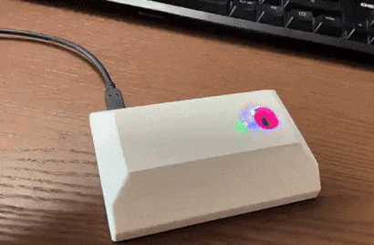](https://www.hackster.io/Infineon_Team/upgrade-your-smarthome-with-radar-and-home-assistant-feb4cf)

Using MicroPython and Home Assistant to integrate a doppler radar sensor for motion and presence detection into a smarthome - [hackster.io](https://www.hackster.io/Infineon_Team/upgrade-your-smarthome-with-radar-and-home-assistant-feb4cf).

[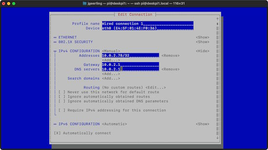](https://www.jeffgeerling.com/blog/2024/set-static-ip-address-nmtui-on-raspberry-pi-os-12-bookworm)

How to set a static IP address with nmtui on Raspberry Pi OS 12 'Bookworm' - [Jeff Geerling](https://www.jeffgeerling.com/blog/2024/set-static-ip-address-nmtui-on-raspberry-pi-os-12-bookworm).

Porting an Adafruit VL5310X sensor driver to MicroPython with non-blocking - [GitHub](https://github.com/antirez/vl53l0x-nb) via [X](https://twitter.com/antirez/status/1764583836271149235?t=8CEzwo57HhvpBeXMlUGhGQ&s=03).

3rd year pre-service engineering teachers last semester at the University of Limerick School of Education. Their ‘Line Follower’ projects demonstrated MicroPython knowledge and creativity - [X](https://twitter.com/ManusMcdyer/status/1765315107523822016).

[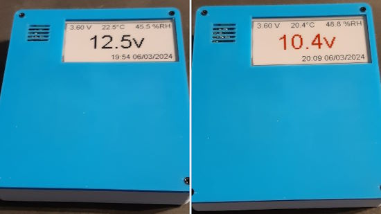](https://twitter.com/TheFlyingKipper/status/1764373530391560557)

Monitoring a battery state with an Adafruit ESP32 V2 Feather, ThinkInk 2.9" display, AHT20 temperature & humidity sensor and Pimoroni ADS1015 ADC connected to a car battery, programmed in CircuitPython - [X Thread](https://twitter.com/TheFlyingKipper/status/1764373530391560557).

text - [site](url).

text - [site](url).

[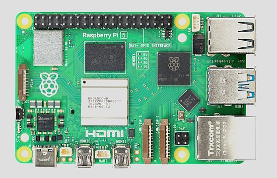](https://www.pcworld.com/article/2250605/raspberry-pi-5-the-6-best-tips-tricks-applications-for-the-single-board-pc.html)

Raspberry Pi 5: 6 great tips, tricks & uses for the single-board PC - [PCWorld](https://www.pcworld.com/article/2250605/raspberry-pi-5-the-6-best-tips-tricks-applications-for-the-single-board-pc.html).

[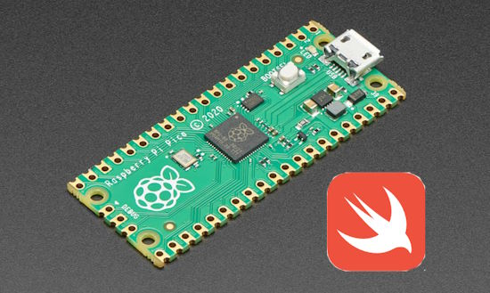](https://forums.swift.org/t/embedded-swift-on-the-raspberry-pi-pico-rp2040-without-the-pico-sdk/69338)

Embedded Swift on the Raspberry Pi Pico/RP2040 without the Pico SDK - [swift.org](https://forums.swift.org/t/embedded-swift-on-the-raspberry-pi-pico-rp2040-without-the-pico-sdk/69338).

Enough Markdown to get you by in most cases - [kattni:decoded](https://kattni.com/enough-markdown-to-get-you-by-in-most-cases).

[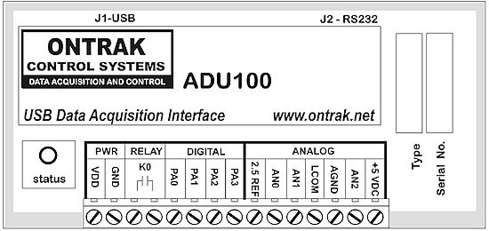](https://www.eventuallabs.com/blog/tcladu_1.0.0_demo/index.html)

A Tcl interface to the ADU100 via SWIG - [Eventual Labs](https://www.eventuallabs.com/blog/tcladu_1.0.0_demo/index.html).

## Coming Soon

[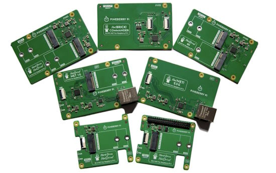](https://twitter.com/PineberryPi/status/1765439368070586484)

Pineberry Pi opens March with a smorgasbord of fresh boards available for preorder! Dual NVMe, NVMe with Coral Edge TPU, NVMe with Ethernet and more - [X](https://twitter.com/PineberryPi/status/1765439368070586484).

[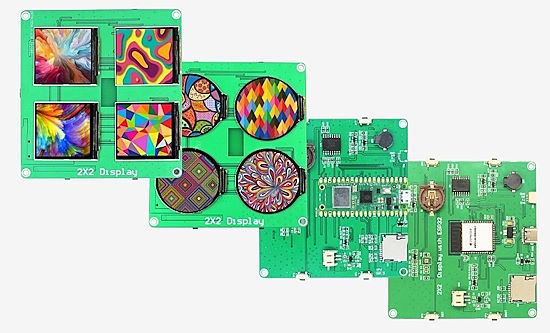](https://www.cnx-software.com/2024/03/04/2x2-quad-display-board-uses-raspberry-pi-pico-w-or-esp32-s3-wroom-1-four-displays/)

SB Components’ 2×2 Quad Display Board is an MCU development board fitted with either a Raspberry Pi Pico W board or an ESP32-S3-WROOM-1 module used to drive four small color displays in square or round shapes. MicroPython, CircuitPython, and Arduino samples should become available in due time - [CNX Software](https://www.cnx-software.com/2024/03/04/2x2-quad-display-board-uses-raspberry-pi-pico-w-or-esp32-s3-wroom-1-four-displays/).

## New Boards Supported by CircuitPython

The number of supported microcontrollers and Single Board Computers (SBC) grows every week. This section outlines which boards have been included in CircuitPython or added to [CircuitPython.org](https://circuitpython.org/).

This week, there were (#/no) new boards added:

- [Board name](url)
- [Board name](url)
- [Board name](url)

*Note: For non-Adafruit boards, please use the support forums of the board manufacturer for assistance, as Adafruit does not have the hardware to assist in troubleshooting.*

Looking to add a new board to CircuitPython? It's highly encouraged! Adafruit has four guides to help you do so:

- [How to Add a New Board to CircuitPython](https://learn.adafruit.com/how-to-add-a-new-board-to-circuitpython/overview)
- [How to add a New Board to the circuitpython.org website](https://learn.adafruit.com/how-to-add-a-new-board-to-the-circuitpython-org-website)
- [Adding a Single Board Computer to PlatformDetect for Blinka](https://learn.adafruit.com/adding-a-single-board-computer-to-platformdetect-for-blinka)
- [Adding a Single Board Computer to Blinka](https://learn.adafruit.com/adding-a-single-board-computer-to-blinka)

## New Learn Guides

[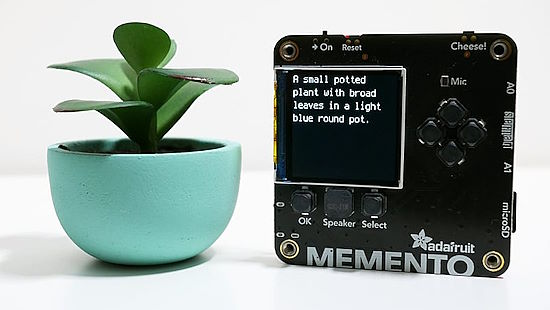](https://learn.adafruit.com/guides/latest)

[OpenAI Image Descriptors with MEMENTO](https://learn.adafruit.com/openai-image-descriptors-with-memento) from [Liz Clark](https://learn.adafruit.com/u/BlitzCityDIY)

## CircuitPython Libraries

The CircuitPython library numbers are continually increasing, while existing ones continue to be updated. Here we provide library numbers and updates!

To get the latest Adafruit libraries, download the [Adafruit CircuitPython Library Bundle](https://circuitpython.org/libraries). To get the latest community contributed libraries, download the [CircuitPython Community Bundle](https://circuitpython.org/libraries).

If you'd like to contribute to the CircuitPython project on the Python side of things, the libraries are a great place to start. Check out the [CircuitPython.org Contributing page](https://circuitpython.org/contributing). If you're interested in reviewing, check out Open Pull Requests. If you'd like to contribute code or documentation, check out Open Issues. We have a guide on [contributing to CircuitPython with Git and GitHub](https://learn.adafruit.com/contribute-to-circuitpython-with-git-and-github), and you can find us in the #help-with-circuitpython and #circuitpython-dev channels on the [Adafruit Discord](https://adafru.it/discord).

You can check out this [list of all the Adafruit CircuitPython libraries and drivers available](https://github.com/adafruit/Adafruit_CircuitPython_Bundle/blob/master/circuitpython_library_list.md). 

The current number of CircuitPython libraries is **478**!

**Updated Libraries**

Here's this week's updated CircuitPython libraries:

  * [adafruit/Adafruit_CircuitPython_ConnectionManager](https://github.com/adafruit/Adafruit_CircuitPython_ConnectionManager)
  * [adafruit/Adafruit_CircuitPython_Requests](https://github.com/adafruit/Adafruit_CircuitPython_Requests)
  * [adafruit/Adafruit_CircuitPython_TemplateEngine](https://github.com/adafruit/Adafruit_CircuitPython_TemplateEngine)
  * [adafruit/Adafruit_CircuitPython_OAuth2](https://github.com/adafruit/Adafruit_CircuitPython_OAuth2)

**Library PyPI Weekly Download Stats**

**Total Library Stats**

  * 117506 PyPI downloads over 325 libraries

**Top 10 Libraries by PyPI Downloads**

  * Adafruit CircuitPython Requests (adafruit-circuitpython-requests): 8805
  * Adafruit CircuitPython BusDevice (adafruit-circuitpython-busdevice): 8701
  * Adafruit CircuitPython ConnectionManager (adafruit-circuitpython-connectionmanager): 7704
  * Adafruit CircuitPython Register (adafruit-circuitpython-register): 2353
  * Adafruit CircuitPython MiniMQTT (adafruit-circuitpython-minimqtt): 1731
  * Adafruit CircuitPython Motor (adafruit-circuitpython-motor): 1184
  * Adafruit CircuitPython DHT (adafruit-circuitpython-dht): 1136
  * Adafruit CircuitPython ServoKit (adafruit-circuitpython-servokit): 1120
  * Adafruit CircuitPython Wiznet5k (adafruit-circuitpython-wiznet5k): 1091
  * Adafruit CircuitPython ADS1x15 (adafruit-circuitpython-ads1x15): 1075

## What’s the CircuitPython team up to this week?

What is the team up to this week? Let’s check in:

**Dan**

I fixed some remaining nRF bugs for CircuitPython 9.0.0. We are now ready for a release candidate, and there may well be one by the time you read this.

**Melissa**

[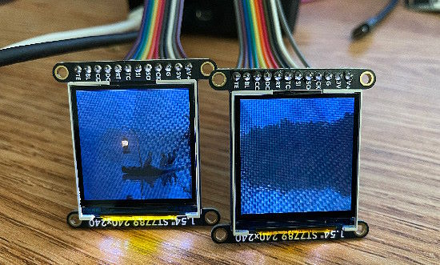](https://www.circuitpython.org/)

This week I continued working on updating Pi_Eyes. I now have it resizing and displaying the desktop successfully on the displays. However, it is running very slow with the biggest delay being in the SPI transfer. Next up will be figuring that issue out so the display updates happen in real time.

**Tim**

text.

**Jeff**

I fixed some bugs in CircuitPython 9, including improving a situation where having an SD card and a display that share an SPI bus caused problems accessing the SD card through the web workflow.

A second bug I fixed was how "timeout" errors were signaled for SSL sockets. There was a long-standing bug on the Pico W, which began affecting the Espressif-family microcontrollers after another change I made to share the SSL code between the processor families.

I have some other long term items that are cooking but those are on hold while we work on getting version 9 stable and ready for wide use.

**Scott**

This week I've done three more fixes for CircuitPython 9.0.0 and have run out of things to debug. So, 9.0.0 is close and I'll keep an eye out for subsequent issues to fix. Thanks to everyone who has tested it and filed issues!

**Liz**

This week I wrote up two guides. The first was the [OpenAI Image Descriptors with MEMENTO project](https://learn.adafruit.com/openai-image-descriptors-with-memento). The CircuitPython code lets you connect to WiFi, take a photo, send the photo to OpenAI with their API and then save the response as a text file. I included six different prompts to get folks started. This was really fun to work on. I loved coming up with the prompts and figuring out how to add different text to the MEMENTO display with the PyCamera library and review images on the microSD card.

The second guide was for the [Adafruit STEMMA Analog SPDT Switch](https://learn.adafruit.com/adafruit-stemma-analog-spdt-switch). This was just added to the shop and lets you switch between two analog signals. For the demo, I switched between two waveforms generated by one of my synth modules (Pamela's New Workout for those who are into Eurorack). It was really cool to be able to see the waveforms switch in the Serial Plotter as the input pin was toggled.

One special thing that happened this week was that I went on [JP's Product Pick of the Week show](https://youtu.be/MsXNsj2iqQo). The product pick was the [3.5" TFT FeatherWing with Capacitive Touch](https://www.adafruit.com/product/5872). I helped to demo the multi-touch functionality for the display with CircuitPython. The code has four touchscreen buttons that can detect if they contain the touch point. I added the demo to the [examples for the FT5336 touch library](https://github.com/adafruit/Adafruit_CircuitPython_FT5336/blob/main/examples/buttons_example.py) since I think it could be helpful for folks who want to make projects with UI elements.

## Upcoming Events

The next MicroPython Meetup in Melbourne will be on March 27th – [Meetup](https://www.meetup.com/micropython-meetup/events). 

PyCascades 2024 is back in Seattle, Washington, USA and online, April 5-8th at the University of Washington, Kane Hall - [PyCascades](https://2024.pycascades.com/).

The 2024 Open Hardware Summit will be taking place May 3 & 4, 2024 at Concordia University and lespacemaker in Montreal, Canada - [oshwa.org](https://2024.oshwa.org/).

PyCon US 2024 launches May 15-23, 2024 in Pittsburgh, Pennsylvania US - [PyCon US](https://pycon.blogspot.com/2024/10/pycon-us-2024-launches.html).

Open Sauce, the Maker extravaganza, is returning to San Francisco, California June 15-16 - [Open Sauce](https://opensauce.live/).

EuroPython is the oldest and longest running volunteer-led Python programming conference on the planet. This year it will be held July 8-14 in Prague. Call for Proposals, the Mentorship Programme, and the Financial Aid Programme will be starting this month - [EuroPython 2024](https://ep2024.europython.eu/).

**Send Your Events In**

If you know of virtual events or upcoming events, please let us know via email to cpnews(at)adafruit(dot)com.

## Latest Releases

CircuitPython's stable release is [8.2.10](https://github.com/adafruit/circuitpython/releases/latest) and its unstable release is [9.0.0.rc.0](https://github.com/adafruit/circuitpython/releases). New to CircuitPython? Start with our [Welcome to CircuitPython Guide](https://learn.adafruit.com/welcome-to-circuitpython).

[20240307](https://github.com/adafruit/Adafruit_CircuitPython_Bundle/releases/latest) is the latest Adafruit CircuitPython library bundle.

[20240221](https://github.com/adafruit/CircuitPython_Community_Bundle/releases/latest) is the latest CircuitPython Community library bundle.

[v1.22.2](https://micropython.org/download) is the latest MicroPython release. Documentation for it is [here](http://docs.micropython.org/en/latest/pyboard/).

[3.12.2](https://www.python.org/downloads/) is the latest Python release. The latest pre-release version is [3.13.0a4](https://www.python.org/download/pre-releases/).

[3,834 Stars](https://github.com/adafruit/circuitpython/stargazers) Like CircuitPython? [Star it on GitHub!](https://github.com/adafruit/circuitpython)

## Call for Help -- Translating CircuitPython is now easier than ever

One important feature of CircuitPython is translated control and error messages. With the help of fellow open source project [Weblate](https://weblate.org/), we're making it even easier to add or improve translations. 

Sign in with an existing account such as GitHub, Google or Facebook and start contributing through a simple web interface. No forks or pull requests needed! As always, if you run into trouble join us on [Discord](https://adafru.it/discord), we're here to help.

## 38,855 Thanks

The Adafruit Discord community, where we do all our CircuitPython development in the open, reached over 38,855 humans - thank you! Adafruit believes Discord offers a unique way for Python on hardware folks to connect. Join today at [https://adafru.it/discord](https://adafru.it/discord).

## ICYMI - In case you missed it

Python on hardware is the Adafruit Python video-newsletter-podcast! The news comes from the Python community, Discord, Adafruit communities and more and is broadcast on ASK an ENGINEER Wednesdays. The complete Python on Hardware weekly videocast [playlist is here](https://www.youtube.com/playlist?list=PLjF7R1fz_OOXRMjM7Sm0J2Xt6H81TdDev). The video podcast is on [iTunes](https://itunes.apple.com/us/podcast/python-on-hardware/id1451685192?mt=2), [YouTube](http://adafru.it/pohepisodes), [Instagram Reels](https://www.instagram.com/adafruit/channel/)), and [XML](https://itunes.apple.com/us/podcast/python-on-hardware/id1451685192?mt=2).

[The weekly community chat on Adafruit Discord server CircuitPython channel - Audio / Podcast edition](https://itunes.apple.com/us/podcast/circuitpython-weekly-meeting/id1451685016) - Audio from the Discord chat space for CircuitPython, meetings are usually Mondays at 2pm ET, this is the audio version on [iTunes](https://itunes.apple.com/us/podcast/circuitpython-weekly-meeting/id1451685016), Pocket Casts, [Spotify](https://adafru.it/spotify), and [XML feed](https://adafruit-podcasts.s3.amazonaws.com/circuitpython_weekly_meeting/audio-podcast.xml).

## Contribute

The CircuitPython Weekly Newsletter is a CircuitPython community-run newsletter emailed every Monday. The complete [archives are here](https://www.adafruitdaily.com/category/circuitpython/). It highlights the latest CircuitPython related news from around the web including Python and MicroPython developments. To contribute, edit next week's draft [on GitHub](https://github.com/adafruit/circuitpython-weekly-newsletter/tree/gh-pages/_drafts) and [submit a pull request](https://help.github.com/articles/editing-files-in-your-repository/) with the changes. You may also tag your information on Twitter with #CircuitPython. 

Join the Adafruit [Discord](https://adafru.it/discord) or [post to the forum](https://forums.adafruit.com/viewforum.php?f=60) if you have questions.
