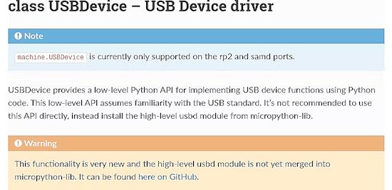
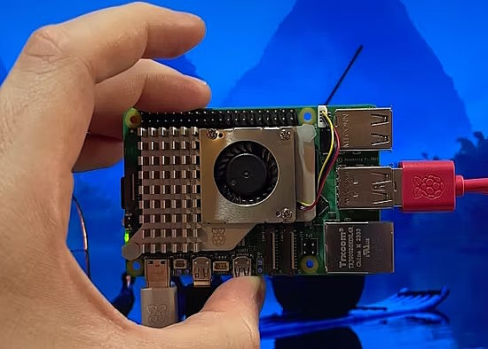
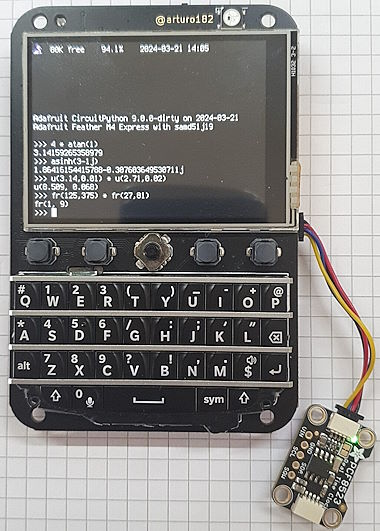
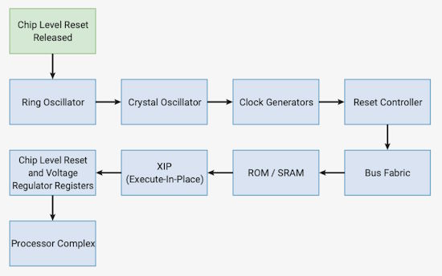
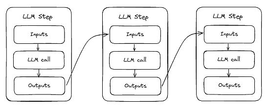
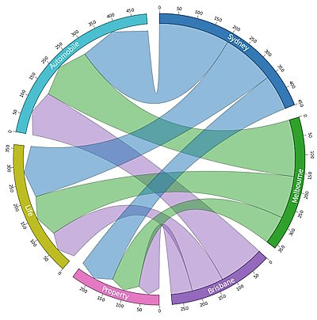
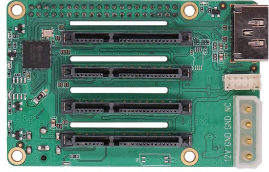
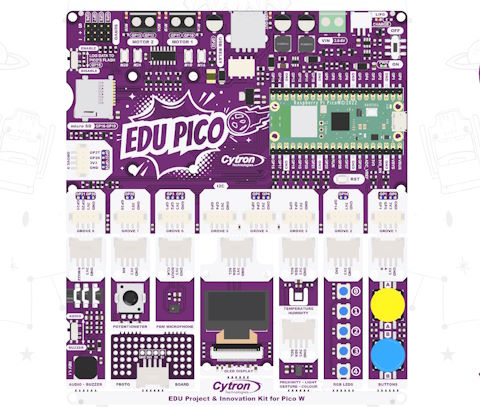
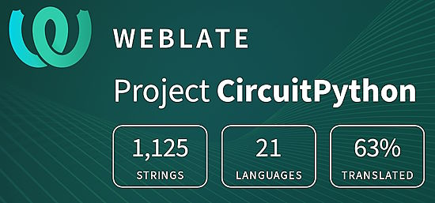

- [ ] Library and info updates
- [ ] change date
- [ ] update title
- [ ] Feature story
- [ ] Update  for images
- [ ] Update ICYDNCI
- [ ] All images 550w max only
- [ ] Link "View this email in your browser."

News Sources

- [Adafruit Playground](https://adafruit-playground.com/)
- Twitter: [CircuitPython](https://twitter.com/search?q=circuitpython&src=typed_query&f=live), [MicroPython](https://twitter.com/search?q=micropython&src=typed_query&f=live) and [Python](https://twitter.com/search?q=python&src=typed_query)
- [Raspberry Pi News](https://www.raspberrypi.com/news/)
- Mastodon [CircuitPython](https://octodon.social/tags/CircuitPython) and [MicroPython](https://octodon.social/tags/MicroPython)
- [hackster.io CircuitPython](https://www.hackster.io/search?q=circuitpython&i=projects&sort_by=most_recent) and [MicroPython](https://www.hackster.io/search?q=micropython&i=projects&sort_by=most_recent)
- [python.org](https://www.python.org/)
- [Python Insider - dev team blog](https://pythoninsider.blogspot.com/)
- Individuals: [Jeff Geerling](https://www.jeffgeerling.com/blog)
- [hackaday CircuitPython](https://hackaday.com/blog/?s=circuitpython) and [MicroPython](https://hackaday.com/blog/?s=micropython)
- [hackaday.io newest projects MicroPython](https://hackaday.io/projects?tag=micropython&sort=date) and [CircuitPython](https://hackaday.io/projects?tag=circuitpython&sort=date)
- [Google News Python](https://news.google.com/topics/CAAqIQgKIhtDQkFTRGdvSUwyMHZNRFY2TVY4U0FtVnVLQUFQAQ?hl=en-US&gl=US&ceid=US%3Aen)
- Check Issues and PRs for input

View this email in your browser. **Warning: Flashing Imagery**

Welcome to the latest Python on Microcontrollers newsletter! *insert 2-3 sentences from editor (what's in overview, banter)* - *Anne Barela, Ed.*

We're on [Discord](https://discord.gg/HYqvREz), [Twitter](https://twitter.com/search?q=circuitpython&src=typed_query&f=live), and for past newsletters - [view them all here](https://www.adafruitdaily.com/category/circuitpython/). If you're reading this on the web, [subscribe here](https://www.adafruitdaily.com/). Here's the news this week:

## CircuitPython 9.0.0 Released

CircuitPython 9.0.0, the latest major revision of CircuitPython, is the new stable release. Check out all the new features - [Adafruit Blog](https://blog.adafruit.com/2024/03/18/circuitpython-9-0-0-released/l), [Release Notes](https://github.com/adafruit/circuitpython/releases/tag/9.0.0) and [Tom's Hardware](https://www.tomshardware.com/raspberry-pi/raspberry-pi-pico/adafruit-announces-the-latest-circuitpython-release-for-raspberry-pi-pico-and-other-microcontrollers).

## Feature

text - [site](url).

## MicroPython Plans a New Feature for the Raspberry Pi RP2040: Runtime-Defined USB Device Support

MicroPython is planing a new feature for the Raspberry Pi RP2040: runtime-defined USB device support, expected to land in the v1.23 release - [hackster.io](https://www.hackster.io/news/micropython-plans-a-new-feature-for-the-raspberry-pi-rp2040-runtime-defined-usb-device-support-0ca275e4ba07) and [Documentation](https://docs.micropython.org/en/latest/library/machine.USBDevice.html#class-usbdevice-usb-device-driver).

## My Raspberry Pi 5 is a Delight, and I'm Excited About All Its Future Uses

The Raspberry Pi 5 has plenty of upgrades, but does one need all that extra horsepower? It's to the test - [Pocket-lint](https://www.pocket-lint.com/raspberry-pi-5-review/).

## The 4 Best Programming Languages to Learn

The 4 best programming languages to learn - [Fortune](https://fortune.com/education/articles/best-programming-languages-to-learn/).

> "According to the U.S. Bureau of Labor Statistics, software developers earned a median annual wage exceeding $127,000 in 2022 and is projected to rise by 25% by 2032. The top four languages are: JavaScript, Python, SQL and Java."

## Feature

text - [site](url).

## This Week's Python Streams

Python on Hardware is all about building a cooperative ecosphere which allows contributions to be valued and to grow knowledge. Below are the streams within the last week focusing on the community.

**CircuitPython Deep Dive Stream**

[Last Friday](link), Scott streamed work on {subject}.

You can see the latest video and past videos on the Adafruit YouTube channel under the Deep Dive playlist - [YouTube](https://www.youtube.com/playlist?list=PLjF7R1fz_OOXBHlu9msoXq2jQN4JpCk8A).

**CircuitPython Parsec**

John Park’s CircuitPython Parsec this week is on {subject} - [Adafruit Blog](link) and [YouTube](link).

Catch all the episodes in the [YouTube playlist](https://www.youtube.com/playlist?list=PLjF7R1fz_OOWFqZfqW9jlvQSIUmwn9lWr).

**CircuitPython Weekly Meeting**

CircuitPython Weekly Meeting for March 18, 2024 ([notes](https://github.com/adafruit/adafruit-circuitpython-weekly-meeting/blob/main/2024/2024-03-18.md)) [on YouTube](https://www.youtube.com/watch?v=cKWX92YQOks).

## Project of the Week

text - [site](url).

## Popular Last Week

What was the most popular, most clicked link, in [last week's newsletter](newslink)? [title](url).

## New Notes from Adafruit Playground

[Adafruit Playground](https://adafruit-playground.com/) is a new place for the community to post their projects and other making tips/tricks/techniques. Ad-free, it's an easy way to publish your work in a safe space for free.

Building a scientific handheld calculator with double precision math, complex math, uncertainties and fractions - [Adafruit Playground](https://adafruit-playground.com/u/hmilz/pages/building-a-scientific-handheld-calculator-with-double-precision-math-complex-math-uncertainties-and-fractions).

text - [Adafruit Playground](url).

text - [Adafruit Playground](url).

## News From Around the Web

The RP2040 boot sequence - [V. Hunter Adams](https://vanhunteradams.com/Pico/Bootloader/Boot_sequence.html).

uc8151_micropython: a MicroPython driver for the Badger 2040 eink display and other displays based on the UC8151 / IL0373 chip with up to 32 levels of grey - [GitHub](https://github.com/antirez/uc8151_micropython) via [X](https://twitter.com/antirez/status/1770465055009645008?t=GidTWjV9Mjd0F375beFOJA&s=03).

text - [site](url).

text - [site](url).

text - [site](url).

text - [site](url).

text - [site](url).

text - [site](url).

text - [site](url).

text - [site](url).

text - [site](url).

text - [site](url).

text - [site](url).

text - [site](url).

text - [site](url).

deptry: a command line tool to check for issues with dependencies in a Python project, such as unused or missing dependencies - [GitHub](https://github.com/fpgmaas/deptry).

A better Python cache for slow function calls - [Sweep AI](https://docs.sweep.dev/blogs/file-cache).

Probably the best data visualisation for showing many-to-many proportion in Python - [Towards Data Science](https://towardsdatascience.com/probably-the-best-data-visualisation-for-showing-many-to-many-proportion-in-python-40bdd24365d5).

## Coming Soon / New

Radxa introduces a Raspberry Pi 5 quad SATA hat adapter - [Radxa](https://radxa.com/products/accessories/penta-sata-hat/).

EDU PICO project and innovation kit for Pico W with Grove connections programmable in CircuitPython - [Cytron](https://www.cytron.io/p-edu-project-and-innovation-kits-for-pico-w) and [Tom's Hardware](https://www.tomshardware.com/raspberry-pi/raspberry-pi-pico/cytron-releases-edu-pico-an-educational-innovation-project-kit-for-makers-and-learners).

## New Boards Supported by CircuitPython

The number of supported microcontrollers and Single Board Computers (SBC) grows every week. This section outlines which boards have been included in CircuitPython or added to [CircuitPython.org](https://circuitpython.org/).

This week, there were (#/no) new boards added:

- [Board name](url)
- [Board name](url)
- [Board name](url)

*Note: For non-Adafruit boards, please use the support forums of the board manufacturer for assistance, as Adafruit does not have the hardware to assist in troubleshooting.*

Looking to add a new board to CircuitPython? It's highly encouraged! Adafruit has four guides to help you do so:

- [How to Add a New Board to CircuitPython](https://learn.adafruit.com/how-to-add-a-new-board-to-circuitpython/overview)
- [How to add a New Board to the circuitpython.org website](https://learn.adafruit.com/how-to-add-a-new-board-to-the-circuitpython-org-website)
- [Adding a Single Board Computer to PlatformDetect for Blinka](https://learn.adafruit.com/adding-a-single-board-computer-to-platformdetect-for-blinka)
- [Adding a Single Board Computer to Blinka](https://learn.adafruit.com/adding-a-single-board-computer-to-blinka)

## New Learn Guides

[IoT Bird Feeder with Camera](https://learn.adafruit.com/iot-window-bird-feeder-with-camera) from [Ruiz Brothers](https://learn.adafruit.com/u/pixil3d)

[AdaBox 021](https://learn.adafruit.com/adabox021) from [John Park](https://learn.adafruit.com/u/johnpark)

[MEMENTO Camera Quick Start Guide](https://learn.adafruit.com/memento-camera-quick-start-guide) from [Anne Barela](https://learn.adafruit.com/u/AnneBarela)

## Updated Learn Guides

[title](url) from [name](url)

## CircuitPython Libraries

The CircuitPython library numbers are continually increasing, while existing ones continue to be updated. Here we provide library numbers and updates!

To get the latest Adafruit libraries, download the [Adafruit CircuitPython Library Bundle](https://circuitpython.org/libraries). To get the latest community contributed libraries, download the [CircuitPython Community Bundle](https://circuitpython.org/libraries).

If you'd like to contribute to the CircuitPython project on the Python side of things, the libraries are a great place to start. Check out the [CircuitPython.org Contributing page](https://circuitpython.org/contributing). If you're interested in reviewing, check out Open Pull Requests. If you'd like to contribute code or documentation, check out Open Issues. We have a guide on [contributing to CircuitPython with Git and GitHub](https://learn.adafruit.com/contribute-to-circuitpython-with-git-and-github), and you can find us in the #help-with-circuitpython and #circuitpython-dev channels on the [Adafruit Discord](https://adafru.it/discord).

You can check out this [list of all the Adafruit CircuitPython libraries and drivers available](https://github.com/adafruit/Adafruit_CircuitPython_Bundle/blob/master/circuitpython_library_list.md). 

The current number of CircuitPython libraries is **###**!

**New Libraries**

Here's this week's new CircuitPython libraries:

* [library](url)

**Updated Libraries**

Here's this week's updated CircuitPython libraries:

* [library](url)

**Library PyPI Weekly Download Stats**

## What’s the CircuitPython team up to this week?

What is the team up to this week? Let’s check in:

**Dan**

I made the release for CircuitPython 9.0.0 final last Monday! Users are beginning to switch over. A few have noted some regressions and we are working on those.

We are also moving ahead on changes for 9.1 and later. I did a simple housekeeping task of renaming `ports/nrf` to `ports/nordic`. Most of the port names are different from what MicroPython uses, but we both used `ports/nrf`. Changing the name will make merges from upstream easier.

**Melissa**

text.

**Tim**

This week I cleaned up and submitted the PR for `OutlinedLabel` class to the `Display Text` library. This new class allows you to make labels with specified color and size of stroke outline. I've also been writing new examples for the `adafruit_rsa` library that saves and loads keys from files rather than generating new ones each time the script is run. Lastly I've been experimenting with the ruff code format and linting tool in some local instances of library repos. We are considering migrating the libraries to use this tool instead of pylint and black. MicroPython has already adopted it's usage as well so it will be a step toward closer consistency in the ecosystem.

**Scott**

This week I've entered a post-release phase because 9.0.0 has been released! Generally my work on the release stops a little beforehand as we wait to see if any issues pop up. Since then I've continued to poke a Hancho based CP build, started adding USB host FeatherWing support to CP and updating the ESP-IDF to 5.2.1. The latter two things will likely be released in 9.1.0. 

**Liz**

This week I worked on some product guides for the new PiCowbells in the shop. These PiCowbells make it easier to prototype with the Pico boards. There's one with [terminal blocks](https://learn.adafruit.com/adafruit-terminal-picowbell-for-pico) and two that are similar to the Proto FeatherWings with [single](https://learn.adafruit.com/adafruit-proto-under-plate-picowbell) and [doubler](https://learn.adafruit.com/adafruit-proto-doubler-picowbell) options. Whenever I work on projects, I try to choose components that make wiring and assembly simple for folks, so having these options with mounting holes, GPIO labels, STEMMA QT connectors and reset buttons available is great.

## Upcoming Events

The next MicroPython Meetup in Melbourne will be on March 27th – [Meetup](https://www.meetup.com/micropython-meetup/events). 

PyCascades 2024 is back in Seattle, Washington, USA and online, April 5-8th at the University of Washington, Kane Hall - [PyCascades](https://2024.pycascades.com/).

The 2024 Open Hardware Summit will be taking place May 3 & 4, 2024 at Concordia University and lespacemaker in Montreal, Canada - [oshwa.org](https://2024.oshwa.org/).

PyCon US 2024 launches May 15-23, 2024 in Pittsburgh, Pennsylvania US - [PyCon US](https://pycon.blogspot.com/2024/10/pycon-us-2024-launches.html).

Open Sauce, the Maker extravaganza, is returning to San Francisco, California June 15-16 - [Open Sauce](https://opensauce.live/).

EuroPython is the oldest and longest running volunteer-led Python programming conference on the planet. This year it will be held July 8-14 in Prague. Call for Proposals, the Mentorship Programme, and the Financial Aid Programme will be starting this month - [EuroPython 2024](https://ep2024.europython.eu/).

**Send Your Events In**

If you know of virtual events or upcoming events, please let us know via email to cpnews(at)adafruit(dot)com.

## Latest Releases

CircuitPython's stable release is [#.#.#](https://github.com/adafruit/circuitpython/releases/latest) and its unstable release is [#.#.#-##.#](https://github.com/adafruit/circuitpython/releases). New to CircuitPython? Start with our [Welcome to CircuitPython Guide](https://learn.adafruit.com/welcome-to-circuitpython).

[2024####](https://github.com/adafruit/Adafruit_CircuitPython_Bundle/releases/latest) is the latest Adafruit CircuitPython library bundle.

[2024####](https://github.com/adafruit/CircuitPython_Community_Bundle/releases/latest) is the latest CircuitPython Community library bundle.

[v#.#.#](https://micropython.org/download) is the latest MicroPython release. Documentation for it is [here](http://docs.micropython.org/en/latest/pyboard/).

[#.#.#](https://www.python.org/downloads/) is the latest Python release. The latest pre-release version is [#.#.#](https://www.python.org/download/pre-releases/).

[#,### Stars](https://github.com/adafruit/circuitpython/stargazers) Like CircuitPython? [Star it on GitHub!](https://github.com/adafruit/circuitpython)

## Call for Help -- Translating CircuitPython is now easier than ever

One important feature of CircuitPython is translated control and error messages. With the help of fellow open source project [Weblate](https://weblate.org/), we're making it even easier to add or improve translations. 

Sign in with an existing account such as GitHub, Google or Facebook and start contributing through a simple web interface. No forks or pull requests needed! As always, if you run into trouble join us on [Discord](https://adafru.it/discord), we're here to help.

## 38,953 Thanks

The Adafruit Discord community, where we do all our CircuitPython development in the open, reached over 38,953 humans - thank you! Adafruit believes Discord offers a unique way for Python on hardware folks to connect. Join today at [https://adafru.it/discord](https://adafru.it/discord).

## ICYMI - In case you missed it

Python on hardware is the Adafruit Python video-newsletter-podcast! The news comes from the Python community, Discord, Adafruit communities and more and is broadcast on ASK an ENGINEER Wednesdays. The complete Python on Hardware weekly videocast [playlist is here](https://www.youtube.com/playlist?list=PLjF7R1fz_OOXRMjM7Sm0J2Xt6H81TdDev). The video podcast is on [iTunes](https://itunes.apple.com/us/podcast/python-on-hardware/id1451685192?mt=2), [YouTube](http://adafru.it/pohepisodes), [Instagram Reels](https://www.instagram.com/adafruit/channel/)), and [XML](https://itunes.apple.com/us/podcast/python-on-hardware/id1451685192?mt=2).

[The weekly community chat on Adafruit Discord server CircuitPython channel - Audio / Podcast edition](https://itunes.apple.com/us/podcast/circuitpython-weekly-meeting/id1451685016) - Audio from the Discord chat space for CircuitPython, meetings are usually Mondays at 2pm ET, this is the audio version on [iTunes](https://itunes.apple.com/us/podcast/circuitpython-weekly-meeting/id1451685016), Pocket Casts, [Spotify](https://adafru.it/spotify), and [XML feed](https://adafruit-podcasts.s3.amazonaws.com/circuitpython_weekly_meeting/audio-podcast.xml).

## Contribute

The CircuitPython Weekly Newsletter is a CircuitPython community-run newsletter emailed every Monday. The complete [archives are here](https://www.adafruitdaily.com/category/circuitpython/). It highlights the latest CircuitPython related news from around the web including Python and MicroPython developments. To contribute, edit next week's draft [on GitHub](https://github.com/adafruit/circuitpython-weekly-newsletter/tree/gh-pages/_drafts) and [submit a pull request](https://help.github.com/articles/editing-files-in-your-repository/) with the changes. You may also tag your information on Twitter with #CircuitPython. 

Join the Adafruit [Discord](https://adafru.it/discord) or [post to the forum](https://forums.adafruit.com/viewforum.php?f=60) if you have questions.
