View this email in your browser. **Warning: Flashing Imagery**

Welcome to the latest Python on Microcontrollers newsletter! We're in the thick of the warm weather Python and Maker events. Which will you be attending? They are great chances to meet your fellow creatives. There is a solid lineup of content in this issue, I hope you find it interesting - *Anne Barela, Ed.*

We're on [Discord](https://discord.gg/HYqvREz), [Twitter](https://twitter.com/search?q=circuitpython&src=typed_query&f=live), and for past newsletters - [view them all here](https://www.adafruitdaily.com/category/circuitpython/). If you're reading this on the web, [subscribe here](https://www.adafruitdaily.com/). Here's the news this week:

## CircuitPython 9.0.3 Released

CircuitPython 9.0.3 is the latest bugfix release of CircuitPython, and is a new stable release. The only changes to 9.0.3 from 9.0.2 are a fix for `AnalogIn` on Nordic nRF boards, and the addition of the Waveshare RP2040-GEEK board - [Adafruit Blog](https://blog.adafruit.com/2024/04/04/circuitpython-9-0-3-released/) and [release notes](https://github.com/adafruit/circuitpython/releases/tag/9.0.3).

## Espressif Chip News

Back in our [January 10, 2023 issue](https://www.adafruitdaily.com/2023/01/10/python-on-microcontrollers-newsletter-micropython-on-lego-controllers-circuitpython-in-2023-survey-and-much-more-circuitpython-python-thepsf-micropython-raspberry_pi/), we discussed the new ESP32-C6 and ESP32-P4. Now the C6 is on the market and Espressif has more P4 news.

[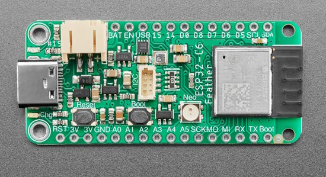](https://www.adafruit.com/product/5933)

Adafruit has announced the Adafruit ESP32-C6 Feather, a C6 development board in the ubiquitous Feather form factor. It integrates 2.4 GHz WiFi 6, Bluetooth 5 (LE) and the 802.15.4 protocol. It brings the goodness you know from the low-cost C3 series and improves it with Zigbee/802.15.4 at 2.4Ghz. It could make for great Matter development hardware! There is also a BME280 temperature and humidity sensor to make an integrated sensor node - [Adafruit](https://www.adafruit.com/product/5933).

A new video just released by Espressif: "Unveiling ESP32-P4: High-performing SoC with extensive IO connectivity, HMI, and security features" - [YouTube](https://www.youtube.com/watch?v=GTHHDZeIzcA) and [Product Page](https://www.espressif.com/en/products/socs/esp32-p4).

## WiFi Power Management for the Raspberry Pi Pico W

[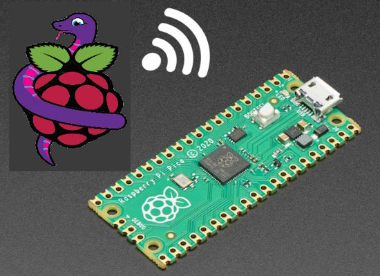](https://adafruit-playground.com/u/blakebr/pages/wifi-power-management-for-the-raspberry-pi-pico-w)

On the Adafruit Playground, user blakebr discusses the CircuitPython cyw43 libarry, used with the WiFi moodule on the Raspberry Pi Pico. Code samples show adjusting to various power options - [Adafruit Playground](https://adafruit-playground.com/u/blakebr/pages/wifi-power-management-for-the-raspberry-pi-pico-w).

## Comparing the Three Main Zero Form Factor SBC's in the Market Right Now

[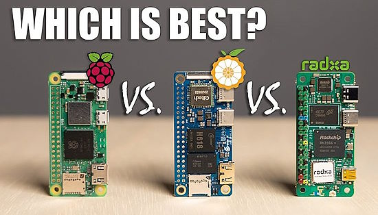](https://www.youtube.com/watch?v=Fyet0-L1IWI)

Comparing the three main Raspberry Pi Zero form factor single board computers (SBC) in the market right now: Raspberry Pi Zero 2W, Orange Pi Zero 2W, and Radxa Zero 3W - [YouTube](https://www.youtube.com/watch?v=Fyet0-L1IWI).

## Python Software Foundation News in Brief

PSJ joins the new Open Initiative for Cybersecurity Standards - [PSF](https://pyfound.blogspot.com/2024/04/new-open-initiative-for-cybersecurity.html).

April 2024 Newsletter including PyCon 2024 information and more - [PSF News](https://mailchi.mp/python/python-software-foundation-december-2023-newsletter-15957293).

Reporting PyPI Malware - [PyPI Blog](https://blog.pypi.org/posts/2024-03-06-malware-reporting-evolved/).

## The Ultimate Raspberry Pi 5 NAS (Perhaps)

[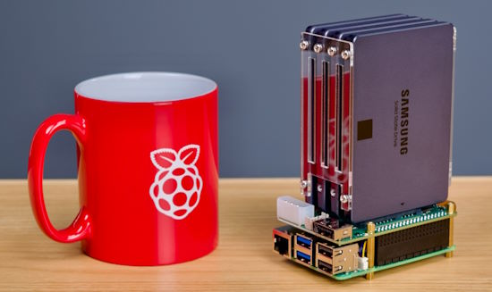](https://www.jeffgeerling.com/blog/2024/radxas-sata-hat-makes-compact-pi-5-nas)

Hooking a Raspberry Pi 5 to Radxa's latest iteration of its Penta SATA HAT. Is the Pi 5 noticeably faster than the Pi 4 for NAS applications? Yes - [Jeff Geerling](https://www.jeffgeerling.com/blog/2024/radxas-sata-hat-makes-compact-pi-5-nas) and [YouTube](https://www.youtube.com/watch?v=l30sADfDiM8).

## This Week's Python Streams

Python on Hardware is all about building a cooperative ecosphere which allows contributions to be valued and to grow knowledge. Below are the streams within the last week focusing on the community.

**CircuitPython Deep Dive Stream**

[Last Friday](https://www.youtube.com/watch?v=epbn0SlKDNQ), Scott streamed work on USB Host Featherwing + PyCascades practice.

You can see the latest video and past videos on the Adafruit YouTube channel under the Deep Dive playlist - [YouTube](https://www.youtube.com/playlist?list=PLjF7R1fz_OOXBHlu9msoXq2jQN4JpCk8A).

**CircuitPython Parsec**

John Park’s CircuitPython Parsec was off last week. Catch all the episodes in the [YouTube playlist](https://www.youtube.com/playlist?list=PLjF7R1fz_OOWFqZfqW9jlvQSIUmwn9lWr).

**CircuitPython Weekly Meeting**

CircuitPython Weekly Meeting for April 1 ([notes](https://github.com/adafruit/adafruit-circuitpython-weekly-meeting/blob/main/2024/2024-04-01.md)) [on YouTube](https://youtu.be/fbg2qtGjxC8).

## Project of the Week: The `bitmapfilter` Library

There’s a neat new core library in CircuitPython by Tod Kurt: `bitmapfilter`. Originally designed for the PyCamera project, it’s got many useful operations for generative art. A demonstration: random circles bluring away. Note: it does require a fast processor like the ESP32-S3 - [Mastodon](https://mastodon.social/@todbot/112197138537048342).

## Popular Last Week

[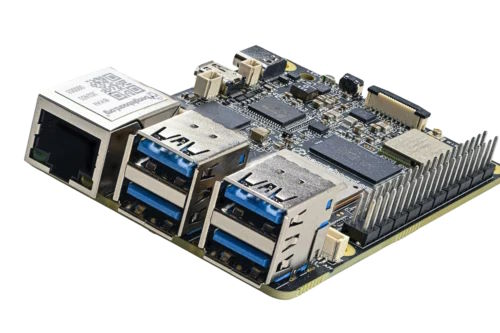](https://www.beagleboard.org/boards/beagley-ai)

What was the most popular, most clicked link, in [last week's newsletter](newslink)? [BeagleBoard.Org Delivers the BeagleY-AI](https://www.beagleboard.org/boards/beagley-ai).

## New Notes from Adafruit Playground

[Adafruit Playground](https://adafruit-playground.com/) is a new place for the community to post their projects and other making tips/tricks/techniques. Ad-free, it's an easy way to publish your work in a safe space for free.

[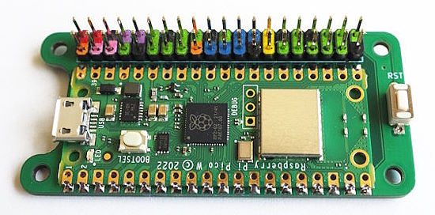](https://adafruit-playground.com/u/picofun/pages/running-pi-hats-with-a-raspberry-pi-pico)

Running Pi-HATs with a Raspberry Pi Pico - [Adafruit Playground](https://adafruit-playground.com/u/picofun/pages/running-pi-hats-with-a-raspberry-pi-pico).

[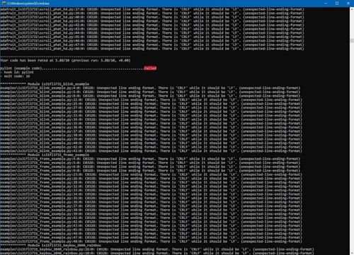](https://adafruit-playground.com/u/DJDevon3/pages/github-desktop-crlf-to-lf-powershell-fix)

Github Desktop CRLF to LF PowerShell Fix - [Adafruit Playground](https://adafruit-playground.com/u/DJDevon3/pages/github-desktop-crlf-to-lf-powershell-fix).

[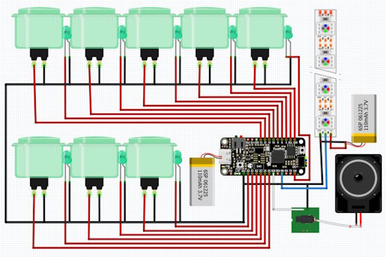](https://adafruit-playground.com/u/nickcramer/pages/hiking-masterpiece)

A Hiking Masterpiece with Feather and CircuitPython - [Adafruit Playground](https://adafruit-playground.com/u/nickcramer/pages/hiking-masterpiece).

## News From Around the Web

[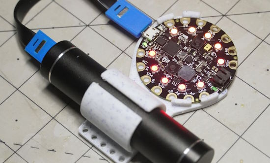](https://embeddedcomputing.com/technology/open-source/development-kits/circuit-playground-express-for-education-pros-too)

Circuit Playground Express: For Education, Pros Too? - [Embedded Computing](https://embeddedcomputing.com/technology/open-source/development-kits/circuit-playground-express-for-education-pros-too).

[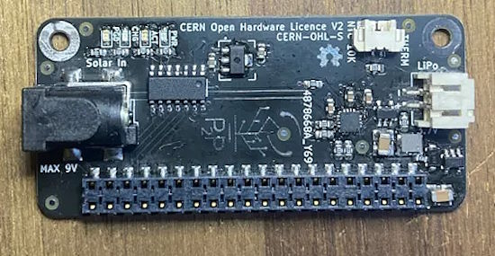](https://hackaday.com/2024/04/02/photonpower-zero-for-effortless-solar-pi-zero-projects/)

PhotonPower Zero lets you power a Pi Zero board from a solar cell, with a LiIon backup, and a microcontroller for power management - [Hackaday](https://hackaday.com/2024/04/02/photonpower-zero-for-effortless-solar-pi-zero-projects/), [GitHub](https://github.com/DavidMurrayP2P/PhotonPowerZero) and [YouTube](https://youtu.be/qGwqMnN81YI).

[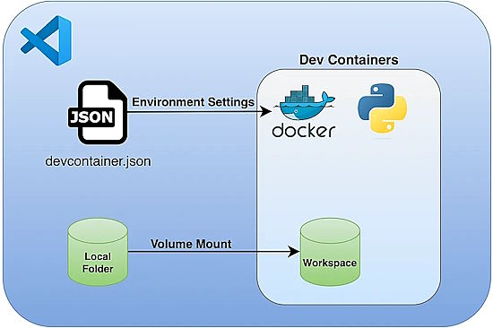](https://towardsdatascience.com/setting-a-dockerized-python-environment-the-elegant-way-f716ef85571d)

Setting A Dockerized Python Environment — The Elegant Way - [Medium](https://towardsdatascience.com/setting-a-dockerized-python-environment-the-elegant-way-f716ef85571d).

[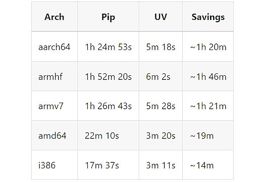](https://developers.home-assistant.io/blog/2024/04/03/build-images-with-uv/)

How `uv` saves Home Assistant 215 compute hours per month over `pip` - [Home Assistant Developers](https://developers.home-assistant.io/blog/2024/04/03/build-images-with-uv/).

[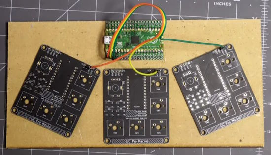](https://hackaday.com/2024/03/31/give-your-pi-pico-captouch-inputs-for-all-your-music-needs/)

Give your Pi Pico captouch inputs for all your music needs - [Hackaday](https://hackaday.com/2024/03/31/give-your-pi-pico-captouch-inputs-for-all-your-music-needs/).

[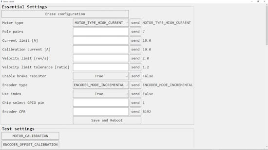](https://www.youtube.com/watch?v=gpxsxDQMijU)

A customizable GUI in Python for ODrive V3.6 and other compatible boards - [YouTube](https://www.youtube.com/watch?v=gpxsxDQMijU).

[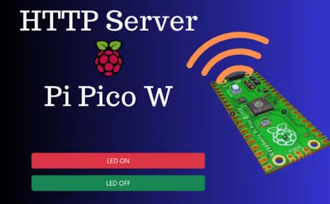](https://www.hackster.io/rajivcodelab/how-to-build-your-own-web-server-on-raspberry-pi-pico-w-65ce5d)

Build Your Own Web Server on Raspberry Pi Pico W with MicroPython - [hackster.io](https://www.hackster.io/rajivcodelab/how-to-build-your-own-web-server-on-raspberry-pi-pico-w-65ce5d).

[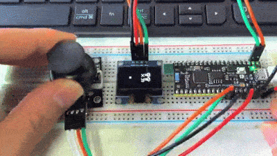](https://twitter.com/sinovoip/status/1773898643759886672)

BPI-PicoW-S3 OLED real-time animation display of dual-axis joystick position using CircuitPython - [X](https://twitter.com/sinovoip/status/1773898643759886672).

Flashing MicroPython firmware on a Seeed Studio Xiao ESP32-C3 - [hackster.io](https://www.hackster.io/fusion_automate/flash-micropython-firmware-in-seed-studio-xiao-esp32c3-80ed84).

[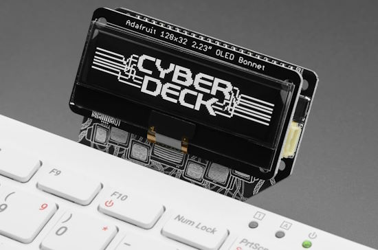](https://www.raspberrypi.com/news/hats-and-bonnets-to-give-your-raspberry-pi-400-a-cyberdeck-feel/)

HATs and bonnets to give your Raspberry Pi 400 a cyberdeck feel - [Raspberry Pi News](https://www.raspberrypi.com/news/hats-and-bonnets-to-give-your-raspberry-pi-400-a-cyberdeck-feel/).

[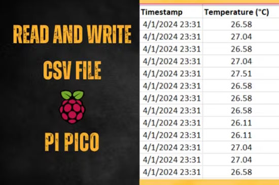](https://www.hackster.io/rajivcodelab/csv-data-logger-read-and-write-csv-files-with-pi-pico-w-1f14d7)

CSV Data Logger: Read and Write CSV Files with Pi Pico W and MicroPython - [Hackster.io](https://www.hackster.io/rajivcodelab/csv-data-logger-read-and-write-csv-files-with-pi-pico-w-1f14d7).

[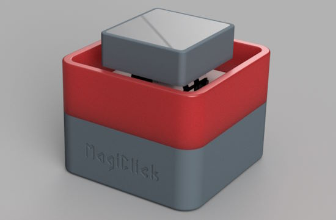](https://hackaday.io/project/195460-magiclick-s3-single)

MagiClick S3, a single button keyboard using CircuitPythgon - [Hackaday.io](https://hackaday.io/project/195460-magiclick-s3-single).

The best Python programming books to read in 2024 - [Marktechpost](https://www.marktechpost.com/2024/04/02/top-python-programming-books-to-read-in-2024/).

[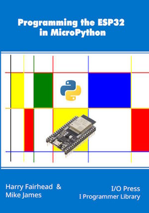](https://www.i-programmer.info/programming/148-hardware/17088-esp32-in-micropython-interrupts.html?start=2)

ESP32 In MicroPython: Interrupts - [I Programmer](https://www.i-programmer.info/programming/148-hardware/17088-esp32-in-micropython-interrupts.html?start=2).

The top ten Python libraries for Machine Learning and Deep Learning in 2024 - [Marktechpost](https://www.marktechpost.com/2024/03/30/top-ten-python-libraries-for-machine-learning-and-deep-learning-in-2024/).

## New

[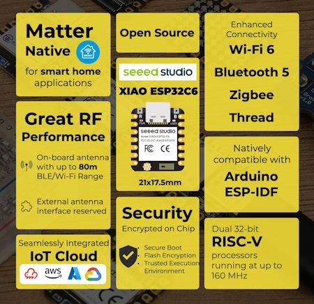](https://twitter.com/make/status/1773825403108434049)

Make posts about a new C6 board - [X](https://twitter.com/make/status/1773825403108434049).

> "We got our hands on Seeed Studio's new Xiao ESP32-C6 just in time for a weekend full of SmartHome maker projects! For just over $5 you get dual 32-bit RISC-V, WiFi 6, BLE, and IEEE 802.15.4 (Thread/Zigbee), plus Matter compliance and a BLE/WiFi range of up to 80m!"

[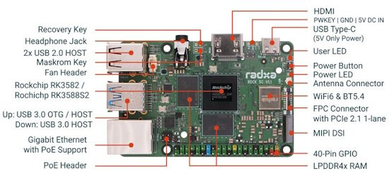](https://www.notebookcheck.net/Radxa-releases-Rock-5C-and-Rock-5C-Lite-to-take-on-Raspberry-Pi-5.822579.0.html)

Radxa releases Rock 5C and Rock 5C Lite to take on Raspberry Pi 5 - [NotebookCheck](https://www.notebookcheck.net/Radxa-releases-Rock-5C-and-Rock-5C-Lite-to-take-on-Raspberry-Pi-5.822579.0.html).

## New Boards Supported by CircuitPython

The number of supported microcontrollers and Single Board Computers (SBC) grows every week. This section outlines which boards have been included in CircuitPython or added to [CircuitPython.org](https://circuitpython.org/).

This week there were two new boards added:

- [Maker Go ESP32C3 Supermini](https://circuitpython.org/board/makergo-esp32c3-supermini/)
- [Quartz64 Model A](https://circuitpython.org/blinka/quartz64_a/) (Blinka)

*Note: For non-Adafruit boards, please use the support forums of the board manufacturer for assistance, as Adafruit does not have the hardware to assist in troubleshooting.*

Looking to add a new board to CircuitPython? It's highly encouraged! Adafruit has four guides to help you do so:

- [How to Add a New Board to CircuitPython](https://learn.adafruit.com/how-to-add-a-new-board-to-circuitpython/overview)
- [How to add a New Board to the circuitpython.org website](https://learn.adafruit.com/how-to-add-a-new-board-to-the-circuitpython-org-website)
- [Adding a Single Board Computer to PlatformDetect for Blinka](https://learn.adafruit.com/adding-a-single-board-computer-to-platformdetect-for-blinka)
- [Adding a Single Board Computer to Blinka](https://learn.adafruit.com/adding-a-single-board-computer-to-blinka)

## New Learn Guides

[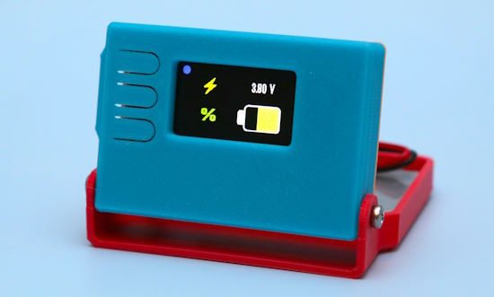](https://learn.adafruit.com/guides/latest)

[IoT Battery Monitor](https://learn.adafruit.com/iot-battery-monitor) from [Ruiz Brothers](https://learn.adafruit.com/u/pixil3d)

## Updated Learn Guides

[Which CircuitPython Board is Right for You?](https://learn.adafruit.com/choose-your-circuitpython-board) from Kattni Rembor and Anne Barela

## CircuitPython Libraries

The CircuitPython library numbers are continually increasing, while existing ones continue to be updated. Here we provide library numbers and updates!

To get the latest Adafruit libraries, download the [Adafruit CircuitPython Library Bundle](https://circuitpython.org/libraries). To get the latest community contributed libraries, download the [CircuitPython Community Bundle](https://circuitpython.org/libraries).

If you'd like to contribute to the CircuitPython project on the Python side of things, the libraries are a great place to start. Check out the [CircuitPython.org Contributing page](https://circuitpython.org/contributing). If you're interested in reviewing, check out Open Pull Requests. If you'd like to contribute code or documentation, check out Open Issues. We have a guide on [contributing to CircuitPython with Git and GitHub](https://learn.adafruit.com/contribute-to-circuitpython-with-git-and-github), and you can find us in the #help-with-circuitpython and #circuitpython-dev channels on the [Adafruit Discord](https://adafru.it/discord).

You can check out this [list of all the Adafruit CircuitPython libraries and drivers available](https://github.com/adafruit/Adafruit_CircuitPython_Bundle/blob/master/circuitpython_library_list.md). 

The current number of CircuitPython libraries is **480**!

**Updated Libraries**

Here's this week's updated CircuitPython libraries:

  * [adafruit/Adafruit_CircuitPython_Requests](https://github.com/adafruit/Adafruit_CircuitPython_Requests)

**Library PyPI Weekly Download Stats**

**Total Library Stats**

  * 136852 PyPI downloads over 325 libraries

**Top 10 Libraries by PyPI Downloads**

  * Adafruit CircuitPython Requests (adafruit-circuitpython-requests): 8193
  * Adafruit CircuitPython BusDevice (adafruit-circuitpython-busdevice): 7664
  * Adafruit CircuitPython ConnectionManager (adafruit-circuitpython-connectionmanager): 6272
  * Adafruit CircuitPython Register (adafruit-circuitpython-register): 2347
  * Adafruit CircuitPython Motor (adafruit-circuitpython-motor): 1288
  * Adafruit CircuitPython MiniMQTT (adafruit-circuitpython-minimqtt): 1223
  * Adafruit CircuitPython Display Text (adafruit-circuitpython-display-text): 1146
  * Adafruit CircuitPython ServoKit (adafruit-circuitpython-servokit): 1106
  * Adafruit CircuitPython ADS1x15 (adafruit-circuitpython-ads1x15): 1042
  * Adafruit CircuitPython NeoPixel (adafruit-circuitpython-neopixel): 1027

## What’s the CircuitPython team up to this week?

What is the team up to this week? Let’s check in:

**Dan**

I released CircuitPython 9.0.3 this past week, to fix a problem with `AnalogIn` on Nordic nRF boards. I'm continuing to work on issues on the 9.x.x issue list.

**Melissa**

This past week, I've been working on updating Learn guides and their associated code. Some that I've updated include the [Magic Storybook with ChatGPT](https://learn.adafruit.com/magic-storybook-with-chatgpt) guide, the [Adafruit DPI Display Kippah](https://learn.adafruit.com/adafruit-dpi-display-kippah-ttl-tft) guide, and the [Adding a Real Time Clock to Raspberry Pi](https://learn.adafruit.com/adding-a-real-time-clock-to-raspberry-pi) guide.

**Jeff**

I made enhancements to `floppyio` and `adafruit_floppy` to make it with better with the upcoming "floppsy" board. These changes are incompatible, so you'll need different code for 9.0.x and older vs the unstable version of CircuitPython.

**Scott**

This week I put together my talk about wirelessly programming CircuitPython for PyCascades 2024. Once done with that, I switched back to working on USB host FeatherWing support. I have it working on nRF and ESP currently. Hopefully I can get SAMD and RP2040 working with it as well.

**Liz**

This past week I worked on a [guide for the new SHT4x Trinkey](https://learn.adafruit.com/adafruit-sht4x-trinkey). This Trinkey form factor board has an SHT41 or SHT45 temperature and humidity sensor onboard. I had a lot of fun with the demos for this one. I wrote up two CPython examples. One logs data from the Trinkey to a .CSV file and the other one logs data to Adafruit IO. I had never used the desktop Python Adafruit IO API but it was really easy to get up and running.

## Upcoming Events

The next MicroPython Meetup in Melbourne will be on April 24th – [Meetup](https://www.meetup.com/micropython-meetup/events). You can see recordings of previous meetings on [YouTube](https://www.youtube.com/@MicroPythonOfficial). 

The 2024 Open Hardware Summit will be taking place May 3 & 4, 2024 at Concordia University and lespacemaker in Montreal, Canada - [oshwa.org](https://2024.oshwa.org/).

PyCon US 2024 launches May 15-23, 2024 in Pittsburgh, Pennsylvania US - [PyCon US](https://pycon.blogspot.com/2024/10/pycon-us-2024-launches.html).

Open Sauce, the Maker extravaganza, is returning to San Francisco, California June 15-16 - [Open Sauce](https://opensauce.live/).

EuroPython is the oldest and longest running volunteer-led Python programming conference on the planet. This year it will be held July 8-14 in Prague. Call for Proposals, the Mentorship Programme, and the Financial Aid Programme will be starting this month - [EuroPython 2024](https://ep2024.europython.eu/).

PyOhio is being held July 27-28, 2024 in Cleveland, Ohio. The organizing team welcomes you to [submit your proposals to the CfP](https://www.pyohio.org/2024/speaking/cfp/) by May 21st - [PyOhio](https://www.pyohio.org/2024/).

**Send Your Events In**

If you know of virtual events or upcoming events, please let us know via email to cpnews(at)adafruit(dot)com.

## Latest Releases

CircuitPython's stable release is [9.0.3](https://github.com/adafruit/circuitpython/releases/latest) and its unstable release is [9.1.0-beta.0](https://github.com/adafruit/circuitpython/releases). New to CircuitPython? Start with our [Welcome to CircuitPython Guide](https://learn.adafruit.com/welcome-to-circuitpython).

[20240402](https://github.com/adafruit/Adafruit_CircuitPython_Bundle/releases/latest) is the latest Adafruit CircuitPython library bundle.

[20240326](https://github.com/adafruit/CircuitPython_Community_Bundle/releases/latest) is the latest CircuitPython Community library bundle.

[v1.22.2](https://micropython.org/download) is the latest MicroPython release. Documentation for it is [here](http://docs.micropython.org/en/latest/pyboard/).

[3.12.2](https://www.python.org/downloads/) is the latest Python release. The latest pre-release version is [3.13.0a5](https://www.python.org/download/pre-releases/).

[3,871 Stars](https://github.com/adafruit/circuitpython/stargazers) Like CircuitPython? [Star it on GitHub!](https://github.com/adafruit/circuitpython)

## Call for Help -- Translating CircuitPython is now easier than ever

[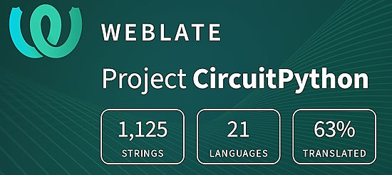](https://hosted.weblate.org/engage/circuitpython/)

One important feature of CircuitPython is translated control and error messages. With the help of fellow open source project [Weblate](https://weblate.org/), we're making it even easier to add or improve translations. 

Sign in with an existing account such as GitHub, Google or Facebook and start contributing through a simple web interface. No forks or pull requests needed! As always, if you run into trouble join us on [Discord](https://adafru.it/discord), we're here to help.

## 39,021 Thanks

The Adafruit Discord community, where we do all our CircuitPython development in the open, reached over 39,021 humans - thank you! Adafruit believes Discord offers a unique way for Python on hardware folks to connect. Join today at [https://adafru.it/discord](https://adafru.it/discord).

## ICYMI - In case you missed it

Python on hardware is the Adafruit Python video-newsletter-podcast! The news comes from the Python community, Discord, Adafruit communities and more and is broadcast on ASK an ENGINEER Wednesdays. The complete Python on Hardware weekly videocast [playlist is here](https://www.youtube.com/playlist?list=PLjF7R1fz_OOXRMjM7Sm0J2Xt6H81TdDev). The video podcast is on [iTunes](https://itunes.apple.com/us/podcast/python-on-hardware/id1451685192?mt=2), [YouTube](http://adafru.it/pohepisodes), [Instagram](https://www.instagram.com/adafruit/channel/)), and [XML](https://itunes.apple.com/us/podcast/python-on-hardware/id1451685192?mt=2).

[The weekly community chat on Adafruit Discord server CircuitPython channel - Audio / Podcast edition](https://itunes.apple.com/us/podcast/circuitpython-weekly-meeting/id1451685016) - Audio from the Discord chat space for CircuitPython, meetings are usually Mondays at 2pm ET, this is the audio version on [iTunes](https://itunes.apple.com/us/podcast/circuitpython-weekly-meeting/id1451685016), Pocket Casts, [Spotify](https://adafru.it/spotify), and [XML feed](https://adafruit-podcasts.s3.amazonaws.com/circuitpython_weekly_meeting/audio-podcast.xml).

## Contribute

The CircuitPython Weekly Newsletter is a CircuitPython community-run newsletter emailed every Monday. The complete [archives are here](https://www.adafruitdaily.com/category/circuitpython/). It highlights the latest CircuitPython related news from around the web including Python and MicroPython developments. To contribute, edit next week's draft [on GitHub](https://github.com/adafruit/circuitpython-weekly-newsletter/tree/gh-pages/_drafts) and [submit a pull request](https://help.github.com/articles/editing-files-in-your-repository/) with the changes. You may also tag your information on Twitter with #CircuitPython. 

Join the Adafruit [Discord](https://adafru.it/discord) or [post to the forum](https://forums.adafruit.com/viewforum.php?f=60) if you have questions.
