- [ ] Library and info updates
- [ ] change date
- [ ] update title
- [ ] Feature story
- [ ] Update  for images
- [ ] Update ICYDNCI
- [ ] All images 550w max only
- [ ] Link "View this email in your browser."

News Sources

- [Adafruit Playground](https://adafruit-playground.com/)
- Twitter: [CircuitPython](https://twitter.com/search?q=circuitpython&src=typed_query&f=live), [MicroPython](https://twitter.com/search?q=micropython&src=typed_query&f=live) and [Python](https://twitter.com/search?q=python&src=typed_query)
- [Raspberry Pi News](https://www.raspberrypi.com/news/)
- Mastodon [CircuitPython](https://octodon.social/tags/CircuitPython) and [MicroPython](https://octodon.social/tags/MicroPython)
- [hackster.io CircuitPython](https://www.hackster.io/search?q=circuitpython&i=projects&sort_by=most_recent) and [MicroPython](https://www.hackster.io/search?q=micropython&i=projects&sort_by=most_recent)
- YouTube: [CircuitPython](https://www.youtube.com/results?search_query=circuitpython&sp=CAI%253D), [MicroPython](https://www.youtube.com/results?search_query=micropython&sp=CAI%253D)
- Instructabbles: [CircuitPython](https://www.instructables.com/search/?q=circuitpython&projects=all&sort=Newest), [MicroPython](https://www.instructables.com/search/?q=micropython&projects=all&sort=Newest), [Raspberry Pi Python](https://www.instructables.com/search/?q=raspberry+pi+python&projects=all&sort=Newest)
- [python.org](https://www.python.org/)
- [Python Insider - dev team blog](https://pythoninsider.blogspot.com/)
- Individuals: [Jeff Geerling](https://www.jeffgeerling.com/blog)
- Tom's Hardware: [CircuitPython](https://www.tomshardware.com/search?searchTerm=circuitpython&articleType=all&sortBy=publishedDate) and [MicroPython](https://www.tomshardware.com/search?searchTerm=micropython&articleType=all&sortBy=publishedDate) and [Raspberry Pi](https://www.tomshardware.com/search?searchTerm=raspberry%20pi&articleType=all&sortBy=publishedDate)
- [hackaday.io newest projects MicroPython](https://hackaday.io/projects?tag=micropython&sort=date) and [CircuitPython](https://hackaday.io/projects?tag=circuitpython&sort=date)
- [Google News Python](https://news.google.com/topics/CAAqIQgKIhtDQkFTRGdvSUwyMHZNRFY2TVY4U0FtVnVLQUFQAQ?hl=en-US&gl=US&ceid=US%3Aen)
- [hackaday CircuitPython](https://hackaday.com/blog/?s=circuitpython) and [MicroPython](https://hackaday.com/blog/?s=micropython)
- Check Issues and PRs for input

View this email in your browser. **Warning: Flashing Imagery**

Welcome to the latest Python on Microcontrollers newsletter! *insert 2-3 sentences from editor (what's in overview, banter)* - *Anne Barela, Ed.*

We're on [Discord](https://discord.gg/HYqvREz), [Twitter](https://twitter.com/search?q=circuitpython&src=typed_query&f=live), and for past newsletters - [view them all here](https://www.adafruitdaily.com/category/circuitpython/). If you're reading this on the web, [subscribe here](https://www.adafruitdaily.com/). Here's the news this week:

## Using ESP-NOW on CircuitPython 9.0.3

[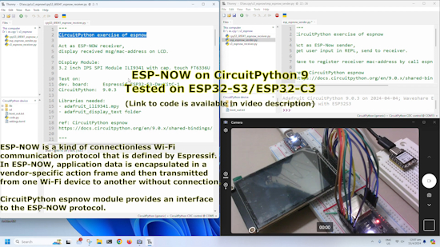](https://coxxect.blogspot.com/2024/04/esp-now-on-circuitpython-903-tested-on.html)

[ESP-NOW](https://docs.espressif.com/projects/esp-idf/en/release-v4.4/esp32/api-reference/network/esp_now.html) is a connectionless WiFi communication protocol defined by Espressif. In ESP-NOW, application data is encapsulated in a vendor-specific action frame and then transmitted from one WiFi device to another without connection.

User coXXect shows the CircuitPython [`espnow` module](https://docs.circuitpython.org/en/latest/shared-bindings/espnow/index.html) providing an interface to the ESP-NOW protocol - [coXXect](https://coxxect.blogspot.com/2024/04/esp-now-on-circuitpython-903-tested-on.html), [YouTube](https://www.youtube.com/watch?v=fN0uVJamCgs) and [module documentation](https://docs.circuitpython.org/en/latest/shared-bindings/espnow/index.html).

## CircuitPython 9.0.4 and 9.1.0-beta.1 Released

CircuitPython 9.0.4 is the latest bugfix release of CircuitPython, and is a new stable release - [Adafruit Blog](https://blog.adafruit.com/2024/04/16/circuitpython-9-0-4-released/) and [GitHub release page](https://github.com/adafruit/circuitpython/releases/tag/9.0.4).

CircuitPython 9.1.0-beta.1 is the latest beta for CircuitPython 9.1.0, and is a new unstable release. This release has known bugs that will be addressed before 9.1.0 final - [Adafruit Blog](https://blog.adafruit.com/2024/04/18/circuitpython-9-1-0-beta-1-released/) and [GitHub release page](https://github.com/adafruit/circuitpython/releases/tag/9.1.0-beta.1).

## CircuitPython Online IDE 2.0 Beta

[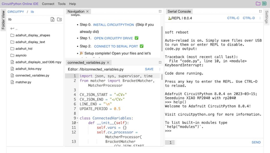](https://twitter.com/River___Wang/status/1779276357521867187)

The independently developed CircuitPython Online IDE 2.0 Beta is forthcoming! All issues from the 2.0 alpha have been addressed and the documentation is ready. Once the Quick Start video is completed, the transition to 2.0 Beta will occur and Version 1 will be retired - [X](https://twitter.com/River___Wang/status/1779276357521867187) and [IDE](https://urfdvw.github.io/circuitpython-online-ide-2/).

## PiDock 400 Turns A Raspberry Pi 400 Into a 13-inch Notebook

[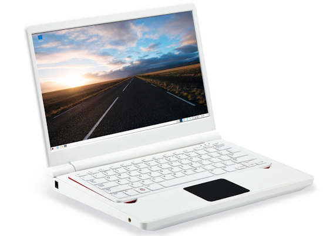](https://www.notebookcheck.net/PiDock-400-turns-Raspberry-Pi-into-a-13-inch-notebook.827844.0.html)

The Raspberry Pi 400 packs a single-board computer into the housing of a keyboard. Together with the PiDock 400, users can quickly transform the compact PC into a laptop with a 13.3-inch 1080p display and a trackpad, although the dock does not have an integrated battery - [Notebook Check](https://www.notebookcheck.net/PiDock-400-turns-Raspberry-Pi-into-a-13-inch-notebook.827844.0.html) and [Vendor](https://vilros.com/products/pidock-400-raspberry-pi-400-compatible-dock-display).

## Rust vs MicroPython – A Guide

[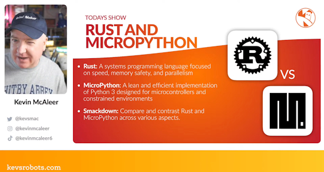](https://www.youtube.com/watch?v=M9LekkoQyf0)

Rust vs Micropython - is one better? Kevin McAleer looks at the strengths and weaknesses of each. Rust is great for efficient and memory safe code, but is it well suited to microcontrollers? - [YouTube](https://www.youtube.com/watch?v=M9LekkoQyf0).

## Linus Torvalds Tibits

### Linus Torvalds reiterates his tabs-versus-spaces stance with a kernel trap

A Linux commit last week changed exactly one thing on one line, replacing a tab character with a space: "It helps Kconfig parsers to read file without error." Linus Torvalds responded with a commit of his own, which would "add some hidden tabs on purpose." - [Ars Technica](https://arstechnica.com/gadgets/2024/04/linus-torvalds-reiterates-his-tabs-versus-spaces-stance-with-a-kernel-trap/).

### Linus Torvalds takes on evil developers, hardware errors and 'hilarious' AI hype

While all is 'calm and steady and boring' with the next kernel, Linux creator Torvalds tells an Open Source Summit crowd exactly how he feels about almost everything else - [ZDnet](https://www.zdnet.com/article/linus-torvalds-takes-on-evil-developers-hardware-errors-and-hilarious-ai-hype/).

## This Week's Python Streams

Python on Hardware is all about building a cooperative ecosphere which allows contributions to be valued and to grow knowledge. Below are the streams within the last week focusing on the community.

**CircuitPython Deep Dive Stream**

[Last Friday](https://www.youtube.com/watch?v=_zBDZS7kiQs), Tim was working on adding file upload to CircuitPython Requests.

You can see the latest video and past videos on the Adafruit YouTube channel under the Deep Dive playlist - [YouTube](https://www.youtube.com/playlist?list=PLjF7R1fz_OOXBHlu9msoXq2jQN4JpCk8A).

**CircuitPython Parsec**

John Park’s CircuitPython Parsec this week is on {subject} - [Adafruit Blog](link) and [YouTube](link).

Catch all the episodes in the [YouTube playlist](https://www.youtube.com/playlist?list=PLjF7R1fz_OOWFqZfqW9jlvQSIUmwn9lWr).

**CircuitPython Weekly Meeting**

CircuitPython Weekly Meeting for April 15, 2024 ([notes](https://github.com/adafruit/adafruit-circuitpython-weekly-meeting/blob/main/2024/2024-04-15.md)) [on YouTube](https://youtu.be/LzFJOJS5fgY).

## Project of the Week: A Light-Up Cyberpunk Guitar Strap

Jeremy Cook repurposed PCBs, addressable LED strips, and an Adafruit Circuit Playground Express for making an illuminated guitar strap using CircuitPython - [hackster.io](https://www.hackster.io/news/light-up-cyberpunk-guitar-strap-with-repurposed-pcbs-1e57e3882be3) andf [GitHub](https://github.com/JeremySCook/circuitpython-experiments/tree/main/guitar-strap/CircuitPlaygroundExpress).

## Popular Last Week

What was the most popular, most clicked link, in [last week's newsletter](https://www.adafruitdaily.com/2024/04/15/python-on-microcontrollers-newsletter-new-mainline-python-versions-new-raspberry-pi-hardware-and-more-circuitpython-python-micropython-thepsf-raspberry_pi/)? [Comparing the Three Main Zero Form Factor SBC’s in the Market Right Now](https://www.youtube.com/watch?v=Fyet0-L1IWI).

## New Notes from Adafruit Playground

[Adafruit Playground](https://adafruit-playground.com/) is a new place for the community to post their projects and other making tips/tricks/techniques. Ad-free, it's an easy way to publish your work in a safe space for free.

[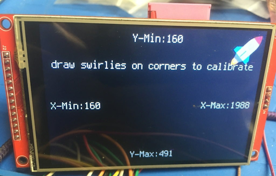](https://adafruit-playground.com/u/DJDevon3/pages/touchscreen-tft-sdcard-with-the-raspberry-pi-pico-w)

Touchscreen TFT & SDCard with the Raspberry Pi Pico W - [Adafruit Playground](https://adafruit-playground.com/u/DJDevon3/pages/touchscreen-tft-sdcard-with-the-raspberry-pi-pico-w).

Using Multiple WiFi Access Points with CircuitPython - [Adafruit Playground](https://adafruit-playground.com/u/blakebr/pages/using-multiple-wifi-access-points-with-circuitpython).

[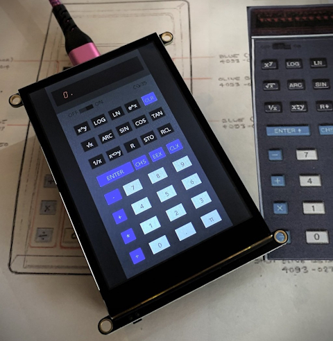](https://adafruit-playground.com/u/CGrover/pages/cg-35-a-retro-rpn-calculator)

CG-35: A Retro RPN Calculator - [Adafruit Playground](https://adafruit-playground.com/u/CGrover/pages/cg-35-a-retro-rpn-calculator).

## News From Around the Web

[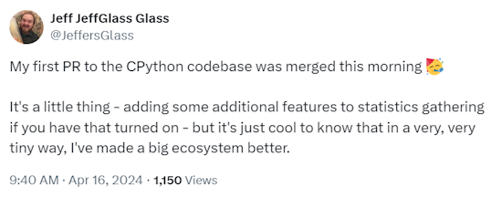](https://twitter.com/JeffersGlass/status/1780229750104920071)

Jeff Glass posts this about contributing to CircuitPython. [You can contribute too](https://circuitpython.org/contributing/open-issues). From code to drivers, there is even a category of PRs called Good First Issues - [X](https://twitter.com/JeffersGlass/status/1780229750104920071).

[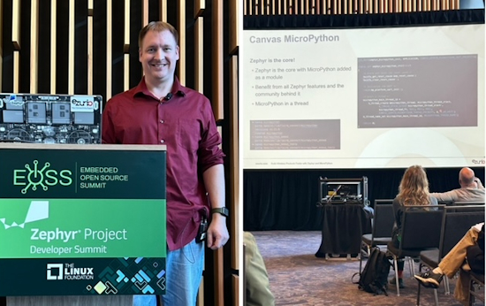](https://eoss24.sched.com/event/1aBFA)

"Build Wireless Products Faster with Zephyr and MicroPython" by Ryan Erickson, Ezurio, at the Embedded Open Source Summit 2024 - [Slides](https://static.sched.com/hosted_files/eoss24/cb/Build%20Wireless%20Products%20Faster%20with%20Zephyr%20and%20MicroPython%20-%20Ryan%20Erickson.pdf) and [Summit Page](https://eoss24.sched.com/event/1aBFA) via [X](https://twitter.com/ZephyrIoT/status/1780379347775348885).

[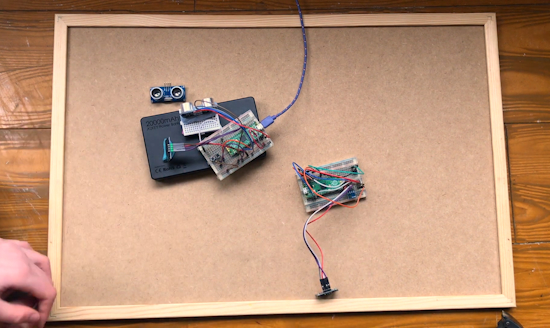](https://www.youtube.com/watch?v=QJXZ_HiCYjQ)

Measuring the speed of sound at home With a Raspberry Pi Pico & HC-SR04 with MicroPython - [GurgleApps](https://www.youtube.com/watch?v=QJXZ_HiCYjQ).

[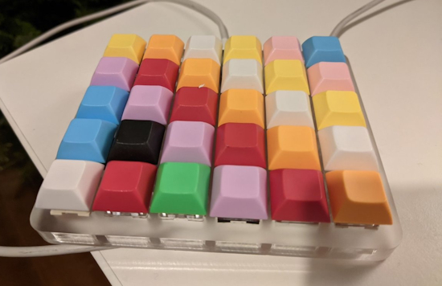](https://twitter.com/zubr_kabbi/status/1779219606369944043)

Turning a keyboard switch test set into a functional keyboard with CircuitPython - [X](https://twitter.com/zubr_kabbi/status/1779219606369944043).

MicroPython Flipper Zero is the [FAP](https://developer.flipper.net/flipperzero/doxygen/apps_on_sd_card.html) version of the MicroPython support for the [Flipper Zero](https://flipperzero.one/) gadget - [GitHub](https://github.com/ofabel/mp-flipper?tab=readme-ov-file).

[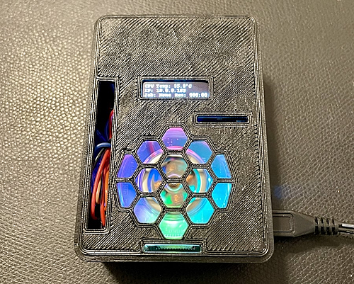](https://twitter.com/ShawnHymel/status/1781154195111821533)

Shawn Hymel made an Octoprint with a Raspberry Pi. Statistics are on a small display coded in Python - [X](https://twitter.com/ShawnHymel/status/1781154195111821533) and [Mastodon](https://octodon.social/@shawnhymel@masto.ai/112295675164262320).

[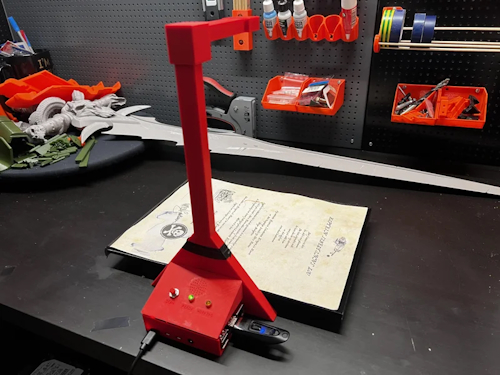](https://www.instructables.com/From-Papers-to-Pixels-a-Raspberry-Pi-Document-Scan/)

From Papers to Pixels: a Raspberry Pi Document Scanner programmed in Python - [Instructables](https://www.instructables.com/From-Papers-to-Pixels-a-Raspberry-Pi-Document-Scan/).

[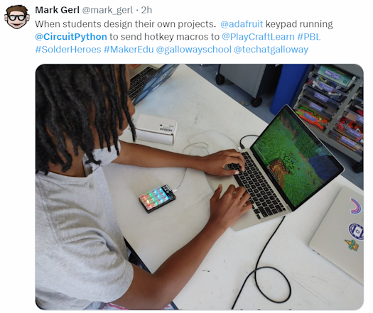](https://twitter.com/mark_gerl/status/1781010230828003698)

Students make custom macropads for Minecraft at The Galloway School in Atlanta, Georgia with CircuitPython - [X](https://twitter.com/mark_gerl/status/1781010230828003698).

[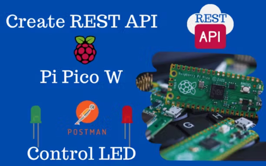](https://www.hackster.io/rajivcodelab/how-to-build-a-rest-api-on-raspberry-pi-pico-w-control-led-91b25b)

How to Build a REST API on Raspberry Pi Pico W and MicroPython - [hackster.io](https://www.hackster.io/rajivcodelab/how-to-build-a-rest-api-on-raspberry-pi-pico-w-control-led-91b25b).

[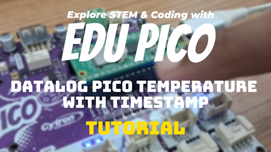](https://www.youtube.com/watch?v=gED8uU9puOQ)

EDU PICO - datalog Raspberry Pi Pico temperature with a timestamp in CircuitPython - [YouTube](https://www.youtube.com/watch?v=gED8uU9puOQ).

[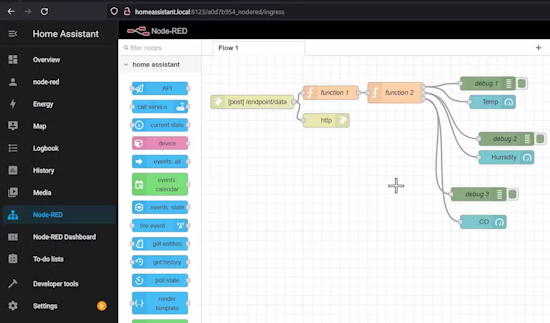](https://www.hackster.io/MohammadReza_Sharifi/how-to-connect-rpi-pico-w-to-node-red-and-home-assistant-ed39f2)

How to Connect RPi Pico W to Node-RED and Home Assistant with MicroPython - [hackster.io](https://www.hackster.io/MohammadReza_Sharifi/how-to-connect-rpi-pico-w-to-node-red-and-home-assistant-ed39f2).

[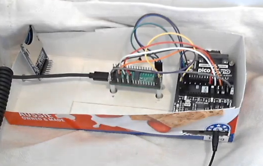](https://www.youtube.com/watch?v=6aRs-dM73Ik)

Raspberry Pi Pico sound demo using MicroPython - [YouTube](https://www.youtube.com/watch?v=6aRs-dM73Ik).

[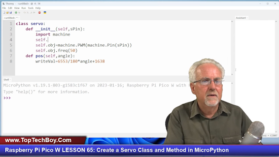](https://www.youtube.com/watch?v=OI4MzX7zqGc)

Raspberry Pi Pico W Lesson 65: Create a Servo Class and Method in MicroPython - [YouTube](https://www.youtube.com/watch?v=OI4MzX7zqGc).

text - [site](url).

text - [site](url).

How to Write Pythonic Code - [built in](https://builtin.com/data-science/pythonic).

NiceGUI: Your Soon-to-be Favorite Python UI Library - [Towards Data Science](https://towardsdatascience.com/meet-the-nicegui-your-soon-to-be-favorite-python-ui-library-fb69f14bb0ac).

## New

[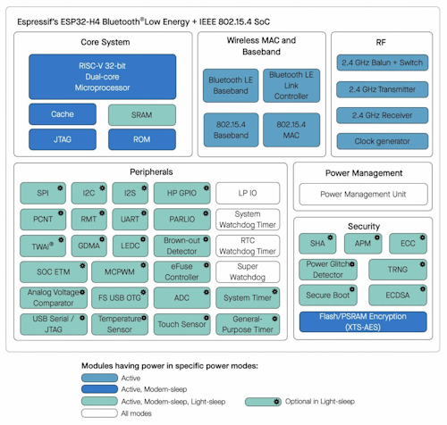](https://www.cnx-software.com/2024/04/15/esp32-h4-low-power-risc-v-soc-802-15-4-bluetooth-5-4-le/)

Espressif Systems has formally announced the ESP32-H4 low-power dual-core 32-bit RISC-V wireless microcontroller with support for 802.15.4 and Bluetooth 5.4 LE portfolio after having unveiled it at CES 2024. It’s the first Espressif chip to support Bluetooth 5.4 LE with previous models such as [ESP32-H2](https://www.cnx-software.com/2021/08/03/esp32-h2-risc-v-wisoc-announced-with-zigbee-3-thread-and-bluetooth-le-5-2/) or [ESP32-C6](https://www.cnx-software.com/2023/01/12/esp32-c6-wifi-6-ble-802-15-4-module-development-board/) only supporting Bluetooth 5.0/5.2. Besides BLE 5.4 support, the new ESP32-H4 dual-core RISC-V WiSoC is an evolution of the ESP32-H2 single-core chip with PSRAM support (up to 4MB built-in), additional GPIOs (36 vs 24), touch sensing GPIOs, and some extra security features such as a power glitch detector also found in the recently announced [ESP32-C61](https://www.cnx-software.com/2024/01/10/esp32-c61-wifi-6-soc-improved-affordability-wireless-connectivity/) - [CNX Software](https://www.cnx-software.com/2024/04/15/esp32-h4-low-power-risc-v-soc-802-15-4-bluetooth-5-4-le/).

[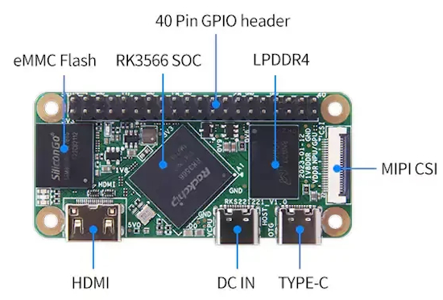](https://bret.dk/geniatech-xpi-3566-zero-review/)

The Geniatech XPI-3566-ZERO is another Raspberry Pi Zero form-factor SBC, though like many other Raspberry Pi alternatives, it packs in additional features and horsepower. Curiously, it also does away with others such as the microSD card slot - [bret.dk](https://bret.dk/geniatech-xpi-3566-zero-review/).

## New Boards Supported by CircuitPython

The number of supported microcontrollers and Single Board Computers (SBC) grows every week. This section outlines which boards have been included in CircuitPython or added to [CircuitPython.org](https://circuitpython.org/).

This week there was one new board added:

- [Sunton ESP32-2424S012](https://circuitpython.org/board/sunton_esp32_2424S012/)

*Note: For non-Adafruit boards, please use the support forums of the board manufacturer for assistance, as Adafruit does not have the hardware to assist in troubleshooting.*

Looking to add a new board to CircuitPython? It's highly encouraged! Adafruit has four guides to help you do so:

- [How to Add a New Board to CircuitPython](https://learn.adafruit.com/how-to-add-a-new-board-to-circuitpython/overview)
- [How to add a New Board to the circuitpython.org website](https://learn.adafruit.com/how-to-add-a-new-board-to-the-circuitpython-org-website)
- [Adding a Single Board Computer to PlatformDetect for Blinka](https://learn.adafruit.com/adding-a-single-board-computer-to-platformdetect-for-blinka)
- [Adding a Single Board Computer to Blinka](https://learn.adafruit.com/adding-a-single-board-computer-to-blinka)

## New Learn Guides

[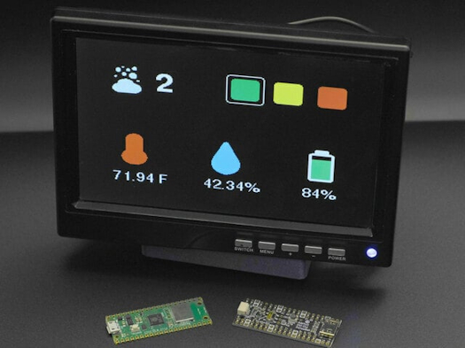](https://learn.adafruit.com/guides/latest)

[PicoDVI Adafruit IO Feed Dashboard](https://learn.adafruit.com/dvi-io) from [Ruiz Brothers](https://learn.adafruit.com/u/pixil3d)

## Updated Learn Guides

[Robotic AI Bear using ChatGPT](https://learn.adafruit.com/robotic-ai-bear-using-chatgpt/code-the-bear)

## CircuitPython Libraries

The CircuitPython library numbers are continually increasing, while existing ones continue to be updated. Here we provide library numbers and updates!

To get the latest Adafruit libraries, download the [Adafruit CircuitPython Library Bundle](https://circuitpython.org/libraries). To get the latest community contributed libraries, download the [CircuitPython Community Bundle](https://circuitpython.org/libraries).

If you'd like to contribute to the CircuitPython project on the Python side of things, the libraries are a great place to start. Check out the [CircuitPython.org Contributing page](https://circuitpython.org/contributing). If you're interested in reviewing, check out Open Pull Requests. If you'd like to contribute code or documentation, check out Open Issues. We have a guide on [contributing to CircuitPython with Git and GitHub](https://learn.adafruit.com/contribute-to-circuitpython-with-git-and-github), and you can find us in the #help-with-circuitpython and #circuitpython-dev channels on the [Adafruit Discord](https://adafru.it/discord).

You can check out this [list of all the Adafruit CircuitPython libraries and drivers available](https://github.com/adafruit/Adafruit_CircuitPython_Bundle/blob/master/circuitpython_library_list.md). 

The current number of CircuitPython libraries is **482**!

**New Libraries**

Here's this week's new CircuitPython libraries:

  * [adafruit/Adafruit_CircuitPython_ADG72x](https://github.com/adafruit/Adafruit_CircuitPython_ADG72x)

**Updated Libraries**

Here's this week's updated CircuitPython libraries:

  * [adafruit/Adafruit_CircuitPython_TemplateEngine](https://github.com/adafruit/Adafruit_CircuitPython_TemplateEngine)

**Library PyPI Weekly Download Stats**

**Total Library Stats**

  * 142455 PyPI downloads over 326 libraries

**Top 10 Libraries by PyPI Downloads**

  * Adafruit CircuitPython Requests (adafruit-circuitpython-requests): 9834
  * Adafruit CircuitPython BusDevice (adafruit-circuitpython-busdevice): 9165
  * Adafruit CircuitPython ConnectionManager (adafruit-circuitpython-connectionmanager): 7561
  * Adafruit CircuitPython Register (adafruit-circuitpython-register): 2576
  * Adafruit CircuitPython framebuf (adafruit-circuitpython-framebuf): 1293
  * Adafruit CircuitPython Motor (adafruit-circuitpython-motor): 1237
  * Adafruit CircuitPython ServoKit (adafruit-circuitpython-servokit): 1231
  * Adafruit CircuitPython RGB Display (adafruit-circuitpython-rgb-display): 1213
  * Adafruit CircuitPython HTTPServer (adafruit-circuitpython-httpserver): 1112
  * Adafruit CircuitPython MiniMQTT (adafruit-circuitpython-minimqtt): 1103

## What’s the CircuitPython team up to this week?

What is the team up to this week? Let’s check in:

**Dan**

I released CircuitPython 9.0.4 and 9.1.0-beta.1 this past week. I'm continuing to work on 9.x.x issues so we can get 9.1.0 final out.

The Sphinx Python documentation system received a minor version update a few days ago. This caused two different issues with our automated build jobs that were not hard to fix: one file was slightly renamed (an underscore instead of a dash), and a new warning appeared, which made the ReadTheDocs build fail. This is the kind of maintenance which we expect to do, and yet the actual issues appear unexpectedly.

**Melissa**

This past week, I continued working on addressing feedback and updating guides. The biggest guide I updated was the [Robotic AI Bear using ChatGPT](https://learn.adafruit.com/robotic-ai-bear-using-chatgpt) guide. I also fixed an issue with the MiniPiTFT not working correctly on the Raspberry Pi Zero W.

**Tim**

text.

**Scott**

text.

**Liz**

This week I've been working on a few product guides. There are two analog matrix switch breakouts in the shop and I wrote a quick [CircuitPython driver](https://github.com/adafruit/Adafruit_CircuitPython_ADG72x) for interfacing with them. These switches let you route analog signals easily and I'd like to experiment with building a mixer with one. The other product guide I worked on was for the [STEMMA IR remote receiver](https://learn.adafruit.com/adafruit-infrared-ir-remote-receiver). This breakout makes it easy to read incoming IR signals from an IR remote, making it great for IR remote projects or recording commercial IR remote commands.

## Upcoming Events

The next MicroPython Meetup in Melbourne will be on April 24th – [Meetup](https://www.meetup.com/micropython-meetup/events). You can see recordings of previous meetings on [YouTube](https://www.youtube.com/@MicroPythonOfficial). 

The 2024 Open Hardware Summit will be taking place May 3 & 4, 2024 at Concordia University and lespacemaker in Montreal, Canada - [oshwa.org](https://2024.oshwa.org/).

PyCon US 2024 launches May 15-23, 2024 in Pittsburgh, Pennsylvania US - [PyCon US](https://pycon.blogspot.com/2024/10/pycon-us-2024-launches.html).

Open Sauce, the Maker extravaganza, is returning to San Francisco, California June 15-16 - [Open Sauce](https://opensauce.live/).

EuroPython is the oldest and longest running volunteer-led Python programming conference on the planet. This year it will be held July 8-14 in Prague - [EuroPython 2024](https://ep2024.europython.eu/).

PyOhio is being held July 27-28, 2024 in Cleveland, Ohio. The organizing team welcomes you to [submit your proposals to the CfP](https://www.pyohio.org/2024/speaking/cfp/) by May 21st - [PyOhio](https://www.pyohio.org/2024/).

**Send Your Events In**

If you know of virtual events or upcoming events, please let us know via email to cpnews(at)adafruit(dot)com.

## Latest Releases

CircuitPython's stable release is [9.0.4](https://github.com/adafruit/circuitpython/releases/latest) and its unstable release is [9.1.0-beta.1](https://github.com/adafruit/circuitpython/releases). New to CircuitPython? Start with our [Welcome to CircuitPython Guide](https://learn.adafruit.com/welcome-to-circuitpython).

[20240417](https://github.com/adafruit/Adafruit_CircuitPython_Bundle/releases/latest) is the latest Adafruit CircuitPython library bundle.

[20240412](https://github.com/adafruit/CircuitPython_Community_Bundle/releases/latest) is the latest CircuitPython Community library bundle.

[v1.22.2](https://micropython.org/download) is the latest MicroPython release. Documentation for it is [here](http://docs.micropython.org/en/latest/pyboard/).

[3.12.3](https://www.python.org/downloads/) is the latest Python release. The latest pre-release version is [3.13.0a6](https://www.python.org/download/pre-releases/).

[3,890 Stars](https://github.com/adafruit/circuitpython/stargazers) Like CircuitPython? [Star it on GitHub!](https://github.com/adafruit/circuitpython)

## Call for Help -- Translating CircuitPython is now easier than ever

[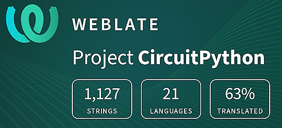](https://hosted.weblate.org/engage/circuitpython/)

One important feature of CircuitPython is translated control and error messages. With the help of fellow open source project [Weblate](https://weblate.org/), we're making it even easier to add or improve translations. 

Sign in with an existing account such as GitHub, Google or Facebook and start contributing through a simple web interface. No forks or pull requests needed! As always, if you run into trouble join us on [Discord](https://adafru.it/discord), we're here to help.

## 39,098 Thanks

The Adafruit Discord community, where we do all our CircuitPython development in the open, reached over 39,098 humans - thank you! Adafruit believes Discord offers a unique way for Python on hardware folks to connect. Join today at [https://adafru.it/discord](https://adafru.it/discord).

## ICYMI - In case you missed it

Python on hardware is the Adafruit Python video-newsletter-podcast! The news comes from the Python community, Discord, Adafruit communities and more and is broadcast on ASK an ENGINEER Wednesdays. The complete Python on Hardware weekly videocast [playlist is here](https://www.youtube.com/playlist?list=PLjF7R1fz_OOXRMjM7Sm0J2Xt6H81TdDev). The video podcast is on [iTunes](https://itunes.apple.com/us/podcast/python-on-hardware/id1451685192?mt=2), [YouTube](http://adafru.it/pohepisodes), [Instagram](https://www.instagram.com/adafruit/channel/)), and [XML](https://itunes.apple.com/us/podcast/python-on-hardware/id1451685192?mt=2).

[The weekly community chat on Adafruit Discord server CircuitPython channel - Audio / Podcast edition](https://itunes.apple.com/us/podcast/circuitpython-weekly-meeting/id1451685016) - Audio from the Discord chat space for CircuitPython, meetings are usually Mondays at 2pm ET, this is the audio version on [iTunes](https://itunes.apple.com/us/podcast/circuitpython-weekly-meeting/id1451685016), Pocket Casts, [Spotify](https://adafru.it/spotify), and [XML feed](https://adafruit-podcasts.s3.amazonaws.com/circuitpython_weekly_meeting/audio-podcast.xml).

## Contribute

The CircuitPython Weekly Newsletter is a CircuitPython community-run newsletter emailed every Monday. The complete [archives are here](https://www.adafruitdaily.com/category/circuitpython/). It highlights the latest CircuitPython related news from around the web including Python and MicroPython developments. To contribute, edit next week's draft [on GitHub](https://github.com/adafruit/circuitpython-weekly-newsletter/tree/gh-pages/_drafts) and [submit a pull request](https://help.github.com/articles/editing-files-in-your-repository/) with the changes. You may also tag your information on Twitter with #CircuitPython. 

Join the Adafruit [Discord](https://adafru.it/discord) or [post to the forum](https://forums.adafruit.com/viewforum.php?f=60) if you have questions.
