View this email in your browser. **Warning: Flashing Imagery**

Welcome to the latest Python on Microcontrollers newsletter! PyCon US 2023 is currently underway and I hope folks are having fun connecting with like minded folk. A new beta of CircuitPython is out with some cool features. And folks are working on MicroPython running alongside other apps on the Playdate handheld. Never a dull moment in the Python onn Hardware beat. And we only need two more subscribers for 11,000 - I'm crossing my fingers for that. - *Anne Barela, Ed.*

We're on [Discord](https://discord.gg/HYqvREz), [Twitter](https://twitter.com/search?q=circuitpython&src=typed_query&f=live), and for past newsletters - [view them all here](https://www.adafruitdaily.com/category/circuitpython/). If you're reading this on the web, [subscribe here](https://www.adafruitdaily.com/). Here's the news this week:

## CircuitPython 9.1.0 Beta 2

CircuitPython 9.1.0-beta.2, a beta for CircuitPython 9.1.0, is a new unstable release. This release has known bugs that will be addressed before 9.1.0 final. - [Adafruit Blog](https://blog.adafruit.com/2024/05/15/circuitpython-9-1-0-beta-2-released/) and [release notes](https://github.com/adafruit/circuitpython/releases/tag/9.1.0-beta.2).

## The Official Raspberry Pi 5 M.2 HAT+ Now Out

The preannounced Raspberry Pi 5 M.2 HAT+ is now rolling out to official retailers at $12. It enables connection of M.2 M-key peripherals, such as NVMe drives and AI accelerators, to a Raspberry Pi 5. The HAT provides fast (up to 500 MB/s) data transfer to and from these peripherals. - [Raspberry Pi News](https://www.raspberrypi.com/news/m-2-hat-on-sale-now-for-12/). A review - [bret.dk](https://bret.dk/official-raspberry-pi-m-2-hat-review/).

> "A nice side-effect of launching of the M.2 HAT+ a bit later has been a profusion of third-party products. We want to make it easier to build high-quality PCIe accessories for Raspberry Pi 5, and so we’re publishing our [schematics](https://www.raspberrypi.com/documentation/accessories/m2-hat-plus.html#schematics) as a reference design. You can also browse our [documentation for the M.2 HAT+](https://www.raspberrypi.com/documentation/accessories/m2-hat-plus.html).

## Late Breaking: MicroPython Ported to the Playdate

[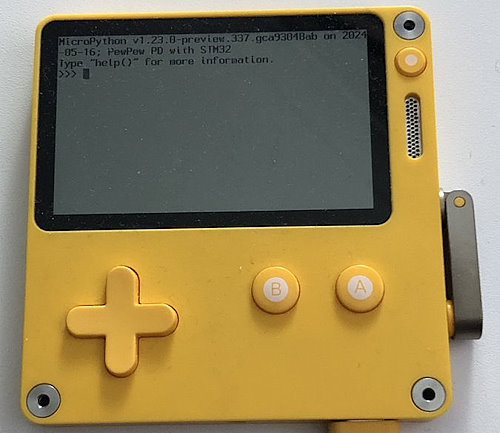](https://x.com/matt_trentini/status/1791412984499351638)

Christian Walther ([GitHub](https://github.com/cwalther?tab=repositories), [X](https://x.com/isziaui)) has ported MicroPython to the Panic developed [Playdate](https://play.date/) handheld gaming device - [X](https://x.com/matt_trentini/status/1791412984499351638) and [GitHub Code](https://github.com/cwalther/pew-playdate).

The work is part of a port of [PewPew](https://pewpew.readthedocs.io/) to Playdate - [Playdate dev forum](https://devforum.play.date/t/pewpew-python-games-on-playdate-wip/17379).

> "What I want is to embed MicroPython into a fully fledged Playdate application that can live alongside other Playdate games. Unlike Lua, MicroPython is not specifically made for that purpose, but it does have some provisions for it. While it doesn’t easily compile into a library, among its “ports” to different microcontrollers there is one named “embed” that is not for a specific microcontroller but spits out a bunch of .c and .h files as its build product that can then be added into the build system of any C project on any platform."

## Linux Kernel 6.9 Officially Released, This Is What’s New

This release introduces Rust support on AArch64 (ARM64) architectures and support for the Intel FRED (Flexible Return and Event Delivery) mechanism - [9to5Linux](https://9to5linux.com/linux-kernel-6-9-officially-released-this-is-whats-new) and [The Register](https://www.theregister.com/2024/05/13/linux_kernel_69_released/).

Linus Torvalds now favors the Ampere Arm chip over using an Apple Silicon MacBook for building Linux kernels — he says he's now doing more Arm64 Linux testing than ever - [Tom's Hardware](https://www.tomshardware.com/software/linux/linus-torvalds-now-favors-arm-powered-ampere-chip-over-apple-silicon-mac-for-building-linux-kernels-says-the-more-powerful-system-is-why-hes-doing-more-arm64-linux-testing).

## Unboxing the MicroPython-capable Arduino Alvik Robot

Arduino's Alvik is out. Watch as Alex Glow at hackster.io unboxes this robot which runs on a Nano ESP32 and also features an STM32 on the chassis. It supports MicroPython, integrates a bunch of sensors, and includes connectors for customization - [hackster.io](https://www.hackster.io/videos/1591) via [X](https://twitter.com/Hacksterio/status/1790729132172628078).

## PyCon US 2024 Happening Now

[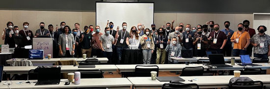](https://twitter.com/julianaklulo/status/1790854429060591749)

Events are happening now in Pittsburg at PyCon US 2024. Shown here is the Introduction to MicroPython: Getting Started With micro:bit tutorial - [X](https://twitter.com/julianaklulo/status/1790854429060591749).

## microSD Cards for Single-Board Computers (SBC) - Their Days Are Numbered

Jeff Geerling postulates that use of microSD cards' for SBCs like Raspberry Pi may be phased out. The speeds obtained by PCIe drives are faster and the reliability of the storage is much higher - [Jeff Geerling](https://www.jeffgeerling.com/blog/2024/microsd-cards-sbc-days-are-numbered) and [YouTube](https://www.youtube.com/watch?v=GYN3ub8Qb_I).

## This Week's Python Streams

Python on Hardware is all about building a cooperative ecosphere which allows contributions to be valued and to grow knowledge. Below are the streams within the last week focusing on the community.

**CircuitPython Deep Dive Stream**

[Last Friday](https://www.youtube.com/watch?v=3k05dM1c8D0), Scott streamed work on ESP BLE pairing and bonding.

You can see the latest video and past videos on the Adafruit YouTube channel under the Deep Dive playlist - [YouTube](https://www.youtube.com/playlist?list=PLjF7R1fz_OOXBHlu9msoXq2jQN4JpCk8A).

**CircuitPython Parsec**

John Park’s CircuitPython Parsec is off this week. Catch all the episodes in the [YouTube playlist](https://www.youtube.com/playlist?list=PLjF7R1fz_OOWFqZfqW9jlvQSIUmwn9lWr).

**CircuitPython Weekly Meeting**

CircuitPython Weekly Meeting for May 13th, 2024 ([notes](https://github.com/adafruit/adafruit-circuitpython-weekly-meeting/blob/main/2024/2024-05-13.md)) [on YouTube](https://www.youtube.com/watch?v=xNNpVvczm7E).

## Project of the Week: A DIY Vintage Spotify Radio

[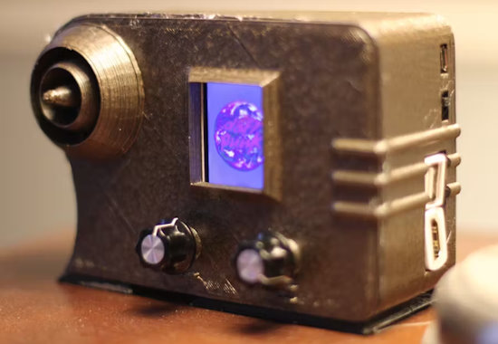](https://www.hackster.io/tinkernut/diy-vintage-spotify-radio-using-a-raspberry-pi-bc3322)

A vintage look radio houses a Raspberry Pi Zero W running Mopidy, a Python based music playing application. The project uses an Adafruit RasPi Bonnet, TFT display and I2S mono amplifier - [hackster.io](https://www.hackster.io/tinkernut/diy-vintage-spotify-radio-using-a-raspberry-pi-bc3322), [Raspberry Pi News](https://www.raspberrypi.com/news/this-vintage-radio-streams-music-with-raspberry-pi-zero-w/) and [YouTube](https://youtu.be/UJTd3srVt9E).

## Popular Last Week

What was the most popular, most clicked link, in [last week's newsletter](https://www.adafruitdaily.com/2024/05/13/python-on-microcontrollers-newsletter-raspberry-pi-connect-matter-1-3-python-3-13-beta-and-more-circuitpython-python-micropython-thepsf-raspberry_pi/)? [Raspberry Pi Connect](https://www.raspberrypi.com/news/raspberry-pi-connect/).

## New Notes from Adafruit Playground

[Adafruit Playground](https://adafruit-playground.com/) is a new place for the community to post their projects and other making tips/tricks/techniques. Ad-free, it's an easy way to publish your work in a safe space for free.

[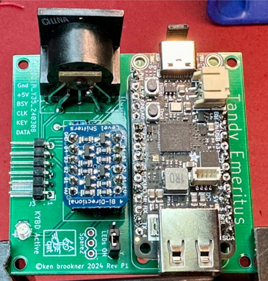](https://adafruit-playground.com/u/kenbroo/pages/usb-keyboard-adapter-v2-for-big-tandys)

USB Keyboard Adapter V2 for Big Tandys - [Adafruit Playground](https://adafruit-playground.com/u/kenbroo/pages/usb-keyboard-adapter-v2-for-big-tandys).

Babel - Let's make some Alien words!! - [Adafruit Playground](https://adafruit-playground.com/u/mrklingon/pages/babel-let-s-make-some-alien-words).

## News From Around the Web

[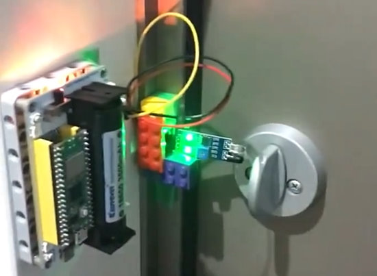](https://twitter.com/sozoraemon/status/1791057996413583444)

Device provides the status of a lock via a Raspberry Pi Pico W using WiFi via MicroPython. The remote status is on an eInk display - [X](https://twitter.com/sozoraemon/status/1791057996413583444) (Japanese).

[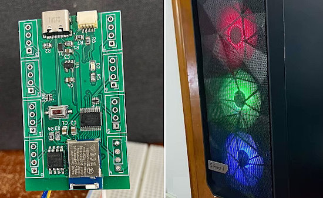](https://twitter.com/MarkKomus/status/1652846977506476032)

> "What started with my needing a new CPU fan resulted in a new case with aRGB fans. My motherboard didn’t support aRGB so rather then buy a controller for $20 I spent $100 making my own! (It uses an) nRF52840 for BLE with level shifting logic running CircuitPython" - [X](https://twitter.com/MarkKomus/status/1652846977506476032).

[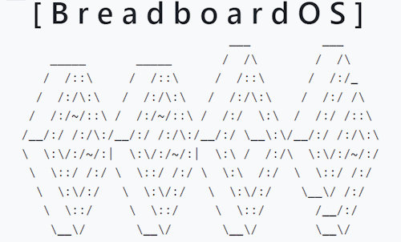](https://blog.adafruit.com/2024/05/14/breadboardos-for-raspberry-pi-pico/)

BreadboardOS for Raspberry Pi Pico - [Adafruit Blog](https://blog.adafruit.com/2024/05/14/breadboardos-for-raspberry-pi-pico/), [YouTube](https://www.youtube.com/watch?v=fQiYE_wlPt0) and [GitHub](https://github.com/mcknly/breadboard-os/).

[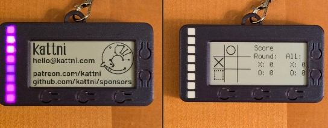](https://kattni.com/python-powered-eink-name-badge)

A CircuitPython-powered eInk name badge - [kattni:decoded](https://kattni.com/python-powered-eink-name-badge).

[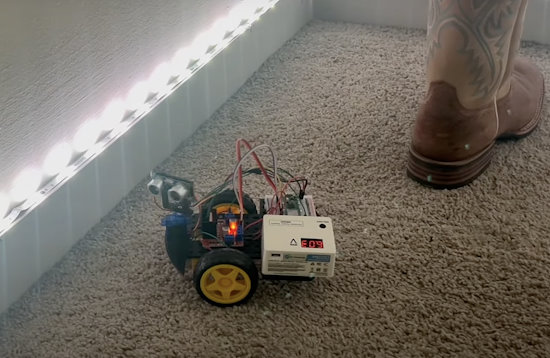](https://www.raspberrypi.com/news/raspberry-pi-pico-w-taught-this-car-to-avoid-objects/)

Raspberry Pi Pico W and MicroPython teaches a car to avoid objects - [Raspberry Pi News](https://www.raspberrypi.com/news/raspberry-pi-pico-w-taught-this-car-to-avoid-objects/), [GitHub](https://github.com/karamhaddad/ObjectAvoidingCar/blob/main/README.md) and [YouTube](https://www.youtube.com/watch?v=DBFbXrDwuZE).

One Raspberry Pi Pico communicating to another over WiFi sockets in MicroPython - [X](https://twitter.com/sozoraemon/status/1790323602895802469) (Japanese).

How to use Pyscript to create Python web apps - [TheNewStack](https://thenewstack.io/how-to-use-pyscript-to-create-python-web-apps/).

[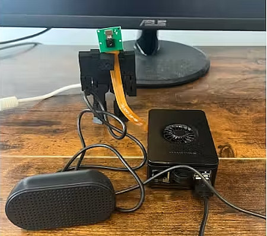](https://www.hackster.io/news/a-new-vision-for-voice-assistants-d4afd776a9fe)

Pi-card, a DIY voice assistant with eyes, uses a Raspberry Pi 5, speaker, mic, and camera to run a vision language model entirely locally - [hackster.io](https://www.hackster.io/news/a-new-vision-for-voice-assistants-d4afd776a9fe).

[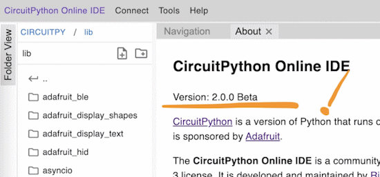](https://twitter.com/River___Wang/status/1790929012258119850)

CircuitPython Online IDE 2.0.0 Beta.1 has been released. This update addresses several bugs identified since the initial Beta release. The author is still looking for feedback - [X](https://twitter.com/River___Wang/status/1790929012258119850) and [IDE](https://urfdvw.github.io/circuitpython-online-ide-2/).

[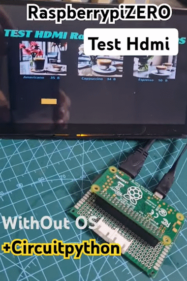](https://www.youtube.com/watch?v=P_w7HZMWSWQ)

Test HDMI video with a Raspberry Pi Zero without OS using CircuitPython - [YouTube](https://www.youtube.com/watch?v=P_w7HZMWSWQ).

[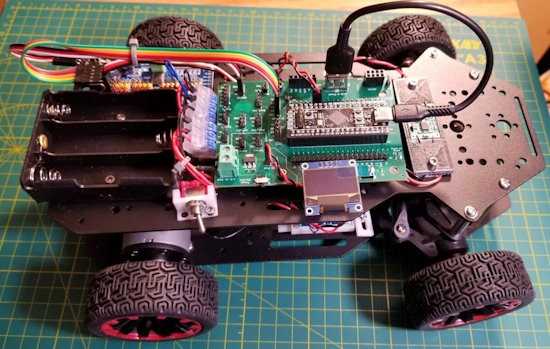](https://www.cnx-software.com/2024/05/16/build-robot-car-car-base-board-stm32f411-black-pill-board/)

Easily build a robot car with the Car Base Board for the STM32F411 “Black Pill” board - [CNX Software](https://www.cnx-software.com/2024/05/16/build-robot-car-car-base-board-stm32f411-black-pill-board/).

[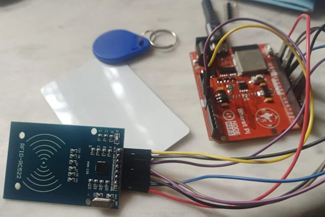](https://www.instructables.com/Smart-RFID-Cloud-Integration-Using-Bharat-Pi-Ardui/)

RFID cloud integration Using the Arduino IDE and MicroPython - [Instructables](https://www.instructables.com/Smart-RFID-Cloud-Integration-Using-Bharat-Pi-Ardui/).

[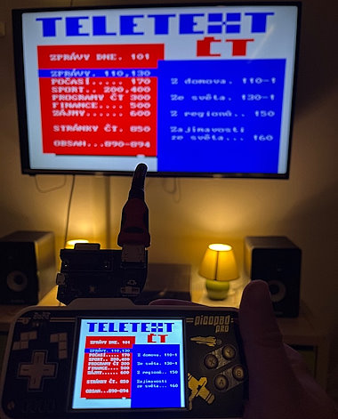](https://twitter.com/smitka/status/1789744122825224586)

Displaying TeleText on an HDMI display with CircuitPython 9 and PicoPad - [X](https://twitter.com/smitka/status/1789744122825224586) (Czech).

[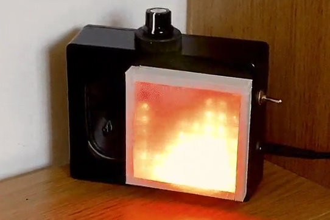](https://www.instructables.com/-Raspberry-Pi-Fireplace-/)

A Raspberry Pi fireplace with Python and Blinka - [Instructables](https://www.instructables.com/-Raspberry-Pi-Fireplace-/).

## New

[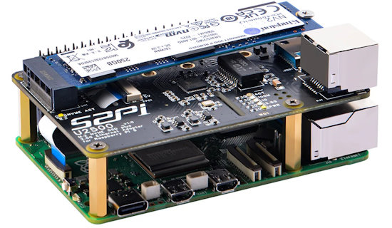](https://www.cnx-software.com/2024/05/16/52pi-w01-u2500-hat-2-5gbe-nvme-ssd-raspberry-pi-5/)

52Pi W01 U2500 HAT adds 2.5GbE and NVMe SSD support to Raspberry Pi 5 SBC - [CNX Software](https://www.cnx-software.com/2024/05/16/52pi-w01-u2500-hat-2-5gbe-nvme-ssd-raspberry-pi-5/).

[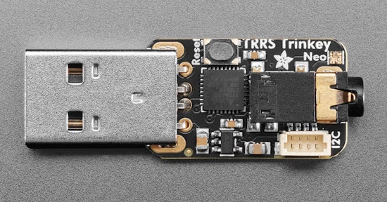](https://blog.adafruit.com/2024/05/16/new-product-adafruit-trrs-trinkey-usb-key-for-assistive-technology)

Adafruit TRRS Trinkey – a USB key for assistive technology and more - [Adafruit Blog](https://blog.adafruit.com/2024/05/16/new-product-adafruit-trrs-trinkey-usb-key-for-assistive-technology).

[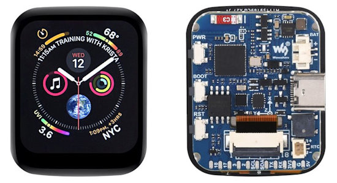](https://x.com/cnxsoft/status/1791360950492422414)

Waveshare has launched a 1.69-inch touchscreen color display based on an ESP32-S3 WiFi and LE WiSoC, and equipped with am IMU sensor, an RTC, a buzzer, and more - [X](https://x.com/cnxsoft/status/1791360950492422414).

## New Boards Supported by CircuitPython

The number of supported microcontrollers and Single Board Computers (SBC) grows every week. This section outlines which boards have been included in CircuitPython or added to [CircuitPython.org](https://circuitpython.org/).

This week there were two new boards added:

- [TRRS Trinkey](https://circuitpython.org/board/adafruit_trrs_trinkey_m0/)
- [Pixel Trinkey](https://circuitpython.org/board/adafruit_pixel_trinkey_m0/)

Looking to add a new board to CircuitPython? It's highly encouraged! Adafruit has four guides to help you do so:

- [How to Add a New Board to CircuitPython](https://learn.adafruit.com/how-to-add-a-new-board-to-circuitpython/overview)
- [How to add a New Board to the circuitpython.org website](https://learn.adafruit.com/how-to-add-a-new-board-to-the-circuitpython-org-website)
- [Adding a Single Board Computer to PlatformDetect for Blinka](https://learn.adafruit.com/adding-a-single-board-computer-to-platformdetect-for-blinka)
- [Adding a Single Board Computer to Blinka](https://learn.adafruit.com/adding-a-single-board-computer-to-blinka)

## New Learn Guide

[Halo Energy Sword RP2040](https://learn.adafruit.com/halo-energy-sword-rp2040) from [Ruiz Brothers](https://learn.adafruit.com/u/pixil3d)

## CircuitPython Libraries

The CircuitPython library numbers are continually increasing, while existing ones continue to be updated. Here we provide library numbers and updates!

To get the latest Adafruit libraries, download the [Adafruit CircuitPython Library Bundle](https://circuitpython.org/libraries). To get the latest community contributed libraries, download the [CircuitPython Community Bundle](https://circuitpython.org/libraries).

If you'd like to contribute to the CircuitPython project on the Python side of things, the libraries are a great place to start. Check out the [CircuitPython.org Contributing page](https://circuitpython.org/contributing). If you're interested in reviewing, check out Open Pull Requests. If you'd like to contribute code or documentation, check out Open Issues. We have a guide on [contributing to CircuitPython with Git and GitHub](https://learn.adafruit.com/contribute-to-circuitpython-with-git-and-github), and you can find us in the #help-with-circuitpython and #circuitpython-dev channels on the [Adafruit Discord](https://adafru.it/discord).

You can check out this [list of all the Adafruit CircuitPython libraries and drivers available](https://github.com/adafruit/Adafruit_CircuitPython_Bundle/blob/master/circuitpython_library_list.md). 

The current number of CircuitPython libraries is **483**!

**Updated Libraries**

Here's this week's updated CircuitPython libraries:

  * [adafruit/Adafruit_CircuitPython_NTP](https://github.com/adafruit/Adafruit_CircuitPython_NTP)
  * [adafruit/Adafruit_CircuitPython_Requests](https://github.com/adafruit/Adafruit_CircuitPython_Requests)
  * [adafruit/Adafruit_CircuitPython_PyCamera](https://github.com/adafruit/Adafruit_CircuitPython_PyCamera)
  * [facts-engineering/CircuitPython_p1am_200_helpers](https://github.com/facts-engineering/CircuitPython_p1am_200_helpers)

**Library PyPI Weekly Download Stats**

**Total Library Stats**
  * 102,110 PyPI downloads over 326 libraries

**Top 10 Libraries by PyPI Downloads**
  * Adafruit CircuitPython Requests (adafruit-circuitpython-requests): 8320
  * Adafruit CircuitPython BusDevice (adafruit-circuitpython-busdevice): 8155
  * Adafruit CircuitPython ConnectionManager (adafruit-circuitpython-connectionmanager): 7319
  * Adafruit CircuitPython Register (adafruit-circuitpython-register): 2064
  * Adafruit CircuitPython framebuf (adafruit-circuitpython-framebuf): 1233
  * Adafruit CircuitPython MiniMQTT (adafruit-circuitpython-minimqtt): 1073
  * Adafruit CircuitPython RGB Display (adafruit-circuitpython-rgb-display): 957
  * Adafruit CircuitPython ESP32SPI (adafruit-circuitpython-esp32spi): 932
  * Adafruit CircuitPython Pixelbuf (adafruit-circuitpython-pixelbuf): 847
  * Adafruit CircuitPython ADS1x15 (adafruit-circuitpython-ads1x15): 835

## What’s the CircuitPython team up to this week?

What is the team up to this week? Let’s check in:

**Dan**

I released CircuitPython 9.1.0-beta.2 last week to catch up on all the changes that have been going on, and to have some new boards be included in a labeled release.

I reworked the socket retry logic in the `ConnectionManager` library, to make sure to release sockets when the code was running out of RAM. Now SSL sockets are working much better on ESP32-S2. There is still an issue with SSL server sockets causing memory errors in some cases, and I'm going to look at that as well.

**Jeff**

I've been at PyCon in Pittsburgh for the past few days, and yesterday I delivered my talk "Connecting Old to New with CircuitPython". Thanks to all those who attended! Sometime in the future the video & slides should become available.

**Scott**

Last week I was on vacation. My Dad and I did a road trip down to Goblin Valley State Park in Utah.

This week I've gotten caught up and I'm picking back up my work to enable BLE GATT servers support on Espressif chips. My first goal is to get the continuous integration builds succeeding so folks can test it more easily. After that, I'll be bug hunting!

**Liz**

This week I worked on a few product guides. The first was the [S-35710 low power timer](https://learn.adafruit.com/adafruit-s-35710-low-power-wake-up-timer-breakout). This breakout lets you use a watchdog timer over I2C. I wrote a simple CircuitPython driver to interface with it. The next one was a [breakout adapter for a SEN54 or SEN55 sensor](https://learn.adafruit.com/adafruit-sen54-or-sen55-adapter-breakout). These sensors use a JST GH connector, so this breakout makes the wiring a lot easier. Sensirion has their own libraries for Arduino and Python, so I was able to use those for the demos. 

Finally, the last new product guide for this week was the [555 STEMMA breakout](https://learn.adafruit.com/adafruit-555-pwm-output-stemma). This breakout has the famous 555 timer on it paired with a 74HC1G04 buffer for a square wave output with trimmer pot adjustable frequency.

## Upcoming Events

The next MicroPython Meetup in Melbourne will be on May 22 – [Meetup](https://www.meetup.com/micropython-meetup/events). You can see recordings of previous meetings on [YouTube](https://www.youtube.com/@MicroPythonOfficial). 

Open Sauce, the Maker extravaganza, is returning to San Francisco, California June 15-16 - [Open Sauce](https://opensauce.live/).

EuroPython is the oldest and longest running volunteer-led Python programming conference on the planet. This year it will be held July 8-14 in Prague - [EuroPython 2024](https://ep2024.europython.eu/).

PyOhio is being held July 27-28, 2024 in Cleveland, Ohio - [PyOhio](https://www.pyohio.org/2024/).

Espressif DevCon24 will be held Sep 3-5, 13:00-18:00 CEST. Call for presentations now - [Espressif](https://devcon.espressif.com/).

**Send Your Events In**

If you know of virtual events or upcoming events, please let us know via email to cpnews(at)adafruit(dot)com.

## Latest Releases

CircuitPython's stable release is [9.0.4](https://github.com/adafruit/circuitpython/releases/latest) and its unstable release is [9.1.0-beta.2](https://github.com/adafruit/circuitpython/releases). New to CircuitPython? Start with our [Welcome to CircuitPython Guide](https://learn.adafruit.com/welcome-to-circuitpython).

[20240516](https://github.com/adafruit/Adafruit_CircuitPython_Bundle/releases/latest) is the latest Adafruit CircuitPython library bundle.

[20240515](https://github.com/adafruit/CircuitPython_Community_Bundle/releases/latest) is the latest CircuitPython Community library bundle.

[v1.22.2](https://micropython.org/download) is the latest MicroPython release. Documentation for it is [here](http://docs.micropython.org/en/latest/pyboard/).

[3.12.3](https://www.python.org/downloads/) is the latest Python release. The latest pre-release version is [3.13.0b1](https://www.python.org/download/pre-releases/).

[3,914 Stars](https://github.com/adafruit/circuitpython/stargazers) Like CircuitPython? [Star it on GitHub!](https://github.com/adafruit/circuitpython)

## Call for Help -- Translating CircuitPython is now easier than ever

[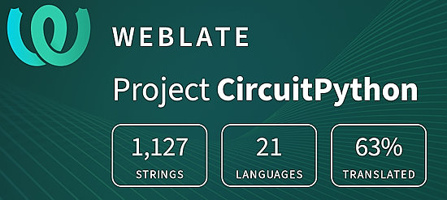](https://hosted.weblate.org/engage/circuitpython/)

One important feature of CircuitPython is translated control and error messages. With the help of fellow open source project [Weblate](https://weblate.org/), we're making it even easier to add or improve translations. 

Sign in with an existing account such as GitHub, Google or Facebook and start contributing through a simple web interface. No forks or pull requests needed! As always, if you run into trouble join us on [Discord](https://adafru.it/discord), we're here to help.

## NUMBER Thanks

The Adafruit Discord community, where we do all our CircuitPython development in the open, reached over NUMBER humans - thank you! Adafruit believes Discord offers a unique way for Python on hardware folks to connect. Join today at [https://adafru.it/discord](https://adafru.it/discord).

## ICYMI - In case you missed it

Python on hardware is the Adafruit Python video-newsletter-podcast! The news comes from the Python community, Discord, Adafruit communities and more and is broadcast on ASK an ENGINEER Wednesdays. The complete Python on Hardware weekly videocast [playlist is here](https://www.youtube.com/playlist?list=PLjF7R1fz_OOXRMjM7Sm0J2Xt6H81TdDev). The video podcast is on [iTunes](https://itunes.apple.com/us/podcast/python-on-hardware/id1451685192?mt=2), [YouTube](http://adafru.it/pohepisodes), [Instagram](https://www.instagram.com/adafruit/channel/)), and [XML](https://itunes.apple.com/us/podcast/python-on-hardware/id1451685192?mt=2).

[The weekly community chat on Adafruit Discord server CircuitPython channel - Audio / Podcast edition](https://itunes.apple.com/us/podcast/circuitpython-weekly-meeting/id1451685016) - Audio from the Discord chat space for CircuitPython, meetings are usually Mondays at 2pm ET, this is the audio version on [iTunes](https://itunes.apple.com/us/podcast/circuitpython-weekly-meeting/id1451685016), Pocket Casts, [Spotify](https://adafru.it/spotify), and [XML feed](https://adafruit-podcasts.s3.amazonaws.com/circuitpython_weekly_meeting/audio-podcast.xml).

## Contribute

The CircuitPython Weekly Newsletter is a CircuitPython community-run newsletter emailed every Monday. The complete [archives are here](https://www.adafruitdaily.com/category/circuitpython/). It highlights the latest CircuitPython related news from around the web including Python and MicroPython developments. To contribute, edit next week's draft [on GitHub](https://github.com/adafruit/circuitpython-weekly-newsletter/tree/gh-pages/_drafts) and [submit a pull request](https://help.github.com/articles/editing-files-in-your-repository/) with the changes. You may also tag your information on Twitter with #CircuitPython. 

Join the Adafruit [Discord](https://adafru.it/discord) or [post to the forum](https://forums.adafruit.com/viewforum.php?f=60) if you have questions.
