- [ ] Library and info updates
- [ ] change date
- [ ] update title
- [ ] Feature story
- [ ] Update  for images
- [ ] Update ICYDNCI
- [ ] All images 550w max only
- [ ] Link "View this email in your browser."

News Sources

- [Adafruit Playground](https://adafruit-playground.com/)
- Twitter: [CircuitPython](https://twitter.com/search?q=circuitpython&src=typed_query&f=live), [MicroPython](https://twitter.com/search?q=micropython&src=typed_query&f=live) and [Python](https://twitter.com/search?q=python&src=typed_query)
- [Raspberry Pi News](https://www.raspberrypi.com/news/)
- Mastodon [CircuitPython](https://octodon.social/tags/CircuitPython) and [MicroPython](https://octodon.social/tags/MicroPython)
- [hackster.io CircuitPython](https://www.hackster.io/search?q=circuitpython&i=projects&sort_by=most_recent) and [MicroPython](https://www.hackster.io/search?q=micropython&i=projects&sort_by=most_recent)
- YouTube: [CircuitPython](https://www.youtube.com/results?search_query=circuitpython&sp=CAI%253D), [MicroPython](https://www.youtube.com/results?search_query=micropython&sp=CAI%253D)
- Instructables: [CircuitPython](https://www.instructables.com/search/?q=circuitpython&projects=all&sort=Newest), [MicroPython](https://www.instructables.com/search/?q=micropython&projects=all&sort=Newest), [Raspberry Pi Python](https://www.instructables.com/search/?q=raspberry+pi+python&projects=all&sort=Newest)
- [python.org](https://www.python.org/)
- [Python Insider - dev team blog](https://pythoninsider.blogspot.com/)
- Individuals: [Jeff Geerling](https://www.jeffgeerling.com/blog)
- Tom's Hardware: [CircuitPython](https://www.tomshardware.com/search?searchTerm=circuitpython&articleType=all&sortBy=publishedDate) and [MicroPython](https://www.tomshardware.com/search?searchTerm=micropython&articleType=all&sortBy=publishedDate) and [Raspberry Pi](https://www.tomshardware.com/search?searchTerm=raspberry%20pi&articleType=all&sortBy=publishedDate)
- [hackaday.io newest projects MicroPython](https://hackaday.io/projects?tag=micropython&sort=date) and [CircuitPython](https://hackaday.io/projects?tag=circuitpython&sort=date)
- [Google News Python](https://news.google.com/topics/CAAqIQgKIhtDQkFTRGdvSUwyMHZNRFY2TVY4U0FtVnVLQUFQAQ?hl=en-US&gl=US&ceid=US%3Aen)
- [hackaday CircuitPython](https://hackaday.com/blog/?s=circuitpython) and [MicroPython](https://hackaday.com/blog/?s=micropython)
- hackaday.io - [CircuitPython](https://hackaday.io/search?term=circuitpython) and [MicroPython](https://hackaday.io/search?term=micropython)

View this email in your browser. **Warning: Flashing Imagery**

Welcome to the latest Python on Microcontrollers newsletter! *insert 2-3 sentences from editor (what's in overview, banter)* - *Anne Barela, Ed.*

We're on [Discord](https://discord.gg/HYqvREz), [Twitter](https://twitter.com/search?q=circuitpython&src=typed_query&f=live), and for past newsletters - [view them all here](https://www.adafruitdaily.com/category/circuitpython/). If you're reading this on the web, [subscribe here](https://www.adafruitdaily.com/). Here's the news this week:

## The Python on Microcontrollers Newsletter exceeds 11,000 subscribers

The Python on Microcontrollers Newsletter exceeded 11,000 subscribers for the last issue! Thank you for subscribing and letting those around you know about this resource! - [Adafruit Blog](https://blog.adafruit.com/2024/05/20/the-python-on-microcontrollers-newsletter-exceeds-11000-subscribers-python-circuitpython-micropython-adafruit/).

The free subscription link is here - [Adafruit Daily](https://www.adafruitdaily.com/) (select Python on Microcontrollers Newsletter).

## Two New CircuitPython Releases

As CircuitPython inches closer to version 9.1.0, a new beta is out as well as a new maintenance release for CircuitPython 9.0.

CircuitPython 9.1.0-beta.3 is a beta for CircuitPython 9.1.0, and is a new unstable release - [Adafruit Blog](https://blog.adafruit.com/2024/05/22/circuitpython-9-1-0-beta-3-released/) and [release notes](https://github.com/adafruit/circuitpython/releases/tag/9.1.0-beta.3).

CircuitPython 9.0.5 is the latest bugfix release of CircuitPython, and it's the latest new stable release - [Adafruit Blog](https://blog.adafruit.com/2024/05/22/circuitpython-9-0-5-released/) and [release notes](https://github.com/adafruit/circuitpython/releases/tag/9.0.5).

## $40 Million Raspberry Pi IPO is Set For June

Raspberry Pi Ltd, the trading subsidiary of the Raspberry Pi Foundation, has confirmed a June 2024 date for its $40 million Initial Public (stock) Offering (IPO) - [Tom's Hardware](https://www.tomshardware.com/raspberry-pi/dollar40-million-raspberry-pi-ipo-is-set-for-june?utm_source=twitter.com&utm_medium=social&utm_campaign=socialflow) and [The Register](https://www.theregister.com/2024/05/22/raspberry_pi_ipo_set_for_june_2024/).

> "New shares will be issued for sale by Raspberry Pi as a means to raise $40 million which will be used for engineering capital expenditure, to enhance the Raspberry Pi supply chain, and for general corporate purposes."

## 500+ Microcontroller Boards Now Run CircuitPython

[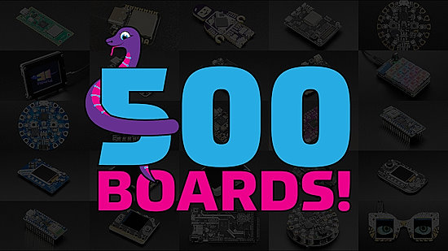](https://circuitpython.org/downloads)

Last week, the number of boards that directly run on CircuitPython exceeded 500! As of this newsletter, it's 503 and climbing - [CircuitPython.org](https://circuitpython.org/downloads).

## Sony Plans a Dedicated Raspberry Pi 5 Productionn Line in Japan Ahead of Raspberry Pi IPO

[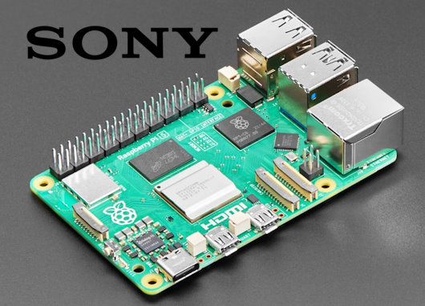](https://www.eenewseurope.com/en/sony-plans-dedicated-raspberry-pi-5-line-ahead-of-ipo/)

Sony is installing a dedicated line in Japan to make the latest Raspberry Pi 5 boards. - [eeNews](https://www.eenewseurope.com/en/sony-plans-dedicated-raspberry-pi-5-line-ahead-of-ipo/).

> “We have agreed with Sony to further expand the existing production at their Inazawa facility and, by the end of 2024, expect them to have established a dedicated production line there for Raspberry Pi 5.”

## Getting an LLM Answer from an RP2040 in 4 Seconds with Groq

Utilizing the cutting-edge technology from Groq and Meta, this project aims to replace traditional response mechanisms on a maker site with a much faster and efficient alternative using an RP2040 connected to Groq's cloud services with MicroPython - [WIZnet Makers](https://maker.wiznet.io/simons/projects/how-to-get-an-answer-to-rp2040-in-3-seconds-with-groq/) and [GitHub](https://github.com/wiznetmaker/Groq_W5100s_EVB_PICO).

## This Week's Python Streams

Python on Hardware is all about building a cooperative ecosphere which allows contributions to be valued and to grow knowledge. Below are the streams within the last week focusing on the community.

**CircuitPython Deep Dive Stream**

[Last Friday](link), Scott streamed work on {subject}.

You can see the latest video and past videos on the Adafruit YouTube channel under the Deep Dive playlist - [YouTube](https://www.youtube.com/playlist?list=PLjF7R1fz_OOXBHlu9msoXq2jQN4JpCk8A).

**CircuitPython Parsec**

John Park’s CircuitPython Parsec this week is on {subject} - [Adafruit Blog](link) and [YouTube](link).

Catch all the episodes in the [YouTube playlist](https://www.youtube.com/playlist?list=PLjF7R1fz_OOWFqZfqW9jlvQSIUmwn9lWr).

**CircuitPython Weekly Meeting**

CircuitPython Weekly Meeting for May 20, 2024 ([notes](https://github.com/adafruit/adafruit-circuitpython-weekly-meeting/blob/main/2024/2024-05-20.md)) [on YouTube](https://youtu.be/wOIkNhBWkLE).

## Project of the Week: The SpaceMouse Wireless

[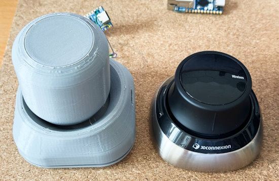](https://taoofmac.com/space/blog/2024/05/18/2000)

The adventure of making a DIY SpaceMouse using USB HID and sensors in CircuitPython - [Tao of Mac](https://taoofmac.com/space/blog/2024/05/18/2000).

## Popular Last Week

What was the most popular, most clicked link, in [last week's newsletter](https://www.adafruitdaily.com/2024/05/20/python-on-microcontrollers-newsletter-circuitpython-new-beta-micropython-on-playdate-pi-pcie-hat-and-more-circuitpython-python-micropython-thepsf-raspberry_pi/)? [Arduino Alvik Robotics Platform // Unboxing](https://www.hackster.io/videos/1591).

## New Notes from Adafruit Playground

[Adafruit Playground](https://adafruit-playground.com/) is a new place for the community to post their projects and other making tips/tricks/techniques. Ad-free, it's an easy way to publish your work in a safe space for free.

Web API's & You - [Adafruit Playground](https://adafruit-playground.com/u/DJDevon3/pages/web-api-s-you).

text - [Adafruit Playground](url).

text - [Adafruit Playground](url).

## News From Around the Web

[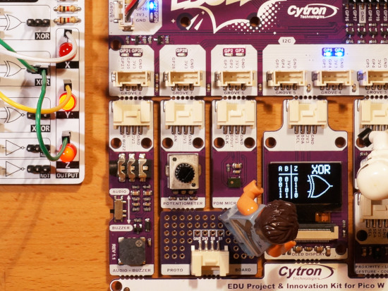](https://www.instructables.com/Logic-Gate-Analyser-With-Cytron-EDU-PICO-or-Adafru/)

A CircuitPython program running on the new [Cytron EDU PICO](https://www.cytron.io/p-edu-project-and-innovation-kits-for-pico-w) and [Adafruit CLUE](https://www.adafruit.com/product/4500) which builds up a truth table and identifies logic gates by observing the inputs and outputs on the gate, demonstrated with an [MH EDU Electronics LogicBoard](https://www.tindie.com/products/mh-edu/logicboard-stem-logic-gates-experimentation-lab/) and an improvised retro [DTL](https://en.wikipedia.org/wiki/Diode%E2%80%93transistor_logic) NOR gate - [Instructables](https://www.instructables.com/Logic-Gate-Analyser-With-Cytron-EDU-PICO-or-Adafru/).

Regular MicroPython contributor Jos Verlinde (@josverl) released his Python application, mpflash. It’s a command-line utility to assist in deploying MicroPython firmware to devices. It can list connected boards, detect and download the appropriate image and flash it to your device - [GitHub](https://github.com/Josverl/micropython-stubber/tree/main/src/mpflash) via [MicroPython May 2024 Meetup News Roundup](https://melbournemicropythonmeetup.github.io/May-2024-Meetup/).

Previously [we posted](https://www.adafruitdaily.com/2024/04/15/python-on-microcontrollers-newsletter-new-mainline-python-versions-new-raspberry-pi-hardware-and-more-circuitpython-python-micropython-thepsf-raspberry_pi/) about the [SESC Workshop](https://www.sescsp.org.br/programacao/capacitacao-em-eletronica-e-programacao-com-circuitpython/), São Paulo, Brazil happening this month. If you'd like to see their CircuitPython code for things like NeoPixel games, the code is available - [GitHub](https://github.com/djairjr/oficina_CircuitPython) (Portuguese and English).

[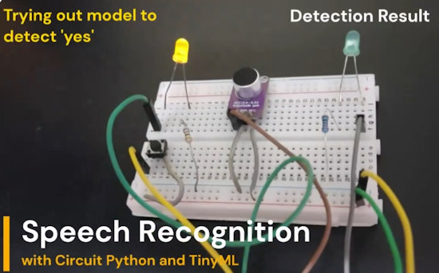](https://x.com/patilsaheb/status/1793000847418294641)

Ashish built a speech recognition project using a Raspberry Pi Pico and CircuitPython. It samples audio from a mic, runs a TinyML model, and tries to identify spoken word - [X](https://x.com/patilsaheb/status/1793000847418294641) and [GitHub](https://github.com/code2k13/pipico_speech_recognition).

MicroPython PR #11869 looks to to add support for the ESP32-C6 - [GitHub](https://github.com/micropython/micropython/pull/11869).

[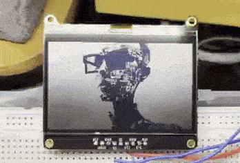](https://x.com/CosminDolha/status/1793404150786523200)

> "Running a few Midjourney images on an Adafruit Sharp Memory Display using a Raspberry Pi Pico W and CircuitPython. The display looks excellent to your eyes, and better than what the iPhone camera captures - [X](https://x.com/CosminDolha/status/1793404150786523200).

[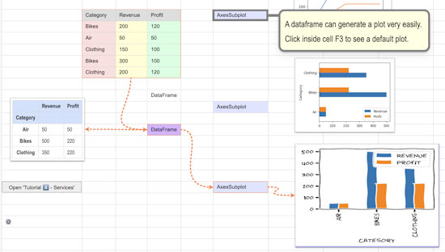](https://pysheets.app/)

PySheets provides a spreadsheet UI for Python, allowing users to perform exploratory data science, use Pandas, create charts with matplotlib, import Excel sheets, analyze data, and create reports. All the Python code runs in the browser, and PySheets itself is also written in Python and MicroPython - [PySheets](https://pysheets.app/).

[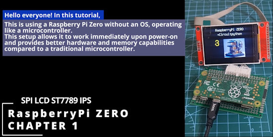](https://www.youtube.com/watch?v=8jqoxfLvHq0)

Using a Raspberry Pi ZERO with an SPI ST7789 display, no operating system (OS), only CircuitPython - [YouTube](https://www.youtube.com/watch?v=8jqoxfLvHq0).

[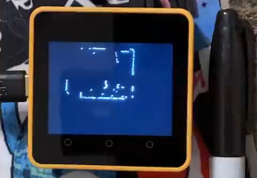](https://github.com/NotMedic/LD06-Lidar-micropython)

Tim McGuffin's library - LD06-Lidar-micropython - is a MicroPython driver for the LD06, one of the more affordable (US$10?!) LIDAR devices - [X](https://x.com/NotMedic/status/17899943055300652720) and [GitHub](https://github.com/NotMedic/LD06-Lidar-micropython) via [MicroPython May 2024 Meetup News Roundup](https://melbournemicropythonmeetup.github.io/May-2024-Meetup/).

[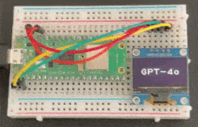](https://x.com/sozoraemon/status/1793956409912266799)

Use the latest GPT-4o LLM with a Raspberry Pi Pico W and MicroPython - [X](https://x.com/sozoraemon/status/1793956409912266799) (Japanese).

[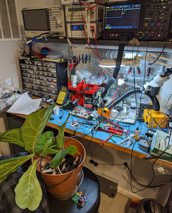](https://hackaday.io/project/193184-tdr-soil-moisture-sensor)

Using a Time Domain Reflectometry (TDR) soil moisture sensor - [hackaday.io](https://hackaday.io/project/193184-tdr-soil-moisture-sensor).

Tutorial: a Raspberry Breadstick persistence of vision (POV) LED project with CircuitPython - [Breadstick](https://learn.breadstick.ca/breadstick/breadsticks/raspberry-breadstick/code-examples/pov-wand) via [X](https://x.com/breadstick_kits/status/1792630119493755161).

[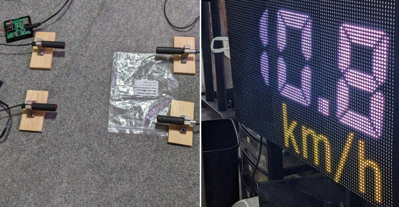](https://x.com/kstakshin/status/1793198595337850998)

> "We prototyped a two-point laser measurement device using an XBee3 built into the LMCM series and an XBee3 attached to a laser receiver.
The signal status is determined using XBee's MicroPython, and the host XBee receives the signal, measures the time, and displays it on the speed gun meter in speed gun format." - [site](https://x.com/kstakshin/status/1793198595337850998) (Japanese).

[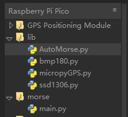](https://github.com/X-MQSI/AutoMorse?tab=readme-ov-file)

AutoMorse is an automatic Morse Code encoder for Raspberry Pi Pico in MicroPython - [GitHub](https://github.com/X-MQSI/AutoMorse?tab=readme-ov-file).

[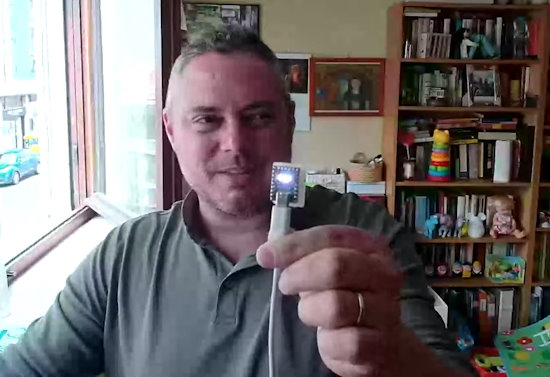](https://www.youtube.com/watch?v=ZeQQxniOFbQ)

Browser PyScript MicroPython communicating with an RP2040-Zero running MicroPython - [YouTube](https://www.youtube.com/watch?v=ZeQQxniOFbQ).

text - [site](url).

text - [site](url).

[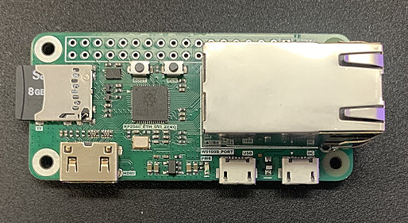](https://maker.wiznet.io/gavinchang/projects/rp2040-eth-dvi-zero-adafruit-io-dashboard-monitor-hdmi-dvi-mode/)

RP2040-ETH-DVI-ZERO, a newly developed Raspberry Pi RP2040 development board with DVI interface and Ethernet, is used to display an Adafruit IO dashboard in real time - [WIZnet Makers](https://maker.wiznet.io/gavinchang/projects/rp2040-eth-dvi-zero-adafruit-io-dashboard-monitor-hdmi-dvi-mode/).

[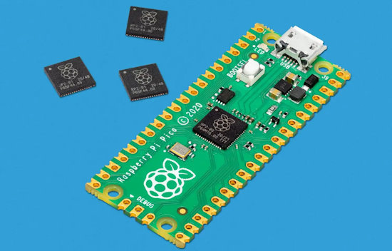](https://www.shekharverma.com/python-raspberrypi-pico-and-pyusb-unlocking-the-power-of-custom-usb-endpoints/)

RaspberryPi PICO and PYUSB: unlocking the power of custom USB endpoints - [Shekkar Verma](https://www.shekharverma.com/python-raspberrypi-pico-and-pyusb-unlocking-the-power-of-custom-usb-endpoints/).

## Coming Soon / New

[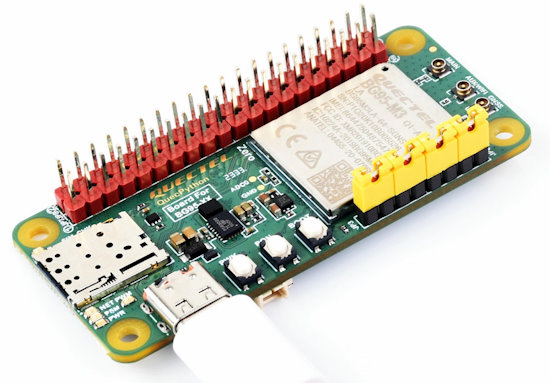](https://www.cnx-software.com/2024/05/21/raspberry-pi-zero-hat-quectel-bg95-m3-zero-cellular-iot-board-quecpython-micropython-firmware/)

Raspberry Pi Zero HAT compatible Quectel BG95-M3 Zero cellular IoT board runs QuecPython MicroPython firmware - [CNX Software](https://www.cnx-software.com/2024/05/21/raspberry-pi-zero-hat-quectel-bg95-m3-zero-cellular-iot-board-quecpython-micropython-firmware/).

text - [site](url).

## New Boards Supported by CircuitPython

The number of supported microcontrollers and Single Board Computers (SBC) grows every week. This section outlines which boards have been included in CircuitPython or added to [CircuitPython.org](https://circuitpython.org/).

This week, there were (#/no) new boards added:

- [Board name](url)
- [Board name](url)
- [Board name](url)

*Note: For non-Adafruit boards, please use the support forums of the board manufacturer for assistance, as Adafruit does not have the hardware to assist in troubleshooting.*

Looking to add a new board to CircuitPython? It's highly encouraged! Adafruit has four guides to help you do so:

- [How to Add a New Board to CircuitPython](https://learn.adafruit.com/how-to-add-a-new-board-to-circuitpython/overview)
- [How to add a New Board to the circuitpython.org website](https://learn.adafruit.com/how-to-add-a-new-board-to-the-circuitpython-org-website)
- [Adding a Single Board Computer to PlatformDetect for Blinka](https://learn.adafruit.com/adding-a-single-board-computer-to-platformdetect-for-blinka)
- [Adding a Single Board Computer to Blinka](https://learn.adafruit.com/adding-a-single-board-computer-to-blinka)

## New Learn Guides

[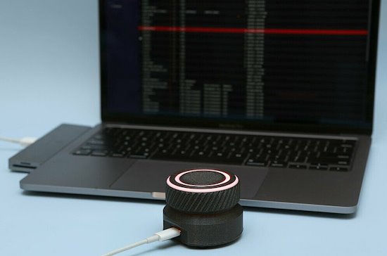](https://learn.adafruit.com/guides/latest)

[USB Rotary Media Dial](https://learn.adafruit.com/usb-rotary-media-dial) from [Ruiz Brothers](https://learn.adafruit.com/u/pixil3d)

[title](url) from [name](url)

## Updated Learn Guides

[title](url)

## CircuitPython Libraries

The CircuitPython library numbers are continually increasing, while existing ones continue to be updated. Here we provide library numbers and updates!

To get the latest Adafruit libraries, download the [Adafruit CircuitPython Library Bundle](https://circuitpython.org/libraries). To get the latest community contributed libraries, download the [CircuitPython Community Bundle](https://circuitpython.org/libraries).

If you'd like to contribute to the CircuitPython project on the Python side of things, the libraries are a great place to start. Check out the [CircuitPython.org Contributing page](https://circuitpython.org/contributing). If you're interested in reviewing, check out Open Pull Requests. If you'd like to contribute code or documentation, check out Open Issues. We have a guide on [contributing to CircuitPython with Git and GitHub](https://learn.adafruit.com/contribute-to-circuitpython-with-git-and-github), and you can find us in the #help-with-circuitpython and #circuitpython-dev channels on the [Adafruit Discord](https://adafru.it/discord).

You can check out this [list of all the Adafruit CircuitPython libraries and drivers available](https://github.com/adafruit/Adafruit_CircuitPython_Bundle/blob/master/circuitpython_library_list.md). 

The current number of CircuitPython libraries is **###**!

**New Libraries**

Here's this week's new CircuitPython libraries:

* [library](url)

**Updated Libraries**

Here's this week's updated CircuitPython libraries:

* [library](url)

**Library PyPI Weekly Download Stats**

## What’s the CircuitPython team up to this week?

What is the team up to this week? Let’s check in:

**Dan**

I released CircuitPython 9.0.5 and CircuitPython 9.1.0-beta.3 last week. 9.0.5 caught up on some minor fixes. 9.1.0-beta.3 includes the more complete Espressif BLE implementation that Scott has been working on.

Socket error recovery in our libraries has been improved thanks to our community members, especially Justin. I'm now trying to reproduce various network errors that have been reported, to see if they are still present when using the latest versions of everything. 

**Melissa**

I've been out sick a bunch during the past couple of weeks, so I didn't get a chance to put in an update in last week's newsletter. Otherwise, I've been working on an update to the [CircuitPython Code Editor](https://code.circuitpython.org/) to allow easier file operations for USB connected devices via the REPL. Currently it works on USB devices via the FileSystem API, but this requires a lot of things to be done by the user to make it work correctly and this will simplify things by only requiring a serial connection.

**Tim**

This week I've been working on Circup, there are a few small issues caused by the recent refactoring that I'm fixing. I've also been writing new and updated documentation pages in the Circup learn guide that detail all of it's features, many of which are newer and weren't documented in the guide yet. Tangential to circup I'm also working on a CLI tool for managing files on Circuitpython devices via web workflow.

**Jeff**

text.

**Scott**

This week I've started working on ESP BLE bonding support. However, I've been a bit distracted by my Python-based build system for embedded C (like CircuitPython.) My hope is to make it easier to maintain and refactor the build logic for CircuitPython.

**Liz**

This week I wrote up a guide for the [Tripler PiCowbell](https://learn.adafruit.com/adafruit-proto-tripler-picowbell). This lets you use two PiCowbells with a Pico. It also has a JST PH port for battery power, a STEMMA QT port and an EYESPI port for easily using an SPI display. Personally, I'm very excited about the EYESPI port. EYESPI has become one of my favorite features on Adafruit hardware.

I also wrote some CircuitPython code for the [USB Rotary Media Dial project](https://learn.adafruit.com/usb-rotary-media-dial) This was a collab with Noe. He wanted to remake the [original media dial project](https://learn.adafruit.com/media-dial) to use a seesaw rotary encoder, which greatly simplifies the code and the assembly. We added variables at the top of the code to make it easy for folks to customize the HID shortcuts. We also made use of the long press and short press count features in the [adafruit_debouncer library](https://docs.circuitpython.org/projects/debouncer/en/latest/api.html#adafruit_debouncer.Button).

## Upcoming Events

Open Sauce, the Maker extravaganza, is returning to San Francisco, California June 15-16 - [Open Sauce](https://opensauce.live/).

The next MicroPython Meetup in Melbourne will be on June 26 – [Meetup](https://www.meetup.com/micropython-meetup/events). You can see recordings of previous meetings on [YouTube](https://www.youtube.com/@MicroPythonOfficial). 

EuroPython is the oldest and longest running volunteer-led Python programming conference on the planet. This year it will be held July 8-14 in Prague - [EuroPython 2024](https://ep2024.europython.eu/).

PyOhio is being held July 27-28, 2024 in Cleveland, Ohio - [PyOhio](https://www.pyohio.org/2024/).

Espressif DevCon24 will be held Sep 3-5, 13:00-18:00 CEST. Call for presentations now - [Espressif](https://devcon.espressif.com/).

**Send Your Events In**

If you know of virtual events or upcoming events, please let us know via email to cpnews(at)adafruit(dot)com.

## Latest Releases

CircuitPython's stable release is [#.#.#](https://github.com/adafruit/circuitpython/releases/latest) and its unstable release is [#.#.#-##.#](https://github.com/adafruit/circuitpython/releases). New to CircuitPython? Start with our [Welcome to CircuitPython Guide](https://learn.adafruit.com/welcome-to-circuitpython).

[2024####](https://github.com/adafruit/Adafruit_CircuitPython_Bundle/releases/latest) is the latest Adafruit CircuitPython library bundle.

[2024####](https://github.com/adafruit/CircuitPython_Community_Bundle/releases/latest) is the latest CircuitPython Community library bundle.

[v#.#.#](https://micropython.org/download) is the latest MicroPython release. Documentation for it is [here](http://docs.micropython.org/en/latest/pyboard/).

[#.#.#](https://www.python.org/downloads/) is the latest Python release. The latest pre-release version is [#.#.#](https://www.python.org/download/pre-releases/).

[#,### Stars](https://github.com/adafruit/circuitpython/stargazers) Like CircuitPython? [Star it on GitHub!](https://github.com/adafruit/circuitpython)

## Call for Help -- Translating CircuitPython is now easier than ever

[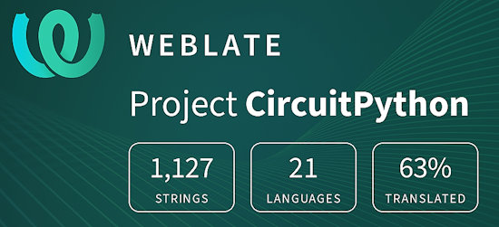](https://hosted.weblate.org/engage/circuitpython/)

One important feature of CircuitPython is translated control and error messages. With the help of fellow open source project [Weblate](https://weblate.org/), we're making it even easier to add or improve translations. 

Sign in with an existing account such as GitHub, Google or Facebook and start contributing through a simple web interface. No forks or pull requests needed! As always, if you run into trouble join us on [Discord](https://adafru.it/discord), we're here to help.

## NUMBER Thanks

The Adafruit Discord community, where we do all our CircuitPython development in the open, reached over NUMBER humans - thank you! Adafruit believes Discord offers a unique way for Python on hardware folks to connect. Join today at [https://adafru.it/discord](https://adafru.it/discord).

## ICYMI - In case you missed it

Python on hardware is the Adafruit Python video-newsletter-podcast! The news comes from the Python community, Discord, Adafruit communities and more and is broadcast on ASK an ENGINEER Wednesdays. The complete Python on Hardware weekly videocast [playlist is here](https://www.youtube.com/playlist?list=PLjF7R1fz_OOXRMjM7Sm0J2Xt6H81TdDev). The video podcast is on [iTunes](https://itunes.apple.com/us/podcast/python-on-hardware/id1451685192?mt=2), [YouTube](http://adafru.it/pohepisodes), [Instagram](https://www.instagram.com/adafruit/channel/)), and [XML](https://itunes.apple.com/us/podcast/python-on-hardware/id1451685192?mt=2).

[The weekly community chat on Adafruit Discord server CircuitPython channel - Audio / Podcast edition](https://itunes.apple.com/us/podcast/circuitpython-weekly-meeting/id1451685016) - Audio from the Discord chat space for CircuitPython, meetings are usually Mondays at 2pm ET, this is the audio version on [iTunes](https://itunes.apple.com/us/podcast/circuitpython-weekly-meeting/id1451685016), Pocket Casts, [Spotify](https://adafru.it/spotify), and [XML feed](https://adafruit-podcasts.s3.amazonaws.com/circuitpython_weekly_meeting/audio-podcast.xml).

## Contribute

The CircuitPython Weekly Newsletter is a CircuitPython community-run newsletter emailed every Monday. The complete [archives are here](https://www.adafruitdaily.com/category/circuitpython/). It highlights the latest CircuitPython related news from around the web including Python and MicroPython developments. To contribute, edit next week's draft [on GitHub](https://github.com/adafruit/circuitpython-weekly-newsletter/tree/gh-pages/_drafts) and [submit a pull request](https://help.github.com/articles/editing-files-in-your-repository/) with the changes. You may also tag your information on Twitter with #CircuitPython. 

Join the Adafruit [Discord](https://adafru.it/discord) or [post to the forum](https://forums.adafruit.com/viewforum.php?f=60) if you have questions.
